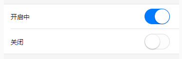

### list布局



```vue
<view class="uni-list">
    <view class="uni-list-cell uni-list-cell-pd">
        <view>开启中</view>
        <switch checked />
    </view>
    <view class="uni-list-cell uni-list-cell-pd">
        <view class="uni-list-cell-db">关闭</view>
        <switch />
    </view>
</view>
```

> 列表采用弹性布局，纵向排布。而列表项也采用弹性布局，为两端对齐且垂直居中的形式。此外，通过 `left` 和 `right` 控制伪元素长度。

```less
/* 列表 */
.uni-list {
	background-color: #FFFFFF;
	position: relative;
	width: 100%;
	display: flex;
	flex-direction: column;
}
/* 列表前的横线 */
.uni-list::before {
    position: absolute;
    z-index: 10;
    right: 0;
    top: 0;
    left: 0;
    height: 1px;
    content: '';
    -webkit-transform: scaleY(.5);
    transform: scaleY(.5);
    background-color: #c8c7cc;
}
/* 列表后的横线 */
.uni-list:after {
	position: absolute;
	z-index: 10;
	right: 0;
	bottom: 0;
	left: 0;
	height: 1px;
	content: '';
	-webkit-transform: scaleY(.5);
	transform: scaleY(.5);
	background-color: #c8c7cc;
}
/* 列表项 */
.uni-list-cell {
	position: relative;
	display: flex;
	flex-direction: row;
	justify-content: space-between;
	align-items: center;
}
/* 列表项后的横线 */
.uni-list-cell::after {
	position: absolute;
	z-index: 3;
	right: 0;
	bottom: 0;
	left: 30rpx;
	height: 1px;
	content: '';
	-webkit-transform: scaleY(.5);
	transform: scaleY(.5);
	background-color: #c8c7cc;
}
/* 最后的列表项后取消横线 */
.uni-list .uni-list-cell:last-child::after {
	height: 0rpx;
}
/* 列表项的标准内边距 */
.uni-list-cell-pd {
	padding: 22rpx 30rpx;
}

```

#### 通过类名设置必填表单项

```vue
<view class="uni-list">
  <view class="uni-list-cell uni-list-cell-pd">
    <view class="required">费用科目名称</view>
    <picker>
      <view>请选择费用科目</view>
    </picker>
  </view>
</view>
```

`main.css`

```css
/* 通过父类限制类的生效，避免作用域混淆 */
.uni-list-cell-pd > .required:before{
	content:"*";
	color:red;
	font-size: 30rpx;
	margin-right:5rpx;
	line-height:40rpx;
}
```

#### 选择器触发文本添加后置图标

`main.css`

```css
.cu-form-group picker {
	padding-right: 40rpx;
	overflow: hidden;
	position: relative;
}
.cu-form-group picker::after {
	font-family: cuIcon;
	display: block;
	content: "\e6a3";
	position: absolute;
	font-size: 34rpx;
	color: #8799a3;
	line-height: 100rpx;
	width: 60rpx;
	text-align: center;
	top: 0;
	bottom: 0;
	right: -20rpx;
	margin: auto;
}
```


### 常用公共样式

> 导入 App.vue 或直接写进去。

```less
// 单行隐藏
.text-ellipsis {
  overflow: hidden; //超出的文本隐藏
  text-overflow: ellipsis; //溢出用省略号显示
  white-space: nowrap; //溢出不换行
}

// 两行隐藏
.text-ellipsis-two {
  text-overflow: -o-ellipsis-lastline;
  overflow: hidden;
  text-overflow: ellipsis;
  display: -webkit-box;
  -webkit-line-clamp: 2;
  line-clamp: 2;
  -webkit-box-orient: vertical;
}

// 清理浮动
.clearfix {
  zoom: 1;
  &:after {
    height: 0;
    overflow: hidden;
    display: block;
    content: '';
    clear: both;
  }
}

// 去除多余边界
button::after {
  border: none;
}
```


