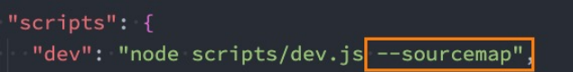

## Vue3初体验

### 对比Vue2的进步

 <span style="color: #da9330">更好的性能、更小的包体积、更好的TypeScript集成、更优秀的API设计。</span>


<span style="font-weight: 600">源码</span>

Vue3的源码全部使用TypeScript来进行重构

<span style="font-weight: 600">性能</span>

Vue2使用Object.defineProperty来劫持数据的getter和setter方法，缺陷是给对象添加/删除属性时，无法劫持和监听，需要借助 `$set`、 `$delete` 这些方法。

Vue3使用Proxy来实现数据的劫持。

<span style="font-weight: 600">删除</span>

如filter

<span style="font-weight: 600">编译优化</span>

生成Block Tree、Slot编译优化、diff算法优化

<span style="font-weight: 600">新的API</span>

- 由 Option API到 Composition API

​    使用 Option API可能导致代码的内聚性非常差，比如created中会使用某一个method来修改data的数据

Composition API 可以将相关代码放在一起进行处理

- 使用Hooks函数增加代码的复用性

​    类似于mixins，将一部分独立的逻辑抽取出去，且做到响应式


### 引入Vue的方式

 <span style="color: #da9330">Vue的本质，就是一个Javascript的库。</span>

- 在页面通过CDN的方式引入

  ```react
  <script src="https://unpkg.com/vue@next"></script>
  ```

- 下载Vue的JS文件，并引入

- 通过npm安装使用

- 通过Vue-Cli创建项目后使用


### 介绍CDN引入

<span style="color: #da9330">内容分发网络</span>

- 通过相互连接的网络系统，能利用到<span style="color: #f7534f;font-weight:600">最靠近</span>每个用户的服务器
- 更快、更可靠地将音乐、图片及其它文件这些<span style="color: #f7534f;font-weight:600">资源</span>发送给用户
- 来提供高性能、可扩展性及低成本的网络内容传递给用户

:whale: 如果将资源部署到处于北京的服务器，那么北京的用户能更快访问到资源。


请求资源：用户→边缘节点→ 父节点→ 源站

获取资源：用户←边缘节点← 父节点← 源站

:ghost:每个节点其实都是一个服务器，用户请求资源时，会去下一级服务器查看是否有缓存，若有缓存，因为离得近，效率会很高。


### Vue3初体验

```html
<body>
  <div id="app"></div>
  <script src="https://unpkg.com/vue@next"></script>
  <script>
    const obj = {
      template: '<div>123</div>'
    }
    const app = Vue.createApp(obj);
    app.mount("#app")
  </script>
</body>
```

:ghost: `Vue.createApp` 接受一个对象，返回一个实例，通过 `mount` 挂载到对应元素上。

:turtle: 实例的 `mount` 方法内部自己会调用 `document.querySelector` 方法并替换掉对应元素的 `innerHTML`。

 

### 引入Vue的JS文件

```html
<body>
  <div id="app"></div>
  <script src="../js/vue.js"></script>
  <script>
    const app = Vue.createApp({
      template: '<div>123</div>'
    }).mount("#app")
  </script>
</body>
```

:whale: CDN引入的路径可以直接在浏览器访问，其内容就是库的源码。

:flipper: 可以通过链式编程来使用 Vue。


### 原生计数器

```html
<body>
    <h2 class="counter">0</h2> 
    <button class="increment">+1</button> 
    <button class="decrement">-1</button> 
    
  <script>
  // 1. 获取所有元素
  const counterEl = document.querySeletor(".counter");
  const incrementEl = document.querySeletor(".increment");
  const decrementEl = document.querySeletor(".decrement");
  
  // 2. 定义变量
  let counter = 100;
  counterEl.innerHTML = counter;
  
  // 3. 监听按钮的点击
  incrementEl.addEventListener('click', () => {
    counter += 1;
    counterEl.innerHTML = counter;
  })
  decrementEl.addEventListener('click', () => {
    counter -= 1;
    counterEl.innerHTML = counter;
  })
  </script>
</body>
```

:turtle: 通过元素的 `innerHTML` 来更改其子节点。


### template写法

#### 写法一

```html
<body>
  <div id="app"></div>

  <script src="../js/vue.js"></script>
  <script>
    Vue.createApp({
      template: `
        <div>
          <h2>内容1</h2>
          <h2>内容2</h2>
        </div>
      `,
    }).mount('#app');
  </script>
</body>
```


#### 写法二

```html
<body>
  <div id="app"></div>

  <script type="x-template" id="demo">
    <div>
      <h2>内容1</h2>
      <h2>内容2</h2>
    </div>
  </script>

  <script src="../js/vue.js"></script>
  <script>
    Vue.createApp({
      template: '#demo',
    }).mount('#app');
  </script>
</body>
```

:star2:当 `template` 接受 `#` 开头的字符串时，会调用 `document.querySelector`。


#### 写法三

```html
<body>
  <div id="app"></div>

  <template id="demo">
    <div>
      <h2>内容1</h2>
      <h2>内容2</h2>
    </div>
  </template>

  <script src="../js/vue.js"></script>
  <script>
    Vue.createApp({
      template: '#demo',
    }).mount('#app');
  </script>
</body>
```

:ghost: 使用 div 代替 template 也可以实现挂载，但 template  能够做到本身被浏览器解析却不被渲染。


### 录—methods

methods属性中定义的方法不应该使用箭头函数的形式，这会导致 `this` 不能按照期望指向组件实例，它会指向定义它的上级作用域，即 `window`。


若使用普通函数的方式，Vue内部会做这么一件事情：

```less
遍历 methods，将方法作为 key
bind 会返回一个将调用者的 this 指向首参（对象）的方法
当调用模板中的 @click="dos" 时，调用的就是 ctx[dos]
```

```react
const publicThis = instance.proxy // 代理，其中包含了实例的属性（如data中的数据）

for(const key in methods) {
  ctx[key] = key.bind(publicThis)
}
```


### 异—选项data必须为函数

在 Vue2，根对象实例的 data 可以为对象，但在 Vue3 中不允许。

### 异—template中允许存在多个根元素

这在 Vue2 中时不允许的。


### 声明式VS命令式

 <span style="color: #da9330">两种不同的编程范式。</span>

命令式编程：关注于<span style="color: #f7534f;font-weight:600">怎么做</span> ，如一般的原生开发

命令式编程：关注于<span style="color: #f7534f;font-weight:600">做什么</span> ， 一般由框架（机器）完成<span style="color: #f7534f;font-weight:600">怎么做</span>的过程，如 Vue、React。


### 查看 Vue 的源码

- 第一步：在 GitHub 对应[地址](https://github.com/vuejs/core)，下载源代码

  ```less
  1. 选中Tags的首个非beta版本(不稳定)
  
  2. Download ZIP
  
  3. 解压
  ```

- 第二步：安装依赖

  ```elm
  cnpm install pnpm -g
  ```

  > 记录安装路径
  
  在安装路径或上级尝试下面的命令直至有结果，记录目标路径
  
  ```elm
  pnpm -v
  ```
  
  > 将目标路径添加到用户变量/系统变量的Path中
  
  ```elm
  pnpm install
  ```
  
  :whale: 限制了只能使用这种包管理工具进行依赖安装
  
  ```elm
  git init
  git add .
  git commit -m "fix(install): install dep"
  ```

​      :octopus: 由于项目进行了代码检测的一些配置，故需要上述操作，否则会报错

- 第三步：开启映射后，进行打包

  

  ```elm
  npm run dev
  ```

- 第四步：可以在项目下新建一个 `html`，引入 `packages/vue/dist/vue.global.js` 进行调试代码

​      :star2: 映射以后通过 `debugger` 可以进入到具体的代码文件中。


## Vue3基础语法一


### 补—模板语法

#### 双大括号语法

```react
<!-- 允许-表达式 -->
<span>{{ isShow? 1 : 2 }}</spanspan>
<!-- 错误—赋值语句 -->
<span>{{ var a = 1 }}</spanspan>
<!-- 错误—条件语句 -->
<span>{{ if(1) { return 2 } }}</spanspan>
```


### 基本指令

#### v-once

```react
<!-- 初次渲染后，所有的子组件（节点）不随数据源变化而变化，可用于优化性能 -->
<div v-once>{{ num }}</div>
<!-- 随事件变化 -->
<div>{{ num }}</div>
<button @click="num++">+1</button>
```


### 动态属性

```react
<div :[name]="value">哈哈哈</div>

data() {
  return {
    name: "cba",
    value: "kobe"
  }
}

<!-- 解析渲染后的效果 -->
<div cba="kobe">哈哈哈</div>
```


### 添加多个属性

> 可以将对象上的属性一次性添加到标签上。

```react
<div v-bind="info">哈哈哈哈</div>

data() {
  return {
    info: {
      name: "why",
      age: 18,
    }
  }
}

<!-- 解析渲染后的效果 -->
<div name="why" age="18">哈哈哈</div>
```


### v-on

```react
<!-- 绑定一个表达式: inline statement -->
<button @click="counter++">{{counter}}</button>
<button @click="modelView = true">展开</button>

<!-- 绑定一个对象: 一次添加多个事件监听 -->
<div class="area" v-on="{click: btn1Click, mousemove: mouseMove}"></div>
```


### 遍历数字

```react
<ul>
  <li v-for="(num, index) in 10">{{num}}-{{index}}</li>
</ul>
```


### VNode 和 虚拟DOM

- VNode 即<span style="color: #ed5a65">虚拟节点</span>，本质是一个 JavaScript 对象。
- 它为元素（标签）在 Vue 中的表现。
- 转化过程:  template -> VNode -> 真实DOM
- 如果不只是一个简单的div，而是有一大堆的元素，那么它们应该会形成一个 VNode Tree ,即<span style="color: #ed5a65">虚拟DOM</span>

```react
// template,像 v-on, v-if, {{ }} 这些无法被浏览器直接解析
<div class="title" style="font-size: 30px; color: red;">虎虎生威</div>

// VNode
const vnode = {
  type: "div",
  props: {
    class: "title",
    style: {
      "font-size": "30px",
      color: "red",
    },
  },
  children: "虎虎生威"
}
```

