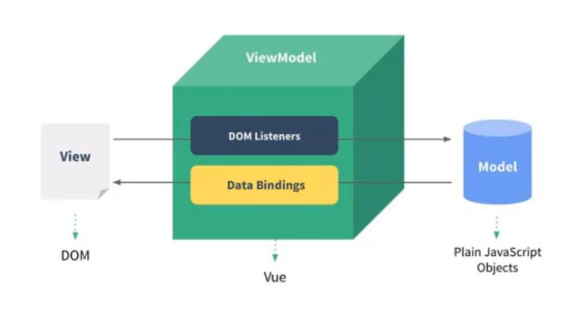
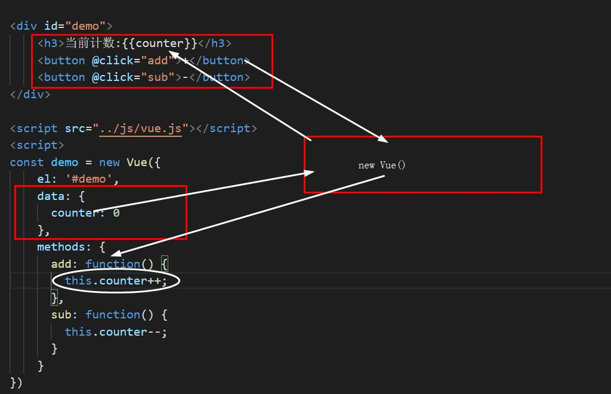

## 简单栗子

```react
/* HTML */
<script src="https://cdn.staticfile.org/vue/2.6.11/vue.min.js"></script>

<div id="demo">
  <p>{{text}}</p>
</div>

/* Vue */
const demo = new Vue({    // 新建 Vue 对象实例
  el: '#demo',            // 用于挂载被管理的元素，可以是string（CSS 选择器）或 Element
  data: {                 // 定义数据
    text: 'Hey, man!'  
  }
})
```

:snowflake: 所有的挂载元素的 innerHTML 会被 Vue 生成的 DOM 替换。因此不推荐挂载 root 实例到 <html> 或者 <body> 上。

:herb: Vue 能管理挂载元素及其 DOM 结构上其子树的内容。


## Vue列表显示

```react
/* HTML */
<div id="demo">
  <p>{{text}}</p>
  <ul>
    <li v-for="item of colors">{{item}}</li>  // 迭代数组，并将每一个元素解析到对应位置
  </ul>
</div>

/* Vue */
const demo = new Vue({
  el: '#demo',
  data: {
    text: 'Hey, man!',
    colors: ['red','yellow','blue','slategrey']
  }
})
```

:snowflake: Vue 实例内部的 option 之间以 `,` 分隔，其中的 data 内部同样以 `,` 分隔。
:snowflake: 最强大的地方在于它可以通过在控制台对 `demo.colors` 使用数组方法来控制列表。
:snowflake: Vue 实例也代理了 data 对象上所有的 property，因此访问 `vm.a` 等价于访问 `vm.$data.a`。


## 一次性计数器

```react
/* HTML */
<div id="demo">
  <h3>当前计数:{{counter}}</h3>
  <button v-on:click="add">+</button>
  <button @click="counter--">-</button>    // 直接对 data 中的数据进行操作
</div>

/* Vue */
const demo = new Vue({
  el: '#demo',
  data: {
    counter: 0
  },
  methods: {            // 用于在 Vue 对象中定义方法；为对象类型
    add: function() {
          this.counter++;
    }
  } 
})
```

:snowflake:  `v-on:` ，用于监听某个元素的点击事件，可以简写为 `@` 。
 :snowflake: data 中的数据用到 Vue 对象的其他选项中需要加前缀 `this.` ，加到 HTML 元素中，则不需要。
 :bug: data 内部的最后不要加上 `;`，会导致一些问题。


## Vue中的MVVM

[](https://github.com/SpringLoach/Vue/blob/main/learning/img/MVVM-1.jpg)

- View层：视图层
- Model层：数据层
- VueModel层：视图模型层
  - 实现了数据绑定，将 Model 的改变**实时**的反应到 View 中
  - 实现了 DOM 的事件监听。当 DOM 中发生一些事件时，会被它监听到，并在需要的情况下改变对应的 Data

[](https://github.com/SpringLoach/Vue/blob/main/learning/img/MVVM-2.jpg)

## 生命周期钩子

> 每个 Vue 实例在被创建时都要经过一系列的初始化过程，在这些过程当中也会运行一些叫做生命周期钩子的函数，可以给这些钩子**添加函数**，它们将会被用作回调。

```react
/* Vue */
const demo = new Vue({
  el: '#demo',
  created: function() {
    console.log('created');
  }
})
```


## 插值

### 文本

> 即 Mustache 语法 (双大括号)，会将数据解释为普通文本。

```react
<div id="demo">
    <h3>{{type + ' ' + name}}</h3>
    <h3>明年{{counter + 1 + '岁'}}</h3>
</div>

/* Vue */
const demo = new Vue({
    el: '#demo',
    data: {
        type: 'dog',
        name: 'sunny',
        counter: 17
    }
})
```

### v-once

> 能执行首次的插值，但当数据改变时，插值处的内容不会更新。

```react
<div id="demo">
    <h3 v-once>{{message}}</h3>
</div>
```

### v-html

> 可以把内容当作原始 HTML 真正地输出。

```react
<p v-html="url"></p>

/* Vue */
const demo = new Vue({
    ...
    data: {
        url: '<a href="www.bilibili.com">bilibili</a>'
    }
})
```

:bug:  **绝不要**对用户提供的内容使用插值，很容易导致 XSS 攻击。

### v-text

> 更新（替换）元素的 textContent。

```react
<p v-text="lalala">被替代了</p>
```

### v-pre

> 跳过这个元素和它的子元素的编译过程。可以用来显示原始 Mustache 标签，就像是取消了数据绑定。

```react
<span v-pre>{{ this will not be compiled }}</span>
```

### v-cloak

> 保持在元素上直到关联实例结束编译（即消失）。

这个指令可以隐藏未编译的 Mustache 标签直到实例准备完毕。

```react
/* CSS */
[v-cloak] {
  display: none;
}

/* HTML */
<div v-cloak>
  {{ message }}
</div>
```

:snowflake:  届时，当网页卡顿时，就不会将未编译的 Mustache 标签显示出来。

### 动态绑定属性

> 使用 `v-bind` 指令，可以按需求更新属性的值。

```react

<a :href="aHref">某个网站</a>

/* Vue */
const demo = new Vue({
    ...
    data: {
        myImg: '<a href="www.bilibili.com">bilibili</a>',
        aHref: 'wwww.bilibili.com'
    }
})
```

:snowflake:  `v-bind` 的语法糖形式为 `:`

#### 动态绑定属性_布尔属性

```react
// 布尔属性
<button :hidden="isActive">Button</button>

/* Vue */
const demo = new Vue({
  ...
  data: {
    isActive: true
  }
})
```

:snowflake:  如果 isActive 的值是 null、undefined 或 false，则对应的布尔属性不会被包含在渲染出来的 <button> 元素中。

### 绑定class

> 在将 `v-bind` 用于 `class` 和 `style` 时，Vue.js 做了专门的增强。表达式结果的类型除了字符串之外，还可以是对象或数组。

#### 绑定class_对象语法

```react
// 对象语法
<p :class="{active: isActive}">abc</p>
// 和普通的类可以同时存在，不冲突
<p class="top" :class="{active: isActive, line: isLine}">def</p>

// 嫌长可以将对象抽出来
<p class="top" :class="getClasses()">def</p>

// 添加事件处理程序
<button v-on:click="btnClick">按钮</button>

/* Vue */
const demo = new Vue({
    ...
    data: {
        isActive: true,
        isLine: false
    },
    methods: {
        btnClick: function() {
            this.isActive = !this.isActive
        },
        getClasses: function() {
            return {active: this.isActive, line: this.isLine}
        }
    }
})
```

#### 绑定class_数组语法

```react
<p  class="app" :class="['top', class1]">asdf</p>

/* Vue */
const demo = new Vue({
  ...
  data: {
    class1: 'active'
  }
})
```

### 绑定style

#### 绑定style_对象语法

| 对象  | 键     | 值                     |
| ----- | ------ | ---------------------- |
| class | 类名   | 布尔值（变量）         |
| style | 属性名 | 属性值（字符串或变量） |

```react
<p :style="{fontSize: '50px'}">abc</p>
<p :style="{fontSize: fontSize, color: currentColor}">abc</p>
<p :style="style1">abc</p>
<p :style="{fontSize: fontSize2 + 'px'}">abc</p>
      
/* Vue */
const demo = new Vue({
    ...
    data: {
        fontSize: '50px',
        fontSize2: 50,
        currentColor: 'red',
        style1: {
            fontSize: '50px',
            color: 'red'
        }
    }
})      
```

:snowflake: 属性用驼峰式大小写。
:snowflake: 对于对象中的值，加引号视为字符串，否则视作变量。

#### 绑定style_数组语法

> 可以将多个样式对象应用到同一个元素上。

```react
<div v-bind:style="[style1, style2]"></div>
```


## 计算属性

> 对于任何复杂逻辑，都应当使用计算**属性**。

```react
/* HTML */
<p>{{fullName}}</p>
<p>{{getFullName()}}</p>

/* Vue */
const demo = new Vue({
    ...
    data: {
        firstName: 'Li',
        lastName: 'Yeoo'
    },
    computed: {
        fullName: function() {
            return this.firstName + ' ' + this.lastName
        }
    },
    methods: {    
        getFullName() {     // ES6语法糖
            return this.firstName + ' ' + this.lastName
        }
    }
})  
```

:snowflake: 不同于 `methods`，写在 HTML 中的计算属性，不用加括号。
:snowflake: 在取名时，计算属性与方法也会存在一些差别。

计算属性默认只有 `getter`，不过在需要时你也可以提供一个 `setter`。

```react
computed: {
  fullName: {
    get: function () {
      return this.firstName + ' ' + this.lastName
    },
    set: function (newValue) {
      var names = newValue.split(' ')
      this.firstName = names[0]
      this.lastName = names[names.length - 1]
    }
  }
}
```

### 计算属性缓存 vs 方法

> 使用计算属性可以节省性能开销。

- 计算属性是基于它们的响应式依赖进行**缓存**的。只在相关响应式依赖发生改变时它们才会重新求值。
- 每当触发重新渲染时，调用方法将总会再次执行函数。

## 事件参数

> 对于复杂的事件处理逻辑，可以在 `methods` 对象中定义方法。

```react
/* 方法不需要参数，可以省略括号 */
<button @click="btnClick()">按钮</button>
<button @click="btnClick">按钮</button>

/* 方法需要参数 */
<button @click="btnClick(123)">按钮</button>
<button @click="btnClick()">按钮</button>      // undefined
<button @click="btnClick">按钮</button>        // 默认将 event 事件对象作为参数

/* 方法需要 event 事件对象和其他参数 */
<button @click="btnClick(123，$event)">按钮</button>
```

:snowflake: 可以用特殊变量 `$event` 把原始的 DOM 事件对象传入方法。

## v-on的修饰符

```react
<button @keyup.enter="onEnter">按钮</button>

<!-- 修饰符可以串联，结果受顺序影响 -->
<a v-on:click.stop.prevent="doThat"></a>
```

| 修饰符               | 说明                                                         |
| -------------------- | ------------------------------------------------------------ |
| .native              | 监听组件根元素的原生事件                                     |
| .stop                | 阻止事件冒泡                                                 |
| .prevent             | 阻止默认行为，可不接事件处理程序                             |
| .once                | 只触发一次回调                                               |
| .capture             | 注册捕获模式的处理程序                                       |
| .self                | 事件处理程序不能由内部元素触发                               |
| .{keyCode\|keyAlias} | 监听特定按键                                                 |
| .enter               | 按键修饰符，还有[其它](https://cn.vuejs.org/v2/guide/events.html#按键码) |
| .ctrl                | 系统修饰符，配合[对应键](https://cn.vuejs.org/v2/guide/events.html#系统修饰键)才能触发鼠标、键盘监听器 |
| .left                | 限制处理函数仅响应[特定的](https://cn.vuejs.org/v2/guide/events.html#鼠标按钮修饰符)鼠标按钮 |

## 条件渲染

> 需要多个方案时，指令用到不同的同胞节点上。

```react
/* HTML */
<p v-if="score>90">优秀</p>
<p v-else-if="score>80">良好</p>
<p v-else-if="score>60">及格</p>
<p v-else>不及格</p>
      
/* Vue */
data: {
  score: 87
}     
```

:snowflake: 这种情况用 `计算属性` 处理更合适，但是如果需要渲染不同的**模板**，可能就需要用到条件渲染。

### 用 key 管理可复用的元素

> Vue 会尽可能高效地渲染元素，通常会复用已有元素而不是从头开始渲染。

```react
<template v-if="loginType === 'username'">
  <label>Username</label>
  <input placeholder="Enter your username" key="username-input">  // 拥有不同 key 值的元素将不会复用
</template>
<template v-else>
  <label>Email</label>
  <input placeholder="Enter your Email">  
</template>
...
```

:snowflake: 由于添加了 `key`，每次切换时，输入框都将被重新渲染。

### v-if vs v-show

> `v-show` 指令也是根据条件展示元素，但它不支持 `<template>` 元素。

| 修饰符 | 说明                             | 优势                           |
| ------ | -------------------------------- | ------------------------------ |
| v-if   | 初始渲染时条件为假，则什么也不做 | 较少的初始渲染开销             |
| v-show | 简单地切换元素的 `display` 属性  | 较少的切换开销，利于频繁地切换 |

## v-for遍历数组和对象

格式：`item in items`

```react
/* 遍历数组 */
<li v-for="item in niuEr">{{item}}</li>

<li v-for="(item, index) in niuEr">{{item}}-{{index}}</li>

/* 遍历对象 */
<li v-for="value in niuEr">{{item}}</li>

<li v-for="(value, key, index) in niuEr">{{item}}</li>

/* Vue */
data: {
  niuEr: {
    Name: 'pangNiu',
    age: 23,
    school: 'shenDa University'
  }
}
```

> 其中作为参数的 item 等，可以用其它变量表示。

### 维护状态

> 使用 `key` 是为了某些情况能更高效的更新虚拟 DOM。

当 Vue 正在更新使用 v-for 渲染的元素列表时，它默认使用“就地更新每个元素”的策略。

建议尽可能在使用 v-for 时提供拥有**唯一值**的`key`，它是 Vue 识别节点的一个通用机制，从而重用和重新排序现有元素。

```react
/* 遍历数组 */
<li v-for="item in niuEr" :key="item.id">{{item}}</li>
```


## 数组修改

### 数组变更方法

> Vue 将被侦听的数组的变更方法进行了包裹，所以它们也将会触发视图更新。

- push()
- pop()
- shift()
- unshift()
- splice()
- sort()
- reverse()

:bug: 由于 JavaScript 的限制，Vue 不能检测数组和对象的变化（如更改某个索引的值）。

### 替换数组

> 使用其它返回新数组的非变更方法时，可以用新数组代替旧数组。这是非常高效的操作。

```react
this.anyt = this.anyt.filter(item => {
  return item > 7;
})
```

### 修改数组

```react
this.anyt[5] = 7;
this.anyt = [...this.anyt];
```

### 修改对象

```react
this.obj = {...this.obj, newProp: 123};
```

## 购物车清算—修改数据格式

1. 当在对象/数组循环中，需要用到元素的索引时，在 `v-for` 传入即可获取。
2. 使用过滤器，可以格式化数据。

```react
<span>{{totalPrice | showPrice}}</span>

/* Vue */
/* 过滤器，将 | 前的值作为参数 */
filters: {
  showPrice(price) {
    return '￥'+ price.toFixed(2); 
  }
}
```

3.保留小数：`toFixed()`


## 表单

### 表单输入绑定

> 可以用 `v-model` 指令在表单元素上创建**双向**数据绑定。

| 适用元素   | 说明                    |
| ---------- | ----------------------- |
| <input>    | radio、checkbox、text等 |
| <textarea> | 文本区域                |
| <select>   | 单选或多选下拉菜单      |

```react
/* 语法糖 */
<input type="text" v-model="message">

/* 等价于 */
<input type="text" :value="message1" @input="message1 = $event.target.value">
```

:snowflake: `v-model` 会忽略所有表单元素的一些初始值，将 Vue 实例的数据作为数据来源。故应该在组件的 `data选项` 中声明初始值。

### 结合radio类型使用

```react
<label for="male">
    <input type="radio" id="male" value="男" name="sex">男孩
</label>
<label for="female">
    <input type="radio" id="female" value="女" name="sex">女孩
</label>

/* Vue */
data: {
    message: '女'
}
```

:snowflake: 为了让选项互斥，一般会给它们加上拥有相同值的 `name` 属性，这里用 `v-model` 也可以达到同样效果。

```react
<label for="male">
    <input type="radio" id="male" value="男" v-model="message">男性
</label>
<label for="female">
    <input type="radio" id="female" value="女" v-model="message">女性
</label>
```

:snowflake: `label` 中的 for 和 `input` 中的 id 相同时会形成关联。

### 结合checkbox类型使用

```react
/* 单选框 */
<input type="checkbox" v-model="message">已阅读并同意相关协议

/* 复选框 */
<input type="checkbox" value="篮球" v-model="hobbies">篮球
<input type="checkbox" value="足球" v-model="hobbies">足球
<input type="checkbox" value="乒乓球" v-model="hobbies">乒乓球
<input type="checkbox" value="羽毛球" v-model="hobbies">羽毛球
    

/* Vue */
data: {
    message: false,
    hobbies: []
}
```

:snowflake: 单选框的值为布尔值。

### 结合下拉菜单

```react
/* 单选 */
<select  v-model="fruit">
    <option value="菠萝">菠萝</option>
    <option value="西瓜">西瓜</option>
    <option value="水蜜桃">水蜜桃</option>
    <option value="芒果">芒果</option>
</select>
<p>最爱吃：{{fruit}}</p>

/* 多选 */
<select v-model="fruits" multiple>
    <option value="菠萝">菠萝</option>
    <option value="西瓜">西瓜</option>
    <option value="水蜜桃">水蜜桃</option>
    <option value="芒果">芒果</option>
</select>
<p>喜欢吃：{{fruits}}</p>

/* Vue */
data: {
    fruit: '水蜜桃',
    fruits: []
}
```

### 列表渲染复选框

```react
<label v-for="item in fruits">
    <input type="checkbox" :value="item" v-model="likeFruit">{{item}}
 </label>
<p>{{originFruit}}</p>
    
/* Vue */
data: {
    fruits: ['水蜜桃','菠萝','香蕉','哈密瓜'],
    likeFruit: []
}
```

> 这里 data 中有两个数组，一个负责初始化选项，一个负责初始化选中。

### v-model的修饰符

| 修饰符  | 说明                                               |
| ------- | -------------------------------------------------- |
| .lazy   | 转为在 `change事件` 之后进行同步（回车、失去焦点） |
| .number | 自动将用户的输入值转为数值类型                     |
| .trim   | 自动过滤用户输入的首尾空白字符                     |

:snowflake: 正常情况下，`v-model` 绑定的数据即使是数值类型，也会被转化为字符串类型。


## 组件

### 组件基本步骤

1.创建组件构造器
2.注册组件
3.使用组件（在 Vue 实例的作用范围内）
4.现在①、②步一般使用[语法糖](#组件基本步骤语法糖)

```react
/* HTML */
/* 在被挂载的元素的 DOM 结构中使用组件 */
<div id="demo">
    <my-cpn></my-cpn>
</div>

/* 创建组件构造器对象 */
const cpnC = Vue.extend ({
    template: `
        <div>
            <h2>大家好</h2>
            <p>今晚去吃好吃的不</p>
        </div>`
});

/* 注册组件 */
Vue.component('my-cpn', cpnC);  // 第一个参数为注册组件的标签名
```

:snowflake: `template`模板 定义的元素要放在一个根元素中。

### 单标签

> 使用组件时，若不需要传递什么东西，可以使用单标签

```react
<div id="demo">
    <my-cpn/>
</div>
```

### 全局注册与局部注册

需要局部注册时，在 Vue 实例中加上 `components` 选项。此时，只有该实例中才能使用被注册的组件。

```react
Vue.component('my-cpn', cpnC);

const demo = new Vue({
    el: '#demo',
    components: {
        'my-cpn': cpnC
    }
})
```

:herb: 局部注册组件时，若标签名中带 `-` 时，必须加上引号。

### 父组件和子组件

```react
/* HTML */
<div id="demo">
    <my-cpn2></my-cpn2>
</div>

/* Vue */
const cpnC1 = Vue.extend ({
    template: `
        <div>
            <h2>你们吃饭了没有</h2>
        </div>`
});

/* 将 cpnC1 注册到另一个组件中并使用；使用 cpnC2 时会将 cpnC1 的内容编译 */
const cpnC2 = Vue.extend ({
    template: `
        <div>
            <h2>大家好</h2>
            <my-cpn1></my-cpn1>
        </div>`,
    components: {
        'my-cpn1': cpnC1
    }   
});

const demo = new Vue({
    el: '#demo',
    components: {
        'my-cpn2': cpnC2
    }
})
```

:snowflake: 此时<my-cpn1>仍不能在被挂载的元素中单独使用。
:snowflake: 可以将 Vue 实例看作特殊的根组件。

### 组件基本步骤语法糖

```react
/* 全局注册 */
Vue.component('my-cpn', {
    template: `
        <div>
            <h2>大家好</h2>
            <p>今晚去吃好吃的不</p>
        </div>`
}); 

/* 局部注册 */
components: {
    'my-cpn': {
        template: `
            <div>
                <h2>大家好</h2>
                <p>今晚去吃好吃的不</p>
            </div>`
    }
}
```

:snowflake: 类似于根组件必须传一个 `el`，组件也必须传一个 `template`。

### 模板的分离写法

```react
/* 方法1，用得较少 */
<script type="text/x-template" id="myCpn">
    <div>
        <h2>大家好</h2>
        <p>吃完饭了没有</p>
    </div>
</script>

/* 方法2，写在 HTML 中 */
<template id="myCpn">
    <div>
        <h2>大家好</h2>
        <p>吃完饭了没有</p>
    </div>
</template>


/* Vue */
const demo = new Vue({
    el: '#demo',
    components: {
        'my-cpn': {
        template: '#myCpn'
        }
    }
})
```

> 两个方法都需要用 `id` 引用到模板。

### 组件的复用

> 组件是可复用的 Vue 实例，与 `new Vue` 接收相同的选项。仅有的例外是像 `el` 这样根实例特有的选项。

```react
/* HTML */
<template id="myCpn">
    <div>
        <p>{{message}}</p>
    </div>
</template>


/* Vue */
Vue.component('my-cpn', {
    template: '#myCpn',
    data() {
        return {
            message: '今晚的饭菜合胃口吗？'
        }
    }
})
```

:snowflake: **一个组件（非根实例）的 `data` 选项必须是一个函数，也因此每个实例可以维护一份被返回对象的独立的拷贝。**
:snowflake: 组件中的数据将保存在组件自身中，而不是存放到 Vue 实例。

## 父子组件通信

\- 通过 props 向子组件传递数据

\- 通过自定义事件向父组件发送消息

### 父传子

> 通过**动态绑定**自定义属性，并将父组件的数据传入到子组件。

```react
<div id="demo">
  <my-cpn :like="fruits"></my-cpn>
</div>

<template id="myCpn">
  <div>
    <p>{{message}}</p>
    <p>{{like}}</p>
  </div>
</template>

/* Vue */
const demo = new Vue({
  el: '#demo',
  data: {
    fruits: 'apple'
  },
  components: {
    'my-cpn': {
      template: '#myCpn',
      props: ['like'],
      data() {
        return {
          message: '今晚的饭菜合胃口吗？'
        }
      }
    }
  }
})
```

#### props的用法

> `props` 选项的值通常为对象，在其中可以验证自定义属性的值等。

1. 验证自定义属性的值的类型
2. 设置默认值
3. 设置为组件标签中的必填属性
4. 设置对象或数组的默认值，需从工厂函数获取
5. 多个可能的类型
6. 验证自定义属性的值是否与某项匹配

```react
props: {
    like1: String，
    like2: {
            type: String,
            default: 'a'
    }，
    like3: {
            type: Number,
            default: 3,
            required: true
    }，
    like4: {
            type: Array,
            default() {
                return [];
            }
    },
    like5: [String，Number],
    like6: {
        validator: funciton (value) {
            return ['a','b','c'].indexOf(value) !== -1
        }
    }
}
```

#### Prop的大小写

| 命名方式   | 使用属性模板 | 使用字符串模板 |
| ---------- | ------------ | -------------- |
| camelCase  | kebab-case   | camelCase      |
| kebab-case | kebab-case   | camelCase      |

### 子传父

- 在子组件中，通过 `$emit()` 来触发事件
- 在父组件中，通过 `v-on` 来监听子组件事件

```react
// 在父组件的相应位置，监听自定义事件
<div id="demo">
    <my-cpn @click-today="getToday"></my-cpn>
</div>

// 在子组件中，通过某些事件触发方法，在方法中发射自定义事件
<template id="myCpn">
    <div>
        <h2>大家好</h2>
        <button @click="btnClick(today)">今天天气</button>
    </div>
</template>

/* 子组件构造器对象 */
const cpn = {
    template: '#myCpn',
    data() {
        return {
            today: 'sunny'
        }
    },
    methods: {
        btnClick(today) {
            this.$emit('click-today', today)
        }
    }
}

/* Vue */
const demo = new Vue({
    el: '#demo',
    components: {
        'my-cpn' : cpn
    },
    methods: {
        getToday(today) {
            console.log(today);
        }
    }
})
```

1. 发射自定义事件： 在 `this.$emit()` 中，第一个参数为自定义事件名，第二个参数为传给自定义事件处理程序的参数。
2. 在 HTML 中，若自定义事件的方法不带括号，默认传参将不会是 `event对象`。

### 案例——父子组件双向绑定

1. 父传子：在父模板中使用子自定义属性并赋值（父数据）
2. 子传子：在 computed 中新建一个变量，并接受自定义属性的值
3. 在 `input` 事件处理程序中，绑定变量与 `event.target.value`，然后将变量发送到父组件
4. 在父组件的相应位置，监听自定义事件，并将（父数据）赋值为变量

:herb: 表单元素不能在双向绑定的同时，又将 value 绑定为父的数据。

```react
/* 父组件 */
<HelloWorld :fdata="fdata" @handleKeyup="handleKeyup" />
<input type="text" v-model="fdata" />

data() {
  return {
    fdata: 'abc'
  }
},
methods: {
  handleKeyup(value) {
    this.fdata = value;
  }
}

/* 子组件，避免使用 v-model 直接通过输入修改值 */
<input type="text" :value="hdata" @keyup="handleKeyup">

props: {
  fdata: String
},
computed: {
  hdata() {
    return this.fdata;
  }
},
methods: {
  handleKeyup(e) {
    this.$emit('handleKeyup', e.target.value)
  }
}
```

## 父访问子

> 有 `$children` 和 `$refs` 两种方式，实际开发基本只使用 `$refs`。

```react
/* 根模板 */
<div id="demo">
    <my-cpn></my-cpn>
    <button @click="btnClick">+</button>
</div>

/* Vue根组件 */
methods: {
    btnClick() {
        this.$children[0].call();
        console.log(this.$children[0].today);
    }
}
```

> 假设子组件中有一个 call 方法和 today 属性。

:snowflake: 可以根据索引值来找到对应的子组件，访问其中的属性或方法。

```react
/* 根模板 */
<div id="demo">
    <my-cpn ref="one"></my-cpn>
    <button @click="btnClick">+</button>
</div>

/* Vue根组件 */
methods: {
    btnClick() {
        this.$refs.one.call();
        console.log(this.$refs);
    }
}
```

:snowflake: 使用这种方式访问的子组件，必须提供 `ref` 属性。也因此，避免了一些在未来混淆的可能。

## 子访问父

> 通过 `$children` 访问父组件，通过 `$root` 访问根组件。实际上，用得并不多。

```react
/* 子模板 */
<template id="myCpn">
    <button @click="btnClick">+</button>
</template>

/* 子组件 */
methods: {
    btnClick() {
        this.$children.call();
        console.log(this.$children);
    }
}
```

> 假设父（根）组件中有一个 call 方法和 today 属性。


## 插槽

### 插槽的基本使用

> 组件的插槽是为了让封装的组件更加具有扩展性。

1. 插槽 `<slot>` 定义到模块内的某个位置（根元素内），组件标签中添加的内容会替换到相应的位置。
2. 插槽内部有内容时，默认渲染。组件标签中有内容时，则会替代插槽的内容。

```react
<div id="demo">
    <my-cpn></my-cpn>
    <my-cpn>b</my-cpn>
    <my-cpn>
        <p>c</p>
        <p>d</p>
    </my-cpn>
</div>

<template id="myCpn">
    <div>
        <slot>a</slot>
        <p>some text.</p>
    </div>
</template>
```

### 具名插槽的使用

> 给 `<slot>` 添加 `name` 属性。并在模板需要的地方添加 `slot` 属性。

```react
<div id="demo">
    <my-cpn></my-cpn>
    <my-cpn>
        <span slot="left">变</span>
        <span slot="right">变</span>
    </my-cpn>
    <my-cpn>变中</my-cpn>
</div>

<template id="myCpn">
    <div>
        <slot name="left"><span>左</span></slot>
        <slot><span>中间</span></slot>
        <slot name="right"><span>右</span></slot>
    </div>
</template>
```

### 编译作用域

> 某一模板中的变量，匹配自身组件（作用域）中的值。

```react
<div id="demo">
    <my-cpn v-show="isShow"></my-cpn>
</div>
```

> 这个栗子的 isShow 变量将对应到 Vue 实例中。

### 作用域插槽

> 父组件替换插槽的标签，且内容来自子组件。

1. 向子模板的 `<slot>` 中添加一个任意名的绑定属性（名称小写），值为子组件要传递的内容
2. 在父模板的对应位置添加 `<template>`，并添加一个 `slot-scope` 属性，它的值将供内部使用，值的具体属性由子插槽提供
3. 即数据由子组件提供。`<slot>` 内的内容会被替代

```react
/* 父组件模板 */
<div id="demo">
  <my-cpn></my-cpn>
  <my-cpn>
    <template slot-scope="aaa">
      {{aaa.data.join(' - ')}}
    </template>
  </my-cpn>
</div>

/* 子组件模板 */
<template id="myCpn">
  <div>
    <slot :data="fruits">
      <ul>
        <li v-for="item in fruits">{{item}}</li>
      </ul>
    </slot>
  </div>
</template>
```


<details class="details-reset details-overlay details-overlay-dark" id="jumpto-line-details-dialog" style="box-sizing: border-box; display: block;"><summary data-hotkey="l" aria-label="Jump to line" role="button" style="box-sizing: border-box; display: list-item; cursor: pointer; list-style: none;"></summary></details>


