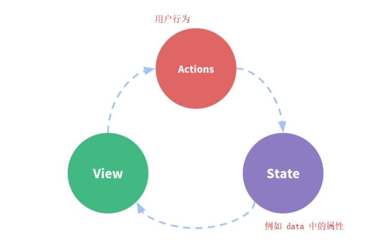

## tabber小项目

### tabber_组件化思路

1. 建立一个 TabBar 组件，并以 TabBarItem 组件作为它的子组件。
2. TabBar 和 TabBarItem 都为某父组件下的子组件，TabBar 提供容器样式并提供插槽，以便放入任意数量的 TabBarItem。
3. 在 TabBarItem 组件中，使用图片插槽和文字插槽。

:palm_tree: 组件自身相关的 HTML 和样式写到自己内部，然后引入根组件注册并使用。
:palm_tree: 添加插槽是为了是让外界动态决定插入的内容，有利于组件的复用。
:palm_tree: 注意 TabBarItem 中根容器即为弹性项目，即`class="tab-bar-item"`。

- src
  - assets
    - css
      - base.css
    - img
      - tabbar
  - components
    - tabbar
      - TabBar.vue
      - TabBarItem.vue
  - views
    - cart
    - category
      - Category.vue
    - home
      - Home.vue
    - profile

| 文件       | 说明                     |
| ---------- | ------------------------ |
| components | 放公共、功能性组件的文件 |
| views      | 放独立组件的文件         |
| home       | 文件夹用小写命名         |
| Home.vue   | vue 件用大写命名         |

### tabber_样式

1. 初始化的样式很多（这里初始化内外边距），可以写到 `base.css` 中，然后引入 `App.vue`

```react
/* App.vue */

<style>
  @import "./assets/css/base.css"; 
</style>
```

1. 水平方向平均分布，固定底部，阴影效果，控制弹性项目中图片和文字的布局。

- 容器框类型改为 `flex`；背景#f6f6f6；定位为 `fixed`，且左右底为0；`box-shadow: 0 -1px 1px rgba(100,100,100,.1)`
- 弹性项目添加样式 `flex: 1` ；居中；高度49px

:palm_tree: `tab-bar-item` 的高度为 49px，是最佳实践。
:palm_tree: `fixed` 定位时左右为 0 ，能保证占据全部宽度。
:palm_tree: `` 底部默认有 3 像素，`vertical-align: middle` 可以将其去除。
:palm_tree:  命名类名时，与组件标签一致，都是用 `-` 连接。

------

### tabber_条件渲染激活态图片

在 TabBarItem 组件中新增一个具名插槽 `name="item-icon-active"` 用于放入活跃状态的图片。

然后结合[条件渲染](https://github.com/SpringLoach/Vue/blob/main/learning/section1.md#条件渲染)决定渲染哪张图片。

:palm_tree: 插槽被替换时，属性也会被替换掉。可以将插槽包含在一个 `<div>` 内部，根据需要对 `<div>` 添加属性和类。

------

### tabber_结合路由进行页面跳转

- 在创建好组件后，进行[路由映射配置](https://github.com/SpringLoach/Vue/blob/main/learning/section2.md#路由映射配置)以及[路由的默认值和模式修改](https://github.com/SpringLoach/Vue/blob/main/learning/section2.md#路由的默认值和模式修改)，而且使用的是[路由懒加载](https://github.com/SpringLoach/Vue/blob/main/learning/section2.md#路由懒加载)的方式。
- 在 `TabBarItem` 组件中进行[父传子](https://github.com/SpringLoach/Vue/blob/main/learning/section1.md#父子组件通信)来获取自定义属性 `path`，最后[通过代码跳转路由](https://github.com/SpringLoach/Vue/blob/main/learning/section2.md#通过代码跳转路由)。
- 在 `App.vue` 中插入 `<router-view>`，以确定映射的组件显示的位置。

:bug: 通过代码跳转路由步骤，在 `this.$router.replace(this.path)` 后添加 `.catch(err => {})` 可以解决报错问题，但是否真的解决了呢？

------

### tabber_父组件传入动态样式值

1. 通过判断活跃路由是否为当前路由，选择对变量的赋值，从而进行条件渲染。
2. 对于字体颜色，我们希望可以让外界动态决定，故需要设置自定义属性（用于获取颜色）并动态绑定样式。同时我们希望给它一个默认值，并添加到自定义属性中。
3. 添加计算属性，通过判断活跃路由的路径是否为组件内的自定义属性 `path`，决定添加到[动态样式](https://github.com/SpringLoach/Vue/blob/main/learning/section1.md#绑定style)的内容。

------

### tabber_进一步抽离

- src
  - components
    - MainTabBar.vue

1. 将 `App.vue` 当中 `TabBar` 模板和 `TabBarItem` 模板的内容转移至 `MainTabBar`。
2. 在 `MainTabBar` 中注册 `TabBar` 组件和 `TabBarItem` 组件。
3. 在 `App.vue` 中注册并使用 `MainTabBar` 组件。
4. 改写一下图片的路径。

------

## 起别名_cli-2

`项目文件/build/webpack.base.conf.js` 中的有一个 `resolve` 对象，其中的 `alias` 属性为别名。

```react
resolve: {
    ...,
    alias: {
        '@': resolve('src'),
        'asserts': resolve('@/asserts'),
        'components': resolve('@/components'),
        'views': resolve('@/views'),
    }
}
```

使用别名

```react
/* src中使用需要前缀~ */
src="~assets/img/tabber/home.svg"

/* import则不用 */
import TabBar from 'components/tabbar/TabBar'
```

:bug: 实际测试时，除了默认配置的 `@`，其它都不能用。

------

## promise

> 一般情况下有连续的异步操作时，使用 promise 对其进行封装，这样写更加优雅。

1. 实例化 `promise` 类时，需要传入一个函数，这个函数有两个可选的参数 `resolve` 和 `reject`，它们是第二步的前提。

```react
new Promise((resolve,reject) => {
  
)
```

1. 在这个函数中调用 `resolve()` 或 `reject()` 表示期约的完成（解决或拒绝）。不调用的话，就是等待状态了。
2. 这里用 `setTimeout()` 模仿完成期约所需要的些许时间。
3. `then()` 方法将在期约完成时被调用，该方法最多可接受两个函数作为参数。

```react
new Promise((resolve,reject) => {
  setTimeout(() => {
    console.log('Hello World!');
    resolve();
    }, 2000);
  }
).then(()=>{
    setTimeout(() => {
    console.log('Hello Vue!');
    }, 2000);
})
```

1. 可以将获取的数据作为 `resolve()` 的参数，它将作为参数传递给 `then()`方法。

```react
new Promise((resolve,reject) => {
  setTimeout(() => {
    console.log('Hello World!');
    resolve('Hello Vue!');
    }, 2000);
  }
).then((data)=>{
    setTimeout(() => {
    console.log(data);
    }, 2000);
})
```

1. 链式传递，在 `Promise`的方法中获取数据；在 `then()` 中处理数据，有需要则再调用一次期约。
2. 之所以能对 `then()` 调用 `then()`，是因为它自身返回的也是一个期约的完成。

```react
new Promise((resolve, reject) => {
  console.log('Hello World!');
  setTimeout(() => {
    resolve(1);
    }, 2000);

}).then((data)=>{
  console.log(data);
  return new Promise((resolve, reject) => {
    setTimeout(() => {
      resolve(data);
    }, 2000);
  })
  
}).then((data)=> {
  console.log(data+1)
})
```

1. `then()` 方法中使用 `return` 时，某些返回值相当于解决了期约。

```react
new Promise((resolve, reject) => {
  console.log('Hello World!');
  setTimeout(() => {
    resolve(1);
    }, 2000);

}).then((data)=>{
  console.log(data);
  return data
  
}).then((data)=> {
  console.log(data+1)
})
```

1. 设置解决和拒绝处理程序的一个方法，`then()` 会将接受到的拒绝期约返回出去。

```react
new Promise((resolve, reject) => {
  console.log('Hello World!');
  reject('problem');
  
}).then((data)=>{
  console.log(data);

}).catch((err) => {
    console.log(err);
})
```

### 取得多个请求的结果后操作

> `Promise.all()`方法接受一个可迭代对象，其中可包括多个期约实例，待所有期约解决后，返回一个新期约，并将可迭代对象中期约的解决值作为数组参数传过去。

```react
Promise.all([
    new Promise((solve) => {
      solve(2);
    }),
    new Promise((solve) => {
      solve(1);
    })
]).then((solves) => {
    console.log(solves[0]+solves[1]);
})
```

------

## Vuex概念

- Vuex 是一个专为 Vue.js 应用程序开发的**状态管理模式**，采用**集中式存储管理**应用的所有组件的状态。
- 当多个组件、或嵌套很深的组件需要读写某些状态（用变量保存）时，就可以使用 Vuex 来管理这些状态（响应式）。

:herb: 将属性添加到对象原型上，实际上是共享的，但因为一些原因，无法做到响应式。

单界面的用户管理



多界面的用户管理


:palm_tree: Dispatch：派遣
:palm_tree: Actions：执行一些异步操作（如发送网络请求）时，需要这一步
:palm_tree: Backend：后端
:palm_tree: Devtools：Vue 开发的一个浏览器插件（需安装）。记录（同步的）修改，方便跟踪
:palm_tree: Mutate：改变

### Vuex要点

1. 组件不允许直接变更属于 store 实例的 state，而应在 mutation 中实现，这样可以明确地追踪到状态的变化，方便调试工具记录变更、进行历史回滚。
2. 如果开发的不是大型单页应用，使用 Vuex 可能是繁琐冗余的。

### 安装并配置Vuex

```elm
npm install vuex --save
```

- src
  - store
    - index.js

```react
/* store 下的 index.js */
import Vue from 'vue'
import Vuex from 'vuex'

Vue.use(Vuex)

const store = new Vuex.Store({
  
})

export default store
```

:palm_tree: 单一状态树：将状态信息<span style="color: #ff0000">全部保存在一个 Store 对象中</span>，便于后期的管理和维护。

```react
/* src 下的 main.js */
import store from './store'

new Vue({
  ..,
  store
})
```

:palm_tree: 在 Vue 的原型上添加了 `$store`。

```react
/* store 下的 index.js */
const store = new Vuex.Store({
  state: {},                // 保存的状态其它界面能共享
  mutations: {},           
  actions: {},              // 异步操作
  getters: {},              // 类似于计算属性
  modules: {}
})
```

### state属性

```react
/* store 下的 index.js */
state: {counter: 101}, 
...

/* App.vue */
<h2>{{$store.state.counter}}</h2>
```

:herb: 任何组件都可以读取该状态，但是不建议直接 `$store.state.counter++` 来修改状态，这样的修改没有记录。

> 该属性的读取很适合放在组件的[计算属性](https://vuex.vuejs.org/zh/guide/state.html#在-vue-组件中获得-vuex-状态)中。
>
> 当一个组件需要获取多个状态的时候，可以使用 `mapState` 辅助函数帮助我们生成计算属性，在使用上与 [mapGetters](https://github.com/SpringLoach/Vue/blob/main/learning/section4.md#购物车_导航栏的其它实现方法_mapgetters辅助函数) 一致。

### mutations属性

> 用于同步操作中更新 `state` 的状态，默认参数为 state 对象。

```react
/* store 下的 index.js */
mutations: {
  increment(state){
    state.counter++
  },
  addCount(state, count){
    state.counter += count
  }
},
...

/* App.vue */
<button @click="addition">+</button>
<button @click="addCount(5)">+5</button>

methods: {
  addition(){
    this.$store.commit('increment');
  },
  addCount(count){
    this.$store.commit('addCount', count);
  }
}
```

:snowflake:  一般认为 `mutations` 中包括**事件类型**和**回调函数**两部分。
:snowflake:  在 `this.$store.commit()`中，第一个参数为事件类型，第二个参数为载荷。
:palm_tree: Payload：载荷，此处为传递的参数，当参数不止一个时，可以将 Payload 以对象的形式传递。

#### mutations提交风格

> 实际上，`this.$store.commit()` 还有其它的提交方式。

```react
mutations: {
  addCount(state, count){
    state.counter += count
  },
  addCount2(state, playload){
    state.counter += playload.count
  }
},
...

/* App.vue */

<button @click="addCount(5)">+5</button>
<button @click="addCount2(5)">+5</button>

methods: {
  addCount(count){
    this.$store.commit('addCount', count);
  },
  addCount2(count){
    this.$store.commit({
      type: 'addCount2',
      count
    })
  }
}
```

:snowflake: 以第二种风格提交的参数始终是一个对象。

#### Mutation相应规则

> 需要提前在 store 中初始化所需的属性。

```react
state: {
  info: {
    name: 'Kaerx',
    age: 400
  }
},
mutations: {
  updateInfo(state){
    /*①*/  state.info.age = 14
    /*②*/ state.info['sex'] = 'girl'
    /*③*/ Vue.set(state.info, 'sex', 'girl')
    /*④*/ delete state.info.age
    /*⑤*/ Vue.delete(state.info, 'age')
    /*⑥*/ state.info = { ...state.info, color: 'red' }
  }
}

/* App.vue */
<button @click="updateInfo">更新</button>

methods: {
  updateInfo() {
    this.$store.commit('updateInfo');
  }
}
```

:snowflake: `state` 中定义的属性会被添加到响应式系统中，并对其进行监听，当属性变化时，会通知所有用到该属性的地方，让界面刷新。
:snowflake: `Vue.set()` 用于向对象（数组）添加或更改属性，接收三个参数：对象，索引值或键，修改后的值。
:snowflake: 若通过方法②和④来添加或删除对象的属性，是做不到**响应式**的。

#### Mutations的类型常量

> 将 `mutations` 事件类型改为常量表示，也许可以减少一些情况下敲错字符的机会，但感觉更繁琐了，看情况决定要不要用吧。

- store
  - mutations-types.js

```react
/* mutations-types.jc */
export const INCREMENT = 'increment'  


/* Vue.js */
import {
  INCREMENT
} from './store/mutations-types'

methods: {
  addition() {
    this.$store.commit(INCREMENT)
  }
}

/* store 下的 index.js */
import {
  INCREMENT
} from './mutations-types'

mutations: {
  [INCREMENT](state) {
    state.counter++
  }
}
```

### getters属性

> 类似计算属性。多个页面需要获取处理后的状态时使用，第一个参数为 state 对象，第二个参数为 getters 对象。

```react
/* store 下的 index.js */
getters: {
  powerCounter(state){
    return state.counter * state.counter
  },
  powerCounteradd(state, getters){
    return getters.powerCounter + 1
  },
  powerCounterAnyadd(state, getters){
    return num => {
      return getters.powerCounter + num
    }
  }
},
...

/* App.vue */
<h2>{{$store.getters.powerCounter}}</h2>
<h2>{{$store.getters.powerCounteradd}}</h2>
<h2>{{$store.getters.powerCounterAnyadd(666)}}</h2>
```

:snowflake: 当某些处理需要传参才能进行时，需要在定义的方法中返回一个函数，用这个函数去接受参数并进行处理，此时不会缓存结果。

### actions属性

> 在进行一些**异步操作**时，不能在 `mutations` 属性中进行，这会导致无法及时观察状态的变化。此时，应该使用 `actions` 属性。
>
> 待异步操作结束后，提交 mutation。

```react
/* Vue.js */
<button @click="increment2">异步+</button>

methods: {
  increment2() {
    this.$store.dispatch('aincrement')
  }
}

/* store 下的 index.js */
actions: {
  aincrement(context) {
    setTimeout(() => {
      context.commit('increment')  // 参数为定义在 mutations 中的方法
    }, 2000)
  }
}
```

:snowflake: `actions` 中的方法接受一个 `context` 参数，在这里代表 `store` 对象 :palm_tree: 上下文

#### actions属性的传参及完成

> 可以通过返回期约的方式，告诉调用操作的地方异步操作的完成。

```react
/* Vue.js */
methods: {
  increment2() {
    this.$store.dispatch('aincrement', 'finish')
    .then((message) => 
      setTimeout(() => {
        console.log(message);
      }, 2000))
    }
}

/* store 下的 index.js */
actions: {
  aincrement(context, payload) {
    return new Promise((resolve) => {
      setTimeout(() => {
        context.commit('increment');
        console.log(payload);
        
        resolve('eat dinner');
      }, 2000)
    })
  }
}
```

:snowflake: 一般认为 `context.commit()` 执行后表示修改成功。
:snowflake: actions 属性也接受一个 payload。

#### context的对象结构赋值

> 这是 ES6 的简写语法。

```react
actions: {
    aChangeName({ state, commit, rootState }) {
      setTimeout(() => {
        commit('ChangeName', 'ash')
      }, 2000)
    }
  }
```

:snowflake: 相当于抽取同名属性并赋值。

### modules属性

> 当需要管理的状态太多时，内容会显得臃肿，其实使用 `modules` 属性可以实现状态的分离。

```react
/* store 下的 index.js */
const moduleA = {
  state: {...},
  mutations: {...},
  actions: {...},
  getters: {...}
}

const moduleB = {
  state: {...},
  mutations: {...},
  actions: {...},
  getters: {...}
}

const store = new Vuex.Store({
  ...
  modules: {
    a: moduleA,
    b: moduleB
  }
})
```

:snowflake: 实际上也可以在模块内继续使用 `modules`，但这样仿佛就太乱了。

#### modules属性中的state

> 定义时一致；使用时，先取出模块（被放到了根 `state` 中），再从模块中取出。

```react
const moduleA = {
  state: {
    name: 'black'
  },
  ...
}

/* Vue.js */
<h2>{{$store.state.a.name}}</h2>
```

#### modules属性中的mutations

> 定义和使用方式与原先一致。

```react
const moduleA = {
  mutations: {
    ChangeName(state, payload) {
      state.name = payload
    }
  },
  ...
}

/* Vue.js */
<button @click="ChangeName">更名</button>

methods: {
  ChangeName() {
    this.$store.commit('ChangeName', 'red')
  }
}
```

#### modules属性中的getters

> 定义和使用方式与原先一致。

```react
const moduleA = {
  getters: {
    fullname(state) {
      return state.name + 'sir'
    },
    fullname2(state, getters, rootState, rootGetters) {
      return getters.fullname + rootState.counter
    }
  },
  ...
}

/* Vue.js */
<h2>{{$store.getters.fullname}}</h2>
<h2>{{$store.getters.fullname2}}</h2>
```

:snowflake: 它接受的第二个参数为自身的 getters 对象，第三个参数为根部的 state 对象。

#### modules属性中的actions

> 定义和使用方式与原先一致。

```react
const moduleA = {
  actions: {
    aChangeName(context) {
      setTimeout(() => {
        context.commit('ChangeName', 'ash')
      }, 2000)
    }
  },
  ...
}

/* Vue.js */
<button @click="aChangeName">更名</button>

methods: {
  aChangeName() {
    this.$store.dispatch('aChangeName')
  }
}
```

:snowflake: 模块中的 `context` 仅能 commit 自身模块中的 `mutations`。
:snowflake: 模块中的 `context` 对象中还有些属性能获取根的 state 等。

### vue-store目录组织

> 官网推荐。

- src
  - store
    - index.js
    - actions.js
    - mutations.js
    - [mutation-types.js](https://vuex.vuejs.org/zh/guide/mutations.html#使用常量替代-mutation-事件类型)
    - modules
      - mutationA.js
      - mutationB.js

```react
/* index.js */
import mutations from './mutations'
import actions from './actions'
import moduleA from './modules/moduleA'

const state = {...}
const getters = {...}


const store = new Vuex.Store({
  state,
  mutations,
  actions,
  getters,
  modules: {
    a: moduleA
  }
})

/* mutations.js */
export default {...}
```

------

## 网络请求模块（框架）的选择

> 一般在使用第三方框架前，会对其进行封装，这样即使框架出 bug 或不维护了，后期维护和更换也更方便。

1. XMLHttpRequest(XHR)
   - 配置和调用方式较混乱
2. jQuery-Ajax
   - 在 Vue 的整个开发中都不需要使用 jQuery
   - 没必要为了网络请求就使用这个重量级的框架
3. Vue-resource
   - 官方推出的，但不维护了，对以后项目的开发和维护都存在很大的隐患
4. axios
   - 推荐使用，功能如下：
     - 在浏览器中发送 XMLHttpRequests 请求
     - 在 node.js 中发送 http 请求
     - 支持 Promise API
     - 拦截请求和响应
     - 转换请求和响应数据
     - ...

## axios框架的基本使用

安装

```elm
/* 项目文件下 */
npm install axios --save
```

配置

```react
/* main.js */
import axios from 'axios'
```

使用

```react
/* main.js */
axios({
  url: 'http://123.207.32.32:8000/home/multidata'
}).then((res) => {
  console.log(res);
})
```

:snowflake: 这个方法的返回值就是一个期约，可以直接用 `then()` 添加处理程序。
:snowflake: 返回的对象中，实际网站返回的只有 data，其它内容是框架附带的。
:palm_tree: 这个网站可以做很多网络请求的模拟：https://httpbin.org/

更改请求方式

```react
axios({
  url: 'http://123.207.32.32:8000/home/multidata',
  method: 'post'
})
```

| 请求方式                         | 参数 | 说明            |
| -------------------------------- | ---- | --------------- |
| axios(config)                    | 对象 | 默认为 GET 请求 |
| axios.get(url, [config])         | /    | /               |
| axios.post(url, [data,[config]]) | /    | /               |
| ...                              | /    | /               |

### 携带参数发起请求

:bug: 错误接口 123.207.32.32:8000/home/data?type=pop&page=1

```react
axios({
  url: 'http://123.207.32.32:8000/home/data?type=pop&page=1'
})

/* 等价于 */
axios({
  url: 'http://123.207.32.32:8000/home/data',
  params: {
      type: 'pop',
      page: 1
  }
})
```

:palm_tree: params：参数。针对 GET 请求的参数拼接。

### axios发送并发请求后处理

```react
axios.all([axios(), axios()])
  .then(results => {
  ...
})
```

:snowflake: 拿到的结果将是一个数组。

直接取得对应的期约结果

```react
axios.all([axios(), axios()])
  .then(axios.spread((res1, res2) => {
  ...
}))
```

### axios的配置相关信息

```react
axios.defaults.baseURL = 'xxxxx'
axios.defaults.timeout = 5000

axios({
  url: '/home/multidata'
}).then((res) => {
  console.log(res);
})
```

:snowflake: 配置将自动应用到相关的 axios 方法中。

### axios_常见的配置选项

| 配置           | 方式/栗子                                    | 说明                      |
| -------------- | -------------------------------------------- | ------------------------- |
| 请求地址       | url: '/user'                                 | /                         |
| 请求类型       | method: 'get'                                | /                         |
| 根路径         | baseURL: 'http://www.mt.com/api'             | /                         |
| 请求前数据处理 | transfromRequest: [function(data){}]         | 对数据处理后再发送请求    |
| 请求后数据处理 | transfromResponse: [function(data){}]        | /                         |
| 自定义的请求头 | header:{'x-Requested-With':'XMLHttpRequest'} | /                         |
| URL查询对象    | params:{id: 12}                              | 对应 get 请求类型(?post?) |
| request body   | data: {key: 'aa'}                            | 对应 post 请求类型        |
| 超时设置       | timeout: 1000                                | /                         |
| ...            | /                                            | /                         |

### axios的实例

> 全局配置会默认应用到所有 axios 请求中，但在后续开发中，有可能需要的配置会不一样，这时候就可以新建实例并传入属于该实例的默认信息。

```react
/* 创建 axios 实例 */
const instance1 = axios.create({
  baseURL: 'xxx',
  timeout: 5000
})


/* 调用实例发送请求 */
instance1({
  url: '/home/multidata'
}).then(...)

instance1({
  ...
}).then(...)
```

### 模块封装

> 将第三方框架使用到多个模块是一件非常危险的事情，一旦框架不再维护，想要更替框架，工作量会非常大。

```react
/* Vue.js */
import axios from 'axios'

/* 添加 option */
created() {
  axios({
    url: 'xxx'
  }).then(...)
}
```

实现模块封装

> 可以将框架相关的处理放到一个文件里，用这个文件对应多个模块。当需要更换框架时，处理这个文件就可以了。

- src
  - network
    - request.js

终极方案

```react
import axios from 'axios'

export function request(config) {
  const instance = axios.create({
      baseURL: 'xxx',
      timeout: 5000
  })
    
  return instance(config)
}

/* Vue.js */
import {request} from "./network/request";

/* 添加 option */
created() {
  request({
    url: '/home/multidata'
  }).then(() => {
    ...
  }).catch(() => {
    ...
  })
}
```

:snowflake: 这里不使用 `export default` 导出是因为有可能不止一个实例。

当新框架不支持 promise API 时，只需要将异步操作用期约包围即可。

```react
import axios from 'axios'

export function request(config) {
  return new Promise((resolve, reject) => {
    
    const instance = axios.create({
      baseURL: 'xxx',
      timeout: 5000
    })
    
    /* 请求成功，则调用resolve(res) */
    instance(config)
      .then(res => {
        resolve(res)
      })
      .catch(err => {
        reject(err)
      })
  })
}
```

### 回调函数简单栗子

```react
function makeData(x) {
  let a = 3;
  /* 调用函数x */
  x(a);
}

/* 传入一个函数作为参数x */
makeData((num) => {
  console.log(num)}
)
```

### 拦截器

> axios 提供了拦截器，用于我们在发送每次请求或者得到响应后，进行某些处理。

\#请求拦截

> `instance.interceptors.request.use()`，其中 instance 为设置好了的 axios 实例。

| 参数       | 要求                                          | 说明                                         |
| ---------- | --------------------------------------------- | -------------------------------------------- |
| 第一个函数 | 接受 config 作为参数，需要返回处理后的 config | 可配置信息；请求时界面显示图标；验证登录信息 |
| 第二个函数 | 接受 err 作为参数，一般要返回                 | 若请求成功发送，则不执行第二个函数           |

\#响应拦截

> ```
> instance.interceptors.response.use()
> ```

| 参数       | 要求                                              | 说明                           |
| ---------- | ------------------------------------------------- | ------------------------------ |
| 第一个函数 | 接受 response 作为参数，需要返回处理后的 response | /                              |
| 第二个函数 | 接受 err 作为参数，一般要返回                     | 若响应成功，则不执行第二个函数 |

筛选响应信息

```react
/* 建立 instance 实例后 */
instance.interceptors.response.use(res => {
  return res.data;
}, err => {
  return err;
})  
```

:palm_tree: interceptors：拦截器
:snowflake: 需要全局配置时，引入 `axios` 并对其配置。

