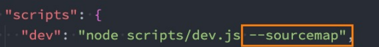
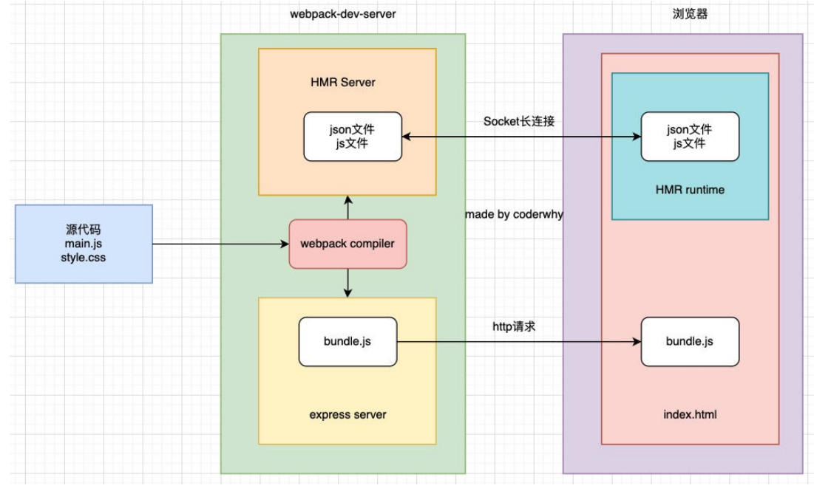
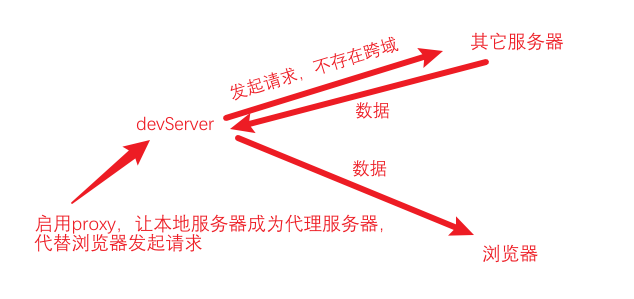

## Vue3初体验

### 对比Vue2的进步

 <span style="color: #da9330">更好的性能、更小的包体积、更好的TypeScript集成、更优秀的API设计。</span>


<span style="font-weight: 600">源码</span>

Vue3的源码全部使用TypeScript来进行重构

<span style="font-weight: 600">性能</span>

Vue2使用Object.defineProperty来劫持数据的getter和setter方法，缺陷是给对象添加/删除属性时，无法劫持和监听，需要借助 `$set`、 `$delete` 这些方法。

Vue3使用Proxy来实现数据的劫持。

<span style="font-weight: 600">删除</span>

如filter

<span style="font-weight: 600">编译优化</span>

生成Block Tree、Slot编译优化、diff算法优化

<span style="font-weight: 600">新的API</span>

- 由 Option API到 Composition API

​    使用 Option API可能导致代码的内聚性非常差，比如created中会使用某一个method来修改data的数据

Composition API 可以将相关代码放在一起进行处理

- 使用Hooks函数增加代码的复用性

​    类似于mixins，将一部分独立的逻辑抽取出去，且做到响应式


### 引入Vue的方式

 <span style="color: #da9330">Vue的本质，就是一个Javascript的库。</span>

- 在页面通过CDN的方式引入

  ```react
  <script src="https://unpkg.com/vue@next"></script>
  ```

- 下载Vue的JS文件，并引入

- 通过npm安装使用

- 通过Vue-Cli创建项目后使用


### 介绍CDN引入

<span style="color: #da9330">内容分发网络</span>

- 通过相互连接的网络系统，能利用到<span style="color: #f7534f;font-weight:600">最靠近</span>每个用户的服务器
- 更快、更可靠地将音乐、图片及其它文件这些<span style="color: #f7534f;font-weight:600">资源</span>发送给用户
- 来提供高性能、可扩展性及低成本的网络内容传递给用户

:whale: 如果将资源部署到处于北京的服务器，那么北京的用户能更快访问到资源。


请求资源：用户→边缘节点→ 父节点→ 源站

获取资源：用户←边缘节点← 父节点← 源站

:ghost:每个节点其实都是一个服务器，用户请求资源时，会去下一级服务器查看是否有缓存，若有缓存，因为离得近，效率会很高。


### Vue3初体验

```html
<body>
  <div id="app"></div>
  <script src="https://unpkg.com/vue@next"></script>
  <script>
    const obj = {
      template: '<div>123</div>'
    }
    const app = Vue.createApp(obj);
    app.mount("#app")
  </script>
</body>
```

:ghost: `Vue.createApp` 接受一个对象，返回一个实例，通过 `mount` 挂载到对应元素上。

:turtle: 实例的 `mount` 方法内部自己会调用 `document.querySelector` 方法并替换掉对应元素的 `innerHTML`。

 

### 引入Vue的JS文件

```html
<body>
  <div id="app"></div>
  <script src="../js/vue.js"></script>
  <script>
    const app = Vue.createApp({
      template: '<div>123</div>'
    }).mount("#app")
  </script>
</body>
```

:whale: CDN引入的路径可以直接在浏览器访问，其内容就是库的源码。

:flipper: 可以通过链式编程来使用 Vue。


### 原生计数器

```html
<body>
    <h2 class="counter">0</h2> 
    <button class="increment">+1</button> 
    <button class="decrement">-1</button> 
    
  <script>
  // 1. 获取所有元素
  const counterEl = document.querySeletor(".counter");
  const incrementEl = document.querySeletor(".increment");
  const decrementEl = document.querySeletor(".decrement");
  
  // 2. 定义变量
  let counter = 100;
  counterEl.innerHTML = counter;
  
  // 3. 监听按钮的点击
  incrementEl.addEventListener('click', () => {
    counter += 1;
    counterEl.innerHTML = counter;
  })
  decrementEl.addEventListener('click', () => {
    counter -= 1;
    counterEl.innerHTML = counter;
  })
  </script>
</body>
```

:turtle: 通过元素的 `innerHTML` 来更改其子节点。


### template写法

#### 写法一

```html
<body>
  <div id="app"></div>

  <script src="../js/vue.js"></script>
  <script>
    Vue.createApp({
      template: `
        <div>
          <h2>内容1</h2>
          <h2>内容2</h2>
        </div>
      `,
    }).mount('#app');
  </script>
</body>
```


#### 写法二

```html
<body>
  <div id="app"></div>

  <script type="x-template" id="demo">
    <div>
      <h2>内容1</h2>
      <h2>内容2</h2>
    </div>
  </script>

  <script src="../js/vue.js"></script>
  <script>
    Vue.createApp({
      template: '#demo',
    }).mount('#app');
  </script>
</body>
```

:star2:当 `template` 接受 `#` 开头的字符串时，会调用 `document.querySelector`。


#### 写法三

```html
<body>
  <div id="app"></div>

  <template id="demo">
    <div>
      <h2>内容1</h2>
      <h2>内容2</h2>
    </div>
  </template>

  <script src="../js/vue.js"></script>
  <script>
    Vue.createApp({
      template: '#demo',
    }).mount('#app');
  </script>
</body>
```

:ghost: 使用 div 代替 template 也可以实现挂载，但 template  能够做到本身被浏览器解析却不被渲染。


### 录—methods

methods属性中定义的方法不应该使用箭头函数的形式，这会导致 `this` 不能按照期望指向组件实例，它会指向定义它的上级作用域，即 `window`。


若使用普通函数的方式，Vue内部会做这么一件事情：

```less
遍历 methods，将方法作为 key
bind 会返回一个将调用者的 this 指向首参（对象）的方法
当调用模板中的 @click="dos" 时，调用的就是 ctx[dos]
```

```react
const publicThis = instance.proxy // 代理，其中包含了实例的属性（如data中的数据）

for(const key in methods) {
  ctx[key] = key.bind(publicThis)
}
```


### 异—选项data必须为函数

在 Vue2，根对象实例的 data 可以为对象，但在 Vue3 中不允许。

### 异—template中允许存在多个根元素

这在 Vue2 中时不允许的。


### 声明式VS命令式

 <span style="color: #da9330">两种不同的编程范式。</span>

命令式编程：关注于<span style="color: #f7534f;font-weight:600">怎么做</span> ，如一般的原生开发

声明式编程：关注于<span style="color: #f7534f;font-weight:600">做什么</span> ， 一般由框架（机器）完成<span style="color: #f7534f;font-weight:600">怎么做</span>的过程，如 Vue、React。


### 查看 Vue 的源码

- 第一步：在 GitHub 对应[地址](https://github.com/vuejs/core)，下载源代码

  ```less
  1. 选中Tags的首个非beta版本(不稳定)
  
  2. Download ZIP
  
  3. 解压
  ```

- 第二步：安装依赖

  ```elm
  cnpm install pnpm -g
  ```

  > 记录安装路径
  
  在安装路径或上级尝试下面的命令直至有结果，记录目标路径
  
  ```elm
  pnpm -v
  ```
  
  > 将目标路径添加到用户变量/系统变量的Path中
  
  ```elm
  pnpm install
  ```
  
  :whale: 限制了只能使用这种包管理工具进行依赖安装
  
  ```elm
  git init
  git add .
  git commit -m "fix(install): install dep"
  ```

​      :octopus: 由于项目进行了代码检测的一些配置，故需要上述操作，否则会报错

- 第三步：开启映射后，进行打包

  

  ```elm
  npm run dev
  ```

- 第四步：可以在项目下新建一个 `html`，引入 `packages/vue/dist/vue.global.js` 进行调试代码

​      :star2: 映射以后通过 `debugger` 可以进入到具体的代码文件中。


## Vue3基础语法一


### 补—模板语法

#### 双大括号语法

```react
<!-- 允许-表达式 -->
<span>{{ isShow? 1 : 2 }}</spanspan>
<!-- 错误—赋值语句 -->
<span>{{ var a = 1 }}</spanspan>
<!-- 错误—条件语句 -->
<span>{{ if(1) { return 2 } }}</spanspan>
```


### 基本指令

#### v-once

```react
<!-- 初次渲染后，所有的子组件（节点）不随数据源变化而变化，可用于优化性能 -->
<div v-once>{{ num }}</div>
<!-- 随事件变化 -->
<div>{{ num }}</div>
<button @click="num++">+1</button>
```


### 动态属性

```react
<div :[name]="value">哈哈哈</div>

data() {
  return {
    name: "cba",
    value: "kobe"
  }
}

<!-- 解析渲染后的效果 -->
<div cba="kobe">哈哈哈</div>
```


### 添加多个属性

> 可以将对象上的属性一次性添加到标签上。

```react
<div v-bind="info">哈哈哈哈</div>

data() {
  return {
    info: {
      name: "why",
      age: 18,
    }
  }
}

<!-- 解析渲染后的效果 -->
<div name="why" age="18">哈哈哈</div>
```


### v-on

```react
<!-- 绑定一个表达式: inline statement -->
<button @click="counter++">{{counter}}</button>
<button @click="modelView = true">展开</button>

<!-- 绑定一个对象: 一次添加多个事件监听 -->
<div class="area" v-on="{click: btn1Click, mousemove: mouseMove}"></div>
```


### 遍历数字

```react
<ul>
  <li v-for="(num, index) in 10">{{num}}-{{index}}</li>
</ul>
```


### VNode 和 虚拟DOM

- VNode 即<span style="color: #ed5a65">虚拟节点</span>，本质是一个 JavaScript 对象。
- 它为元素（标签）在 Vue 中的表现。
- 转化过程:  template -> VNode -> 真实DOM
- 如果不只是一个简单的div，而是有一大堆的元素，那么它们应该会形成一个 VNode Tree ,即<span style="color: #ed5a65">虚拟DOM</span>

```react
// template,像 v-on, v-if, {{ }} 这些无法被浏览器直接解析
<div class="title" style="font-size: 30px; color: red;">虎虎生威</div>

// VNode
const vnode = {
  type: "div",
  props: {
    class: "title",
    style: {
      "font-size": "30px",
      color: "red",
    },
  },
  children: "虎虎生威"
}
```


## Vue3组件化开发（一）

### 浅拷贝

```react
const x = {a: 'value', b: '22', c: {cnode: 3}};
const y = Object.assign({}, x); // 浅拷贝

x.a = 'newValue';
console.log(y.a); // 'value'
x.c.cnode = 4;
console.log(y.c.cnode); // 4
```

> x 和 y 指向并非同一块内存地址，但 x.c 本身是一个引用（内存地址），而 y.c 复制了该内存地址。


### Vue3全局注册组件

```react
<a-btn></a-btn>

const app = Vue.createApp(App);

app.component("a-btn", {
  template: `<div>demo</div>`
})

app.mount('#app');
```


### 组件的定义和使用规则

| 注册（定义）方式 | 组件使用方式           |                    补充                     |
| :--------------: | ---------------------- | :-----------------------------------------: |
|    短横线分隔    | 短横线分隔             |                                             |
|    驼峰大小写    | 短横线分隔、驼峰大小写 | 在 DOM （非字符串模板）中不能使用驼峰大小写 |


## Vue3组件化开发（二）

vue-cli 是基于（依赖于） Webpack 来模块化和打包的，而 Webpack 又是基于 Node 的。


### 进行包的局部安装

需要项目下存在 <span style="color: green">package.json</span> 文件，如果不存在，可以通过如下命令生成。

```
npm init
```

或

```
npm init -y
```

:flipper: 该命令会跳过文件的基本配置，生成默认文件。


### 使用局部webpack打包项目

#### 方法一

```elm
./node_modules/bin/webpack
```

#### 方法二

```elm
npx webpack
```

:ghost: 若是在项目下直接运行 `webpack`，其会使用全局安装的 webpack。

#### 方法三

`package.json`

```javascript
"script": {
  "build": "webpack"
}
```

```elm
npm run build
```


### webpack更改出入口

```javascript
const path = require('path');

module.export = {
  entry: "./src/main.js",
  output: {
    path: path.resolve(__dirname, "./dist")
    filename: "js/bundle.js",
  }
}
```

:ghost: webpack 依赖于 Node，而 Node 原生就支持 CommonJS（原生没有支持 ES6 Module）

:star2: 输出地址需为绝对路径， <span style="color: #ed5a65">__dirname</span>为当前文件所在的绝对路径。


### 通过脚本命令

#### 配置出入口

```elm
"script": {
  "build": "webpack --entry ./src/main.js --output-path ./build"
}
```

#### 修改配置文件

```elm
"script": {
  "build2": "webpack --config demo.config.js"
}
```

:turtle: 配置文件的命名可以不为 <span style="color: slategray">webpack.config.js</span>


### 配置loader

> 原生的 webpack 只能解析 js，除此以外的文件类型都不能作为模块解析。
>
> 可以通过 `module.rules` 的方式为项目配置 <span style="color: #f7534f;font-weight:600">loader</span> 。

<span style="backGround: #efe0b9">webpack.config.js</span>

```javascript
module.exports = {
  ...,
  module: {
    rules: [
      {
        test: /\.css&/,
        loader: "css-loader"
      }
    ]
  }
}

/* 上面 Rule 对象的等价写法 */
{
  test: /\.css&/,
  use: [
    "css-loader"
  ]
}
```

`module.rules` 的格式为数组，它由 Rule 对象组成。


#### Rule对象

- <span style="color: #f7534f;font-weight:600">test属性</span>：用于对资源进行匹配，通常会设置成正则表达式；
- <span style="color: #f7534f;font-weight:600">use属性</span>：对应的值是一个数组：[UseEntry] 
  + UseEntry可以为配置对象
    - loader：必须有一个 loader属性，对应的值是一个字符串；
    - options：可选的属性，值是一个字符串或者对象，值会被传入到loader中；
    - query：目前已经使用options来替代；
  + UseEntry也可以为字符串
- <span style="color: #f7534f;font-weight:600">loader属性</span>： 语法糖，相当于 Rule.use: [ { loader } ] 的简写。


#### css的插入

> 仅配置 `css-loader` ，并不能样式在页面上出现效果。

```react
rules: [
  {
    test: /\.css&/,
    use: [
      "style-loader",
      "css-loader"       // 后（右）者先执行
    ]
  }
]

/* 上面 Rule 对象的等价写法 */
{
  test: /\.css&/,
  use: [
    { loader: "style-loader" },
    { loader: "css-loader" },
  ]
}
```

- css-loader <span style="color: #ff0000">负责将 .css 文件进行解析</span>

- style-loader <span style="color: #ff0000">负责将 style 插入到页面</span>


#### 配置插件

> loader 能够通过插件来拓展能力，这里以 **postcss-loader** 为例。

```react
use: [
  { loader: "style-loader" },
  { loader: "css-loader" },
  {
    loader: "postcss-loader",
    options: {
      postcssOptions: {
        plugins: [
          require('postcss-preset-env')
        ]
      }
    }
  }
]
```

:star2: 通过 <span style="color: #a50">postcss-preset-env</span> ，可以自动生成适配各浏览器的带前缀的CSS属性，也能将现代CSS转换为大多数浏览器都认识的CSS，如将 #00000000 转化为 rgba。


#### 抽离postcss配置

> **postcss-loader** 的配置可以放到一个特定命名的单独文件中，需要在项目根目录下。

<span style="backGround: #efe0b9">postcss.config.js</span>

```react
/* 此时 webpack.config.js 中的 postcss-loader 不再需要 options */
module.exports = {
  plugins: [
    require('postcss-preset-env') 
  ]
}
```


#### file-loader

> 可以使用该 loader 来处理图片，它能够处理<span style="color: #ff0000">import/require()方式</span>引入的文件资源，并放到<span style="color: #ff0000">输出文件夹</span>。


##### 文件命名

> 有时会想要保留原来的文件名、扩展名，同时为了防止重复，包含一个hash值。

\- 常用的placeholder： 

 **[ext]：** 处理文件的扩展名

 **[name]：**处理文件的名称

 **[hash]：**文件的内容，使用MD4的散列函数处理，生成的一个128位的hash值（32个十六进制）

 **[hash:<length>]：**截取hash的长度，有时默认32个字符太长了

 **[contentHash]：**在file-loader中和[hash]结果是一致的（在webpack的一些其他地方不一样）

 **[path]：**文件相对于webpack配置文件的路径；


```react
{
  test: /\.(jpe?g|png|gif|sbg)$/,
  use: {
    loader: "file-loader",
    options: {
      name: "img/[name]_[hash:8].[ext]"
    }
  }
}

/* 等价写法 */
{
  test: /\.(jpe?g|png|gif|sbg)$/,
  use: {
    loader: "file-loader",
    options: {
      outputPath: "img",
      name: "[name]_[hash:8].[ext]"
    }
  }
}
```


##### 引用方式

```react
import demoImage from '../img/xx.png';

img.src = demoImage;
```

<span style="backGround: #efe0b9">错误写法</span>

```react
/* 打包后，根据该路径会找不到资源 */
img.src = "../img/xx.png"
```

:turtle: 针对 JavaScript 中的图片路径，Vue 模板中的图片路径可能经过特殊处理。


#### url-loader

> 与 <span style="color: #a50">file-loader</span> 的配置相似，可以<span style="color: #ff0000">直接替代</span> <span style="color: #a50">file-loader</span>，并且可以将较小文件转为<span style="color: #ff0000">base64的URI</span>。

```react
{
  test: /\.(jpe?g|png|gif|sbg)$/,
  use: {
    loader: "url-loader",
    options: {
      limit: 10 * 1024,             
      outputPath: "img",
      name: "[name]_[hash:8].[ext]"
    }
  }
}
```

:turtle: 对于满足条件（小于10kb）的资源，将其转化并生成在 JavaScript 文件中，否则正常导出。

:turtle: 不转化较大的资源，否则会<span style="color: #ff0000">增大请求文件体积，影响页面的请求速度</span>。


##### 性能优化—图片

> 对于较小体积的多张图片，可以使用字体图片、转base64、雪碧图的方式来减少请求次数，可以减少服务器压力。


#### 资源模板类型

> 在 <span style="color: #a50">webpack5</span>   后，用于替代 <span style="color: #a50">raw-loader、url-loader、file-loader</span>，并且它是内置的，不需要像其它 loader 在使用前还要进行安装。


\- **资源模块类型(asset module type)**，通过添加 4 种新的模块类型，来替换所有这些 loader： 

| webpack5       | 相当于webpack4的    | 作用                |
| -------------- | ------------------- | ------------------- |
| asset/resource | file-loader         | 导出资源的 URL      |
| asset/inline   | url-loader          | 导出资源的 data URI |
| asset/source   | raw-loader          | 导出资源的源代码    |
| asset          | 加限制的 url-loader | 配置资源体积限制    |

`demo`

```react
// 导出到对应路径
{
  test: /\.(jpe?g|png|gif|sbg)$/,
  type: "asset/resource"
}
```

`demo2`

```react
// 满足条件会生成 base64，否则导出到对应路径
{
  test: /\.(jpe?g|png|gif|sbg)$/,
  type: "asset",
  generator: {
    filename: "img/[name]_[hash:8][ext]"        // 配置路径
  },
  parser: {
    dataUrlCondition: {
      maxSize: 10 * 1024                       // 限制体积
    }
  }
}
```

:turtle: 这里的 `[ext]` 会以 `.` 作为开头。

```react
module.export = {
  output: {
    ...,
    assetModuleFilename: "img/[name]_[hash:8][ext]"  // 配置路径
  }
}
```

:octopus: 对于asset的路径，也可以在这里进行配置。


#### 打包图标库

<span style="backGround: #efe0b9">webpack.config.js</span>

`webpack4`

```react
{
  test: /\.(eot|ttf|woff2?)$/,
  use: {
    loader: "file-loader",
    options: {
      name: "font/[name]_[hash:6].[ext]"
    }
  },
}
```

`webpack5`

```react
{
  test: /\.(eot|ttf|woff2?)$/,
  type: "asset/resource",
  generator: {
    filename: "font/[name]_[hash:6][ext]"        // 配置路径
  },
}
```


##### 引入字体图标

> 将阿里巴巴图标库对应项目的图标下载，一般放到 `font` 目录下。

```react
import "../font/iconfont.css";

<!-- 分别为字体类名、图标名 -->
<span class="iconfont icon-demo"><span>
```


### 插件

> 不同于 <span style="color: #a50">loader</span>，<span style="color: #a50">plugin</span>一般需要手动导入后才能使用。
>
> 插件的配置没有<span style="color: #ff0000">顺序要求</span>，其参数一般为对象。


#### 打包前清空打包文件

```elm
npm install clean-webpack-plugin -D
```

```react
const { CleanWebpackPlugin } = require("clean-webpack-plugin");

module.exports = {
  plugins: [
    new CleanWebpackPlugin()
  ]
}
```


#### 生成入口文件

```elm
npm install html-webpack-plugin -D
```

```react
const { CleanWebpackPlugin } = require("clean-webpack-plugin"); // 用作示例：使用多个插件
const HtmlWebpackPlugin = require("html-webpack-plugin");

module.exports = {
  plugins: [
    new CleanWebpackPlugin(),
    new HtmlWebpackPlugin()
  ]
}
```

:ghost: 默认配置会根据默认的内置模板生成入口文件。


##### 根据自定义模板生成入口文件

```react
const HtmlWebpackPlugin = require("html-webpack-plugin");

module.exports = {
  plugins: [
    new HtmlWebpackPlugin({
      template: "./public/index.html"
    })
  ]
}
```


##### 配置变量

<span style="backGround: #efe0b9">index.html</span>

```react
<link rel="icon" href="%= BASE_URL %>favicon.icon">
<title><%= htmlWebpackPlugin.options.title %></title>
```

<span style="backGround: #efe0b9">webpack.config.js</span>

```react
const HtmlWebpackPlugin = require('html-webpack-plugin');
const { DefinePlugin } = require('webpack'); // 内置模板，无需安装

module.exports = {
  plugins: [
    new HtmlWebpackPlugin({
      title: "网页标题",
      template: "./public/index.html"
    }),
    new DefinePlugin({
      BASE_URL: "'./'"  // 需要内置引号，否则会在该上下文找对应变量
    })
  ]
}
```


#### 复制资源

```elm
npm install copy-webpack-plugin -D
```

```react
const CopyWebackPlugin = require('copy-webpack-plugin');

plugins: [
  new CopyWebackPlugin({
    patterns: [
      {
        from: "public",             // 需要复制的源位置
        to: "./",                   // 复制到的位置
        globOptions: {
          ignore: {                 // 忽略，不进行复制的资源
            "**/index.html"
          }
        }
      }
    ]
  })
]
```

:ghost: 可以忽略 CopyWebackPlugin 中的 to 配置项，它会自动读取上下文中的 output.path，即打包的目录下。


### 将打包网页的报错映射到开发文件

<span style="backGround: #efe0b9">webpack.config.js</span>

```react
module.exports = {
  mode: "development",  // 开发阶段
  devtool: "source-map" // 建立js映射文件，方便调试代码和错误
}
```


#### Mode

| 选项        | 用于     | 描述                                                         |
| ----------- | -------- | ------------------------------------------------------------ |
| development | 开发阶段 | 会将 `DefinePlugin` 中的 `process.env.NODE_ENV` 设为 `development`等 |
| production  | 生产阶段 | 会将 `DefinePlugin` 中的 `process.env.NODE_ENV` 设为 `production`等 |
| none        |          | 不使用任何默认优化配置                                       |


## Vite2搭建Vue环境

### Babel

> 用于将源代码 （ES6、TypeScript） 转化为旧浏览器或环境中能够兼容的源代码（ES5），可以看作编译器。


#### 执行原理


#### 单独使用 Babel

> 即不依赖 webpack 去使用，懂流程就好。

```elm
npm install @babel/cli @babel/core -D
```

**@babel/core**：babel 的核心代码，必须安装

**@babel/cli**：可以在命令行使用babel


##### 基本格式

`格式`

```elm
npx babel src --out-dir dist       // 根据文件/文件夹生成文件夹
npx babel src --out-file filename  // 根据文件生成文件
```

`示例`

```elm
npx babel demo.js --out-dir dist
npx babel demo.js --out-file text.js 
```

:star2: 此时编译出来的代码不会有任何转换，因为没有（插件）进行任何处理。


##### 使用插件

编译箭头函数

```elm
npm install @babel/plugin-transform-arrow-functions -D
```

```elm
npx babel src --out-dir dist --plugins=@babel/plugin-transform-arrow-functions
```

编译箭头函数和声明变量

```elm
npm install @babel/plugin-transform-block-scoping -D
```

```elm
npx babel src --out-dir dist --plugins=@babel/plugin-transform-block-scoping
,@babel/plugin-transform-arrow-functions
```


##### 使用预设

> 预设包含了常用的语法转换，相当于安装了大量插件。

```elm
npm install @babel/preset-env -D
```

```elm
npx babel src --out-dir dist --presets=@babel/preset-env
```


#### webpack中使用

```elm
npm install babel-loader @babel/core @babel/preset-env -D
```

<span style="backGround: #efe0b9">webpack.config.js</span>

```react
module: {
  rules: [
    {
      test: /\.js$/,
      use: {
        loader: "babel-loader",
        options: {               
          presets: [
            ["@babel/preset-env"]
          ]
        }
      }
    }
  ]
}
```

:turtle: 使用预设/插件才能起效果


##### 抽离babel配置

>  **babel** 的配置可以放到一个特定命名的单独文件中，需要在项目根目录下。

<span style="backGround: #efe0b9">babel.config.js</span>

```react
modules.exports = {
  presets: [
    ["@babel/preset-env"]
  ]
}
```

<span style="backGround: #efe0b9">webpack.config.js</span>

```react
{
  test: /\.js$/,
  loader: "babel-loader"
}
```


##### 配置文件允许命名

| 文件名称          | 其它允许的后缀            | 特点                                                  |
| ----------------- | ------------------------- | ----------------------------------------------------- |
| babel.config.json | .js，.cjs，.mjs           | 可以直接作用于Monorepos项目的子包，更加推荐（babel7） |
| .babelrc.json     | .babelrc，.js，.cjs，.mjs | 早期使用较多                                          |


### Vue3对template的支持

```react
npm install vue@next --save
```

<span style="backGround: #efe0b9">index.html</span>

```react
<div id="app"></div>
```

<span style="backGround: #efe0b9">main.js</span>

```react
import { createApp } from 'vue/dist/vue.esm-bundler'; // 需要使用运行时+编译器支持 template

const app = createApp({
  template: `<h2>你好</h2>`
});
app.mount('#app');
```


### Vue不同版本解析

<span style="color: #f7534f;font-weight:600">vue(.runtime).global(.prod).js</span>

- 通过CDN引入的就是这个版本；

- 通过浏览器中的 <script src="..."> 直接使用；

- 会暴露一个全局的Vue来使用；

<span style="color: #f7534f;font-weight:600">vue(.runtime).esm-browser(.prod).js</span>

- 用于通过原生 ES 模块导入使用 (在浏览器中通过 <script type="module"> 来使用)。 

<span style="color: #f7534f;font-weight:600">vue(.runtime).esm-bundler.js</span>

- 用于 <span style="color: #a50">webpack</span> ，rollup 和 parcel 等构建工具；

- 构建工具中默认是vue.runtime.esm-bundler.js； 

- 如果我们需要解析模板template，那么需要手动指定vue.esm-bundler.js； 

<span style="color: #f7534f;font-weight:600">vue.cjs(.prod).js</span>

- 服务器端渲染使用；

- 通过require()在Node.js中使用；

:whale: .runtime 表示仅运行时版本

:whale: .prod 表示压缩版本


### 运行时+编译器 vs 仅运行时

- <span style="color: #f7534f;font-weight:600">运行时+编译器</span>包含了对template模板的编译代码，更加完整，但是也更大一些；

- <span style="color: #f7534f;font-weight:600">仅运行时</span>没有包含对template版本的编译代码，相对更小一些；

:ghost: `.vue` 文件中的template交由 vue-loader 解析，故不需要使用第一种。


### Vue编写DOM元素的方式

- template模板的方式；

- render函数的方式，使用h函数来编写渲染的内容；

- 通过.vue文件中的template来编写模板；


### Vue3支持SFC文件

```elm
npm install vue@next --save
npm install vue-loader@next -D   // 支持SFC需要
npm install @vue/compiler-sfc -D // 支持SFC需要
```

<span style="backGround: #efe0b9">webpack.config.js</span>

```react
const { VueLoaderPlugin } = require('vue-loader/dist/index');

module.exports = {
  module: {
    rules: [
      {
        test: /\.vue&/,
        loader: "vue-loader"
      }
    ]
  },
  plugins: [
    new VueLoaderPlugin() // 支持SFC需要
  ]
}
```

<span style="backGround: #efe0b9">index.html</span>

```react
<div id="app"></div>
```

<span style="backGround: #efe0b9">main.js</span>

```react
import { createApp } from 'vue'; 
import App from './vue/App.vue';

const app = createApp(App);
app.mount('#app');
```


### VSCode对SFC文件的支持

- Vetur，从Vue2开发就一直在使用的VSCode支持Vue的插件；

- Volar，官方推荐的插件（后续会基于Volar开发官方的VSCode插件）；

:ghost: 用于高亮代码块。


### 配置Vue3的默认行为

> 虽然Vue3有对它们的默认配置，但如果不手动配置会在网页有警告。

<span style="backGround: #efe0b9">webpack.config.js</span>

```react
const { DefinePlugin } = require('webpack'); // 内置模板，无需安装

module.exports = {
  plugins: [
    new DefinePlugin({
      __VUE_OPTIONS_API__: true, // 设置为 false,会使用 tree-shaking 剔除相关代码,减小体积
      __VUE_PROD_DEVTOOLS__: false
    })
  ]
}
```

<span style="color: #f7534f;font-weight:600">__VUE_OPTIONS_API __</span>表示支持使用Vue的Options，对Vue2做适配

<span style="color: #f7534f;font-weight:600">__VUE_PROD_DEVTOOLS __</span>表示生产模式下支持使用devtools工具


## Vite新增语法特性(一)

### 本地服务器

> 当文件发生变化时,可以<span style="color: #ff0000">自动地完成编译和展示</span>。


为了完成自动编译，webpack提供了几种可选的方式： 

- webpack watch mode

- webpack-dev-server（常用）

- webpack-dev-middleware


#### webpack watch mode

>  在该模式下，webpack依赖图中的所有文件，只要有一个发生了更新，那么代码将被重新编译。
>
> 在不借助 live-server 地前提下，无法自动刷新浏览器。

配置方式一

<span style="backGround: #efe0b9">package.json</span>

```json
"script": {
  "build": "webpack --watch"
}
```

配置方式二

<span style="backGround: #efe0b9">webpack.config.js</span>

```javascript
module.exports = {
  watch: true,
}
```


#### webpack-dev-server

> 能够实现实时重新加载(自动刷新浏览器)的功能。其编译后不会输出任何文件，而是<span style="color: #ff0000">直接将 bundle 文件保存在内存中</span>，省略了读取输出文件到内存的步骤，效率更高。

```elm
npm install webpack-dev-server -D
```

<span style="backGround: #efe0b9">package.json</span>

```json
"script": {
  "serve": "webpack serve"
}
```

<span style="backGround: #efe0b9">webpack.config.js</span>

```javascript
module.exports = {
  target: "web",            // 目标运行环境,不配置偶尔有问题?
  devServer: {
    contentBase: "./public" // 当在内存的打包资源中找不到某项资源时,会在该路径下找
  },
}
```

##### 建议的资源处理方式

开发阶段: devServer.contentBase，可以提高些许效率

打包阶段: CopyWebackPlugin，即复制插件


### 模块热替换

> <span style="color: #a50">HMR</span> 是指在应用程序运行过程中，<span style="color: #ff0000">替换、添加、删除模块，而无需重新刷新整个页面；</span>


#### 好处

- 不重新加载整个页面，这样可以保留某些应用程序的状态不丢失； 

- 只更新需要变化的内容（以模块作为单位），节省开发的时间； 

- 修改了css、js源代码，会立即在浏览器更新，相当于直接在浏览器的devtools中直接修改样式；

:turtle: 应用程序的状态，如表单里的输入值。


#### 使用

<span style="backGround: #efe0b9">webpack.config.js</span>

```react
devServer: {
  target: "web",            // 目标运行环境,不配置偶尔有问题?
  hot: true
},
```

<span style="backGround: #efe0b9">main.js</span>

```react
import './demo.js'

if (module.hot) {
  module.hot.accept("./demo.js", () => {
    console.log("进行了更新");
  })
}
```

> 如果不添加上述的配置，HMR不会起效果。


#### 框架体验

> 如vue开发中，我们使用vue-loader，此loader支持vue组件的HMR，提供开箱即用的体验，而不需要频繁写入 module.hot.accept 相关的API。


#### HRM原理

webpack-dev-server 会创建两个服务：提供静态资源的服务（express）和 Socket 服务（net.Socket）



<span style="color: #f7534f;font-weight:600">express server </span>负责直接提供静态资源的服务（打包后的资源直接被浏览器请求和解析）；

<span style="color: #f7534f;font-weight:600">Socket server </span> 是一个socket的长连接：

- 当服务器监听到对应的模块发生变化时，会生成两个文件.json（manifest文件）和.js文件（update chunk）；

- 通过长连接，可以直接将这两个文件<span style="color: #ff0000">主动发送</span>给客户端（浏览器）；

- 浏览器拿到两个新的文件后，通过HMR runtime机制，加载这两个文件，并且<span style="color: #ff0000">针对修改的模块</span>进行更新；

:ghost: 长连接在建立连接后双方可以通信（服务器可以直接发送文件到客户端）

:ghost: 短连接一般需要从客户端发起请求，服务器返回资源后断开连接，故不能对资源进行及时的更新。


### 主机地址

> host， 用于设置主机地址。

<span style="backGround: #efe0b9">webpack.config.js</span>

```react
devServer: {
  host: "0.0.0.0" // 默认值是localhost
}
```


##### localhost VS 0.0.0.0 

<span style="color: #f7534f;font-weight:600">localhost </span> 本质上是一个域名，通常情况下会被解析成 127.0.0.1; 

- 127.0.0.1：回环地址，即主机自己发出去的包，直接被自己接收; 

- 正常的数据库包经过 <span style="color: #a50">应用层 - 传输层 - 网络层</span> - 数据链路层 - 物理层 ; 

- 而回环地址，是在网络层直接就被获取到了，不会经过数据链路层和物理层; 

- 在监听 127.0.0.1时，在同一个网段下的主机中，通过ip地址是不能访问的; 

<span style="color: #f7534f;font-weight:600">0.0.0.0</span> 监听IPV4上所有的地址，再根据端口找到不同的应用程序; 

-  在监听 0.0.0.0时，<span style="color: #ff0000">在同一个网段下的其它主机，通过ip地址是可以访问它的;</span>

:whale: <span style="color: #ff0000">在浏览器访问时</span>， 对于 window 系统，`0.0.0.0` 的地址可能不能被正常解析，可以用以下任意去替代。

```react
localhost
127.0.0.1
局域网的IP地址
```


### 设置端口、压缩、启动


#### 端口

<span style="backGround: #efe0b9">webpack.config.js</span>

```react
devServer: {
  port: 6666 // port设置监听的端口，默认情况下是8080
}
```

#### 启动

写法一

<span style="backGround: #efe0b9">webpack.config.js</span>

```react
devServer: {
  open: true // 运行时自动打开浏览器，默认值false
}
```

写法二

<span style="backGround: #efe0b9">package.json</span>

```react
"scripts" : {
  "serve": "webpack serve --open"
}
```

#### 压缩

> 为静态文件开启 gzip compression。

<span style="backGround: #efe0b9">webpack.config.js</span>

```react
devServer: {
  compress: true // 默认值false
}
```

:turtle: 压缩效果还挺显著的，且浏览器能够自动识别解压 `gzip` 格式的资源。

:turtle: 自己服务器使用自己资源时，速度足够快，没必要开，否则还会增加压缩成本。


### Proxy

> 设置代理是解决跨域访问问题的一个手段。


#### 跨域的发生

如直接从 http://localhost:6666 访问 http://localhost:8888/moment/，会跨域


#### 解决跨域的原理




#### 配置示例

##### 正常请求

<span style="backGround: #efe0b9">demo.js</span>

```react
axios.get("http://localhost:8888/moment").then(res => {
  console.log(res);
})
```


##### 配置代理

<span style="backGround: #efe0b9">webpack.config.js</span>

```react
devServer: {
  proxy: {
    "/api": "http://localhost:8888" // 键会被映射为值
  }
}
```

<span style="backGround: #efe0b9">demo.js</span>

```react
axios.get("/api/moment").then(res => {
  console.log(res);
})
```

:octopus: 此时，该请求会被映射为 `http://localhost:8888/api/moment`，因为它会自动插入键。

:star2: 如果不希望传递 `/api`，则需要重写路径。


##### 重写路径

```react
devServer: {
  proxy: {
    "/api": {
      target: "http://localhost:8888",
      pathRewrite: {  // 重写
        "^/api": ""
      }
    }
  }
}
```

:whale: 此时，该请求会被映射为 `http://localhost:8888/moment`，即所需。


##### 更多配置

```react
devServer: {
  contentBase: "./public",
  hot: true,
  port: 6666,
  open: true,
  proxy: {
    "/api": {
      target: "http://localhost:8888", // 代理到的目标地址
      pathRewrite: {  // 重写
        "^/api": ""
      },
      secure: false, // 默认为true，默认不接收https的请求
      changeOrigin: true // 替代源
    }
  }
}
```

:whale: 出于反爬充等目的，部分服务器会开启源的校验（header）；

:whale: 不开启<span style="color: #a50">changeOrigin</span>，会直接将源代码中的 `http://localhost:6666/api/moment` 发送给服务器而校验失败；

:whale: 开启<span style="color: #a50">changeOrigin</span>，会将`http://localhost:8888`放入 header 然后发送给服务器来通过校验。


### 模块解析

> resolve用于设置模块如何被解析，可以帮助 webpack 从每个 <span style="color: #a50">require/import</span> 语句中，找到需要引入的合适的模块代码。

#### 解析三种文件路径

绝对路径

相对路径

```react
import App from './vue/App.vue';
```

模块路径

```react
import { createApp } from 'vue';
```

:whale: 在 <span style="color: #a50">resolve.modules</span> 中指定的所有目录检索模块，默认会从<span style="color: #ff0000">node_modules</span>中查找文件；

<span style="backGround: #efe0b9">webpack.config.js</span>

```react
resolve: {
  modules: ['node_modules'] // 默认值
}
```


#### 确定导入资源类型

<span style="color: #f7534f;font-weight:600">如果是文件</span>

- 如果文件具有扩展名，则直接打包文件；

- 否则，将使用 <span style="color: #a50">resolve.extensions</span> 选项作为文件扩展名解析； 

<span style="color: #f7534f;font-weight:600">如果是文件夹</span>

- 会在文件夹中根据 resolve.mainFiles 配置选项中指定的文件顺序查找，默认文件名为<span style="color: #ff0000">index</span>； 

- 然后再根据 <span style="color: #a50">resolve.extensions</span> 来解析扩展名；

<span style="backGround: #efe0b9">webpack.config.js</span>

```react
resolve: {
  mainFiles: ['index'] // 默认值
}
```


#### 拓展名和别名

<span style="color: #f7534f;font-weight:600">extensions</span> 用于配置解析到文件时自动添加的扩展名

- 如果代码中想要添加加载 .vue 或者 jsx 或者 ts 等文件时，必须自己配置上扩展名； 

<span style="color: #f7534f;font-weight:600">alias</span> 用于配置别名

p特别是当我们项目的目录结构比较深的时候，或者一个文件的路径可能需要 ../../../这种路径片段；

p我们可以给某些常见的路径起一个别名；

<span style="backGround: #efe0b9">webpack.config.js</span>

```react
module.exports = {
  resolve: {
    extensions: [".wasm", ".mjs", ".js", ".json", "jsx", "ts", "vue"],
    alias: {
      "@": path.resolve(__dirname, "./src"),
      "js": path.resolve(__dirname, "./src/js")
    }
  }
}

/* 配置别名的其它写法 */
alias: {
  "@": resolveApp("./src"),
  js: resolveApp("./src/js")
}
```


### 配置文件的分离

> 如果开发和打包环境都使用 webpack.config.js 作为配置文件，使用同一份配置显然不合适。


<span style="backGround: #efe0b9">常用配置方式</span>

```elm
- 根目录
  + config
    - webpack.comm.config.js  // 公共部分
    - webpack.dev.config.js   // 开发部分
    - webpack.prod.config.js  // 生产部分
```

<span style="backGround: #efe0b9">package.json</span>

```elm
"scripts": {
  "build": "webpack --config ./config/webpack.prod.config.js",
  "serve": "webpack serve --config ./config/webpack.dev.config.js"
}
```


1. 先将 webpack.config.js 的内容复制到 webpack.comm.config.js
2. 构建开发和生产文件的骨架

<span style="backGround: #efe0b9">webpack.dev.config.js</span>、<span style="backGround: #efe0b9">webpack.prod.config.js</span>

```react
module.export = {
  ...
}
```

3. 将 webpack.comm.config.js 中仅开发/仅生产需要的配置部分抽离。

```react
公用部分：target、entry、output、resolve、module、插件（HtmlWebpackPlugin、DefinePlugin、VueLoaderPlugin）、

开发部分：mode: "development"、devtool:"source-map"、devServer 

生产部分：mode: "production"、插件（CleanWebpackPlugin、CopyWebpackPlugin）、
```

4. 合并公共配置到开发、生产文件

```elm
npm install webpack-merge -D
```

<span style="backGround: #efe0b9">webpack.prod.config.js</span>

```react
const { merge } = require('webpack-merge');
const commomConfig = require('./webpack.comm.config.js')

module.export = merge(commomConfig, {
  ...
})
```

5. 修改相对路径

- 需要将配置中的 `./` 改为 `../`
- 但是部分配置和插件中的路径是相对于根路径决定的，不需要修改它们的 `./`


## Vite新增语法特性(二)

### Vue-CLI 的安装和使用

#### 全局安装

```elm
npm install @vue/cli -g
```

:ghost: 以便在任何位置使用命令

#### 升级版本

```elm
npm update @vue/cli -g
```

#### 创建项目

```elm
vue create xxname
```

> xxname 为项目的名称


### 浏览器适配

<span style="backGround: #efe0b9">.browserslistrx</span>

```react
> 1%                  // 市场份额大于1%
last 2 versions       // 每个浏览器的最后两个版本
not dead              // 仍在维护
```

> 根据这些条件决定要打包的css和js要适配哪些浏览器。


### !-- vuecli原理 --

> 第十集 00:50左右


### 认识Vite

> 其它的前端构建工具，像webpack，因为需要对代码（ES6、TypeScript、Vue文件）进行转换、编译，故需要很长的时间才能开启服务器，HMR也需要较久才能在浏览器反应出来。而 Vite 的特点就是<span style="color: #ff0000">快速</span>，能够显著提升前端开发体验。


### Vite的构造

> 主要由两部分组成。

<span style="color: #f7534f;font-weight:600">一个开发服务器</span>，它基于原生ES模块提供了丰富的内建功能，HMR的速度非常快速； 

<span style="color: #f7534f;font-weight:600">一套构建指令</span>，它使用rollup打开我们的代码，并且它是预配置的，可以输出生成环境的优化过的静态资源；


#### 新版浏览器

> 本身可以支持 ES Module 和 ES6，故下面的代码可以成功运行。

<span style="backGround: #efe0b9">index.html</span>

```react
<script src="./src/demo.js" type="module"></script>
```

<span style="backGround: #efe0b9">demo.js</span>

```react
import { sum } from '.js/math.js';

console.log(sum);
```


##### 缺点

- 无法解析模块路径，不能省略导入文件的拓展名；

- 使用依赖过多的包时，由于模块过多而发送大量的网络请求，对于浏览器发送请求是巨大的消耗； 

- 如果项目存在TypeScript、less、vue等代码时，浏览器并不能直接识别

- 使用 Vite 无需配置即可解决这些问题。


### 原理

在开发阶段，使用支持 ES6 的浏览器，用于减少构建成本。

在打包阶段，转化为 ES5，去适配低版本的浏览器。

Vite 在处理 `xx.ts`、`yy.less` 这些文件时，会在本地的服务器（Connect）转化编译为浏览器能够识别的 <span style="color: #ff0000">ES6的 Javascript 代码</span>，但不变更文件名称，然后发送给浏览器。

:turtle: 处理 `.less` 时，把样式以 style 标签的形式插入文档中。

在执行 `npx vite` 时，会在 `node_modules` 的 `.vite` 下对某些模块（如vue）进行预打包，在第二次及以后再次启动开发服务器会快很多，后续如果修改了这些模块，会进行重新打包。


### Vite的学习使用

#### 安装和使用

> Vite 本身依赖于 Node，且要求 Node 的版本大于12。

`局部安装`

```elm
npm install vite –D
```

`启动项目`

```elm
npx vite
```


#### 对css的支持

##### css

> 无需任何配置，原本就支持。


##### less

```elm
npm install less -D
```


##### postcss

```elm
npm install postcss -D
```

```elm
npm install postcss-preset-env -D
```

:ghost: 要借助插件去完成功能。

<span style="backGround: #efe0b9">postcss.config.js</span>

```react
module.exports = {
  plugins: [
    require('postcss-preset-env')
  ]
}
```


#### 对TypeScript的支持

> 无需任何配置，它会直接使用ESBuild来完成编译。


#### 对vue的支持

```elm
npm install vue@next -D
```

vite对vue支持还需要根据所需安装以下某项： 

- Vue 3 单文件组件：@vitejs/plugin-vue

- Vue 3 JSX ：@vitejs/plugin-vue-jsx

- Vue 2 ：underfin/vite-plugin-vue2 

```elm
npm install @vitejs/plugin-vue -D
```

:whale: 这里以引入单文件组件为栗。

```elm
npm install @vue/compiler-sfc -D
```

<span style="backGround: #efe0b9">vite.config.js</span>

```react
import vue require('@vitejs/plugin-vue')

module.exports = {
  plugins: [
    vue()
  ]
}
```


#### 打包及打包预览

`打包`

```elm
npx vite build
```

`预览打包效果`

```elm
npx vite preview
```


#### 项目常用快捷配置

<span style="backGround: #efe0b9">package.json</span>

```elm
"scripts": {
  "serve": "vite",
  "build": "vite build",
  "preview": "vite preview",
}
```


#### ESBuild解析

> vite 本身依赖了 ESBuild，有着更高的构建速度。

- 超快的构建速度，并且不需要缓存； 
- 支持ES6和CommonJS的模块化； 
- 支持ES6的Tree Shaking； 
- 支持Go、JavaScript的API； 
- 支持TypeScript、JSX等语法编译；
- 支持SourceMap； 
- 支持代码压缩； 
- 支持扩展其他插件；


##### 特点

- <span style="color: #ff0000">使用Go语言编写</span>的，可以直接转换成机器代码，而无需经过字节码；

- ESBuild可以充分利用CPU的多内核，尽可能让它们饱和运行；

- ESBuild的所有内容都是从零开始编写的，而不是使用第三方，所以从一开始就可以考虑各种性能问题。

:whale: 机器码可以直接在操作系统运行，效率更高。

:whale: JavaScript 需要解析为 AST，然后转化为字节码，再被 V8 做相应转化。


### 使用Vite脚手架

> 类似于 vue-cli，Vite 有自己的脚手架，实际搭建项目时，往往通过脚手架搭建，可以选择vue和react框架。

写法一

```elm
npm init @vitejs/app
```

写法二

```elm
npm install @vitejs/create-app -g
```

```elm
create-app xiang_mu_ming_chen
```

```elm
npm install
```


## Vue3实现过渡动画

### 代码片段插件推荐

> 针对 vscode。插件名称为 `Vue VSCode Snippets`


#### 生成vue骨架

`vbase-css`


### 快速撸码推荐 [Emmet](https://blog.csdn.net/qq_33744228/article/details/80910377)


### 技巧

```react
import HeyDemo from './HeyDemo.vue'
```

:whale: 在 `vscode` 中，只有加上组件的后缀名，才能有代码提示、才能通过 `Ctrl` 进入资源位置。


### scoped的问题

> 在 vue3 中，会给子组件的根元素也添加上当前组件的区别属性 `data-v-xxx`，这会导致样式穿透，可能是个bug。

```html
<style scoped>
<style>
```


### 非prop的属性继承

> 传递给一个组件某个属性，但是<span style="color: #ff0000">该属性并没有定义对应的props或者emits时</span>，就称之为<span style="color: #a50">非Prop的Attribute</span>
>
> 常见有class、style、id属性。


#### Attribute继承

<span style="backGround: #efe0b9">父组件</span>

```html
<demo class="demo-content" />
```

<span style="backGround: #efe0b9">子组件</span>

```html
<template>
  <div>...</div>
</template>
```

<span style="backGround: #efe0b9">子组件部分转化为DOM</span>

```html
<div data-v-xxxx class="demo-content">...</div>
```

:ghost: 当组件有单个根节点时，非Prop的Attribute将自动添加到<span style="color: #ff0000">根节点</span>的Attribute中。


#### 禁用Attribute继承

> 通过配置可以使组件的根元素不去继承attribute。

```react
<template>
  <div>
    <h2 :class="$attrs.class"></h2>
  </div>
</template>

export default {
  inheritAttrs: false,
}
```

:whale: 另外，可以通过 <span style="color: #a50">$attrs</span> 使子组件中的任意标签获取非props的属性。


#### 绑定所有Attribute

```html
<template>
  <div>
    <h2 v-bind="$attrs"></h2>
  </div>
</template>
```


#### 多个根节点的Attribute

> 多个根节点的attribute如果没有显示的绑定，会报警告，所以必须手动的指定要绑定到哪一个标签上：

```html
<template>
  <div></div>
  <div :class="$attrs.class"></div>
</template>
```


### 记录自定义事件

#### 数组格式

> 在 vue3 中，发送自定义事件还需要使用 `emits` 配置项进行记录。

```react
<button @click="clickAdd">+</button>
<button @click="clickAddN">+</button>

export default {
  emits: ["add", "addN"],
  methdos: {
    clickAdd() {
      this.$emit("add");
    },
    clickAddN() {
      this.$emit("addN", 10, 'hey');
    }
  }
}
```

:turtle: 在父组件接收事件方面，和 vue2 没有区别。

#### 对象格式

> 会用的比较少，如果不能通过验证，代码也能执行，只是控制台会给出一个警告。

```javascript
// 对象写法的目的是为了参数验证，存在验证函数且通过时，需要返回true
emits: {
  add: null,
  addN: (num, str) => {
    if (num > 5) {
      return true
    }
    return false;
  }
}
```

:whale: 仅传递一个参数时，往往将变量命名为 `payload`。


## Vue3其它语法补充

### 非父子组件的通信

Provide/Inject； 

- 无论层级结构有多深，父组件都可以为所有的子孙组件（不包括父组件自身）提供依赖。
- 可以将依赖注入看作是 **long range props**，区别在于：
- 父组件不需要知道哪些子组件使用到它，子组件不需要知道它来自哪里。
- 真实开发中，往往用 Vuex。

Mitt全局事件总线；

- Vue2 中的事件总线的方法已经不能使用。


### Provide和Inject基本使用

<span style="backGround: #efe0b9">grandFather.vue</span>

```react
<father />

export default {
  provide: {
    name: "cat",
    age: 1,
  }
}
```

<span style="backGround: #efe0b9">father.vue</span>

```react
<son />
```

<span style="backGround: #efe0b9">son.vue</span>

```react
<h2>{{name}}-{{age}}</h2>

export default {
  inject: ["name", "age"]
}
```


#### 返回组件实例中的信息

```javascript
export default {
  data() {
    return {
      names: "cat",
    }
  },
  provide() {
    return {
      name: this.names,
      age: 1,
    }
  }
}
```

:ghost: 需要返回实例中的信息时，不能将选项写为对象形式，因为此时它的 `this` 指向 window。


#### 返回响应式的值

```javascript
import { computed } from 'vue';

export default {
  data() {
    return {
      numList: [1, 2],
    }
  },
  provide() {
    return {
      length: computed(() => this.numList.length),
    }
  }
}
```

:ghost: 正常使用时，`provide` 提供给后代的是一个固定值，不会随它的改变而更新，除非借助 `computed`。

```html
<h2>{{length.value}}</h2>
```

:star2: computed返回的是一个<span style="color: #ff0000">ref对象</span>，需要取出其中的<span style="color: #ff0000">value</span>来使用。


### Mitt全局事件总线

> Vue3从实例中移除了 $on、$off 和 $once 方法，但仍可以通过第三方的库去实现**全局事件总线**。

**安装**

```elm
npm install mitt
```

**预定义**

<span style="backGround: #efe0b9">utils/eventbus.js</span>

方式一

```javascript
import mitt from 'mitt';

const emitter = mitt();

export default emitter;
```

方式二

```javascript
import mitt from 'mitt';

export const emitter1 = mitt();
export const emitter2 = mitt();
```

:whale: 如有需要，也可以定义多个实例。

**使用**

<span style="backGround: #efe0b9">me.vue</span>

```javascript
import emitter from './utils/eventbus';

export default {
  methods: {
    handleCickButton() {
      emitter.emit("dos", {name: "cat", age: 12});
    }
  }
}
```

:ghost:  发射/接受的事件组件可以为上下关系也可以为兄弟关系。

:ghost:  像这种事件名，可以新建一个文档用常量名来保存，使用时导入，防止冲突。

<span style="backGround: #efe0b9">borther.vue</span>

```javascript
import emitter from './utils/eventbus';

export default {
  created() {
    emitter.on("dos", (info) => {
      console.log(info);
    })
    emitter.on("*", (type, e) => {
      console.log(type, e);
    })
  }
}
```

:ghost:  第二种写法表示接收任意事件，不管它的命名是什么，它的回调首参为类型。


#### Mitt事件的取消

> 一般在 `unmounted` 时取消监听。

```javascript
// 取消emitter中的所有监听
emitter.all.clear()

// 取消emitter中特定事件的特定回调
function onFoo() {}
emitter.on('foo', onFoo)   // 监听
emitter.off('foo', onFoo)  // 取消监听
```


### 插槽

#### 具名插槽

<span style="backGround: #efe0b9">father.vue</span>

```html
<son>
  <template v-slot:header>
    <h1>title</h1>
  </template>

  <p>main content</p>

  <template v-slot:footer>
    <p>info</p>
  </template>
</son>
```
:star2: <span style="color: #ff0000">与已经废弃的vue2中使用的 `slot` 不同</span>，vue3 需要使用 <span style="color: #ff0000">`v-slot `</span> 且只能添加在 `<template>` 上。

<span style="backGround: #efe0b9">son.vue</span>

```react
<header>
  <slot name="header"></slot>
</header>
<main>
  <slot></slot>
</main>
<footer>
  <slot name="footer"></slot>
</footer>
```

:whale: 不带 `name` 的 `<slot>` 默认为 `name="default"`


#### 自定义具名插槽

> 由父组件进行配置，控制插槽命名的方案雏形。

<span style="backGround: #efe0b9">father.vue</span>

```html
<son :name="demoName">
  <template v-slot:[demoName]>
    <h1>title</h1>
  </template>
</son>

data() {
  return {
    demoName: 'any'
  }
}
```

<span style="backGround: #efe0b9">son.vue</span>

```react
<header>
  <slot :name="demoName"></slot>
</header>

props: {
  demoName: {
    type: String,
    default: ''
  }
}
```


#### 具名插槽的缩写使用

<span style="backGround: #efe0b9">father.vue</span>

```html
<son :name="demoName">
  <template #[demoName]>
    <h1>title</h1>
  </template>
  <template #footer>
    <p>info</p>
  </template>
</son>
```


#### 作用域插槽

> 可以解决编译作用域的问题，即能在父组件中获取到子组件中的”属性“（数据）。
>
>  vue2 中原本用的属性被废弃了。

<span style="backGround: #efe0b9">father.vue</span>

```react
<son :names="names">
  <template v-slot="slotProps">
    <button>{{slotProps.item}}-{{slotProps.index}}</button>
  </template>
</son>

data() {
  return {
    names: ['a', 'b']
  }
}
```

:turtle: 此处的 `slotProps` 可以看作一个对象，它拥有子组件对应插槽中传递上来的属性，对象的命名任意。

 <span style="backGround: #efe0b9">son.vue</span>

```react
<template v-for="(item, index) in names" :key="item">
  <slot :item="item" :index="index"></slot>
</template>

props: {
  names: {
    type: String,
    default: () => []
  }
}
```


##### 具名插槽写法

<span style="backGround: #efe0b9">father.vue</span>

```react
<son :names="names">
  <template v-slot:demo="slotProps">
    <button>{{slotProps.item}}-{{slotProps.index}}</button>
  </template>
</son>
```

:turtle: 此处的 `slotProps` 可以看作一个对象，它拥有子组件对应插槽中传递上来的属性，对象的命名任意。

 <span style="backGround: #efe0b9">son.vue</span>

```react
<template v-for="(item, index) in names" :key="item">
  <slot name="demo" :item="item" :index="index"></slot>
</template>
```


##### 独占默认插槽的缩写

<span style="backGround: #efe0b9">father.vue</span>

```react
<son :names="names" v-slot="slotProps">
  <button>{{slotProps.item}}-{{slotProps.index}}</button>
</son>
```

:turtle: 独占默认插槽指子组件中只用到了默认插槽，没有使用具名插槽。


## 网络请求axios使用和封装


### 动态组件

> 通过该技术可以动态切换需要渲染的组件，可以代替简单场景的”动态路由“。

```react
<component :is="currentTab" />

import Home from './Home.vue';
import About from './About.vue';

export default {
  data() {
    currentTab: 'home',
  }
}
```

<span style="color: #a50">:ghost: 属性is</span>对应的值可以是全局或局部注册的组件。

#### 动态组件的属性传递

<span style="backGround: #efe0b9">father.vue</span>

```html
<component :is="currentTab"
           :age="12"
           @clickSon="clickSon" />
```

 <span style="backGround: #efe0b9">son.vue</span>

```javascript
props: ['age']
```


### keep-alive

> 动态组件在切换时，会导致组件（及内部状态）的销毁，可以用 `keep-alive` 包裹组件以实现缓存。

```html
<keep-alive>
  <component :is="currentTab" />
</keep-alive>
```

:whale: 在动态路由中经常使用到这个技术。


#### keep-alive属性

| 属性名  | 格式                 | 说明                                                   |
| ------- | -------------------- | ------------------------------------------------------ |
| include | str\| RegExp \| arr  | 只有名称匹配的组件会被缓存                             |
| exclude | str \| RegExp \| arr | 名称匹配的组件会不会被缓存                             |
| max     | num\| str            | 最多可以缓存多少组件实例，达到后销毁最近没访问到的实例 |

```html
<keep-alive include="a, b">
  <component :is="currentTab" />
</keep-alive>

<keep-alive :include="/a|b/">
  <component :is="currentTab" />
</keep-alive>

<keep-alive :include="['a', 'b']">
  <component :is="currentTab" />
</keep-alive>
```

:whale: 该属性会去匹配每个组件实例的 `name` 选项。


### 实现异步组件

#### webpack的代码分包

##### 默认打包

- <span style="color: #ff0000">默认情况下</span>，在构建整个组件树的过程中，因为组件和组件之间是通过模块化直接依赖的，那么webpack在打包时就会<span style="color: #ff0000">将这些组件模块打包到一起</span>（比如都放到一个叫做app.js的文件中）；

- 但随着项目的不断庞大，app.js文件的内容过大，会造成<span style="color: #ff0000">首屏的渲染速度变慢</span>；


##### 代码的分包

- 对于一些不需要立即使用的组件，我可以单独对它们进行拆分，拆分成一些小的代码块 chunk.js； 

- 这些 chunk.js 会<span style="color: #ff0000">在需要时才从服务器加载下来</span>，并且运行代码，显示对应的内容；


##### 实现分包

```javascript
import("./utils/math").then(({ sum }) => {
  console.log(sum(20, 30));
})
```

:whale: 通过 `import()` 的语法能够实现分包，它的返回值为一个期约。


#### vue中实现异步组件

> 可以通过 vue 提供的函数实现异步组件。实际开发通常不使用这种方式，而是在路由配置。

写法一

```javascript
import { defineAsyncComponent } from 'vue';
const Home = defineAsyncComponent(() => import("./Home.vue"));

export default {
  components: {
    Home,
  }
}
```

:whale: 接受工厂函数，需要从中返回一个期约对象。

写法二

```javascript
import { defineAsyncComponent } from 'vue';
const Home = defineAsyncComponent({
  // 工厂函数
  loader: () => import("./Home.vue"),
  // 等待加载过程展示的组件
  loadingComponent: Loading,
  // 加载失败展示的组件
  errorComponent: Error,
  // 显示 loadingComponent 对应组件前的延迟
  delay: 2000,
  // 如果加载组件的时间超出了设定值，将显示错误组件
  timeout: 0,
  // 定义组件是否可挂起
  suspensible: true,
});

export default {
  components: {
    Home,
  }
}
```

:whale: 接受一个对象类型，对异步函数进行配置。


#### Suspense

> 为一个内置的全局组件，通过插槽决定备用渲染的组件。
>
> 实验特性，可能API在后续被修改了。

```html
<suspense>
  <!-- 如果default可以显示，那么显示default的内容 -->  
  <template #default>
    <home/>
  </template>
  <!-- 如果default无法显示，那么会显示fallback插槽的内容 -->  
  <template #fallback>
    <loading/>
  </template>
</suspense>
```


### $refs

> 使用 vue 时，不推荐进行 DOM 操作。它提供了 `$refs` 供我们获取元素对象或子组件实例。

| 相似API   | 说明                 |
| --------- | -------------------- |
| $el       | 获取组件实例的根元素 |
| $parent   | 获取父组件实例       |
| $root     | 获取根组件实例       |
| $children | Vue3已移除           |


### v-model组件

#### 默认情况

```react
<ChildComponent v-model="pageTitle" />

<!-- 相当于 2.X -->
<ChildComponent :value="pageTitle" @input="pageTitle = $event" />

<!-- 相当于 3.X -->
<ChildComponent :modelValue="pageTitle" @update:modelValue="pageTitle = $event" />
```

#### 更改model名称

```react
<ChildComponent v-model:title="pageTitle" />

<!-- 是以下的简写: -->

<ChildComponent :title="pageTitle" @update:title="pageTitle = $event" />
```

#### 使用多个v-model

```react
<ChildComponent v-model:title="pageTitle" v-model:content="pageContent" />

<!-- 是以下的简写： -->

<ChildComponent
  :title="pageTitle" @update:title="pageTitle = $event"
  :content="pageContent" @update:content="pageContent = $event"
/>
```

#### 子组件的配合

写法一

```react
<input :value="modelValue" @input="btnClick">

emits: ["update:modelValue"],
props: {
  modelValue: String
},
methods: {
  btnClick(event) {
    this.$emit("update:modelValue", event.target.value)
  },
}
```

写法二

```react
<input v-model="aValue">

emits: ["update:modelValue"],
props: {
  modelValue: String
},
computed: {
  aValue: {
    set(value) {
      this.$emit("update:modelValue", value)
    },
    get() {
      return this.modelValue;
    }
  }
}
```

