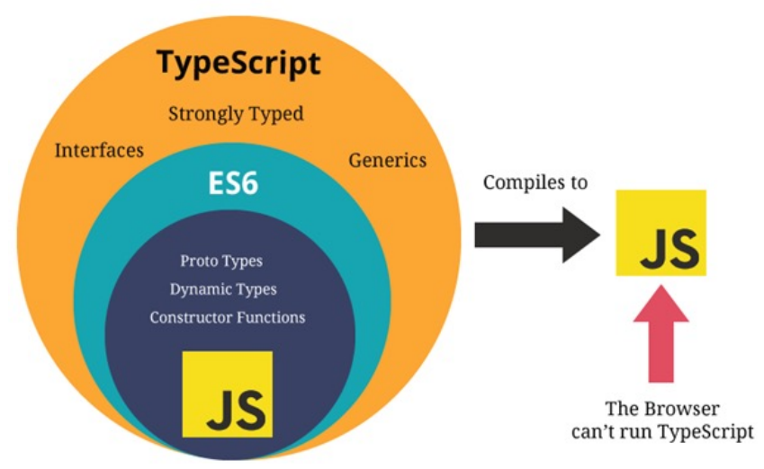

## TypeScript初体验

TypeScript是拥有类型的JavaScript超集，它可以编译成普通、干净、完整的JavaScript代码。

**安装**

```elm
npm install typescript -g
```

**查看版本**

```elm
tsc --version
```


<span style="backGround: #efe0b9">Demo.ts</span>

```javascript
let message: string = 'hey'

function foo(payload: string) {
  console.log(payload.length)
}

// foo(123)
foo("aaa")
```

:ghost: 限制了传参类型，不传参（相当于undefined）也会报错警告。


**生成同名js文件**

```elm
tsc demo.ts
```

:turtle: 可以通过这种方式去生成编译好的 js 文件，但是项目中一般不这么繁琐操作。


## 运行环境

### Node环境（ts-node）


安装库

```elm
npm install ts-node -g
```

安装相关依赖

```elm
npm install tslib @types/node -g
```

运行 ts 文件

```elm
ts-node demo.ts
```


### 浏览器环境（webpack）

> 实际项目中更常用的方案。


#### 基本配置

初始化

```elm
npm init -y
```

安装 webpack

```elm
npm install webpack webpack-cli -D
```

安装 loader

```elm
npm install ts-loader typescript -D
```

生成配置文件

```elm
tsc --init
```

:ghost: 使用该命令将自动生成 ts 的配置文件 <span style="color: #a50">tsconfig.json</span>，对于该实现方式它是必须的。


#### 使用本地服务

本地服务

```elm
npm install webpack-dev-server -D
```

:ghost: 使用本地服务，每次改动代码后无需手动打包。

配置命令

```javascript
"scripts": {
  "serve": "webpack serve"
},
```

模板插件

```elm
npm install html-webpack-plugin -D
```

<span style="backGround: #efe0b9">webpack.config.js</span>

```javascript
const path = require('path')
const HtmlWebpackPlugin = require('html-webpack-plugin') // 根据自定义模板生成入口文件

module.exports = {
  mode: "development",
  entry: "./src/main.ts",
  output: {
    path: path.resolve(__dirname, "./dist"),
    filename: "bundle.js"
  },
  devServer: {
  },
  resolve: {
    extensions: [".ts", ".js", ".cjs", ".json"] // 不能省略后面的类型，有些依赖本身导入了该类型
  },
  module: {
    rules: [
      {
        test: /\.ts$/,
        loader: 'ts-loader'
      }
    ]
  },
  plugins: [
    new HtmlWebpackPlugin({
      template: "./index.html"
    })
  ]
}
```


## 变量声明

> 声明了类型后 TypeScript 就会进行<span style="color: #a50">类型检测</span>，声明的类型可以称之为<span style="color: #a50">类型注解</span>（红色部分）； 

  let age<span style="color: #ff0000">: number</span> = 18


<span style="backGround: #efe0b9">Demo.ts</span>

```javascript
var name: string = "why"  // 不推荐使用 var
let age: number = 18
const height: number = 1.88

// string: TypeScript中的字符串类型
// String: JavaScript的字符串包装类的类型
const message: string = "Hello World"

// 类型推导
let foo = "foo"
foo = 3 // 会给出警告

export {}
```

:star2: 不同的大小写格式，类似于 String 和 string，它们的差异很大。

:whale: <span style="color: #a50">类型推导</span>：默认情况下进行赋值时, 会将赋值的值的类型, 作为前面标识符的类型。

:whale: 使用 `export {}` 以便编译器将其视作模块使用。


## JS和TS的数据类型

:ghost: 作为 JavaScript 的超集，TypeScript 拥有它的任意数据类型。



### JavaScript类型


#### 数字&布尔值&字符串

```javascript
let num: number = 123

let flag: boolean = true

let message: string = 'hello'
```

与 js 一样，ts 不区分整数类型（int）和浮点型（double），统一为 number 类型


**个人习惯**

```
let num = 123
```

:turtle: 默认情况下，如果可以推导出对应的标识符的类型时（初始赋值），不加类型注释。


#### 数组

```typescript
// 写法一，不推荐，语法与 react 的 jsx 冲突
const names1: Array<string> = [] 
// 写法二
const names2: string[] = []      
```

:ghost: 在 ts 中，数组中一般存放同种类型的元素。


#### 对象

```javascript
/* 写法一，推荐使用 */
const info = {
  name: "why",
  age: 18
}

console.log(info.name)
```

```javascript
/* 写法二，这种情况下编译器会报错 */
const info: object = {
  name: "why",
  age: 18
}

console.log(info.name) // 读写属性都会报错：object 类型中没有这个属性
```


#### null&undefined

```javascript
let n1: null = null
let n2: undefined = undefined

n1 = 123 // 报错
```

```javascript
let n1 = null
n1 = 123
```

:ghost: 添加类型注释后，它们的值只允许为自身；不添加则不限制。


#### symbol

```javascript
const title1 = Symbol("title")
const title2 = Symbol('title')

const info = {
  [title1]: "程序员",
  [title2]: "老师"
}
```


### TypeScript类型

#### any

```javascript
let message: any = "hey"
message = 123
message = {}

// 可以获取不存在的属性、使用不存在的方法
console.log(message.demo) 
```

:ghost: 用处一：由于它不限制类型，可以视为讨巧的 ts，像原生 js 一样。由于用起来没有保障，熟练后不推荐使用

:ghost: 用处二：类型断言

```javascript
// 允许数组中添加任意类型元素
const arr: any[] = []
```


#### unknown

描述类型不确定的变量时，可以使用 <span style="color: #a50">unknown</span> 

```javascript
foo: () => 1
bar: () => '1'

// 最好不要使用any：它允许赋值给其它类型
let result: unknown
if (2 > 1) {
  result = foo()
} else {
  result = bar()
}
```

**与any的差异**

```javascript
let result: unknown

result = 1

let num: number = result // 警告
```

:turtle: <span style="color: #a50">unknown</span>  只能赋值给 any 和 unknown 类型。

```javascript
let result: any

result = 1

let num: string = result // 不会警告
```

:turtle: <span style="color: #a50">any</span> 可以赋值给其它任意类型。


#### void

用来指定函数没有返回值，一般会省略。

```javascript
function sum(num1: number, num2: number):void {
  console.log(num1 + num2)
}
```

:ghost: 添加时，允许显示返回 null 或 undefined 。


#### never

> 若函数出现死循环或者抛出异常，它不会返回东西，这时适合用 <span style="color: #a50">never</span> ，而不是 void。

```javascript
// 死循环
function foo(): never {
  while(true) {}
}

// 异常
function bar(): never {
  throw new Error()
}
```

**使用场景**

> 封装函数时，内部只处理了字符串和数字类型。后来的开发人员想让它也处理布尔值，于是给参数多添加了一种类型，但是忘记添加处理逻辑。这时执行到相应代码后会报错。

```javascript
// 封装好的核心函数
function handleMessage(message: string | number | boolean) {
  switch (typeof message) {
    case 'string':
      console.log("处理string")
      break
    case 'number':
      console.log("处理number")
      break
    default:
      const check: never = message             // 警告
  }
}
```


#### tuple

##### 使用场景

当给数组添加 any 类型来获得不同类型参数时，参数都为 any 类型，容易出错。 

使用元组类型，既可以获得不同类型参数，又可以限制类型。

- 数组

```javascript
const info: any[] = [undefined, 18, 1.88]

// 不会给出警告，但是编译会出错
console.log(info[0].length) 
```

- 元组

```javascript
// 限制参数的类型和必填
const info: [string, number, number] = ["why", 18, 1.88]

console.log(info[0].length) 
```


##### 使用场景二

定义一个 useState 函数，它的返回值为一个数组，首参为传入值，第二个参数为改变它的方法。

对返回值使用元组，可以限制其元素类型。

```javascript
function useState(state: any) {
  let currentState = state
  const changeState = (newState: any) => {
    currentState = newState
  }

  // 第二个注解为函数类型
  const tuple: [any, (newState: any) => void] = [currentState, changeState]
  return tuple
}

const [counter, setCounter] = useState(10);
setCounter(1000)
```


##### 使用场景二(优化)

> 通过泛型，可以根据入参决定出参的类型。

```javascript
function useState<T>(state: T) {
  let currentState = state
  const changeState = (newState: T) => {
    currentState = newState
  }
  
  const tuple: [T, (newState: T) => void] = [currentState, changeState]
  return tuple
}

const [counter, setCounter] = useState(10);  // 首参，第二参（函数）的入参为数字

const [title, setTitle] = useState("abc");   // 首参，第二参（函数）的入参为字符串
```


### 函数类型

#### 表达式

```javascript
// 写法一
const foo: (() => volid) = () => {}

// 写法二
type: MyFunction = () => volid
const foo: MyFunction = () => {}
```

#### 普通情况

```react
function sum(num1, num2) {
  return num1 + num2
}

// 给参数加上类型注解
function sum(num1: number, num2: number) {
  return num1 + num2
}

// 给返回值加上类型注解
function sum(num1: number, num2: number): number {
  return num1 + num2
}
```

:whale: 由于存在自动推导的机制，开发中，通常情况下不写返回值的类型。

:whale: 某些第三方库处于方便理解，会明确指定返回类型。

#### 上下文类型

```javascript
// 通常情况下, 定义函数时, 需要给参数加上类型注解
function foo(message: string) {}

// 这里的 item 可以不添加类型注解
const names = ["abc", "cba", "nba"]
names.forEach(function(item) {
  console.log(item.split(""))
})
```

:whale: 函数执行的上下文可以帮助确定参数和返回值的类型，故<span style="color: #ff0000">可以不添加类型注解</span>。


#### 函数参数

##### 对象类型

```JavaScript
function printPoint(point: {x: number, y: number, z: number}) {
  console.log(point.x, point.y, point.z)
}

printPoint({x: 123, y: 321, z: 111})
```

:turtle: 正常情况下添加的类型注解会对类型及必填做限制。


##### 可选类型

```javascript
function printPoint(point: {x: number, y: number, z?: number}) {
  console.log(point.x, point.y, point.z)
}

printPoint({x: 123, y: 321})
printPoint({x: 123, y: 321, z: 111})
```


##### 联合类型

```javascript
function printID(id: number|string) {
  if (typeof id === 'string') {
    // 能确定 id 一定是 string 类型，故不会警告
    console.log(id.toUpperCase())
  } else {
    console.log(id)
  }
}

printID(123)
printID("abc")
```

使用联合类型时，需要在内部缩小联合，以推断出更加具体的类型。


##### 可选和联合类型

```javascript
// 类似于 ① message: string|undefined
function foo(message?: string) {
  console.log(message)
}

foo() // 这个对于 ① 是会给警告的, ① 需要显示传入 undefined 或 字符串
foo(undefined)
```


##### 类型别名

```javascript
type IDType = string | number | boolean
type PointType = {
  x: number
  y: number
  z?: number
}

function printId(id: IDType) {}

function printPoint(point: PointType) {}
```

:ghost: 通过 <span style="color: #a50">type</span> 可以定义类型别名，可以提高代码复用性。


### 类型补充

#### 类型断言

> 通过 as 转化成更为具体的类型，能够使用相应的方法或属性。

```javascript
/* 推导为 HTMLElement，故读写 src 会警告 */
const el = document.getElementById("why")
el.src = "xxx" 

/* 不警告 */
const el2 = document.getElementById("why") as HTMLImageElement
el2.src = "xxx"
```


##### 其它例子

```javascript
class Person {}

class Student extends Person {
  studying() {}
}

function sayHello(p: Person) {
    
  /* Person上没有该方法，警告 */
  p.studying() 
    
  /* 指明了更具体的类型，不会警告 */ 
  (p as Student).studying()
}

const stu = new Student()
sayHello(stu)
```

:whale: 由于 Student 是 Person 的子类，用它的实例作为函数参数不会有问题。


##### 强制转化

> 也可以转化成不太具体的类型，逃过编译的类型检测，但不推荐这种写法，容易造成混乱。

```javascript
const message = "Hello World"

// 警告
const num: number = message as number 

// 不会警告
const num: number = (message as any) as number
```


#### 非空类型断言

```javascript
// 该函数的定义本身有问题：不传参时
function printMessageLength(message?: string) {
  console.log(message.length)
}

printMessageLength("aaaa")
```

:whale: 上述代码，当存在 <span style="color: #a50">tsconfig.json</span> 文件或使用 `ts-node` 编译时，就会给出警告。

```javascript
function printMessageLength(message?: string) {
  // 通过类型缩小避免警告
  if (message) {
    console.log(message.length)
  }
  // 非空断言
  console.log(message!.length)
}
```

:ghost: 非空断言使用 `!` ，表示确定某个标识符是有值的，<span style="color: #ff0000">跳过</span>ts在编译阶段对它的<span style="color: #ff0000">检测</span>。


#### 可选链的使用

> 为 ES11 中新增的特性，非 ts 独有。

```javascript
type Person = {
  name: string
  friend?: {
    name: string
    age?: number,
  }
}

const info: Person = {
  name: "why",
  friend: {
    name: "kobe",
  }
}

console.log(info.friend.name)  // 不能通过编译，因为 info.friend 有可能为 undefined
console.log(info.friend?.name) // 通过编译
console.log(info.friend?.age)  // 通过编译
```

:ghost: 当对象的属性不存在时，会短路而不执行跟随的代码，直接<span style="color: #ff0000">返回undefined</span>。

:ghost: 可选链用于读取，不能进行写入。


#### ??和!!操作符

> `??` 操作符为 ES11 中新增的特性，非 ts 独有。

```javascript
const str = "Hey"
// 下面操作等价，将任意类型转换为布尔类型
let flag = Boolean(str)
let flag = !!str

const result = str ?? "123"
```

<span style="color: #f7534f;font-weight:600">空值合并操作符（??）</span> 当操作符的左侧是 null 或者 undefined 时，返回其右侧操作数，否则返回左侧操作数。

:ghost: 与逻辑或（||）的差别：使用逻辑或时，当左侧为的值能够转化为 false 时，就会取右侧操作数。


#### 字面量类型

```javascript
/* 类型为 "hey" */
let str: "hey" = "hey" 

str = "hey"
str = "other" // 警告
```

:ghost: 字面量也可以用作类型，此时给它的赋值要求与字面量一致。


##### 结合联合类型

> 字面量类型的使用场景。

```javascript
type Alignment = 'left' | 'right' | 'center'

let align: Alignment = 'left'

align = 'right'
align = 'other' // 警告
```


#### 字面量推断

```javascript
type Method = 'GET' | 'POST'
function request(url: string, method: Method) {}

const options = {
  url: "https://abc/xx",
  method: "POST"
} 

// 报错，推导 options.method 为 string 类型
request(options.url, options.method) 
```

##### 方法一

> 使用类型别名。

```javascript
type Method = 'GET' | 'POST'
function request(url: string, method: Method) {}

type Request = {
  url: string,
  method: Method
}

const options: Request = {
  url: "https://abc/xx",
  method: "POST"
}

request(options.url, options.method)
```

##### 方法二

> 使用类型断言（推荐）。

```javascript
type Method = 'GET' | 'POST'
function request(url: string, method: Method) {}

const options = {
  url: "https://abc/xx",
  method: "POST"
}

request(options.url, options.method as Method)
```

##### 方法三

```javascript
type Method = 'GET' | 'POST'
function request(url: string, method: Method) {}

const options = {
  url: "https://abc/xx",
  method: "POST"
} as const
// options.url 的类型为 "https://abc/xx"
// options.method 的类型为 "POST"

request(options.url, options.method)
```


### 类型缩小

> 通过类型缩小，可以改变TypeScript的执行路径。


#### typeof

```javascript
type IDType = number | string
function printID(id: IDType) {
  if (typeof id === 'string') {
    console.log(id.toUpperCase())
  } else {
    console.log(id)
  }
}
```


#### 平等缩小

```javascript
type Direction = "left" | "right" | "top" | "bottom"

// 结合 === == !== != 的 if 判断
function printDirection(direction: Direction) {
  if (direction === 'left') {
    console.log(direction)
  } else if ()
}

// switch 判断 
function printDirection2(direction: Direction) {
  switch (direction) {
    case 'left':
      console.log(direction)
      break;
    case ...
  }
}
```


#### instanceof

```javascript
function printTime(time: string | Date) {
  if (time instanceof Date) {
    console.log(time.toUTCString())
  } else {
    console.log(time)
  }
}
```

> 对于类创建处理的实例，也可以进行判断。

```javascript
class Student {
  studying() {}
}

class Teacher {
  teaching() {}
}

function work(p: Student | Teacher) {
  if (p instanceof Student) {
    p.studying()
  } else {
    p.teaching()
  }
}

const stu = new Student()
work(stu)
```


#### in

> 用于判断对象是否有对应的属性/方法。

```javascript
type Fish = {
  swimming: () => void
}

type Dog = {
  running: () => void
}

function walk(animal: Fish | Dog) {
  if ('swimming' in animal) {
    animal.swimming()
  } else {
    animal.running()
  }
}

const fish: Fish = {
  swimming() {
    console.log("swimming")
  }
}

walk(fish)
```


### 函数类型解析

#### 函数的类型

##### 函数作为参数

```javascript
function foo() {}

type FooFnType = () => void
function bar(fn: FooFnType) {
  fn()
}

bar(foo)
```

```javascript
/* 等价写法 */
function bar(fn: () => void) {
  fn()
}
```

##### 赋值给常量

```javascript
type AddFnType = (num1: number, num2: number) => number
const add: AddFnType = (a1: number, a2: number) => {
  return a1 + a2
}
```

:whale: 定义类型别名时，形参的命名没有限制。

```javascript
type AddFnType = (num1: number, num2: number) => void
```

> 也可以这样定义类型， void 接受任何类型的返回值。


##### 案例

```javascript
function calc(n1: number, n2: number, fn: (num1: number, num2: number) => number) {
  return fn(n1, n2)
}

const result1 = calc(20, 30, function(a1, a2) {
  return a1 + a2
})
console.log(result1)

const result2 = calc(20, 30, function(a1, a2) {
  return a1 * a2
})
console.log(result2)
```

> 其中的 a1 和 a2 没有显示添加的类型注解，因为它属于上下文类型。


#### 可选类型

```javascript
function foo(x: number, y?: number) {}

foo(20, 30)
foo(20)
```

:ghost: 可选类型必须写在必选类型的后面。


#### 默认值

```javascript
function foo(x: number, y: number = 20) {
  console.log(x, y)
}

foo(30)
```

:ghost: 规范的参数定义顺序：必传参数 - 有默认值的参数 - 可选参数


#### 剩余参数

> 剩余参数语法允许我们将<span style="color: #ff0000">不定数量</span>的参数放到一个数组中。

```javascript
function sum(initalNum: number, ...nums: number[]) {
  let total = initalNum
  for (const num of nums) {
    total += num
  }
  return total
}

console.log(sum(20, 30))
console.log(sum(20, 30, 40))
```


#### 可推导的this类型

```javascript
const info = {
  name: "why",
  eating() {
    console.log(this.name + " eating")
  }
}

info.eating()
```

:ghost: TypeScript 认为函数 eatin g有一个对应的 this 的外部对象 info，所以在使用时，就会把 this 当做该对象。


#### 不确定的this类型

```javascript
function say(message: string) {
  console.log(this.name + "eating", message);
}

const info = {
  name: 'demo',
  say
}

info.say() // 警告
```

:whale: ts 进行类型检测的目的是让我们的代码更加的安全。

:octopus: 对于 ts 编译器来说，虽然 this 指向 info 对象，但这个代码是非常不安全的，因为它有可能被别的对象调用。

> 需要明确指定 this 的类型。

```javascript
type ThisType = { name: string };

function eating(this: ThisType, message: string) {
  console.log(this.name + "eating", message);
}

const info = {
  name: "why",
  eating: eating,
};

// 隐式绑定
info.eating("哈哈哈");

// 显示绑定
eating.call({name: "kobe"}, "呵呵呵")
eating.apply({name: "james"}, ["嘿嘿嘿"])
```


#### 函数的重载

```javascript
// 函数的重载: 函数的名称相同, 但是参数不同的几个函数, 就是函数的重载
function add(num1: number, num2: number): number; // 没函数体
function add(num1: string, num2: string): string;

function add(num1: any, num2: any): any {
  if (typeof num1 === 'string' && typeof num2 === 'string') {
    return num1.length + num2.length
  }
  return num1 + num2
}

const result = add(20, 30)
const result2 = add("abc", "cba")

// 在函数的重载中, 实现函数是不能直接被调用的，必须存在匹配的声明
add({name: "why"}, {age: 18})  // 报错
```

:ghost: 使用函数重载时，它的声明（无函数体）与实现分开。ts 会根据调用时传入的参数，找到匹配的声明，且必须存在匹配的声明。


#### 联合 vs 重载

> 实际开发时，在可能的情况下，尽量选择使用 [联合类型] 来实现。

联合

```javascript
function getLength(args: string | any[]) {
  return args.length
}

console.log(getLength("abc"))
console.log(getLength([1, 22, 3]))
```

函数的重载

```javascript
function getLength(args: string): number;
function getLength(args: any[]): number;

function getLength(args: any): number {
  return args.length
}

console.log(getLength("abc"))
console.log(getLength([1, 22, 3]))
```

:whale: 这个例子中不管传入哪种类型，都有 length 属性，且返回值类型确定，优先使用联合类型。

:whale: 对于一些过于复杂的情况，使用联合类型无法确定返回值类型，可以考虑函数的重载。


## 类

> 实际上在 js 的开发过程中，我们更加习惯于函数式编程，如 Composition API。
>
> 但是在封装某些业务的时候，类具有更强大封装性，也会被使用到。


### 类的定义

> 在 ts 中定义类时，必须初始化属性的值。可以在构造器中进行。

```javascript
class Person {
  name: string = 'demo'
  age: number = 18

  eating() {
    console.log(this.name + " eating")
  }
}

const p = new Person()
p.eating()
```

```javascript
class Person {
  name: string
  age: number

  constructor(name: string, age: number) {
    this.name = name
    this.age = age
  }

  eating() {
    console.log(this.name + " eating")
  }
}

const p = new Person("demo", 18)
p.eating()
```


### 类的继承

**普通写法**

> 会发现有些类之间存在大量重复的属性和方法（行为），可以将其抽离，视作父类。

```
class Student {
  name: string = ''
  age: number = 0
  sno: number = 0

  eating() {
    console.log("eating")
  }

  studying() {
    console.log("studying")
  }
}

class Teacher {
  name: string = ''
  age: number = 0
  subject: string = ''

  eating() {
    console.log("eating")
  }

  teaching() {
    console.log("teaching")
  }
}
```

**使用继承**

```javascript
class Person {
  name: string
  age: number

  constructor(name: string, age: number) {
    this.name = name
    this.age = age
  }

  eating() {
    console.log("eating 100行")
  }
}

class Student extends Person {
  sno: number

  constructor(name: string, age: number, sno: number) {
    // super调用父类的构造器
    super(name, age)
    this.sno = sno
  }

  eating() {
    console.log("student eating")
    super.eating()
  }

  studying() {
    console.log("studying")
  }
}

const stu = new Student("why", 18, 111)
stu.eating()
```

:whale: 调用实例方法时，如果实例上没有该方法，就会去父类上找。

:whale: 如果实例也有该方法，相当于方法重写，会调用实例上的方法；在内部可以使用 `super.x()`，表示同时使用父类的该方法。


### 类的多态

```javascript
class Animal {
  action() {
    console.log("a")
  }
}

class Dog extends Animal {
  action() {
    console.log("d")
  }
}

class Fish extends Animal {
  action() {
    console.log("f")
  }
}

// 多态的目的是为了写出更加具备通用性的代码，这里的结构比联合类型/函数重载要更简单
function makeActions(animals: Animal[]) {
  animals.forEach(animal => {
    animal.action()
  })
}

makeActions([new Dog(), new Fish()]) // 输出 d f
```

:ghost: 这里的父类类型指向子类（构造出来）的对象，所以函参的 animal 指向子类。


### 类的成员修饰符

#### public

```javascript
class Person {
  public name: string = "springLoach"
}
/* 等价 */
class Person {
  name: string = "springLoach"
}

const p = new Person()
console.log(p.name)
```

:ghost: 默认的修饰符，可以在任何地方访问该属性/方法。


#### private

```javascript
class Person {
  private name: string = "springLoach"

  getName() {
    return this.name
  }

  setName(newName) {
    this.name = newName
  }
}

const p = new Person()
console.log(p.getName())
p.setName("why")
p.name  // 警告
```

:ghost: 仅在类内部可以访问，实例等地方不行


#### protected

```javascript
class Person {
  protected name: string = "123"
}

class Student extends Person {
  getName() {
    return this.name
  }
}

const stu = new Student()
console.log(stu.getName())
stu.name // 警告
```

:ghost: 在类内部和子类中可以访问，实例等位置不允许。


### 只读属性

```javascript
class Person {
  readonly name: string = "springLoach"
}

const p = new Person()

console.log(p.name)
p.name = "123"  // 警告
```

> 通常这样使用：只读属性是可以在构造器中赋值, 赋值之后就不可以修改。

```javascript
class Person {
  readonly name: string
  constructor(name: string, friend?: Person) {
    this.name = name
    this.friend = friend
  }
}

const p = new Person("springLoach")

console.log(p.name)
p.name = "123"  // 警告
```


### 访问器

> 私有属性是不能直接访问的，但可以借助访问器（存取器）。

```javascript
class Person {
  private _name: string
  constructor(name: string) {
    this._name = name
  }

  // setter / getter
  set name(newName) {
    this._name = newName
  }
  get name() {
    return this._name
  }
}

const p = new Person("why")
p.name = "coderwhy"
console.log(p.name)
```

:hammer_and_wrench: 对于私有属性，使用 `_` 作为开头命名。


### 静态成员

> 可以直接通过类，而不是类的实例访问。

```javascript
class Student {
  static time: string = "20:00"

  static attendClass() {
    console.log("去学习~")
  }
}

console.log(Student.time)
Student.attendClass()
```


### 抽象类

> 适用于父类本身并不需要对某些方法进行具体的实现。

```javascript
function makeArea(shape: Shape) {
  return shape.getArea()
}

/* 抽象类 */
abstract class Shape {
  abstract getArea(): number
}

class Rectangle extends Shape {
  private width: number
  private height: number

  constructor(width: number, height: number) {
    super()
    this.width = width
    this.height = height
  }

  getArea() {
    return this.width * this.height
  }
}

class Circle extends Shape {
  private r: number

  constructor(r: number) {
    super()
    this.r = r
  }

  getArea() {
    return this.r * this.r * 3.14
  }
}

const rectangle = new Rectangle(20, 30)
const circle = new Circle(10)

console.log(makeArea(rectangle))
console.log(makeArea(circle))
```

:ghost: 抽象类需要用 <span style="color: #a50">abstract</span> 关键字定义，内部的抽象方法也需要用 <span style="color: #a50">abstract </span>定义，且无需函数体。

:ghost: 抽象类不能被实例化，在它的子类中被要求<span style="color: #ff0000">必须实现它的抽象方法</span>。

:ghost: 子类的构造函数中一定要调用 <span style="color: #a50">super</span>，即便父类没有显示定义 constructor。


### 类的类型

```javascript
class Person {
  name: string = "cat"
  eating() {}
}

const p = new Person()

const p1: Person = {
  name: "demo",
  eating() {}
}
```

:ghost: 可以通过对象的方式来创建该类的类型，要求对象属性与类成员完全一致，不能多也不能少。

> 使用场景，可以直接将对象字面量作参，满足类的类型条件，通过类型检测。

```javascript
function printPerson(p: Person) {
  console.log(p.name)
}

printPerson(new Person())
printPerson({name: "kobe", eating: function() {}})
```


## 接口

### 声明对象类型

```javascript
/* 声明 */
type InfoType = {name: string, age: number}

// 大程度上等价于别名写法
interface InfoType {
  name: string
  age: number
}

/* 实现 */
const info: InfoType = {
  name: "why",
  age: 18,
}
```

:ghost: 要求对象属性与接口完全一致，<span style="color: #ff0000">不能多</span>也不能少。


>  同样可以定义可选类型和只读属性

```javascript
interface IInfoType {
  readonly name: string
  age: number
  friend?: {
    name: string
  }
}

const info: IInfoType = {
  name: "why",
  age: 18,
  friend: {
    name: "kobe"
  }
}
```

:hammer_and_wrench: 某些语言中习惯接口以 `I` 作为开头命名。

:whale: 对于可选属性 friend，如果存在就要求必须存在属性 name。


### 索引类型

> 通过 interface 来定义索引类型。

```javascript
interface IndexLanguage {
  [index: number]: string
}

const frontLanguage: IndexLanguage = {
  0: "HTML",
  1: "CSS",
  2: "JavaScript",
  3: "Vue"
}
```

```javascript
interface ILanguageYear {
  [name: string]: number
}

const languageYear: ILanguageYear = {
  "C": 1972,
  "Java": 1995,
  "JavaScript": 1996,
  "TypeScript": 2014
}
```


### 函数类型

```javascript
interface CalcFn {
  (n1: number, n2: number): number
}

function calc(num1: number, num2: number, calcFn: CalcFn) {
  return calcFn(num1, num2)
}

const add: CalcFn = (num1, num2) => {
  return num1 + num2
}

calc(20, 30, add)
```


```javascript
type CalcFn = (n1: number, n2: number) => number
```

:hammer_and_wrench: 定义函数还是建议使用类型别名。


### 接口的继承

```javascript
interface ISwim {
  swimming: () => void
}
interface IFly {
  flying: () => void
}

interface IAction extends ISwim, IFly {

}

const action: IAction = {
  swimming() {},
  flying() {}
}
```

:ghost: 接口也可以通过 <span style="color: #a50">extends</span> 关键字实现继承，并且接口支持<span style="color: #ff0000">多继承</span>。


### 交叉类型

> 交叉类似表示需要满足多个类型的条件，通过 `&` 拼接。

```javascript
interface ISwim {
  swimming: () => void
}

interface IFly {
  flying: () => void
}

type MyType1 = ISwim | IFly
type MyType2 = ISwim & IFly

const obj1: MyType1 = {
  flying() {}
}

const obj2: MyType2 = {
  swimming() {},
  flying() {}
}
```

> 在开发中，进行交叉时，通常是对象类型进行交叉。

```javascript
// 不存在满足这种条件的值
type WType = number & string
```


### 接口的实现

```javascript
interface ISwim {
  swimming: () => void
}

interface IEat {
  eating: () => void
}


// 类可以实现接口
class Person implements ISwim {
  swimming() {}
}

// 类只能单继承，但可以实现多个接口
class Animal {}

class Fish extends Animal implements ISwim, IEat {
  swimming() {}
  eating() {}
}

// 编写一些公共的API: 面向接口编程，要求参数实现 ISwim 接口
function swimAction(swimable: ISwim) {
  swimable.swimming()
}

swimAction(new Fish())
swimAction(new Person())
swimAction({swimming: function() {}})
```


### 接口 vs 别名

> 定义非对象类型时，推荐使用别名，如函数。

#### 接口

```elm
interface IFoo {
  name: string
}

interface IFoo {
  age: number
}
```

```elm
interface IFoo {
  name: string
  age: number
}
```

:ghost: 相同名称的接口会进行合并，这种行为是允许的，上述两种写法等价。

#### 别名

> <span style="color: #a50">type</span> 定义的是别名，别名是不能重复的。

```elm
type IFoo { name: string }

type IFoo { age: number }  // warning
```


### 字面量赋值

**直接赋值**

```javascript
interface IPerson {
  name: string
  age: number
}

// 默认推导的类型与接口不一致，警告
const info: IPerson = {
  name: 'demo',
  age: 123,
  height: 200
}
```

**引用赋值**

```javascript
interface IPerson {
  name: string
  age: number
}

const x = {
  name: 'demo',
  age: 123,
  height: 200
}

// 不会警告
const info: IPerson = x
```

:ghost: 在将引用值赋值给接口类型的变量时，会进行擦除（多余属性），若擦除后能满足接口，则不会报错。


#### 应用场景

```javascript
function printInfo(person: IPerson) {
  console.log(person)
  console.log(person.height) // 报错，IPerson 接口类型没有这个属性
}

const info = {
  name: "why",
  age: 18,
  height: 1.88
}

printInfo(info)
```

:turtle: 当需要传入的对象上有多余属性时，通过该技术不需要删除属性来通过类型检测。

:turtle: 但无法在内部使用这些对于接口而言，多余的属性。


## 枚举类型

### 枚举类型的使用

> 枚举类型可以提供多个可能的值。

```elm
enum Direction {
  LEFT,
  RIGHT,
  TOP,
  BOTTOM
}

function turnDirection(direction: Direction) {
  switch (direction) {
    case Direction.LEFT:
      console.log("改变角色的方向向左")
      break;
    case Direction.RIGHT:
      console.log("改变角色的方向向右")
      break;
    case Direction.TOP:
      console.log("改变角色的方向向上")
      break;
    case Direction.BOTTOM:
      console.log("改变角色的方向向下")
      break;
    default:
      const foo: never = direction;
      break;
  }
}

turnDirection(Direction.LEFT)
turnDirection(Direction.RIGHT)
turnDirection(Direction.TOP)
turnDirection(Direction.BOTTOM)

// 对应标识符、类型、值
let d: Direction = Direction.BOTTOM
```


### 枚举类型的值

```elm
enum Direction {
  LEFT,     // 0
  RIGHT,    // 1
  TOP,      // 2
  BOTTOM    // 3
}

enum Direction {
  LEFT = 10,    
  RIGHT,        // 11
  TOP,          // 12
  BOTTOM        // 13
}

enum Direction {
  LEFT = "LEFT",
  RIGHT = "RIGHT",
  TOP = "TOP",
  BOTTOM = "BOTTOM"
}
```

:turtle: 枚举类型默认是有值的，可以赋予其它值，让它紧接着的值递增。


## 泛型

### 认识泛型

```javascript
// 这个例子参数及返回值的类型一致
function sum<Type>(num: Type): Type {
  return num
}

// 手动传入
sum<number>(20)
sum<{name: string}>({name: "why"})
sum<any[]>(["abc"])

// 类型推导
sum(50)
sum("abc")
```

:ghost: 即在定义函数时, 不决定参数的类型。具体的参数类型在<span style="color: #ff0000">函数调用时提供</span>。


### 接收多个类型参数

```react
function foo<T, E, O>(arg1: T, arg2: E, arg3: O, ...args: T[]) {

}

foo<number, string, boolean>(10, "abc", true)
```

:turtle: 可以将泛型看作是类型的形参，命名不是固定的。


### 泛型接口的使用

```elm
interface IPerson<T1, T2> {
  name: T1
  age: T2
}

const p: IPerson<string, number> = {
  name: "why",
  age: 18
}
```

```elm
interface IPerson<T1 = string, T2 = number> {
  name: T1
  age: T2
}

const p: IPerson = {
  name: "why",
  age: 18
}
```

:turtle: 使用泛型接口时，没有<span style="color: #a50">类型推导</span>。


### 泛型类的使用

```elm
class Point<T> {
  x: T
  y: T
  z: T

  constructor(x: T, y: T, z: T) {
    this.x = x
    this.y = y
    this.z = y
  }
}

// 类型推导
const p1 = new Point("1.33.2", "2.22.3", "4.22.1")
// 手动传入
const p2 = new Point<string>("1.33.2", "2.22.3", "4.22.1")
const p3: Point<string> = new Point("1.33.2", "2.22.3", "4.22.1")
```


### 泛型的类型约束

```javascript
function getLength<T>(arg: T) {
  return arg.length
}
```

:octopus: 报错，因为某些类型可能不具有 length 属性。

```javascript
interface ILength {
  length: number
}

function getLength<T extends ILength>(arg: T) {
  return arg.length
}

getLength("abc")
getLength(["abc", "cba"])
getLength({length: 100})
```

:turtle: 进行约束，传入的参数类型，必须满足接口，即拥有 length 属性。


## 命名空间

> TS 支持两种方式支持作用域：模块化（ES Module、CommonJS）和命名空间。

```javascript
// 导出供外部文件使用
export namespace time {
  // 导出供外部环境使用
  export function format(time: string) {
    return "2222-02-22"
  }
}

export namespace price {
  export function format(price: number) {
    return "99.99"
  }
}

time.format()
price.format()
```

:whale: 命名空间实际上是 ts 早期实现作用域的方式，可以看作模块化的内部模块化。


## 类型声明

### 类型声明文件

以 `.d.ts` 作为结尾，用来做类型的声明(declare)。 它仅仅用来做类型检测，告知 typescript 我们有哪些类型。


### 类型声明的查找

- 内置类型声明

- 外部类型声明

- 自定义类型声明


#### 内置类型声明

> Typescript 在安装时，内置了 JavaScript 运行时的一些标准化API的声明文件

- 如内置类型 Math、Date
- 也包括 DOM API，比如 Window、Document 等

```javascript
const imageEl = document.getElementById("image")
const imageE2 = demo.getElementById("image")        // 没有声明，警告
```


#### 外部类型声明

<span style="color: #f7534f;font-weight:600">方式一</span>  在自己库中进行类型声明（编写 `.d.ts` 文件），如 axios

<span style="color: #f7534f;font-weight:600">方式二</span> 用社区的公有库 [DefinitelyTyped](https://github.com/DefinitelyTyped/DefinitelyTyped/) 存放类型声明文件，如 lodash

:whale: 库没有类型声明时，可以去[搜索](https://www.typescriptlang.org/dt/search?search=)某些三方库的类型声明文件的安装方式。


**案例**

```javascript
import axios from 'axios'
import lodash from 'lodash' // 警告：找不到声明类型
```

> 在 ts 安装第三库后，在 ts 文件引入时，有部分的库会给出警告而无法正常使用。


#### 自定义类型声明

<span style="backGround: #efe0b9">项目/demo.d.ts</span>

```javascript
declare module 'lodash' {
  export function join(arr: any[]): void
}
```

:whale: 该文件不需要导出的操作，编译前会自动扫描  `.d.ts` 文件。 

<span style="backGround: #efe0b9">abc.ts</span>

```javascript
import lodash from 'lodash'
console.log(lodash.join(["abc", "cba"]))
```

> 这样以后，上面的代码不会给出类型未声明的警告。


### 不同的类型声明

<span style="backGround: #efe0b9">项目/demo.d.ts</span>

```javascript
// 声明模块
declare module 'lodash' {
  export function join(arr: any[]): void
}

// 声明变量/函数/类
declare let whyName: string
declare let whyAge: number
declare let whyHeight: number

declare function whyFoo(): void

declare class Person {
  name: string
  age: number
  constructor(name: string, age: number)
}

// 声明文件
declare module '*.jpg'
declare module '*.jpeg'
declare module '*.png'
declare module '*.svg'
declare module '*.gif'

// 声明命名空间
declare namespace $ {
  export function ajax(settings: any): any
}
```


#### 声明变量/函数/类

<span style="backGround: #efe0b9">index.html</span>

```html
<script>
  let whyName = "coderwhy"
  let whyAge = 18
  let whyHeight = 1.88

  function whyFoo() {
    console.log("whyFoo")
  }

  function Person(name, age) {
    this.name = name
    this.age = age
  }
</script>
```

<span style="backGround: #efe0b9">项目/demo.d.ts</span>

```javascript
// 声明变量/函数/类
declare let whyName: string
declare let whyAge: number
declare let whyHeight: number

declare function whyFoo(): void

declare class Person {
  name: string
  age: number
  constructor(name: string, age: number)
}
```

<span style="backGround: #efe0b9">demo.ts</span>

```elm
console.log(whyName)
console.log(whyAge)
console.log(whyHeight)

whyFoo()

const p = new Person("why", 18)
console.log(p)
```

:turtle: 声明后，相当于告诉编译器 “存在”  相应的类型，以通过类型检测。


#### 声明文件

<span style="backGround: #efe0b9">项目/demo.d.ts</span>

```javascript
// 声明文件
declare module '*.jpg'
declare module '*.jpeg'
declare module '*.png'
declare module '*.svg'
declare module '*.gif'
```

<span style="backGround: #efe0b9">demo.ts</span>

```javascript
import nhltImage from './img/nhlt.jpg'
```

:turtle: 声明后，相当于将这些文件视为模块，以通过类型检测。


#### 声明命名空间

<span style="backGround: #efe0b9">index.html</span>

```html
<script src="https://cdn.bootcdn.net/ajax/libs/jquery/3.6.0/jquery.js"></script>
```

<span style="backGround: #efe0b9">项目/demo.d.ts</span>

```javascript
// 声明命名空间
declare namespace $ {
  export function ajax(settings: any): any
}
```

<span style="backGround: #efe0b9">demo.ts</span>

```javascript
$.ajax({})
```


