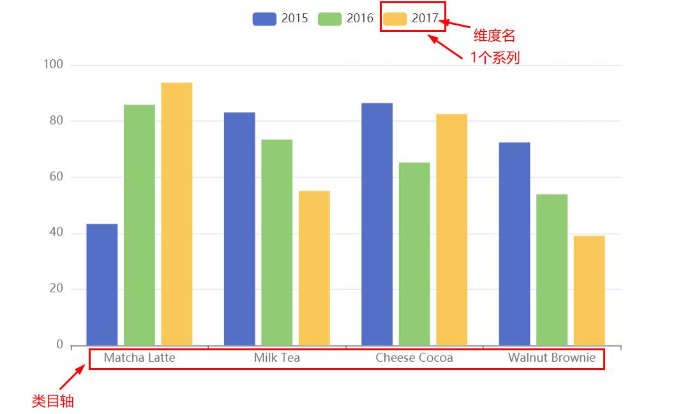

### 自定义南丁格尔图

| 配置                             | 作用                                                         |
| -------------------------------- | ------------------------------------------------------------ |
| backgroundColor                  | 全局设置背景色                                               |
| series.roseType                  | 显示成南丁格尔图，通过半径表示数据的大小                     |
| series.data...                   | 数组元素排序                                                 |
| series.itemStyle                 | 添加阴影效果                                                 |
| series.itemStyle                 | 设置扇形的颜色                                               |
| series.label.color               | 设置该系列的文本颜色                                         |
| series.labelLine.lineStyle.color | 设置视觉引导线的颜色                                         |
| visualMap.min                    | 与下面的属性共同形成视觉映射的定义域                         |
| visualMap.max                    | 即程度的两个端值，与下面定义的范围相联系                     |
| visualMap.inRange                | 定义范围内的[视觉元素](https://echarts.apache.org/zh/option.html#visualMap-continuous.inRange) |
| series.animationType             | 动画类型                                                     |
| series.animationEasing           | 初始动画的[缓动效果](https://echarts.apache.org/examples/zh/editor.html?c=line-easing) |
| series.animationDelay            | 初始动画的延迟，支持回调函数                                 |

```react
option = {
    backgroundColor: '#2c343c', 
    series: [
        {
            name: '访问来源',
            type: 'pie',
            radius: '55%',
            roseType: true,
            data:[
                {value:235, name:'视频广告'},
                {value:274, name:'联盟广告'},
                {value:310, name:'邮件营销'},
                {value:335, name:'直接访问'},
                {value:400, name:'搜索引擎'}
            ].sort(function (a, b) { return a.value - b.value; }),
            label: {
                color: 'rgba(255, 255, 255, 0.3)'
            },
            labelLine: {
                lineStyle: {
                    color: 'rgba(255, 255, 255, 0.3)'
                }
            },
            itemStyle: {
                // 设置扇形的颜色
                color: '#c23531',
                color: 'skyblue',
                // 设置扇形的阴影  
                shadowBlur: 200,
                shadowColor: 'rgba(0, 0, 0, 0.5)'
            },
            /* 动画效果 */
            animationType: 'scale',
            animationEasing: 'elasticOut',
            animationDelay: function (idx) {
                // 随机延时
                return Math.random() * 200;
                // 越往后越迟
                return idx * 100;
            }
        },
    ],
    visualMap: {
        // 不显示 visualMap 组件，只用于明暗度的映射
        show: false,
        // 映射的最小值为 80
        min: 80,
        // 映射的最大值为 600
        max: 600,
        inRange: {
            // 明暗度的范围是 0 到 1
            colorLightness: [0, 1]
        }
    }
}
```

### 样式简介

#### 颜色主题（Theme）

> 默认主题有 `'light'` 和 `'dark'`，在[初始化实例](https://github.com/SpringLoach/Vue/blob/main/plugins/ECharts/base.md#echarts的基本使用)时，将相应字符串作为第二个参数即可。

　　1. 需要使用其它主题时，可以在 [主题编辑器](https://echarts.apache.org/zh/theme-builder.html) 中按需修改、下载。

　　2. 下载主题 -> JS 版本 -> 将文件保存至 `*.js`

　　3. 在 HTML 中引用该文件 -> 初始化实例时，将对应的 `'*'` 作为注册的主题名字，即第二参。

#### 调色盘

> 值为 11 个颜色字符串组成的数组。

| 配置           | 作用           |
| -------------- | -------------- |
| color          | 全局调色盘     |
| 系列中的 color | 系列专属调色盘 |

#### 直接的样式设置

> 纵观 ECharts 的 option 中，很多地方可以设置 itemStyle、lineStyle、areaStyle、label 等等。
>
> 分别对应图形样式、线样式、...、标签样式。

#### 高亮样式emphasis

> 即鼠标悬浮到图形元素上时的样式，该属性中的结构与普通样式的结构相同。
>
> 该属性作为 itemStyle（普通样式）的属性存在。

### 异步数据加载和更新

> 在图表初始化后不管任何时候再通过 `setOption` 填入数据和配置项就行。
>
> 在更新数据的时候推荐给系列添加上 `name` 属性以正常更新。

#### loading动画

> ECharts 默认提供一个简单的加载动画，告诉用户数据正在加载。

| 实例方法              | 作用         | 说明           |
| --------------------- | ------------ | -------------- |
| myChart.showLoading() | 显示加载动画 | /              |
| myChart.hideLoading() | 隐藏加载动画 | 获取数据后调用 |

#### 数据的动态更新

> 所有数据的更新都通过 setOption 实现，ECharts 会找到两组数据之间的差异然后通过合适的动画去表现数据的变化。
>
> 如果只需要加入单个数据，可以先 data.push(value) 后 setOption。

------

### 使用dataset管理数据

> 可以单独管理数据，并使数据被多个组件复用。

#### 简单柱状图

| 配置                    | 作用                  | 默认                                  |
| ----------------------- | --------------------- | ------------------------------------- |
| legend                  | 启用图例组件          | /                                     |
| tooltip                 | 启用提示框组件        | /                                     |
| dataset.source          | 提供数据              | /                                     |
| xAxis.type = 'category' | 声明一个 X 轴为类目轴 | 类目轴对应 dataset 首列               |
| yAxis                   | 声明一个 Y 轴，数值轴 | /                                     |
| series 对象数组         | 声明多个系列          | 每个系列会自动对应到 dataset 的下一列 |
| ..                      | ..                    | 自动判断维度首项是否为维度名          |

```react
option = {
    legend: {},
    tooltip: {},
    dataset: {
        source: [
            ['product', '2015', '2016', '2017'],
            ['Matcha Latte', 43.3, 85.8, 93.7],
            ['Milk Tea', 83.1, 73.4, 55.1],
            ['Cheese Cocoa', 86.4, 65.2, 82.5],
            ['Walnut Brownie', 72.4, 53.9, 39.1]
        ]
    },
    xAxis: {type: 'category'},
    yAxis: {},
    series: [
        {type: 'bar'},
        {type: 'bar'},
        {type: 'bar'}
    ]
}
```



也可以使用常见的对象数组的格式，用 dimensions 指定维度的顺序，它们不支持 [seriesLayoutBy](https://github.com/SpringLoach/Vue/blob/main/plugins/ECharts/直角坐标系.md#series)。

```react
dataset: {
   // 此时系列对应的列顺序为 '2017' →  '2016' → '2015'
   dimensions: ['product', '2017', '2016', '2015'],
   source: [
       {product: 'Matcha Latte', '2015': 43.3, '2016': 85.8, '2017': 93.7},
       {product: 'Milk Tea', '2015': 83.1, '2016': 73.4, '2017': 55.1},
       {product: 'Cheese Cocoa', '2015': 86.4, '2016': 65.2, '2017': 82.5},
       {product: 'Walnut Brownie', '2015': 72.4, '2016': 53.9, '2017': 39.1}
   ]
}
// 内部也可以这样
source: {
    'product': ['Matcha Latte', 'Milk Tea', 'Cheese Cocoa', 'Walnut Brownie'],
    'count': [823, 235, 1042, 988],
    'score': [95.8, 81.4, 91.2, 76.9]
}
```

#### 数据到图形的映射

> 默认情况下，将使用每一列作为一个维度，即按列映射。
>
> 未指定映射关系时：X 坐标轴声明为类目轴，对应到 dataset.source 中的第一列，每个系列对应到往后的一列。

可以通过 series.[seriesLayoutBy](https://github.com/SpringLoach/Vue/blob/main/plugins/ECharts/直角坐标系.md#series)，指定按行映射

```react
series: [
  {type: 'bar', seriesLayoutBy: 'row'},
  {type: 'bar', seriesLayoutBy: 'row'},
  {type: 'bar', seriesLayoutBy: 'row'}
]
```

#### 维度

> 当把系列对应到列时，每一列就称为一个维度。
>
> 维度可以有单独的名字，便于在图表中显示。

##### **维度名称**

> ECharts 默认会自动探测 `dataset.source` 中第一行/列是否包含维度名。
>
> 可以设置 `dataset.sourceHeader: true` 显示声明第一行（列）就是维度名。

##### **单独定义维度**

> 可以使用 dataset.dimensions 或 series.dimensions 来定义维度名和维度类型。

| 序号 | 说明                                       |
| ---- | ------------------------------------------ |
| Ⅰ    | 值为数组，数组元素可以是 *str*，表示维度名 |
| Ⅱ    | 数组元素也可以是 null，表示不设置维度名    |
| Ⅲ    | 数组元素也可以是 *obj*，配置 name 和 type  |
| Ⅳ    | 系列的 `dimensions` 属性优先级更高         |

| type      | 维度类型/说明                   |
| --------- | ------------------------------- |
| 'number'  | 默认，普通数据                  |
| 'ordinal' | str 类型的数据                  |
| 'time'    | 时间数据                        |
| 'float'   | 存储时使用 TypedArray，性能较好 |
| 'int'     | 存储时使用 TypedArray，性能较好 |

#### 数据到图形的映射(series.encode)

> 使用该属性可以通过 维度名称 或 维度的序号 来指定映射到某个坐标轴的维度，也可以设置标签、提示框、[指定系列名等](https://echarts.apache.org/zh/tutorial.html#使用 dataset 管理数据)。

```react
series: [
  {
    type: 'bar',
    // 将维度名称为 `amount` 的列设为 X 轴，第六列设为 Y 轴
    encode: {
      x: 'amount',
      y: 5
    }
  }
]
```

#### 默认的encode

> 当没有指定 `series.encode` 时，ECharts 会采用一些默认的映射规则。

| 坐标系 | 栗子       | 条件             | 默认映射规则                               |
| ------ | ---------- | ---------------- | ------------------------------------------ |
| √      | 直角坐标系 | 有类目轴         | 第一列映射到类目轴上，后续每列对应一个系列 |
| √      | 直角坐标系 | 无类目轴，两个轴 | 每两列对应一个系列                         |
| ×      | 饼图       | 两列             | 名字，数值                                 |
| ×      | 饼图       | 一列             | 数值                                       |

#### 多个dataset的使用

> 存在多个数据集组件时，在系列中使用 datasetIndex 指定使用的数据集。

```react
var option = {
    dataset: [{
        source: [...],
    }, {
        source: [...]
    }],
    series: [{
        datasetIndex: 0
    }, {
        datasetIndex: 1
    }]
}
```

#### 系列中的数据

> series.data 会有更高的优先级。
>
> 并非所有图表类型都支持数据集。

------

### 使用transform进行数据转换

> 即将已有的数据集处理后转换为新的数据集。

#### 数据转换基础使用

> 通过 dataset.transform 实现数据转换，将其结果作为该数据集的数据。

| 配置                     | 作用                     |
| ------------------------ | ------------------------ |
| 默认                     | 用第一项数据集作输入     |
| dataset.fromDatasetIndex | 用指定索引的数据集作输入 |
| dataset.fromDatasetId    | 用指定id的数据集作输入   |
| dataset.transform.type   | 转换方法类型             |
| dataset.transform.config | 配置参数对象             |

```react
var option = {
    dataset: [{
        id: 'a'
        source: [
            ['Product', 'Sales', 'Price', 'Year'],
            ['Cake', 123, 32, 2011],
            ['Cereal', 231, 14, 2011],
        ],
    }, {
        transform: {
            type: 'filter',
            config: { dimension: 'Year', value: 2011 }
        },
    }, {
        transform: {
            type: 'filter',
            // 选出维度 'Year' 中值为 2012 的所有数据项
            config: { dimension: 'Year', value: 2012 }
        }
    }],
    series: [{
        type: 'pie', radius: 50,
        datasetIndex: 1
    }]
};
```

#### 数据转换的进阶使用

##### 链式声明transform

> 此时 `transform` 为包含多个对象的数组，对象用前一个对象的输出作为输入。

```react
dataset: [
  {source: [ ... ]}, 
  {transform: [{...}, {...}]}
]
```

##### 在开发环境中debug

> 可以将 transform.print 设置为 true，在控制台打印某次 `transform` 的结果。

### 数据转换器filter

> 能起过滤作用。只需声明 transform.type: "filter"，并给出数据筛选条件即可。

#### 关于维度

> 可以使用 `config.dimension` 指定维度，可以用维度名或索引作值。

```react
config: { dimension: 'Year', '=': 2011 }
```

#### 关于关系比较操作符

| 操作符           | 说明     |
| ---------------- | -------- |
| `>`、`gt`        | 大于     |
| `>=`、`gte`      | 大于等于 |
| `<`、`lt`        | 小于     |
| `<=`、`lte`      | 小于等于 |
| `=`、`eq`        | 等于     |
| `!=`、`ne`、`<>` | 不等于   |
| `reg`            | 提供正则 |

| 序号 | 说明                                           | 栗子                                                         |
| ---- | ---------------------------------------------- | ------------------------------------------------------------ |
| Ⅰ    | 能基于数值大小进行比较                         | /                                                            |
| Ⅱ    | 多个关系操作符能声明在一个对象中，表示与的关系 | `{ dimension: 'Price', '>=': 20, '<': 30 }`                  |
| Ⅲ    | 数据值可以是类数值的字符串，会被消除空格并转换 | /                                                            |
| Ⅳ    | 对日期对象、日期字符串比较时，需指定 `parser`  | `config: { dimension: 3, lt: '2012-05-12', parser: 'time' }` |
| Ⅵ    | 纯字符串只能使用 `=` 或 `!=` 比较              | /                                                            |

#### 关于逻辑比较

| 操作符 | 类型         | 说明      |
| ------ | ------------ | --------- |
| `and`  | 需满足所有项 | *arr:obj* |
| `or`   | 满足任意项   | *arr:obj* |
| `not`  | 排除         | *obj*     |

```react
// 嵌套使用
config: {
    or: [
    {
        and: [{...}, {...}, {not: {...}}]
    }, {
        and: [{...}, {...}, {not: {...}}]
    }]
}
```

#### 关于解析器

> 可以使用 `config.parser` 指定解析器，对值解析后再作比较。

| 值       | 说明                                                       |
| -------- | ---------------------------------------------------------- |
| 'time'   | 把原始值解析成时间戳后再做比较，如 `'2012-05-12 03:11:22'` |
| 'trim'   | 如果原始数据是字符串，将两端空格和换行符去掉               |
| 'number' | 强制把原始数据转成数值                                     |

### 数据转换器sort

> 用于排序数据
>
> 默认将 `数值及可转为数值的字符串` 以外的值视为不可比较值

| config 属性  | 说明                                                         | 可选值                   |
| ------------ | ------------------------------------------------------------ | ------------------------ |
| dimension    | 选择维度                                                     | *str*、*num*             |
| order        | 排序方式                                                     | 'asc'、'desc'            |
| incomparable | 将不可比较值视作最值                                         | 'min'、'max'             |
| parser       | [解析器](https://github.com/SpringLoach/Vue/blob/main/plugins/ECharts/南丁格尔图.md#关于解析器) | 'time'、'trim'、'number' |

```
transform: {
    type: 'sort',
    config: { dimension: 'score', order: 'asc' }
}
```

#### 多维度排序

> 先排序，再将相同数据的组（如果有）的结果排序。

```react
config: [
    { dimension: 'profession', order: 'desc' },
    { dimension: 'score', order: 'desc' }
]
```

#### 使用外部的数据转换器

> [略](https://echarts.apache.org/zh/tutorial.html#使用 transform 进行数据转换)。

### 数据区域缩放组件

> 该组件能在直角坐标系和极坐标系中实现。
>
> 可以同时在 x 轴和 y 轴添加，也可以在数轴上添加多个。

| 配置                | 作用                                   |
| ------------------- | -------------------------------------- |
| dataZoom.type       | 组件类型，可选 `'slide'`、`'inside'`   |
| dataZoom.xAxisIndex | 指定控制的数轴                         |
| dataZoom.yAxisIndex | 指定控制的数轴                         |
| dataZoom.start      | 数据窗口范围的起始百分比，数值表示     |
| dataZoom.end        | 数据窗口范围的结束百分比，数值表示     |
| dataZoom.startValue | 数据窗口范围的起始数值                 |
| dataZoomendValueend | 数据窗口范围的结束数值                 |
| dataZoom.show       | `type: 'slide'` 时拥有的属性，展示组件 |

```react
dataZoom: [
    {
        type: 'slider',
        show: true,
        xAxisIndex: [0],
        start: 1,
        end: 35
    },
    {
        type: 'inside',
        xAxisIndex: [0],
        start: 1,
        end: 35
    }
]
```

### 移动端自适应

#### 组件的定位和布局

> 大部分『组件』和『系列』会遵循两种定位方式。

##### **六量定位**

> 分别是 left/right/top/bottom/width/height。
>
> 每个量都可以是绝对值（px）、百分比（相对容器）、位置描述。

##### **center/radius定位**

> 它们都是数组，一个表示 `[x, y]`，另一个表示 `[内半径， 外半径]`。
>
> 值可以是绝对值或百分比。

##### **横向和纵向**

> 对于一些外观狭长的组件，大多提供了横向布局和纵向布局的选择。
>
> 该设置通常在组件或系列的 `orient` 或者 `layout` 上。

------

#### 媒体查询

> Media Query 提供了随着容器尺寸改变而改变的能力。

```react
option = {
    // 基本option
    ...,
    media: [
        {query: {...}, option: {...}},
        {query: {...}, option: {...}},
        {option: {...}
    ]
};
```

| 序号 | 说明                                                      |
| ---- | --------------------------------------------------------- |
| Ⅰ    | 基本配置必然被使用                                        |
| Ⅱ    | 媒体配置在满足条件时，会被使用 `chart.mergeOption()` 融合 |
| Ⅲ    | 媒体配置一般只跟布局定位相关                              |
| Ⅳ    | 媒体组件无 `query` 时，视作无匹配媒体配置时使用的默认值   |
| Ⅵ    | 多个媒体组件满足条件，都会被融合，靠后的更重要            |
| Ⅶ    | 需要拖拽改变容器时，六量外的配置项 `一用全用`             |
| Ⅷ    | 都存在媒体组件，`setOption` 时，会替代而非融合            |

query配置

| 属性           | 作用       |
| -------------- | ---------- |
| minWidth       | 最小宽度   |
| minHeight      | 最小高度   |
| minAspectRatio | 最小长宽比 |
| max...         | 最大...    |

### 数据的视觉映射

> visualMap 组件定义了把数据的『哪个维度』映射到『什么视觉元素上』。

| 配置                  | 作用                                |
| --------------------- | ----------------------------------- |
| visualMap.type        | 组件类型                            |
| visualMap.dimension   | 选择 series.data 的**维度**，可 `0` |
| visualMap.seriesIndex | 使用索引指定进行映射的系列          |
| visualMap.inRange     | 选中范围中的视觉配置                |
| visualMap.outOfRange  | 选中范围外的视觉配置                |

```react
visualMap: [
    {
        type: 'piecewise',
        min: 0,
        max: 5000,
        dimension: 3,       
        seriesIndex: 4,     
        inRange: {          
            color: ['blue', '#121122', 'red']
        },
        outOfRange: {...}
    },
]
```

视觉元素

| 元素            | 说明       |
| --------------- | ---------- |
| symbol          | 图形类别   |
| symbolSize      | 图形大小   |
| color           | 颜色       |
| opacity         | 透明度     |
| colorAlpha      | 颜色透明度 |
| colorLightness  | 颜色明暗度 |
| colorSaturation | 颜色饱和度 |
| colorHue        | 色调       |

### ECharts中的事件和行为

> 事件分为两种类型：一种是点击/hover 图表的图形时触发的事件; 还有一种是使用可交互的组件。

```react
myChart.on('click', function (params) {
    console.log(params);
});

chart.on(eventName, handler);

// 对指定的组件的图形元素的触发回调
chart.on(eventName, query, handler);
```

#### 鼠标事件的处理

> ECharts 支持常规的鼠标事件类型，如 `'click'`、`'mousemove'` 等。

query

| 类型  | 说明                                                         |
| ----- | ------------------------------------------------------------ |
| *str* | 格式可以是 'mainType' 或者 'mainType.subType'                |
| *obj* | 可以包含可选的一个或多个[属性](https://echarts.apache.org/zh/tutorial.html#ECharts 中的事件和行为) |

```react
/* 字符串格式 */
chart.on('click', 'series', function () {...});
chart.on('click', 'series.line', function () {...});;
chart.on('click', 'xAxis.category', function () {...});

/* 对象格式 */
chart.on('mouseover', {seriesIndex: 1, name: 'xx'}, function () {...});
```

#### 组件交互的行为事件

> 常用的事件和事件对应参数在 [events](https://echarts.apache.org/zh/api.html#events) 文档中有列出。

#### 代码触发ECharts中组件的行为

> 需要在程序里测试时，通过调用 `myChart.dispatchAction({ type: '' })` 触发图表[行为](https://echarts.apache.org/zh/api.html#action)。

#### 监听“空白处”的事件

> `zrender事件` 当鼠标在任何地方都会被触发。

```react
myChart.getZr().on('click', function (event) {
    // 没有 target 意味着鼠标/指针不在任何一个图形元素上，它是从“空白处”触发的。
    if (!event.target) {...}
});
```

------

### 使用Canvas或者SVG渲染

> ECharts 默认使用 Canvas 渲染。

| 渲染器   | 特点                                                         |
| -------- | ------------------------------------------------------------ |
| 'canvas' | 更适合绘制图形元素数量非常大的图表，利于实现某些视觉特效     |
| 'svg'    | 内存占用更低（对移动端尤其重要）、渲染性能略高、并且用户使用浏览器内置的缩放功能时不会模糊 |

#### 使用渲染器

> ECharts 的预构建文件中，`常用版` 和 `完整版` 已经包含了 SVG 渲染器，可直接使用。而 `精简版` 没有包括。

```react
// 线下自定义构建 ECharts，则须引入 SVG 渲染器模块
import 'zrender/lib/svg/svg';

// 初始化图表实例时，选择渲染器类型  
copst chart = echarts.init(containerDom, null, {renderer: 'svg'});
```

------

### 无障碍访问

> 使得网页内容和网页应用能够被更多残障人士访问。通过添加 `aria` 组件开启。

```react
aria: {
    enabled: true,
    // 贴花纹理
    decal: {
        show: true
    }
}
```

