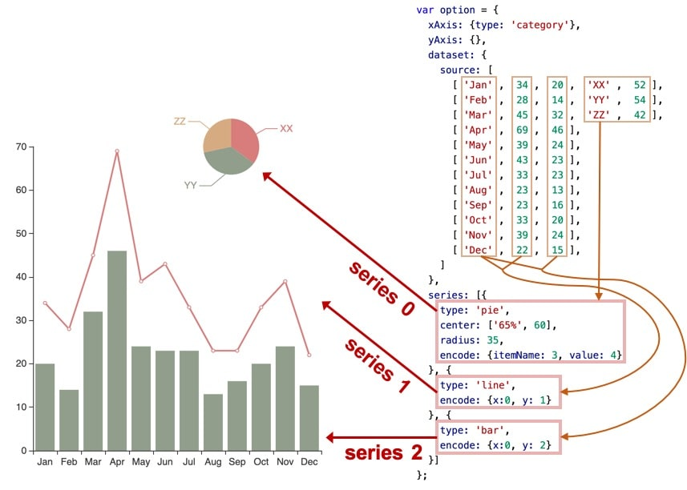
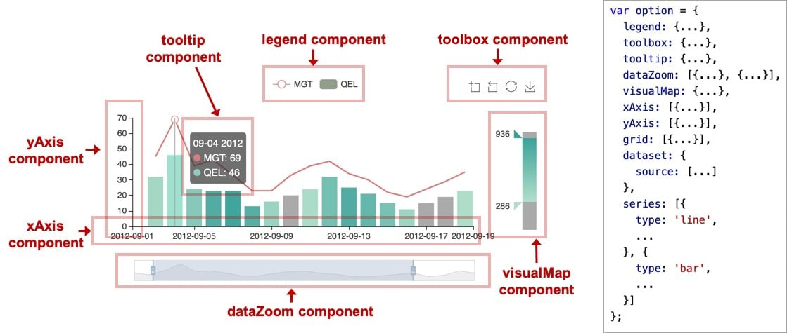
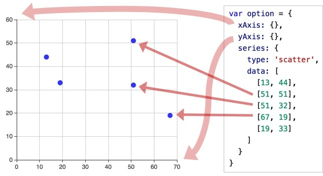

## ECharts的基本使用

1. 引入 ECharts

> 这里使用 CDN 引入，另外也可以在在打包环境中[按需引入](https://echarts.apache.org/zh/tutorial.html#在打包环境中使用 ECharts) ECharts。

```react
<head>
  <script src="https://cdn.jsdelivr.net/npm/echarts@5.1.2/dist/echarts.min.js"></script>
</head>
```

2. 准备 DOM 容器

```react
<body>
  <!-- 为 ECharts 准备一个具备大小（宽高）的 DOM -->
  <div id="main" style="width: 600px;height:400px;"></div>
</body>
```

3. 初始化实例并添加配置

```react
<script>

  // 基于准备好的dom，初始化echarts实例
  const myChart = echarts.init(document.getElementById('main'));

  // 指定图表的配置项和数据
  const option = {
    ...
  };

  // 将配置项和数据添加到图表实例
  myChart.setOption(option);

</script>
```

------

## ECharts基础概念概览

### echarts实例

> 每个 echarts 实例独占一个 DOM 节点。

------

### 系列（series）

> 不仅表示数据，也表示数据映射成为的图。也可以将系列理解为特殊的、专门绘制 “图” 的组件。

| 键   | 值栗           | 说明       |
| ---- | -------------- | ---------- |
| type | line、bar、pie | 折、柱、饼 |
| data | 数组形式       | /          |
| ...  | /              | 绘图参数   |


类同地，下图中是另一种配置方式，系列的数据从 dataset 中取：



------

### 组件（component）

> echarts 中各种内容，被抽象为 “组件”，例如 xAxis（直角坐标系 X 轴）、yAxis（直角坐标系 Y 轴）、grid（直角坐标系底板）。

如下图，右侧的 option 中声明了各个组件（包括系列），各个组件就出现在图中。

 

------

### 用 option 描述图表

> 每个组件实例都由一个对象组成，有多个同类组件时，用数组包围。

```react
const option = {
    // option 每个属性是一类组件。
    legend: {...},
    grid: {...},
    xAxis: [
        // 数组每项表示一个组件实例，用 type 描述“子类型”。
        {type: 'category', ...}
        {type: 'value', ...}
    ],
    yAxis: [{...}, {...}],
    series: [{...}, {...}]
};
```

系列组件实例里的 data 是系列自身的数据。另外，系列数据也可以从 dataset 中取：

```react
var option = {
    dataset: {
        source: [
            [121, 'XX', 442, 43.11],
            [663, 'ZZ', 311, 91.14],
            [913, 'ZZ', 312, 92.12],
            ...
        ]
    },
    xAxis: {},
    yAxis: {},
    series: [
        // 数据从 dataset 中取，encode 中的数值是 dataset.source 的维度 index （即第几列）
        {type: 'bar', encode: {x: 1, y: 0}},
        {type: 'bar', encode: {x: 1, y: 2}},
        {type: 'scatter', encode: {x: 1, y: 3}},    // 用第 1 列作 x 轴，第 3 列作 y 轴
        ...
    ]
};
```

------

### 组件的定位

> 不同的组件、系列，常有不同的定位方式。

**[类 CSS 的绝对定位]**

> 可以使用类似于绝对定位的方式进行操作，基于的是 echarts 容器 DOM 节点。
>
> 值为（单位为像素的）数值，也可以是基于 echarts 容器高宽的百分比，后者需用引号包围。

| 键   | 值栗              | 说明         |
| ---- | ----------------- | ------------ |
| 横向 | left right width  | 至多设置两项 |
| 纵向 | top bottom height | 至多设置两项 |

:palm_tree: 少数圆形的组件或系列，可以使用 “中心半径定位” ，例如饼图。

------

### 坐标系

> 很多系列需要运行在 “坐标系” 上。坐标系用于布局这些图，以及显示数据的刻度等等。

直角坐标系中，包括有 xAxis（直角坐标系 X 轴）、yAxis（直角坐标系 Y 轴）、grid（直角坐标系底板）三种组件。

下图是最简单的使用直角坐标系的方式，echarts 暗自为他们创建了 grid 并关联起这些组件。

  

下图中，`xAxis` 被两个 `yAxis` 和 `series` 共享。在系列中使用 `yAxisIndex` 来指定使用的 `yAxis`。

 

一个 echarts 实例中，可以有多个 `grid`，每个 `grid` 有自己的 X 轴和 Y 轴，在这些轴实例中使用 `gridIndex` 指定自身所在的 `grid`。

 

------

#### 深色模式

> 在初始化echarts实例时，可以添加第二个参数 `'dark'` 用于开启深色模式。

```react
const myChart = echarts.init(document.getElementById('main'), 'dark');
```
