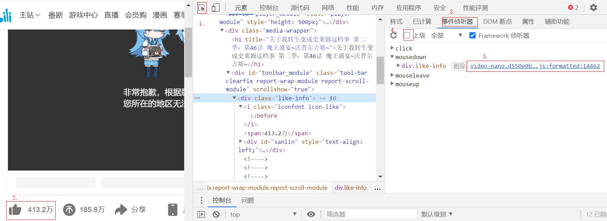

### 普通调试  

#### 元素具体样式

| 顺序 | 说明                              | --   |
| ---- | --------------------------------- | ---- |
| ①    | 在对应元素处，鼠标右键 - 审查元素 |      |
| ②    | 越靠上的样式优先级越高            |      |
| ③    | 可以临时修改样式                  |      |
| ④    | 底部可以查看伪元素样式            |      |
| ④    | 可以切换元素伪类，或新增类        |      |


#### 打印值  

1. 可以测试函数是否执行。  

2. 可以查看变量某时刻的值。  

> 可以打开控制台侧栏进行筛选。  

打印类型 | 指令
:-: | :-:
日志 | console.log();
信息 | console.info();
错误 | console.error();
警告 | console.warn();


#### 代码断点调试  

  

> 默认在每个debugger处暂停，可以查看此时变量的值。  
```
<script>    

let a = 1;
debugger
a += 1;
console.log(a);
debugger;
a = 5;
console.log(a);
</script> 
```

> 启用异常时暂停，将突出首次出错的代码段。  
```
<script>    

let a = 1;
let a = 6;
a += 1;
console.log(a);
a = c;
a = 5;
console.log(a);
</script>  
```


#### 手动断点调试  
> 用于追踪变量运行到某个时刻的值，鼠标移上去、打印都可以，在 `Call Stack` 中可以查看函数调用信息。  
> 
> 可以通过刷新页面，或某些回调方式触发函数的执行。    

索引 | 操作 | 说明
:-: | :- | :- 
① | 打开文件 | 点击源代码，找到对应的文件
② | 普通使用 | 在对应代码左侧数字列点一下（该列及之后代码不会执行）
③ | 普通使用 | 点击刷新。如果没错，可以点击恢复脚本执行到第二个断点  
④ | 普通使用 | 也可以点击下一个，看邻近代码的执行情况
④ | 查看最终结果 | 可以点击停用断点后刷新
④ | 特殊使用 | 可以不设置断点，激活出现异常时暂停  


#### 快速找到元素绑定的事件函数
> 案例_b站未登录点赞（假的）。

顺序 | 说明
:-: | :- 
① | 检查一个元素，选中元素
② | 点击事件侦听器，取消显示上级侦听
③ | 点击对应事件，点击后面链接  
④ | 如有需要，格式化文档
⑤ | 建立断点，长按点赞
⑥ | 执行下一步函数调用，找到关键变量  
⑦ | 在下方控制台修改，恢复脚本执行 

  

  

  

  

  


#### vscode_在Vue中使用断点调试   
> 需要获取源代码，即不经过webpack处理的代码。  

顺序 | 说明
:-: | :- 
① | 更改项目 `vue.config.js` 的配置  
② | 在调试栏添加配置
③ | 启动项目，点击绿色图标  
④ | 受限于未知原因，要在浏览器中添加断点

项目下新建 `vue.config.js`
```
module.exports = {
    configureWebpack: {
      devtool: 'source-map'
    }
  }
```

运行和调试 - 创建launch.json 文件 - Chrome - 将 `configurations` 字段内的内容替换为  

> 这里将[官网配置](https://cn.vuejs.org/v2/cookbook/debugging-in-vscode.html)的第一项改了，就不需要额外安装插件。  
```
{
  "type": "pwa-chrome",
  "request": "launch",
  "name": "vuejs: chrome",
  "url": "http://localhost:8080",
  "webRoot": "${workspaceFolder}/src",
  "breakOnLoad": true,
  "sourceMapPathOverrides": {
    "webpack:///src/*": "${webRoot}/*"
  }
}
```

运行项目 - 点击调试面板左上角的绿色按钮 - 它会进入到全新的 chrome 浏览器

找到浏览器 `webpack://` 下找到对应的文件，添加断点，开始调试。  


#### vscode_在普通网页中使用断点调试   
> 正常地添加配置，开启调试即可。  

----

### 其它模块


#### 网络  
> 可以查看网络请求的一些文件，可以筛选类型、查看文件大小，点进文件看具体的响应等。  
>  
> 304 表示从缓存中获取


----

#### Vue_Devtools
> 配合VueX使用，可以很方便地追踪状态信息，甚至回溯。  
>
> 不能直接支持 Vue3，貌似有个别名的新版本与其对接。  


