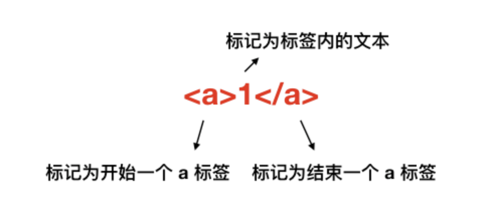

#### typeof类型判断
> `typeof` 对于原始类型来说，除了 null 都可以显示正确的类型。  
> 
> 可以考虑使用 `instanceof` [判断](https://github.com/SpringLoach/origin-2021/blob/happy-day/JavaScript/常用方法速查.md#类型判断)对象的类型，其机制是通过原型链来判断的。原始类型则不可。  

```react
let x = new Array('abc');  
let y = ['abc'];

document.write(typeof x);            // object
document.write(typeof y);            // object
document.write(x instanceof Array);  // true
document.write(y instanceof Array);  // true
document.write(x.constructor);       // f Arr() {}
document.write(y.constructor);       // f Arr() {}
```

```react
let x = new String('abc');
let y = 'abc';

document.write(typeof x);             // object
document.write(typeof y);             // string
document.write(x instanceof String);  // true
document.write(y instanceof String);  // false
document.write(x.constructor);        // f Str() {}
document.write(y.constructor);        // f Str() {}
```

----

#### this
> 使用 `this` 指定对象后，没有该变量就是 `undefined`， 不会向上查找。

位置 | 指向
:-: | :-:
直接调用 foo | 不管 foo 函数在哪，`this` 一定是 window
obj.foo() | 谁调用了函数，谁就是 `this`
构造器函数 | 指向新对象

```react
function foo() {
  console.log(this.a)
}
var a = 1
foo()               // 1

function bar() {
  let a = 233
  foo()
}
bar()               // 1

const obj = {
  a: 2,
  foo: foo
}
obj.foo()           // 2

const c = new foo()     // undefined
```

箭头函数
> 箭头函数中的 this 只取决包裹箭头函数的**第一个**普通函数**的 this**。

```react
function a() {
  return () => {
    return () => {
      console.log(this)
    }
  }
}
a()()()    // Window
```

改变上下文  
> 对于这种改变上下文的方法，嵌套时，`this` 永远由第一次 bind 决定。
```react
let a = {}
function fn () { console.log(this) }

fn.bind()(a)    // Window
fn.bind(a)()    // {}
```


----

#### ==  

  

----

#### 解决var循环  
> 由于在异步前，全局 i 的值已经计算为 6，输出将全为 6。  
> 
> 可以将每轮循环的 i 值作为函数参数传入，也可以使用 `let` 运行在括号作用域。  

```react
for (var i = 1; i <= 5; i++) {
  setTimeout(function timer() {
    console.log(i)
  }, i * 1000)
}
```

----

#### 深浅拷贝   
> 浅拷贝：如果对象中的值为对象，则拷贝的是地址。即可以对原对象产生影响。  

浅拷贝  
```react
let a = { text: 123 }

// 方式一  
let b = Object.assign({}, a)

// 方式二  
let b = { ...a }
```

深拷贝  
```
// 将对象转换为 JSON 后，再转换为对象
let b = JSON.parse(JSON.stringify(a))
```

该方法的局限性 | 结果  
:- | :-:
会忽略 undefined | 忽略
会忽略 symbol | 忽略
不能序列化函数 | 忽略
不能解决循环引用的对象 | 报错

----

#### 原型  
> 对象的 `__proto__ ` 属性指向原型， `__proto__` 将对象和原型连接起来组成了原型链。  

属性 | 所属 
:- | :-:
\_\_proto\_\_ | 对象
prototype  | [函数](https://github.com/SpringLoach/origin-2021/blob/happy-day/JavaScript/第十章-函数.md#函数属性与方法)

#### var、let及const的区别

索引 | 说明  
:- | :-
① | var 存在提升，能在声明之前使用
② | let 和 const 在代码执行前会被 JS引擎解析，即**意味到该作用域有对应变量**，但无法使用
③ | 在全局作用域下使用 var 声明，变量会挂载在 window 上，其他两者不会
④ | let 和 const 作用基本一致，但是后者声明的变量不能再次赋值（包括引用值，即地址）  

#### 原型继承和Class继承  
> 其实在 JS 中并不存在类，class 只是语法糖，本质还是函数。  

组合继承  

项 | 方式  
:- | :-
继承属性 | `Parent.call(this, value1, ..)`
继承方法 | 父类实例作为原型
优势 | 可传参，引用属性不共享
缺点 | 调用了父类这个构造函数，子类原型上有多余属性，浪费内存
特征 | 父类为构造函数  

寄生组合继承

项 | 方式  
:- | :-
继承属性 | `Parent.call(this)`
继承方法 | 将父类的原型作为原型
优势 | 可传参，引用属性不共享
缺点 | /
特征 | 需将子类原型上的构造函数指向子类自身 

Class继承  
> class 实现继承的核心在于使用 `extends` 表明继承自哪个父类，并且在子类构造函数中必须调用 `super`，可以看成 `Parent.call(this, value)`。

#### 模块化  
> 早期使用立即执行函数实现模块化（解决命名冲突、污染全局变量的问题）。  
> 
> AMD 和 CMD 目前已很少使用。

优势  
- 解决命名冲突    
- 提供代码复用性  
- 提高代码可维护性  

CommonJS
> 最早是 Node 在使用，在 Webpack 中就能见到它。  

ES Module
> 与 CommonJS 不同，ES Module 导入的是拷贝值，不会因为导出值的改变而更新。  
> 
> 不支持动态导入。  

#### 简洁promise  

简化思路  

索引 | 步骤 | 小步骤
:- | :- | :-
① | 全局作用域 | 声明常量表示状态
② | MyPromise函数 | 保留作用域
③ | MyPromise函数 | 创建变量保存初始状态
④ | MyPromise函数 | 创建变量保存调用落定方法传入的参数
⑤ | MyPromise函数 | 创建变量（数组）保存 `then` 的回调
⑥ | MyPromise函数 | 创建落定方法，用于状态改变时执行相应所有回调
⑦ | MyPromise函数 | 将落定方法作为回调参数传出  
⑧ | then函数 | 保留作用域 
⑨ | then函数 | 判断参数类型，是否传入 
⑩ | then函数 | 等待状态时，往 `then` 的回调中推入函数
... | then函数 | 非等待状态时，执行函数  


#### 执行栈  
> 可以把执行栈认为是一个存储函数调用的栈结构，遵循先进后出的原则。  

#### call和apply   

实现myCall  

索引 | 步骤 | 小步骤
:- | :- | :-
① | 基本思路 | 函数原型上添加
② | 处理形参 | 只写一个形参（即首参），用于充当上下文
③ | 判断 | 判断 `this`，即调用者是否为为函数，不为则报错  
④ | 决定上下文 | 将形参（如存在）赋值为自身，否则 `window` 
⑤ | 添加方法 | 在形参上添加 `fn` 属性，赋值为 `this`，即调用者  
⑥ | 处理参数 | **处理参数**对象，将剩余参数作为参数并在上下文调用函数 
⑦ | 清除方法 | 移除形参上的该属性，返回结果  

实现myApply  
> 与 `call` 相比区别在于对参数的处理。  

实现myBind  
> `bind` 是函数上的方法，它会将调用者绑定到首参（作为上下文）上，并返回该方法。  
> 
> 可以使用 `new` 调用返回的方法。  
> 
> 该方法允许 `f.bind(obj, 1)(2)` 这种调用方式。

索引 | 步骤 | 小步骤
:- | :- | :-
① | 基本思路 | 函数原型上添加
② | 判断 | 判断 `this`，即调用者是否为为函数，不为则报错 
③ | 提供闭包变量 | 使用变量保存调用者和剩余参数  
④ | 返回函数 | 若为 `new` 调用，不需指定上下文
⑤ | 返回函数 | 否则，需要使用 `apply` 方法进行调用
⑤ | 返回函数 | 并指定上下文，结合之前的剩余参数和当前的参数列表

#### new  

在调用 new 的过程中会发生四件事情

- 新生成一个对象  
- 链接到原型  
- 绑定 `this`  
- 返回新对象  

自己实现new  
> 实现的 `create` 方法将接收首参作为构造函数，剩余参数用作传入构造函数的参数。

索引 | 步骤 | 小步骤
:- | :- | :-
① | 创建空对象 | 保存为变量
② | 获取构造函数 | 提取首参并保存为变量
③ | 指定原型 | 将空对象的原型赋值为构造函数的 `prototype` 属性 
④ | 获取调用结果 | 以剩余参数作参，执行构造函数并保存为变量
⑤ | 判断结果类型 | 为对象将结果返回
⑤ | 判断结果类型 | 否则将**空对象**返回  

通过 new 和通过**字面量**创建对象的区别。  

项 | 可读性 | 性能
:- | :- | :-
new | / | 需要通过作用域链一层层找到 Object
字面量 | 更好 | 不需要，更好

#### instanceof的原理  
> 可以正确的判断对象的类型，因为内部机制是通过判断对象的原型链中是不是能找到类型的 `prototype`。  

实现  

索引 | 步骤 | 说明
:- | :- | :-
① | 获取类型的原型 | 函数的 `prototype` 属性
② | 获得对象的原型 | 对象的 `__proto__` 属性  
③ | 循环判断两者相等性 | 直到对象原型为 `null`，返回 `false`  
④ | 循环判断两者相等性 | 相等则返回 `true`  
⑤ | 循环判断两者相等性 | 否则用对象原型的原型继续判断

#### 为什么0.1+0.2!=0.3  
> JS 采用双精度版本（64位），0.1 在二进制中表现为限循环的一些数字，采用的浮点数标准会裁剪掉部分数字丢失精度。  

为何输出0.1时能准确输出  
> 在输入内容的时候，二进制被转换为了十进制，十进制又被转换为了字符串，在这个转换的过程中发生了取近似值的过程。  

解决方法  
```
parseFloat((0.1 + 0.2).toFixed(10)) === 0.3 
```

#### 事件机制  

事件触发阶段  

顺序 | 步骤 | 触发事件
:- | :- | :-
① | window 往事件触发处传播 | 遇到的捕获事件
② | 事件触发处 | 不区分捕获、冒泡，按注册顺序执行程序
③ | 从事件触发处往 window 传播 | 遇到的冒泡事件

注册事件  
> 通常使用 `addEventListener` 注册事件，可以控制冒泡或捕获、仅调用一次等。  

事件对象方法 | 说明 
:- | :- 
stopPropagation | 阻止事件传播（冒泡或捕获）
stopImmediatePropagation | 阻止事件冒泡或捕获，并阻止该事件目标执行别的注册事件

事件代理  
> 如果一个节点中的子节点是动态生成的，那么子节点需要注册事件的话应该注册在父节点上。  

- 节省内存  
- 不需要给子节点注销事件

#### 跨域  

什么是跨域？为什么浏览器要使用同源策略？  

- 浏览器出于安全考虑，有同源策略。也就是说，如果**协议、域名或者端口**有一个不同就是跨域，Ajax 请求（属于同源策略）会失败。

- 使用这种机制，主要是用来防止 CSRF 攻击的，即利用用户的登录态发起的恶意请求。  
> 用户登录了网站A，未退出，并在同一个浏览器打开了网站B。  
> 
> 网站B接收到用户请求后，返回一些攻击性代码，并发出一个请求要求访问第三方站点A。  
> 
> 浏览器在接收到这些攻击性代码后，根据网站 B 的请求，在用户不知情的情况下携带 Cookie 信息，以相应权限向网站 A 发出请求。

为何表单可以跨域？  

- 跨域请求会被发送，但通常会被浏览器拦截。表单并不会获取新的内容，所以可以发起跨域请求。

**解决跨域方案**  

JSON
> 利用 `<script>` 标签没有跨域限制的漏洞。通过 `<script>` 指向需要访问的地址并提供回调函数来[接收数据](https://github.com/SpringLoach/origin-2021/blob/happy-day/JavaScript/滚动集结.md#jsonp跨域)。  

/ | 说明 
:- | :- 
优点 | 简单且兼容性不错
缺点 | 只限于 `get` 请求
特性 | 需要服务器支持

CORS  
> 服务器段可以设置哪些域名可以访问资源。  
> 
> 对于一些复杂请求，由于会发送预检请求（确定服务端是否允许跨域请求），且它没有需要验证的 `Authorization` 字段，会报错。  

document.domain  
> 用于实现只要主域名相同就可以实现跨域。  

postMessage  
> 用于获取嵌入页面中的第三方页面数据。  

#### 存储  

特性 | cookie | localStorage | sessionStorage | indexDB
:- | :- | :- | :- | :- 
数据生命周期 | 一般由服务器生成，可设置过期时间 | 不清则在 | 页面关闭就清理 | 不清则在
数据存储大小 | 4K | 5M | 5M | 无限
与服务端通信 | 携带在头部中，影响请求性能 | 不参与 | 不参与 | 不参与

cookie  
> 已经不建议用于存储。使用时，还需要注意安全性。  

属性 | 作用
:- | :-
value | 如果用于保存用户登录态，应该将该值加密，不能使用明文的用户标识
http-only | 不能通过 JS 访问 Cookie，减少 XSS 攻击
secure | 只能在协议为 HTTPS 的请求中携带
same-site | 规定浏览器不能在跨域请求中携带 Cookie，减少 CSRF 攻击

Service Worker  
> 运行在浏览器背后的独立线程，一般可以用来实现缓存功能。    
> 
> 因为涉及到请求拦截，所以必须使用 `HTTPS` 协议来保障安全。  

#### 浏览器缓存机制  
> 缓存可以说是性能优化中简单高效的一种优化方式了，它可以显著减少网络传输所带来的损耗。  

浏览器缓存  
> 对于一个数据请求来说，可以分为发起网络请求、后端处理、浏览器响应三个步骤。  

优化 | 方式
:- | :-
步骤一 | 直接使用缓存而不发起请求
步骤三 | 发起了请求，但后端存储的数据和前端一致，无需传回，可减少响应数据

**缓存位置**  
> 分为四种，并且各自有优先级，当依次查找缓存且都没有命中的时候，才会去请求网络。  
> 
> 从其它地方或网络请求中获取的数据，浏览器都会显示是从 `Service Worker` 中获取的内容。  

顺序 | 步骤 | 缓存时间 | 说明
:- | :- | :- | :-
① | Service Worker | 持续性 | 可以控制缓存哪些文件、如何匹配缓存、如何读取缓存
② | Memory Cache | 短，随进程释放而释放 | 内存缓存。读取高效、容量小、刷新页面时很多数据缓存在这
③ | Disk Cache | 持续性 | 硬盘缓存。读取速度慢、容量大、覆盖面大、根据请求头判断缓存，直接使用或需重新请求的资源
④ | Push Cache | 短，随会话结束而释放| `HTTP/2` 中的内容，多个页面可以使用相同的缓存
⑤ | 网络请求 | / | 如果所有缓存都没有命中，就发起请求来获取资源

**缓存策略**  
> 通常浏览器缓存策略分为两种：强缓存和协商缓存，都是通过头部设置实现的。  

强缓存  
> 可以通过设置两种头部实现：Expires 和 Cache-Control。
> 
> 强缓存表示在缓存期间**不需要请求**，状态码为 200。

- Expires
  + 栗子：`Expires: Wed, 22 Oct 2018 08:41:00 GMT`  
  + 是 HTTP/1 的产物，表示资源会在设置时间后过期，需要再次请求。  
  + 受限于本地时间，若修改本地时间可能会造成缓存失效。  

- Cache-control  
  + 栗子：`Cache-control: max-age=30`  
  + 是 HTTP/1.1 的产物，优先级高于 Expires。  
  + 可以在请求头或者响应头中设置，并且可以组合使用多种指令。  
  + 如允许代理和客户端缓存、设置缓存失效时间。  

协商缓存  
> 如果缓存过期了，就**需要发起请求**验证资源是否有更新。协商缓存可以通过设置两种头部实现：Last-Modified 和 ETag
> 
> 当浏览器发起请求验证资源时，如果资源没有做改变，那么服务端就会返回 304 状态码，并且更新浏览器缓存有效期。  

- Last-Modified 和 If-Modified-Since  
  + Last-Modified 表示本地文件最后修改日期，If-Modified-Since 会将 Last-Modified 的值发送给服务器。  
  + 询问服务器在该日期后资源是否有更新，有更新的话就会将新的资源发送回来，否则返回 304 状态码。  
  + 弊端
    - 如果本地打开缓存文件，即使没有对文件进行修改，但还是会造成 Last-Modified 被修改，导致返回相同资源。  
    - 因为 Last-Modified 只能以秒计时，如果在不可感知的时间内修改完成文件，那么服务端会认为资源还是命中了，不返回正确资源。  

- ETag 和 If-None-Match  
  + ETag 类似于文件指纹，If-None-Match 会将当前 ETag 发送给服务器，若有变动的话就将新的资源发送回来。
  + 并且 ETag 优先级比 Last-Modified 高。

:snowflake: 若没有设置缓存策略，浏览器会采用一个启发式的算法，通常会取响应头中的 Date 减去 Last-Modified 值的 10% 作为缓存时间。  

**实际场景应用缓存策略**  

频繁变动的资源  
> 对于频繁变动的资源，首先需要使用 Cache-Control: no-cache 使浏览器每次都请求服务器，然后配合 ETag 或者 Last-Modified 来验证资源是否有效。这样的做法虽然不能节省请求数量，但是能显著减少响应数据大小。  

代码文件  
> 这里特指除了 HTML 外的代码文件，因为 HTML 文件一般不缓存或者缓存时间很短。  

  一般来说，现在都会使用工具来打包代码，可以对文件名进行哈希处理，只有当代码修改后才会生成新的文件名。基于此，可以给代码文件设置缓存有效期一年 Cache-Control: max-age=31536000，这样只有当 HTML 文件中引入的文件名发生了改变才会去下载最新的代码文件，否则就一直使用缓存。  

### 浏览器渲染原理  

#### 渲染过程  

1. 浏览器接收到 HTML 文件并转换为 DOM 树  
> 当打开一个网页时，浏览器都会去请求对应的 HTML 文件。虽然平时我们写代码时都会分为 JS、CSS、HTML 文件，也就是字符串，但是计算机硬件是不理解这些字符串的。


顺序 | 步骤 | 说明
:- | :- | :-
① | 浏览器接收到字节数据后，将它转换为字符串 | 网络中传输的就是 `0`、`1` 这些字节数据
② | 字符串通过词法分析转换为标记 | 标记还是字符串，是构成代码的最小单位
③ | 标记会紧接着转换为 Node | / 
④ | 根据不同 Node 之间的联系构建为一颗 DOM 树 | / 




2. 将 CSS 文件转换为 CSSOM 树  
> 转换 CSS 到 CSSOM 树的过程和上一小节的过程是极其类似的。 


在这一过程中，浏览器会确定下每一个节点的样式到底是什么，这是很消耗资源的。因为样式可以自行设置给某个节点，也可以通过**继承**获得。浏览器得递归 CSSOM 树，然后确定具体的元素到底是什么样式。  

- 少写过于具体的 CSS 选择器   
- 对于 HTML，少添加无意义标签，保证层级扁平  

3. 生成渲染树  
> 生成 DOM 树和 CSSOM 树以后，就需要将这两棵树组合为渲染树。  
> 
> 渲染树只会包括**需要显示**的节点和这些节点的样式信息。  
> 
> 当浏览器生成渲染树以后，就会根据渲染树来进行布局（回流），然后调用 GPU 绘制，合成图层，显示在屏幕上。

#### 为什么操作DOM慢   
> DOM 属于渲染引擎，JS 属于 JS 引擎。当通过 JS 操作 DOM 的时候，其实这个操作涉及到了两个线程之间的通信，那么势必会带来一些性能上的损耗。  
> 
> 并且操作 DOM 可能还会带来重绘回流。  

如何插入数量级的DOM，实现页面不卡顿  
> 通过虚拟滚动（virtualized scroller）实现，原理就是只渲染可视区域内的内容，非可见区域的那就完全不渲染了，当用户在滚动的时候就实时去替换渲染的内容。  

#### 什么情况阻塞渲染

1. 首先渲染的前提是生成渲染树，所以 HTML 和 CSS 肯定会阻塞渲染。想渲染的快，应该降低一开始需要渲染的文件大小，并且扁平层级，优化选择器。  
2. 浏览器在解析到 script 标签时，会暂停构建 DOM，完成后才会从暂停的地方重新开始。  

处理脚本  
 - 将 script 标签放在 body 标签底部。    
 - 给标签加上 `defer` 属性，表示该 JS 文件会并行下载，但是会放到 HTML 解析完成后顺序执行。标签位置可任意。    
 - 对于没有任何依赖的 JS 文件可以加上 `async` 属性，表示 JS 文件下载和解析不会阻塞渲染。  

#### 重绘和回流  
> 重绘（Repaint）和回流（Reflow）会在设置节点样式时频繁出现，会**影响性能**。

索引 | 说明
:- | :- 
① | 重绘：当节点需要更改外观而不会影响布局的，比如改变颜色
② | 回流：布局或者几何属性需要改变
③ | **回流必定会发生重绘，重绘不一定会引发回流**
④ | 回流所需的成本比重绘高的多
⑤ | 改变父节点里的子节点很可能会导致父节点的一系列回流

**以下几个动作可能会导致性能问题：**

- 调整窗口大小
- 改变字体
- 添加或删除样式
- 文字改变
- 定位或者浮动
- 盒模型

:snowflake: 每次事件循环的微任务执行完毕后，会判断 document 是否需要更新，因为浏览器是 60Hz 的刷新率，每 16.6ms 才会更新一次。

#### 减少重绘和回流  

索引 | 操作 | 说明
:- | :- | :-  
① | 使用 `transform` 替代 `top` | 避免操作定位的位置属性
② | 使用 `visibility` 替换 `display: none` | 前者只引起重绘，后者引发回流
③ | 减少获取 `offsetTop` 属性 | 会导致回流
④ | 不使用 `table` 布局 | 小改动可能会造成 table 的重新布局
⑤ | 控制动画速度 | 速度越快，回流次数越多。可考虑 `requestAnimationFrame`
⑥ | 避免节点层级过多 | CSS 选择符从右往左匹配查找  
⑥ | 将频繁重绘/回流的节点设为图层 | 图层能够阻止该节点的渲染行为影响别的节点  

### 安全防范  

#### XSS  
> 简单点来说，就是攻击者想尽一切办法将可以执行的代码注入到网页中。  
> 
> 总体上分为两类：持久型和非持久型。  

- 持久型  
> 指攻击的代码（如用户评论）被服务端**写入数据库**中，这种攻击危害性很大，因为如果网站访问量很大的话，就会导致大量正常访问页面的用户都受到攻击。

- 非持久型  
> 一般通过修改 URL 参数的方式加入攻击代码，诱导用户访问链接从而进行攻击。  
> 
> 比如页面需要从 URL 中获取某些参数作为内容，而这些参数又被篡改。  
> 
> 对于这种攻击方式来说，如果用户使用 Chrome 这类浏览器的话，浏览器就能自动帮助用户防御攻击。但不能保证所有用户都使用这种浏览器。  

**防御方法 ** 

1. 转义字符  
> 用户的输入应该是永远不信任的。需要转义输入输出的内容，即对于引号、尖括号、斜杠进行转义。  
>
> 对于富文本来说，上面的方法不合适。这时可以考虑建立白名单来过滤标签等。  

2. CSP  
> 本质上就是建立白名单，开发者明确告诉浏览器**哪些外部资源**可以加载和执行。我们只需要配置规则，如何拦截是由浏览器自己实现的。

通常可以通过两种方式来开启 CSP：

- 设置 HTTP Header 中的 `Content-Security-Policy`  
- 设置 meta 标签的方式 `<meta http-equiv="Content-Security-Policy">`

#### CFRF  
> 跨站请求伪造。原理就是攻击者（非登录页）构造出一个后端请求地址，诱导用户点击或者通过某些途径自动发起请求。如果用户是在登录状态下的话，后端就以为是用户在操作，从而进行相应的逻辑。  

**如何防御**

- Get 请求不对数据进行修改
- 不让第三方网站访问到用户 Cookie
- 阻止第三方网站请求接口
- 请求时附带验证信息，比如验证码或者 Toke

操作 | 说明
:- | :-  
SameSite | 对 Cookie 设置 `SameSite` 属性，表示 Cookie 不随着跨域请求发送，可减少许多 CSRF 的攻击。部分浏览器不兼容   
验证 Referer | 对于需要防范 CSRF 的请求，可以验证 `Referer` 来判断该请求是否为第三方网站发起的  
Token | 服务器下发一个随机 Token，每次发起请求时将 Token 携带上，服务器验证 Token 是否有效  

#### 点击劫持  
> 是一种**视觉欺骗**的攻击手段。攻击者**将需要攻击的网站**通过 `iframe` 嵌套的方式**嵌入**自己的网页中，并将 `iframe` 设置为透明，在页面中透出一个按钮诱导用户点击。  

**如何防御**

1. X-FRAME-OPTIONS  
> 这是一个相应头，可以设置页面不允许、仅相同域名下允许、或仅指定来源允许通过 `iframe` 的方式展现。  

2. JS防御  
> 对于某些远古浏览器来说，并不能支持上面的这种方式。  
> 
> 可以用 `self == top` 判断是否通过 iframe 的方式加载页面，如果是就将页面设为不展示并替换为主页面。  

### 从V8中看JS性能优化  

#### 测试性能工具  
> `Chrome` 提供了两个性能测试工具，可以在 `F12` 后通过展开找到。  

操作 | 说明
:- | :-  
Audits | 改为 Lighthouse。可以对性能、体验、SEO 打分，有详细评估和优化建议
Performance | 可以详细的看到每个时间段中浏览器在处理什么，哪个过程最消耗时间，便于了解性能瓶颈  

#### JS性能优化  
> JS 是编译型还是解释型语言其实并不固定。首先 JS 需要有引擎才能运行起来，无论是浏览器还是在 Node 中，这是解释型语言的特性。
> 
> 但是在 V8 引擎下，又引入了 TurboFan 编译器，他会在特定的情况下进行优化，将代码编译成执行效率更高的 Machine Code。  

顺序 | 说明 
:- | :- 
① | 在这一过程中，JS 代码首先会解析为抽象语法树（AST） 
② | 然后会通过解释器或者编译器转化为 Bytecode 或者 Machine Code
③ | Machine Code 的效率更高，计算固定类型（如Number）时编译
④ | 若传入的参数类型改变，那么 Machine Code 就会被 DeOptimized 为 Bytecode

索引 | 优化思路   
:- | :- 
① | 解析为 AST 时，代码越多，解析的过程也就耗费越长 
② | 尽可能避免声明嵌套函数，会造成函数的重复解析
③ | 计算时，尽量使用固定类型，即同一类型  
④ | 编译器还有个预解析的操作，对立即被调用的函数时多余的
⑤ | 可以将函数声明套上 `()` 解决  

### 性能优化  

#### 图片优化  
> 对于一张 100 * 100 像素的图片来说，图像上有 10000 个像素点，如果每个像素的值是 RGBA 存储的话，那么也就是说每个像素有 4 个通道，每个通道 1 个字节，所以该图片大小大概为 39KB（10000 * 1 * 4 / 1024）。
> 
> 但是在实际项目中，一张图片可能并不需要使用那么多颜色去显示，可以通过减少每个像素的调色板来相应缩小图片的大小。  

索引 | 优化思路   
:- | :- 
① | 减少像素点
② | 减少每个像素点能够显示的颜色

#### 图片加载优化  

索引 | 优化思路 | 说明   
:- | :- | :- 
① | 使用 `CSS` 替代修饰类图片 | /
② | 对于移动端，屏幕小。通过 CDN 加载 | 可以计算出适配宽度，请求相应裁剪好的图片
③ | 小图使用 base64 格式 | 体积更大，但减少请求
④ | 图像精灵 | 又称雪碧图
⑤ | 选择正确的图片格式 | 见下  

类型 | 说明 
:- | :- 
WebP | 有更小的图片体积、肉眼识别无差异的图像质量，但兼容性并不好
PNG | 小图
SVG | 图标
JPEG | 照片

#### DNS预解析  
> 可以通过预解析的方式来预先获得域名所对应的 IP。  
> 
> 即浏览网页时，浏览器会在加载网页时对网页中的域名进行解析缓存，这样在单击当前网页中的链接时就无需进行 DNS 的解析，减少用户等待时间，提高用户体验。  

```
<link rel="dns-prefetch" href="//blog.poetries.top">
```

#### [节流](https://github.com/SpringLoach/origin-2021/blob/happy-day/JavaScript/实验项.md#节流函数)  
> 对于频繁触发的事件，希望减少程序的执行频率。  

#### 防抖  
> 对于有可能连续触发的事件，希望间隔时间内无连续发生才执行程序。  

#### 预加载  
> 在开发中，可能会遇到这样的情况。有些资源不需要马上用到，但是希望尽早获取，这时候就可以使用预加载。
> 
> 表示强制浏览器请求资源，并且不会阻塞 onload 事件。
> 
> 预加载可以一定程度上降低首屏的加载时间，因为可以将一些不影响首屏但重要的文件**延后加载**，唯一缺点就是兼容性不好。

```
<link rel="preload" href="http://blog.poetries.top">
```

#### 预渲染  
> 可以通过预渲染将下载的文件预先在后台渲染，提高页面的加载速度。    
> 
> 要确保该页面大概率会被用户在之后打开，否则就是白白浪费资源去渲染。  

```
<link rel="prerender" href="http://blog.poetries.top">
```

#### 懒执行
> 将某些逻辑延迟到使用时再计算。可用于首屏优化，对于某些耗时逻辑并不需要在首屏就使用的，就可以使用懒执行。懒执行需要唤醒，一般可以通过定时器或者事件的调用来唤醒。

#### 懒加载  
> 将不关键的资源延后加载。  
> 
> 如使用图片占位符、进入可视区域才开始播放视频等。

#### CDN  
> CDN的原理是尽可能的在各个地方分布机房缓存数据，这样即使我们的根服务器远在国外，在国内的用户也可以通过国内的机房**迅速加载资源**。
>
> 可以将静态资源尽量使用 CDN 加载，由于浏览器对于单个域名有**并发请求上限**，可以考虑使用多个 CDN 域名。
>
> 并且对于 CDN 加载静态资源需要注意 CDN 域名要与主站不同，否则每次请求都会带上主站的 Cookie，平白消耗流量。

### Webpack性能优化  

#### 减少Webpack打包时间  

1. 优化 Loader
> 对于 Loader 来说，影响打包效率首当其冲必属 Babel 了。因为 Babel 会将代码转为字符串生成 AST，然后对 AST 继续进行转变最后再生成新的代码，项目越大，转换代码越多，效率就越低。

索引 | 优化思路 | 说明   
:- | :- | :- 
① | 排除 `node_modules` | 其中代码都编译过，没必要再处理
② | 将 Babel 编译过的文件缓存起来| 下次只需要编译更改过的代码文件

2. HappyPack  
> 由于 Node 是单线程运行的，所以 Webpack 在打包的过程中也是单线程的。  
> 
> `HappyPack` 可以将 Loader 的同步执行转换为并行的（分解成多个子进程并发执行），这样就能充分利用系统资源来加快打包效率了。  

4. 代码压缩  
> 在 Webpack3 中，一般使用 `UglifyJS` 来压缩代码，这是单线程运行的，为了加快效率，可以使用 `webpack-parallel-uglify-plugin` 来并行运行 `UglifyJS`，从而提高效率。  
> 
> 在 Webpack4 中，只需要将 `mode` 设置为 `production` 就默认开启以上功能。 

5. 一些小的优化点    

索引 | 优化思路 | 说明   
:- | :- | :- 
resolve.extensions | 尽可能减少后缀列表长度，然后将出现频率高的后缀排在前面 | 默认查找顺序是 `['.js', '.json']`
resolve.alias | 通过别名的方式来映射路径，让 Webpack 更快找到路径 | \
module.noParse | 排除无其它依赖的文件，让 Webpack 不扫描 | \

#### 减少Webpack打包后的文件体积  

1. 按需加载  
> 通过[路由懒加载](https://github.com/SpringLoach/Vue/blob/main/learning/section2.md#路由懒加载)，能把不同路由对应的组件分割成不同的代码块（js文件），然后当路由被访问的时候才加载对应组件，这样就更加高效了。  

2. Scope Hoisting  
> 会分析出模块之间的依赖关系，尽可能的把打包出来的模块合并到一个函数中去，减少代码量。  

```
// Webpack4
module.exports = {
  optimization: {
    concatenateModules: true
  }
}
```

3. Tree Shaking  
> 可以实现删除项目中未被引用的代码。  
> 
> 使用 Webpack 4 时，开启生产环境就会自动启动这个优化功能。  

#### [MVVM](https://github.com/SpringLoach/Vue/blob/main/learning/section1.md#vue中的mvvm)  

MVC
> 传统的 MVC 架构通常是使用控制器更新模型，视图从模型中获取数据去渲染。当用户有输入时，会通过控制器去更新模型，并且通知视图进行更新。
> 
> 缺点是控制器承担的责任太大了，随着项目愈加复杂，控制器中的代码会越来越臃肿，不利于维护。

#### 虚拟DOM  
> Virtual DOM。  
> 
> 相较于 DOM 来说，操作 JS 对象会**快很多**，并且可以通过 JS 来模拟 DOM

```react
const ul = {
  tag: 'ul',
  props: {
    class: 'list'
  },
  children: {
    tag: 'li',
    children: '1'
  }
}

/* 上述代码对应 */

<ul class='list'>
  <li>1</li>
</ul>
```

局部跟新
> 难点在于如何判断新旧两个 JS 对象的最小差异并且实现局部更新 DOM

- 首先从上至下，从左往右遍历对象，也就是树的深度遍历，这一步中会给每个节点添加索引，便于最后渲染差异
- 一旦节点有子元素，就去判断子元素是否有不同

> 在第一步算法中需要判断新旧节点的 tagName 是否相同，如果不相同的话就代表节点被替换了。如果没有更改 tagName 的话，就需要判断是否有子元素，有的话就进行第二步算法。
> 
> 在第二步算法中，需要判断列表中是否有节点被移除、加入或移动。
>
> 实际的算法中，通过 `key` 属性给节点加标志，用于判断是否是同一个节点。
> 
> 在判断以上差异的过程中，还需要判断节点的属性是否有变化等等。将差异记录。当对比完两棵树以后，就可以通过差异去局部更新 DOM，实现性能的最优化。

### 路由原理
> 本质就是监听 URL 的变化，然后匹配路由规则，显示相应的页面，并且无须刷新页面。目前前端使用的路由就只有两种实现方式。  

- Hash 模式
- History 模式

#### Hash模式  
> 当 `#` 后面的哈希值发生变化时，可以通过 `hashchange` 事件来监听到 URL 的变化，从而进行跳转页面。  
> 
> 相对来说更简单，并且兼容性也更好。  

```react
window.addEventListener('hashchange', () => {
  // ... 具体逻辑
})
```

#### History模式  
> HTML5推出，主要使用 `history.pushState` 和 `history.replaceState` 改变 URL。
> 
> 改变 URL 同样不会引起页面的刷新，只会更新浏览器的历史记录。  

#### 两种模式对比  

Hash | History
:-: | :-:
只可以更改 `#` 后面的内容 |可以通过 API 设置任意的同源 URL
只能更改哈希值，也就是字符串 | 可以通过 API 添加任意类型的数据到历史记录中
无需后端配置，并且兼容性好 | 如果后台没有相关[配置](https://github.com/SpringLoach/Vue/blob/main/learning/实验项.md#为Histor模式配置中间件)，在刷新或直接访问子路径时会返回 `404`

#### Vue和React之间的区别

区别 
:-: 
Vue 的表单可以使用 v-model 这个语法糖支持双向绑定，相比于 React 来说开发上更加方便  
Vue 修改状态相比来说要简单许多，并且底层使用了依赖追踪，页面更新渲染已经是最优的了。React 需要手动优化这些问题  
React 需要使用 JSX，有上手成本，并且需要工具链支持。
Vue 使用了模板语法，相比于 JSX 来说没有那么灵活，但可以脱离工具链，通过直接编写 render 函数就能在浏览器中运行。

----

### Vue常考知识点  

#### 生命周期钩子函数  

事件 | Vue3 | 调用时机 | 说明
:-: | :-: | :-: | :-:
beforeCreate | / | 实例初始化后 | 获取不到 props、data 的数据
created | / | 实例创建后 | 可获取数据，但未挂载，组件不可见 
beforeMount | / | 挂载前 | /
mounted | / | 挂载后 | 不保证子组件也被挂载。
beforeUpdate | / | 数据更新前 | /
updated | / | 数据更新后 | 不会保证子组件也被重绘。
activated | / | 被 `keep-alive` 缓存的组件激活时 | /
deactivated | / | 被 `keep-alive` 缓存的组件停用时 | /
beforeDestroy | beforeUnmount | 实例销毁前 | 即组件卸载前。适合移除事件、定时器等等
destroyed | unmounted | 实例销毁后 | 指令被解绑，事件监听器被移除，子实例被销毁

:snowflake: 如果希望等到整个视图都渲染完毕，可在 `mounted` 内部使用 `vm.$nextTick` 

:snowflake: 如果希望等到整个视图都重绘完毕，可在 `updated` 内部使用 `vm.$nextTick`

#### 组件通信   

1. 父子通信  

方式 
:-: 
父传子通过 props，子传父通过 `emit` 发送事件。均为单向数据流  
通过访问 `$parent` 或者 `$children` 对象来访问组件实例中的方法和数据  
通过 `.sync` 属性（语法糖），简单实现子与父通信

```react
<!--父组件中-->
<input :value.sync="value" />
<!--以上写法等同于-->
<input :value="value" @update:value="v => value = v"></comp>
<!--子组件中-->
<script>
  this.$emit('update:value', 1)
</script>
```

2. 兄弟组件通信  
> 在 `this.$parent.$children` 中通过组件 `name` 查询到需要的组件实例，然后进行通信

3. 跨多层次组件通信  
> 可以使用 `Vue 2.2` 新增的 `API provide / inject`，文档不推荐直接使用在业务中。  

4. 终极办法  
> 只要不怕麻烦，可以使用 `Vuex` 或者 `Event Bus` 解决上述所有的通信情况。

#### extend能做什么  
> 这个 `API` 很少用到，作用是扩展组件生成一个构造器，通常会与 `$mount` 一起使用。

#### mixin和mixins区别  

项 | 说明 
:-: | :-: 
mixin | 用于全局混入，会影响到每个组件实例，通常插件都是这样初始化的 
mixins | 对于不同组件的相同的业务逻辑，可以将逻辑剥离出来，通过 mixins [混入](https://github.com/SpringLoach/Vue/blob/main/learning/其它官方补充.md#混入规则)代码

#### computed和watch区别  

项 | 说明 
:-: | :-: 
computed | 计算属性。**依赖其他属性计算值**，并且会缓存相应值  
watch | **监听到值的变化就会执行回调**，在回调中可以进行一些逻辑操作  

#### keep-alive组件有什么作用  
> 用 keep-alive 包裹的组件在切换时不会进行销毁，而是缓存到内存中并执行 `deactivated` 钩子，命中缓存渲染后会执行 `actived` 钩子。  

#### v-show与v-if区别  

项 | 说明 
:-: | :-: 
v-show | 在 `display: none` 和 `display: block` 之间切换 | 提高初始渲染开销，切换开销小
v-if | 切换条件时会触发销毁/挂载组件 | 必要时渲染可减小初始开销，切换开销大

#### data选项使用对象还是函数  
> 组件复用时所有组件实例都会共享 `data`，若使用对象，由于共享会造成相互影响，所以需要写成**函数**，每次用到就调用一次函数获得新的数据。
> 
> 根组件不存在共享，怎么写都可以。  
> 
> 对于 `Vue 3`，只能使用函数。  

### 响应式原理  

### TCP/UDP  
> 传输层中的两个协议。  

- [UDP](#UDP)
- [TCP](#TCP)
  + [建立连接三次握手](#建立连接三次握手)
  + [断开链接四次握手](#断开链接四次握手)
  + ARQ 协议
    - [停止等待ARQ](#停止等待ARQ)
    - [连续ARQ](#连续ARQ)
  + [滑动窗口](#滑动窗口)
  + [Zero窗口](#Zero窗口)
  + [拥堵算法](#拥堵算法)
    - [慢开始算法](#慢开始算法)
    - [拥塞避免算法](#拥塞避免算法)
    - [快速重传和快恢复](#快速重传和快恢复)

  

层次 | 说明  
:-: | :-:  
应用层 | /
传输层 | 提供数据传输
网络层 | 传输路线
链路层 | 硬件范畴

#### UDP    

序号 | 特征 | 说明  
:-: | :-: | :- 
① | 面向无连接 | 不需要在传递数据前连接双方
② | 不可靠性 | 不会备份数据，不关心对方是否正确接收到数据。以恒定速度发送数据。在网络条件不好时可能导致丢包
③ | 高效 | 不需保证数据不丢失且有序到达。头部开销小
④ | 传输方式 | 提供了单播，多播，广播的功能（一/多对一/多）
⑤ | 适合场景 | 直播，王者荣耀（每台服务器可供支撑的 TCP 连接数量是有限制的、要求最新画面）

----

#### TCP  
> TCP 建立连接断开连接都需要先**需要进行握手**。在传输数据的过程中，通过各种**算法保证数据的可靠性**，故没那么高效。

序号 | 特征 | 说明  
:-: | :-: | :- 
① | 更复杂的头部 | 窗口大小（表示还能接收多少字节的数据）、报文序号、建立连接的标识符等
② | 状态机 | 与建立断开连接时的握手息息相关
③ | ARQ 协议 | 通过确认和超时机制保证数据的正确送达，包含 `停止等待 ARQ` 和 `连续 ARQ` 两种协议
④ | 滑动窗口 | 作用于接收方，实现了流量控制。防止出现接收方带宽已满，但是发送方还一直发送数据的情况
⑤ | 拥塞处理 | 作用于网络，防止过多的数据拥塞网络，使网络负载过大，包含四个算法

#### 建立连接三次握手  
> 不管是客户端还是服务端，TCP 连接建立完后都能发送和接收数据，所以 TCP 是一个**全双工的协议**。  

步骤 | 包特征 | 说明 | 客户端状态 | 服务端状态  
:-: | :-: | :-: | :-: | :-: 
第一次握手 | 标有SYN | 客户端发送连接请求报文段。包含自身的数据通讯初始序号 | SYN-SENT | /
第二次握手 | 标有SYN/ACK | 服务端同意连接，会发送一个应答。包含自身的数据通讯初始序号 | / | SYN-RECEIVED
第三次握手 | 标有ACK | 客户端收到连接同意的应答后，还要发送一个确认报文 | ESTABLISHED | ESTABLISHED

为什么 TCP 建立连接需要三次握手，明明两次就可以建立起连接
> 这是为了防止出现失效的连接请求报文段被服务端接收的情况，从而产生错误。

步骤 | 说明
:-: | :-
① | 客户端发送了一个连接请求 A，但是因为网络原因造成了**超时**
② | 这时 TCP 会启动**超时重传的机制**再次发送一个连接请求 B
③ | 请求顺利到达服务端，服务端应答完就建立了请求，然后接收数据后**释放了连接**
④ | 假设连接请求 A 在此后抵达了服务端，服务端就会认为客户端**又需要建立 TCP 连接**
⑤ | 从而应答了该请求并进入 `ESTABLISHED` 状态
⑥ | 但是客户端其实是 `CLOSED` 的状态，那么就会导致服务端一直等待，造**成资源的浪费**

:snowflake: 在建立连接中，任意一端掉线，TCP 都会重发 SYN 包，一般会重试五次，过程中可能会遇到 `SYN Flood` 攻击。

#### 断开链接四次握手  
> TCP 是全双工的，在断开连接时两端都需要发送 `FIN` 和 `ACK`  


步骤 | 包特征 | 说明 | 客户端状态 | 服务端状态  
:-: | :-: | :-: | :-: | :-: 
第一次握手 | 标有FIN | 若客户端 A 认为数据发送完成，则它需要向服务端 B 发送连接释放请求 | FIN_WAIT_1 | /
第二次握手 | 标有ACK | 表明释放 A 到 B 的连接，不再接收 A 发的数据。但 TCP 连接是双向的，所以 B 仍可发送数据 | FIN_WAIT_2 | CLOSE_WAIT
第三次握手 | 标有FIN | 如果此时 B 有没发完的数据会继续发送，完毕后会向 A 发送连接释放请求 | TIME-WAIT | LAST-ACK
第四次握手 | 标有ACK | A 收到释放请求后，向 B 发送确认应答 | CLOSED | CLOSED 

:snowflake: 通过延迟确认的技术（通常有时间限制，否则对方会误认为需要重传），可以将第二次和第三次握手合并。  

为什么 A 要进入 TIME-WAIT 状态，等待 2MSL 时间后才进入 CLOSED 状态？
> 为了保证 B 能收到 A 的确认应答，该时间段内可以接收 B 的重发请求。若 A 发完确认应答后直接进入 CLOSED 状态，如果确认应答因为网络问题一直没有到达，那么会造成 B 不能正常关闭。

名词 | 说明
:-: | :-:
2MSL | 最大段生存期，指报文段在网络中生存的时间，超时会被抛弃
RTT | 该指标表示发送端发送数据到接收到对端数据所需的往返时间

#### 停止等待ARQ  

- 正常传输过程
  + 每发送一段报文后，都会**停止发送并启动一个定时器**，等待对端回应，在定时器时间内**接收到对端应答**就取消定时器并发送下一段报文。

- 报文丢失或出错
  + 在报文传输的过程中可能会出现**丢包**。超时后就会再次发送丢失的数据直到对端响应，所以需要每次都**备份发送的数据**。  
  + 即使报文正常的传输到对端，也可能出现在**传输过程中报文出错**的问题。这时候对端会抛弃该报文并等待 A 端重传。  
  + PS：一般定时器设定的时间都会大于一个 RTT 的平均时间。  

- ACK 超时或丢失  
  + 对端传输的应答也可能丢失或超时。超时后 A 端**仍会**重传报文。这时对端收到**相同序号**的报文会丢弃该报文并重传应答，直到 A 端发送下一个序号的报文。
  + 超时到达时，A 端会判断该序号是否**已经接收过**，如果接收过只需要**丢弃应答**即可。
  + 这不是一个高效的方式。在良好的网络环境中，每次发送数据都需要**等待片刻**肯定是不能接受的。

#### 连续ARQ  
> 在该协议中，发送端拥有一个**发送窗口**，可以在没有收到应答的情况下持续发送窗口内的数据，这样相比 `停止等待 ARQ` 来说减少了等待时间，提高了效率。

- 优点
  + 通过累计确认，可以在收到多个报文以后**回复一个**应答报文。报文中的 ACK 标志位可以用来告诉发送端这个序号之前的数据已经全部接收到了，下次请发送这个序号后的数据。

- 缺点
  + 在连续接收报文时，可能存在某个序号的未接受到的报文，它前**后**序号的报文都**接收到**了，ACK 只能回复该序号，会造成发送端重复发送数据的情况

#### 滑动窗口  

- 在 TCP 中，两端其实都维护着窗口：分别为发送端窗口和接收端窗口。  
- 发送端窗口包含已发送但未收到应答的数据和可以发送但是未发送的数据。
- 发送端窗口是由接收窗口剩余大小决定的。接收方会把当前接收窗口的剩余大小写入应答报文，发送端收到应答后根据该值和当前网络拥塞情况不断调整发送窗口的大小。
- 当发送端接收到应答报文后，会随之将窗口进行滑动。  

  


> 滑动窗口是一个很重要的概念，它帮助 TCP 实现了流量控制的功能。接收方通过报文告知发送方还可以发送多少数据，从而保证接收方能够来得及接收数据，防止出现接收方带宽已满，但是发送方还发送数据的情况。

**Zero窗口**
> 在发送报文的过程中，可能会遇到对端出现零窗口的情况。在该情况下，发送端会停止发送数据，并启动 `persistent timer`。该定时器会定时发送请求给对端，让对端告知窗口大小。在重试次数超过一定次数后，可能会中断 `TCP` 链接。  

#### 拥堵算法  
> 包括了四个算法，分别为：慢开始，拥塞避免，快速重传，快速恢复。  

**慢开始算法** 
> 在传输开始时将发送窗口慢慢指数级扩大，从而避免一开始就传输大量数据导致网络拥塞。

1. 连接初始设置拥塞窗口为 1 MSS（一个分段的最大数据量）。  
2. 每过一个 `RTT` 就将窗口大小 `×2`。  
3. 有一个阈值**限制**，当窗口大小大于阈值时就会启动拥塞避免算法。

**拥塞避免算法**  
> 拥塞避免算法相比简单点，每过一个 `RTT` 窗口大小 `+1`，以避免指数级增长导致网络拥塞，慢慢将大小调整到最佳值。
> 
> 在传输过程中可能定时器超时的情况，这时候 `TCP` 会认为网络拥塞了，会马上进行以下步骤：

1. 将阈值设为当前拥塞窗口的一半
2. 将拥塞窗口设为 1 MSS
3. 启动拥塞避免算法 

**快速重传和快恢复**  
> 快速重传一般和快恢复一起出现。一旦接收端收到的报文出现失序的情况，接收端只会回复**最后一个顺序正确的报文序号**。如果发送端收到三个重复的 ACK，无需等待定时器超时而是直接启动快速重传算法。具体算法分为两种：

TCP Taho 实现

- 将阈值设为当前拥塞窗口的一半  
- 将拥塞窗口设为 1 MSS  
- 重新开始慢开始算法  


TCP Reno 实现如下

- 拥塞窗口减半
- 将阈值设为当前拥塞窗口
- 进入快恢复阶段（重发对端需要的包，一旦收到**一个**新的 ACK 答复就退出该阶段），在丢失多个包的情况下表现不好  
- 使用拥塞避免算法  

TCP New Ren 改进后的快恢复
> TCP New Reno 算法改进了之前 TCP Reno 算法的缺陷。在之前，快恢复中只要收到一个新的 ACK 包，就会退出快恢复。  
> 
> 在 TCP New Reno 中，TCP **发送方先记下**三个重复 ACK 的分段的**最大序号**，只有接收到 ACK 序号为**最大序号加一**才退出。  

假如有一个分段数据是 1 ~ 10 这十个序号的报文，其中丢失了序号为 3 和 7 的报文，那么该分段的最大序号就是 10。发送端只会收到 ACK 序号为 3 的应答。这时候重发序号为 3 的报文，接收方顺利接收的话就会发送 ACK 序号为 7 的应答。这时候 TCP 知道对端是有多个包未收到，会继续发送序号为 7 的报文，接收方顺利接收并会发送 ACK 序号为 11 的应答，这时发送端认为这个分段接收端已经顺利接收，接下来会退出快恢复阶段。  

----

### HTTP  

组成部分 | 说明  
:-: | :-:
请求行 | 如 `GET /images/logo.gif HTTP/1.1`，基本由请求方法、URL、协议版本组成
首部 | 首部分为请求首部和响应首部，并且部分首部两种通用，除此之外还有实体首部
实体 | /

Post 和 Get 的区别？
> 虽然请求方法有很多，但是更多的是传达一个语义，而不是说 Post 能做的事情 Get 就不能做。  

方法 | 适用于 | 说明 | 举栗
:-: | :-: | :-: | :-:
Post | 副作用 | 对服务器上的资源做改变 | 注册 
Get | 幂等 | 发送不同次数的请求，服务器上资源的状态也一致 | 搜索、修改文章

1. `Get` 请求能缓存。  
2. Post 相对安全一点，因为 Get 请求都包含在 URL 里，且会被浏览器保存历史纪录。Post 不会。  
3. URL有长度限制，会影响 Get 请求，这个长度限制是浏览器规定的。
4. Post 支持更多的编码类型且不对数据类型限制

常见状态码  

状态码 | 含义  
:-: | :-:
2XX | 成功
3XX | 重定向
4XX | 客户端错误
5XX | 服务器错误

### TLS
> `HTTPS` 还是通过了 `HTTP` 来传输信息，但是信息通过 TLS 协议进行了加密。  
>
> 在 TLS 中使用了两种加密技术，分别为：对称加密和非对称加密。

#### 对称加密

- 对称加密就是两边拥有相同的秘钥，两边都知道如何将密文加密解密。
- 这种加密方式固然很好，但是问题就在于如何让双方知道秘钥。因为传输数据都是走的网络，如果将秘钥通过网络的方式传递的话，一旦**秘钥被截获就没有加密的意义**了。

#### 非对称加密

- 有公钥私钥之分，公钥所有人都可以知道，可以将数据用公钥加密，但是将数据解密必须使用私钥解密，私钥只有分发公钥的一方才知道。
- 这种加密方式就可以完美解决对称加密存在的问题。假设现在两端需要使用对称加密，那么在这之前，可以先使用非对称加密交换秘钥。
> 简单流程如下：首先服务端将公钥公布出去，那么客户端也就知道公钥了。接下来客户端创建一个秘钥，然后通过公钥加密并发送给服务端，服务端接收到密文以后通过私钥解密出正确的秘钥，这时候两端就都知道秘钥是什么了。

1. 客户端发送一个随机值以及需要的协议和加密方式。
2. 服务端收到客户端的随机值，自己也产生一个随机值，并根据客户端需求的协议和加密方式来使用对应的方式，并且发送自己的证书（如果需要验证客户端证书需要说明）
3. 客户端收到服务端的证书并**验证是否有效**，验证通过会再生成一个随机值，通过服务端证书的公钥去加密这个随机值并发送给服务端，如果服务端需要验证客户端证书的话会附带证书
4. 服务端收到加密过的随机值并**使用私钥解密获得第三个随机值**，这时候**两端都拥有了三个随机值**，可以通过这三个随机值按照之前约定的加密方式生成密钥，接下来的通信就可以通过该密钥来加密解密
5. 通过以上步骤可知，在 TLS 握手阶段，两端使用非对称加密的方式来通信，但是因为非对称加密损耗的性能比对称加密大，所以在正式传输数据时，两端使用对称加密的方式通信。

### HTTP2  
> HTTP/2 相比于 HTTP/1，可以说是大幅度提高了网页的性能。  
> 
> 在 HTTP/1，浏览器会限制了同一个域名下的请求数量（Chrome 下一般是限制六个 TCP 连接），当页面中需要请求很多资源的时候，队头阻塞会导致在达到最大请求数量时，剩余的资源需要等待其他资源请求完成后才能发起请求。
> 
> 在 HTTP/2 中引入了多路复用的技术，这个技术可以只通过一个 TCP 连接就可以传输所有的请求数据。多路复用很好的解决了浏览器限制同一个域名下的请求数量的问题，同时也接更容易实现全速传输，毕竟新开一个 TCP 连接都需要慢慢提升传输速度。

序号 | 特点 | 说明
:-: | :-: | :- 
① | 二进制传输 | 在之前的 HTTP 版本中，是通过文本的方式传输数据。此后所有传输的数据都会被分割，并采用二进制格式编码。
② | 多路复用 | 帧代表着最小的数据单位，流是多个帧组成的数据流。对端可以通过帧中的**标识**知道属于哪个（流）请求。来避免队头阻塞问题
③ | Header压缩 | 使用压缩格式对头部进行编码，减少了大小。并在两端维护了索引表，用于记录出现过的头部，后面过程中就可以传输头部的键名，对端以键找值。
④ | 服务端Push | 服务端可以在客户端某个请求后，主动推送其他资源，相对减少一点延迟时间。  

### HTTP/3  
> 由于底层支撑的 TCP 协议的一些不足，HTTP/2 还是存在问题。  
> 
> 因为 HTTP/2 使用了多路复用，同一域名下**只**需要**使用一个 TCP 连接**。当这个连接中出现了丢包的情况，那就会导致 HTTP/2 的表现情况反倒不如 HTTP/1 了。
> 
> 因为在出现丢包的情况下，整个 TCP 都要开始等待重传，也就导致了后面的所有数据都被阻塞了。但是对于 HTTP/1 来说，可以开启多个 TCP 连接，出现这种情况反到只会影响其中一个连接，剩余的 TCP 连接还可以正常传输数据。  

#### QUIC协议
> HTTP/3 最大的改造就是使用了 `QUIC` 协议

**多路复用**   
- 原生实现该功能，并且传输的单个数据流可以保证有序交付且不会影响其他的数据流。

**纠错机制**  
- 假如说这次我要发送三个包，那么协议会算出这三个包的异或值并单独发出一个校验包，也就是总共发出了四个包。
- 当出现其中的**一个**非校验包丢包的情况时，可以通过另外三个包计算出丢失的数据包的内容。


