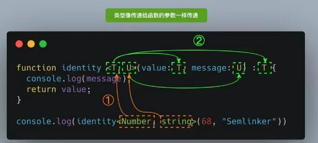

## TypeScript初体验

TypeScript是拥有类型的JavaScript超集，它可以编译成普通、干净、完整的JavaScript代码。

**安装**

```elm
npm install typescript -g
```

**查看版本**

```elm
tsc --version
```


<span style="backGround: #efe0b9">Demo.ts</span>

```javascript
let message: string = 'hey'

function foo(payload: string) {
  console.log(payload.length)
}

foo(123)   // warning
foo()      // warning
foo("aaa") // pass
```

:ghost: 限制了传参类型，不传参（相当于undefined）也会报错警告。


**生成同名js文件**

```elm
tsc demo.ts
```

:turtle: 可以通过这种方式去生成编译好的 js 文件，但是项目中一般不这么繁琐操作。


## 运行环境

### Node环境（ts-node）

安装库

```elm
npm install ts-node -g
```

安装相关依赖

```elm
npm install tslib @types/node -g
```

运行 ts 文件

```elm
ts-node demo.ts
```


### 浏览器环境（webpack）

#### 基本配置

初始化

```elm
npm init -y
```

安装 webpack

```elm
npm install webpack webpack-cli -D
```

安装 loader

```elm
npm install ts-loader typescript -D
```

生成配置文件

```elm
tsc --init
```

:ghost: 使用该命令将自动生成 ts 的配置文件 <span style="color: #a50">tsconfig.json</span>，对于这种实现方式该文件是必须的。


#### 使用本地服务

本地服务

```elm
npm install webpack-dev-server -D
```

:ghost: 使用本地服务，每次改动代码后无需手动打包。

配置命令

```javascript
"scripts": {
  "serve": "webpack serve"
},
```

模板插件

```elm
npm install html-webpack-plugin -D
```

<span style="backGround: #efe0b9">webpack.config.js</span>

```javascript
const path = require('path')
const HtmlWebpackPlugin = require('html-webpack-plugin') // 根据自定义模板生成入口文件

module.exports = {
  mode: "development",
  entry: "./src/main.ts",
  output: {
    path: path.resolve(__dirname, "./dist"),
    filename: "bundle.js"
  },
  devServer: {
  },
  resolve: {
    extensions: [".ts", ".js", ".cjs", ".json"] // 不能省略后面的类型，有些依赖本身导入了该类型
  },
  module: {
    rules: [
      {
        test: /\.ts$/,
        loader: 'ts-loader'
      }
    ]
  },
  plugins: [
    new HtmlWebpackPlugin({
      template: "./index.html"
    })
  ]
}
```


## 变量声明

> 声明了类型后 TypeScript 就会进行<span style="color: #a50">类型检测</span>，声明的类型可以称之为<span style="color: #a50">类型注解</span>（红色部分）； 

  let age<span style="color: #ff0000">: number</span> = 18

<span style="backGround: #efe0b9">Demo.ts</span>

```javascript
var name: string = "why" 
let age: number = 18
const height: number = 1.88

// string: TypeScript中的字符串类型
// String: JavaScript的字符串包装(对象)类的类型
const message: string = "Hello World"

// 原始类型兼容对应的对象类型，反过来对象类型不兼容对应的原始类型
let num: number;
let Num: Number;
Num = num; // ok
num = Num; // warning

// 类型推导
let foo = "foo"
foo = 3 // warning

export {}
```

:star2: 不同的大小写格式，类似于 String 和 string，它们的差异很大；

:star2: 不要使用对象类型来注解值的类型，这没有任何意义；

:whale: <span style="color: #a50">类型推导</span>：默认情况下进行赋值时, 会将赋值的值的类型, 作为前面标识符的类型；

:whale: 使用 `export {}` 以便编译器将其视作模块使用。


## JS和TS的数据类型

:ghost: 作为 JavaScript 的超集，TypeScript 拥有它的任意数据类型。


### JavaScript类型

#### 数字&布尔值&字符串

```javascript
let num: number = 123

let big: bigint =  100n;

let flag: boolean = true

let message: string = 'hello'

big = num; // warning
num = big; // warning
```

:whale: 虽然 `number` 和 `bigint` 都表示数字，但是这两个类型不兼容。


**个人习惯**

```javascript
let num = 123
```

:turtle: 默认情况下，如果可以推导出对应的标识符的类型时（初始赋值），不加类型注释。


#### 数组

<span style="color: #3a84aa">定义数组类型</span>

```typescript
// 写法一，不推荐，语法与 react 的 jsx 冲突
const names1: Array<string> = ["a", "b"] 
// 写法二
const names2: string[] = ["a", "b"]      
```

:ghost: 在 ts 中，数组一般存放同种类型的元素。

<span style="color: #3a84aa">定义联合类型数组</span>

```javascript
let arr:(number | string)[];

arr3 = [1, 'b', 2, 'c'];
```

<span style="color: #3a84aa">定义指定对象成员的数组</span>

```javascript
interface Arrobj{
    name:string,
    age:number
}
let arr3:Arrobj[]=[{name:'jimmy',age:22}]
```


#### 对象

```javascript
/* 写法一，推荐使用 */
const info = {
  name: "why",
  age: 18
}

console.log(info.name)
```

```javascript
/* 写法二，这种情况下编译器会报错 */
const info: object = {
  name: "why",
  age: 18
}

console.log(info.name) // 读写属性都会报错：object 类型中没有这个属性
```


#### null&undefined

```javascript
let n1: null = null
let n2: undefined = undefined

n1 = 123 // 报错
```

```javascript
let n1 = null
n1 = 123
```

:whale: 添加类型注释后，只允许将自身类型的值赋值到自己，不添加就不会限制；

:turtle: 默认情况下 `null` 和 `undefined` 是所有类型的子类型，允许赋值给其它类型；

:turtle: 如果在 <span style="backGround: #efe0b9">tsconfig.json</span> 指定了 `"strictNullChecks":true` ，`null` 和 `undefined` 只能赋值给 `void` 和它们各自的类型。

<span style="color: #3a84aa">不能作为函数返回值类型</span>

```typescript
function fun(): undefined {
  console.log("this is TypeScript");
};
fun(); // warning
```

:octopus: 方法没有返回值将得到 `undefined`，需要定义成 `void` 类型，而不是 `undefined` 类型。


#### symbol

```javascript
const title1 = Symbol("title")
const title2 = Symbol('title')

const info = {
  [title1]: "程序员",
  [title2]: "老师"
}
```


### TypeScript类型

#### any

在 TypeScript 中，任何类型都可以被归为 any 类型（除了 <span style="background: #f1fbfd; color: #26c6da">never </span> ）。

<span style="color: #3a84aa">允许被赋值为任意类型</span>

```javascript
let message: any = "hey"
message = 123
message = {}
```

<span style="color: #3a84aa">允许访问任何属性，调用任何方法</span>

```typescript
let message: any = "hey"

message.do()

console.log(message.test)
```

<span style="color: #3a84aa">声明不指定类型的变量，相当于设置为any</span>

```typescript
let something;
something = 'seven';
something = 7;

/* 等价 */
let something: any;
something = 'seven';
something = 7;
```

<span style="color: #3a84aa">其他运用</span>

```javascript
// 允许数组中添加任意类型元素
const arr: any[] = []
```


#### unknown

| 类型    | 能够从_赋值 | 能够赋值给        |
| ------- | ----------- | ----------------- |
| any     | 任何类型    | 任何类型          |
| unknown | 任何类型    | `unknown `/ `any` |

<span style="color: #3a84aa">从任何类型赋值</span>

```typescript
let notSure: unknown = 4;
notSure = "maybe a string instead"; // OK
notSure = false; // OK
```

<span style="color: #3a84aa">只能赋值到unknown/any</span>

```typescript
let test:unknown = 123;
let value:number = test; // Error
```

<span style="color: #3a84aa">缩小类型才能执行操作，以此增强安全性</span>

```typescript
function getDogName() {
 let x: unknown;
 return x;
};
const dogName = getDogName();
// 直接使用
const upName = dogName.toLowerCase(); // Error
// typeof
if (typeof dogName === 'string') {
  const upName = dogName.toLowerCase(); // OK
}
// 类型断言 
const upName = (dogName as string).toLowerCase(); // OK
```


#### void

一般只有在函数没有返回值时去声明，可以省略。

```typescript
function sum(num1: number, num2: number):void {
  console.log(num1 + num2)
}
```

:whale: 给函数添加 `void` 后，仍能够显式返回 null 或 undefined 。


#### never

> 若函数执行时出现死循环或者抛出异常，将永不存在返回，这时适合用 <span style="color: #a50">never</span> ，而不是 void。

```javascript
// 死循环
function foo(): never {
  while(true) {}
}

// 异常
function bar(): never {
  throw new Error()
}
```

**使用场景**

> 封装函数时，内部只处理了字符串和数字类型。后来的开发人员想让它也处理布尔值，于是给参数多添加了一种类型，但是忘记添加处理逻辑。这时执行到相应代码后会报错。

```javascript
function handleMessage(message: string | number | boolean) {
  switch (typeof message) {
    case 'string':
      console.log("处理string")
      break
    case 'number':
      console.log("处理number")
      break
    // 实现全面性检查
    default:
      const check: never = message // warning
  }
}
```

<span style="background: #f1fbfd; color: #26c6da">:whale: never </span>类型同 <span style="background: #f1fbfd; color: #26c6da">null</span> 和 <span style="background: #f1fbfd; color: #26c6da">undefined</span> 一样，也是任何类型的子类型，也可以赋值给任何类型；

:whale: 但是没有类型是 <span style="background: #f1fbfd; color: #26c6da">never </span>  的子类型或可以赋值给 <span style="background: #f1fbfd; color: #26c6da">never </span> 类型（除了 <span style="background: #f1fbfd; color: #26c6da">never </span> 本身之外），即使 <span style="background: #f1fbfd; color: #26c6da">any</span> 也不可以赋值给 <span style="background: #f1fbfd; color: #26c6da">never </span>。


#### tuple

##### 使用场景

如果一个数组中可能有多种类型，数量和类型都不确定，那就直接用 <span style="color: #ff0000">any[]</span>；

而元组最重要的特性是可以限制 <span style="color: #ff0000">数组元素的个数和类型</span>。

- 数组

```javascript
const info: any[] = [undefined, 18, 1.88]

// 不会给出警告，但是编译会出错
console.log(info[0].length) 
```

- 元组

```javascript
// 限制参数的类型和必填
const info: [string, number, number] = ["why", 18, 1.88]

console.log(info[0].length) 
```


##### 使用场景二

定义一个 useState 方法，返回一个数组，数组元素分别为传入参数的拷贝值，及改变拷贝值的方法

在返回值上使用元组进行类型注解，可以校验数组元素的类型

```javascript
function useState(state: any) {
  let currentState = state
  const changeState = (newState: any) => {
    currentState = newState
  }

  // 第二个注解为函数类型
  const tuple: [any, (newState: any) => void] = [currentState, changeState]
  return tuple
}

// 元组类型的赋值
const [counter, setCounter] = useState(10);
setCounter(1000)
```


##### 使用场景二(增强)

> 通过泛型，可以根据入参决定出参的类型。

```javascript
function useState<T>(state: T) {
  let currentState = state
  const changeState = (newState: T) => {
    currentState = newState
  }
  
  const tuple: [T, (newState: T) => void] = [currentState, changeState]
  return tuple
}

const [counter, setCounter] = useState(10);  // 数字
const [title, setTitle] = useState("abc");   // 字符串
```

调用函数时，取得参数的类型，并赋值到整个函数当中去。


##### 其他

<span style="color: #3a84aa">元组类型的可选元素</span>

```typescript
type Point = [number, number?, number?];

const x: Point = [10]; // 一维坐标点
const xy: Point = [10, 20]; // 二维坐标点
```

<span style="color: #3a84aa">元组类型的剩余元素</span>

```typescript
type RestTupleType = [number, ...string[]];
let restTuple: RestTupleType = [666, "Semlinker", "Kakuqo", "Lolo"];
console.log(restTuple[1]);
```

<span style="color: #3a84aa">只读的元组类型</span>

```typescript
const point: readonly [number, number] = [10, 20];
```


### 函数类型

#### 函数定义

<span style="color: #3a84aa">函数声明</span>

```javascript
function sum(x: number, y: number): number {
  return x + y;
}
```

<span style="color: #3a84aa">函数表达式</span>

```typescript
const foo1: (() => volid) = () => {}

let foo2: (x: number, y: number) => number = function (x: number, y: number): number {
    return x + y;
};
```

<span style="color: #3a84aa">通过类型定义</span>

```typescript
type MyFunction = () => volid
const foo: MyFunction = () => {}
```

<span style="color: #3a84aa">通过接口定义</span>

```typescript
interface SearchFunc{
  (source: string, subString: string): boolean;
}
```

:hammer_and_wrench: 采用接口定义时，对等号左侧进行类型限制，可以保证以后对函数名赋值时保证参数个数、参数类型、返回值类型不变。


#### 实际使用

```react
function sum(num1, num2) {
  return num1 + num2
}

// 给参数加上类型注解
function sum(num1: number, num2: number) {
  return num1 + num2
}

// 给返回值加上类型注解
function sum(num1: number, num2: number): number {
  return num1 + num2
}
```

:whale: 由于存在自动推导的机制，开发中，通常情况下不写返回值的类型；

:whale: 某些第三方库出于方便其他人理解考虑，会明确指定返回类型。


#### 上下文类型

```javascript
// 通常情况下, 定义函数时, 需要给参数加上类型注解
function foo(message: string) {}

// 这里的 item 可以不添加类型注解
const names = ["abc", "cba", "nba"]
names.forEach(function(item) {
  console.log(item.split(""))
})
```

:whale: 函数执行的上下文可以帮助确定参数和返回值的类型，故<span style="color: #ff0000">可以不添加类型注解</span>。


#### 函数参数

##### 对象类型

```typescript
function printPoint(point: {x: number, y: number, z: number}) {
  console.log(point.x, point.y, point.z)
}

printPoint({x: 123, y: 321, z: 111})
```

:turtle: 添加类型注解会对类型及必填做限制。


##### 可选类型

```typescript
function printPoint(point: {x: number, y: number, z?: number}) {
  console.log(point.x, point.y, point.z)
}

printPoint({x: 123, y: 321})
printPoint({x: 123, y: 321, z: 111})
```


##### 联合类型

```typescript
function printID(id: number|string) {
  if (typeof id === 'string') {
    // 能确定 id 一定是 string 类型，故不会警告
    console.log(id.toUpperCase())
  } else {
    console.log(id)
  }
}

printID(123)
printID("abc")
```

使用联合类型时，需要在内部缩小联合，以推断出更加具体的类型。


##### 可选和联合类型

```javascript
// 类似于 ① message: string|undefined
function foo(message?: string) {
  console.log(message)
}

foo()          // warn
foo(undefined) // warning
```


##### 类型别名

```typescript
type IDType = string | number | boolean
type PointType = {
  x: number
  y: number
  z?: number
}

function printId(id: IDType) {}

function printPoint(point: PointType) {}
```

:ghost: 通过 <span style="color: #a50">type</span> 可以定义类型别名，可以提高代码复用性。


### 类型推导

<span style="color: #3a84aa">具有初始化值的变量</span>

- 使用 let/var 声明并赋初值，默认会推导为对应的字面量类型所拓展的宽泛类型；

- 使用 const 声明并赋初值，默认会推导为对应的字面量类型；

```typescript
let str: string = 'this is string';
let num: number = 1;
let bool: boolean = true;

/* 等价 */
let str = 'this is string';
let num = 1; 
let bool = true; 
```

```typescript
const str: string = 'this is string'; // 推断类型为 'string'
const num: number = 1;
const bool: boolean = true;

/* 不等价 */
const str = 'this is string'; // 推断类型为 'this is string'
const num = 1; 	 // 推断类型为 1
const bool = true; 	 // 推断类型为 true
```

<span style="color: #3a84aa">有默认值的函数参数、函数返回的类型都可以根据上下文推断出来</span>

```typescript
/** 根据参数的类型，推断出返回值的类型也是 number */
function add1(a: number, b: number) {
  return a + b;
}
const x1= add1(1, 1); // 推断出 x1 的类型也是 number
  
/** 推断参数 b 的类型是数字或者 undefined，返回值的类型是数字 */
function add2(a: number, b = 1) {
  return a + b;
}
const x2 = add2(1);
const x3 = add2(1, '1'); // ts(2345) Argument of type "1" is not assignable to parameter of type 'number | undefined
```

<span style="color: #3a84aa">如果定义的时候没有赋值，会被推断成 `any` 类型</span>

```typescript
let myFavoriteNumber;
myFavoriteNumber = 'seven';
myFavoriteNumber = 7;
```


### 类型断言

> 通过 as 转化成更为具体的类型，能够使用相应的方法或属性。

#### 例子

<span style="color: #3a84aa">例子一</span>

```typescript
/* 推导为 HTMLElement，故读写 src 会警告 */
const el = document.getElementById("why")
el.src = "xxx" 

/* 不警告 */
const el2 = document.getElementById("why") as HTMLImageElement
el2.src = "xxx"
```


<span style="color: #3a84aa">例子二</span>

在编译阶段，TypeScript 会认为 greaterThan2 可能是 number，也可能是 undefined

```javascript
const arrayNumber: number[] = [1, 2, 3, 4];
const greaterThan2: number = arrayNumber.find(num => num > 2); // 提示 ts(2322)
```

如果可以确定值的类型，可以让 TypeScript 按照我们定义的方式做类型检查

```javascript
const arrayNumber: number[] = [1, 2, 3, 4];
const greaterThan2: number = arrayNumber.find(num => num > 2) as number;
```


<span style="color: #3a84aa">例子三</span>

```typescript
class Person {}

class Student extends Person {
  studying() {}
}

function sayHello(p: Person) {
    
  /* Person上没有该方法，警告 */
  p.studying() 
    
  /* 指明了更具体的类型，不会警告 */ 
  (p as Student).studying()
}

const stu = new Student()
sayHello(stu)
```

:whale: 由于 Student 是 Person 的子类，用它的实例作为函数参数不会有问题。


##### 强制转化

> 也可以转化成不太具体的类型，逃过编译的类型检测，但不推荐这种写法，容易造成混乱。

```typescript
const message = "Hello World"

// 警告
const num: number = message as number 

// 不会警告
const num: number = (message as any) as number
```


#### 语法

```typescript
// 尖括号 语法: 与 react 中 JSX 产生语法冲突，不推荐
let someValue: any = "this is a string";
let strLength: number = (<string>someValue).length;

// as 语法
let someValue: any = "this is a string";
let strLength: number = (someValue as string).length;
```


#### 非空断言

```typescript
let mayNullOrUndefinedOrString: null | undefined | string;
mayNullOrUndefinedOrString!.toString(); // ok
mayNullOrUndefinedOrString.toString(); // ts(2531)
```

:star2: 后缀表达式操作符 `!` 可以用于断言操作对象是非 null 和非 undefined 类型；

:star2: 能够从变量的值域中排除 <span style="color: #a50">null</span> 和 <span style="color: #a50">undefined</span>。


#### 确定赋值断言

```typescript
let x: number;
initialize();

// Variable 'x' is used before being assigned.(2454)
console.log(2 * x); // Error
function initialize() {
  x = 10;
}
```

```typescript
let x!: number;
initialize();
console.log(2 * x); // Ok

function initialize() {
  x = 10;
}
```

通过赋值断言，TypeScript 编译器就会知道该属性会被明确地赋值。


### 类型补充

#### 可选链的使用

> 为 ES11 中新增的特性，非 ts 独有。

```typescript
type Person = {
  name: string
  friend?: {
    name: string
    age?: number,
  }
}

const info: Person = {
  name: "why",
  friend: {
    name: "kobe",
  }
}

console.log(info.friend.name)  // 不能通过编译，因为 info.friend 有可能为 undefined
console.log(info.friend?.name) // 通过编译
console.log(info.friend?.age)  // 通过编译
```

:ghost: 当对象的属性不存在时，会短路而不执行跟随的代码，直接<span style="color: #ff0000">返回undefined</span>。

:ghost: 可选链用于读取，不能进行写入。


#### ??和!!操作符

> `??` 操作符为 ES11 中新增的特性，非 ts 独有。

```javascript
const str = "Hey"
// 下面操作等价，将任意类型转换为布尔类型
let flag = Boolean(str)
let flag = !!str

const result = str ?? "123"
```

<span style="color: #f7534f;font-weight:600">空值合并操作符（??）</span> 当操作符的左侧是 null 或者 undefined 时，返回其右侧操作数，否则返回左侧操作数。

:ghost: 与逻辑或（||）的差别：使用逻辑或时，当左侧为的值能够转化为 false 时，就会取右侧操作数。


### 字面量类型

在 TypeScript 中，字面量不仅可以表示值，还可以表示类型；

目前支持 3 种字面量类型：字符串字面量类型、数字字面量类型、布尔字面量类型。

```typescript
let specifiedStr: 'this is string' = 'this is string';
let specifiedNum: 1 = 1;
let specifiedBoolean: true = true;

// 这里字面量类型 'this is string' 是 sring 类型的子类型
specifiedStr = "this is potato"  // warning
specifiedStr = "this is string"
```


<span style="color: #3a84aa">应用-结合联合类型</span>

```typescript
interface Config {
  size: 'small' | 'big';
  isEnable:  true | false;
  margin: 0 | 2 | 4;
}

const config:Config = {
  size: 'big',
  isEnable: true,
  margin: 3  // warning
}
```


<span style="color: #3a84aa">字面量推断</span>

```javascript
type Method = 'GET' | 'POST'
function request(url: string, method: Method) {}

const options = {
  url: "https://abc/xx",
  method: "POST"
} 

// 报错，推导 options.method 为 string 类型
request(options.url, options.method) 
```

##### 方法一

> 使用类型别名。

```javascript
type Method = 'GET' | 'POST'
function request(url: string, method: Method) {}

type Request = {
  url: string,
  method: Method
}

const options: Request = {
  url: "https://abc/xx",
  method: "POST"
}

request(options.url, options.method)
```

##### 方法二

> 使用类型断言（推荐）。

```javascript
type Method = 'GET' | 'POST'
function request(url: string, method: Method) {}

const options = {
  url: "https://abc/xx",
  method: "POST"
}

request(options.url, options.method as Method)
```

##### 方法三

```javascript
type Method = 'GET' | 'POST'
function request(url: string, method: Method) {}

const options = {
  url: "https://abc/xx",
  method: "POST"
} as const
// options.url 的类型为 "https://abc/xx"
// options.method 的类型为 "POST"

request(options.url, options.method)
```


### 类型拓宽

```typescript
/** 注释后的是类型 */
let str = 'this is string'; // string
let strFun = (str = 'this is string') => str; // (str?: string) => string;
const specifiedStr = 'this is string'; // 'this is string'
let str2 = specifiedStr; // 'string'
let strFun2 = (str = specifiedStr) => str; // (str?: string) => string;
```

上面第 4~5 行，被赋值的 specifiedStr 是字面量类型&&显式类型注解，故类型被拓宽。

<span style="color: #3a84aa">添加显式类式注解控制类型拓宽行为</span>

```typescript
const specifiedStr: 'this is string' = 'this is string'; // 'this is string'
let str2 = specifiedStr; // 即便使用 let 定义，类型是 'this is string'
```


#### 控制拓宽过程

TypeScript 试图在特殊性和灵活性之间取得平衡，但推断出的类型未必是我们需要的。

<span style="color: #3a84aa">通过 const 控制拓宽过程</span>

> 因为 x 不能重新赋值，所以 TypeScript 可以推断更窄的类型

```typescript
const x1 = "x"; // "x" 
let x2 = "x"; // "string" 

let vec = { x: 10, y: 20, z: 30 };
getComponent(vec, x1); // ok
getComponent(vec, x2); // warning
```


<span style="color: #3a84aa">使用 const 断言，帮助对象/数组的推断</span>

> 不要将其与 let / const 混淆，后者在值空间中引入符号。这是一个纯粹的类型级构造。

```typescript
// { x: number; y: number; }
const obj1 = { 
  x: 1, 
  y: 2 
}; 

// { x: 1; y: number; }
const obj2 = {
  x: 1 as const,
  y: 2,
}; 

// { readonly x: 1; readonly y: 2; }
const obj3 = {
  x: 1, 
  y: 2 
} as const;
```

:star2: 使用 const 断言时，TypeScript 将为它推断出最窄的类型，没有拓宽。适用于常量。


### 类型缩小

> 可以通过某些操作将变量的类型由一个较为宽泛的集合缩小到相对较小、较明确的集合。

#### 非空断言

从原有的可能性中排除掉 `null` 和 `undefined`。


#### typeof

> 使用类型守卫，将联合类型缩小到明确的子类型

```javascript
type IDType = number | string | boolean
function printID(id: IDType) {
  if (typeof id === 'string') {
    console.log(id.toUpperCase())
  } else {
    console.log(id) // 'number | boolean'
  }
}
```


#### instanceof

```typescript
function printTime(time: string | Date) {
  if (time instanceof Date) {
    console.log(time.toUTCString())
  } else {
    console.log(time) // string
  }
}
```

> 对于类创建处理的实例，也可以进行判断。

```typescript
class Student {
  studying() {}
}

class Teacher {
  teaching() {}
}

function work(p: Student | Teacher) {
  if (p instanceof Student) {
    p.studying()
  } else {
    p.teaching() // Teacher
  }
}

const stu = new Student()
work(stu)
```


#### 平等缩小

可以通过 `===`、`if` 、`switch` 、三目运算符等将联合类型收敛为更具体的类型。

```javascript
type Direction = "left" | "right" | "top" | "bottom"

// 结合 === == !== != 的 if 判断
function printDirection(direction: Direction) {
  if (direction === 'left') {
    console.log(direction)
  } else if ()
}

// switch 判断 
function printDirection2(direction: Direction) {
  switch (direction) {
    case 'left':
      console.log(direction)
      break;
    case ...
  }
}
```


#### in

> 用于判断对象是否有对应的属性/方法。

```javascript
type Fish = {
  swimming: () => void
}

type Dog = {
  running: () => void
}

function walk(animal: Fish | Dog) {
  if ('swimming' in animal) {
    animal.swimming()
  } else {
    animal.running()
  }
}

const fish: Fish = {
  swimming() {
    console.log("swimming")
  }
}

walk(fish)
```


#### 实际应用

<span style="color: #3a84aa">联合标签</span>

也被称为 ”可辨识联合“

```typescript
interface UploadEvent {
  type: "upload";
  filename: string;
  contents: string;
}

interface DownloadEvent {
  type: "download";
  filename: string;
}

type AppEvent = UploadEvent | DownloadEvent;

function handleEvent(e: AppEvent) {
  switch (e.type) {
    case "download":
      e; // Type is DownloadEvent 
      break;
    case "upload":
      e; // Type is UploadEvent 
      break;
  }
}
```


### 联合类型

联合类型表示取值可以为多种类型中的一种，使用 `|` 分隔每个类型。

```typescript
let myFavoriteNumber: string | number;

// 也可以用字面量类型，实现更强的约束
let num: 1 | 2 = 1;
type EventNames = 'click' | 'scroll' | 'mousemove';
```


### 交叉类型

交叉类型是将多个类型合并为一个类型，使用 `&` 定义交叉类型。

<span style="color: #3a84aa">无意义：合并原始类型、字面量类型、函数类型等原子类型</span>

```typescript
// 不存在满足这种条件的值
type Useless = string & number;
```

<span style="color: #3a84aa">合并接口类型</span>

```typescript
type IntersectionType = { id: number; name: string; } & { age: number };
// 合并接口类型
const mixed: IntersectionType = {
  id: 1,
  name: 'name',
  age: 18
}
```

<span style="color: #3a84aa">拓展-接口同名属性的合并-基本数据类型</span>

```typescript
type IntersectionTypeConfict = { id: number; name: string; } 
& { age: number; name: number; };
const mixedConflict: IntersectionTypeConfict = {
  id: 1,
  name: 2, // ts(2322) 错误，'number' 类型不能赋给 'never' 类型
  age: 2
};
```

:trident: 基本数据类型会进行合并，上面的合并结果是 `never`；

:trident: 如果是字面量类型和对应的宽泛类型合并，合并的结果将是字面量类型；

<span style="color: #3a84aa">拓展-接口同名属性的合并-非基本数据类型</span>

```typescript
interface A {
  x:{d:true},
}
interface B {
  x:{e:string},
}
interface C {
  x:{f:number},
}
type ABC = A & B & C
 // 可以成功合并
let abc:ABC = {
  x:{
    d:true,
    e:'',
    f:666
  }
}
```


### 类型别名

类型别名用来给一个类型起个新名字（而非创建新的类型）。类型别名常用于联合类型。

```typescript
type Message = string | string[];
let greet = (message: Message) => {
  // ...
};
```


### 函数类型解析

#### 函数的类型

##### 函数作为参数

```javascript
function foo() {}

type FooFnType = () => void
function bar(fn: FooFnType) {
  fn()
}

bar(foo)
```

```javascript
/* 等价写法 */
function bar(fn: () => void) {
  fn()
}
```

##### 赋值给常量

```javascript
type AddFnType = (num1: number, num2: number) => number
const add: AddFnType = (a1: number, a2: number) => {
  return a1 + a2
}
```

:whale: 定义类型别名时，形参的命名没有限制。

```javascript
type AddFnType = (num1: number, num2: number) => void
```

> 也可以这样定义类型， void 接受任何类型的返回值。


##### 案例

```javascript
function calc(n1: number, n2: number, fn: (num1: number, num2: number) => number) {
  return fn(n1, n2)
}

const result1 = calc(20, 30, function(a1, a2) {
  return a1 + a2
})
console.log(result1)

const result2 = calc(20, 30, function(a1, a2) {
  return a1 * a2
})
console.log(result2)
```

> 其中的 a1 和 a2 没有显示添加的类型注解，因为它属于上下文类型。


#### 可选类型

```typescript
function foo(x: number, y?: number) {}

foo(20, 30)
foo(20)
```

:ghost: 可选类型必须写在必选类型的后面。


#### 默认值

```typescript
function foo(x: number, y: number = 20) {
  console.log(x, y)
}

foo(30)
```

:ghost: 规范的参数定义顺序：必传参数 - 有默认值的参数 - 可选参数


#### 剩余参数

```typescript
function sum(initalNum: number, ...nums: number[]) {
  let total = initalNum
  for (const num of nums) {
    total += num
  }
  return total
}

console.log(sum(20, 30))
console.log(sum(20, 30, 40))
```


#### 可推导的this类型

```typescript
const info = {
  name: "why",
  eating() {
    console.log(this.name + " eating")
  }
}

info.eating()
```

:ghost: TypeScript 认为函数 eating 有一个对应的 this 的外部对象 info，所以在使用时，就会把 this 当做该对象。


#### 不确定的this类型

```javascript
function say(message: string) {
  console.log(this.name + "eating", message);
}

const info = {
  name: 'demo',
  say
}

info.say() // 警告
```

:whale: ts 进行类型检测的目的是让我们的代码更加的安全。

:octopus: 对于 ts 编译器来说，虽然 this 指向 info 对象，但这个代码是非常不安全的，因为它有可能被别的对象调用。

> 需要明确指定 this 的类型。

```javascript
type ThisType = { name: string };

function eating(this: ThisType, message: string) {
  console.log(this.name + "eating", message);
}

const info = {
  name: "why",
  eating: eating,
};

// 隐式绑定
info.eating("哈哈哈");

// 显示绑定
eating.call({name: "kobe"}, "呵呵呵")
eating.apply({name: "james"}, ["嘿嘿嘿"])
```


#### 函数的重载

```javascript
// 函数的重载: 函数的名称相同, 但是参数不同的几个函数, 就是函数的重载
function add(num1: number, num2: number): number; // 没函数体
function add(num1: string, num2: string): string;

function add(num1: any, num2: any): any {
  if (typeof num1 === 'string' && typeof num2 === 'string') {
    return num1.length + num2.length
  }
  return num1 + num2
}

const result = add(20, 30)
const result2 = add("abc", "cba")

// 在函数的重载中, 实现函数是不能直接被调用的，必须存在匹配的声明
add({name: "why"}, {age: 18})  // 报错
```

:ghost: 使用函数重载时，它的声明（无函数体）与实现分开。ts 会根据调用时传入的参数，找到匹配的声明，且必须存在匹配的声明。


#### 联合 vs 重载

> 实际开发时，在可能的情况下，尽量选择使用 [联合类型] 来实现。

联合

```javascript
function getLength(args: string | any[]) {
  return args.length
}

console.log(getLength("abc"))
console.log(getLength([1, 22, 3]))
```

函数的重载

```javascript
function getLength(args: string): number;
function getLength(args: any[]): number;

function getLength(args: any): number {
  return args.length
}

console.log(getLength("abc"))
console.log(getLength([1, 22, 3]))
```

:whale: 这个例子中不管传入哪种类型，都有 length 属性，且返回值类型确定，优先使用联合类型。

:whale: 对于一些过于复杂的情况，使用联合类型无法确定返回值类型，可以考虑函数的重载。


## 类

> 实际上在 js 的开发过程中，我们更加习惯于函数式编程，如 Composition API。
>
> 但是在封装某些业务的时候，类具有更强大封装性，也会被使用到。


### 类的定义

> 在 ts 中定义类时，必须初始化属性的值。可以在构造器中进行。

```javascript
class Person {
  name: string = 'demo'
  age: number = 18

  eating() {
    console.log(this.name + " eating")
  }
}

const p = new Person()
p.eating()
```

```javascript
class Person {
  name: string
  age: number

  constructor(name: string, age: number) {
    this.name = name
    this.age = age
  }

  eating() {
    console.log(this.name + " eating")
  }
}

const p = new Person("demo", 18)
p.eating()
```


### 类的继承

**普通写法**

> 会发现有些类之间存在大量重复的属性和方法，可以将其抽离，视作父类。

```javascript
class Student {
  name: string = ''
  age: number = 0
  sno: number = 0

  eating() {
    console.log("eating")
  }

  studying() {
    console.log("studying")
  }
}

class Teacher {
  name: string = ''
  age: number = 0
  subject: string = ''

  eating() {
    console.log("eating")
  }

  teaching() {
    console.log("teaching")
  }
}
```

**使用继承**

```javascript
class Person {
  name: string
  age: number

  constructor(name: string, age: number) {
    this.name = name
    this.age = age
  }

  eating() {
    console.log("eating 100行")
  }
}

class Student extends Person {
  sno: number

  constructor(name: string, age: number, sno: number) {
    // super调用父类的构造器
    super(name, age)
    this.sno = sno
  }

  eating() {
    console.log("student eating")
    super.eating()
  }

  studying() {
    console.log("studying")
  }
}

const stu = new Student("why", 18, 111)
stu.eating()
```

:whale: 调用实例方法时，如果实例上没有该方法，就会去父类上找。

:whale: 如果实例也有该方法，相当于方法重写，会调用实例上的方法；在内部可以使用 `super.x()`，表示同时使用父类的该方法。


### 类的多态

```javascript
class Animal {
  action() {
    console.log("a")
  }
}

class Dog extends Animal {
  action() {
    console.log("d")
  }
}

class Fish extends Animal {
  action() {
    console.log("f")
  }
}

// 多态的目的是为了写出更加具备通用性的代码，这里的结构比联合类型/函数重载要更简单
function makeActions(animals: Animal[]) {
  animals.forEach(animal => {
    animal.action()
  })
}

makeActions([new Dog(), new Fish()]) // 输出 d f
```

:ghost: 这里的父类类型指向子类（构造出来）的对象，所以函参的 animal 指向子类。

会去校验父类上是有有该方法，但调用的实际是子类的方法。


### 类的成员修饰符

#### public

```javascript
class Person {
  public name: string = "springLoach"
}
/* 等价 */
class Person {
  name: string = "springLoach"
}

const p = new Person()
console.log(p.name)
```

:ghost: 默认的修饰符，可以在任何地方访问该属性/方法。


#### private

```javascript
class Person {
  private name: string = "springLoach"

  getName() {
    return this.name
  }

  setName(newName) {
    this.name = newName
  }
}

const p = new Person()
console.log(p.getName())
p.setName("why")
p.name  // 警告
```

:ghost: 仅在类内部可以访问，实例等地方不行


#### protected

```javascript
class Person {
  protected name: string = "123"
}

class Student extends Person {
  getName() {
    return this.name
  }
}

const stu = new Student()
console.log(stu.getName())
stu.name // 警告
```

:ghost: 在类内部和子类中可以访问，实例等位置不允许。


### 只读属性

```javascript
class Person {
  readonly name: string = "springLoach"
}

const p = new Person()

console.log(p.name)
p.name = "123"  // 警告
```

> 通常这样使用：只读属性是可以在构造器中赋值, 赋值之后就不可以修改。

```javascript
class Person {
  readonly name: string
  constructor(name: string, friend?: Person) {
    this.name = name
    this.friend = friend
  }
}

const p = new Person("springLoach")

console.log(p.name)
p.name = "123"  // 警告
```


### 访问器

> 私有属性是不能直接访问的，但可以借助访问器（存取器）。

```javascript
class Person {
  private _name: string
  constructor(name: string) {
    this._name = name
  }

  // setter / getter
  set name(newName) {
    this._name = newName
  }
  get name() {
    return this._name
  }
}

const p = new Person("why")
p.name = "coderwhy"
console.log(p.name)
```

:hammer_and_wrench: 对于私有属性，使用 `_` 作为开头命名。


### 静态成员

> 可以直接通过类，而不是类的实例访问。

```javascript
class Student {
  static time: string = "20:00"

  static attendClass() {
    console.log("去学习~")
  }
}

console.log(Student.time)
Student.attendClass()
```


### 抽象类

> 适用于父类本身并不需要对某些方法进行具体的实现。

```javascript
function makeArea(shape: Shape) {
  return shape.getArea()
}

/* 抽象类 */
abstract class Shape {
  abstract getArea(): number
}

class Rectangle extends Shape {
  private width: number
  private height: number

  constructor(width: number, height: number) {
    super()
    this.width = width
    this.height = height
  }

  getArea() {
    return this.width * this.height
  }
}

class Circle extends Shape {
  private r: number

  constructor(r: number) {
    super()
    this.r = r
  }

  getArea() {
    return this.r * this.r * 3.14
  }
}

const rectangle = new Rectangle(20, 30)
const circle = new Circle(10)

console.log(makeArea(rectangle))
console.log(makeArea(circle))
```

:ghost: 抽象类需要用 <span style="color: #a50">abstract</span> 关键字定义，内部的抽象方法也需要用 <span style="color: #a50">abstract </span>定义，且无需函数体。

:ghost: 抽象类不能被实例化，在它的子类中被要求<span style="color: #ff0000">必须实现它的抽象方法</span>。

:ghost: 子类的构造函数中一定要调用 <span style="color: #a50">super</span>，即便父类没有显示定义 constructor。


### 类的类型

```javascript
class Person {
  name: string = "cat"
  eating() {}
}

const p = new Person()

const p1: Person = {
  name: "demo",
  eating() {}
}
```

:ghost: 可以通过对象的方式来创建该类的类型，要求对象属性与类成员完全一致，不能多也不能少。

> 使用场景，可以直接将对象字面量作参，满足类的类型条件，通过类型检测。

```javascript
function printPerson(p: Person) {
  console.log(p.name)
}

printPerson(new Person())
printPerson({name: "kobe", eating: function() {}})
```


## 接口

```typescript
// 大程度上等价于别名写法
interface InfoType {
  name: string
  age: number
}

/* 实现 */
const info: InfoType = {
  name: "why",
  age: 18,
}
```

:hammer_and_wrench: 接口一般首字母大写，某些语言中习惯接口以 `I` 作为开头命名；

:ghost: 要求变量形状与接口一致，表现为对象属性与接口完全一致，<span style="color: #ff0000">不能多</span>也不能少。


### 可选 | 只读属性

```typescript
interface IInfoType {
  readonly name: string
  age: number
  friend?: {
    name: string
  }
}

const info: IInfoType = {
  name: "why",
  age: 18,
  friend: {
    name: "kobe"
  }
}
```

:trident: 对于可选属性 friend，如果存在就要求必须存在属性 name。


<span style="color: #3a84aa">拓展-ReadonlyArray<T></span>

使用 `ReadonlyArray<T>` 类型，可以确保数组创建后再也不能被修改。

```typescript
let a: number[] = [1, 2, 3, 4];
let ro: ReadonlyArray<number> = a;
ro[0] = 12; // error!
ro.push(5); // error!
```


### 索引类型

使用索引类型，可以让接口包含其他的任意属性。可以限制它的键和值的类型。

```typescript
interface IndexLanguage {
  [index: number]: string
}

const frontLanguage: IndexLanguage = {
  0: "HTML",
  1: "CSS",
  2: "JavaScript",
  3: "Vue"
}
```

```typescript
interface ILanguageYear {
  [name: string | number]: number | string
}

const languageYear: ILanguageYear = {
  "C": 1972,
  3: 1995,
  "JavaScript": '1996',
  "TypeScript": 2014
}
```

<span style="color: #3a84aa">结合可选/只读属性使用</span>

```typescript
interface Person {
    name: string;
    age?: number; // 真实的类型为：number | undefined
    [propName: string]: string | number | undefined;
}

let tom: Person = {
    name: 'Tom',
    age: 25,
    gender: 'male'
};
```

:star2: 一旦定义了任意属性，那么确定属性和可选属性的类型都<span style="color: #ff0000">必须是它的类型的子集</span>；

:star2: 可选属性存在类型为 <span style="color: #a50">undefined</span> 的可能，故在联合类型中要考虑上。


### 绕开额外属性检查

#### 案例

直接给对应类型的变量赋值，这个对象有严格的类型定义，所以不能多参或少参。

```typescript
interface Test {
  label: string;
}

let test:Test = { size: 10, label: "Size 10 Object" }; // error
```


#### 鸭式辨型法

根据类型的兼容性，两种类型对象，因为都具有 `label` 属性，所以被认定为两个相同，故而可以用此法来绕开多余的类型检查。

```typescript
interface Test {
  label: string;
}

let obj =  { size: 10, label: "Size 10 Object" };
let test:Test =  obj; // ok
```


#### 类型断言

类型断言的意义就等同于告诉程序，你很清楚自己在做什么，此时程序自然就不会再进行额外的属性检查了。

```typescript
interface Props { 
  name: string; 
  age: number; 
  money?: number;
}

let p: Props = {
  name: "Demo",
  age: 25,
  money: -100000,
  girl: false
} as Props; // ok
```


#### 索引签名

```typescript
interface Props { 
  name: string; 
  age: number; 
  money?: number;
  [key: string]: any;
}

let p: Props = {
  name: "兔神",
  age: 25,
  money: -100000,
  girl: false
}; // OK
```


### 接口 vs 类型别名

- <span style="color: #f7534f;font-weight:600">接口</span> TypeScript 的核心原则之一是对值所具有的结构进行类型检查。 而接口的作用就是为这些类型命名和为你的代码或第三方代码定义数据模型；
- <span style="color: #f7534f;font-weight:600">类型别名</span> 会给一个类型起个新名字。 type 有时和 interface 很像，但是可以作用于原始值，联合类型，元组以及其它任何需要手写的类型。

#### <span style="color: #3a84aa">描述对象/函数的类型</span>

```typescript
interface Point {
  x: number;
  y: number;
}

interface SetPoint {
  (x: number, y: number): void;
}

```

```typescript
type Point = {
  x: number;
  y: number;
};

type SetPoint = (x: number, y: number) => void;
```

:hammer_and_wrench: 两者都可以实现，但语法不同。定义函数建议使用类型别名而不是接口。


#### <span style="color: #3a84aa">类型别名还可以用于其他类型</span>

如基本类型（原始值）、联合类型、元组。

```typescript
// primitive
type Name = string;

// object
type PartialPointX = { x: number; };
type PartialPointY = { y: number; };

// union
type PartialPoint = PartialPointX | PartialPointY;

// tuple
type Data = [number, string];

// dom
let div = document.createElement('div');
type B = typeof div;
```


#### <span style="color: #3a84aa">接口可以定义多次</span>

与类型别名不同，接口可以定义多次，会被<span style="color: #ff0000">自动合并</span>为单个接口。

```typescript
interface Point { x: number; }
interface Point { y: number; }
const point: Point = { x: 1, y: 2 };
```


#### <span style="color: #3a84aa">相互扩展</span>

接口的扩展就是<span style="color: #a50">继承</span>，通过 <span style="color: #a50">extends</span> 来实现。类型别名的扩展就是<span style="color: #a50">交叉类型</span>，通过 <span style="color: #a50">&</span> 来实现。

##### 接口扩展

```typescript
interface ISwim {
  swimming: () => void
}
interface IFly {
  flying: () => void
}

/* 接口支持多继承 */
interface IAction extends ISwim, IFly {

}

const action: IAction = {
  swimming() {},
  flying() {}
}
```

##### 类型别名扩展

```typescript
type PointX = {
  x: number
}

type Point = PointX & {
  y: number
}
```

##### 接口扩展类型别名

```typescript
type PointX = {
  x: number
}
interface Point extends PointX {
  y: number
}
```

##### 类型别名扩展接口

```typescript
interface PointX {
  x: number
}
type Point = PointX & {
  y: number
}
```


### 接口的实现

```typescript
interface ISwim {
  swimming: () => void
}

interface IEat {
  eating: () => void
}


// 类可以实现接口
class Person implements ISwim {
  swimming() {}
}

// 类只能单继承，但可以实现多个接口
class Animal {}

class Fish extends Animal implements ISwim, IEat {
  swimming() {}
  eating() {}
}

// 编写一些公共的API: 面向接口编程，要求参数实现 ISwim 接口
function swimAction(swimable: ISwim) {
  swimable.swimming()
}

swimAction(new Fish())
swimAction(new Person())
swimAction({swimming: function() {}})
```


## 枚举类型

### 枚举类型的使用

> 枚举类型可以提供多个可能的值。

```elm
enum Direction {
  LEFT,
  RIGHT,
  TOP,
  BOTTOM
}

function turnDirection(direction: Direction) {
  switch (direction) {
    case Direction.LEFT:
      console.log("改变角色的方向向左")
      break;
    case Direction.RIGHT:
      console.log("改变角色的方向向右")
      break;
    case Direction.TOP:
      console.log("改变角色的方向向上")
      break;
    case Direction.BOTTOM:
      console.log("改变角色的方向向下")
      break;
    default:
      const foo: never = direction;
      break;
  }
}

turnDirection(Direction.LEFT)
turnDirection(Direction.RIGHT)
turnDirection(Direction.TOP)
turnDirection(Direction.BOTTOM)

// 对应标识符、类型、值
let d: Direction = Direction.BOTTOM
```


### 枚举类型的值

```elm
enum Direction {
  LEFT,     // 0
  RIGHT,    // 1
  TOP,      // 2
  BOTTOM    // 3
}

enum Direction {
  LEFT = 10,    
  RIGHT,        // 11
  TOP,          // 12
  BOTTOM        // 13
}

enum Direction {
  LEFT = "LEFT",
  RIGHT = "RIGHT",
  TOP = "TOP",
  BOTTOM = "BOTTOM"
}
```

:turtle: 枚举类型默认是有值的，可以赋予其它值，让它紧接着的值递增。


## 泛型

### 认识泛型

```typescript
// 这个例子参数及返回值的类型一致
function identity<T>(arg: T): T {
  return arg
}

// 手动传入
sum<number>(20)
sum<{name: string}>({name: "why"})
sum<any[]>(["abc"])

// 类型推导
sum(50)
sum("abc")
```

这里的泛型 T 是一个抽象类型，只有<span style="color: #ff0000">在函数调用的时候才确定它的值</span>；

使用泛型可以减少特定函数的重复定义，比如要实现一个函数，它的入参和出参完全一致。


函数可以拥有多个泛型，且泛型的名称不是固定的。

| 约定熟成的类型 | 说明                       |
| -------------- | -------------------------- |
| T（Type）      | 通常用作第一个类型变量名称 |
| K（Key）       | 表示对象中的键类型         |
| V（Value）     | 表示对象中的值类型         |
| E（Element）   | 表示元素类型               |


### 类型传递

在调用函数时，定义的类型像传递给函数的参数一样传递，然后链式传递给参数类型和返回类型。



```typescript
function identity <T, U>(value: T, message: U) : T {
  console.log(message);
  return value;
}
console.log(identity<Number, string>(68, "Semlinker"));
```

```typescript
/* 等价 */
function identity <T, U>(value: T, message: U) : T {
  console.log(message);
  return value;
}
// 可以不显式指定：编译器能够知道参数类型，并将它们赋值给 T 和 U
console.log(identity(68, "Semlinker"));
```


### 泛型的类型约束

```javascript
function getLength<T>(arg: T) {
  return arg.length
}
```

:octopus: 报错，T 可能是任何类型，但某些类型可能不具有 length 属性。

```typescript
interface ILength {
  length: number
}

function getLength<T extends ILength>(arg: T) {
  return arg.length
}

getLength("abc")
getLength(["abc", "cba"])
getLength({length: 100})
```

:turtle: 可以通过 <span style="color: #a50">extends</span> 进行约束，传入的参数类型，必须满足接口，即拥有 length 属性。


### 泛型接口的使用

```elm
interface IPerson<T1, T2> {
  name: T1
  age: T2
}

const p: IPerson<string, number> = {
  name: "why",
  age: 18
}
```

```elm
interface IPerson<T1 = string | number, T2 = number> {
  name: T1
  age: T2
}

const p: IPerson = {
  name: "why",
  age: 18
}
```

:turtle: 使用泛型接口时，没有<span style="color: #a50">类型推导</span>。


### 泛型类的使用

```elm
class Point<T> {
  x: T
  y: T
  z: T

  constructor(x: T, y: T, z: T) {
    this.x = x
    this.y = y
    this.z = y
  }
}

// 类型推导
const p1 = new Point("1.33.2", "2.22.3", "4.22.1")
// 手动传入
const p2 = new Point<string>("1.33.2", "2.22.3", "4.22.1")
const p3: Point<string> = new Point("1.33.2", "2.22.3", "4.22.1")
```


### 泛型工具类型-基础篇

TypeScript 内置了一些常用的工具类型，不过在这之前，可以先了解相关基础知识。

#### ① typeof

主要用途是在类型上下文中<span style="color: #ff0000">获取</span>变量或者属性的<span style="color: #ff0000">类型</span>，同样可以获取嵌套对象和函数的类型。

```typescript
interface Person {
  name: string;
  age: number;
}
const sem: Person = { name: "semlinker", age: 30 };
type Sem = typeof sem; // type Sem = Person
```


#### ② keyof

在 TypeScript 2.1 版本引入，该操作符可以用于<span style="color: #ff0000">获取某种类型的所有键</span>，其返回类型是联合类型。

```typescript
interface Person {
  name: string;
  age: number;
}

type K1 = keyof Person; // "name" | "age"
type K2 = keyof Person[]; // "length" | "toString" | "pop" | "push" | "concat" | "join" 
type K3 = keyof boolean; // "valueOf"
type K4 = keyof { [x: string]: boolean };  // string | number
```

:whale: <span style="color: slategray">K4类型</span> 当使用数值索引时，JavaScript 在执行索引操作时，会先把数值索引先转换为字符串索引


##### 应用-遍历对象属性

<span style="color: #3a84aa">情景</span>

```typescript
function prop(obj: object, key: string) {
  return obj[key];
}
// warning: string 类型不能用于索引 {} 类型
```

<span style="color: #3a84aa">暴力方案，可以但不推荐</span>

```typescript
function prop(obj: object, key: string) {
  return (obj as any)[key];
}
```

<span style="color: #3a84aa">使用 keyof 限制属性名的范围</span>

```typescript
function prop<T extends object, K extends keyof T>(obj: T, key: K) {
  return obj[key];
}
```

此时，通过该方法当访问对象上不存在的属性时，编译器就会给出错误提示。


#### ③ in

用来遍历枚举类型

```typescript
type Keys = "a" | "b" | "c"

type Obj =  {
  [p in Keys]: any
} // => { a: any, b: any, c: any }
```


#### ④ infer

在条件类型语句中，可以用 <span style="color: #a50">infer</span> 声明一个类型变量并且对它进行使用。

```typescript
type ReturnType<T> = T extends (
  ...args: any[]
) => infer R ? R : any;
```

上面的  `infer R` 可以取到函数返回值的类型到 `R` 上，然后在后面进行使用。


#### ⑤ extends

 可以通过 <span style="color: #a50">extends</span> 进行约束，避免定义的泛型过于灵活。

```typescript
interface ILength {
  length: number
}

function getLength<T extends ILength>(arg: T) {
  return arg.length
}

getLength("abc")
getLength(["abc", "cba"])
getLength({length: 100})
getLength({other: 123}) // warning
```


#### ⑥ 索引类型

<span style="color: #3a84aa">场景：在对象中获取一些属性的值，然后建立对应的集合</span>

```typescript
let person = {
    name: 'musion',
    age: 35
}

function getValues(person: any, keys: string[]) {
    return keys.map(key => person[key])
}

console.log(getValues(person, ['name', 'age'])) // ['musion', 35]
console.log(getValues(person, ['gender'])) // [undefined]
```

:octopus: 即使对象上没有对应属性，Typescript 也不能对此给出提示。

<span style="color: #3a84aa">通过「索引类型查询」和「索引访问」操作符优化</span>

```typescript
const person = {
  name: 'musion',
  age: 35
}

// 核心在于 K[]，限制数组元素只能为传入对象的键
function getValues<T extends object, K extends keyof T>(person: T, keys: K[]) {
  // return obj[key];
  return keys.map(key => person[key]);
}

getValues(person, ['name']) // ['musion']
getValues(person, ['gender']) // 报错
```


#### ⑦ 映射类型

根据旧的类型创建出新的类型, 称之为映射类型

<span style="color: #3a84aa">原始类型</span>

```typescript
interface TestInterface{
  name:string,
  age:number
}
```

<span style="color: #3a84aa">将全部属性变成可选</span>

```typescript
// 可以通过+/-来指定添加还是删除
type OptionalTestInterface<T> = {
  [p in keyof T]+?:T[p]
}

type newTestInterface = OptionalTestInterface<TestInterface>
```

<span style="color: #3a84aa">将全部属性变成可选+只读</span>

```typescript
type OptionalTestInterface<T> = {
 +readonly [p in keyof T]+?:T[p]
}

type newTestInterface = OptionalTestInterface<TestInterface>
```


### 泛型工具类型-工具类型

#### ① Partial

将类型的属性变成可选

<span style="color: #3a84aa">定义</span>

```typescript
type Partial<T> = {
  [P in keyof T]?: T[P];
};
```

在以上代码中，首先通过 `keyof T` 拿到 `T` 的所有属性名，然后使用 `in` 进行遍历，将值赋给 `P`，最后通过 `T[P]` 取得相应的属性值的类。中间的 `?` 号，用于将所有属性变为可选。

<span style="color: #3a84aa">使用示例</span>

```typescript
interface UserInfo {
  id: string;
  name: string;
}

type NewUserInfo = Partial<UserInfo>;
```

```typescript
// 此时 NewUserInfo 相当于
interface NewUserInfo {
  id?: string;
  name?: string;
}
```

<span style="color: #3a84aa">拓展</span>

Partial 存在局限性，无法处理深层的属性，可以自己定义类型完成该需求

```typescript
type DeepPartial<T> = {
  // 如果是 object，则递归类型
  [U in keyof T]?: T[U] extends object
    ? DeepPartial<T[U]>
    : T[U]
};

type PartialedWindow = DeepPartial<T>; // 现在T上所有属性都变成可选了
```


#### ② Required

将类型的属性变成必选

<span style="color: #3a84aa">定义</span>

```typescript
type Required<T> = { 
  [P in keyof T]-?: T[P]
};
```


#### ③ Readonly

将某个类型所有属性变为只读属性，即属性无法重新赋值

<span style="color: #3a84aa">定义</span>

```typescript
type Readonly<T> = {
  readonly [P in keyof T]: T[P];
};
```

<span style="color: #3a84aa">使用示例</span>

```typescript
interface Todo {
  title: string;
}

const todo: Readonly<Todo> = {
  title: "Delete inactive users"
};

todo.title = "Hello"; // 报错
```


#### ④ Pick

从某个类型中挑出一些属性出来

<span style="color: #3a84aa">定义</span>

```typescript
type Pick<T, K extends keyof T> = {
  [P in K]: T[P];
};
```

<span style="color: #3a84aa">使用示例</span>

```typescript
interface Todo {
  title: string;
  description: string;
  completed: boolean;
}

type TodoPreview = Pick<Todo, "title" | "completed">;

const todo: TodoPreview = {
  title: "Clean room",
  completed: false,
};
```


#### ⑤ Record

`Record<K extends keyof any, T>` 的作用是将 `K` 中所有的属性的值转化为 `T` 类型。

<span style="color: #3a84aa">定义</span>

```typescript
type Record<K extends keyof any, T> = {
  [P in K]: T;
};
```

<span style="color: #3a84aa">使用示例</span>

```typescript
interface PageInfo {
  title: string;
}

type Page = "home" | "about" | "contact";

const x: Record<Page, PageInfo> = {
  about: { title: "about" },
  contact: { title: "contact" },
  home: { title: "home" },
};
```


#### ⑥ ReturnType

用来得到函数的返回值类型

<span style="color: #3a84aa">定义</span>

```typescript
/* infer R 用于提取函数返回值的类型 */
type ReturnType<T extends (...args: any[]) => any> = T extends (
  ...args: any[]
) => infer R
  ? R
  : any;
```

<span style="color: #3a84aa">使用示例</span>

```typescript
type Func = (value: number) => string;
const foo: ReturnType<Func> = "1"; 
```

这里 `ReturnType ` 获取到 `Func` 的返回值类型为 `string`，所以只能赋值字符串类型给 foo。


#### ⑦ Exclude

将类型中的指定类型移除掉

<span style="color: #3a84aa">定义</span>

```typescript
type Exclude<T, U> = T extends U ? never : T;
```

<span style="color: #3a84aa">使用示例</span>

```typescript
type T0 = Exclude<"a" | "b" | "c", "a">; // "b" | "c"
type T1 = Exclude<"a" | "b" | "c", "a" | "b">; // "c"
type T2 = Exclude<string | number | (() => void), Function>; // string | number
```


#### ⑧ Extract

从类型中提取出指定类型

<span style="color: #3a84aa">定义</span>

```typescript
type Extract<T, U> = T extends U ? T : never;
```

<span style="color: #3a84aa">使用示例</span>

```typescript
type T0 = Extract<"a" | "b" | "c", "a" | "f">; // "a"
type T1 = Extract<string | number | (() => void), Function>; // () =>void
```


#### ⑨ Omit

从类型中排除指定类型，获得剩余类型

<span style="color: #3a84aa">定义</span>

```typescript
type Omit<T, K extends keyof any> = Pick<T, Exclude<keyof T, K>>;
```

<span style="color: #3a84aa">使用示例</span>

```typescript
interface Todo {
  title: string;
  description: string;
  completed: boolean;
}

type TodoPreview = Omit<Todo, "description">;

const todo: TodoPreview = {
  title: "Clean room",
  completed: false,
};
```


#### ⑩ NonNullable

用来过滤类型中的 `null` 及 `undefined` 类型

<span style="color: #3a84aa">定义</span>

```typescript
type NonNullable<T> = T extends null | undefined ? never : T;
```

<span style="color: #3a84aa">使用示例</span>

```typescript
type T0 = NonNullable<string | number | undefined>; // string | number
type T1 = NonNullable<string[] | null | undefined>; // string[]
```


#### ⑩ Parameters

用于获得函数的参数类型组成的元组类型

<span style="color: #3a84aa">定义</span>

```typescript
type Parameters<T extends (...args: any) => any> = T extends (...args: infer P) => any
? P : never;
```

<span style="color: #3a84aa">使用示例</span>

```typescript
type A = Parameters<() =>void>; // []
type B = Parameters<typeof Array.isArray>; // [any]
type C = Parameters<typeof parseInt>; // [string, (number | undefined)?]
type D = Parameters<typeof Math.max>; // number[]
```


## 命名空间

> TS 支持两种方式支持作用域：模块化（ES Module、CommonJS）和命名空间。

```javascript
// 导出供外部文件使用
export namespace time {
  // 导出供外部环境使用
  export function format(time: string) {
    return "2222-02-22"
  }
}

export namespace price {
  export function format(price: number) {
    return "99.99"
  }
}

time.format()
price.format()
```

:whale: 命名空间实际上是 ts 早期实现作用域的方式，可以看作模块化的内部模块化。


## 类型声明

### 类型声明文件

以 `.d.ts` 作为结尾，用来做类型的声明(declare)。 它仅仅用来做类型检测，告知 typescript 我们有哪些类型。


### 类型声明的查找

- 内置类型声明

- 外部类型声明

- 自定义类型声明


#### 内置类型声明

> Typescript 在安装时，内置了 JavaScript 运行时的一些标准化API的声明文件

- 如内置类型 Math、Date
- 也包括 DOM API，比如 Window、Document 等

```javascript
const imageEl = document.getElementById("image")
const imageE2 = demo.getElementById("image")        // 没有声明，警告
```


#### 外部类型声明

<span style="color: #f7534f;font-weight:600">方式一</span>  在自己库中进行类型声明（编写 `.d.ts` 文件），如 axios

<span style="color: #f7534f;font-weight:600">方式二</span> 用社区的公有库 [DefinitelyTyped](https://github.com/DefinitelyTyped/DefinitelyTyped/) 存放类型声明文件，如 lodash

:whale: 库没有类型声明时，可以去[搜索](https://www.typescriptlang.org/dt/search?search=)某些三方库的类型声明文件的安装方式。


**案例**

```javascript
import axios from 'axios'
import lodash from 'lodash' // 警告：找不到声明类型
```

> 在 ts 安装第三库后，在 ts 文件引入时，有部分的库会给出警告而无法正常使用。


#### 自定义类型声明

<span style="backGround: #efe0b9">项目/demo.d.ts</span>

```javascript
declare module 'lodash' {
  export function join(arr: any[]): void
}
```

:whale: 该文件不需要导出的操作，编译前会自动扫描  `.d.ts` 文件。 

<span style="backGround: #efe0b9">abc.ts</span>

```javascript
import lodash from 'lodash'
console.log(lodash.join(["abc", "cba"]))
```

> 这样以后，上面的代码不会给出类型未声明的警告。


### 不同的类型声明

<span style="backGround: #efe0b9">项目/demo.d.ts</span>

```javascript
// 声明模块
declare module 'lodash' {
  export function join(arr: any[]): void
}

// 声明变量/函数/类
declare let whyName: string
declare let whyAge: number
declare let whyHeight: number

declare function whyFoo(): void

declare class Person {
  name: string
  age: number
  constructor(name: string, age: number)
}

// 声明文件
declare module '*.jpg'
declare module '*.jpeg'
declare module '*.png'
declare module '*.svg'
declare module '*.gif'

// 声明命名空间
declare namespace $ {
  export function ajax(settings: any): any
}
```


#### 声明变量/函数/类

<span style="backGround: #efe0b9">index.html</span>

```html
<script>
  let whyName = "coderwhy"
  let whyAge = 18
  let whyHeight = 1.88

  function whyFoo() {
    console.log("whyFoo")
  }

  function Person(name, age) {
    this.name = name
    this.age = age
  }
</script>
```

<span style="backGround: #efe0b9">项目/demo.d.ts</span>

```javascript
// 声明变量/函数/类
declare let whyName: string
declare let whyAge: number
declare let whyHeight: number

declare function whyFoo(): void

declare class Person {
  name: string
  age: number
  constructor(name: string, age: number)
}
```

<span style="backGround: #efe0b9">demo.ts</span>

```elm
console.log(whyName)
console.log(whyAge)
console.log(whyHeight)

whyFoo()

const p = new Person("why", 18)
console.log(p)
```

:turtle: 声明后，相当于告诉编译器 “存在”  相应的类型，以通过类型检测。


#### 声明文件

<span style="backGround: #efe0b9">项目/demo.d.ts</span>

```javascript
// 声明文件
declare module '*.jpg'
declare module '*.jpeg'
declare module '*.png'
declare module '*.svg'
declare module '*.gif'
```

<span style="backGround: #efe0b9">demo.ts</span>

```javascript
import nhltImage from './img/nhlt.jpg'
```

:turtle: 声明后，相当于将这些文件视为模块，以通过类型检测。


#### 声明命名空间

<span style="backGround: #efe0b9">index.html</span>

```html
<script src="https://cdn.bootcdn.net/ajax/libs/jquery/3.6.0/jquery.js"></script>
```

<span style="backGround: #efe0b9">项目/demo.d.ts</span>

```javascript
// 声明命名空间
declare namespace $ {
  export function ajax(settings: any): any
}
```

<span style="backGround: #efe0b9">demo.ts</span>

```javascript
$.ajax({})
```


## 编写高质量代码建议

### 减少重复代码

<span style="color: #3a84aa">新接口拥有旧接口的全部属性，可以使用继承 / 交叉运算符</span>

```typescript
interface Person { 
  firstName: string; 
  lastName: string;
}

interface PersonWithBirthDate extends Person { 
  birth: Date;
}
```

```typescript
type PersonWithBirthDate = Person & { birth: Date };
```

<span style="color: #3a84aa">定义类型来匹配初始配置对象的「形状」，可以直接获取类型</span>

```typescript
const INIT_OPTIONS = {
  width: 640,
  height: 480,
  color: "#00FF00",
  label: "VGA",
};

type Options = typeof INIT_OPTIONS;
```


### 使用更具体的类型

可以结合实际场景对类型加以限制，而不是使用更宽泛的字符串类型。

```typescript
interface Album {
  artist: string; // 艺术家
  title: string; // 专辑标题
  releaseDate: Date; // 发行日期：YYYY-MM-DD
  recordingType: "studio" | "live"; // 录制类型："live" 或 "studio"
}

const alubm: Album = {
  artist: 'demo',
  title: 'demo',
  releaseDate: new Date("1991-11-31"),
  recordingType: 'live'
}
```


### 类型反映正确的状态

<span style="color: #3a84aa">修改前</span>

内容和错误状态可以一起出现，也无法保证请求成功/失败后isLoading为false

```typescript
interface State {
  pageContent: string;
  isLoading: boolean;
  errorMsg?: string;
}
```

<span style="color: #3a84aa">修改后</span>

通过状态来控制对象属性

```typescript
interface RequestPending {
  state: "pending";
}

interface RequestError {
  state: "error";
  errorMsg: string;
}

interface RequestSuccess {
  state: "ok";
  pageContent: string;
}

type RequestState = RequestPending | RequestError | RequestSuccess;

interface State {
  currentPage: string;
  requests: { [page: string]: RequestState };
}
```


## 附录

参考资料

- coderwhy-vue3
- [2023 typescript史上最强学习入门文章(2w字)](https://juejin.cn/post/7018805943710253086#heading-13)


## 补充的话

在[仓库](https://github.com/SpringLoach/power)，还提供了许多<span style="color: #3a84aa">前端常见需求</span>及实现的归纳整理，欢迎客官看看~

如果这篇笔记能够帮助到你，请帮忙在 [github](https://github.com/SpringLoach/power) 上点亮 `star`，感谢！


