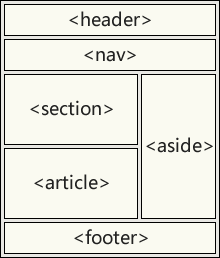

### 基本文档

```react
<html>
<head>
  <title>文档标题</title>
</head>
<body>
  Visible text goes here
</body>
</html>
```

----
### 文本元素  
```react
<p>段落</p>
<br>  换行
<hr>  水平线
<pre>预格式化了的文本</pre>
```

----
### 实体样式
```react
<b>加粗</b>
<i>斜体</i>
```

----
### 链接与锚  
```react
<a href="http://www.example.com/">链接提示</a>

<a href="http://www.example.com/"></a>

<a name="tips">目的地</a>
<a href="#tips">按我起飞</a>

<a href="mailto:webmaster@example.com">Send e-mail</a>A named anchor:
```

:snowflake: 跳转网页（绝对路径）时，需要在值的最后加上 `/`。  


### 列表

#### 无序列表  

```react
<ul>
    <li>第一项</li>
    <li>第二项</li>
</ul>
```

----
#### 有序列表  
```react
<ol>
    <li>第一项</li>
    <li>第二项</li>
</ol>
```

----
#### 定义列表  
```react
<dl>
    <dt>第一项</dt>
        <dd>定义内容</dd>
    <dt>第二项</dt>
        <dd>定义内容</dd>
</dl>
```

----
### 表格    
> 如果不定义边框属性，表格将不显示边框。
```react
<table border="1">
<tr>
    <th>标题一</th>
    <th>标题二</th>
</tr>
<tr>
    <td>一些内容</td>
    <td>一些内容</td>
</tr>
</table>
```

 标签 | 说明
 :-: | :-: 
 <table\> | 定义表格
 <tr\> | 定义表格行
 <th\> | 定义表头，可选
 <td\> | 定义单元格

 属性 | 使用标签 | 说明
 :-: | :-: | :-: 
 cellpadding | <table\> | 增加各单元格的内边距
 cellspacing | <table\> | 增加各单元格边框间的间距
 width | <table\> | 规定表格的总宽度
 align | <table\>、<tr\>、<td\> | 规定表格单元内容的排列顺序  
 frame | <table\> | 规定围绕表格的边框

:herb: 对表格添加样式 `border-collapse: collapse;` 规定将表格边框折叠为单一边框，更多样式可以[查阅文档](https://www.w3school.com.cn/css/css_table.asp)。  

----
### 表单

  标签 | 功能 | 说明
  :-: | :-: | :-: 
  <form\> | 定义表单 | 必填
  <fieldset\> | 组合表单中的相关数据 | 可选
  <legend\> | 为 `<fieldset>` 定义标题 | 可选
  <input type="text"\/> | 定义用于文本输入的单行输入字段 | `value` 定义默认文字
  <input type="radio"\/> | 定义单选按钮输入 | 同处单选按钮的 `name` 相等，需设置 `value` 用于提交
  <input type="checkbox"\/> | 定义复选框 | 同处复选框的 `name` 相等，需设置 `value` 用于提交
  <input type="submit"\/> | 定义用于向**表单处理程序**提交表单的按钮 | `value` 定义默认文字
  <input type="password"\/> | 定义密码字段 | 字段中的字符会被做掩码处理
  <input type="reset"\/> | 定义表单重置 | /
  <select\>| 定义下拉列表 | 该处规定 `name` 属性
  <option\> | 定义下拉列表中待选择的选项 | 该处规定 `value` 属性
  <textarea\> | 定义多行输入字段 | 标签中的文本为默认文字，`rows` 和 `cols` 可以定义文本框大小
  <button type="button"\> | 定义可点击的**按钮** | 经常添加 `onclick` 属性
  <button type="submit"\> | 定义提交表单的按钮 | 默认值
  <button type="reset"\> | 定义表单重置 | /

HTML5 增加了多个新的[输入类型](https://www.w3school.com.cn/html/html_form_input_types.asp)，用于图形化给用户提供选择颜色、日期等选项，可以添加属性进行输入限制并进行验证。

 属性 | 使用标签 | 说明 | 版本
 :-: | :-: | :-: | :-: 
 action | <form\> | 指定表单的处理程序 | /
 method | <form\> | 规定在提交表单时所用的 HTTP 方法（GET 或 POST） | /
 target | <form\> | 规定提交表单后在何处显示响应 | /
 novalidate | <form\> | 布尔属性，规定提交时是否应验证表单数据 | HTML5 
 name |  所有表单元素 | **如果表单元素需要提交**，必须设置一个 name 属性 | /
 selected | <option\> | 布尔属性，定义预定义选项 | /
 value | <input\>等 | 规定输入字段的初始值 | /
 readonly | <input\> | 布尔属性，规定输入字段为只读 | /
 disabled | <input\> | 布尔属性，规定输入字段是禁用的，不会被提交 | /
 size | <input\> | 规定输入字段的尺寸（以字符计） | /
 maxlength | <input\> | 规定输入字段允许的最多数量 | /
 autocomplete | <input\>、<form\> | 值为 `on` 时规定根据用户之前输入的值自动填写值 | HTML5 
 autofocus | <input\> | 布尔属性，规定当页面加载时 `<input>` 应该自动获得焦点 | HTML5 
 form | <input\> | 规定 `<input>` 所属的一或多个表单，可位于表单之外。需要 `<form>` 中有对应的 `id` | HTML5 
 formaction | <input type="submit" type="image"\> | 规定提交表单时处理该输入控件的文件的 URL，将覆盖 `<form>` 的 action | HTML5 
 formmethod | <input type="submit" type="image"\> | 规定提交表单时发送表单数据的 HTTP 方法，将覆盖 `<form>` 的 method | HTML5 
 formnovalidate | <input type="submit"\> | 布尔属性，规定提交表单时不对 `<input>` 进行验证，将覆盖 `<form>` 的 novalidate | HTML5 
 formtarget | <input type="submit" type="image"\> | 规定提交表单后在何处显示接收到的响应，将覆盖 `<form>` 的 target | HTML5 
 height、width | <input type="image"\> | 规定 <input> 元素的高度和宽度，防止图片加载时页面闪烁 | HTML5 
 list | <input\> | list 属性引用的 `<datalist>` 中包含了 `<input>` 的预定义选项 | HTML5 
 min、max | some <input\> | 规定 `<input>` 元素的最小值和最大值 | HTML5 
 multiple | <input type="email" type="file"\> | 布尔属性，允许用户在 `<input>` 元素中输入一个以上的值 | HTML5  
 pattern | some <input\> | 规定用于检查 <input> 元素值的正则表达式，添加 `title` 提示用户 | HTML5  
 placeholder | some <input\> | 规定用以描述**输入字段预期值的提示** | HTML5  
 required | some <input\> | 布尔属性，规定在提交表单之前必须填写输入字段 | HTML5   
 step | some <input\> | 规定 `<input>` 的合法数字间隔可与 `max` 以及 `min` 属性一同使用 | HTML5   

**<datalist\>**  
> HTML5 添加。为 `<input>` 元素规定预定义选项列表， `<input>` 的 list 属性必须引用 `<datalist>` 的 id 属性，在 `<datalist>`内部使用 `<option>`来添加预定义选项。  

```react
<form action="action_page.php">
<input list="browsers">
<datalist id="browsers">
   <option value="Internet Explorer">
   <option value="Firefox">
   <option value="Chrome">
   <option value="Opera">
   <option value="Safari">
</datalist> 
</form>
```

----
### 字符实体  

符号|a
 :-: | :-: 
<|&lt  
\>|&gt  
©|&#169  
空格|$nbsp;  

----
### 框架  
```react
<frameset cols="25%,75%">
    <frame src="页面1.htm">
    <frame src="页面2.htm">
</frameset>
```

----
### 逻辑样式
```react
<em>强调的部分</em>    // 表现为斜体
<strong>强的语气</strong>  // 表现为加粗
<code>computer code</code>
```

----
### 其他元素
```react
<!-- 一些备注 -->
<blockquote>引用的内容</blockquote>
```


## HTML5  

> HTML5 是跨平台的，被设计为在不同类型的硬件（PC、平板、手机、电视机等等）之上运行。
> 
> HTML5 中默认的字符编码是 UTF-8。  

#### 新特性  

索引 | 特性
:-: | :-:
Ⅰ | 用于绘画的canvas元素
Ⅱ | 新的表单控件
Ⅲ | 用于媒介的video和audio元素
Ⅳ | 地理定位
Ⅴ | 拖放
Ⅵ | Web存储
Ⅶ | 应用程序缓存
Ⅷ | Web Workers
Ⅸ | 服务器发送事件
拾 | WebSocket
.. | 新的语义元素

#### 被删元素  

标签 | 说明  
:-: | :-:
<acronym\> | 定义首字母缩写 
<applet\> | 定义 applet  
<basefont\> | / 
<big\> | 定义大号文本，`<small>` 仍支持  
<center\> | 定义居中的文本  
<dir\> | 定义目录列表  
<font\> | /   
<frame\> | 定义子框架  
<frameset\> | 定义框架的集  
<isindex\> | 定义单行的输入域  
<noframes\> | 定义 noframe 部分  
<strike\> | 定义加删除线的文本  
<s\> | 定义加删除线的文本
<tt\> | 定义打字机文本
<u\> | 定义下划线文本
<xmp\> | 定义预格式文本 

#### 语义元素  

标签 | 描述
:-: | :-:
<article\> | 定义文章。
<aside\> | 定义 **页面内容以外** 的内容（比如侧栏）。
<details\> | 定义用户能够查看或隐藏的额外细节。
<figcaption\> | 与图像被包含在 `<figure>` 中，定义标题。
<figure\> | 规定自包含内容，比如图示。
<footer\> | 定义文档或节的页脚。
<header\> | 规定文档或节的页眉。
<main\> | 规定文档的主内容。
<mark\> | 定义重要的或强调的文本。
<nav\> | 定义导航链接。
<section\> | 定义文档中的节（有主题的内容组）
<summary\> | 定义 `<details>` 元素的可见标题。
<time\> | 定义日期/时间。



#### HTML5[新元素](https://www.w3school.com.cn/html/html5_new_elements.asp)等  

#### 拖放  

事件 | 描述
:-: | :-
dragstart | 元素被拖动时触发
dragover | 规定被拖动的数据能够被放置到何处，默认数据/元素无法放置到其他元素
drop | 当放开被拖数据时触发

1、给需要拖放的元素添加 `draggable="true"`。  

2、元素被拖动时的回调参数上有一个 `dataTransfer.setData()` 方法，参数：
  - 被拖动数据的记录命名  
  - 可拖动元素的 id

3、在规定被拖动的数据能够被放置到何处的事件中，阻止默认行为。  

4、拖动结束时，进行放置  
  - 阻止默认行为（链接形式打开）
  - 通过 `dataTransfer.getData()` 方法获得被拖的数据  
  - 将被拖元素追加到放置元素中  

```react
<div id="div1" ondrop="drop(event)" ondragover="allowDrop(event)"></div>
 
    
function allowDrop(ev) {
  ev.preventDefault();
}

function drag(ev) {
  ev.dataTransfer.setData("myText", ev.target.id);
}

function drop(ev) {
  ev.preventDefault();
  var data = ev.dataTransfer.getData("myText");
  ev.target.appendChild(document.getElementById(data));
} 
```

#### 画布
> canvas 元素用于在网页上绘制图形。  
> 
> canvas 元素本身是没有绘图能力的。所有的绘制工作必须在 **JavaScript** 内部完成。  

简略步骤

顺序 | 说明 | 示例
:-: | :-: | :-
① | 创建 Canvas 元素 | `<canvas id="myCanvas" width="200" height="100"></canvas>`
② | JS 通过 id 获取元素 | `var c=document.getElementById("myCanvas");`
③ | 创建 context 对象 | `var cxt=c.getContext("2d");`

#### SVG  
> 指 **可伸缩** **矢量** 图形。   
> 
>  使用 **XML** 格式定义图形，在放大或改变尺寸的情况下其图形质量不会有损失。  

#### 画布和SVG  

Canvas 
:-
通过 JS 来绘制 
逐像素进行渲染 
绘制完成后不被浏览器关注。位置变化需重新绘制整个场景 

SVG 
:-
使用 XML 描述
SVG DOM 中的每个元素都支持事件处理程序
如果 SVG 对象的属性发生变化，那么浏览器能够自动重现图形

Canvas
- 依赖分辨率
- 不支持事件处理器
- 弱的文本渲染能力
- 能够以 .png 或 .jpg 格式保存结果图像
- 最适合图像密集型的游戏，其中的许多对象会被频繁重绘
  

SVG
- 不依赖分辨率
- 支持事件处理器
- 最适合带有大型渲染区域的应用程序（比如谷歌地图）
- 复杂度高会减慢渲染速度（任何过度使用 DOM 的应用都不快）
- 不适合游戏应用
  
#### 地理定位  
> 通过 `getCurrentPosition()` 方法来获得用户的位置。

#### 本地存储  
> 能够将应用程序数据存储在本地（Local Storage），而不会被传输到服务器。  
> 
> 键值对始终存储为**字符串**。

对象 | 说明
:-: | :-:
window.localStorage | 当用户通过浏览器清理时删除
window.sessionStorage | 关闭标签页时删除数据

```react
// 存储的两种方式
localStorage.setItem("lastname", "Gates");
localStorage.lastname = "Gates";

// 取回的两种方式
let x = localStorage.getItem("lastname");
let x = localStorage.lastname;

// 移除
localStorage.removeItem("lastname"); 
```

#### 应用程序缓存  
> 可对 web 应用进行缓存，并可离线访问。  
> 
> 需要在 HTML 文档通过 `manifest` 属性引入文件。  


优势  
    
1. 离线浏览  
2. 已缓存资源加载得更快  
3. 减少服务器负载

```react
<!DOCTYPE HTML>
<html manifest="demoName.appcache">
...
</html> 
    
/* manifest 文件 */
    
CACHE MANIFEST
# 2012-02-21 v1.0.0
/theme.css
/logo.gif
/main.js

NETWORK:
login.asp

FALLBACK:
/html/ /offline.html
```

要点 | 说明
:-: | :-:
CACHE MANIFEST | 首次下载后进行缓存的文件
NETWORK | 不会被缓存，需要与服务器连接的文件
FALLBACK | 页面无法访问时的回退页面  
\* | 指示所有**其他**文件  
`/html/` | 指向被替代目录（资源）  
`/offline.html` | 替补文件
\# | 注释行
更新缓存 | 可以通过修改注释行，即更改 manifest 文件来使浏览器重新缓存

#### Web_Workers   
> 它是运行在后台的 JS。独立于其他脚本，不会影响页面的性能。  

简略步骤

顺序 | 说明 | 示例
:-: | :- | :-
① | 创建文件 | 文件为 `.js` 类型，通过 `postMessage()` 向页面传回数据
② | 对象是否存在 | `if (typeof(w) == "undefined") {...}`
③ | 创建对象并调用 | `w = new Worker("demo_workers.js")`
④ | 接收消息 | 该对象的 `onmessage` 的回调参数，即事件对象上的 `data` 接收数据
⑤ | 终止 | `w.terminate()`  
⑥ | 复用 | `w = undefined`  

#### Server_Sent事件 
> Server-Sent 事件指的是网页自动从服务器获得更新。  

顺序 | 说明 | 示例
:-: | :-: | :-
① | 能力检测 | `if(typeof(EventSource) !== "undefined") {}`
② | 创建对象 | `var source = new EventSource("demo_sse.php");`
③ | 接收消息 | 该对象的 `onmessage` 的回调参数，即事件对象上的 `data` 接收数据  

#### 新增表单输入类型  
> 通过 `<input>` 标签的 `type` 属性进行定义。    

HTML5 | 值 | 描述 | 功能
:-: | :- | :- | :-
√ | number | 限制输入值为数字 | 验证
√ | tel | 限制为电话号码 | 仅 Safari 8 支持
√ | email | 限制为邮件地址 | 验证 
√ | url | 限制为网址 | 验证
√ | search | 搜索字段 | 历史记录、清空 
√ | range | 滑块控件 | /
√ | color | 颜色选择器 | / 
√ | date | 日期选择器，年月日 | /
√ | month | 日期选择器，年月 | /    
√ | week | 日期选择器，年周 | /   
√ | time | 时间选择器（无时区），时分 | /  
√ | datetime | 日期选择器（有时区），日期和时间 | IE、FF、Chrome不支持  
√ | datetime-local | 日期选择器（无时区），日期和时间 | IE、FF不支持  
× | text | 单行文本输入字段 | /    
× | radio | 单选按钮 | /  
× | checkbox | 复选框 | /  
× | submit | 表单处理程序提交按钮 | /  
× | password | 密码字段 | / 
× | reset | 表单重置按钮 | / 

#### 新的表单元素  

标签 | 描述 
:- | :- 
`<datalist>` | 定义输入控件的预定义选项
`<keygen>` | 定义键对生成器字段（用于表单）
`<output>` | 定义计算结果


## 部分事件属性参考

#### Window事件  

> 针对 window 对象触发的事件，将应用到 `<body>` 上。  

属性 | 触发时机
:- | :- 
onerror | 发生错误时
onload | 页面加载完成后
onbeforeunload | 文档卸载前
onresize | 浏览器窗口被调整大小时

#### 表单事件  
> 由 HTML 表单内的动作触发的事件。  
> 
> 应用到几乎所有 HTML 元素，但最常用在 form 元素中。  

属性 | 触发时机 | 补充
:- | :- | :- 
onsubmit | 提交表单时 | /
onfocus | 元素获得焦点时 | /
onblur | 元素失去焦点时 | /
onchange | 元素值被改变时 | /
oninput | 元素获得用户输入时 | / 
oninvalid | 元素无效时 | /   
onreset | 点击重置按钮时 | HTML5 不支持  
onselect | 元素中文本被选中后 | / 

#### 键盘事件  

属性 | 触发时机
:- | :- 
onkeydown | 用户按下按键时
onkeypress | 用户敲击按钮时
**onkeyup** | 用户释放按键时

#### 鼠标事件 

属性 | 触发时机
:- | :- 
onclick | 鼠标点击元素时
ondblclick | 鼠标双击元素时   
onmousemove | 指针移动到元素上时
onmouseover | 指针移动到元素上时
onmousedown | 在元素上按下鼠标时
onmouseup | 在元素上释放鼠标时
onmouseout | 指针移出元素时
onmousewheel | 鼠标滚轮滚动时
onscroll | 元素滚动条被滚动时    
ondrag | 元素被拖动时
ondragover | 元素在有效拖放目标上拖动时
ondragstart | 拖动操作开端
ondrop | 被拖元素正在被拖放时

 

## 其它

### 脚本 的 defer 和 async

> html5 中的新属性

1.默认引用 script:

```html
<script src="script.js"></script>
```

当浏览器遇到 script 标签时，文档（HTML）的解析将停止，并立即下载并执行脚本，脚本执行完毕后再继续解析文档。

2.async模式 

```html
<script async src="script.js"></script>
```

当浏览器遇到 script 标签时，文档的解析不会停止，将由其他线程下载脚本。脚本下载完成后开始执行脚本，此时文档将停止解析，直到脚本执行完毕。

3.defer模式

```html
<script defer src="myscript.js"></script>
```

当浏览器遇到 script 标签时，文档的解析不会停止，将由其他线程下载脚本。待到文档解析完成，脚本才会执行。


蓝色线代表网络读取，红色线代表执行时间，这俩都是针对脚本的；绿色线代表 HTML 解析。


#### 总结

<span style="color: #f7534f;font-weight:600">原生</span> 浏览器在遇到script标签的时候，文档的解析会停止，不再构建document，有时打开一个网页上会出现空白一段时间，会给用户很不好的体验。

<span style="color: #f7534f;font-weight:600">defer</span> 异步加载脚本，等到整个页面正常渲染结束，才会执行；

<span style="color: #f7534f;font-weight:600">async</span> 异步加载脚本，一旦下载完成会立即执行，此时会中断渲染；

:ghost: 如果有多个 defer 脚本，会按照它们在页面出现的顺序加载；而多个 async 脚本是<span style="color: #ff0000">不能保证加载顺序</span>的（指script 标签在页面中的顺序）

:whale: 如果脚本并不关心页面中的DOM元素（文档是否解析完毕），并且也不会依赖/被依赖其他脚本，可以考虑 **async**。


