## 布局相关

#### 未知数量元素的多行规律排列    

> 当元素需要多行规律排列，且最后一行的元素数量不确定时，使用 [Grid](https://github.com/SpringLoach/origin-2021/blob/happy-day/css/样式速查表.md#网格属性) 布局可以轻松实现该效果。  

```css
.container {
  display: grid;
  grid-template-columns: 25% 25% 25%;
  justify-content: space-evenly;
  grid-row-gap: 10px;
  text-align: center;
  margin-bottom: 20px;
}
.container .item img {
  width: 100%; 
}
```

### 弹性布局

##### 已知数量元素的多行规律排列  

> 每一行的元素数量都是确定的。  

```css
.container {
  display: flex;
  flex-wrap: wrap;
  justify-content: space-around;  // space-evently 可以达到间隙均等效果，有兼容性问题
  padding: 3px;
}
.container .item {
  width: 48%;
}
```

##### 未知数量元素的单行均匀排列  

```css
.father { display: flex; }
.father .all-son { flex: 1; }
```

##### 单行中某元素占据剩余宽度    

```css
.father { display: flex; }
.father .specil-son { flex: 1; }
```

##### 单行中两端对齐   

```css
.father {
  display: flex;
  justify-content: space-between;
}
```

##### 单行中两元素固定占比  
```css
.container { display: flex; }
.container .left { width: 25%; }
.container .right { width: 75%; }
```


##### 使项目在容器的中间对齐  

```css
.father { 
  display: flex; 
  align-items: center;
  justify-content: center;
}
```

##### 为justify-content配置兼容的space-evenly

```css
.container {
  display: flex;
  justify-content: space-between;
}
.container::after, .container::before {
  content: '';
  display: block;
}
```

##### 模拟grid布局

> 模拟一行三项两端对齐，且两项时由左往右开始排。

```less
.feature-list {
  display: flex;
  flex-wrap: wrap;
  width: 100%;
  & span {
    display: inline-block;
    width: 30%;
    margin-right: 5%;
    border: 1px solid #f0f0f0;
  }
  & span:nth-child(3n) {
    margin-right: 0;
  }
}
```


##### 占据剩余宽度

> 通过给弹性项目添加 flex: 1，可以使得该项目变得规矩（内容超长时自动换行，而不挤压其它项目）。


```less
.item-row {
  display: flex;
}
.item-row .row-label {
  margin-right: 60rpx;
}
.item-row .row-value {
  flex: 1;
}
```


### 图片相关

#### 消除图片下默认的3px  

> 似乎也能对行内元素起作用。  

```css
.any img { vertical-align: middle; }
```

#### 在不具体宽度下，设置图片的长宽比  

```css
.picbox {
  position: relative;
}
.picbox::before {
  content: "";
  display: block;
  padding-top: 150%; // 调长宽比
}
.picbox img {
  width: 100%;
  height: 100%;
  position: absolute;
  top: 0;
  left: 0;
}
```

#### 设置固定顶部的导航栏  

```css
position: fixed;
left: 0;  
right: 0;  // 占据全宽
top: 0;
```

#### line-hight  
> 可以设置高等与行高来实现元素的垂直水平，但需要注意行高的继承性，会对子元素的垂直布局产生影响。感觉完全可以用 flex 布局替代吧。    

#### 拟造箭头  

> 通过 `>` 构造。注意行内元素不能变换，如果需要旋转，需将其设置为行内块。  
```css
.arrow {
  font-family: serif;
  font-weight: 900;
}

<span class="arrow">><span>
```

> 边框旋转实现。  
```css
.arrow {
  display: inline-block;
  height: 10px;
  width: 10px;
  border-color: #000;
  border-style: solid;
  border-width: 0 0 2px 2px;
  transform: rotate(45deg);
}

<span class="arrow"></span>
```

#### 给图像添加圆形效果

```css
.info-left img{
  border-radius: 50%;
  padding: 10px;  // 控制图像与边界的距离  
}
```

#### 给文字设置省略效果  

```css
/* 要有一个宽度 */
.info p {
  white-space: nowrap; 
  overflow: hidden;
  text-overflow: ellipsis;
}
```

#### 采用居中布局的选项

```css
.where {
  text-align: center;
}
.where .option {
  display: inline-block;
  background-color: #f2f5f8;  // 视觉效果
  padding: 5px 30px;
  border-radius: 10px;
}
```

#### 简单的自设计装饰效果  

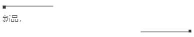

```css
<div class="info-desc clearfix">
  <div class="start"></div>
  <p>some text..</p>
  <div class="end"></div>
</div>

.info-desc .start, .info-desc .end {
    width: 25vw;
    height: 2px;
    background-color: #a3a3a5;
    position: relative;
}
.info-desc .start {
    float: left;
}
.info-desc .end {
    float: right;
}
.info-desc .start::before,.info-desc .end::after {
    content: "";
    background-color: #333;
    height: 5px;
    width: 5px;
    position: absolute;
}
.info-desc .end::after {
    right: 0;
    bottom: 0;
}
.clearfix::after {
  content: "";
  clear: both;
  display: table;
}
```

#### table  

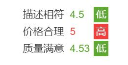

```css
.box {text-align: center;}
.box table {
    display: inline-block;
    text-align: start;
}
```

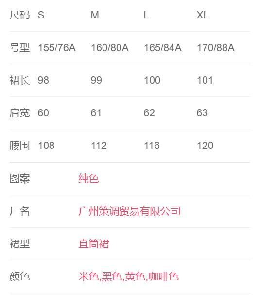

```css
.table-box {
  padding: 10px 15px 0;
  font-size: 14px;
  border-bottom: 5px solid #f2f5f8;
}
.table-box table {
  width: 100%;           // 使表格占据全部宽   
  border-collapse: collapse;
}
.table-box table tr td {
  padding: 14px 0;
  border-bottom: 1px solid rgba(100,100,100,.1);
}
table .first-td {
  /* 当 value 的数据量比较大的时候, 会挤到 key ，所以给一个固定的宽度，视觉上也更美观 */
  width: 95px;
}
```

#### 去除列表的默认缩进  

```css
*{box-sizing: border-box; margin: 0; padding: 0;}
```

#### 去除按钮的默认轮廓

```css
button {border: none;}
```

#### 按钮的玄学居中  
> 按钮自身为弹性项目且弹性框：`justify-content: space-between`。并不[玄](#使项目在容器的中间对齐)。

----

### 临时  

#### 子相对父居中

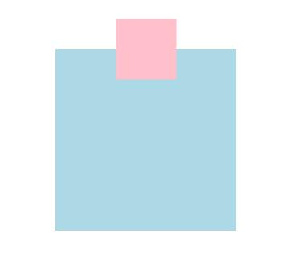

```css
.father {
  position: relative;
}
.son {
  position: absolute;
  left: 50%;
  transform: translate(-50%, -50%);
}
```
#### 圆中圆

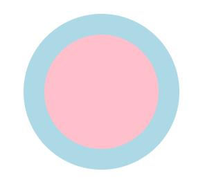

```css
.father {
  width: 150px;
  height: 150px;
  background-color: lightblue;
  border-radius: 50%;
  padding: 20px;
}
.son {
  width: 100%;
  height: 100%;
  background-color: pink;
  border-radius: 50%;
}
```

#### 去除表单默认聚焦轮廓  

```css
:focus {
  outline: none;
}
```

#### 表单增加图标  
> 用一个 `div` 块将表单元素包围，利用子绝父相控制图标位置，给表单元素添加内边距。  

#### 圆边接壤  

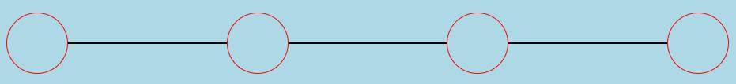

```css
.big-box {
  display: flex;
  align-items: center;
}
.span1 {
  width: 50px;
  height: 50px;
  border: 1px solid red;
  border-radius: 50%;
}
.span2 {
  flex: 1;
  background: black;
  height: 1px;
}

<div class="big-box">
  <span class="span1"></span><span class="span2"></span>
  <span class="span1"></span><span class="span2"></span>
  <span class="span1"></span><span class="span2"></span>
  <span class="span1"></span>
</div>
```

#### 三角形  
> 沿中心点向四周发散四个三角形的思想，需要四条边都存在。  

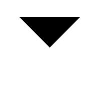

```css
.any::after {
  content: ' ';
  display: inline-block;
  border-width: 40px;
  border-style: solid;
  border-color: black transparent transparent transparent;
}  
```

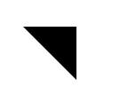

```css
.any::after {
  content: ' ';
  display: inline-block;
  border-width: 40px;
  border-style: solid;
  border-color: black transparent transparent transparent;
  border-right: 0;
}  
```

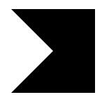

```css
.any::after {
  content: ' ';
  display: inline-block;
  border: 40px solid black;
  border-left-color: transparent; 
} 
```
> 直接设置 `border-left: transparent;` 相当于重置宽和样式。  


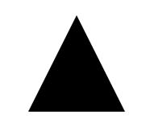

```css
.any::after {
  content: ' ';
  display: inline-block;
  border-width: 40px;
  border-bottom-width: 80px;
  border-style: solid;
  border-color: transparent transparent  black transparent;
} 
```
> 高等于底边  

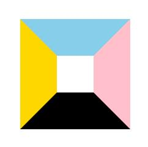

```css
.any::after {
  content: ' ';
  height: 40px;
  width: 40px;
  display: inline-block;
  border-width: 40px;
  border-style: solid;
  border-color: skyblue pink  black gold;
} 
```

#### 多行溢出  
> 该方案适合于使用 `webkit` 内核的浏览器，大部分手机都能实现。  

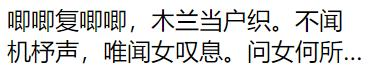

```css
.anything {
  overflow: hidden;
  display: -webkit-box;
  -webkit-box-orient: vertical;
  -webkit-line-clamp: 2;
}
```

#### 单行溢出  

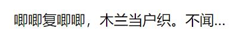

```css
.anything {
  white-space: nowrap;
  text-overflow: ellipsis;
  overflow: hidden;
}
```

#### 两边间隙块元素居中对齐

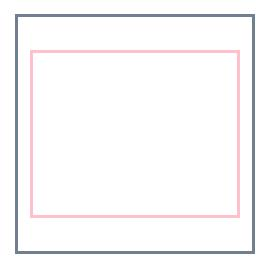

```css
.content_wrap {
  width: 10rem;
  height: 10rem;
  border: 2px solid slategrey;
  display: flex;
  justify-content: center;
  align-items: center;
}
.content {
  width: 90%;
  height: 7rem;
  border: 2px solid pink;
}
```

#### 纵向弹性_两端等间距

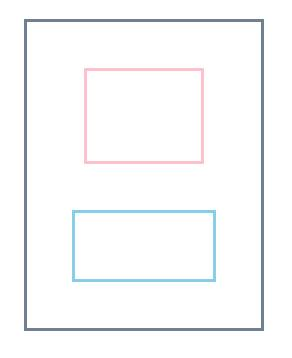

```css
.father {
  width: 10rem;
  height: 13rem;
  border: 2px solid slategrey;
  display: flex;
  flex-direction: column;
  justify-content: space-evenly;
  align-items: center;
}
.son1 {
  width: 5rem;
  height: 4rem;
  border: 2px solid pink;
}
.son2 {
  width: 6rem;
  height: 3rem;
  border: 2px solid skyblue;
}
```

#### 纵向弹性_贴两端

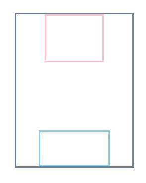

```css
.father {
  width: 10rem;
  height: 13rem;
  border: 2px solid slategrey;
  display: flex;
  flex-direction: column;
  justify-content: space-between;
  align-items: center;
}
.son1 {
  width: 5rem;
  height: 4rem;
  border: 2px solid pink;
}
.son2 {
  width: 6rem;
  height: 3rem;
  border: 2px solid skyblue;
}
```

#### 纵向弹性_两端半距  
> 在上例基础上设置 `justify-content: space-around;`。  

#### 纵向弹性_起始靠左    
> 在上上例基础上删除 `align-items: center;`。

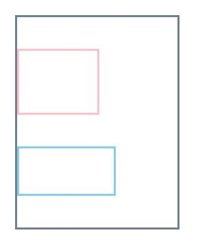

#### 底部工具栏  

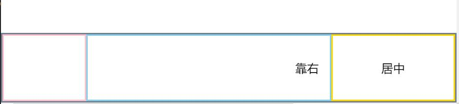

```css
.father {
  display: flex;
  position: fixed;
  bottom: 0;
  left: 0;
  right: 0;
  height: 6rem;
  border: 2px solid slategrey;
}
.son1 {
  flex: 2;
  border: 2px solid pink;
}
.son2 {
  flex: 6;
  border: 2px solid skyblue;
  position: relative;
}
.son2 p {
  position: absolute;
  top: 50%;
  right: 0;
  transform: translate(0, -50%);
  padding-right: 15px;
}
.son3 {
  flex: 3;
  border: 2px solid gold;
  display: flex;
  justify-content: center;
  align-items: center;
}
```

#### 底部工具栏2
> 对上例的第二个弹性项样式进行修改。  

```css
.son2 {
  flex: 6;
  border: 2px solid skyblue;
  display: flex;
  justify-content: flex-end;
  align-items: center;
  padding-right: 15px;
}
```

#### 底部工具栏优化  
> 直接对第二个弹性项添加内边距时，会造成各个弹性项宽度的改变。  

```react
<div class="son2"><p>靠右&nbsp;&nbsp;</p></div>
```

#### 弹性任意格子换行置左  

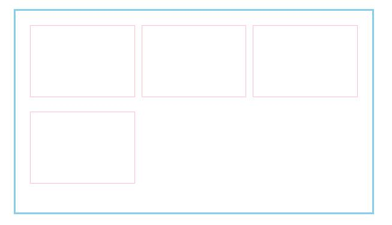

```css
.father {
  border: 2px solid skyblue;
  width: 25rem;
  display: flex;
  flex-wrap: wrap;
  padding: 1rem;  /* 适当增加 */
}
.son {
  border: 1px solid pink;
  width: 32%;
  height: 5rem;
  margin-bottom: 1rem;
}
.father .son:nth-child(3n+2) {
  margin: 0 2%;
}
```

#### 顶部导航栏A
> 可以通过弹性布局，设置弹性项为 `flex: n` 来控制占宽比例。  
> 
> 通过设置容器 `display: flex; align-items: center;` 与图片的 `margin-left: 2rem;` 控制图片位置。

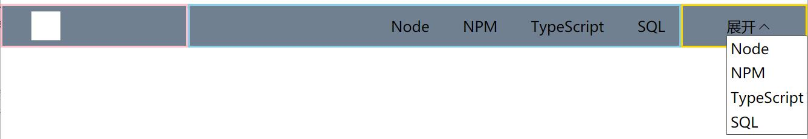

```react
<header>
  <div class="header_left">
    <div class="a_img"></div>
  </div>
  <div class="header_middle">
    <ul>
      <li>Node</li>
      <li>NPM</li>
      <li>TypeScript</li>
      <li>SQL</li>
    </ul>
  </div>
  <div class="header_right">
    <div class="list_btn">
      <span>展开</span>
      <span>></span>
      <!-- 因为要相对按钮定位，故放到按钮所在容器 -->
      <ul> 
        <li>Node</li>
        <li>NPM</li>
        <li>TypeScript</li>
        <li>SQL</li>
      </ul>
    </div>
  </div>
</header>

header {
  height: 3rem; 
  background-color: slategrey;
  display: flex;
  .header_left {
    flex: 3;
    border: 2px solid pink;
    display: flex;
    align-items: center;
    .a_img {
      width: 2rem;
      height: 2rem;
      background-color: #fff;
      margin-left: 2rem;
    }
  }
  .header_middle {
    flex: 8;
    border: 2px solid skyblue;
    display: flex;
    align-items: center;
    justify-content: flex-end; // 从右开始排列
    ul {
      list-style: none;
      li {
        display: inline-block;
        padding: 0 1rem;
      }  
    }
  }
  .header_right {
    flex: 2;
    border: 2px solid gold;
    display: flex;
    align-items: center;
    position: relative;
    .list_btn {
      padding-left: 3rem;  // 这个属性若直接加到父元素上，会挤压其它弹性项
      & span:nth-child(2) {
        display: inline-block; 
        transform: rotate(90deg);  // 不对行内元素生效
        font-family: serif;
        font-weight: 700;
        transition: all 0.3s;
      }
      ul {
        display: none;
        list-style: none;
        position: absolute;
        z-index: 1;
        border: 1px solid #555;
        background-color: #fff;
        li {
          padding: 0.2rem;  
        }  
      }
    }
    &:hover span:nth-child(2) {
      transform: rotate(270deg);
    }
    &:hover ul {
      display: block;
    }
  }
}
```


