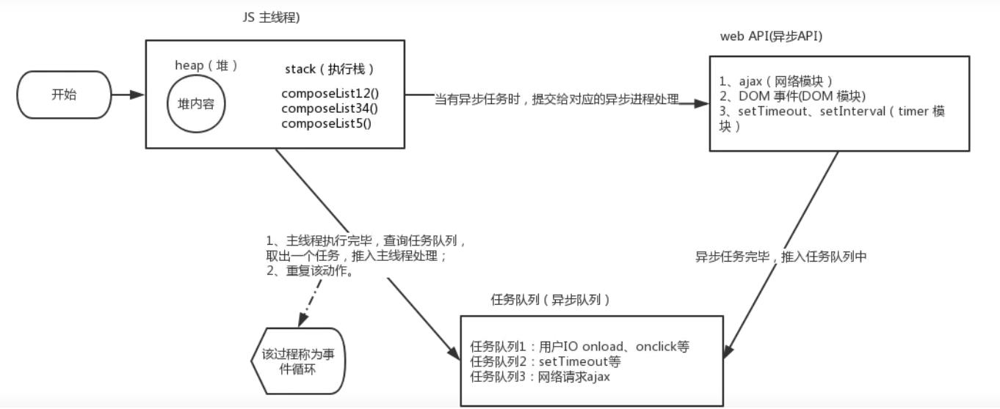
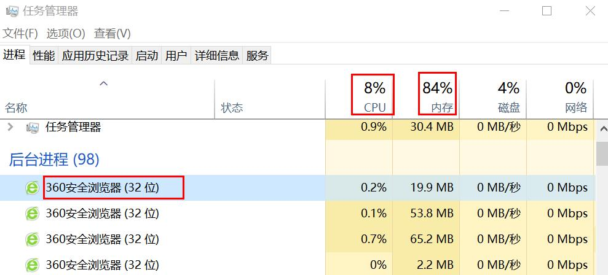
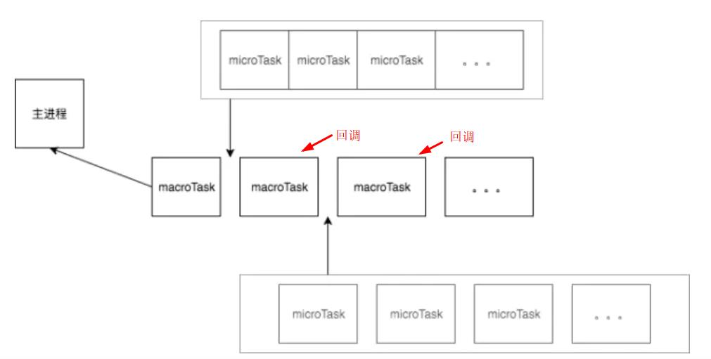

## section1


### js的运行机制  

#### js是一门单线程语言
> 单线程是指Js引擎执行Js时只分了一个线程给他执行，也就是执行js时是单线程的，同一时间做一件事情。  

#### 运行环境
> 一般在node或者浏览器下。  


#### 任务队列
> 所有任务可以分成两种，一种是同步任务，另一种是异步任务。  
> 
> 同步任务：在主线程上排队并按顺序执行的任务。形成一个执行栈。   
> 
> 异步任务：首先不进入主线程，提交给对应的异步进程处理，待处理完毕后，就会将其回调（如果有）推送到任务队列中。当主线程的同步任务执行完毕后，
> 系统就会读取任务队列，将任务队列的首个任务推到主线程的执行栈中执行。


### 事件循环机制



处理主线程的整体代码，然后检查是否存在 Microtasks 并将其清空，最后更新 render。

在事件循环中，每进行一次循环操作称为 tick：
> 选择最先进入任务队列的任务，将其推入主线程并执行，检查是否存在 Microtasks 并将其清空，更新 render。

### 宏任务与微任务

macrotask
> 每次执行栈执行的代码就是一个宏任务（包括每次从事件队列中获取**一个**事件回调并放到执行栈中执行）。

宏任务包括
:-
script(整体代码)、setTimeout、setInterval、I/O、UI交互事件、setImmediate(Node.js 环境)

microtask
> 在当前宏任务执行结束后立即执行的任务。  

微任务包括
:-
Promise.then、Object.observe、MutaionObserver、process.nextTick(Node.js 环境)

#### 简单的宏任务与微任务执行顺序
```react
console.log('begin')

setTimeout(() => {  
    console.log('setTimeout')
}, 0);

new Promise(function(resolve, reject) {
    console.log('promise');
    resolve();
}).then(function() {
    console.log('promise then');
});

console.log('end');

执行顺序：begin → promise → end → promise then → setTimeout
```
:herb: 推测如果在宏任务和微任务中有渲染相关的代码，会将其储存起来。等到 JS 引擎空闲时（停止执行）由 GUI 渲染线程负责渲染页面。   
:snowflake: 由于 setTimeout 需要被异步进程处理，然后添加到任务队列中，所以它的回调会被会被当作非首个的宏任务处理。   


> 异步过程的回调函数，一定不在当前这一轮事件循环中执行。


## section2

### 区分进程与线程  

形象比喻
> 进程是一个工厂，工厂有它的独立资源、工厂之间相互独立；线程是工厂中的工人，工厂内有一个或多个工人、多个工人协作完成任务、工人之间共享空间。  

打开任务管理器，可以看到后台进程列表，可以看到每个进程的内存资源信息以及 cpu 占有率。



- 进程是 cpu 资源分配的最小单位（是能拥有资源和独立运行的最小单位）

- 线程是 cpu 调度的最小单位（线程是建立在进程的基础上的一次程序运行单位，一个进程中可以有多个线程）

- 现在的叫法，单线程与多线程，前提都是在一个进程。  

### 浏览器是多进程的  
> 浏览器之所以能够运行，是因为系统给它的进程分配了资源（cpu、内存）。它会有一个主进程，以及每个标签页都有一个独立的进程。  

:cyclone: 由于浏览器有自己的优化机制等，不一定一个标签页就对应一个进程。  

### 为什么JavaScript必须是单线程
> 作为浏览器脚本语言，JS 的主要用途是与用户互动，以及操作 DOM。这决定了它只能是单线程，否则会带来很复杂的同步问题。比如，假定 JS 同时有两个线程，一个线程在某个 DOM 节点上添加内容，另一个线程删除了这个节点，这时浏览器应该以哪个线程为准

为了利用多核 CPU 的计算能力，HTML5 提出 Web Worker 标准，允许 JavaScript 脚本创建多个线程，但是子线程完全受主线程控制，且不得操作 DOM。所以，这个新标准并没有改变 JavaScript 单线程的本质。

### 单线程如何执行的异步代码

- 消息队列：消息队列是一个先进先出的队列，它里面存放着各种消息（回调）。  
- 事件循环：事件循环是指主线程重复从消息队列中取消息、执行的过程。  



#### 在node环境下的优先顺序

- [微任务](#宏任务与微任务)中：`process.nextTick` 的优先级高于 `Promise.then`
- 宏任务中：`setImmediate` 的优先级高于 setTimeout。不同于 `process.nextTick`，对于递归的多个 `setImmediate` 需要多次 loop 才能执行完。


## 常用术语

术语 | 中文
:-: | :-:
task queue | 任务队列、消息队列  
Event Loop | 事件循环机制  
macrotask |  宏任务  
microtask | 微任务  
event loop | 事件循环

参考：  
\- [JS 是单线程，你了解其运行机制吗](https://www.jianshu.com/p/f478f15c1671)  
\- [宏任务与微任务](https://www.jianshu.com/p/2e30604c5210)  
\- [★JS运行机制最全面的梳理](https://mp.weixin.qq.com/s/vIKDUrbuxVNQMi_g_fiwUA)  
\- [为什么JS是单线程](https://blog.csdn.net/baidu_24024601/article/details/51861792)  
