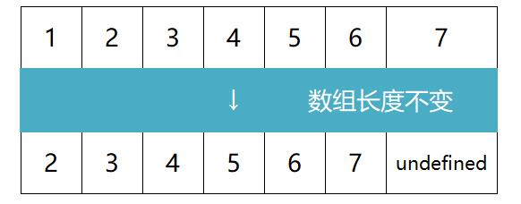

## 数组  
> 虽然在 JavaScript 里，数组可以保存不用类型的值，但我们还是遵守最佳实践，避免这么做。  

### 创建和初始化数组  
> 这里只介绍最好的方式。

**创建数组**  
```
let X = [];
```
**创建并初始化数组**  
```
let x = ['a','s','d']
```
**查询数组元素数量**  
```
console.log(x.length);
```

### 访问元素和迭代数组  
**访问元素**  
```
console.log(x[N]);
```
#### 迭代数组  
```
for(let i =0;i<x.length;i++){
  console.log(x[N]);
}
```
#### 斐波那契数列
> 斐波那契数列中的前两项是 1，从第三项开始，每一项都等于前两项之和。  
>
> 此处求斐波那契数列的前 20 个数。（实际上只有的19个数？）  
```
const x =[];
x[1] = 1;
x[2] = 2;

for(i=3;i<20;i++){
 x[i] = x[i-1] + x[i-2];
}

console.log(x);         // 也可以替代为迭代数组
```

### 添加元素  

**在数组末尾添加元素**  
```
x[x.length] = 'f';
```
或者  
```
x.push('f','g');
```
**在数组开头插入元素**  
```
x.unshift('q','w');
```
或者  
```
Array.prototype.insertFirstPosition = function(value){      // in...为函数（方法）取的名字
  for (let i = this.length; i>0; i--){
    this[i] = this[i-1];
   }
   this[0] = value;
  };
  x.insertFirstPosition('w');
```
> 此处使数组长度+1，然后把所有元素向后（右）移一位，最后插入首位元素。
> 
> 将此方法直接添加在 Array 的原型上，使所有数组的实例都可以访问到该方法。 

### 删除元素  
**从数组末尾删除元素**
```
x.pop();      // 将删除数组里最靠后的元素
```
**从数组开头删除元素**  
```
x.shift;      // 将删除数组的第一个元素，且数组长度变化
```
或者  
> 仅用作示例，真实项目中不应该这样使用。 

```  
let x =[1,2,3,4,5,6,7,8];

// （向后）逐个推入数组（undefined 除外）
Array.prototype.a = function(c1){             // a一般表示为 reIndex
	const d = [];
    for (let i = 0; i < c1.length; i++){
    	if(c1[i] !== undefined){
        	console.log(c1[i]);
        	d.push(c1[i]);
        }
    }
    return d;
}

// 手动移除第一个元素并重新排序[①]
Array.prototype.b = function(){               // b一般表示为 removeFirstPosition
	for (let i = 0; i < this.length; i++){
    	this[i] = this[i + 1];
    }
    return this.a(this);                      // 这里的 this 将替代为 处理后的数组实例
}

x.b();
```
> 操作①的原理图如下：  
>   

### 在任意位置添加或删除元素  
> splice()方法，既可以添加元素，删除元素，也可以替换元素。
> 
> 参数1：索引值 参数2：删除元素( 包括索引值指向的元素 )的数量 参数3+：添加到数组里的值。
```
let x = [1,2,3,4,5,6,7,8];
let y = x.splice(2,2);       // 1,2,5,6,7,8
let z = x.splice(2,0,3,4);   // 1,2,3,4,3,4,5,6,7,8
let zz = x.splice(-2,1,9);   // 1,2,3,4,5,6,9,8
```

## 二维和多维数组  
> JavaScript 只支持一维数组，并不支持**矩阵**（二维数组，或**数组的数组**），但我们可以用数组套用数组来实现矩阵。

```
let x = [];
x[0] = [1,2,3];
x[1] = [4,5,6];
```


**迭代二位数组的元素**  
在浏览器控制台中打印二维数组  
```
console.log(x);
console.table(x);   // 据说这条会显示一个更加友好的输出结果，测试失败
```
或
```
function printMatrix(c1){
	for (let i = 0; i < c1.length; i++){
		for(let j = 0; j < c1[i].length; j++){
        	console.log(c1[i][j]);      // 没有设置返回值
    }
  }
}
printMatrix（x）;
```
**三维数组**  
> 创建一个3\*3\*3的矩阵，每一格里包含矩阵的i（行）、j（列）、及z（深度）**之和**。  
> ``` 
> const x =[];
> for (let i = 0; i<3; i++){
>  x[i] = [];
>   for (let j = 0; j < 3; j++){
>    x[i][j] = [];
>     for (let z = 0; z < 3; z++){
>      x[i][j][z] = i + j + z;    //赋值
>     }
>   }
> }
> ```
**迭代三维数组的元素**  
```
function a(c1){                                  
 for (let i = 0; i < c1.length; i++){            // 通常命名为 matrix3x3x3  
   for(let j = 0; j < c1[i].length; j++){  
      for(let z = 0; z < c1[i][j].length; z++){   // 多一个维度  
        console.log(c1[i][j][z]);      
      }
    }
  }
}
a（x）;
```

## JavaScript 的数组方法参考  
**数组合并**  
> `concat（）`方法可以向一个数组传递数组、对象或是元素。（均会被当成一个元素）  
```
const x =[1,2];
const y ={name:'a',age:'b'};
const z = 3;
let zz = x.concat(y,z);     // [1,2,{name:'a',age:'b'},3]
```
#### 迭代器函数  
> 设定一个数组，如果数组里的元素可以被 2 整除（偶数），函数就返回 true，否则返回 false。
```
const isEven = a => a % 2 === 0;    // isEven是自己取的函数名; 后面的表达式会返回布尔值
let x =[1,2,3,4,5,6,7];
```
**用 every（） 迭代**  
> 对数组中的每个元素运行**给定函数**（指参数），如果该函数对每个元素**都返回 true**，则返回 true。
>  
> 本例中，数组的第一个元素是 1，因此 isEven 函数返回 false，然后 every 执行结束。  
```
x.every(isEven);
```

**用 some() 迭代**  
> 对数组中的每个元素运行给定函数，如果任一元素返回 true，则返回 true.  
```
x.some(isEven);
```

**用 forEach() 迭代**  
> 对数组中的每个元素运行给定函数，无返回值。  
> 
> 使用结果与 for 循环相同。  
```
x.forEach(a => console.log(a % 2 === 0));
```

**用 map() 取回新数组**  
> 对数组中的每个元素运行给定函数，返回每次**函数调用的结果**组成的数组。  
```
x.map(isEven);
```

**用 filter() 取回新数组**  
> 对数组中的每个元素运行给定函数，返回该函数会**返回 true 的元素**组成的数组。  
```
x.filter(isEven);
```

#### 解析reduce的用法  
> 语法  
> ```  
> arr.reduce(callback,[initialValue])
>   
> 解释： 
> call back (取回执行数组中每个元素的函数所包含的四个参数)
>   1.previousValue （上一次调用回调返回的值，或初始值）
>   2.currentValue  （数组中当前被处理的元素）
>   3.index         （当前元素在数值中的索引）// 可选
>   4.array          (调用 reduce 的数组)    // 可选
> initialValue       (设置的初始值）          // 可选  
> ```
对数组的所有元素求和  
```
let x = [2,3,4];
x.reduce((a,b) => a + b);       // 结果为 9，将调用函数 2 次
x.reduce(((a,b) => a * b),2);   // 结果为 48，将调用函数 3 次，有初始值可以避免空数组报错
```
有篇写的很好的文章，可以学习[更高级的技巧](https://www.jianshu.com/p/e375ba1cfc47)。  

## ES6数组新功能  
**使用 `for...of` 循环迭代数组**  
```
for(const n of x){
	console.log(n % 2 === 0 ? 'even' : 'odd');
}
```

**使用 `@@iterator` 对象**  
> 返回一个包含数组键值对的**迭代器**对象，可以通过同步调用得到数组元素的键值对。
> 
> 需要通过 Symbol.iterator 来访问。
> 然后，不断调用迭代器的 next 方法，就能依次得到数组中的值。  
```
let x = [3,5,9,2];
let y = x[Symbol.iterator]();

console.log(y.next().value);     // 3	
console.log(y.next().value);     // 5
console.log(y.next().value);     // 9
console.log(y.next().value);     // 2
console.log(y.next().value);     // undefined
```
也可以  
```
let y = x[Symbol.iterator]();
for (const n of x){
	console.log(n);         // 3 5 9 2
}
```
#### 数组的entries() 方法
> 返回包含数组所有键值对的 `@@iterator`
> 
> `key` 是数组中的位置，`value` 是保存在数组索引的值。  
```
let y = x.entries();		 // 得到键值对的迭代器
console.log(y.next().value);     // [0,3]
console.log(y.next().value);     // [1,5]
console.log(y.next().value);     // [2,9]
```
也可以使用 ES6 的结构实现在循环中拆分键值对    
```
let arr = [5,2,7]

for(const [i, v] of arr.entries()) {
  console.log(i);
  console.log(v);
}
```
**数组的 keys() 方法**  
> 返回包含数组所有**索引**的 `@iterator`。
> 
> 一旦没有可迭代的值      // {value: 0, done: false }  
```
const y = x.keys();     // 得到数组索引的迭代器
console.log(y.next());  // {value: 0, done: false }
console.log(y.next());  // {value: 1, done: false }
console.log(y.next());  // {value: 2, done: false }
```
**数组的 values() 方法**  
> 返回包含数组所有**值**的 `@iterator`。  
```
const y = x.values(); 
console.log(y.next());  // {value: 3, done: false }
console.log(y.next());  // {value: 5, done: false }
console.log(y.next());  // {value: 9, done: false }
```
**使用 Array.from 方法**  
> 根据已有数组创建一个新的数组。  
复制一个数组  
```
let y = Array.from(x);
```
也可以传入一个过滤值的函数
```
let z = Array.from(x, a => (a % 2 == 0));  // [false,false,false,true]
```
**使用 Array.of 方法**  
> 根据传入的参数创建一个新数组。  
等价的代码  
```
let y = Array.of(1,2);
let y = [1,2];
```
复制已有的数组
```
let y = Array.of(...x);    // 展开运算符把数组里的值展开成参数
```
#### 使用fill方法
> 用静态值填充数值。  

参数 | 说明 | 补充
:-: | :-: | :-: 
参数1 | 填充值 | /
参数2 | 起始索引 `[` | 可选，可负，默认为 0
参数3 | 结束索引 `)` | 可选，可负

```
let v = [1,2,3,4,5,6];
v.fill(0);     //  [0,0,0,0,0,0]

// 索引反向时，无效  
// 超出索引部分无效  
```

#### 使用copyWithin方法  
> 复制数组中一系列元素到**同一数组**指定的起始位置。      

参数 | 说明 | 补充
:-: | :-: | :-: 
参数1 | 插入索引 | /
参数2 | 复制起始索引 `[` | 可选，可负，默认为 0
参数3 | 复制结束索引 `)` | 可选，可负

```
let v = [1,2,3,4,5,6];
v.copyWithin(0,4);     //  [5,6,3,4,5,6]

// 索引反向时，无效  
// 超出索引部分无效 
```

### 排序元素  

**使用 reverse() 方法**  
> 在原数组中颠倒元素的顺序。  
```
v.reverse();
```

**使用 sort() 方法**  
> 按照字母顺序（ ASCII值 ）对数组排序，支持传入指定排序方法的**函数作为参数**。
> 
> 
**按数值从小到大排序**  
```
v.sort((a,b) => a - b);    // 前提是数组的元素是数组，或其valueOf()方法返回数值，如 Date 对象
```
> 也可以更清晰的表示：
> ```
> function x(a,b){
> 	if (a < b){
> 	  return -1;
> 	}
> 	if (a > b){
> 	  return 1;
> 	}
> 	return 0;
> }
> v.sort(x);
> ```
**自定义排序**  
> 根据年龄排序。
```
let v = [
	{ name:'coco', age:17 },
        { name:'baba', age:50 },
        { name:'wang', age:1  }
	]
console.log(v.sort((a,b) => a.age-b.age));		
```
**字符串排序**  
> 按照 ASCII 值比较，a 将排在任意大写字母的后面。  
> 
> 可以给 sort 传入一个忽略大小写的比较函数来解决这个问题。  
```
let v = ['F','a','f','A'];

function x(a,b){
	if (a.toLowerCase() < b.toLowerCase()){
    return -1;
 	}
 	if (a.toLowerCase() > b.toLowerCase()){
 	return 1;
 	}
 	return a.charCodeAt() - b.charCodeAt();    // 教程是 return 0； 但测试不行，故改为了 ASCII值 相减
}

console.log(v.sort(x));    // [A,a,F,f]
```
将小写字母排在前面：
> 这个方法同样可以对带重音符号的字符排序。
```
console.log(v.sort((a,b) => a.localeCompare(b)));    // [a,A,f,F]
```

### 搜索  
**使用 indexOf() 方法**  
> 返回第一个与给定参数相等的数组元素的**索引**，没有找到则返回 -1  
```
let x = [4,87,24,3]
console.log(x.indexOf(24));    // 返回 2
```
**使用 lastIndexOf() 方法**  
> 返回最后一个与给定参数相等的数组元素的**索引**，没有找到则返回 -1  

**使用 find 和 findIndex 方法——ECMAScript 2015**  
> 根据**回调函数**给定的条件从数组中查找元素，如果找到则返回第一个满足条件的元素 / 索引，找不到则返回 undefined / -1 。    
```
document.write(x.find(a => a > 22));    // 输出 87
```
**使用 includes() 方法——ECMAScript 2017**  
> 如果数组中存在**某个元素**则返回 true，否则返回 false。  
```
console.log(x.includes(87));	// true
console.log(x.includes(87,2));	// false 第二个参数为起始索引[
```

### 输出数组为字符串  
**使用 includes() 方法**  
> 将数组作为一个字符串返回。  
```
console.log(x.toString());
```
**使用 join() 方法**  
> 将所有的数组元素连接成一个字符串。
```
console.log(x.join('-'));    // 4-87-24-3
```

