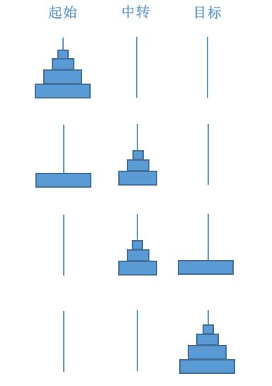

# 栈  
> 栈是一种遵从**后进先出**（ LIFO ）原则的有序集合。新添加或待删除的元素都保存在栈顶，另一端就叫栈底。  
> 
> 应用于浏览器的历史记录（ 返回 ）等。  

## 创建一个基于数组的栈  
```
class Stack {
    constructor() {
        this.items = [];     // 为示例添加一个名为 items 的属性，并初始化为空数组。
   }                         // 方法添加到这之后。
}
```
**向栈添加元素**  
> 只添加到栈顶，也就是栈的末尾。  
```
push(element){                 // 这里的 push 为方法名，喜欢也可以改成别的。
    this.items.push(element);  // 这里的 push 则调用了数组方法。
}
```
**从栈移除元素**  
> 移除最后添加的元素。  
```
pop(){
    return this.items.pop();   // return 便于查看移除的值
} 
```
**查看栈顶元素**  
```
peek(){
    return this.items[this.items.length-1];
}
```
**检查栈是否为空**  
```
isEmpty(){
    return this.items.length === 0;
}
```
**查看栈的长度**  
```
size(){
    return this.items.length;
}
```
**清空栈元素**  
```
clear(){
    this.items = [];
}
```

## 创建一个基于对象的栈  
```
class Stack {
    constructor() {
        this.count = 0;    // 用于记录栈的大小等。
        this.items = {};
    }
}
```
**向栈中插入元素**  
> 对象是一系列**键值对**的集合。
```
push(element){
    this.items[this.count] = element;
    this.count++;
}
```
**检查栈是否为空**  
```
isEmpty(){
    return this.count === 0;
}
```
**查看栈的长度**  
``` 
size(){
    return this.count;
} 
```
**从栈中弹出元素**  
```
pop(){
    if (this.isEmpty()){    // 等同于 this.count === 0
        return undefined;   // 比起之前基于数组建栈，这考虑的更周全。
    }
    this.count--;    
    const result = this.items[this.count];    // 创建一个临时变量以便最后返回弹出值
    delete this.items[this.count];
    return result;
}
```
**查看栈顶的值**  
```
peek(){
    if (this.isEmpty()){
        return undefined;
    }
    return this.items[this.count - 1]
}
```
**清空栈元素**  
```
clear(){
    this.items = {};
    this.count = 0;
}
```
> 遵循 LIFO 原则来移除所有栈元素。
> ```
> clear(){
>     while (!this.isEmpty()){
>         this.pop();
>     }
> }
> ```

**创建 toString 方法**  

```  
toString() {
    if (this.isEmpty()){
        return '';
    }                                      // 针对空对象
    let x = `${this.items[0]}`;            // 仅1个元素，无逗号； 
    for (let i = 1; i < this.count; i++){  // 多个元素，也不会以逗号开头。
        x = `${x},${this.items[i]}`;
    }
    return x;
}
```

## 保护数据结构内部元素  
> 对于别的开发者也可以使用的数据结构和对象，我们希望保护内部的元素，只有我们暴露出的方法才能修改内部结构。  
> 
> 遗憾的是，我们在 Stack 类中声明的 items 和 count 属性并没有得到保护（[不是私有的](https://baijiahao.baidu.com/s?id=1599895429718447423&wft=spider&for=pc&searchword=%E7%A7%81%E6%9C%89%E5%B1%9E%E6%80%A7)），因为 JavaScript 的类就是这样工作的。

**下划线命名约定**  
> 有些开发者喜欢在 JavaScript 中使用下划线命名约定来标记私有属性。  
```
class Stack {
     constructor() {
         this._count = 0;   // 仅为约定，并不能保护数据。
         this._items = {};
     }
}
```
**用限定作用域 Symbol 实现类**  
> Symbol 是在 ES2015 新增的一种基本类型，它是不可变的。  
>
> 但它创建的依旧是假的私有属性。
```
const items = Symbol('xxx');
const items2 = Symbol('zzz');
const items3 = Symbol('ccc');

class Stack {
    constructor() {
        this[items] = [];          
        this[items2] = [1,2,3];
    }
    push(element){
        this[items].push(element);     // 为了访问 items，需把所有的 this.items 都换成 this[items]
    }
}

const x = new Stack();    
x.push('a');
x.push('b');
x.push('c');
x.push('d');

// 但是通过这个方法能够取到类里面声明的所有 Symbols 属性。
let y = Object.getOwnPropertySymbols(x);    
console.log(y.length);             // 2
console.log(y);                    // 输出 Symbols 列表
console.log(x[y[0]][2] = 'e');     // 将 items[2] 替换为 e
```
**用 WeakMap 实现类**  
> 这种数据结构可以确保属性是**私有的**，只是代码可读性不强。  
```
const a = new WeakMap();

class y {
    constructor (){
        a.set(this,[]);         // 以 this 为键，把代表栈的数组存入 a
    }
    push(element){
        const s = a.get(this);  // 以 this 为键，从 a 中取值
        s.push(element);
    }
}

const x = new y();
x.push(2);

console.log(x);         // 属性隐藏
document.write(x.a);    // undefined
```
## 栈实战  
**十进制转化为二进制**  
> 把该十进制数除以 `2` 并对商取整，直到结果是 0 为止。  

把十进制的 10 转化为 二进制,将所得余数倒置便是结果：
/2|操作|商|余数
:-:|:-:|:-:|:-:
10|↙|5|0
5|↙|2|1
2|↙|1|0
1|-|0|1  

代码实现
> 注意 JavaScript 的数值类型不会区分整数和浮点数。
```
function decimalToBinary(decNumber) {
    const remStack = new Stack();
    let x = decNumber;
    let rem;
    let binaryString = '';
    
    // 当输入值/商不为 0 时： 
    while(x > 0) {
        rem = Math.floor(x % 2);    // 返回除数运算结果的整数部分
        remStack.push(rem);
        x = Math.floor(x / 2);
    }
    
    // 逐个返回并连接成字符串
    while(!remStack.isEmpty()) {
        binaryString += remStack.pop().toString();
    }
    
    return binaryString;
}
```

**十进制转化为基数为 2~36 的任意进制**  
> 一个关键点是将大于 9 的余数转换成对应的ABCD等。  
```
function baseConverter(decNumber,base) {
    const remStack = new Stack();
    const digits = '0123456789ABCDEFGHIGKLMNOPQRSTUVWXYZ'  // ①
    let x = decNumber;
    let rem;
    let baseString = '';
    
    // 参数 2 不匹配时：
    if (!(base >= 2 && base <= 36)) {
        return '';
    }
    
    while(x > 0) {
        rem = Math.floor(x % base);
        remStack.push(rem);
        x = Math.floor(x / base);
    }
    
    while(!remStack.isEmpty()) {
        baseString += digits[remStack.pop()];  // 配合①，可以将大于 9 的数字也转化成对应字符串。
    }
    
    return baseString;
}
```

**汉诺塔**  
> 总共有三座塔要将所有的盘子从塔 A 移动到塔 C，每次只能移动一个盘子，且大盘子不能放在小盘子上面。 
> 
> 我们将其分为 3 个主要步骤，将塔分为 **起始，中转，目标**。  
>   
> 第一个步骤是将 n-1 个盘子从 **起始** 移动到 **中转**。  
> 第二个步骤是将第 n 个盘子从 **起始** 移动到 **目标**。  
> 第三个步骤是将 n-1 个盘子从 **中转** 移动到 **目标**。  
> 其中第一个步骤和第三个步骤，找到匹配类型的塔后，同样可以转化为这三个步骤，只是盘子少了一个。  
> 且追本溯源，当 n = 1 时，操作亦正确。故采用递归的方式来解决问题。  
　

代码实现  
> 每次调用步骤一/三，其实已经重新匹配好了对应类型的塔，理解这一点之后，就不用纠结它的具体实现会不会出错啦。
> 
> 当函数调用自己时，相当于进行一个入栈的操作，被调用的函数在栈顶。
```
function hanoi(num,first,middle,last) {
    let n = num;
    let count = 0; 
    if (num < 0){
    document.write('无效的输入');
    }
else{       
    move(num,first,middle,last);
    document.write('<br/>总共移动了 ' + count +' 次' );
    }
    
    function move(num,first,middle,last) {      // num 为本轮需要操作的盘子数，后面三个参数接受的值，将重新匹配为对应类型的塔。
    let n = num;
    let x = 0;
    if(n > 0) {                     // 一定要设置返回条件！
    move(n-1,first,last,middle);
    document.write('把第 ' + n + ' 个盘子由 '+ first + ' 移动到 ' + last + '<br/>');  // 把第 n 个盘子从起始移动到目标
    move(n-1,middle,first,last);
    count++;                        // count 的结果等于执行第二步的总次数（ 每次执行函数 / 输出相当于移动了一次 ）。
              }
    }  
}
hanoi(5,'A','B','C');               // 不要忽略''，否则会被当做未定义的变量。
```
若要理解步骤一和步骤三的具体实现，建议取一个小一点的 n 值。


