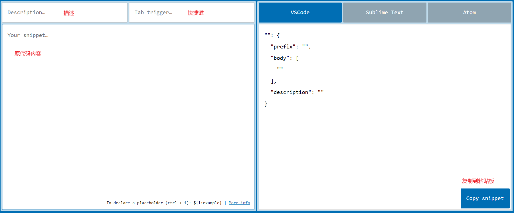

### vscode

#### 拓展  

|              名称               |                     说明                      |
| :-----------------------------: | :-------------------------------------------: |
| Chinese(Simplified) Language... |                翻译应用为中文                 |
|             ESLint              |              检测错误代码并提示               |
|           Live Server           |       提供本地服务器，实时检测代码效果        |
|              Vetur              |             Vue语法高亮、智能提示             |
|            Easy LESS            |    将 `.less` 自动编译为同名 `.css` 或其它    |
|       微信小程序开发助手        |            标签、接口提示、模板等             |
|       Markdown All in One       |                 Markdown相关                  |
| Markdown Preview Github Styling |                 Markdown相关                  |
|                /                |                 开启自动保存                  |
|       Atom One Dark Theme       |             改变主题，如代码颜色              |
|            Bookmarks            |            可以打标记，看源码可用             |
|          vscode-icons           |        让文件管理处的各个文件带上图标         |
|           htmltagwrap           |                 标签自动补全                  |
|  ES7 React/Redux/... snippets   |            快速生成模板，如类组件             |
|    vscode-styled-components     | react 中使用的 styled-components 库，智能提示 |
|         project Manager         |            保存常用项目，快速打开             |
|           Remote-SSH            |         连接远程服务器，修改远程文件          |

#### 快捷键  

|       输入/操作       |            说明            |
| :-------------------: | :------------------------: |
|     `Ctrl` + `[`      |        左缩进选中行        |
|     `Ctrl` + `/`      |         注释选中行         |
| `Alt` + `Shift` + `A` |        注释选中内容        |
| `Shift` + `Alt` + `↓` |       快速复制选中行       |
| `Alt` + `Shift` + `F` |           格式化           |
|     `Ctrl` + `~`      |          打开终端          |
|      log + `Tab`      |       console.log()        |
|       div#demo        |  
</div\>   |
|       div.demo        | 
</div\> |
|         a\*3          |          3个a标签          |
|       ul>li\*3        |       3个li的ul列表        |
|   ul>li{text}\*100    |   ul带100个默认文本的li    |
|   bgc + `↓` + `Tab`   |     backgroundcolor: ;     |
|     fontz + `Tab`     |        font-size: ;        |

#### 更改缩进 

> 点击编辑器右下角的 `空格：*` -> 使用空格缩进 -> 对应数字。  

#### 生成代码片段

文件 - 首选项 - 用户片段 - 选中html - 此时会打开一个json格式的文件

在[辅助网站](https://snippet-generator.app/)中将代码复制到该文件中

### 其他

#### markdown常用表情  

|      类型       |       符号        |       说明       |
| :-------------: | :---------------: | :--------------: |
|   :snowflake:   |   `:snowflake:`   |      知识点      |
|      :bug:      |      `:bug:`      |       bug        |
|    :cyclone:    |    `:cyclone:`    |      类 bug      |
|     :herb:      |     `:herb:`      | 疑似知识点；怀疑 |
|   :palm_tree:   |   `:palm_tree:`   |    翻译，解释    |
|    :whale2:     |    `:whale2:`     |    栗子，示例    |
| :grey_question: | `:grey_question:` |       疑问       |

#### 表格数据转换工具  

> 可以将表格转化为数组或对象，以 JS 或 JSON 形式输出，见[网站](https://echarts.apache.org/zh/spreadsheet.html)。  

#### 表单构建结合elemnt生成Vue   

> 可以[自定义表单](https://demo.django-vue-admin.com/tool/build)，转换为使用element构建的 Vue 文档，可选择弹窗或页面类型。    
>
> 系统构建 -> 表单构建  

#### 截图提色工具  

> [Snipaste](https://www.snipaste.com/)  

下载后，解压，点击Snipaste图标，即可出现在后台并可使用。  

|  输入/操作  |      说明      |
| :---------: | :------------: |
| F1 \+ 回车  |      截图      |
|   F1 \+ c   |   获取颜色值   |
| F1 \+ Shift | 切换颜色值类型 |
|     F3      |      贴图      |
|     Esc     |    关闭贴图    |

