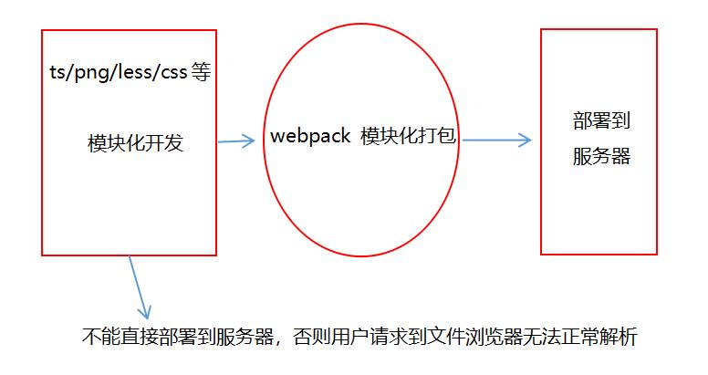
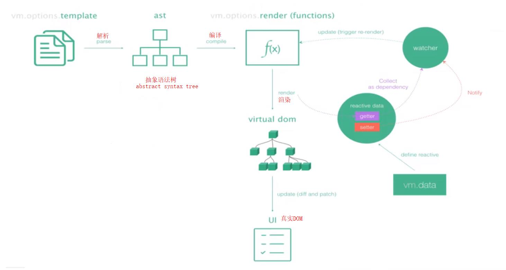
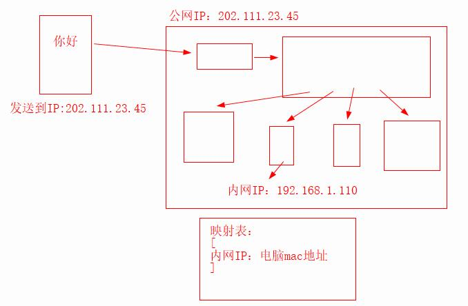
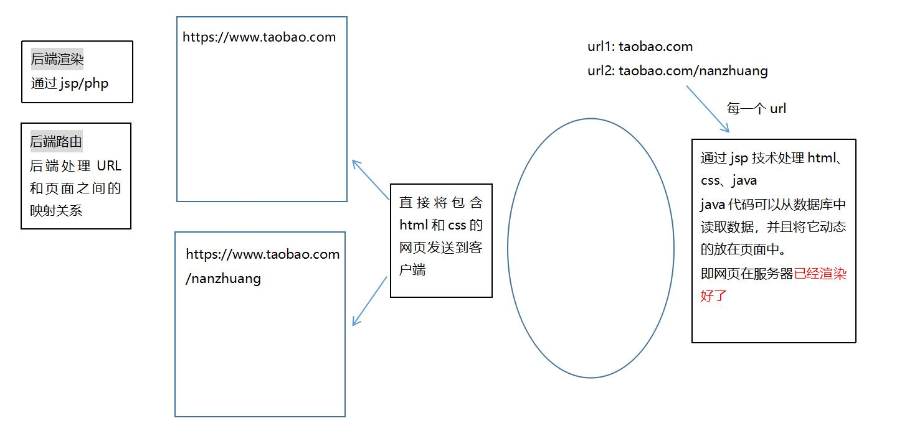
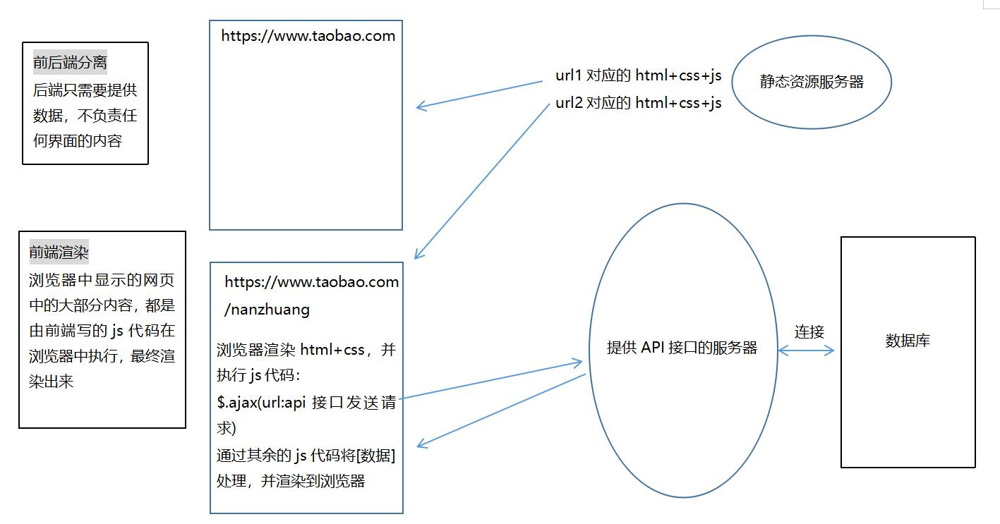
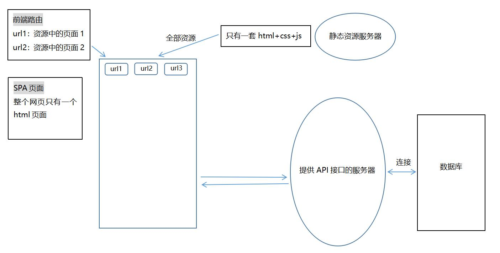

## 模块化

### JavaScript原始功能

多人开发时，引入多个 `.js` 文件特别是其中包含的全局变量会导致混乱。

### 实现模块化

> ES5 及以前，只能通过下面这样通过匿名函数实现闭包（立即执行）的方式来避免全局变量的问题。

```react
(function() {
    var hi = 'nihao';
    var show = function() {
        document.write('from a.js');
    }
})()
```

但此时，其它 `.js` 文件要复用这些变量，只能重新创建。所以最好将需要的变量返回到一个对象中，用模块专属的全局变量接受。

```react
/* a.js */
var adata = (function() {
  var out = {};
  var hi = 'nihao';
  var show = function() {
    document.write('from a.js');
  }

  out.hi = hi;
  out.show = show;
  return out;
})()

/* b.js */
;
(function() {
  adata.show();
  console.log(adata.hi);
})()
```

:snowflake: 在每个 `.js` 文件开头加上 `;`，可以避免引用时的一些冲突。

### CommonJS规范

> 这种模块化规范被 Node.js 很好的实现了。当然了，缺乏底层支撑原生的 Javascript 不能直接这样做。

```react
/* 从a.js导出 */
var hi = 'nihao';
var show = function() {
    document.write('from a.js');
}

module.exports = {
    hi,
    show
}

/* 从b.js导入 */
let {hi, show} = require('./a.js')
```

:star2: 这里使用了 ES6 的对象字面量的增强写法和对象解构。

### ES6方法

1. `module` 类型能够将作用域隔离，因此哪怕在文件中使用 `var` 也不会产生冲突。
2. 为了能够从其它文件获取需要的数据，需要通过 `export` 关键字导出，`import` 关键字导入。

```react
/* index.html */
<script src="a.js" type="module"></script>
<script src="b.js" type="module"></script>

/* a.js */
let hi = 'nihao';
let show = function() {
    alert('from a.js');
}

export {
    hi, show
}

/* b.js */
import {hi, show} from "./a.js";

show();
console.log(hi);
```

:star2: 使用这个方法会有跨域的问题，在 VScode 中使用插件 `Live Server` 可以解决。

#### export的更多用法

```javascript
/* a.js */
export let x = 3;
export function y(a, b) {return a + b};
export class z {};


/* b.js */
import {x, y, z} from "./a.js";

console.log(x);
console.log(y(6,6));
let xxx = new z;
```

导出自命名数据

1. 使用 `export default` 导出可以给功能自命名。但在同一模块中，只允许存在一个。
2. 导入时加入的 `objectA` 可替换成自己想要的名字。

```javascript
/* a.js */
export default {
    hi, show
}

/* b.js */
import objectA from "./a.js";

objectA.show();
console.log(objectA .hi);
```

从文件导入所有数据并添加到对象

```javascript
import * as objectA from "./a.js";

objectA.show();
```

:herb: 使用通配符不能导入 `export default` 中的数据。

## webpack的模块化和打包

- 模块化
  - 以往通过模块化开发的项目，在模块间会产生各种依赖（如导出导入）。
  - 而 webpack 其中一个核心就是让我们可能进行模块化开发，并且会帮助我们处理模块间的依赖关系。
- 打包
  - 打包就是将 webpack 中的各种资源模块进行打包合成一个或多个包。
  - 打包的过程中，还可以对资源进行处理，比如压缩图片，将 scss 转成 css，将 ES6 语法转成 ES5，将 TypeScript 转化为 JavaScript等。

### 和grunt/gulp的对比

- grunt/gulp 的核心是 Task。
  - 配置一系列的 task， 并且定义 task 要处理的事务（例如 ES6、ts 转化，图片压缩，scss 转化）。
  - 然后让 grunt/gulp 依次执行这些 task，让整个流程自动化。
  - 故它们也被称为前端自动化任务管理工具。
- 当工程模块化依赖非常简单，甚至没有用到模块化的概念时，只需要处理事务时，就可以使用 grunt/gulp。
- 与 webpack 的区别
  - grunt/gulp 更强调前端流程的自动化。
  - webpack 更加强调模块化开发管理，而文件压缩合并、预处理等功能，是它附带的功能。

### webpack的功能




## 拓展loader

> 给 webpack 拓展对应的 loader，就可以具备加载css、图片等的能力。

1. 通过 npm 安装需要使用的 loader，指令可以到[官网](https://www.webpackjs.com/loaders/)中找。
2. 在 `webpack.config.js` 中的 `modules` 关键字下进行配置。

### webpack中使用css文件

1. 添加依赖

> 在 `main.js` 最后加上这段代码，为指定 css文件添加依赖。

```js
require("./css/normal.css")
```

1. 安装loader

```react
/* 项目文件下 */
/* css-loader，负责将 css 文件进行加载 */
npm install css-loader@2.0.2 --save-dev

/* style-loader，负责将样式添加到 DOM 中 */
npm install style-loader@0.23.1 --save-dev
```

1. 配置loader

> 创建 `module.exports` 并添加相应对象。

```react
module.exports = {
  module: {
    rules: [
      {
        test: /\.css$/,
        use: [ 'style-loader', 'css-loader' ]
      }
    ]
  }
}
```

:star2: 使用多个 loader 时，使用顺序是从右向左。

1. 这时就可以正常的将 css 文件打包了

### webpack中使用less文件

1. 新建文件 `special.less`

```less
@fontSize: 100px;

body {
    font-size: @fontSize;
}
```

1. 添加依赖

> 在 `main.js` 最后加上这段代码，为指定 less文件添加依赖。

```react
require("./css/special.less")
document.writeln("<h2>你好，生活！</h2>");
```

1. 安装loader

```react
/* less-loader */
npm install --save-dev less-loader@4.1.0 less@3.9.0
```

1. 配置loader

```
把 rules 数组中的对象添加到相应位置。
```

### webpack中使用图片文件

1. 更新文件 `normal.css`

```less
body {
    background: url(../img/阿米娅2.png);
}
```

1. 添加依赖

```
之前已经将该文件添加了依赖
```

1. 安装loader

- `url-loader` 像 `file loader` 一样工作，但如果文件小于限制，可以返回 data URL。
- `file-loader` 将文件发送到输出文件夹，并返回（相对）URL。

```elm
/* url-loader */
npm install --save-dev url-loader@1.1.2

/* file-loader */
npm install --save-dev file-loader@3.0.1
```

1. 配置loader

> 其中的 `limit` 将限制图片文件大小。

```react
...
options: {
    limit: 17000
}
...
```

:href: 只需要配置 `url-loader`，不然会报错。

1. 图片限制

- 若图片小于限制
  - 将图片编译成 base64 字符串形式。
- 若图片大于限制
  - 需要使用 `file-loader` 模块进行加载。且将会在 `dist` 目录下，生成一个通过哈希算法命名的图片文件。
  - 由于此时的 `index.html`文件不在 `dist` 中，默认找的路径不对。需要在 `webpack.config.js` 中添加如下代码，拼接路径。

```react
output: {
    ...
    publicPath: 'dist/'
}
```

1. 更改图片默认命名方式

> 默认的 32 位 hash 值，不一定能满足需求。此时可以在 `webpack.config.js`-`url-loader` 对应的 `options` 中，添加如下选项。

```
name: 'img/[name].[hash:8].[ext]'
```

| 选项  | 说明                 |
| ----- | -------------------- |
| img   | 文件要打包到的文件夹 |
| name  | 获取图片原来的名字   |
| hash8 | 防止图片名称冲突     |
| ext   | 使用图片原来的拓展名 |
| []    | 代表变量             |

### webpack中将ES6语法转化为ES5

1. 安装loader

```elm
/* es6 转换成 es5 */
npm install --save-dev babel-loader@7.1.5 babel-core@6.26.3 babel-preset-es2015@6.24.1
```

1. 配置loader

```react
/* 按官网配置后，修改这个配置 */
presets: ['es2015']
```

:star: 其中的 `exclude` 属性表示排除哪些文件。

### webpack中使用Vue

1. 安装loader

```elm
/* 解析Vue */
npm install vue@2.5.21 --save
```

:star: vue在实际项目中也会用到，所以不仅是开发时依赖。
:herb: 安装后，vue 模块将默认从 `node_modules` 当中进行导出。

1. 选择导出版本

> vue 有多个版本，大致上分为两大类。

| 版本             | 说明                                          |
| ---------------- | --------------------------------------------- |
| runtime-only     | 代码中，不可以有任何的 template（包括根模板） |
| runtime-compiler | 代码中，可以编译 template                     |

由于默认导出的版本为 `runtime-only`，所以需要更改它的配置。

```react
/* webpack.config.js */
module.exports = {
    ...
    resolve: {
        alias: {
            'vue$': 'vue/dist/vue.esm.js'
        }
    }
}
```

1. 举个栗子

```react
/* index.html */
<div id="demo">
    <h2>{{message}}</h2>
</div>

/* main.js */
import Vue from 'vue'

new Vue({
   el: '#demo',
   data: {
       message: 'Hello aimeite!'
   }
})
```

------

## Vue的抽离写法

### 创建Vue时，template和el的关系

选项 `template` 中的内容会替换挂载元素。

```react
/* index.html */
<div id="demo"></div>

/* main.js */
import Vue from 'vue'

new Vue({
    el: '#demo',
    template: `
    <div>
        <button>按钮</button>
        <h2>{{message}}</h2>
    <div/>
    `,
    data: {
        message: 'abc'
    }
})
```

:snowflake: 注意模版中需要有一个根元素。

### Vue的抽离原理一

可以将子组件当作根实例的模板使用。

```react
/* 子组件cdiv */
const cdiv = {
  template:`
  <div>
        <button>weiwei</button>
        <h2>{{message}}</h2>
  </div>`,
  data() {
        return {
            message: 'abc'
        }  
    }
}

/* Vue实例 */
new Vue({
    el: '#demo',
    template: '<cdiv></cdiv>',
    components: {
      cdiv
    }
})
```

### Vue的抽离原理二

既然子组件被抽离成了一个对象，自然可以用模块化的方式将其从其它地方导入。

- src
  - vue
    - app.js

```react
/* main.js */
import Vue from 'vue'
import cdiv from "./vue/app"

new Vue({
    el: '#demo',
    template: '<cdiv></cdiv>',
    components: {
      cdiv
    }
})

/* app.js */
export default  {
    template:`
    <div>
          <button>weiwei</button>
          <h2>{{message}}</h2>
    </div>`,
    data() {
          return {
              message: 'abc'
          }  
      }
  }
```

### Vue组件的抽离

`.vue` 文件对应的其实就是一个组件，通过它可以实现组件的模板、Javascript 和样式分离。

- src
  - vue
    - app.js
    - App.js

Tips: 后面有更具体的[Vue文件的用法](https://github.com/SpringLoach/Vue/blob/main/learning/section2.md#Vue组件的抽离写法)。

在源文件中依赖 `vue` 文件

```react
/* main.js */
import Vue from 'vue'
import cdiv from "./vue/App.vue"

new Vue({
    el: '#demo',
    template: '<cdiv></cdiv>',
    components: {
      cdiv
    }
})
```

1. 安装loader

```elm
/* vue-loader 和 vue-template-compiler */
npm install --save-dev vue-loader@15.4.2 vue-template-compiler@2.5.21
```

1. 配置loader

```react
{
  test: /\.vue$/,
  use: ['vue-loader']
}
```

> 在 `webpack.config.js`-`module.exports`-`module`中配置上面的代码。
>
> `use` 后使用中括号就不能添加更具体的配置了。

此时可能会有版本冲突的问题，要作如下修改：

```react
/* packge.json */
"vue-loader": "^13.0.0",

/* 项目文件下 */
npm install
```

### Vue组件的抽离写法

:star2: 在 `VScode` 中创建文件后，输入 vue 可以快速创建模板（:grey_question:要插件)。

[](https://github.com/SpringLoach/Vue/blob/main/learning/img/vue用法1.jpg)

举个栗子

> 在这里是可以不添加 `template` 选项滴。

```react
<template>
    <div><h2>{{message}}</h2></div>
</template>

<script>
export default {
  data() {
    return {
      message: 'abc'
    }  
  }
}
</script>

<style>
    body {color: green;}
</style>
```

## 向组件中添加子组件

1. 在 `<script>` 标签内导入子组件

> 没有[配置文件后缀](https://github.com/SpringLoach/Vue/blob/main/learning/section2.md#配置文件后缀)前，不能缩写。

```react
import Appc from "./Appc.vue"
```

1. 给 `export default` 对象添加组件选项（局部注册）

```react
components: {
    Appc
}
```

1. 在 `<template>` 标签中使用子组件

```react
<Appc/>
```

------

## vue-cli脚手架的介绍和安装

通过 Vue.js 开发大型项目时需要考虑代码目录结构、项目结构和部署、热加载、代码单元测试等事情。使用脚手架工具可以帮助我们更高效地完成这些事情。

使用 `vue-cli` 可以快速搭建 Vue 开发环境以及对应的 webpack 配置。

vue-cli使用前提

- Node
- Webpack

1. 安装

> 使用 `vue-cli` 写项目时一般不需要到本地安装，直接全局安装即可。

```elm
/* cmd 默认终端下 */
npm install -g @vue/cli
```

1. 高版本中使用vue-cli2

> 脚手架3通过拉取模板也可以使用脚手架2

```elm
/* cmd 默认终端下 */
npm install -g @vue/cli-init -g
```

1. 初始化项目

> 将在当前文件夹下创建项目文件。

vue-cli2初始化项目

```elm
vue init webpack my-project
```

vue-cli3初始化项目

```elm
vue create my-project
```

vue-cli2初始化项目弹出选项

| 选项                                   | 说明       | 建议                                                         |
| -------------------------------------- | ---------- | ------------------------------------------------------------ |
| Project name                           | 项目名称   | 回车（表示使用 `my-project`）                                |
| Project description                    | 项目描述   | /                                                            |
| Author                                 | 个人信息   | liuxing <[1007435098@qq.com](mailto:1007435098@qq.com)>      |
| Vue build                              | ...        | [runtime-only](https://github.com/SpringLoach/Vue/blob/main/learning/section2.md#runtime-complier和runtime-only) |
| Install vue-router?                    | 路由器     | n                                                            |
| Use ESLint to lint your code           | 代码规范   | n                                                            |
| Set up unit tests                      | 单元测试   | n                                                            |
| Setup e2e tests with Nightwatch?       | 测试相关   | n                                                            |
| Should we run `npm install` for you .. | 怎样管理包 | Yes，use NPM                                                 |

:star2: 项目名称不要包含中文和大写。

## vuecli-2的目录结构

- 项目文件
  - build
    - build.js
    - webpack.base.conf.js
    - ...
  - config
    - index.js
  - node_modules
  - src
  - static
    - .gitkeep
  - .babelrc
  - .editorconfig
  - .eslintignore.js
  - .eslintrc.js
  - .gitignore
  - .prostcssrc.js
  - index.html
  - package.json
  - package-lock.json
  - README.md

| 文件              | 说明                                                  |
| ----------------- | ----------------------------------------------------- |
| build 和 config   | webpack 相关配置                                      |
| build.js          | 为 `npm run build` 的执行文件                         |
| index.js          | 定义相关变量，分为 `dev` 和 `build` 两类              |
| node_modules      | 依赖 node 相关的模块                                  |
| src               | 开发。写代码的地方                                    |
| static            | 静态资源。将图片等资源复制到 `dist`，不会更改及重命名 |
| .gitkeep          | git 相关的文档，指定是否将空文件上传服务器            |
| .babelrc          | 把 ES6 转换为 ES5 所指定的配置文件                    |
| .editorconfig     | 统一代码风格                                          |
| .eslintignore.js  | 忽略选择文件代码的 lint 检测                          |
| .gitignore        | git 相关的文档，忽略选择文件的上传                    |
| .eslintrc.js      | 代码检测配置相关                                      |
| .prostcssrc.js    | css 转化相关配置                                      |
| index.html        | 模板                                                  |
| package.json      | 管理 node 相关的包等                                  |
| package-lock.json | 真实的 node 版本                                      |

### cli2_package.json

1. 文件中的 `"script"`，指出了 `npm run build` 和 `npm run dev` 执行的具体内容。
2. 依赖文件，分为开发时依赖和运行时依赖，都放在 `node_modules` 中。
3. 其中的 `babel-preset-env` 和 `babel-preset-stage-2` 与 `.babelrc` 文件相关。
4. `^` 表示后面两节可以更高，`~`表示最后一节可以更高，栗子`4.15.0`。

### cli2_build.js

1. `rm()` 移除原打包文件。
2. `webpack()` 使用第一个参数作为配置，执行相关的内容。
3. 第一个参数引入的是 `webpack.prod.conf.js` 文件，其中合并了基础配置。

### cli2_babelrc

1. 根据条件决定需要转换的语法。
2. `"browsers"` 指定了市场份额大于 1%，最后的两个版本，不考虑 IE8 及以下。

### cli2_node

> node 由 C++ 编写，使用的是 V8 引擎(编译为二进制代码)，而且能为 JavaScript 提供运行环境。

指令 node 可以直接执行 `.js` 文件。

### cli2_eslint规范

> 在安装了 `ESLint` 后取消该规范：在 `config` - `index.js` 中

```react
useEslint: flase
```

## runtime-complier和runtime-only

[](https://github.com/SpringLoach/Vue/blob/main/learning/img/runtime.jpg)

| 文件             | 说明                                    | 对比                 |
| ---------------- | --------------------------------------- | -------------------- |
| runtime-complier | template -> ast -> render -> vdom -> UI | /                    |
| runtime-only     | render -> vdom -> UI                    | 性能更高，代码量更少 |

### render函数

> 用作组件的一个选项。传入的参数实际上为 createElement 方法，生成的内容将**替换挂载元素**。

1. 用法一

| 参数 | 说明           |
| ---- | -------------- |
| 必选 | 标签           |
| 可选 | 对象，传入属性 |
| 可选 | 数组，传入内容 |

```react
render: function(createElement) {
  return createElement('h2',
    {class: 'box'},
    ['Hey man!', createElement('button', ['按钮'])]
  );
}
```

1. 用法二

传入组件对象。

```react
new Vue({
    el: '#app',
    render: function(h) {
        return h(App);
    }
})
```

### runtime-only中的组件

> 使用 `runtime-only` 时，.vue 文件中的 template 是如何编译的？

是由默认安装的 loader `vue-template-complier`（开发时依赖）将 template 编译成了 render 函数。

------

## vue-cli3与vue-cli2的区别

- vue-cli3基于 webpack 4 打造
- 移除了配置文件 `build` 和 `config`等。
- 提供了 vue ui 命令，可以配置插件、依赖等。
- 移除 `static`，新增 `public`，并将 `index.html` 移到了 `public` 内。

## vuecli-3初始化项目弹出选项

| 选项                                       | 说明               | 建议                                      |
| ------------------------------------------ | ------------------ | ----------------------------------------- |
| Please pick a preset                       | 预设方式           | Manually select features                  |
| Check the feature...                       | 选择项目需要的特性 | /                                         |
| Where do you prefer placing config...      | 如何保存配置文件   | In dedicated config files（分别独立保存） |
| Save this as a preset for future projects? | 是否保存为预设方式 | /                                         |
| Save preset as:                            | 保存预设方式的名称 | /                                         |
| Pick the package manager to use...         | 怎样管理包         | Use NPM                                   |

特性

| 选项                                | 说明                                 |
| ----------------------------------- | ------------------------------------ |
| Babel                               | ES6转ES5                             |
| Typescript                          | /                                    |
| Progressive Web App （PWA） Support | 先进版，新增了一些功能（如推送通知） |
| Rounter                             | 路由                                 |
| Vuex                                | 状态管理                             |
| CSS Pre-processors                  | CSS预处理器                          |
| Linter / Formatter                  | 代码规范检测                         |
| Unit Testing                        | 单元测试                             |
| E2E Testing                         | 端到端测试                           |

删除预设方式

> 实际上不一定在这个文件里，可以启用终端查看默认位置。

```react
/* 删除这个文件里的预设对象 */
C:/Users/Administrator/.vuerc
```

:star2: `rc` [run command] 结尾的文件与 Linux、终端相关。

## vuecli-3的目录结构

- 项目文件
  - node_modules
  - public
    - index.html
  - src
    - main.js
  - .browerslistrc
  - .gitignore
  - babel.config.js
  - package.json
  - package-lock.json
  - postcss.config.js
  - README.md

| 文件              | 说明                                                  |
| ----------------- | ----------------------------------------------------- |
| public            | 静态资源。相当于以前的 static`                        |
| src               | 开发。写代码的地方                                    |
| static            | 静态资源。将图片等资源复制到 `dist`，不会更改及重命名 |
| .browerslistrc    | 浏览器相关适配                                        |
| babel.config.js   | 对 babel 相关的配置                                   |
| postcss.config.js | css转化相关                                           |

### cli3_package.json

其中的 `@vue/cli-plugin-babel` 和 `@vue/cli-service` 帮助管理了很多配置。

### cli3_dev的新实现

```elm
npm run serve

/* 取代了 */
    | |
     v
npm run dev
```

### cli3_`main.js`的变化

```react
/* 查看构建信息 */ 
Vue.config.productionTip = false

/* 等价的挂载方式 */
new Vue({
    render: h => h(App),
}).$mount('#app')
```

## vuecli-3配置文件

> 在 vuecli-3 ，想要修改配置，有三种方案。

1. 启动配置服务器

```elm
/* 项目文件下 */
vue ui
```

> 选择 `导入`——（找到并进入项目文件）——`导入这个文件夹`——侧边栏可选插件、依赖、

:herb: 运行依赖的 `vue` 和开发依赖的 `@vue/compiler-sfc` 版本必须一致，否则会报错。

1. 查找隐藏配置文件

> 在项目文件下，找到 `node_modules` - `@vue` - `cli-service` - `webpack.config.js`，其中又引用了当前文件夹下的 `lib` - `Service.js`。

1. 在项目文件下创建配置文件。

> 名称固定为 `vue.config.js` ，它会自动与其它的隐藏配置文件进行合并处理。

```react
module.exports = {

}
```

------

## 路由及其映射关系

> **路由**就是通过互联的网络把信息从源地址传输到目的地址的活动。



> `共网IP` 是唯一的，而 `内网IP` 在不同的局域网中可以是相同的。
>
> 路由表本质上就是一个映射表，决定了数据包的指向。

------

## 前端路由和后端路由

### 后端路由阶段

- 早期的网页开发整个 HTML 网页是由服务器来渲染的。
  - 服务器将 HTML 页面生产渲染好后，返回客户端进行展示。



- 后端路由：每个页面有自己的 `URL` ，将 `URL` 发送到服务器，服务器会通过正则对该URL进行匹配，最后交给一个 Controller 进行处理，最终生成 HTML 或数据，返回给前端。
  - 这种情况下渲染好的页面，不需要单独加载任何的 js 和 css，可以直接交给浏览器展示，有利于 SEO 的优化。
  - 但这回导致整个页面的模块由后端人员来编写和维护。且 HTML 代码和数据以及对应的逻辑混在一起，不利于编写和维护。

### 前后端分离阶段

- 随着 `Ajax` 的出现，有了前后端分离的开发模式。
  - 后端只提供 API 来返回数据，前端通过 `Ajax` 获取数据，并且可以通过 JavaScript 将数据渲染到页面中。
  - 并且当移动端（iOS/Android）出现后，后端不需要进行任何处理，依然使用之前的一套 API 即可。



:star2: 静态资源服务器和提供 API 接口的服务器可以是同一个。

### 单页面富应用阶段

- SPA 最主要的特点就是在前后端分离的基础上加了一层<span style="color: #ff0000">前端路由</span>。
  - 改变 URL，但是页面不进行整体刷新。



:star2: 在 Vue 中，一个组件可能就对应一个页面。

## url的hash和HTML5的history

> 浏览器页均不会向服务器发送请求。

1. 修改hash

> 若更改 url 的 `hash` ，<span style="color: #ff0000">网页将不会刷新</span>。在路由的映射关系中找到相应的组件后，取得组件并渲染到页面。

```react
/* js中或控制台 */
location.hash = 'xxx'
```

1. BOM的history对象

| 方法                                | 说明                                      | 参数  |
| ----------------------------------- | ----------------------------------------- | ----- |
| history.go()                        | 在历史记录中沿任何方向导航                | *num* |
| history.forward()                   | 前进一页                                  | 无    |
| history.back()                      | 后退一页                                  | 无    |
| history.pushState({}, "", "xxx")    | 进入新的 URL 并以入栈形式新建一条历史记录 | 栗子  |
| history.popState()                  | 路径的回退                                | 待补  |
| history.replaceState({}, "", "xxx") | 替换当前的 URL，替换该状态的历史记录      | 栗子  |

:herb: 对应红宝石书 BOM 一章的内容 P379


## vue-router的安装和配置方式

> 当然了，使用脚手架时可以自定义安装。

- `vue-router` 是 Vue.js 官方的路由插件，它和 vue.js 是深度集成的，适合用于构建单页面应用。
- `vue-router` 是基于路由和组件的。
  - 路由用于设定访问路径，将路径和组件映射起来。
  - 在 `vue-router` 的单页面应用中，页面路径的改变就是组件的切换。

### 安装vue-router

```elm
npm install vue-router --save
```

### 在vue-cli2模块化工程中使用vue-router(vue2)

1. 安装并创建路由实例

- 项目文件
  - src
    - router
      - index.js

```react
/* 配置路由相关的信息 */
import VueRouter from 'vue-router'
import Vue from 'vue'

// 通过Vue.use(插件)，安装插件
Vue.use(VueRouter)

// 路由映射配置
const routes = [

]

// 创建路由实例
const router = new VueRouter({
    routes
})

export default router
```

1. 在 Vue 实例中**挂载**创建的路由实例

```react
/* main.js */
import 'router' from './router'

new Vue({
    ...,
    router
})
```

:star2: 当路径为某个文件夹时，自动选择该文件夹下的 `index.js`。
:herb: 这里运用了 ES6 对象增强的写法。

### 在vue-cli3模块化工程中使用vue-router(vue2)

```react
/* router 下的 index.js */
import Vue from 'vue'
import Router from 'vue-router'

Vue.use(Router)

const routes = [

]

export default new Router({
  routes,
  mode: 'history'
})
/* main.js */
import router from './router'

new Vue({
  render: h => h(App),
  router
}).$mount('#app')
```

### 路由映射配置

1. 创建组件并添加一些内容

- src
  - components
    - Home.vue
    - About.vue

1. 配置路由的映射关系

```react
/* router 下的 index.js */
import Home from '../components/Home'
import About from '../components/About'

const routes = [
  {
    path: '/home',
    component: Home
  },
  {
    path: '/about',
    component: About
  },
]
```

1. 添加到根组件

> `vue-router` 自动注册了两个全局组件。`router-link` 用于选择渲染的组件，默认渲染为 a 标签，`router-view>` 则决定了组件渲染时在 HTML 中出现的位置。

```react
/* src 下的 App.vue */
<template>
  <div id="app">
    <router-link to="/home">首页</router-link>
    <router-link to="/about">关于</router-link>
    <router-view></router-view>
  </div>
</template>
```

### 路由的重定向

> 当用户访问 `/a` 时，URL 将会被替换成 `/b`，然后匹配路由为 `/b`。
>
> 重定向的目标可以是路径、命名路由或方法。
>
> 此时为 `/a` 路由添加 beforeEnter 守卫并不会有任何效果。

```react
const router = new VueRouter({
  routes: [
    { path: '/a', redirect: '/b' },
    { path: '/b', redirect: { name: 'foo' }},
    { path: '/c', redirect: to => {
      // 方法接收 目标路由 作为参数
      // return 重定向的 字符串路径/路径对象
    }}
  ]
})
```

### 路由的默认值和模式修改

1. 添加路由的默认映射

```react
/* router 下的 index.js */
const routers = [
  {
    path: '/',
    redirect: '/home'
  },
  ...
]
```

:palm_tree: redirect：重定向

1. 修改为 history 模式

> 默认使用哈希模式。

```react
/* router 下的 index.js */
const router = new VueRouter({
    ...,
    mode: 'history'
})
```

### router-link标签的属性

| 属性         | 说明                                 | 默认值                  |
| ------------ | ------------------------------------ | ----------------------- |
| to           | 用于指定跳转的路径                   | `/`。跳转至默认映射地址 |
| tag          | 指定组件被渲染成什么标签             | a                       |
| replace      | 替换当前的 URL，替换该状态的历史记录 | 布尔属性                |
| active-class | 修改标签活跃时的类名                 | router-link-active      |

修改所有router-link标签活跃时的类名

```react
/* router 下的 index.js */
const router = new VueRouter({
    ...,
    linkActiveClass: '修改的类名'
})
```

### 通过代码跳转路由

```react
/* src 下的 App.vue */
<template>
  <button @click="homeclick">主页</button>
</template>

/* 新增 option */ 
methods: {
  homeclick() {
    this.$router.push('/home')
  }
}
```

> 不要试图通过 `history对象` 绕过路由进行修改。
>
> 路由自动在所有组件中都添加了 `$router` 属性。
>
> `$router.replace()`方法可以替换当前的 URL，替换该状态的历史记录。

### 动态路由的使用

> 某些情况下，一个页面的 path 路径可能是不确定的，比如 `/user/用户Id`。

1. 创建组件并添加到路由

```react
/* router 下的 index.js */
import User from '../components/User'

const routes = [
  ...,
  {
    path: '/user/:userId',
    component: User
  }
]
```

1. 添加到根组件，并用动态属性绑定

```react
/* src 下的 App.vue */
<template>
  <router-link :to="'/user/' + userId">用户</router-link>
</template>

/* 新增 option */
data() {
  return {
    userId: 'ash'
  }
}
```

1. 在目标组件获取动态路由的参数

```react
/* User.vue */
data() {
  return {
    userId: null
  }
},
createduserId {
  this.iid = this.$route.params.userId
}
```

:snowflake: 路由自动在所有组件中都添加了属性，`$router` 表示路由实例， `$route` 表示当前当前活跃的路由。
:snowflake: 此处的 `userId` 对应的是路由映射中 `userId`。
:palm_tree: param：参数（缩写)

#### 动态路由的使用_通过代码跳转路由

```react
<div class="list-item" @click="itemClick">

methods: {
  itemClick() {
    this.$router.push('/detail/' + this.userId);
  }
}
```

#### 动态路由的使用_组件复用

> 当使用路由参数时，例如从 `/user/foo` 导航到 `/user/bar`，原来的组件实例会被复用，组件的生命周期钩子不会再被调用。

复用组件时，如果想对参数变化作出响应，可以使用 `beforeRouteUpdate` [导航守卫](https://router.vuejs.org/zh/guide/advanced/navigation-guards.html)。

```react
data() {},
beforeRouteUpdate(to, from, next) {
  // do something
  // next()
}
```

也可以在路由变化时，再次执行逻辑

```react
created () {
  this.fetchData()
},
watch: {
  '$route': 'fetchData'
},
```

### vue-router打包文件的解析

- 项目文件
  - dist
    - static
      - css
      - js
        - app.xxx
        - mainifest.xxx
        - vendor.xxx
    - index.html

| 文件      | 类型       | 说明                          |
| --------- | ---------- | ----------------------------- |
| app       | 业务代码   | 自己写的                      |
| mainifest | 底层支撑   | 如 ES6、commonJS 的导入导出等 |
| vendor    | 第三方代码 | vue、vue-router等             |

### 路由懒加载

- 如果打包构建应用时，Javascript的包会变的非常大，影响页面加载。
- 如果我们能把不同路由对应的组件分割成不同的代码块（js文件），然后当路由被访问的时候才加载对应组件，这样就更加高效了。

ES6

```react
/* router 下的 index.js */
// import Home from '../components/Home'

const User = () => import('../components/User')

const routes = [
  ...,
  {
    path: '/user/:userId',
    component: User
  }
]
```

:herb: 此时 `dist` - `static` - `js` 就不止三个文件了。

#### 路由懒加载的其它两种方式

1. 结合 Vue 的异步组件和 Webpack 的代码分割

```react
const Home = resolve => { require.ensure(['../components/Home.vue'], () => 
{ resolve(require('../components/Home.vue')) })}
```

1. AMD写法

```react
const About = resolve => require(['../components/Home.vue'], resolve);
```

### 路由的嵌套使用

> 可以在路径下继续细分，细分后的路径可以对应不同的组件。

- components
  - Home
  - HomeMessage
  - HomeNews
  - ...

1. 创建组件并配置路由的映射关系

```react
/* router 下的 index.js */
const HomeMessage = () => import('../components/HomeMessage')
const HomeNews = () => import('../components/HomeNews')

const routes = [
  ...,
  {
    path: '/home',
    component: Home,
    children: [
      {
        path: '/',
        redirect: 'message'
      },
      {
        path: 'message',
        component: HomeMessage
      },
      {
        path: 'news',
        component: HomeNews
      }
    ]
  }
]
```

:snowflake: 注意 `chilren` 中的对象的 `path` 和 `redirect`属性不需要加上 `/`，根路径才加。
:snowflake: 可以将子路径和重定向改为 `/home/message` 来将路径延申。

1. 添加到父组件

```react
/* Home.vue */
<template>
  <router-link to="/home/message">消息</router-link>
  <router-link to="/home/news">新闻</router-link>
  <router-view></router-view>
</template>
```

#### 路由的嵌套使用2

> 如果路由存在嵌套子路由，要添加 `<router-view/>` 决定嵌套子路由渲染时在 HTML 中出现的位置。

```react
/* Home.vue */
<div>
  <p>some text.</p>
  <router-view/>
</div>
```

> 由于子路径对 `/` 使用了重定向，跳转到 `/home` 时将跳转到 `/home/message`
>
> 想要跳转到子路由时，根路径不能省

```react
/* HelloWorld.vue */
<div>
  <button @click="section1Btn">section1</button>
  <button @click="section2Btn">section2</button>
</div>

section1Btn() {
  this.$router.push('/home')      // 将跳转至 /home/message
},
section2Btn() {
  this.$router.push('/home/news')   // 将跳转至 /home/news
},
```

### 通过路由传递参数

1. [动态路由的使用](https://github.com/SpringLoach/Vue/blob/main/learning/section2.md#动态路由的使用)中的 `$route.params`
2. 动态绑定 `query`

- 创建组件并配置映射关系后

```react
/* Vue.vue */
<template>
  <router-link :to="{path: '/profile', query: {name: 'keluosi', age: 16, height: 1.52}}">
</template>
```

:palm_tree: Profile：档案
:palm_tree:query：查询

- 使用参数

```react
/* Profile.vue */
<p>{{$route.query.name}}<p>
<p>{{$route.query.age}}<p>
<p>{{$route.query.height}}<p>
```

#### 通过路由传递参数_通过代码跳转

```react
/* Vue.vue */
<button @click="profileclick">按钮</button>

/* 添加 option */
methods: {
  profileclick() {
    this.$router.push({
      path: '/profile',
      query: {
        name: 'keluosi',
        age: 16,
        height: 152
      }
    })
  }
}
```

#### 路由对象属性

| 属性          | 说明                       | 类型 | 栗子                                               |
| ------------- | -------------------------- | ---- | -------------------------------------------------- |
| $route.path   | 对应当前路由的决定路径     | str  | "/foo/bar"                                         |
| $route.params | **动态**路由参数           | obj  | `/user/evan` => `$route.params.username == 'evan'` |
| $route.query  | URL 查询参数               | obj  | `/foo?user=1` => `$route.query.user == 1`          |
| $route.hash   | 当前路由的hash值（带 `#`） | str  |                                                    |
| $route.name   | 路由的名字(如果有)         | str  |                                                    |

### vue-router和vue-route的由来

当使用 Vue 安装插件时

```less
Vue.use(Router)
```

实际上会调用该插件的 `install` 方法

```less
Router.install(Vue)
```

在这个过程中全局注册了 `RouterView` 和 `RouterLink`，并在 Vue 类的原型上添加了 `$router` 和 `$route`。

:snowflake: 注册组件时，通常大写开头；使用组件时，则使用 `-` 连接，这样做更美观。

### 全局导航守卫

#### 改变文档标题

```react
/* About.vue */

export default {
  ...,
  created() {
    document.title = '关于'
  }
}
```

:cyclone: 这里利用了组件的生命周期钩子来改变文档标题，但要给每个组件都需要切换标题时，这样是不方便的。

这种情况下，我们可以使用全局导航守卫，然后给每个一级 `route` 添加元数据。

```react
/* router 下的 index.js */
const routes = [
  {
    path: '/about',
    component: About,
    meta: {
      title: '关于'
    }
  }
]

router.beforeEach((to, from, next) => {
  document.title = to.matched[0].meta.title
  next()
})

/* 可能是版本不同的原因，有部分默认代码要改一下取出 router 变量 */
const router = new Router({
  routes,
  mode: 'history'
})

export default router
```

:cyclone: 实现该方法时，要调用 `next()`，否则不能正常跳转。
:snowflake: `matched[0]` 用于取出第一层嵌套的组件。
:snowflake: `from` 指向即将离开的路由，`to` 指向即将前往的路由。

#### 全局守卫

| 全局守卫                                     | 说明                        | 补充               |
| -------------------------------------------- | --------------------------- | ------------------ |
| router.beforeEach((to, from, next) => {...}) | 前置守卫，需要调用 `next()` | 进入新的路由前调用 |
| router.afterEach((to, from) => {...})        | 后置守卫                    | 进入新的路由后调用 |

:snowflake: 其中的 `router` 为一个引用了路由实例的变量。
:snowflake: 除了全局守卫以外，还有路由独享守卫、组件内的守卫等。

#### 路由元信息_实现登录认证

```react
const router = new VueRouter({
  routes: [
    {
      path: '/foo',
      component: Foo,
      children: [
        {
          path: 'bar',
          component: Bar,
          meta: { requiresAuth: true }
        }
      ]
    }
  ]
})

router.beforeEach((to, from, next) => {
  if (to.matched.some(record => record.meta.requiresAuth)) {
    // 对于需要权限的路由，验证登录状态
    if (!auth.loggedIn()) {
      next({
        path: '/login',
        query: { redirect: to.fullPath }
      })
    } else {
      next()
    }
  } else {
    next()
  }
})
```

> `$route.matched` 数组中包括父路由记录以及子路由记录。

### 路由中使用keep-alive

> 正常情况下，在路由之间跳转，会导致原组件的销毁，但被 `<keep-alive>` 标签包围后，组件将会缓存。

```react
/* App.vue */
<template>
  <keep-alive>
    <router-view/>
  </keep-alive>
</template>
```

:snowflake: keep-alive 是 Vue 内置的一个组件。

离开首页时，在首页记录离开时的路径

```react
/* Home.vue中添加option */
activated() {
  this.$router.push(this.path);
},
beforeRouteLeave(to, from, next) {
  this.path = this.$route.path;
  next()
}
```

:snowflake: `activated` 为进入已经缓存的页面时，触发的钩子函数。
:snowflake: 这里使用了组件内的守卫。

#### keep-alive的属性

| 属性    | 值                 | 说明                   |
| ------- | ------------------ | ---------------------- |
| include | 字符串或正则表达式 | 只有匹配的组件会被缓存 |
| exclude | 字符串或正则表达式 | 匹配的组件不会被缓存   |

```react
/* App.vue */
<keep-alive exclude="Profile,User">
  <router-view/>
</keep-alive>
```

:snowflake: `exclude` 的值匹配对应组件的 name 选项的值。
:snowflake: `exclude` 的参数之间**不能加空格**。
:herb: 可以在子组件中使用生命周期钩子 `created` 进行验证。

### 命名路由

> 也可以通过名称来标识路由，以实现跳转。

```react
const router = new VueRouter({
  routes: [
    {
      path: '/user/:userId',
      name: 'user',
      component: User
    }
  ]
})

/* 标签跳转 */
<router-link :to="{ name: 'user', params: { userId: 123 }}">User</router-link>

/* 代码调用 */
router.push({ name: 'user', params: { userId: 123 } })
```

### 命名视图

> 同级想展示多个视图，比如有定制块、主内容和侧边栏，就可以设置多个出口。
>
> 对于没有设置名字的 `<router-view>`，默认为 `default`。

```react
<router-view class="view one"></router-view>
<router-view class="view two" name="main"></router-view>
<router-view class="view three" name="siber"></router-view>

/* index.js */
const router = new VueRouter({
  routes: [
    {
      path: '/',
      components: {
        default: Foo,
        main: Bar,
        siber: Baz
      }
    }
  ]
})
```

> 也可以在嵌套路由 `children` 中使用[命名视图](https://router.vuejs.org/zh/guide/essentials/named-views.html#嵌套命名视图)。

### 数据获取的展示时机

> 可以在导航完成前/后获取数据。

| 步骤 | 说明                           |
| ---- | ------------------------------ |
| ①    | 在模板中条件渲染加载、失败样式 |
| ②    | 在created钩子获取数据          |
| ③    | 请求到数据后，改变渲染条件     |

```react
<div class="post">
  <div v-if="loading" class="loading">
    Loading...
  </div>

  <div v-if="error" class="error">
    {{ error }}
  </div>

  <div v-if="post" class="content">
    <h2>{{ post.title }}</h2>
    <p>{{ post.body }}</p>
  </div>
</div>
```

### 导航守卫

> 有全局的、路由独享、组件级的。
>
> 在守卫执行完前，导航一直是等待状态。

| 守卫名称       | name                 | 回调参数       | 说明                                                         |
| -------------- | -------------------- | -------------- | ------------------------------------------------------------ |
| 全局前置守卫   | router.beforeEach    | to, from, next |                                                              |
| 全局解析守卫   | router.beforeResolve | to, from, next |                                                              |
| 全局后置钩子   | router.afterEach     | to, from       |                                                              |
| 路由独享的守卫 | beforeEnter          | to, from, next | 为路由配置对象的选项                                         |
| 组件内的守卫   | beforeRouteEnter     | to, from, next | 不能获取组件实例 `this`，唯一可通过 `next` 回调的首参获取组件实例 |
| 组件内的守卫   | beforeRouteUpdate    | to, from, next | 能获取组件实例 `this`，可在复用组件时添加逻辑                |
| 组件内的守卫   | beforeRouteLeave     | to, from, next | 能获取组件实例 `this`，可作用于验证用户未保存修改            |

| 参数 | 说明                        |
| ---- | --------------------------- |
| to   | 即将进入目标的路由对象      |
| from | 当前导航正要离开的路由      |
| next | 必须执行以 resolve 当前钩子 |

| next函数            | 行为                         | 说明                                     |
| ------------------- | ---------------------------- | ---------------------------------------- |
| next()              | 进行管道中的下一个钩子       | 当所有钩子执行完毕，导航状态为 confirmed |
| next(false)         | 中断当前的导航               | URL 地址会重置到 from 路由对应的地址     |
| next({ path: '/' }) | 中断当前的导航，进入新的导航 | 可以配路径、命名等                       |
| next(error)         | 终止导航                     | 将对象传给 `router.onError()` 的回调     |

#### 完整的导航解析流程

| 顺序 | 调用位置 | 说明                              |
| ---- | -------- | --------------------------------- |
| ①    |          | 导航被触发                        |
| ②    | 失活组件 | beforeRouteLeave                  |
| ③    | 全局     | beforeEach                        |
| ④    | 重用组件 | beforeRouteUpdate                 |
| ⑤    | 路由配置 | beforeEnter                       |
| ⑥    |          | 解析异步路由组件                  |
| ⑦    | 激活组件 | beforeRouteEnter                  |
| ⑧    | 全局     | beforeResolve                     |
| ⑨    |          | 导航被确认                        |
| ⑩    | 全局     | afterEach                         |
| new  |          | 触发 DOM 更新                     |
| new  | 激活组件 | beforeRouteEnter 传给 next 的回调 |

