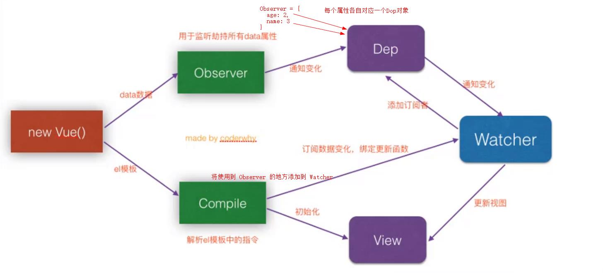

## 项目准备

#### 项目创建及托管

1. 使用 vue-cli-3 创建

```elm
vue create linshi
```

> 这里不要选择版本，vue3 以上的版本在[安装路由](https://blog.csdn.net/m0_46442996/article/details/108961492)等方面都与原先完全不同。

2. 在 GitHub 上创建一个仓库

> 可以选择一个 `MIT license`，先不创建 `README` 文件了，会和脚手架自带的冲突。

3. 在 `clone` 复制地址，在需要建项目文件的地方执行下面代码

```elm
git clone https://github.com/SpringLoach/mail.git
```

4. 手动将 `linshi` 中的 `.git` 以外的文件复制到 `mail`
5. 进入到 `mail` 中，可以查看文件状态

```elm
git status
```

6. 将文件添加到缓存区

```elm
git add .
```

7. 将文件添加到工作区

```elm
git commit -m '初始化项目'
```

8. 将文件添加到远程仓库

```elm
git push
```

9. 那么 `linshi` 这个文件夹就可以删除了

------

#### 配置Git的环境变量

1. 忘记 git 安装在哪

> 随便找个文件夹，右键打开 Git Bash，执行

```elm
where git
```

2. [环境配置](https://blog.csdn.net/Andone_hsx/article/details/87937329)

------

#### 划分目录结构

- src
  - assets
    - img
    - css
  - components
    - commom
    - content
  - views
  - router
  - store
  - network
  - commom
    - const.js
    - utils.js
    - mixin.js
  - App.vue
  - main.js

| 文件       | 作用                     |
| ---------- | ------------------------ |
| components | 公共组件文件夹           |
| common     | 不同项目通用组件         |
| content    | 和当前业项目业务相关组件 |
| views      | 对应的视图组件文件夹     |
| router     | 路由相关                 |
| store      | 状态相关                 |
| network    | 网络相关                 |
| commom     | 公共的 js 文件           |
| const.js   | 公共常量                 |
| utils.js   | 公共方法                 |
| mixin.js   | 混入                     |

#### 初始化样式

- css
  - normalize.css
  - base.css

1. 添加 `normalize.css`

> 一个常用的对 css 进行规范的文件，可以对标签风格进行统一。

在[github](https://github.com/necolas/normalize.css)的 `Download` 上右键链接另存为。

2. 拷贝 `base.css`

> 就直接从项目那拿过来了，它已经引用了 `normalize.css`。

```react
/* App.vue */
@import "./assets/css/base.css";
```

#### 别名及代码风格规范

- 项目文件
  - vue.config.js
  - .editorconfig

`vue.config.js` 可以将配置整合到默认配置上。

```react
module.exports = {
  configureWebpack: {
    resolve: {
      alias: {
        'assets': '@/assets',
        'commom': '@/commom',
        'components': '@/components',
        'network': '@/network',
        'router': '@/router',
      }
    }
  }
}
```

:snowflake: 使用别名：在 HTML 中需要加 `~` 前缀、在 export 时则不用加。

较高版本的脚手架中，没有 `.editorconfig` 这个文件，从项目拷贝。

#### tabbar的引入

将之前做的小项目 `tabbar` 中的两个文件夹引进。由于 `MainTabBar.vue` 中用于将图片和文字插入组件，将其归属为不可复用的业务组件；而 `tabber` 不关心嵌入的内容，属于真正封装的组件。

- components
  - commom
    - tabber
      - TabBar.vue
      - TabBarItem.vue
  - content
    - mainTabbar
      - MainTabBar.vue

```elm
npm install vue-router --save
```

1. 将 `MainTabBar.vue` 注册到 `App.vue` 并使用，注意**路径**。
2. 修改 `MainTabBar.vue` 中图片和引用的**路径**。
3. 将图片，router 下的 `index.js`，views 拿过来。

:bug: 经测试，vue-cli 在 4.5 版本中使用 `<keep-alive>` 和 `<router-view/>` 来[缓存组件](https://github.com/SpringLoach/Vue/blob/main/learning/section2.md#路由中使用keep-alive)是没问题的。

#### 更改文档图标

> 将项目文件中 `public` 下的 `favicon.ico` 更替为自己需要的图片。

`public` 下的 `index.html` 中使用了 `<%= BASE_URL %>` ，这是 jsp 的语法，用于动态获取路径，表示当前文件夹下。

------

## 首页

#### 首页_导航栏的封装和使用

> 需要搭建的项目中，每个页面都有顶部导航栏，有的只有文字，有的两侧有图片，甚至有动态属性，选项卡。此时封装需要考虑到拓展性，要预留插槽。

- commom
  - navbar
    - NavBar.vue

HTML

> 使用左中右三个具名插槽，分别定义样式。

CSS

> 在该组件中添加公共的样式。

采用 flex 布局，左右两个插槽固定宽度，中间插槽占据全部剩余宽度（`flex: 1`）；对整体设置水平居中并添加阴影效果。

- 顶部导航高度一般为 44 px，加上状态栏则为 64 px
- 对于块级元素，设置行高并添加了内容时，可以不加高度（等于行高），这样做可以垂直居中。

导入 `Home.vue` 中，并对该模块设置字体和背景颜色。

#### 首页_请求多个数据

将先前封装好的 `network` 中的 `request.js` 拉过来。

安装[axios](https://github.com/SpringLoach/Vue/blob/main/learning/section3.md#axios框架的基本使用)

为了减少耦合度，以及方便以后的管理，建立一个新的文件用于管理首页 `Home.vue` 的请求，这样就可以直接在 `Home.vue` 中添加异步处理了。

- network
  - home.js

```react
import {request} from "./request";

export function getHomeMulidata() {
  return request({
    url: '/home/multidata'
  })
}
```

将文件导入到 `Home.vue` 中。在首页组件创建好后请求数据，并将请求的数据保存到 `data` 中。

```react
import {getHomeMulidata} from "network/home"

data() {
  return {
    banners: [],
    recommends: []
  }
},
created() {
  getHomeMulidata().then(res => {
    this.banners = res.data.banner.list;
    this.recommends = res.data.recommend.list;
  })
}
```

#### 首页_轮播图的展示

将项目中的 `swiper` 拉过来。

- components
  - commom
    - swiper
      - index.js
      - Swiper.vue
      - SwiperItem.vue

其中的 `index.js` 将另外两个组件统一导出，这样在其它组件中使用时就不用导入两次了。

由于 `Home.vue` 只需关心功能的集结，轮播图的功能实现我们可以新建一个组件来完成，此时需要[从父组件获取数据](https://github.com/SpringLoach/Vue/blob/main/learning/section1.md#父子组件通信)。

- views
  - home
    - childComps
      - HomeSwiper

使用方法为 `swiper` （预留了插槽）包围 `swiper-item` 。由于有多个轮播图，可以直接[遍历](https://github.com/SpringLoach/Vue/blob/main/learning/section1.md#v-for遍历数组和对象)数组。轮播图可以实现链接的功能，所以用 `<a>` 包围 ``。

```react
<swiper>
  <swiper-item v-for="item in banners :key="item.title">
    <a :href="item.link">
      
    </a>
  </swiper-item>
</swiper>

/* 新增 option */
props: {
  banners: {
    type: Array,
    default() {
      return []
    }
  }
}
```

最后注册到父组件并在使用时传递数据就可以了。

#### 首页_推荐信息的展示

- views
  - home
    - childComps
      - RecommendView.vue

导入 `home.vue` 并从父组件请求数据；

```react
<div class="recommond">
  <div v-for="item in recommends">
    <a :href="item.link">
      
      <div>{{item.title}}</div>
    </a>
  </div>
</div>
```

:snowflake: 给所有弹性项目加上 `flex: 1` 可以做到在一行内均等分布。

#### 首页_特性类别的展示

- views
  - home
    - childComps
      - FeatureView.vue

```react
<div class="feature">
  <a href="https://act.mogujie.com/zzlx67">
    
  </a>
</div>
```

然后把置顶和置底的导航栏的固定以及遮蔽问题解决 `positon: sticky`。

#### 首页_表格切换控制的封装

- components
  - content
    - tabControl
      - TabControl.vue

由于这个组件在不同页面使用时，仅文字不同。不包含图片、ul、不同布局。建议不用插槽，而是可以直接从父组件获取数据，使用 `v-for` 根据数量创建。

需要动态添加一个激活的类样式

```react
<div class="tab-control">
  <div v-for="(item, index) in titles"
      class="tab-control-item"
      :class="{active: index=== currentIndex}" @click="itemClick(index)" >
    <span>{{item}}</span>
  </div>
</div>

data() {
  return {
    currentIndex: 0;
  }
},
methods: {
  itemClick(index) {
    this.currentIndex = index;
  }
}
```

由于并非所有页面中都有粘连顶部的功能，所以将这个样式设置到 `home.vue` 中。

:snowflake: 在向页面导入其它组件时，可以按私有组件、公用组件、插入数据的顺序进行排序。

#### 首页_保存商品的数据结构

> 考虑到切换表格时还有进行加载会给用户带来不好的体验，先将不同表格的前面一部分直接请求下来，只有下拉加载更多时，才会继续请求数据。

goods：（流行/新款/精选）

其中 `page` 用于记录当前的页数，`list` 用于记录已经加载的数据。

```react
goods: {
  'pop': {page: 5, list: [150]},
  'new': {page: 2, list: [60]},
  'sell': {page: 1, list: [30]}
}
```

初始化

```react
/* Home.vue */
data() {
  return {
    goods: {
      'pop': {page: 0, list: []},
      'new': {page: 0, list: []},
      'sell': {page: 0, list: []}
    }
  }
}
```

#### 首页_商品数据的请求和保存

封装请求并在 `Home.vue` 导出，只要传入特定的 `type` 和 `page` 就可以请求到对应的数据了。

```react
/* Home.js */
export function getHomeGoods(type, page) {
  return request({
    url: '/home/data',
    params: {
      type,
      page
    }
  })
} 
```

请求的时机应该是组件创建好之后 `created`，这里把这里的方法封装到了 `methods` 选项中。

- 由于接口的设计，请求下一页只需要在当前请求页的基础上加一即可。
- 进行数组合并将请求的数据添加到之前的数据中。
- 请求结束后当前请求页 +1。

```react
created() {
  this.getHomeMultidata();
  this.getHomeGoods('pop');
  this.getHomeGoods('new');
  this.getHomeGoods('sell');
},
methods: {
  getHomeMultidata() {
    getHomeMultidata().then(res => {
      this.banners = res.data.banner.list;
      this.recommends = res.data.recommend.list;
    })
  },
  getHomeGoods(type) {
    const page = this.goods[type].page + 1;
    getHomeGoods(type, page).then(res => {
      this.goods[type].list.push(...res.data.list);
      this.goods[type].page += 1;
    })
  }
}
```

#### 首页_商品数据的展示

> `GoodsList.vue` 从父组件获取 `list` 数据；`GoodsListItem.vue` 则从父组件获取 list 中每一个具体的 `对象`。

- components
  - content
    - goods
      - GoodsList.vue
      - GoodsListItem.vue

:snowflake: 仅当需要复用的组件结构不同时，采用插槽。仅数据不同时，不必使用。

#### 商品数据的展示_样式

1. 采用弹性布局时，要保证元素之前是直接的父子关系，所有 `v-for` 要直接用到组件上。
2. 设置[文本溢出](https://www.w3school.com.cn/tiy/t.asp?f=css3_text-overflow)效果。
3. 设置图片[固定宽高比](https://blog.csdn.net/qq_26173001/article/details/102770651)。
4. 利用弹性布局设计两栏效果。

```css
.goods-list {
  display: flex;
  flex-wrap: wrap;
  justify-content: space-around;
  padding: 3px;
}
.list-item {
  width: 48%;
}
```

#### 首页_TabControl切换商品

> 当点击不同的分类时，切换对应的展示数据。

将点击的索引值[传给父组件](https://github.com/SpringLoach/Vue/blob/main/learning/section1.md#父子组件通信)，并判断具体需要展示的数据，再通过计算属性 `showGoods` 保存需要展示的数据。

```react
/* TabControl.vue */
methods: {
  itemClick(index) {
    this.$emit('tabClick', index)
  }
}
```

#### 实现手机端浏览

使手机和电脑连接在同一个 wifi 下，通过电脑的 [IPv4](https://jingyan.baidu.com/article/6079ad0e58c8c369ff86db9c.html) 地址加上 `:8080/home` 即 `localhost` 后面的那段即可连接。

#### Better-scroll

##### Better-scoll的安装和使用

> 这个框架提供给了移动端更顺滑的滚动能力（减少了卡顿，拖拽增强，提供了弹簧效果）。

安装

```elm
/* 项目文件下 */
npm install --save better-scroll@1.13.2  
```

:bug: 如果出现找不到声明文件的错误，尝试卸载重装最新版本并重新打开 `VS Code`。

使用测试 /* Category.vue */

```react
import BScroll from 'better-scroll'

data() {
  return {
    scroll: null
  }
},
mounted() {
  this.scroll = new BScroll(document.querySelector('.wrapper'), {})
}

/* CSS */
.wrapper {
  background-color: skyblue;
  height: 200px;
  overflow: hidden;
}
```

:bug: 不能在 `created` 的处理程序中获取元素，此时尚未渲染。
:snowflake: 必须对挂载元素设置一个高度。

##### Better-scroll的基本使用

> BScroll 实例至少需要接受一个元素作为容器元素，在旧版本中这个容器内的第一个元素会被添加上相应的功能，新版本中添加了[更多功能](https://better-scroll.gitee.io/docs/zh-CN/guide/base-scroll-options.html)。

第二个参数为一个对象，可以在其中配置一些 option

| 选项       | 说明                                                         |
| ---------- | ------------------------------------------------------------ |
| probeType  | 设置位置侦测，值为 3 时侦测所有滚动                          |
| click      | 设置为 true 时，除了 button 元素外，还监听浏览器的原生 `click` 事件 |
| pullUpLoad | 设置为 true 时，监听 `pullingUp` 事件，滚动到底部时发生      |

```react
/* 引入文件后 */
const bscroll = BetterScroll.createBScroll(document.querySelector('.wrapper'), {
  probeType: 3,
  click: true,
  pullUpLoad: true
})

bscroll.on('scroll', (position) => {
  console.log(position);
})

bscroll.on('pullingUp', () => {
  console.log("加载更多");
  setTimeout(() => {
    bscroll.finishPullUp()
  }, 2000)
})
```

:snowflake: 该实例的 `on` 方法接受一个事件和处理程序。
:snowflake: 默认情况下，滚动到底部的处理程序只会执行一次，除非调用了该实例的 `finishPullUp()` 的方法，该方法通常在新的数据展示完成后调用。

##### Better-scroll的封装和使用

- commom
  - scroll
    - Scroll.vue

```react
<div class="wrapper" ref="wrapper">
  <div class="content">
    <slot></slot>
  </div>
</div>

import BScroll from 'better-scroll'

data() {
  return {
    scroll: null
  }
},
mounted() {
  this.scroll = new BScroll(this.$refs.wrapper, {
    observeDOM: true,
    click: true
  })
}
```

:snowflake: `ref` 绑定在组件中时，`this.$refs.refname` 获取到的是一个[组件对象](https://github.com/SpringLoach/Vue/blob/main/learning/section1.md#父访问子)； `ref` 绑定在元素中时，获取到的则是当前组件中的该元素。

导入并使用该组件，并根据需求设置高度

```react
/* Home.vue */
<scroll class="content">
  // 顶部导航栏和底部导航栏以外的内容
</scroll>
```

定义的样式仅在当前组件中起作用

```react
<style scoped>
.content {
  height: calc(100vh - 44px - 49px);
}
</style>
```

:snowflake: `calc()` 为 CSS3 中新增的计算值，`vh` 表示视口高度。
:snowflake: 此时，滚动距离不能正常计算，`stricky` 失去作用。

#### 回到顶部

> 在页面上展现一个固定于视口的按钮，拥有返回顶部的功能。

- content
  - backTop
    - BackTop

```react
<div class="back-top">
   
</div>
```

当发生点击事件时，要调用 `scroll` 组件中 `scroll` 属性的 `scrollTo()` 方法。

```react
/* Home.vue */
<scroll ref="scroll">
...
<srcoll>
<back-top @click.native="backClick"/>

backClick() {
  this.$refs.scroll.scroll.scrollTo(0, 0, 300)
}
```

:palm_tree: 修饰符 `native`：监听组件根元素的原生事件。
:snowflake: 方法相当于访问子组件的 scroll 属性，并调用它的 `scrollTo()` 方法进行滚动。
:bug: 调试时不要用鼠标滚轮，会出现奇怪的现象。

#### 回到顶部的显示和隐藏

> 回到顶部的组件，我们希望它在滑动一定距离后才显示，这时候我们希望在 `Home.vue` 能实时监听滚动的位置。

由于使用了 `better-scroll` 管理这部分组件，所以在它的实例中获取滚动位置。并由使用它的组件决定是否监听滚动。

```react
/* Scroll.vue */
props: {
  probeType: {
    type: Number,
    default: 0
  }
},
mounted() {
  this.scroll = new BScroll(this.$refs.wrapper, {
    probeType: this.probeType
  }),
  this.scroll.on('scroll', (position) => {
    this.$emit('scroll', position)
  })
}


/* Home.vue */
<scroll :probe-type="3" @scroll="contentScroll">
<back-top v-show="isShowBackTop">

data() {
  return {isShowBackTop: false}
}
methods: {
  contentScroll(position) {
    this.isShowBackTop = (-position.y) > 1000
  }
}
```

:cyclone: 自定义属性前要加上的 `:`，否则默认传入类型为字符串。

#### 滚到底部加载更多

> 由父组件决定是否监听上拉到底事件。

```react
/* Scroll.vue */
props: {
  pullUpLoad: {
    type: Boolean,
    default: false
  }
},
mounted() {
  this.scroll = new BScroll(this.$refs.wrapper, {
    pullUpLoad: this.pullUpLoad
  }),
  this.scroll.on('pullingUp', () => {
    this.$emit('pullingUp')
  })
}

/* Home.vue */
<scroll :pull-up-load="true" @pullingUp="loadMore">

methods: {
  loadMore() {
    this.getHomeGoods(this.currentType)
  }
}
```

:herb: 在 `mounted` 中使用 `if` 语句时，不能在前后加上 `,`

当数据加载完成后，需要调用实例的 `finishPullUp()` 方法**重新监听下拉事件**。

```react
getHomeGoods(type) {
  ....then(res => {
    ... 
    this.$refs.scroll.scroll.finishPullUp()
  )}
}
```

#### 滚动高度的重新计算

> 由于图片等资源是异步加载的，`BetterScroll` 在计算滚动高度时，可能会不足实际高度，导致一些不良体验。这时可以在图片加载后，调用 `BetterScroll` 的 refresh 方法来重新计算可滚动的宽度或者高度。

启用observeImg

```react
/* Scroll.vue */
mounted() {
    this.scroll = new BScroll(this.$refs.wrapper, {
        observeDOM: true,
        observeImg: true,
    }),
}
```

:palm_tree: 该插件[新增](https://better-scroll.gitee.io/docs/zh-CN/plugins/observe-image.html#介绍)于 2.1 版本，但也有[失灵](https://better-scroll.gitee.io/docs/zh-CN/FAQ/diagnosis.html)的可能。

##### 也可以手动重新计算

> 由于需要传递和接受事件的两个组件之间的关系比较远，可以在原型上添加事件总线。

```react
/* main.js */
Vue.prototype.$bus = new Vue()

/* GoodsListItem.vue */


methods: {
  imageLoad() {
    this.$bus.$emit('itemImageLoad')
  }
}

/* Home.vue */
mounted() {
  this.$bus.$on('itemImageLoad', () => {
    this.$refs.scroll.scroll.refresh();
  })
}
```

:herb: `this.$refs` 不能写到 `created` 中。
:snowflake: `.$bus.$emit()` 也可以传入第二个参数进行传递。

#### 防抖函数的处理

> 为了避免多次执行 `BetterScroll` 的 refresh 方法而影响性能，在这里可以建立一个防抖函数。这里针对的是上一节中手动刷新的补充。

- common
  - utils.js

```react
export function debounce(func, delay) {
  let timer = null;
  return function(...args) {
    if(timer) clearTimeout(timer);
    timer = setTimeout(() => {
      func.apply(this, args);
    }, delay)
  }
}
/* Home.vue */
import {debounce} from "common/utils"

mounted() {
  const refresh = debounce(this.$refs.scroll.scroll.refresh, 200)
  this.$bus.$on('itemImageLoad', () => {
    refresh()
  })
}
```

:herb: `func.apply(this, args)` ，在[当前函数](https://blog.csdn.net/business122/article/details/8000676)中使用 func 方法。
:snowflake: `clearTimeout()` 的作用是取消定时函数的执行。

##### 作用机理推测

- 因为有引用关系，故父作用域中的 `timer` 不会被销毁，而且每次都能被赋值为上一个定时函数并保留。
- 而每次调用方法中的 `timer` ，应该是从上一级作用域中获取到的。

```react
/* 首次 */
function(...args) {
  /* 父作用域 timer = null  */
  if(timer) clearTimeout(timer);
  timer = setTimeout(() => {
    func.apply(this, args);
  }, 200)
}()
    
/* 第二次 */    
function(...args) {
  /* 父作用域 timer = 上一个定时函数  */
  if(timer) clearTimeout(timer);
  timer = setTimeout(() => {
    func.apply(this, args);
  }, 200)
}()
```

#### TabControl的吸顶效果

> 由于使用了 `better-scroll` 进行管理，本质上是对 content 改变了 `transfrom`，会导致其内部元素的 `fixed` 定位失效。

:herb: 由于轮播图每次的加载都较慢，所以直接监听它的加载...

```react
/* HomeSwiper.vue */


data() {
  return {
    isLoad: false
  }
},
methods: {
  imageLoad() {
    if(!this.isLoad) {
      this.$emit('swiperImageLoad');
      this.isLoad = true;
    }
  }
}

/* Home.vue */
<home-swiper @swiperImageLoad="swiperImageLoad"/> 
<table-control ref="tabControl"/>

data() {
  return {
    tabOffsetTop: 0
  }
},
methods: {
  swiperImageLoad() {
    this.tabOffsetTop = this.$refs.tabControl.$el.offsetTop;
  }
}
```

:herb: 通过控制，使自定义事件只发出一次，这是一种节流方式。
:snowflake: 组件都有一个 `$el` 属性，用于获取组件中的元素。
:snowflake: 在挂载后，图片未必完成加载，也就是说在 `mounted` 中获取的 offsetTop 不一定准确。
:palm_tree: offsetTop： 元素到 offsetParent 顶部的距离 P473

监听滚动，动态地改变 TabControl 的样式

```react
/* Home.vue */
data() {
  return {
    isTabFixed: false
  }
},
methods: {
  contentScroll(position) {
    this.isTabFixed = (-position.y) > (this.tabOffsetTop - 44)
  }
}
```

1. 将 `<table-control>` 拷贝到 `<scroll>` 以外。
2. 给新拷贝组件加上上边距 / 去除顶部导航栏的 `fixed` 定位来回到标准流也行，此时它已经不会跟随滚动。
3. 给新拷贝组件加上 `class="tab-control2"`，并给类设置 `position: relative; width: 100%;`
4. 给新拷贝组件加上 `v-show="isTabFixed"`
5. 改新拷贝组件 `ref="tabControl1"`，改原组件 `ref="tabControl2"`。
6. 同样要把先前方法 `swiperImageLoad()` 中的 `tabControl` 改为 `tabControl2`。
7. 在方法 `tabClick()` 中加上 `this.$refs.tabControl1.currentIndex = index; this.$refs.tabControl2.currentIndex = index;`，实现同步状态。

[另一个思路](https://github.com/ustbhuangyi/better-scroll/issues/1030)

#### 首页_离开时记录状态和位置

```react
/* App.vue */
<keep-alive>
  <router-view/>
</keep-alive>
```

但偶尔会有丢失位置的问题，下面的方法可以减少这种情况，但再加载时切换跳转，可能还是会回到顶部..某些版本的 better-scroll 这个问题更严重。

```react
/* Home.vue */
data() {
  return {
    saveY: 0
  }
},
activated() {
  this.$refs.scroll.scroll.refresh();
  this.$refs.scroll.scroll.scrollTo(0,this.saveY,0);
},
deactivated() {
  this.saveY = this.$refs.scroll.scroll.y
}
```

#### 首页_拖动底部导航栏丢失位置的问题

> 在 `App.vue` 给 `#app` 加上 `overflow: hidden` 。

------

#### 跳转到详情页

> 可以把详情页看作一个单独的视图，点击时通过路由跳转。

- views
  - detail
    - Detail.vue

由于商品存在不同的 ID，可以使用[动态路由](https://github.com/SpringLoach/Vue/blob/main/learning/section2.md#动态路由的使用)并将 ID [传入](https://github.com/SpringLoach/Vue/blob/main/learning/section2.md#vue-router参数传递)详情页组件中。

```react
/* GoodsListItem.vue */
<div class="list-item" @click="itemClick">

methods: {
  itemClick() {
    this.$router.push('/detail/' + this.good.iid);
  }
}

/*  Detail.vue */
data() {
  return {
    iid: null
  }
},
created() {
  this.iid = this.$route.params.iid
}
```

:cyclone: 因为是切换组件而不是单纯的切链接嘛，采用的是[通过代码跳转路由](https://github.com/SpringLoach/Vue/blob/main/learning/section2.md#通过代码跳转路由)的方式。
:bug: 由于缓存了路由，`created` 内只记录第一次传入的 iid 。

## 详情页

#### 详情页_导航栏的封装

> 由于详情页的导航栏有些设计，故对这块创建一个组件，然后引入到 `Detail.vue` 中。

- detail
  - childComps
    - DetailNavBar.vue

1. 将 `NavBar.vue` 引入到 `DetailNavBar.vue` 中。
2. 中间的插槽的使用：将数据以数组形式记录到 `data` 中并在 HTML 中遍历，然后动态添加 `active` 类。
3. 左边插槽将图片[居中](https://github.com/SpringLoach/Vue/blob/main/learning/section3.md#tabber)后，添加回退的功能。

#### 详情页_数据请求以及轮播图的展示

> 先请求数据，将请求到的数据筛选保存在 `Detail.vue`，然后创建一个详情页的轮播图组件获取数据并展示，然后导出到 `Detail.vue` 中，最后到 `APP.vue` 的缓存组件中[排除](https://github.com/SpringLoach/Vue/blob/main/learning/section2.md#路由中使用keep-alive)详情页组件。

- network
  - detail.js

```react
import {request} from "./request";

export function getDetail(iid) {
  return request({
    url: '/detail',
    params: {
      iid
    }
  })
}
/* Detail.vue */
data() {
  return {
    topImages: []
  } 
}
created() {
  getDetail(this.iid).then(res => {
    this.topImages = res.result.itemInfo.topImages
  })
}
```

- detail
  - childComps
    - DetailSwiper.vue

从父组件[获取数据](https://github.com/SpringLoach/Vue/blob/main/learning/section1.md#父子组件通信)后进行展示

```react
<swiper class="detail-swiper">
  <swiper-item v-for="item in topImages">
    
  </swiper-item >
</swiper>
```

:bug: 由于轮播图组件封装时的一些操作，导致其它组件中类名不能用 `swiper`。
:snowflake: 由于请求到的图片地址数量参差不齐，且都保存在数组中，故可以配合已经封装好的组件直接 `v-for` 遍历。

#### 详情页_请求数据筛选与其的稳定渲染

需要从父组件请求多个数据，且数据结构较为复杂时，可以先创建一个类，先把数据筛选一下，最终使用该类把数据都保存到实例对象中。

1. 在下面文件中创建一个 Goods 类，用于筛选数据。

- network
  - detail.js

1. 进行初筛并获取数据。

```react
/*  Detail.vue */
import {Goods} from 'network/detail'

data() {
  return {
    goods: {}
  }
},
created() {
  getDetail(this.iid).then(res => {
    ...
    const data = res.result;
    this.goods = new Goods(data.itemInfo, data.columns, data.shopInfo.services)
  })
}
```

1. 创建子组件展示商品的基本信息。

- detail
  - childComps
    - DetailBaseInfo.vue

```react
/* 部分解释 */

/* 仅当获取到数据后展示 */  
<div v-if="Object.keys(goods).length !== 0">

/* 遍历数组的第一项外的所有项 */
computed: {
  reservices() {
    return this.goods.services.slice(1);
  }
}
```

- 创建行内贴边对齐效果，对容器设置 `display: flex` 和 `justify-content: space-between` 即可，若对弹性项目设置 `flex: 1` 会导致冲突。
- 偏移行内图片，只需要对图片相对定位后稍移动即可。

#### 详情页_店铺信息的展示

1. 先在 `detail.js` 中建立一个类，用于创建的对象中包括店铺信息组件需要的数据。
2. 将数据请求并保存到详情页组件中。
3. 创建店铺信息组件，并从详情页组件（父组件）获取相应数据并展示。

- detail
  - childComps
    - DetailShopInfo.vue
- 使弹性项目在垂直方向沿中心对齐：父 `display: flex`、`text-align: center`、`align-items: center` 子 `flex: 1`。
- 使弹性项目两边间距相对：使用 `justify-content: space-evently`，但是这个新属性值的兼容性较差。

#### 详情页_加入滚动的效果

1. 改变层级关系，使 tabbar 被覆盖。

```less
#detail {
  position: relative;
  z-index: 9;
  background-color: #fff;
}
```

2. 利用 [betterscroll](https://github.com/SpringLoach/Vue/blob/main/learning/section4.md#Better-scroll的封装和使用) 添加滚动。

- 注册 Scroll 组件并使用到 `Detail.vue`
- 将需要滚动的内容放入 `<scroll>` 标签中
- 给 `<scroll>` 标签一个固定的高度

:herb: 此时 BS 会报错，`pullingUp` 事件未定义（就使用了)，可以在 `Detail.vue` 传值启用该事件。不过更正确的做法应该是用 `if` 将该事件的发射包围，仅当启用时发射，注意前后不能加 `,`

3. 给详情页的导航栏设置层级关系，使其靠近用户。

#### 详情页_商品图片数据的展示

1. 在 `Detail.vue` 中获取并保存商品的详情数据到 `detailGoodsInfo`。
2. 创建一个组件获取这些数据并展示。

- detail
  - childComps
    - DetailGoodsInfo.vue

3. 图片的加载会导致滚动高度计算错误，利用[新版本的better-scroll](https://github.com/SpringLoach/Vue/blob/main/learning/section4.md#滚动高度的重新计算)可以解决这个问题，但可能性能达不到最佳。

\#CSS

- 特殊样式的设计：向 `::before` 加上绝对定位，给它基于的元素加上相对定位可以微调位置。

#### 详情页_商品参数信息的展示

1. 先在 `detail.js` 中建立一个类，用于创建的对象中包括商品参数信息组件需要的数据。
2. 将数据请求并保存到详情页组件中。
3. 创建商品参数信息组件，并从详情页组件（父组件）获取相应数据并展示。

- detail
  - childComps
    - DetailParamInfo.vue

#### 详情页_商品评论信息的展示

1. 在 `Detail.vue` 中获取并保存商品评论信息数据。

   - 这里可以先判断评论信息是否为空，来决定是否将其保存到变量中。

2. 创建一个组件获取这些数据并展示。

- detail
  - childComps
    - DetailCommentInfo.vue

3. 注意从服务器返回的时间戳，要将其转化格式，有一个很常用的组件。

- src
  - common
    - utils.js

```react
/* DetailCommentInfo.vue */
computed: {
  commentCreate() {
    let date = new Date(this.commentInfo.created*1000);
    return formatDate(date, 'yyyy-MM-dd');
  }
}
```

:palm_tree: 可以在第二个参数即字符串中加入需要的格式。

#### 详情页_商品推荐的展示

1. 在相应的请求文件 `detail.js` 中新增请求方法，并将其导入到 `Detail.vue` 中。

```react
export function getRecommend() {
  return request({
    url: '/recommend'
  })
}
```

2. 在 `created` 钩子处调用请求并保存数据。

```react
/* Detail.vue */
getRecommend().then(res => {
  this.recommends = res.data.list
})
```

3. 调用之前封装好的 `GoodsList.vue` 组件，并将数据传入。

4. 由于获取图片的路径跟首页的不一样，需要在 `GoodsListItem.vue` 中稍作修改。

```react
computed: {
  showImage() {
    return this.product.image || this.product.show.img
    /* return (this.good.show && this.good.show.img) || this.good.image */
  }
}
```

:bug: 这里不能直接调转两个值的位置，据说是不能判断一个没有的东西里有没有另一个东西。
:bug: 用变量保存请求的数据时，不要设置成 `null` 或 `undefine` 的初始值，初始值类型设置错了与自定义属性的期望类型不一致也会报错。

#### 解决共用组件导致的首页频繁监听事件

> 这里针对的是由于在详情页复用了 `GoodsListItem.vue` 组件，会意外触发首页通过[手动刷新](https://github.com/SpringLoach/Vue/blob/main/learning/section4.md#滚动高度的重新计算)解决滚动高度的重新计算的问题。

- 方法一：发送自定义事件的控制。

```react
/* 需要修改发送事件的名称，同时针对详情页的图片加载问题 */
methods: {
  imgLoad() {
    if (this.$route.path.indexOf('/home') > -1){
      this.$bus.$emit('homeItemImgLoad')
    } else if (this.$route.path.indexOf('/detail') > -1) {
      this.$bus.$emit('detailItemImgLoad')
    }
  }
}
/* 然后在详情页接受第二个事件来决定什么时候重新计算滚动高度 */
```

- 方法二：事件处理程序的注销。
  - 选择在 `Home.vue` 的 `deactivated` 的回调中，执行注销，有点像 DOM 的事件处理程序。

```react
this.$bus.$off('ItemImgLoad', 要注销的函数)
```

#### 混入的简单使用

> 当在不同组件中需要用到一部分相同的组件选项时（包括钩子的回调），就可以用混入的方法，它会将选项中的操作合并。

- src
  - common
    - mixin.js

```react
export const itemListenerMixin = {
  mounted() {
    console.log("Hey,man");
    this.color = "blue";
  }
}
```

:herb: 在 `mixin.js` 中，可以用尚未在该文件定义的 `data`，但不能用尚未引入该文件的方法。

在需要混入的组件中，导入混入对象并将其添加到 `mixin` 选项。

```react
import {itemListenerMixin} from 'common/mixin'

data() {return{color: 'some'}},
mixin: [itemListenerMixin],
```

#### 详情页_主题跳转

1. 点击顶部导航栏时，向父组件传事件及参数。

```react
/* DetailNavBar.vue */
titleClick(index) {
  ...
  this.$emit('titleClick', index)
}
```

2. 在父组件监听事件添加跳转程序并标记需要定位的组件。

```react
/* Detail.vue */
<detail-nav-bar @titleClick="titleClick">
<scroll ref="scroll">
<detail-params-info ref="params">
<detail-comment-info ref="comment">
<goods-list ref="recommend">

data() {
  return { themeTopTs: [] }
},
methods: {
  titleClick(index) {
    this.$refs.scroll.scroll.scrollTo(0, -this.themeTopTs[index], 100)
  }
}
```

3. 获取滚动高度

a) 通过 better-scroll 的 `scrollToElement` 方法进行实现。

```react
data() {
  return { themeTopTs: ['swiper', 'params', 'comment', 'recommend'] }
},
methods: {
  titleClick(index) {
    this.$refs.scroll.scroll.scrollToElement(this.$refs[this.themeTopTs[index]].$el, 200);
  }
}
```

:bug: 当进入商品详情页的时候，马上点击主题，会因为瞬间加载好的图片导致定位失效。

b) 设置防抖功能，并在图片刷新时重新计算主题高度，这个事件是之前手动刷新滚动高度时设置的，我这儿没设置。

```react
data() {
  return { getThemeTopY: null }
},
created() {
  this.getThemeTopY = debounce(() => {
    this.themeTopTs = [];
    this.themeTopTs.push(0);
    this.themeTopTs.push(this.$refs.params.$el.offsetTop);
    this.themeTopTs.push(this.$refs.comment.$el.offsetTop);
    this.themeTopTs.push(this.$refs.recommend.$el.offsetTop);
  }, 100)
},
methods: {
  detailImageLoad() {
    this.getThemeTopY()
  }
}
```

c) 其它不能使用的方案

- 在 `created` 中不能获取，此时不能获取到元素。
- 在 `mounted` 中不能获取，此时可能还没请求到数据。
- 可以在 `updated` 的钩子中获取滚动高度，由于存在多次获取的可能，需要先重置数组，但此时图片可能没完全加载。
- 在获取数据的 `then` 处理程序中添加 `this.$nextTick()` ，并向其添加获取滚动的函数，它将在 DOM 渲染后进行回调，但此时图片可能没完全加载。

#### 详情页_滚动内容改变标题

1. 向 `scroll` 模块动态传入自定义属性的值开启实时监听，并监听滚动时的自定义事件。

```react
/* Detail.vue */
<scroll :probeType="3" @scroll="contentScroll">
```

2. 将 `DetailNavBar.vue` 中的 currentIndex 改为自定义属性，以便从 `Detail.vue` 中传值

```react
/* Detail.vue */
<detail-nav-bar :currentIndex="currentIndex">
data() {
  return { currentIndex: 0 }
}
```

3. 根据逻辑改变 `currentIndex` 的值。

```react
/* Detail.vue */
methods: {
  contentScroll(position) {
    let length = this.themeTopTs.length;
    let positionY =-position.y;
    for (let i = 0; i < length; i++) {
      if (this.currentIndex !== i && i < length-1 && this.$refs[this.themeTopTs[i]].$el.offsetTop <= positionY && positionY < this.$refs[this.themeTopTs[i+1]].$el.offsetTop) {
        this.currentIndex = i;
      } else if (this.currentIndex !== i && this.$refs[this.themeTopTs[i]].$el.offsetTop <= positionY) {
        this.currentIndex = i;
      }
    }
  }
}
```

:herb: 其中的 `this.currentIndex !== i` 用于减少多余的判断和赋值。
:herb: 也可以将各主题的滚动值推入数组，并在数组尾部推入一个最大值，简化逻辑。

##### 详情页_滚动内容改变标题_双向绑定

> 此时，自定义属性 `currentIndex` 既会被父组件改变，也会被子组件改变，会报错。

- 由于此时 `DetailNavBar.vue `中已经发送了自定义事件 `titleClick`，并由父组件接受。
- 将 `this.currentIndex = index;` 移动到自定义事件处理程序中即可，此时相当于只能由父组件改变自定义属性的值。

#### 详情页_底部工具栏的展示

> 这个组件不需要请求数据，但是要注意将其放在 `<scroll>` 标签之后，并减少 `<scroll>` 对应组件的高度，否则该组件会被挤出视窗。

- detail
  - childComps
    - DetailBottomBar.vue

#### 详情页_回到顶部

> 这个参考主页的[回到顶部](https://github.com/SpringLoach/Vue/blob/main/learning/section4.md#回到顶部)，复用之前的 `Scroll.vue` 组件，也可以选择将相应的代码[混入](https://github.com/SpringLoach/Vue/blob/main/learning/section4.md#混入的简单使用)。

#### 详情页_加购商品

> 感觉这里将 iid 传给购物车组件，然后让它请求相应的数据去展示会合理吧..

1. 点击时发出事件并传到详情页组件，将需要展示到购物车的商品数据保存到变量中。

```react
/* DetailBottomBar.vue */
<span @click="addToCart">加入购物车</span>

methods: {
  addToCart(){
    this.$emit('addCart');
  }
}


/* Detail.vue */
<detail-bottom-bar @addCart="addToCart"/>

methods: {
  addToCart(){
    const product = {};
    product.image = this.topImages[0];
    product.title = this.goods.title;
    product.desc = this.goods.desc;
    product.price = this.goods.nowPrice;
    product.iid = this.iid;
  }
}
```

2. 补充请求时 `detail.js` 中相应类获取到的数据，这里之前扒了。

#### Vuex

##### Vuex保存架构数据

> 首先得[安装](https://github.com/SpringLoach/Vue/blob/main/learning/section3.md#安装并配置Vuex)配置Vuex。

```react
/* 在 index.js 中添加状态及改变状态的方法 */
state: {
  cartList: []
},
mutations: {
  addCart(state, Payload) {
    let oldProduct = state.cartList.find(item => item.iid === Payload.iid)

    if (oldProduct){
      oldProduct.count += 1;
    } else {
      Payload.count = 1;
      state.cartList.push(Payload);  
    }
  }
}
```

在提交方法中改变状态

```react
/* Detail.vue */
methods: {
  addToCart(){
    ...
    this.$store.commit('addCart', product)
  }
}
```

##### Vuex代码的重构

> 根据官方的建议，逻辑判断相关的代码可以放在[actions属性](https://github.com/SpringLoach/Vue/blob/main/learning/section3.md#actions属性)中，真正的执行代码放到 `mutations` 中，但不这么做其实也没什么问题。

```react
mutations: {
  addCounter(state, payload) {
    payload.count += 1;
  },
  addToCart(state, payload) {
    payload.count = 1;
    state.cartList.push(payload);
  }
},
actions: {
  addCart(context, payload) {
    let oldProduct = context.state.cartList.find(item => item.iid === payload.iid);
    
    if (oldProduct){
      context.commit('addCounter', oldProduct)
    } else {
      context.commit('addToCart', payload)  
    }
  }
}
```

届时要把之前的调用方式改一下。

```react
/* Detail.vue */
methods: {
  addToCart(){
    ...
    this.$store.dispatch('addCart', product)
  }
}
```

然后可以进行[结构的重构](https://github.com/SpringLoach/Vue/blob/main/learning/section3.md#vue-store目录组织)。

------

## 购物车

#### 购物车_导航栏的实现

> 在 Cart.vue 中添加 NavBar.vue 组件，并填充相应的插槽。

```react
<nav-bar>
  <div slot="center">购物车({{$store.state.cartList.length}})</div>
</nav-bar>
```

##### 购物车_导航栏的其它实现方法_mapGetters辅助函数

> 因为购物数量这个数据较复杂且多处使用，可以使用 `getters` 属性。而 mapGetters 辅助函数仅仅是将 store 中的 getter 映射到局部计算属性。

定义 getters 属性并导入到 `index.js` 中

- store
  - getters.js

```react
export default {
  cartLength(state) {
    return state.cartList.length;
  },
  cartList(state) {
    return state.cartList
  }
}
```

使用

```react
/* Cart.vue */
import { mapGetters } from 'vuex'

/* 使用对象展开运算符将 getter 混入 computed 对象中 */
computed: {
  ...mapGetters([
    'cartLength',
    'cartList'
  ])
}

/* 如果需要将 getter 属性另取一个名字，使用对象形式 */
computed: {
  ...mapGetters({
  cartLength: 'Length'
  })
}
```

#### 购物车_获取列表数据及滚动管理

1. 通过 mapGetters 在 `CartList.vue` 中引入需要的数据，并将其展示到购物车组件。

- cart
  - childComps
    - CartList.vue

2. 通过 [better-scroll](https://github.com/SpringLoach/Vue/blob/main/learning/section4.md#Better-scroll的封装和使用) 控制该组件的滚动。

3. 创建新的组件用于从 `CartList.vue` 中获取并展示每个商品的数据。

- cart
  - childcomps
    - CartListItem.vue

#### 购物车_商品列表的展示

在 `CartList.vue` 中进行商品的布局展示，并在其注册一个子组件用于展示选择按钮，并通过自定义属性 `isChecked` 决定选择按钮的哪种样式。

- components
  - content
    - checkButton
      - CheckButton.vue

#### 购物车_刷新滚动高度

> 由于对购物车组件添加了缓存，故每次进入该页面时需重新计算滚动高度。

```react
/* Cart.vue */
<scroll ref="scroll">

activated() {
  this.$refs.scroll.scroll.refresh();
}
```

#### 购物车_按钮的状态改变

> 开发中，这种情况不能直接改变状态，而是应该先改变对象模型，再由模型改变状态。

```react
/* mutations.js */
addToCart(state, payload) {
    payload.checked = false;
    ...
}

/* CartListItem.vue */
<check-button :is-checked="product.checked" @click.native="checkClick">

methods: {
  checkClick() {
    this.product.checked = !this.product.checked;
  }
}
```

#### 购物车_底部结算栏的展示

> 底部结算栏的高度为 40px，我用了 50px，由于需要占据额外的空间，得把可滚动区域减去相应的高度。

- cart
  - childComps
    - CartBottomBar.vue

这里可以利用 `item.checked` 使用数组方法 `filter` 和 `reduce` 进行求值。

#### 购物车_全选按钮的状态管理

> 给按钮加上自定义属性后，先判断购物车长度，如果购物车非空，且全部商品都被选中，则改变状态。
>
> 数组方法 `some` 如果任一元素返回 true, 则返回 true。

#### 购物车_全选按钮的状态控制

> 添加组件的点击事件，先判断购物车是否为空，全选时，改为全部不选，否则，改为全选。
>
> 数组方法 `forEach` 用于遍历数组元素并进行修改。

#### 加购消息的基本逻辑

> 正常情况下，应该是等到商品成功添加到状态后，再向用户反馈加购的消息。

可以将 action 中的 `addCart` 方法用[期约包装并返回](https://github.com/SpringLoach/Vue/blob/main/learning/section3.md#actions属性)，这样 `Detail.vue` 中调用该方法就能得到一个期约，并再其后添加需要的处理程序。

#### Toast

##### Toast的普通封装

> Toast 指的是冒出来后又很快消失的消息，就如上面的加购消息。

- components
  - commom
    - toast
      - Toast.vue

使用自定义属性来传入需要展示的信息并决定 Toast 是否展示，由 `addCart` 的处理程序来控制展示。

```react
/* Detail.vue */
...
this.$store.dispatch('addCart', product).then(res => {
  this.message = res;
  this.showToast = true;
  setTimeout(() => {
    this.message = '';
    this.showToast = false;
  }, 1200)
})
```

##### Toast的插件封装

- components
  - commom
    - toast
      - index.js

```react
/* index.js */
import Toast from './Toast'

const obj = {}

obj.install = function (Vue){
  // 1. 创建组件构造器
  const toastConstructor = Vue.extend(Toast)
  
  // 2. 根据组件构造器创建一个组件对象
  const toast = new toastConstructor()
  
  // 3. 将组件对象，手动挂载到新建 div 元素上
  toast.$mount(document.createElement('div'))
  
  // 4. 将刚建的 div 元素添加到文档
  document.body.appendChild(toast.$el)
  
  // 5. ...添加到原型
  Vue.prototype.$toast = toast;
}

export default obj
```

> [创建组件构造器](https://github.com/SpringLoach/Vue/blob/main/learning/section1.md#组件基本步骤)需要传入一个对象。
>
> 组件对象将替换挂载元素。

安装 toast 插件，它会自动调用它的 `install` 方法并传入 Vue 作为参数。

```react
/* main.js */
import toast from 'components/commom/toast'

Vue.use(toast)
```

此时不需要在 `toast.vue` 中使用自定义属性，而是可以给它创建一个方法。

```react
/* toast.vue */
data() {
  return {
    message: '',
    isShow: false
  }
},
methods: {
  show(message, duration=1200) {
    this.isShow = true;
    this.message = message;
    
    setTimeout(() => {
      this.isShow = false;
      this.message = '';
    }, duration)
  }
}

/* CSS */
.toast {
  z-index: 22;
}
```

调用方法如下

```react
/* Detail.vue */
...
this.$store.dispatch('addCart', product).then(res => {
  this.$toast.show(res)
})
```

## 优化

#### 解决移动端300ms延迟——fastclick

> 移动端为了检测双击，会在点击后有一段延迟时间，可以使用该插件解决这个问题，高版本的 Chrome 不需要该插件。

安装

```elm
/* 项目文件下 */
npm install fastclick --save
```

配置

```react
/* main.js */
import FastClick from 'fastclick'

FastClick.attach(document.body);
```

#### 图片懒加载——vue-lazyload框架

> 用于在应用程序中延迟加载图像的 Vue 模块。

安装

```elm
/* 项目文件下 */
npm install vue-lazyload --save
```

配置

```react
/* main.js */
import VueLazyLoad from 'vue-lazyload'

Vue.use(VueLazyLoad)
```

使用

```react

    | |
     V

```

\#使用占位图

> 在配置时加上[选项](https://github.com/hilongjw/vue-lazyload#constructor-options)。

```react
Vue.use(VueLazyLoad, {
  loading: require('./assets/img/common/placeholder.png')
})
```

#### px2vw转化插件

> PostCSS 的一个[插件](https://github.com/evrone/postcss-px-to-viewport)，它从像素单位生成视口单位。

安装

```elm
/* 项目文件下 */
npm install postcss-px-to-viewport --save-dev
```

在相关的配置文件下，添加配置

```
/* postcss.config.js */
```

- 一般以 iPhone6(750*1334) 的标准作为设计稿（viewportWidth：375；viewportHeight：667）
- 将 ignore 添加到 `selectorBlackList` 选项方便管理需要忽视样式的元素。
- 选择类名的范围也包括添加了 `scrope` 属性的 <script>

## 部署上线

#### 项目在window下的部署

> 一般项目完成后，会有测试，然后就是打包，最后部署到服务器。

**服务器**通常就是一台没有显示器的电脑，24小时开机，能为用户提供服务，中小型公司一般没有自己的服务主机。

主机需要相应的操作系统，大多数使用 `Linux`，也有部分公司使用 `Windows`。

一般会在电脑上安装对应的服务软件（也被称作服务器）:`tomcat` 或 `nginx`。

\#调试

1. 在[官网](https://nginx.org/)下载 nginx/Windows 的稳定版。

| nginx版本        | 说明       |
| ---------------- | ---------- |
| Mainline version | 开发版     |
| Stable version   | 最新稳定版 |
| Legacy versions  | 历史稳定版 |

2. 解压（注意路径最好不要有中文），双击 `nginx.exe`，并在浏览器输入 `localhost` 进行测试（是否展示 nginx 欢迎界面）。

> 如果是学习的话，信息服务管理器可能会占用端口，停止即可。

\#部署项目

> 可以有两种方式来部署项目。

a）

1. 将 `html` 文件夹下的文件删除，再将项目的打包文件拷贝到该文件夹下，并将打包项目下的文件再拷贝到 `html` 文件夹下。
2. 此时在浏览器输入 `localhost` 部署的就是项目了。

b）

1. 打开解压后文件夹下的 `nginx.conf` 并进行配置。

```
location / {
    root    dist;
    index    index.html  index.htm;
}
```

2. 打开任务管理器结束 `nginx` 的进程。

> 这里也可以使用命令行，进入到解压后文件夹下使用命令。

| 作用 | 命令              |
| ---- | ----------------- |
| 启动 | `nginx`           |
| 停止 | `nginx -s stop`   |
| 重启 | `nginx -s reload` |

3. 双击 `nginx.exe`，并在浏览器输入 `localhost` 部署的就是项目了。

#### 项目在远程Linux下的部署

> 使用的是 `nginx` 的软件，可以借助软件 `SecureCRT` 和 `WinSCP` 通过命令行和文件[连接服务器](https://www.bilibili.com/video/BV15741177Eh?p=229)。

学习 Linux 通常使用的操作系统：`ubuntu`，将 Linux 作为服务器时通常使用的操作系统：`centos`。

## 其他

#### 响应式原理的相关技术

```react
<div id="app">
  {{message}}
  {{name}}
  {{message}}
  {{name}}
</div>

<script src="https://unpkg.com/vue@next"></script>
<script>
  const app = new Vue({
    el: '#app',
    data: {
      message: '静夜思',
      name: '李白'
    }
  })
</script>
```

1. 当 app.message 的值被修改时，Vue 内部是如何监听到该变化的。
   - Object.defineProperty -> 监听劫持对象属性的改变
2. 当值被修改时，Vue 是怎么知道哪些地方需要变化，且让它们在界面刷新的。
   - 发布订阅者模式

#### 通过Object.defineProperty监听对象属性的改变

> 这一小节的部分先忽视 `/* */` 中的内容。

```react
<script>
  // 1. 定义到 Vue 中的所有属性会被它内部的一个 Observer 对象获取
  const obj = {
    message: '静夜思',
    name: '李白'
  }
  
  // 2. 取出该对象的所有键值对  
  Object.keys(obj).forEach(key => {
    let value = obj[key];
    
    /* 创建一个 Dep 实例 */
    /* const dep = new Dep() */
    
  // 3. 通过下面方法重新定义 obj 对象中的属性，来达到监听的目的。  
    Object.defineProperty(obj, key, {
      set(newValue) {
        console.log('监听到' + key + '对应值的改变');
        value = newValue;
        /* dep.notify(); */
      },
      get() {
        console.log('获取了' + key + '对应的值');
        /* 监听到调用者并用其创建新的 Watch 对象 */
        /* const w1 = new Watch('调用者 A') */
        /* 然后将其作为订阅者添加到 dep */
        /* dep.addSub(w1) */
        return value;
      }
    })
  })
  
  // 4. 当改变属性值时，会调用 `set()`
  obj.name = "杜甫";
  
  // 5. 当获取属性值时，会调用 `get()`
  obj.name;
</script>
<div id="app">
  // 这些地方调用 obj 对象的值，会调用 `get()`
  {{message}}  
  {{name}}
  {{message}}
  {{name}}
</div>
```

#### 发布订阅者

> 调用者会被 `get()` 收集，并订阅属性的 `set()` 方法

```react
// 发布者  
class Dep {
  constructor() {
    this.sub = []
  }
  addSub(watch) {
    this.subs.push(watch)
  },
  notify() {
    this.subs.forEach(item => {
      item.update();
    })
  }
}

// 订阅者  
class Watch {
  constructor(name) {
    this.name = name;
  }
  update() {
     console.log(this.name + '进行updata');
  }
}
```

:palm_tree: dependency：依赖
:palm_tree: subscribe：订阅



#### 其它补充

在详情页通过路由跳转详情页，默认不会刷新页面，此时可以改变[缓存策略](https://www.jianshu.com/p/e68e31598a0b)。

```react
/* APP.vue */
<keep-alive exclude="Detail">
  <router-view :key="route.fullPath"/>
</keep-alive>
```

尝试使用[vue-lazyload](https://github.com/SpringLoach/Vue/blob/main/learning/section4.md#图片懒加载——vue-lazyload框架)配合占位图解决详情页商品图加载导致无法快速精准定位对应主题的问题，但仍有缺陷。

#### 其它组件及薄弱补充

1. 通过[iconfont](https://www.iconfont.cn/)搜索图片资源
2. 在组件中引用[本地](https://blog.csdn.net/danby2/article/details/104427473)图片

```react

```

3. 需要获取模板中 `v-for` 遍历出来的 item 或 index 进行计算时，可以在 `methods` 选项中定义方法接受参数，并返回相应的值。

4. 组件间传值的其它方法：

- 使用 $refs `this.$refs.xxx.xxx = 赋值`
- 使用时间总线 `$bus` 传自定义事件
- 使用 vuex 状态管理。

#### 代办项

1. 下拉加载时取消回弹效果，添加相应动画。
2. 可以参考 better-scroll 中的轮播图实现，优化拖拽性能。
3. 解决详情页中快速切标题定位不准确的问题。
4. 给无法请求数据的宝贝添加处理。
5. 对主页的条件添加分类的高度计算进行优化，即监听其上所有图片的加载。