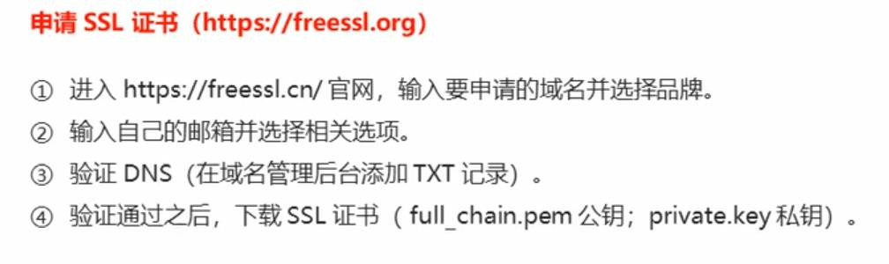
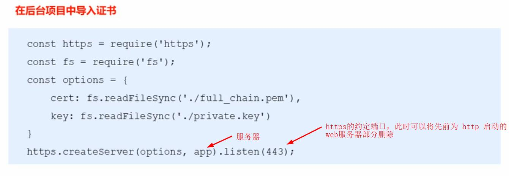

### 搜索框

#### 便捷引入

axios

```react
<script src="https://unpkg.com/axios/dist/axios.min.js"></script>
```

vue

```react
<script src="https://cdn.jsdelivr.net/npm/vue/dist/vue.js"></script>
```

#### 搜索框的记忆及清除

> 可以建立一个数组，用于存储用户的输入数据，并使用 [v-for](https://github.com/SpringLoach/Vue/blob/main/learning/section1.md#v-for遍历数组和对象) 将数据展示到页面。
>
> 利用[表单输入绑定](https://github.com/SpringLoach/Vue/blob/main/learning/section1.md#表单输入绑定)获取用户输入的值， 当用户[敲下回车](https://github.com/SpringLoach/Vue/blob/main/learning/section1.md#v-on修饰符)时，将相应值添入到数组中即可展示。

- 设置表单[默认值](https://github.com/SpringLoach/Vue/blob/main/learning/section1.md#表单输入绑定)
- 添加数据
- [删除](https://github.com/SpringLoach/origin-2021/blob/happy-day/JavaScript/常用方法速查.md#数组方法)某项数据
- 移除所有数据
- 当表单输入绑定的变量为空字符串时，使用 [placeholder](https://github.com/SpringLoach/origin-2021/blob/happy-day/css/html-速查.md#表单) 依旧可以设置提示

#### 根据用户输入请求相应数据

> 利用[表单输入绑定](https://github.com/SpringLoach/Vue/blob/main/learning/section1.md#表单输入绑定)的变量保存用户输入的值， 当用户[敲下回车](https://github.com/SpringLoach/Vue/blob/main/learning/section1.md#v-on修饰符)时，将变量作为查询键的值传入请求实例，发送请求。

```react
axios.get("https://xxx.xx/search?keyword=" + this.query)
```

#### 点击查询

> 给相应的热门词都添加点击事件，在处理程序中给表单输入绑定的变量赋值，并发送请求。由于已经做好了数据展示的设计，此时会根据保存的数据**在页面直接渲染**。

#### 默认格式化及ESlint修改

> 可以新建 `.prettierrc` 修改默认格式化选项，以及在 `.eslintrc.js` 中禁用一些不必要的警告：[教程](https://www.bilibili.com/video/BV1EE411B7SU?p=27)

------

### 登录相关

#### 将token保存到sessionStorage

> 一般页面登陆成功后，服务器会返回 token 作为接下来的通信凭据，此时要在客户端将该 token 保存到会话存储中，直至网页关闭前，它都会保留。

```react
.then(() => {
  window.sessionStorage.setItem("token", res.anywhere.token);
})
```

#### token原理

1. 客户端：用户在登录页面输入用户名和密码进行登录
2. 服务器：验证通过，会生成属于该用户的 `token` 并返回
3. 客户端：存储 `token`，并在后续所有的请求中携带 `token`
4. 服务端：通过验证 `token` 来辨认身份

#### 渲染登录组件

> [配置](https://github.com/SpringLoach/Vue/blob/main/learning/section2.md#路由映射配置)路由映射及[重定向](https://github.com/SpringLoach/Vue/blob/main/learning/section2.md#路由的默认值和模式修改)，在 `main.js` 中挂载路由实例，并在根组件中决定需要渲染路由组件的[位置](https://github.com/SpringLoach/Vue/blob/main/learning/section2.md#路由映射配置)。

#### less的安装[使用](https://less.bootcss.com/#概览)

安装到 Node.js

```elm
npm install less-loader@7.3.0 less --save-dev
```

在组件中使用

```react
/* Login.vue */
<style lang="less" scoped>
#login {background-color: #2b4b6b;}
</style>
```

- 将 normalize.css 导入 新创建的 `base.css`
- 并将 `base.css`，导入到 `App.vue`

#### 表单失焦验证

> 监听表单元素的 `blur` 事件，来[动态绑定](https://github.com/SpringLoach/Vue/blob/main/learning/section1.md#绑定class)样式。需要注意的是，如果用数组保存判断值，不能直接修改[数组](https://github.com/SpringLoach/Vue/blob/main/learning/section1.md#数组变更方法)。

#### 表单的重置功能

> 监听表单重置元素的点击，将对应的值赋值为空字符串，然后将修改后的数组赋值给数组本身触发检测。

#### 表单预验证

> 监听表单的 `submit` 事件，适当的时候调用 `event.preventDefault()` 阻止表单提交。
>
> 另外可以添加 `Toast` [插件](https://github.com/SpringLoach/Vue/blob/main/learning/section4.md#toast的插件封装)，只需将文件复制，并在 `main.js` 安装插件即可。

:snowflake: 点击 `submit` 按钮时，会触发表单的 `submit` 事件，自动验证表单元素的必填项。

#### 配置axios发起登录请求

> [安装](https://github.com/SpringLoach/Vue/blob/main/learning/section3.md#axios框架的基本使用)axios，并新建 `request.js` [封装模块](https://github.com/SpringLoach/Vue/blob/main/learning/section3.md#模块封装)并创建实例，也可以设置[拦截器](https://github.com/SpringLoach/Vue/blob/main/learning/section3.md#拦截器)筛选数据。然后可以新建对应的请求文件，给实例传参，封装[方法](https://github.com/SpringLoach/Vue/blob/main/learning/section4.md#商品数据的请求和保存)。

这里需要将用户的账号密码传入，可以预先将它们保存到同一个对象中，使用时就把它当作参数传入封装好的请求方法。

```react
export function getLogin(loginData) {
  return request({
    url: '/login',
    method: 'post',
    params: loginData
  })
}
```

:bug: 明明是 `post`，却使用了[params](https://github.com/SpringLoach/Vue/blob/main/learning/section3.md#axios的配置相关信息)进行传参。

#### 从响应中获取token并保存

> 先将获取到的 token [保存](https://github.com/SpringLoach/Vue/blob/main/learning/实验项.md#将token保存到sessionStorage)，然后通过[代码跳转](https://github.com/SpringLoach/Vue/blob/main/learning/section2.md#通过代码跳转路由)到首页，需要[配置](https://github.com/SpringLoach/Vue/blob/main/learning/section2.md#路由映射配置)路由映射。

#### 强制跳转到登录页

> 对于没有登录，没在会话中保存 `token` 的用户，不能让其直接通过网址到其它页面。这能通过[导航守卫](https://github.com/SpringLoach/Vue/blob/main/learning/section2.md#全局导航守卫)实现。

```react
// return 在这里的作用是退出执行

/* router 下的 index.js */
router.beforeEach((to, from, next) => {
  if (to.path === '/login') {return next()};
  const State = window.sessionStorage.getItem('token');
  if (State) {
    return next()
  } else {
    next('/login')
  }
})
```

#### 退出登录

> 当用户点击退出按钮时，清除会话中的 `token`，并回到登录页面。

```react
/* 删除指定数据 */
window.sessionStorage.removeItem("token");

/* 删除所有数据 */
window.sessionStorage.clear();
```

#### 将token添加到请求中

> 需要授权的 API ，必须在请求头中使用 Authorization 字段提供 token 令牌。可以在[拦截器](https://github.com/SpringLoach/Vue/blob/main/learning/section3.md#拦截器)中实现。

```react
/* request.js */
instance.interceptors.request.use(config => {
  config.headers.Authorization = window.sessionStorage.getItem('token');
  return config;
}, err => {
  return err;
}) 
```

------

### 菜单

#### 获取菜单数据

> 需要用对应的[接口](https://github.com/SpringLoach/Vue/blob/main/learning/项目需要/api接口文档.md#142-左侧菜单权限)请求数据。

1. 在 `created` 钩子处请求数据，将方法定义到 `methods`。
2. 在 `data` 中初始化变量，并在方法中用其接收相应的请求数据。

很神奇的编码方式，定义的方法与引入的方法虽然同名，却不相冲突。

```react
import { getMenuList } from '@/network/home'

/* created */
this.getMenuList()

/* methods */
getMenuList() {
  getMenuList().then(res => {
    console.log(res);
  })
}
```

#### 菜单的点击模式

> 主分类操作二级分类的展开关闭、同一时刻只能出现一个二级分类、二级分类激活项的记录。

| 索引 | 说明                                                         |
| ---- | ------------------------------------------------------------ |
| Ⅰ    | 不同子组件间的同名变量相互不影响                             |
| Ⅰ    | 通过 `v-show` 控制二级菜单                                   |
| Ⅱ    | 在父组监听子组点击。第二次点击以后、点击不同组件时，关闭上一个子组件的展开 |
| Ⅲ    | 子组的二级分类被点击时，记录当前索引，再向父组通信           |
| Ⅲ    | 父组的处理程序可以从 `v-for` 获取传件子组的索引作参          |
| Ⅲ    | 父组改变子组的激活状态                                       |

一些要点

| 说明                                                         |
| ------------------------------------------------------------ |
| 给组件添加原生事件处理程序需要后缀 `.native`                 |
| `ref` 要放在子组件的模板标签上，才能拿到子组件内部的一些变量 |
| 可以给菜单选项添加一个改变背景颜色的渐变效果                 |
| 自定义属性和动态类都可传入表达式，也可以改写为方法           |
| 通过动态属性，可以在不获取 DOM 的情况下改变样式              |

#### 菜单的缩放和悬停

> 可以动态给整体加个类，利用 less，可以在该类上较轻松地重构样式。

| 操作         | 说明                                                         |
| ------------ | ------------------------------------------------------------ |
| 一级菜单布局 | 将不需要展示的部分隐藏                                       |
| 二级菜单布局 | 需要加一个 div 将其包裹，不能直接在选项上子绝父相，会重位    |
| 二级菜单布局 | 然后以该 div 作为子，进行子绝父相定位                        |
| 悬空二级菜单 | 监听一级菜单、二级菜单体的鼠标移入、移出事件来决定需要使用的样式 |
| 悬空二级菜单 | 移入、移出共使用两个事件处理程序                             |
| 悬空二级菜单 | 直接在包裹块中设置过渡效果                                   |
| 悬空二级菜单 | 可以在设置块展示后，定时不透明达到淡入效果                   |
| 悬空二级菜单 | 可以在设置全透明后，定时隐藏块达到淡出效果                   |

#### 实现部分区域路由

> 在父组件中，布局好后，在需要的位置处使用路由 `<router-view/>`。在子路径变化时，会将对应的组件渲染到该处。
>
> 可以给当前路径添加默认[跳转路由](https://github.com/SpringLoach/Vue/blob/main/learning/section2.md#路由的默认值和模式修改)，来实现初始化。

#### 路由跳转

> 监听点击，通过代码跳转路由。由于每个页面的布局和功能不同，不能使用[动态路由](https://github.com/SpringLoach/Vue/blob/main/learning/section2.md#动态路由的使用)，而是直接用对应参数配置路由映射。

------

### 用户管理

#### 面包屑

> 由于组件关系较远，可以通过状态管理传输数据。
>
> 组件接收到的数据不能直接使用时，可以先在计算属性处理，再进行使用、布局。

#### 动态添加搜索框的清除键

> 根据绑定的数据决定是否 `v-show` 该元素。
>
> 利用子绝父相和 `:hover` 动态显示。

#### 表格数据的展示

> 可以先在请求中将需要的数据结构梳理好，保存到 `this` 中，即把方法当作构造函数。当请求时，只需要创建新实例并保存到组件变量中即可。
>
> 也可以在中间组件中，利用 `map` 函数将数据梳理。
>
> 在中间组件中，向子传递自定义数据、请求数据。复杂的数据可以在子组件中添加插槽。

#### 表格数据的切换

> 由于表格展示的数据是由请求数据决定的，可以新建一个切页组件。在布局后，当发生对应事件时，通知父组件改变请求参数，并重新发送请求。

| 重要功能 | 要点                                       |
| -------- | ------------------------------------------ |
| 上拉列表 | 利用子绝父相，悬停展现实现样式             |
| 上拉列表 | 动态绑定展示数，点击时，通知父组件配参请求 |
| 左右箭头 | 点击时，通知父组件配参请求                 |
| 左右箭头 | 两端禁用，动态绑定 `disabled` 属性和样式   |
| 数值跳转 | 根据总数/展示数取上整，动态决定渲染数量    |
| 数值跳转 | 添加最值情况，限制渲染数量                 |
| 数值跳转 | 点击时，通知父组件配参请求                 |
| 输入跳转 | `keyup.enter` 时，通父配参请求             |
| 输入跳转 | 限制两端情况                               |
| 其它     | 对象通知监测：`this.xx = {...this.xx}`     |
| 其它     | 无初始值的vue实例属性，监听存在问题        |

#### 提交状态修改

> 由于操作项为在表格中遍历的某一项单元格，监听点击的时候，需要传入相应的索引值，判断是否为需求索引，再进行操作。
>
> 需要修改计算属性：在方法中更改 *data*，在计算属性中检测该 *data* 的值，处理后重置 *data*。
>
> 状态更改失败时，需将表格中的状态回退，即取反。

:herb: 提交更改的请求时，都使用 `put` 方法？

#### 实现搜索功能

> 可以给查询按钮的点击、输入框的 `@keyup.enter` 添加搜索方法。
>
> 使用数组的 filter 方法遍历请求数据，判断其中的需求性是否包括绑定值。将新数组赋值给原请求数据。

| 重要功能 | 要点                               |
| -------- | ---------------------------------- |
| 重新请求 | 搜索会改变原数据，搜索前需重新请求 |
| 重新请求 | 在请求的解决程序中进行修改操作     |
| 重新请求 | 可以用辅助 *data* 判断是否需要操作 |
| 其它     | 搜索时，需要重置页码               |

:bug: 由于数据是根据页码和展示条数进行请求，每次拿到的很可能都不是完整的数据，搜索受限。

#### 思路-重写请求结构

> 1. 通过响应返回的总数，重新将所有数据请求到一页中。
> 2. 在中间组建处理需要传入的参数，可以利用 `m + n*pagesize` 操作展示数组。
> 3. 若数据索引超出总数，便不推到展示数组。

#### 思路-请求数据过多

> 一次请求固定的数据，通过页码记录当前请求页。
>
> 展示数应该存在倍数关系，以避免一个展示页需要不同的请求数据。
>
> 过临界时，将下一个请求页的数据通过 `push` 和 `...` 添加到保存的数据中，并使页码自增。

#### 思路-子组件复用

> 只需要接收不同的数据时进行相同布局时，使用子组件的效果最好。
>
> 若涉及额外的样式、逻辑不同时，可以通过自定义属性作为开关，通过遍历索引决定是否在内部发射事件及动态绑类。

#### 思路-多功能子组件

> 数组的元素为对象，在遍历中，通过[条件渲染](https://github.com/SpringLoach/Vue/blob/main/learning/section1.md#条件渲染)获取元素的属性，从而具体决定需要渲染的东西，甚至是插槽。
>
> 可以在对象中添加方法，从而在子组件中使用;也可以用其中的属性用于绑定表单。
>
> 元素也可以不是对象，可以在数组对应位置添加一个 `'diy'`，表示渲染插槽。

#### 思路-子组件遍历项中绑动态事件和属性

> 在 `v-if` 的方法中决定是否渲染、添加方法。
>
> 给遍历项添加动态 `ref` 属性，传入方法。这样在方法内部就可以给该元素添加事件和属性。

```react
/* 父组件 */
// 传给自定义属性  
data() {
  return {
    text: {shijian: 'click', href: 'https://www.bilibili.com/', is: true}
  }
}

/* 子组件 */
<a v-if='check(text, "a")' ref="a">bilibili</a>

props: {
  text: {
    type: Object,
    default() {
      return {}
    }
  }
},
methods: {
  check(text, el) {
    if(this.$refs[el]) {
      console.log(this.$refs[el]);
      this.$refs[el].addEventListener(text.shijian, () => {
        alert('get');
      })
      this.$refs[el].setAttribute("href", text.href)
    }       
    if(text.is) {
      return true;
    }
  }
}
```

:bug: 在 `v-for` 的环境下，通过 `ref` 获取到的不是元素，而是一个包裹元素的数组。
:bug: 需要设置一个异步来添加属性等，否则元素都没被添加到文档。

#### 思路-间距悬浮

> 通过添加透明、固定大小的伪元素，解决存在间距时，无法悬停的问题。

#### 抽离普通组件

> 在某几个组件中，都用到了相同的外围布局，可以抽离为普通组件，提供插槽，导入镶嵌使用。

------

### 用户管理功能

#### 添加用户

> 由于有很多地方需要该表单，总体样式一致，内容不同，所以可以把样式部分抽离成单独组件。
>
> 表单及表单元素应该写为单独组件，因为每个表单的具体内容都是不一样的。

| 重要功能 | 要点                                                         |
| -------- | ------------------------------------------------------------ |
| 样式组件 | 图片模态[参考](https://www.w3school.com.cn/tiy/t.asp?f=css_image_modal_js) |
| 样式组件 | 不能使用 ID 添加样式，优先级太高，后面无法覆盖               |
| 样式组件 | 不使用 `scoped` 以透出样式                                   |
| 表单组件 | 包括提交和取消元素，方便处理逻辑                             |
| 表单组件 | 可以创建 `errVertify` 对象用于验证表单元素                   |
| 表单组件 | 该对象还可以激活错误类、请求前验证表单                       |
| 表单组件 | 结束后，清空验证、表单，关闭弹窗                             |
| 其它     | 嵌套深。通过 Vuex 管理窗口的打开状态                         |

#### 编辑用户

> 给表单通过特定类、动态类加样式，失去焦点后验证。取消表单默认提交，并在其后发送请求等。

| 重要功能 | 要点                                     |
| -------- | ---------------------------------------- |
| 子组件   | 使用自定义属性拿到父组件传递的用户数据   |
| 子组件   | 使用计算属性整理用户数据                 |
| 子组件   | 表单绑定该计算属性                       |
| 子组件   | 提交修改时，发送自定义属性的ID和计算属性 |
| 子组件   | 清空时，对自定义属性重新赋值             |

#### 删除用户

> 单独组件负责展示，将事件传给父组件。父组件处理请求，通过 `v-if` 控制展示。

| 重要功能 | 要点                           |
| -------- | ------------------------------ |
| 确认删除 | 通过 *data* 记录待删除用户的ID |
| 确认删除 | 子组件确认后，通知父组件删除   |

------

### 权限管理

#### 表格的展开

| 重要功能 | 要点                                                         |
| -------- | ------------------------------------------------------------ |
| 表格跨行 | 添加 `colspan` [属性](https://www.w3school.com.cn/tiy/t.asp?f=eg_html_table_span) |
| 列表渲染 | 使用 `<template>` [循环](https://cn.vuejs.org/v2/guide/list.html#在-lt-template-gt-上使用-v-for)渲染多个元素 |
| 列表渲染 | 将请求数据赋值给变量后，遍历数组元素，添加判断属性           |
| 列表渲染 | 该属性使用到表格选择展示项的 `v-if` 上                       |
| 箭头动画 | 同样利用该属性动态绑定类                                     |
| 箭头动画 | 也可以创建新数组，点击移入移出索引。包含索引时绑定类         |
| 其它     | 在 Vue 中，用相同数量元素的新数组替代旧数组很高效            |

#### 多重嵌套循环，树状布局

| 重要功能     | 要点                                                         |
| ------------ | ------------------------------------------------------------ |
| 数据获取     | 嵌套使用 `<template>` [循环](https://cn.vuejs.org/v2/guide/list.html#在-lt-template-gt-上使用-v-for)，在其内部进行更多循环 |
| 层级划分     | 利用浮动，将整体分为 first-clos-1 和 first-cols-2            |
| 层级划分     | 同样利用浮动，又将 first-cols-2 的内部分为 second-clos-1 和 second-cols-2 |
| 布局要点     | 使用 `div` 包裹的数据间会换行、仅用 `span` 包裹的数据同行展示 |
| 层级垂直居中 | 将 first-clos-1 和 first-cols-2 的包裹体设置为弹性框并..     |
| 层级垂直居中 | 将 second-clos-1 和 second-cols-2 的包裹体设置为弹性框并..   |
| 避免中间换行 | 将需要同行展示的数据设置为 `inline-block`                    |
| 避免破坏布局 | 给文档设置最小宽度                                           |
| 要点         | 先整体划分为两部分，再将第二部分继续划分                     |

#### 删除权限

> 可以在获取响应数据（该角色新的权限）后，直接对当前遍历中的 `item` 的属性进行更新，以避免页面的整体刷新。

#### 分配权限

1. 请求数据是一个三层的结构，包含所有权限。
2. 打开权限页面时，将对应的角色已有权限的id保存到数组中。
3. 通过 `include` 方法决定是否渲染为勾选数据。
4. 勾选数据能改变对应数组。

------

### element使用

#### 安装element

在ui界面打开对应文件——添加插件—— `vue-cli-plugin-element`——安装—— `import on demand`（按需导入） ——完成安装

#### Dialog对话框

导入并[安装](https://element.faas.ele.me/#/zh-CN/component/quickstart) `Dialog`

| 属性          | 说明                            |
| ------------- | ------------------------------- |
| title         | 对话框标题                      |
| :visible.sync | 绑定的值控制对话框的开关        |
| :before-close | 接收使用 `x` 关闭对话框前的回调 |

#### 树形控条

导入并[安装](https://element.faas.ele.me/#/zh-CN/component/quickstart) `Tree`

| 属性                  | 说明                                            | 类型     |
| --------------------- | ----------------------------------------------- | -------- |
| :data                 | 数据源                                          | array    |
| :props                | 配置选项                                        | object   |
| show-checkbox         | 节点是否可被选择。复选框                        | 布尔属性 |
| default-expand-all    | 是否默认展开所有节点                            | 布尔属性 |
| node-key              | 作为每个树节点标识的属性，唯一                  | string   |
| :default-checked-keys | 默认勾选的节点的 key 的数组，与 `node-key` 对应 | array    |

**方法**

> 这些方法保存在树组件上，需要用 `ref` 引用树。

| 方法               | 说明                                           |
| ------------------ | ---------------------------------------------- |
| getCheckedKeys     | 返回目前被选中的节点的 `node-key` 所组成的数组 |
| getHalfCheckedKeys | 返回目前半选中的节点 `node-key` 所组成的数组   |

**:props**

> 该配置选项会自动在子树中继续遍历

| 参数     | 说明                               | 类型                         |
| -------- | ---------------------------------- | ---------------------------- |
| label    | 指定节点标签为节点对象的某个属性值 | string                       |
| children | 指定子树为节点对象的某个属性值     | string, function(data, node) |

#### Select选择器

导入并[安装](https://element.faas.ele.me/#/zh-CN/component/quickstart) `Select` 和 `Option`。

| 属性        | 说明                  | 类型        |
| ----------- | --------------------- | ----------- |
| v-model     | 绑定值，对应 `:value` | str/boo/num |
| placeholder | 占位符                | str         |
| :label      | 显示值                | str         |
| :value      | 选项的值              | str/num/obj |

#### MessageBox弹框

> 导入 `MessageBox` 并添加到原型后[使用](https://element.faas.ele.me/#/zh-CN/component/message)。

```
Vue.prototype.$msgbox = MessageBox;
Vue.prototype.$confirm = MessageBox.confirm;
```

#### Message消息提醒

> 导入 `Message` 并添加到[原型](https://element.faas.ele.me/#/zh-CN/component/quickstart)后[使用](https://element.faas.ele.me/#/zh-CN/component/message)。

```
this.$message('添加分类成功');
this.$message.error('添加分类失败');
```

#### Alert警告

> 导入并[安装](https://element.faas.ele.me/#/zh-CN/component/quickstart) `Alert`。

| 属性      | 说明         | 类型 | 默认值 |
| --------- | ------------ | ---- | ------ |
| title     | 标题         | str  | /      |
| type      | 主题         | str  | 'info' |
| show-icon | 是否显示图标 | boo  | false  |
| :closable | 是否可关闭   | boo  | true   |
| center    | 是否居中     | boo  | false  |

#### Card卡片

> 导入并[安装](https://element.faas.ele.me/#/zh-CN/component/quickstart) `Card`。

#### Button按钮

导入并[安装](https://element.faas.ele.me/#/zh-CN/component/quickstart) `Button`。

| 属性      | 说明     | 类型 |
| --------- | -------- | ---- |
| type      | 类型     | str  |
| size      | 尺寸     | str  |
| :disabled | 是否禁用 | boo  |
| icon      | 图标类型 | str  |

#### Icon图标

> 导入并[安装](https://element.faas.ele.me/#/zh-CN/component/quickstart) `Icon`。

#### Tag标签

> 导入并[安装](https://element.faas.ele.me/#/zh-CN/component/quickstart) `Tag`。

| 属性     | 说明       | 类型 |
| -------- | ---------- | ---- |
| type     | 类型       | str  |
| size     | 尺寸       | str  |
| closable | 是否可关闭 | boo  |

------

#### Pagination分页

导入并[安装](https://element.faas.ele.me/#/zh-CN/component/quickstart) `Pagination`。

| 属性            | 说明                         | 类型/回调参数  |
| --------------- | ---------------------------- | -------------- |
| @size-change    | 页码大小变动回调             | 变动后每页条数 |
| @current-change | 当前页码变动回调             | 变动后页码     |
| :current-page   | 当前页数                     | num            |
| :page-sizes     | 每页显示个数选择器的选项设置 | arr            |
| :page-size      | 每页显示条目个数             | num            |
| layout          | 组件布局                     | str            |
| :total          | 总条目数                     | num            |
| background      | 为分页按钮添加背景色         | boo            |

#### Form表单

> 每一个表单域由一个 `Form-Item` 组件构成，表单域中可以放置一个表单控件。

导入并[安装](https://element.faas.ele.me/#/zh-CN/component/quickstart) `Form`、`FormItem` 和 `Input`等。

```react
<el-form ref="addCateForm" :rules="addCateRules" :model="addCateForm" label-width="80px">
  <el-form-item label="分类名称" prop="cat_name">
    <el-input v-model="addCateForm.cat_name"></el-input>
  </el-form-item>
  <el-form-item label="父级分类">
    ...
  </el-form-item>
</el-form>

data() {
  return{
    addCateForm: {
        cat_pid: 0,
        cat_name: '',
        cat_level: 0
      },
      addCateRules: {
        cat_name: [
          { required: true, message: '请输入分类名称', trigger: 'blur' }
        ]
      }
  }
}
```

| 表单属性 | 说明         | 类型 |
| -------- | ------------ | ---- |
| :rules   | 表单验证规则 | obj  |
| :model   | 表单数据对象 | obj  |

| 表单项属性 | 说明                                 | 类型 |
| ---------- | ------------------------------------ | ---- |
| label      | 标签文本                             | str  |
| prop       | 应用规则名称，需为表单数据对象的属性 | str  |

**:rules**

> 表单[验证规则](https://github.com/yiminghe/async-validator)中包含的键值对为规则名称和规则内容，规则内容为由一到多个对象组成的数组。

| 属性     | 说明     | 类型 |
| -------- | -------- | ---- |
| required | 是否必填 | boo  |
| message  | 错误消息 | str  |
| trigger  | 触发时机 | str  |

**方法**

> 需要用 `ref` 引用表单。

| 方法     | 说明                                                   |
| -------- | ------------------------------------------------------ |
| validate | 对表单进行验证。参数为一个回调函数，首参为是否校验成功 |

**#联动标签页使用**

> 将标签组件嵌套到表单内部，并在不同的标签页中，添加所需的表单项。

------

#### Input输入框

> 导入并[安装](https://element.faas.ele.me/#/zh-CN/component/quickstart) `Input`

| 属性      | 说明       | 类型 |
| --------- | ---------- | ---- |
| disabled  | 禁用       | boo  |
| clearable | 是否可清空 | boo  |
| @clear    | 清空回调   | /    |

**slot**

> 规定在 `Input` 标签嵌入的标签放置的位置。

| 属性    | 说明           |
| ------- | -------------- |
| prefix  | 输入框头部内容 |
| suffix  | 输入框尾部内容 |
| prepend | 输入框前置内容 |
| append  | 输入框后置内容 |

:snowflake: 使用 `v-model.number` 的方式保证用户输入的数字值不被转换为字符串，但无法输入小数点。

------

#### Cascader级联选择器

> 当一个数据集合有清晰的层级结构时，可通过级联选择器逐级查看并选择。

导入并[安装](https://element.faas.ele.me/#/zh-CN/component/quickstart) `Cascader`。

| 属性       | 说明               | 类型 |
| ---------- | ------------------ | ---- |
| v-model    | 选中项绑定值       | arr  |
| :options   | 数据源。即选项对象 | arr  |
| :props     | 配置选项           | obj  |
| :clearable | 是否支持清空选项   | boo  |

**Props**

| 属性          | 说明                                             | 类型 | 默认值     |
| ------------- | ------------------------------------------------ | ---- | ---------- |
| value         | 指定**选项的值**为选项对象的某个属性值           | str  | 'value'    |
| label         | 指定**显示标签**为选项对象的某个属性值           | str  | 'label'    |
| children      | 指定选项的**子选项**为选项对象的某个属性值       | str  | 'children' |
| expandTrigge  | 次级菜单的展开方式                               | str  | 'click'    |
| checkStrictly | 父子节点不互相关联，**可选一级**                 | boo  | false      |
| multiple      | 是否多选                                         | boo  | false      |
| emitPath      | 选中时，是否将选中节点的父节点的值推入绑定值数组 | boo  | true       |

:cyclone: 给标签加类来控制控件宽度；在全局样式通过 `.el-cascader-menu` 控制菜单高度。

#### Tabs标签页

导入并[安装](https://element.faas.ele.me/#/zh-CN/component/quickstart) `Tabs` 和 `TabPane`。

| 组件属性      | 说明                                        | 类型/回调参数             |
| ------------- | ------------------------------------------- | ------------------------- |
| v-model       | 绑定值，选中选项卡的 `name`                 | str                       |
| @tab-click    | 选中选项卡触发                              | 被选中的标签 tab 实例     |
| tab-position  | 选项卡所在位置                              | str                       |
| :before-leave | 切换标签之前的钩子，返回 `false` 时阻止切换 | activeName, oldActiveName |

| 选项卡属性 | 说明         | 类型 |
| ---------- | ------------ | ---- |
| label      | 选项卡标题   | str  |
| name       | 选项卡标识符 | str  |

**#动态编辑标签**

> 通过 `v-if` 实现。

```react
// 点击聚焦
showInput() {
  this.inputVisible = true;
  // 等到元素重新渲染后，执行回调  
  this.$nextTick(_ => {
    this.$refs.saveTagInput.$refs.input.focus();
  });
}
```

#### Table表格

> 每一列都由一个 `el-table-column` 组成。
>
> 导入并[安装](https://element.faas.ele.me/#/zh-CN/component/quickstart) `Table` 和 `TableColumn`。

| 表格属性 | 说明             | 类型/回调参数 | 默认值 |
| -------- | ---------------- | ------------- | ------ |
| :data    | 数据源           | arr           | /      |
| border   | 是否带有纵向边框 | boo           | false  |
| stripe   | 是否带有斑马纹   | boo           | false  |

| 列属性 | 说明                         | 类型                     |
| ------ | ---------------------------- | ------------------------ |
| label  | 列标题                       | str                      |
| prop   | 指定数据源的某属性作为列内容 | str                      |
| width  | 列的宽度                     | str                      |
| type   | 对应列的类型                 | `selection/index/expand` |

**插槽使用**

```react
<el-table-column label="操作">
  // 使用 scope.row 传递数据
  <template slot-scope="scope">
    ...
  </template>
</el-table-column>
```

:snowflake: 对于展开行，即 `type='expand'`，也可以这样去添加插槽。

#### Layout布局

> 通过 `row` 和 `col` 组件自由地组合布局。
>
> 导入并[安装](https://element.faas.ele.me/#/zh-CN/component/quickstart) `Row` 和 `Col`。

| Row属性 | 说明     | 类型 | 默认值 |
| ------- | -------- | ---- | ------ |
| :gutter | 栅格间隔 | num  | 0      |

| Col属性 | 说明           | 类型 | 默认值 |
| ------- | -------------- | ---- | ------ |
| :span   | 栅格占据的列数 | num  | 24     |

#### Steps步骤条

导入并[安装](https://element.faas.ele.me/#/zh-CN/component/quickstart) `Step` 和 `Steps`。

| Steps属性     | 说明           | 类型 |
| ------------- | -------------- | ---- |
| :active       | 当前激活步骤   | num  |
| align-center  | 居中对齐       | boo  |
| finish-status | 结束步骤的状态 | str  |

| Step属性 | 说明 | 类型 |
| -------- | ---- | ---- |
| title    | 标题 | str  |

**#标题样式设置**

> 在标题处右键，检查，在全局样式表中将相应的类进行设置。

```css
font-size: 14px !important;
```

**#与标签页联动使用**

```react
<el-steps :active="activeIndex-0">
<el-tabs v-model="activeIndex">
<el-tab-pane name="0">
...

data() {
  return {
    activeIndex: '0'
  }
}
```

#### Checkbox多选框

导入并[安装](https://element.faas.ele.me/#/zh-CN/component/quickstart) `Checkbox` 和 `CheckboxGroup`。

| 组属性  | 说明   | 类型 |
| ------- | ------ | ---- |
| v-model | 绑定值 | arr  |

| 项属性  | 说明        | 类型        |
| ------- | ----------- | ----------- |
| label   | 展示/绑定值 | str/num/boo |
| :border | 显示边框    | boo         |

#### Upload上传

导入并[安装](https://element.faas.ele.me/#/zh-CN/component/quickstart) `Upload`。

| 属性        | 说明                       | 类型/回调参数 |
| ----------- | -------------------------- | ------------- |
| :action     | 上传的地址，一般传绝对路径 | str           |
| :headers    | 设置上传的请求头部         | obj           |
| :on-preview | 预览钩子                   | file          |
| :on-remove  | 移除钩子                   | file          |
| list-type   | 文件列表的类型             | str           |
| :file-list  | 上传的文件列表             | arr           |
| :on-success | 上传成功钩子               | 响应          |

**与请求关联**

> 上传成功时，要将临时路径保存到添加商品的请求数据中，该临时路径是从暂存响应中获取的。
>
> 同样的，移除图片时，也要移除相应的临时路径。

```react
handlePicRemove(file) {
  let removePic = file.response.data.tmp_path;
  let removeIndex = this.addForm.pics.findIndex(item => {
    return item.pic === removePic;
  })
  this.addForm.pics.splice(removeIndex, 1)
}
```

**图片预览效果**

> 通过对话框的形式展示图片，将预览钩子作为开关。

```react
handlePicPreview(file) {
  this.previewPic = file.url;
  /* 使用下面这个路径加载很慢 */
  // this.previewPic = file.response.data.url;  
  this.preViewPicVisible = true;
}
```

------

#### Timeline时间线

导入并[安装](https://element.faas.ele.me/#/zh-CN/component/quickstart) `Timeline` 和 `TimelineItem`。

| 组属性   | 说明         | 类型 |
| -------- | ------------ | ---- |
| :reverse | 节点排序方向 | boo  |

| 项属性          | 说明       | 类型 |
| --------------- | ---------- | ---- |
| :timestamp      | 时间戳     | str  |
| :hide-timestamp | 隐藏时间戳 | boo  |
| type            | 节点类型   | str  |
| :icon           | 节点图标   | str  |

------

### vue-table-with-tree-grid

> 比较适合于构建[树形表格](https://github.com/MisterTaki/vue-table-with-tree-grid)。

ui界面-安装依赖-运行依赖- `vue-table-with-tree-grid `-安装

```react
/* main.js */
import TreeTable from 'vue-table-with-tree-grid'

// 全局注册
Vue.component('tree-table', TreeTable)
```

使用

```react
<tree-table></tree-table>
```

| 属性           | 说明                       | 类型 |
| -------------- | -------------------------- | ---- |
| :data          | 数据源                     | arr  |
| :columns       | 表格各列的配置             | arr  |
| selection-type | 是否为多选类型表格。复选框 | boo  |
| expand-type    | 是否为展开类型列表。展开列 | boo  |
| show-index     | 是否展现数据索引           | boo  |
| index-text     | 数据索引标题               | str  |
| border         | 是否展现纵向边框           | boo  |

**:columns**

> 每一个元素都是对象，操纵一列。

| 参数     | 说明                                      | 类型       |
| -------- | ----------------------------------------- | ---------- |
| label    | 列标题                                    | str        |
| prop     | 对应列内容的属性名                        | str        |
| width    | 列宽度                                    | [str, num] |
| type     | 列类型。可选 `'template'`，即自定义模板列 | str        |
| template | 指定插槽的名字                            | str        |

**插槽**

```react
<tree-table ...>
  // slot-scope 绑定的变量，会传到内部，.row 可以拿到对应数据
  <template slot="isok" slot-scope="scope">
    <i class="el-icon-success" v-if="scope.row.cat_deleted === true"
      style="color: lightgreen;"></i>
    <i class="el-icon-error" v-else
      style="color: red;"></i>  
  </template>  
</tree-table>

// 对应的 columns
{
  label: '是否有效',
  // 模板列
  type: 'template',
  // 模板名称
  template: 'isok'
}
```

------

### 使用vue-quill-editor文本编辑

> ui界面 -> 安装依赖 -> 运行依赖 -> [vue-quill-editor](https://github.com/surmon-china/vue-quill-editor) -> 安装。

全局挂载

```react
/* main.js */
import VueQuillEditor from 'vue-quill-editor'

import 'quill/dist/quill.core.css' // import styles
import 'quill/dist/quill.snow.css' // for snow theme
import 'quill/dist/quill.bubble.css' // for bubble theme

Vue.use(VueQuillEditor)
```

使用

```react
<quill-editor v-model="data"/>
```

------

### 使用echarts数据可视化

> ui界面 -> 安装依赖 -> 运行依赖 -> [echarts](https://echarts.apache.org/zh/tutorial.html#5 分钟上手 ECharts) -> 安装。
>
> 在需求组件中导入，并按[教程](https://echarts.apache.org/examples/zh/index.html#chart-type-line)使用即可，注意在元素渲染后才可以操作 DOM ，即 `mounted` 钩子。

```react
import * as echarts from 'echarts'
```

------

### 其它

#### 深拷贝

**方法一**

```react
const obj2 = JSON.parse(JSON.stringify(obj1))
```

**方法二**

> ui界面 -> 安装依赖 -> 运行依赖 -> lodash -> 安装。

使用

```react
import _ from 'lodash'

const obj2 = _.cloneDeep(obj1)
```

#### 单独记录遍历项的状态

> 在接收数据前，给每一项添加属性用于记录状态。

#### 清空空字符串

```react
if(str.trim().length === 0) {
  str = '';
}
```

#### 全局注册时间格式化过滤器

```react
Vue.filter('dataFormat', function(originVal) {
  const dt = new Date(originVal*1000)
  
  const y = dt.getFullYear();
  const m = (dt.getMonth() + 1 + '').padStart(2, '0');
  const d = (dt.getDate() + '').padStart(2, '0');
  
  const hh = (dt.getHours() + '').padStart(2, '0');
  const mm = (dt.getMinutes() + '').padStart(2, '0');
  const ss = (dt.getSeconds() + '').padStart(2, '0');
  
  return `${y}-${m}-${d} ${hh}:${mm}:${ss}`
})
```

#### 增加遍历项

> 往数组源里推元素。

#### 网络数据处理思路

| 顺序 | 说明                 |
| ---- | -------------------- |
| ①    | `created` / 点击回调 |
| ②    | 请求数据             |
| ③    | 清数据，保存到变量   |
| ④    | 展示、绑定相关数据   |
| ⑤    | 用相关数据发送请求   |
| ⑥    | 关闭组件             |
| ⑦    | 清空变量             |
| ⑧    | 刷新                 |

:snowflake: 请求时，需要携带请求参数时，很多要使用键值对。

#### 对话框处理

| 顺序 | 说明                                         |
| ---- | -------------------------------------------- |
| ①    | 新建子组，在父组占位                         |
| ②    | v-if / VueX 控制显示                         |
| ③    | 添加点击事件改显示                           |
| ④    | 布局子组件                                   |
| ⑤    | 在父组建 *data* 保存数据，父传子，自定义属性 |
| ⑥    | 整理数据，预验证，根据接口发送               |
| ⑦    | 对饿：子组关闭，通知父组改显示 *data*        |

------

表单输入框外边距内边距，holder； 可以给元素设置部分圆角效果； 删除 `a` 标签的 `href` 属性去除默认跳转 通过 `cursor` 属性添加箭头； curson/placeholder/transform:rotate仅对block、inline-block生效 动态data，自建，双向绑定上有问题 keyup 动态绑定能感应到：this.xx = {...this.xx}

#### 插件样式的改变

1. 存在类名
   - 在局部样式中重写样式
   - 在局部样式的每个样式中添加尾缀 `!important`
   - 以插件标签为类
2. 不存在类名
   - 右键检查，找到对应类名。
   - 在全局样式中重写样式
   - 在局部样式的每个样式中添加尾缀 `!important`

### 项目优化

#### NProgress进度条

> ui界面 -> 安装依赖 -> 运行依赖 -> [NProgress](https://github.com/rstacruz/nprogress) -> 安装。

添加到[拦截器](https://github.com/SpringLoach/Vue/blob/main/learning/section3.md#拦截器)

```react
/* 网络请求文件中 */
import NProgress from 'nprogress'
import 'nprogress/nprogress.css'

// 请求拦截器中
NProgress.start()
// 响应拦截器中
NProgress.done()
```

#### 解决ESlinst语法错误

> ui界面 -> 任务 -> serve -> 运行 -> 在仪表盘中查看警告和错误数量 -> 在输出查看详情。

#### 打包阶段移除console

> ui界面 -> 安装依赖 -> 开发依赖 -> babel-plugin-transform-remove-console -> 安装。

所有阶段移除

```react
/* babel.config.js */
module.exports = {
  "plugins": [
    [
      ...
    ],
    'transform-remove-console'
  ]
}
```

仅打包阶段移除

```react
const prodPlugins = []
if(process.env.NODE_ENV === 'production') {
  prodPlugins.push('transform-remove-console')
}

module.exports = {
  "plugins": [
    [
      ...
    ],
    ...prodPlugins
  ]
}
```

#### 生成打包报告

> ui界面 -> 任务 -> build -> 运行 -> 在仪表盘中和分析查看。

也可以生成 `report.html` 帮助分析

```elm
vue-cli-service build --report
```

#### 修改webpack默认配置

> 在项目文件下新建的 `vue.config.js` 可以将配置整合到默认配置上。

```javascript
module.exports = {
  ..配置项
}
```

#### 为开发/发布模式指定不同的打包入口

| 模式     | 入口文件         |
| -------- | ---------------- |
| 默认共用 | src/main.js      |
| 开发模式 | src/main-dev.js  |
| 发布模式 | src/main-prod.js |

在 `vue.config.js` 中配置打包文件

> 这两种节点的作用相同。

| 节点            | 作用方式 |
| --------------- | -------- |
| chainWebpack    | 链式编程 |
| configureWebpck | 操作对象 |

#### 通过chainWebpack自定义打包入口

> 在项目文件下，新建 `main-dev.js` 和 `main-prod.js`，删除 `main.js`。

```react
/* vue.config.js */
module.exports = {
  chainWebpack: config => {
    // 发布模式 
    config.when(process.env.NODE_ENV === 'production', config => {
      config.entry('app').clear().add('./src/main-prod.js')
    })
    // 开发模式
    config.when(process.env.NODE_ENV === 'development', config => {
      config.entry('app').clear().add('./src/main-dev.js')
    })
  }
}
```

#### 通过externals加载外部CDN资源

> 默认情况下，通过 `import` 语法导入的第三方依赖包，最终会被打包合并到同一个文件中，且其体积很大。

将配置代码添加到上一节 **发布模式** 的函数中

```react
config.set('externals', {
  vue: 'Vue',
  'vue-router': 'VueRouter',
  axios: 'axios',
  echarts: 'echarts',
  nprogress: 'NProgress',
  'vue-quill-editor': 'VueQuillEditor'
})
```

:palm_tree: `导出文件: '变量名'`; 存在 `-` 时，导出文件用引号包围。

**添加引用**

> 将引用添加到 `public` 下的 `index.html` 的 `<header>`标签中，可以在 [bootcdn](https://www.bootcdn.cn/)、[staticfile](https://staticfile.org/)、[jsdelivr](https://www.jsdelivr.com/) 等网站查找。

CSS

```react
<!-- nprogress -->
<link href="https://cdn.bootcdn.net/ajax/libs/nprogress/0.2.0/nprogress.min.css" rel="stylesheet" />
<!-- 富文本编辑器 -->
<link href="https://cdn.staticfile.org/quill/1.3.7/quill.core.min.css" rel="stylesheet" />
<link href="https://cdn.staticfile.org/quill/1.3.7/quill.snow.min.css" rel="stylesheet" />
<link href="https://cdn.staticfile.org/quill/1.3.7/quill.bubble.min.css" rel="stylesheet" />
```

将 `main-prod.js` 中对应的样式表删除。

JS

```react
<script src="https://cdn.staticfile.org/vue/2.6.11/vue.min.js"></script>
<script src="https://cdn.staticfile.org/vue-router/3.2.0/vue-router.min.js"></script>
<script src="https://cdn.staticfile.org/axios/0.21.1/axios.min.js"></script>
<script src="https://cdn.staticfile.org/echarts/5.1.2/echarts.min.js"></script>
<script src="https://cdn.staticfile.org/nprogress/0.2.0/nprogress.min.js"></script>
<!-- 富文本编辑器 -->
<script src="https://cdn.staticfile.org/quill/1.3.7/quill.min.js"></script>
<script src="https://cdn.jsdelivr.net/npm/vue-quill-editor@3.0.6/dist/vue-quill-editor.min.js"></script>
```

> 此后再去运行打包报告，变回发现体积压缩了许多。

#### 通过CDN优化ElementUI的打包

> 尽管在开发阶段，使用的是按需加载的方式，但这些文件在打包时还是占用了较大体积。

1. 将 `main-prod.js` 中 elemnt-ui 按需加载的代码删除（包括导入插件、添加原型在内的所有代码）。

2. 将引用添加到 `public` 下的 `index.html` 的 `<header>`标签中。

```react
<link href="https://cdn.staticfile.org/element-ui/2.4.5/theme-chalk/index.css" rel="stylesheet" />

<script src="https://cdn.staticfile.org/element-ui/2.4.5/index.js"></script>
```

------

#### 定制加载方式

> 不同打包环境下，首页内容可能不同，可以通过插件的方式进行定制。

自定义属性字段

> 分别配置到[发布模式](https://github.com/SpringLoach/Vue/blob/main/learning/通过chainWebpack自定义打包入口)和开发模式的函数中。

```react
// 发布模式
config.plugin('html').tap(args => {
  args[0].isProd = true
  return args
})

  // 开发模式
config.plugin('html').tap(args => {
  args[0].isProd = false
  return args
})
```

首页内容定制

> 动态决定渲染标题和加载资源的方式。

```react
/* public 下的 index.html */

<title><%= htmlWebpackPlugin.options.isProd ? '' : 'dev - ' %>电商后台管理系统</title>

<% if(htmlWebpackPlugin.options.isProd) { %>
...通过 externals 加载的外部 CDN 资源
<% } %>
```

#### 路由懒加载分组

> 若使用的是 Babel，需要添加相应插件。
>
> 使用 [命名chunk](https://router.vuejs.org/zh/guide/advanced/lazy-loading.html#把组件按组分块) 可以将某个路由下的所有组件都打包在同个异步块。

安装

```elm
npm install --save-dev @babel/plugin-syntax-dynamic-import
```

声明配置

```react
/* babel.config.js */
module.exports = {
  plugins: [
    ...
    '@babel/plugin-syntax-dynamic-import'
  ]
}
```

路由懒加载分组

> 将需要一起加载的组件分到同一组。

```react
const Login = () => import(/* webpackChunkName: "Login-Home" */ '@/views/login/Login.vue')
const Home = () => import(/* webpackChunkName: "Login-Home" */ '@/views/home/Home')
```

### 项目上线

#### 通过node创建web服务器

> 创建 node 项目，并安装 express，通过 express 创建 web 服务器，将之前项目打包生成的 dist 文件夹，托管为静态资源。

1. 新建文件夹

```elm
/* 初始化包管理配置文件 package.json */
npm init
/* 安装第三方的包 */
npm i express -S
```

2. 将项目文件的 `dist` 文件夹粘贴到新建文件夹下

3. 在新建文件夹下创建 `app.js`

```react
const express = require('express')

// 创建 web 服务器
const app = express()

// 托管静态资源
app.use(express.static('./dist'))

//启动 web 服务器
app.listen(80, () => {
  console.log('server running at http://127.0.0.1')
})
```

4. 启动服务器

```elm
node .\app.js
```

#### 为Histor模式配置中间件

> 由于应用是单页客户端应用，对于后台来说，如果没有[相关配置](https://router.vuejs.org/zh/guide/essentials/history-mode.html#后端配置例子)，在刷新或直接访问子路径时会返回 `404`，这里给出针对基于 Node.js 的 [Express](https://github.com/bripkens/connect-history-api-fallback) 的方案。

1. 安装相应包

```elm
npm install --save connect-history-api-fallback
```

2. 导入并配置中间件

```react
/* app.js */
const history = require('connect-history-api-fallback');

// 这一步要放在托管静态资源前
app.use(history());
```

#### 开启gzip配置

> 使用 gzip 可以减少文件体积，使传输速度更快。

1. 安装相应包

```elm
npm install compression -D
```

2. 导入并配置中间件

```react
/* app.js */
const compression = require('compression');

// 这一步要放在托管静态资源前
app.use(compression());
```

#### 配置https服务





#### 使用pm2管理应用

> 正常情况下，运行的项目会随终端的关闭而停止。可以使用 pm2 管理应用而不必时刻打开终端。

在服务器（全局）安装

```elm
npm i pm2 -g
```

| 操作     | 代码                             | 补充                  |
| -------- | -------------------------------- | --------------------- |
| 启动项目 | pm2 start 脚本 --name 自定义名称 | 脚本栗子： `.\app.js` |
| 查看项目 | pm2 ls                           | /                     |
| 重启项目 | pm2 restart 自定义名称           | 也可用 id             |
| 停止项目 | pm2 stop 自定义名称              | 也可用 id             |
| 删除项目 | pm2 delete 自定义名称            | 也可用 id             |

