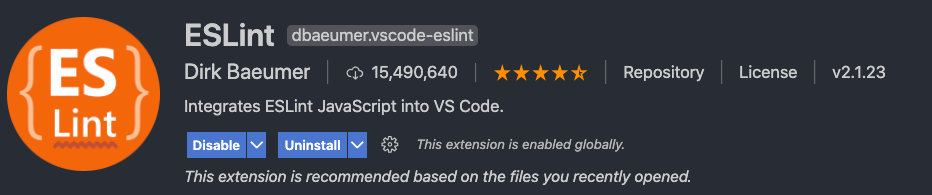
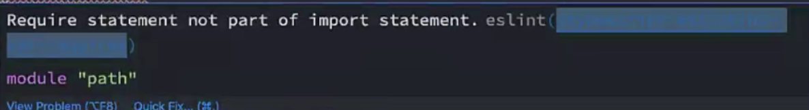

## 待处理

1. 图片本地
2. 2.1的抽取
3. 公司代码合并


声明 $store

<span style="backGround: #efe0b9">shims-vue.d.ts</span>

```javascript
declare let $store: any
```


```
// 额外补充的Promise中类型的使用
// Promise本身是可以有类型
new Promise<string>((resolve) => {
  resolve('abc')
}).then((res) => {
  console.log(res.length)
})
```

由这里的 `<string>` 来决定 `resolve()` 出去的值，也就是 then 的函数参数的参数类型。


```
import axios from 'axios'

// axios的全局配置选项
axios.defaults.baseURL = 'http://httpbin.org'
axios.defaults.timeout = 10000

// 6.axios的拦截器 参数一：请求/响应成功前执行；参数二：请求/响应失败前执行
axios.interceptors.request.use(
  (config) => {
    // 想做的一些操作
    // 1.给请求添加token
    // 2.isLoading动画
    console.log('请求成功的拦截')
    return config
  },
  (err) => {
    console.log('请求发送错误')
    return err
  }
)

// fn1: 数据响应成功(服务器正常的返回了数据 20x)
axios.interceptors.response.use(
  (res) => {
    console.log('响应成功的拦截')
    return res
  },
  (err) => {
    console.log('服务器响应失败')
    return err
  }
)


```

axios.interceptors.request.use(请求成功拦截, 请求失败拦截) 

axios.interceptors.response.use(响应成功拦截, 响应失败拦截)


区分不同环境

> 有时候需要根据不同的环境，配置不同的接口基础路径等。

常见的三种环境：

- 开发环境：development； 

- 生产环境：production； 

- 测试环境：test；

区分环境变量：

方式一：手动修改不同的变量； 

方式二：根据process.env.NODE_ENV的值进行区分（推荐）； 

方式三：编写不同的环境变量配置文件（较麻烦）；

<span style="backGround: #efe0b9">src/service/config.js</span>

```
// 1.方式一: 手动的切换不同的环境(不推荐)
const BASE_URL = 'http://coderwhy.org/dev'
const BASE_NAME = 'coderwhy'

// const BASE_URL = 'http://coderwhy.org/prod'
// const BASE_NAME = 'kobe'

// const BASE_URL = 'http://coderwhy.org/test'
// const BASE_NAME = 'james'
```

<span style="backGround: #efe0b9">src/service/config.js</span>

```
// 2.根据process.env.NODE_ENV区分
let BASE_URL = ''
let BASE_NAME = ''

if (process.env.NODE_ENV === 'development') {
  BASE_URL = 'http://123.207.32.32:8000/'
  BASE_NAME = 'a'
} else if (process.env.NODE_ENV === 'production') {
  BASE_URL = 'http://coderwhy.org/prod'
  BASE_NAME = 'b'
} else {
  BASE_URL = 'http://coderwhy.org/test'
  BASE_NAME = 'c'
}

export { BASE_URL, BASE_NAME }
```


<span style="backGround: #efe0b9">项目/.env.development</span>

```
VUE_APP_BASE_URL=https://coderwhy.org/dev
VUE_APP_BASE_NAME=coderwhy
```

:whale: Vue-Cli 支持，对导出的变量名有限制，但可以设置格式为 `VUE_APP_XX` 来自定义变量。

<span style="backGround: #efe0b9">项目/.env.production</span>

```
VUE_APP_BASE_URL=https://coderwhy.org/prod
VUE_APP_BASE_NAME=kobe
```

<span style="backGround: #efe0b9">项目/.env.test</span>

```
VUE_APP_BASE_URL=https://coderwhy.org/test
VUE_APP_BASE_NAME=james
```

<span style="backGround: #efe0b9">Demo.js</span>

```
console.log(process.env.VUE_APP_BASE_URL)
console.log(process.env.VUE_APP_BASE_NAME)
```


es module语法

`不允许`

```
export default demo = new Date()
```

`允许`

```
export default new Date()
```

```
const demo = new Date()
export default demo
```


# 项目搭建规范

## 一. 代码规范

### 1.1. 集成editorconfig配置

EditorConfig 有助于为不同 IDE 编辑器上处理同一项目的多个开发人员维护一致的编码风格。

<span style="backGround: #efe0b9">项目/.editorconfig</span>

```yaml
# http://editorconfig.org

root = true # 表示在根目录下

[*] # 表示所有文件适用
charset = utf-8 # 设置文件字符集为 utf-8
indent_style = space # 缩进风格（tab | space）
indent_size = 2 # 缩进大小
end_of_line = lf # 控制换行类型(lf | cr | crlf)
trim_trailing_whitespace = true # 去除行首的任意空白字符
insert_final_newline = true # 始终在文件末尾插入一个新行

[*.md] # 表示仅 md 文件适用以下规则
max_line_length = off
trim_trailing_whitespace = false
```

:whale: 默认会读取文件并进行配置。


对于 <span style="color: #a50">VSCode</span>，还需要额外安装一个插件：EditorConfig for VS Code

对于 <span style="color: #a50">Webstorm</span>，则不需要


### 1.2. 使用prettier工具

Prettier 是一款强大的代码格式化工具，支持 JavaScript、TypeScript、CSS、SCSS、Less、JSX、Angular、Vue、GraphQL、JSON、Markdown 等语言，基本上前端能用到的文件格式它都可以搞定，是当下最流行的<span style="color: #ff0000">代码格式化工具</span>。

1.安装prettier

```shell
npm install prettier -D
```

2.配置.prettierrc文件：

* useTabs：使用tab缩进还是空格缩进，选择false；

* tabWidth：tab是空格的情况下，是几个空格，选择2个；

* printWidth：当行字符的长度，超出会换行，推荐80；

* singleQuote：使用单引号还是双引号，选择true，使用单引号；

* trailingComma：在多行输入的尾逗号是否添加，设置为 `none`；

* semi：语句末尾是否要加分号，默认值true，选择false表示不加；

<span style="backGround: #efe0b9">项目/.prettierrc</span>

```json
{
  "useTabs": false,
  "tabWidth": 2,
  "printWidth": 80,
  "singleQuote": true,
  "trailingComma": "none",
  "semi": false
}
```


3.创建.prettierignore忽略文件

<span style="backGround: #efe0b9">项目/.prettierignore</span>

```
/dist/*
.local
.output.js
/node_modules/**

**/*.svg
**/*.sh

/public/*
```


4.对于 VSCode，需要安装插件 Prettier - Code formatter


:whale: 保存时自动格式化


5.格式化所有文件

<span style="backGround: #efe0b9">项目/package.json</span>

```json
"script": {
  "prettier": "prettier --write ."
}
```

```elm
npm run prettier
```

:whale: 通过该命令可以利用工具一次性格式化所有文件（除了忽略文件）


6.VSCode：保存时无法格式化该文件

<span style="color: #f7534f;font-weight:600">解决：</span>

1.文件 - 首选项 - 设置 - 搜索 格式化 - 勾选下面两项

```
Editor: Format On Save
Editor: Format On Type
```

2.`Ctrl` + `Shift` + `P` - 搜索 *Open WorkSpace Settings(JSON)* 

<span style="backGround: #efe0b9">.vscode/settings.json</span>

```json
{
  "editor.codeActionsOnSave": {
    "source.fixAll.eslint": true
  },
  "editor.formatOnSave": true,
  "editor.defaultFormatter": "esbenp.prettier-vscode",
  "editor.tabSize": 2
}
```


### 1.3. 使用ESLint检测

1.在前面创建项目的时候，我们就选择了ESLint，所以Vue会默认帮助我们配置需要的ESLint环境。

2.如果是使用 <span style="color: #a50">VSCode</span>，需要安装ESLint插件：



3.解决eslint和prettier冲突的问题：

安装插件：

```shell
npm i eslint-plugin-prettier eslint-config-prettier -D
```

:whale: 用 vue-cli 创建项目时，如果选择了 eslint + prettier，那么这两个插件就<span style="color: #ff0000">已经自动安装</span>了。

配置prettier插件：

<span style="backGround: #efe0b9">项目/.eslintrc.js</span>

```javascript
  extends: [
    "plugin:vue/vue3-essential",
    "eslint:recommended",
    "@vue/typescript/recommended",
    "@vue/prettier",
    "@vue/prettier/@typescript-eslint",
    'plugin:prettier/recommended'   // 添加：对于相同的配置，由后面的覆盖前面
  ],
```


### 1.4. git Husky和eslint

虽然我们已经要求项目使用eslint了，但是不能保证组员提交代码之前都将eslint中的问题解决掉了：

* 也就是我们希望保证代码仓库中的代码都是符合eslint规范的；

* 那么我们需要在组员执行 `git commit ` 命令的时候对其进行校验，如果不符合eslint规范，那么自动通过规范进行修复；

那么如何做到这一点呢？可以通过Husky工具：

* husky是一个git hook工具，可以帮助我们触发git提交的各个阶段：pre-commit、commit-msg、pre-push

  :turtle: 分别对应提交前、提交信息、推送前

如何使用husky呢？

这里我们可以使用自动配置命令：

```shell
npx husky-init '&&' npm install
```

:octopus: powershell / cmd 不一定能识别连接符。

它相当于自动做了三件事：

1.安装husky相关的依赖：

```
npm install husky -D
```


2.在项目目录下创建 `.husky` 文件夹：

```
npx huksy install
```


3.在package.json中添加一个脚本：


<span style="color: #ff0000">接下来</span>，我们需要去添加一个配置：在进行 commit 前，执行lint脚本：


这个时候执行 <span style="color: #a50">git commit</span> 的时候会自动对代码进行lint校验和修复。


### 1.5. git commit规范

#### 1.5.1. 代码提交风格

通常我们的git commit会按照统一的风格来提交，这样可以快速定位每次提交的内容，方便之后对版本进行控制。


但是如果每次手动来编写这些是比较麻烦的事情，我们可以使用一个工具：Commitizen

* Commitizen 是一个帮助我们编写规范 commit message 的工具；

1.安装Commitizen

```shell
npm install commitizen -D
```

2.安装cz-conventional-changelog，并且初始化cz-conventional-changelog：

```shell
npx commitizen init cz-conventional-changelog --save-dev --save-exact
```

这个命令会帮助我们安装cz-conventional-changelog：


并且自动在package.json中进行配置：


这样以后我们提交（commit）代码时需要使用 

```elm
npx cz
```

* 第一步是选择type，本次更新的类型

| Type     | 作用                                                         |
| -------- | ------------------------------------------------------------ |
| feat     | 新增特性 (feature)                                           |
| fix      | 修复 Bug(bug fix)                                            |
| docs     | 修改文档 (documentation)                                     |
| style    | 代码格式修改(white-space, formatting, missing semi colons, etc) |
| refactor | 代码重构(refactor)                                           |
| perf     | 改善性能(A code change that improves performance)            |
| test     | 测试(when adding missing tests)                              |
| build    | 变更项目构建或外部依赖（例如 scopes: webpack、gulp、npm 等） |
| ci       | 更改持续集成软件的配置文件和 package 中的 scripts 命令，例如 scopes: Travis, Circle 等 |
| chore    | 变更构建流程或辅助工具(比如更改测试环境)                     |
| revert   | 代码回退                                                     |

* 第二步选择本次修改的范围（作用域）


* 第三步选择提交的信息


* 第四步提交详细的描述信息


* 第五步是否是一次重大的更改


* 第六步是否影响某个open issue，针对的是开源项目


我们也可以在scripts中构建一个命令来执行 cz：


#### 1.5.2. 代码提交验证

如果我们按照cz来规范了提交风格，但是依然有同事通过 `git commit` 按照不规范的格式提交应该怎么办呢？

* 我们可以通过commitlint来限制提交；

1.安装 @commitlint/config-conventional 和 @commitlint/cli

```shell
npm i @commitlint/config-conventional @commitlint/cli -D
```

2.在根目录创建commitlint.config.js文件，配置commitlint

<span style="backGround: #efe0b9">项目/commitlint.config.js</span>

```js
module.exports = {
  extends: ['@commitlint/config-conventional']
}
```

3.使用husky生成commit-msg文件，将对提交信息进行验证：

```shell
npx husky add .husky/commit-msg "npx --no-install commitlint --edit $1"
```

:turtle: 后续提交代码时如果验证不能通过，本次提交会失败。 

3.1如果第三步的命令不能生效（window10），可以将它拆为以下两步。

```
npx husky add .husky/commit-msg
```

<span style="backGround: #efe0b9">项目/.husky/commit-msg</span>

```
#!/bin/sh
. "$(dirname "$0")/_/husky.sh"

npx --no-install commitlint --edit $1
```


## 二. 第三方库集成

### 2.1. vue.config.js配置

<span style="backGround: #efe0b9">vue.config.js</span> 有三种配置方式：

* 方式一：直接通过 CLI 提供给我们的选项来配置：

```javascript
module.exports = {
  outputDir: './build',
}
```

:whale: 修改相同的配置，但选项和值跟 webpack 可能有所不同。


* 方式二：通过configureWebpack修改webpack的配置：
  * 可以是一个对象，直接会被合并；
  * 可以是一个函数，会接收一个config，可以通过config来修改配置；

```javascript
const path = require('path')

module.exports = {
  configureWebpack: {
    resolve: {
      alias: {
        views: '@/views'
      }
    }
  }
}
```

```javascript
const path = require('path')

module.exports = {
  configureWebpack: (config) => {
    config.resolve.alias = {
      '@': path.resolve(__dirname, 'src'), // 没有对应的 “基”，故需要完整引入
      views: '@/views'
    }
  },
}
```

:whale: 配置方式<span style="color: #ff0000">与 webpack 一致</span>。


* 方式三：通过chainWebpack修改webpack的配置：
  * 是一个函数，会接收一个基于  [webpack-chain](https://github.com/mozilla-neutrino/webpack-chain) 的config对象，可以对配置进行修改；

```js
const path = require('path')

module.exports = {
  chainWebpack: (config) => {
    config.resolve.alias
      .set('@', path.resolve(__dirname, 'src'))
      .set('views', '@/views')
  }
}
```

:whale: 特点是<span style="color: #ff0000">链式调用</span>。


#### 2.1.x 关闭eslint警告

当 eslint 对某些代码给出了警告，但自己能确定这就是自己想要的效果时，可以关闭检测。

1.复制小括号后的内容



2.将内容粘贴到配置文件

- <span style="backGround: #efe0b9">eslintrc.js</span> 

```javascript
module.exports = {
  ...
  rules: {
    'no-console': process.env.NODE_ENV === 'production' ? 'warn' : 'off',
    'no-debugger': process.env.NODE_ENV === 'production' ? 'warn' : 'off',
    '@typescript-eslint/no-var-requires': 'off',       // 添加，并赋值为 'off'
  }
}
```

:whale: 表示关闭检测：使用 require 方式引入模块。


### 2.2. vue-router集成

安装vue-router的<span style="color: #a50">最新版本</span>：

```shell
npm install vue-router@next
```

创建router对象：

<span style="backGround: #efe0b9">src/router/index.ts</span>

```ts
import { createRouter, createWebHashHistory } from 'vue-router'
import type { RouteRecordRaw } from 'vue-router' 

const routes: RouteRecordRaw[] = [
  {
    path: '/',
    redirect: '/main'
  },
  {
    path: '/main',
    component: () => import('../views/main/main.vue')
  },
  {
    path: '/login',
    component: () => import('../views/login/login.vue')
  }
]

const router = createRouter({
  routes,
  history: createWebHashHistory()
})

export default router
```

:ghost: ① 处导出的是对应的类型，前缀 <span style="color: #a50">type</span> 可以不写。

安装router：

<span style="backGround: #efe0b9">src/main.ts</span>

```ts
import router from './router'

createApp(App).use(router).mount('#app')
```

配置跳转：

<span style="backGround: #efe0b9">项目/App.vue</span>

```html
<template>
  <div id="app">
    <router-link to="/login">登录</router-link>
    <router-link to="/main">首页</router-link>
    <router-view></router-view>
  </div>
</template>
```

组件格式

<span style="backGround: #efe0b9">vue模板</span>

```vue
<template>
  <div class=""></div>
</template>

<script lang="ts">
import { defineComponent } from 'vue'

export default defineComponent({
  setup() {
  
    return {}
  }
})
</script>

<style scoped></style>
```

:ghost: 不同点在于 script 标签的 lang 属性，以及引入 defineComponent 来更好服务 TS。

:ghost: defineComponent  将值返回并定义类型，它可以帮助我们限制、推导类型。

:whale: 项目下的 <span style="backGround: #efe0b9">shims-vue.d.ts</span> 中包含了对 `.vue` 文件的声明。


### 2.3. vuex集成

安装vuex：

```shell
npm install vuex@next
```

创建store对象：

<span style="backGround: #efe0b9">src/store/index.ts</span>

```ts
import { createStore } from 'vuex'

const store = createStore({
  state() {
    return {
      name: 'demo'
    }
  }
})

export default store
```

安装store：

<span style="backGround: #efe0b9">src/main.ts</span>

```ts
import store from './store'

createApp(App).use(router).use(store).mount('#app')
```

使用

<span style="backGround: #efe0b9">src/App.vue</span>

```html
<h2>{{ $store.state.name }}</h2>
```


### 2.4. element-plus集成

>  针对于vue3开发的一个UI组件库；

安装

```elm
npm install element-plus
```


#### 2.4.1. 全局引入

一种引入element-plus的方式是全局引入，代表的含义是所有的组件和插件都会被自动<span style="color: #ff0000">全局注册</span>：

<span style="backGround: #efe0b9">src/main.ts</span>

```js
import ElementPlus from 'element-plus'
import 'element-plus/lib/theme-chalk/index.css' // 样式

import router from './router'
import store from './store'

const app = createApp(App)
app.use(router)
app.use(store)
app.use(ElementPlus)
app.mount('#app')
```

集成比较简单，包的体积会大一点。


#### 2.4.2. 局部引入（手动）

也就是在开发中用到某个组件对某个组件进行引入：

```vue
<template>
  <div id="app">
    <el-button>默认按钮</el-button>
  </div>
</template>

<script lang="ts">
import { defineComponent } from 'vue'

import { ElButton } from 'element-plus'

export default defineComponent({
  name: 'App',
  components: {
    ElButton
  }
})
</script>
```

但是我们会发现是没有对应的样式的，引入样式有两种方式：

* 全局引用样式（像之前做的那样）；
* 局部引用样式（通过babel的插件）；

1.安装babel的插件：

```shell
npm install babel-plugin-import -D
```

2.配置babel.config.js

```js
module.exports = {
  plugins: [
    [
      'import',
      {
        libraryName: 'element-plus',
        customStyleName: (name) => {
          return `element-plus/lib/theme-chalk/${name}.css`
        }
      }
    ]
  ],
  presets: ['@vue/cli-plugin-babel/preset']
}
```

:whale: 这样之后再去局部引入组件时，会自动引入 && 按需引入相应样式，但没有包括基础样式


但是这里依然有个弊端：

* 这些组件我们在多个页面或者组件中使用的时候，都需要导入并且在components中进行注册；
* 所以我们可以将它们在全局注册一次；

<span style="backGround: #efe0b9">src/main.ts</span>

```ts
import 'element-plus/lib/theme-chalk/base.css' // 按需引入时，基础样式还需额外引入

import {
  ElButton,
  ElTable,
  ElAlert
} from 'element-plus'

const components = [
  ElButton,
  ElTable,
  ElAlert
]

const app = createApp(App)

for (const cpn of components) {
  app.component(cpn.name, cpn)
}
```


##### 2.4.2.1 抽离封装

可以将需要注册的库/内容抽离到外部，使 main.ts 结构更简洁清晰。

```
- global
  + index.ts
  + register-element.ts
  + ...
```

<span style="backGround: #efe0b9">src/global/index.ts</span>

```javascript
import { App } from 'vue'  // 类型
import registerElement from './register-element'

export function globalRegister(app: App): void {
  app.use(registerElement)
}
```

<span style="backGround: #efe0b9">src/global/register-element.ts</span>

```javascript
import { App } from 'vue'
import 'element-plus/lib/theme-chalk/base.css'
import {
  ElButton,
  ElLink,
} from 'element-plus'

const components = [
  ElButton,
  ElLink
]

export default function (app: App): void {
  for (const component of components) {
    app.component(component.name, component)
  }
}
```

<span style="backGround: #efe0b9">src/main.ts</span>

```javascript
import { createApp } from 'vue'
import { globalRegister } from './global'

import App from './App.vue'

import router from './router'
import store from './store'

const app = createApp(App)

// 注册element-plus/其他
app.use(globalRegister)
app.use(router)
app.use(store)

app.mount('#app')
```


#### 2.4.3 局部引入（自动）

> 推荐这一个版本，局部引入（手动）的样式/组件路径发生了一点变化，不是一个好方案。

```elm
npm install -D unplugin-vue-components unplugin-auto-import
```

<span style="backGround: #efe0b9">项目/vue.config.js</span>

```javascript
const AutoImport = require('unplugin-auto-import/webpack')
const Components = require('unplugin-vue-components/webpack')
const { ElementPlusResolver } = require('unplugin-vue-components/resolvers')

module.exports = {
  configureWebpack: {
    plugins: [
      AutoImport({
        resolvers: [ElementPlusResolver()]
      }),
      Components({
        resolvers: [ElementPlusResolver()]
      })
    ]
  }
}
```


### 2.5. axios集成

安装axios：

```shell
npm install axios
```

封装axios：

```ts
import axios, { AxiosInstance, AxiosRequestConfig, AxiosResponse } from 'axios'
import { Result } from './types'
import { useUserStore } from '/@/store/modules/user'

class HYRequest {
  private instance: AxiosInstance

  private readonly options: AxiosRequestConfig

  constructor(options: AxiosRequestConfig) {
    this.options = options
    this.instance = axios.create(options)

    this.instance.interceptors.request.use(
      (config) => {
        const token = useUserStore().getToken
        if (token) {
          config.headers.Authorization = `Bearer ${token}`
        }
        return config
      },
      (err) => {
        return err
      }
    )

    this.instance.interceptors.response.use(
      (res) => {
        // 拦截响应的数据
        if (res.data.code === 0) {
          return res.data.data
        }
        return res.data
      },
      (err) => {
        return err
      }
    )
  }

  request<T = any>(config: AxiosRequestConfig): Promise<T> {
    return new Promise((resolve, reject) => {
      this.instance
        .request<any, AxiosResponse<Result<T>>>(config)
        .then((res) => {
          resolve((res as unknown) as Promise<T>)
        })
        .catch((err) => {
          reject(err)
        })
    })
  }

  get<T = any>(config: AxiosRequestConfig): Promise<T> {
    return this.request({ ...config, method: 'GET' })
  }

  post<T = any>(config: AxiosRequestConfig): Promise<T> {
    return this.request({ ...config, method: 'POST' })
  }

  patch<T = any>(config: AxiosRequestConfig): Promise<T> {
    return this.request({ ...config, method: 'PATCH' })
  }

  delete<T = any>(config: AxiosRequestConfig): Promise<T> {
    return this.request({ ...config, method: 'DELETE' })
  }
}

export default HYRequest
```

