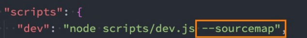

## Vue3初体验

### 对比Vue2的进步

 <span style="color: #da9330">更好的性能、更小的包体积、更好的TypeScript集成、更优秀的API设计。</span>


<span style="font-weight: 600">源码</span>

Vue3的源码全部使用TypeScript来进行重构

<span style="font-weight: 600">性能</span>

Vue2使用Object.defineProperty来劫持数据的getter和setter方法，缺陷是给对象添加/删除属性时，无法劫持和监听，需要借助 `$set`、 `$delete` 这些方法。

Vue3使用Proxy来实现数据的劫持。

<span style="font-weight: 600">删除</span>

如filter

<span style="font-weight: 600">编译优化</span>

生成Block Tree、Slot编译优化、diff算法优化

<span style="font-weight: 600">新的API</span>

- 由 Option API到 Composition API

​    使用 Option API可能导致代码的内聚性非常差，比如created中会使用某一个method来修改data的数据

Composition API 可以将相关代码放在一起进行处理

- 使用Hooks函数增加代码的复用性

​    类似于mixins，将一部分独立的逻辑抽取出去，且做到响应式


### 引入Vue的方式

 <span style="color: #da9330">Vue的本质，就是一个Javascript的库。</span>

- 在页面通过CDN的方式引入

  ```react
  <script src="https://unpkg.com/vue@next"></script>
  ```

- 下载Vue的JS文件，并引入

- 通过npm安装使用

- 通过Vue-Cli创建项目后使用


### 介绍CDN引入

<span style="color: #da9330">内容分发网络</span>

- 通过相互连接的网络系统，能利用到<span style="color: #f7534f;font-weight:600">最靠近</span>每个用户的服务器
- 更快、更可靠地将音乐、图片及其它文件这些<span style="color: #f7534f;font-weight:600">资源</span>发送给用户
- 来提供高性能、可扩展性及低成本的网络内容传递给用户

:whale: 如果将资源部署到处于北京的服务器，那么北京的用户能更快访问到资源。


请求资源：用户→边缘节点→ 父节点→ 源站

获取资源：用户←边缘节点← 父节点← 源站

:ghost:每个节点其实都是一个服务器，用户请求资源时，会去下一级服务器查看是否有缓存，若有缓存，因为离得近，效率会很高。


### Vue3初体验

```html
<body>
  <div id="app"></div>
  <script src="https://unpkg.com/vue@next"></script>
  <script>
    const obj = {
      template: '<div>123</div>'
    }
    const app = Vue.createApp(obj);
    app.mount("#app")
  </script>
</body>
```

:ghost: `Vue.createApp` 接受一个对象，返回一个实例，通过 `mount` 挂载到对应元素上。

:turtle: 实例的 `mount` 方法内部自己会调用 `document.querySelector` 方法并替换掉对应元素的 `innerHTML`。

 

### 引入Vue的JS文件

```html
<body>
  <div id="app"></div>
  <script src="../js/vue.js"></script>
  <script>
    const app = Vue.createApp({
      template: '<div>123</div>'
    }).mount("#app")
  </script>
</body>
```

:whale: CDN引入的路径可以直接在浏览器访问，其内容就是库的源码。

:flipper: 可以通过链式编程来使用 Vue。


### 原生计数器

```html
<body>
    <h2 class="counter">0</h2> 
    <button class="increment">+1</button> 
    <button class="decrement">-1</button> 
    
  <script>
  // 1. 获取所有元素
  const counterEl = document.querySeletor(".counter");
  const incrementEl = document.querySeletor(".increment");
  const decrementEl = document.querySeletor(".decrement");
  
  // 2. 定义变量
  let counter = 100;
  counterEl.innerHTML = counter;
  
  // 3. 监听按钮的点击
  incrementEl.addEventListener('click', () => {
    counter += 1;
    counterEl.innerHTML = counter;
  })
  decrementEl.addEventListener('click', () => {
    counter -= 1;
    counterEl.innerHTML = counter;
  })
  </script>
</body>
```

:turtle: 通过元素的 `innerHTML` 来更改其子节点。


### template写法

#### 写法一

```html
<body>
  <div id="app"></div>

  <script src="../js/vue.js"></script>
  <script>
    Vue.createApp({
      template: `
        <div>
          <h2>内容1</h2>
          <h2>内容2</h2>
        </div>
      `,
    }).mount('#app');
  </script>
</body>
```


#### 写法二

```html
<body>
  <div id="app"></div>

  <script type="x-template" id="demo">
    <div>
      <h2>内容1</h2>
      <h2>内容2</h2>
    </div>
  </script>

  <script src="../js/vue.js"></script>
  <script>
    Vue.createApp({
      template: '#demo',
    }).mount('#app');
  </script>
</body>
```

:star2:当 `template` 接受 `#` 开头的字符串时，会调用 `document.querySelector`。


#### 写法三

```html
<body>
  <div id="app"></div>

  <template id="demo">
    <div>
      <h2>内容1</h2>
      <h2>内容2</h2>
    </div>
  </template>

  <script src="../js/vue.js"></script>
  <script>
    Vue.createApp({
      template: '#demo',
    }).mount('#app');
  </script>
</body>
```

:ghost: 使用 div 代替 template 也可以实现挂载，但 template  能够做到本身被浏览器解析却不被渲染。


### 录—methods

methods属性中定义的方法不应该使用箭头函数的形式，这会导致 `this` 不能按照期望指向组件实例，它会指向定义它的上级作用域，即 `window`。


若使用普通函数的方式，Vue内部会做这么一件事情：

```less
遍历 methods，将方法作为 key
bind 会返回一个将调用者的 this 指向首参（对象）的方法
当调用模板中的 @click="dos" 时，调用的就是 ctx[dos]
```

```react
const publicThis = instance.proxy // 代理，其中包含了实例的属性（如data中的数据）

for(const key in methods) {
  ctx[key] = key.bind(publicThis)
}
```


### 异—选项data必须为函数

在 Vue2，根对象实例的 data 可以为对象，但在 Vue3 中不允许。

### 异—template中允许存在多个根元素

这在 Vue2 中时不允许的。

### 异-filter

在 Vue3 中已经不支持，建议使用计算属性/全局方法替代。

```react
formatPrice(price) {
  return "￥" + price;
}
```


### 声明式VS命令式

 <span style="color: #da9330">两种不同的编程范式。</span>

命令式编程：关注于<span style="color: #f7534f;font-weight:600">怎么做</span> ，如一般的原生开发

声明式编程：关注于<span style="color: #f7534f;font-weight:600">做什么</span> ， 一般由框架（机器）完成<span style="color: #f7534f;font-weight:600">怎么做</span>的过程，如 Vue、React。


### 查看 Vue 的源码

- 第一步：在 GitHub 对应[地址](https://github.com/vuejs/core)，下载源代码

  ```less
  1. 选中Tags的首个非beta版本(不稳定)
  
  2. Download ZIP
  
  3. 解压
  ```

- 第二步：安装依赖

  ```elm
  cnpm install pnpm -g
  ```

  > 记录安装路径
  
  在安装路径或上级尝试下面的命令直至有结果，记录目标路径
  
  ```elm
  pnpm -v
  ```
  
  > 将目标路径添加到用户变量/系统变量的Path中
  
  ```elm
  pnpm install
  ```
  
  :whale: 限制了只能使用这种包管理工具进行依赖安装
  
  ```elm
  git init
  git add .
  git commit -m "fix(install): install dep"
  ```

​      :octopus: 由于项目进行了代码检测的一些配置，故需要上述操作，否则会报错

- 第三步：开启映射后，进行打包

  

  ```elm
  npm run dev
  ```

- 第四步：可以在项目下新建一个 `html`，引入 `packages/vue/dist/vue.global.js` 进行调试代码

​      :star2: 映射以后通过 `debugger` 可以进入到具体的代码文件中。


## Vue3基础语法一


### 补—模板语法

#### 双大括号语法

```react
<!-- 允许-表达式 -->
<span>{{ isShow? 1 : 2 }}</spanspan>
<!-- 错误—赋值语句 -->
<span>{{ var a = 1 }}</spanspan>
<!-- 错误—条件语句 -->
<span>{{ if(1) { return 2 } }}</spanspan>
```


### 基本指令

#### v-once

```react
<!-- 初次渲染后，所有的子组件（节点）不随数据源变化而变化，可用于优化性能 -->
<div v-once>{{ num }}</div>
<!-- 随事件变化 -->
<div>{{ num }}</div>
<button @click="num++">+1</button>
```


### 动态属性

```react
<div :[name]="value">哈哈哈</div>

data() {
  return {
    name: "cba",
    value: "kobe"
  }
}

<!-- 解析渲染后的效果 -->
<div cba="kobe">哈哈哈</div>
```


### 添加多个属性

> 可以将对象上的属性一次性添加到标签上。

```react
<div v-bind="info">哈哈哈哈</div>

data() {
  return {
    info: {
      name: "why",
      age: 18,
    }
  }
}

<!-- 解析渲染后的效果 -->
<div name="why" age="18">哈哈哈</div>
```


### v-on

```react
<!-- 绑定一个表达式: inline statement -->
<button @click="counter++">{{counter}}</button>
<button @click="modelView = true">展开</button>

<!-- 绑定一个对象: 一次添加多个事件监听 -->
<div class="area" v-on="{click: btn1Click, mousemove: mouseMove}"></div>
```


### 遍历数字

```react
<ul>
  <li v-for="(num, index) in 10">{{num}}-{{index}}</li>
</ul>
```


### VNode 和 虚拟DOM

- VNode 即<span style="color: #ed5a65">虚拟节点</span>，本质是一个 JavaScript 对象。
- 它为元素（标签）在 Vue 中的表现。
- 转化过程:  template -> VNode -> 真实DOM
- 如果不只是一个简单的div，而是有一大堆的元素，那么它们应该会形成一个 VNode Tree ,即<span style="color: #ed5a65">虚拟DOM</span>

```react
// template,像 v-on, v-if, {{ }} 这些无法被浏览器直接解析
<div class="title" style="font-size: 30px; color: red;">虎虎生威</div>

// VNode
const vnode = {
  type: "div",
  props: {
    class: "title",
    style: {
      "font-size": "30px",
      color: "red",
    },
  },
  children: "虎虎生威"
}
```


## Vue3组件化开发（一）

### 浅拷贝

```react
const x = {a: 'value', b: '22', c: {cnode: 3}};
const y = Object.assign({}, x); // 浅拷贝

x.a = 'newValue';
console.log(y.a); // 'value'
x.c.cnode = 4;
console.log(y.c.cnode); // 4
```

> x 和 y 指向并非同一块内存地址，但 x.c 本身是一个引用（内存地址），而 y.c 复制了该内存地址。


### Vue3全局注册组件

```react
<a-btn></a-btn>

const app = Vue.createApp(App);

app.component("a-btn", {
  template: `<div>demo</div>`
})

app.mount('#app');
```


### 组件的定义和使用规则

| 注册（定义）方式 | 组件使用方式           |                    补充                     |
| :--------------: | ---------------------- | :-----------------------------------------: |
|    短横线分隔    | 短横线分隔             |                                             |
|    驼峰大小写    | 短横线分隔、驼峰大小写 | 在 DOM （非字符串模板）中不能使用驼峰大小写 |


## Vite2搭建Vue环境

### Vue3对template的支持

```react
npm install vue@next --save
```

<span style="backGround: #efe0b9">index.html</span>

```react
<div id="app"></div>
```

<span style="backGround: #efe0b9">main.js</span>

```react
import { createApp } from 'vue/dist/vue.esm-bundler'; // 需要使用运行时+编译器支持 template

const app = createApp({
  template: `<h2>你好</h2>`
});
app.mount('#app');
```


### Vue不同版本解析

<span style="color: #f7534f;font-weight:600">vue(.runtime).global(.prod).js</span>

- 通过CDN引入的就是这个版本；

- 通过浏览器中的 <script src="..."> 直接使用；

- 会暴露一个全局的Vue来使用；

<span style="color: #f7534f;font-weight:600">vue(.runtime).esm-browser(.prod).js</span>

- 用于通过原生 ES 模块导入使用 (在浏览器中通过 <script type="module"> 来使用)。 

<span style="color: #f7534f;font-weight:600">vue(.runtime).esm-bundler.js</span>

- 用于 <span style="color: #a50">webpack</span> ，rollup 和 parcel 等构建工具；

- 构建工具中默认是vue.runtime.esm-bundler.js； 

- 如果我们需要解析模板template，那么需要手动指定vue.esm-bundler.js； 

<span style="color: #f7534f;font-weight:600">vue.cjs(.prod).js</span>

- 服务器端渲染使用；

- 通过require()在Node.js中使用；

:whale: .runtime 表示仅运行时版本

:whale: .prod 表示压缩版本


### 运行时+编译器 vs 仅运行时

- <span style="color: #f7534f;font-weight:600">运行时+编译器</span>包含了对template模板的编译代码，更加完整，但是也更大一些；

- <span style="color: #f7534f;font-weight:600">仅运行时</span>没有包含对template版本的编译代码，相对更小一些；

:ghost: `.vue` 文件中的template交由 vue-loader 解析，故不需要使用第一种。


### Vue编写DOM元素的方式

- template模板的方式；

- render函数的方式，使用h函数来编写渲染的内容；

- 通过.vue文件中的template来编写模板；


## Vite新增语法特性(二)

### Vue-CLI 的安装和使用

#### 全局安装

```elm
npm install @vue/cli -g
```

:ghost: 以便在任何位置使用命令

#### 升级版本

```elm
npm update @vue/cli -g
```

#### 创建项目

```elm
vue create xxname
```

> xxname 为项目的名称


### 浏览器适配

<span style="backGround: #efe0b9">.browserslistrx</span>

```react
> 1%                  // 市场份额大于1%
last 2 versions       // 每个浏览器的最后两个版本
not dead              // 仍在维护
```

> 根据这些条件决定要打包的css和js要适配哪些浏览器。


## Vue3实现过渡动画

### 代码片段插件推荐

> 针对 vscode。插件名称为 `Vue VSCode Snippets`


#### 生成vue骨架

`vbase-css`


### 快速撸码推荐 [Emmet](https://blog.csdn.net/qq_33744228/article/details/80910377)


### 技巧

```react
import HeyDemo from './HeyDemo.vue'
```

:whale: 在 `vscode` 中，只有加上组件的后缀名，才能有代码提示、才能通过 `Ctrl` 进入资源位置。


### scoped的问题

> 在 vue3 中，会给子组件的根元素也添加上当前组件的区别属性 `data-v-xxx`，这会导致样式穿透，可能是个bug。

```html
<style scoped>
<style>
```


### 非prop的属性继承

> 传递给一个组件某个属性，但是<span style="color: #ff0000">该属性并没有定义对应的props或者emits时</span>，就称之为<span style="color: #a50">非Prop的Attribute</span>
>
> 常见有class、style、id属性。


#### Attribute继承

<span style="backGround: #efe0b9">父组件</span>

```html
<demo class="demo-content" />
```

<span style="backGround: #efe0b9">子组件</span>

```html
<template>
  <div>...</div>
</template>
```

<span style="backGround: #efe0b9">子组件部分转化为DOM</span>

```html
<div data-v-xxxx class="demo-content">...</div>
```

:ghost: 当组件有单个根节点时，非Prop的Attribute将自动添加到<span style="color: #ff0000">根节点</span>的Attribute中。


#### 禁用Attribute继承

> 通过配置可以使组件的根元素不去继承attribute。

```react
<template>
  <div>
    <h2 :class="$attrs.class"></h2>
  </div>
</template>

export default {
  inheritAttrs: false,
}
```

:whale: 另外，可以通过 <span style="color: #a50">$attrs</span> 使子组件中的任意标签获取非props的属性。


#### 绑定所有Attribute

```html
<template>
  <div>
    <h2 v-bind="$attrs"></h2>
  </div>
</template>
```


#### 多个根节点的Attribute

> 多个根节点的attribute如果没有显示的绑定，会报警告，所以必须手动的指定要绑定到哪一个标签上：

```html
<template>
  <div></div>
  <div :class="$attrs.class"></div>
</template>
```


### 记录自定义事件

#### 数组格式

> 在 vue3 中，发送自定义事件还需要使用 `emits` 配置项进行记录。

```react
<button @click="clickAdd">+</button>
<button @click="clickAddN">+</button>

export default {
  emits: ["add", "addN"],
  methdos: {
    clickAdd() {
      this.$emit("add");
    },
    clickAddN() {
      this.$emit("addN", 10, 'hey');
    }
  }
}
```

:turtle: 在父组件接收事件方面，和 vue2 没有区别。

#### 对象格式

> 会用的比较少，如果不能通过验证，代码也能执行，只是控制台会给出一个警告。

```javascript
// 对象写法的目的是为了参数验证，存在验证函数且通过时，需要返回true
emits: {
  add: null,
  addN: (num, str) => {
    if (num > 5) {
      return true
    }
    return false;
  }
}
```

:whale: 仅传递一个参数时，往往将变量命名为 `payload`。


## Vue3其它语法补充

### 非父子组件的通信

Provide/Inject； 

- 无论层级结构有多深，父组件都可以为所有的子孙组件（不包括父组件自身）提供依赖。
- 可以将依赖注入看作是 **long range props**，区别在于：
- 父组件不需要知道哪些子组件使用到它，子组件不需要知道它来自哪里。
- 真实开发中，往往用 Vuex。

Mitt全局事件总线；

- Vue2 中的事件总线的方法已经不能使用。


### Provide和Inject基本使用

<span style="backGround: #efe0b9">grandFather.vue</span>

```react
<father />

export default {
  provide: {
    name: "cat",
    age: 1,
  }
}
```

<span style="backGround: #efe0b9">father.vue</span>

```react
<son />
```

<span style="backGround: #efe0b9">son.vue</span>

```react
<h2>{{name}}-{{age}}</h2>

export default {
  inject: ["name", "age"]
}
```


#### 返回组件实例中的信息

```javascript
export default {
  data() {
    return {
      names: "cat",
    }
  },
  provide() {
    return {
      name: this.names,
      age: 1,
    }
  }
}
```

:ghost: 需要返回实例中的信息时，不能将选项写为对象形式，因为此时它的 `this` 指向 window。


#### 返回响应式的值

```javascript
import { computed } from 'vue';

export default {
  data() {
    return {
      numList: [1, 2],
    }
  },
  provide() {
    return {
      length: computed(() => this.numList.length),
    }
  }
}
```

:ghost: 正常使用时，`provide` 提供给后代的是一个固定值，不会随它的改变而更新，除非借助 `computed`。

```html
<h2>{{length.value}}</h2>
```

:star2: computed返回的是一个<span style="color: #ff0000">ref对象</span>，需要取出其中的<span style="color: #ff0000">value</span>来使用。


### Mitt全局事件总线

> Vue3从实例中移除了 $on、$off 和 $once 方法，但仍可以通过第三方的库去实现**全局事件总线**。

**安装**

```elm
npm install mitt
```

**预定义**

<span style="backGround: #efe0b9">utils/eventbus.js</span>

方式一

```javascript
import mitt from 'mitt';

const emitter = mitt();

export default emitter;
```

方式二

```javascript
import mitt from 'mitt';

export const emitter1 = mitt();
export const emitter2 = mitt();
```

:whale: 如有需要，也可以定义多个实例。

**使用**

<span style="backGround: #efe0b9">me.vue</span>

```javascript
import emitter from './utils/eventbus';

export default {
  methods: {
    handleCickButton() {
      emitter.emit("dos", {name: "cat", age: 12});
    }
  }
}
```

:ghost:  发射/接受的事件组件可以为上下关系也可以为兄弟关系。

:ghost:  像这种事件名，可以新建一个文档用常量名来保存，使用时导入，防止冲突。

<span style="backGround: #efe0b9">borther.vue</span>

```javascript
import emitter from './utils/eventbus';

export default {
  created() {
    emitter.on("dos", (info) => {
      console.log(info);
    })
    emitter.on("*", (type, e) => {
      console.log(type, e);
    })
  }
}
```

:ghost:  第二种写法表示接收任意事件，不管它的命名是什么，它的回调首参为类型。


#### Mitt事件的取消

> 一般在 `unmounted` 时取消监听。

```javascript
// 取消emitter中的所有监听
emitter.all.clear()

// 取消emitter中特定事件的特定回调
function onFoo() {}
emitter.on('foo', onFoo)   // 监听
emitter.off('foo', onFoo)  // 取消监听
```


### 插槽

#### 具名插槽

<span style="backGround: #efe0b9">father.vue</span>

```html
<son>
  <template v-slot:header>
    <h1>title</h1>
  </template>

  <p>main content</p>

  <template v-slot:footer>
    <p>info</p>
  </template>
</son>
```
:star2: <span style="color: #ff0000">与已经废弃的vue2中使用的 `slot` 不同</span>，vue3 需要使用 <span style="color: #ff0000">`v-slot `</span> 且只能添加在 `<template>` 上。

<span style="backGround: #efe0b9">son.vue</span>

```react
<header>
  <slot name="header"></slot>
</header>
<main>
  <slot></slot>
</main>
<footer>
  <slot name="footer"></slot>
</footer>
```

:whale: 不带 `name` 的 `<slot>` 默认为 `name="default"`


#### 自定义具名插槽

> 由父组件进行配置，控制插槽命名的方案雏形。

<span style="backGround: #efe0b9">father.vue</span>

```html
<son :name="demoName">
  <template v-slot:[demoName]>
    <h1>title</h1>
  </template>
</son>

data() {
  return {
    demoName: 'any'
  }
}
```

<span style="backGround: #efe0b9">son.vue</span>

```react
<header>
  <slot :name="demoName"></slot>
</header>

props: {
  demoName: {
    type: String,
    default: ''
  }
}
```


#### 具名插槽的缩写使用

<span style="backGround: #efe0b9">father.vue</span>

```html
<son :name="demoName">
  <template #[demoName]>
    <h1>title</h1>
  </template>
  <template #footer>
    <p>info</p>
  </template>
</son>
```


#### 作用域插槽

> 可以解决编译作用域的问题，即能在父组件中获取到子组件中的”属性“（数据）。
>
>  vue2 中原本用的属性被废弃了。

<span style="backGround: #efe0b9">father.vue</span>

```react
<son :names="names">
  <template v-slot="slotProps">
    <button>{{slotProps.item}}-{{slotProps.index}}</button>
  </template>
</son>

data() {
  return {
    names: ['a', 'b']
  }
}
```

:turtle: 此处的 `slotProps` 可以看作一个对象，它拥有子组件对应插槽中传递上来的属性，对象的命名任意。

 <span style="backGround: #efe0b9">son.vue</span>

```react
<template v-for="(item, index) in names" :key="item">
  <slot :item="item" :index="index"></slot>
</template>

props: {
  names: {
    type: String,
    default: () => []
  }
}
```


##### 具名插槽写法

<span style="backGround: #efe0b9">father.vue</span>

```react
<son :names="names">
  <template v-slot:demo="slotProps">
    <button>{{slotProps.item}}-{{slotProps.index}}</button>
  </template>
</son>
```

:turtle: 此处的 `slotProps` 可以看作一个对象，它拥有子组件对应插槽中传递上来的属性，对象的命名任意。

 <span style="backGround: #efe0b9">son.vue</span>

```react
<template v-for="(item, index) in names" :key="item">
  <slot name="demo" :item="item" :index="index"></slot>
</template>
```


##### 独占默认插槽的缩写

<span style="backGround: #efe0b9">father.vue</span>

```react
<son :names="names" v-slot="slotProps">
  <button>{{slotProps.item}}-{{slotProps.index}}</button>
</son>
```

:turtle: 独占默认插槽指子组件中只用到了默认插槽，没有使用具名插槽。


## 网络请求axios使用和封装


### 动态组件

> 通过该技术可以动态切换需要渲染的组件，可以代替简单场景的”动态路由“。

```react
<component :is="currentTab" />

import Home from './Home.vue';
import About from './About.vue';

export default {
  data() {
    currentTab: 'home',
  }
}
```

<span style="color: #a50">:ghost: 属性is</span>对应的值可以是全局或局部注册的组件。

#### 动态组件的属性传递

<span style="backGround: #efe0b9">father.vue</span>

```html
<component :is="currentTab"
           :age="12"
           @clickSon="clickSon" />
```

 <span style="backGround: #efe0b9">son.vue</span>

```javascript
props: ['age']
```


### keep-alive

> 动态组件在切换时，会导致组件（及内部状态）的销毁，可以用 `keep-alive` 包裹组件以实现缓存。

```html
<keep-alive>
  <component :is="currentTab" />
</keep-alive>
```

:whale: 在动态路由中经常使用到这个技术。


#### keep-alive属性

| 属性名  | 格式                 | 说明                                                   |
| ------- | -------------------- | ------------------------------------------------------ |
| include | str\| RegExp \| arr  | 只有名称匹配的组件会被缓存                             |
| exclude | str \| RegExp \| arr | 名称匹配的组件会不会被缓存                             |
| max     | num\| str            | 最多可以缓存多少组件实例，达到后销毁最近没访问到的实例 |

```html
<keep-alive include="a, b">
  <component :is="currentTab" />
</keep-alive>

<keep-alive :include="/a|b/">
  <component :is="currentTab" />
</keep-alive>

<keep-alive :include="['a', 'b']">
  <component :is="currentTab" />
</keep-alive>
```

:whale: 该属性会去匹配每个组件实例的 `name` 选项。


### 实现异步组件

#### webpack的代码分包

##### 默认打包

- <span style="color: #ff0000">默认情况下</span>，在构建整个组件树的过程中，因为组件和组件之间是通过模块化直接依赖的，那么webpack在打包时就会<span style="color: #ff0000">将这些组件模块打包到一起</span>（比如都放到一个叫做app.js的文件中）；

- 但随着项目的不断庞大，app.js文件的内容过大，会造成<span style="color: #ff0000">首屏的渲染速度变慢</span>；


##### 代码的分包

- 对于一些不需要立即使用的组件，我可以单独对它们进行拆分，拆分成一些小的代码块 chunk.js； 

- 这些 chunk.js 会<span style="color: #ff0000">在需要时才从服务器加载下来</span>，并且运行代码，显示对应的内容；


##### 实现分包

```javascript
import("./utils/math").then(({ sum }) => {
  console.log(sum(20, 30));
})
```

:whale: 通过 `import()` 的语法能够实现分包，它的返回值为一个期约。


#### vue中实现异步组件

> 可以通过 vue 提供的函数实现异步组件。实际开发通常不使用这种方式，而是在路由配置。

写法一

```javascript
import { defineAsyncComponent } from 'vue';
const Home = defineAsyncComponent(() => import("./Home.vue"));

export default {
  components: {
    Home,
  }
}
```

:whale: 接受工厂函数，需要从中返回一个期约对象。

写法二

```javascript
import { defineAsyncComponent } from 'vue';
const Home = defineAsyncComponent({
  // 工厂函数
  loader: () => import("./Home.vue"),
  // 等待加载过程展示的组件
  loadingComponent: Loading,
  // 加载失败展示的组件
  errorComponent: Error,
  // 显示 loadingComponent 对应组件前的延迟
  delay: 2000,
  // 如果加载组件的时间超出了设定值，将显示错误组件
  timeout: 0,
  // 定义组件是否可挂起
  suspensible: true,
});

export default {
  components: {
    Home,
  }
}
```

:whale: 接受一个对象类型，对异步函数进行配置。


#### Suspense

> 为一个内置的全局组件，通过插槽决定备用渲染的组件。
>
> 实验特性，可能API在后续被修改了。

```html
<suspense>
  <!-- 如果default可以显示，那么显示default的内容 -->  
  <template #default>
    <home/>
  </template>
  <!-- 如果default无法显示，那么会显示fallback插槽的内容 -->  
  <template #fallback>
    <loading/>
  </template>
</suspense>
```


### $refs

> 使用 vue 时，不推荐进行 DOM 操作。它提供了 `$refs` 供我们获取元素对象或子组件实例。

| 相似API   | 说明                 |
| --------- | -------------------- |
| $el       | 获取组件实例的根元素 |
| $parent   | 获取父组件实例       |
| $root     | 获取根组件实例       |
| $children | Vue3已移除           |


### v-model组件

#### 默认情况

```react
<ChildComponent v-model="pageTitle" />

<!-- 相当于 2.X -->
<ChildComponent :value="pageTitle" @input="pageTitle = $event" />

<!-- 相当于 3.X -->
<ChildComponent :modelValue="pageTitle" @update:modelValue="pageTitle = $event" />
```

#### 更改model名称

```react
<ChildComponent v-model:title="pageTitle" />

<!-- 是以下的简写: -->

<ChildComponent :title="pageTitle" @update:title="pageTitle = $event" />
```

#### 使用多个v-model

```react
<ChildComponent v-model:title="pageTitle" v-model:content="pageContent" />

<!-- 是以下的简写： -->

<ChildComponent
  :title="pageTitle" @update:title="pageTitle = $event"
  :content="pageContent" @update:content="pageContent = $event"
/>
```

#### 子组件的配合

写法一

```react
<input :value="modelValue" @input="btnClick">

emits: ["update:modelValue"],
props: {
  modelValue: String
},
methods: {
  btnClick(event) {
    this.$emit("update:modelValue", event.target.value)
  },
}
```

写法二

```react
<input v-model="aValue">

emits: ["update:modelValue"],
props: {
  modelValue: String
},
computed: {
  aValue: {
    set(value) {
      this.$emit("update:modelValue", value)
    },
    get() {
      return this.modelValue;
    }
  }
}
```

