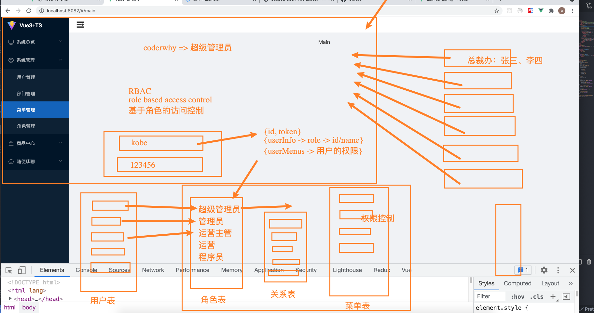

### 基本骨架

文件结构：

```elm
- views
  + login
    - login.vue
    - hooks
    - config
      + account-config.ts
    - components
      + login-panel.vue
      + login-account.vue
      + login-phone.vue
```

:hammer_and_wrench: 对于依赖 ref/reactive/useStore/onMounted 这些方法的逻辑，抽离到 hooks，否则抽离到 config 中。


### 初始架构

<span style="backGround: #efe0b9">views/login/login.vue</span>

```vue
<template>
  <div class="login">
    <login-panel />
  </div>
</template>

<script lang="ts">
import { defineComponent } from 'vue'
import LoginPanel from './components/login-panel.vue'

export default defineComponent({
  components: {
    LoginPanel
  },
  setup() {
    return {}
  }
})
</script>
```


<span style="backGround: #efe0b9">views/login/components/login-panel.vue</span>

```vue
<template>
  <div class="login-pannel">
    <h1 class="title">后台管理系统</h1>
    <el-tabs v-model="currentTab" stretch>
      <el-tab-pane name="account">
        <!-- 自定义标签插槽 -->
        <template #label>
          <span><i class="el-icon-user-solid"></i> 账号登录</span>
        </template>
		<!-- 默认内容插槽 -->
        <login-account />
      </el-tab-pane>
      <el-tab-pane label="手机登录" name="phone">
        <template #label>
          <span><i class="el-icon-mobile-phone"></i> 手机登录</span>
        </template>
        <login-phone />
      </el-tab-pane>
    </el-tabs>
  </div>
</template>

<script lang="ts">
import { defineComponent, ref } from 'vue'
import LoginPhone from './login-phone.vue'
import LoginAccount from './login-account.vue'

export default defineComponent({
  components: {
    LoginPhone,
    LoginAccount
  },
  setup() {
    const currentTab = ref('account') // ①

    return {
      currentTab
    }
  }
})
</script>
```

:ghost: 传入初始值，相当于使用默认类型推导。

:european_castle: 使用 `#label` 作为自定义插槽的标志。


### 规则的导入及表单验证

<span style="backGround: #efe0b9">login-account.vue</span>

```vue
<template>
  <div class="login-account">
    <el-form :model="account" label-width="60px" :rules="rules" ref="formRef">
      <el-form-item label="账号" prop="name">
        <el-input v-model="account.name" />
      </el-form-item>
      <el-form-item label="密码" prop="password">
        <el-input v-model="account.password" />
      </el-form-item>
    </el-form>
  </div>
</template>

<script lang="ts">
import { defineComponent, reactive, ref } from 'vue'
import { rules } from '../config/account-config'
import { ElForm } from 'element-plus'

export default defineComponent({
  setup() {
    const account = reactive({
      name: '',
      password: ''
    })
    const formRef = ref<InstanceType<typeof ElForm>>()
    setTimeout(() => {
      console.log(formRef.value?.validate((valid) => console.log(valid)))
    }, 5000)
    return {
      account,
      rules,
      formRef
    }
  }
})
</script>
```

:hammer_and_wrench: 引入vue方法的顺序： defineComponent、 reactive、 ref

:turtle: 引入的规则，可以直接在 setup 中返回供模板使用，且不需要响应式处理

:turtle: 引用组件时，如果传 const formRef = ref()，相当于any类型，操作时不会有安全检测

:ghost: 引用组件类型时，通过 `<InstanceType<typeof Component>>`  的格式获取

:turtle: 由于 formRef.value 不一定存在，所以用可选链


<span style="backGround: #efe0b9">views/login/config/account-config.ts</span>

```javascript
// 编写好规则
export const rules = {
  name: [
    {
      required: true,
      message: '请输入用户名',
      trigger: 'blur'
    },
    {
      pattern: /^[a-z0-9]{5,10}$/,
      message: '用户名必须是5~10个字母或者数字',
      trigger: 'blur'
    }
  ],
  password: [
    {
      required: true,
      message: '请输入密码',
      trigger: 'blur'
    },
    {
      pattern: /^[a-z0-9]{3,}$/,
      message: '密码必须是3位以上的字母或者数字',
      trigger: 'blur'
    }
  ]
}
```

:hammer_and_wrench: 对于依赖 ref/reactive/useStore/onMounted 这些方法的逻辑，抽离到 hooks，否则抽离到 config 中。


### utils-缓存

```javascript
class LocalCache {
  setCache(key: string, value: any) {
    if (value === undefined) return  // 无法作为字符串解析
    window.localStorage.setItem(key, JSON.stringify(value))
  }

  getCache(key: string) {
    const value = window.localStorage.getItem(key)
    if (value) {
      return JSON.parse(value)
    }
  }

  deleteCache(key: string) {
    window.localStorage.removeItem(key)
  }

  clearCache() {
    window.localStorage.clear()
  }
}

export default new LocalCache()
```

类比函数更具有可扩展性，在导出时可以实例化类。

由于缓存值只接受字符串形式，故需要通过 JSON 字符串化处理。


### 接口

<span style="backGround: #efe0b9">service/login/login.ts</span>

```javascript
import baseRequest from '../index'

import { IAccount, IDataType, ILoginResult } from './type'

enum LoginAPI {
  AccountLogin = '/login',
  LoginUserInfo = '/users/', // 用法: /users/1
  UserMenus = '/role/' // 用法: role/1/menu
}

export function accountLoginRequest(account: IAccount) {
  return baseRequest.request<IDataType<ILoginResult>>({
    method: 'POST',
    url: LoginAPI.AccountLogin,
    data: account
  })
}

export function requestUserInfoById(id: number) {
  return baseRequest.request<IDataType>({
    method: 'GET',
    url: LoginAPI.LoginUserInfo + id
  })
}

export function requestUserMenusByRoleId(id: number) {
  return baseRequest.request<IDataType>({
    method: 'GET',
    url: LoginAPI.UserMenus + id + '/menu'
  })
}
```

<span style="backGround: #efe0b9">service/login/type.ts</span>

```
export interface IAccount {
  name: string
  password: string
}

export interface ILoginResult {
  id: number
  name: string
  token: string
}

export interface IDataType<T = any> {
  code: number
  data: T
}
```

可以复制响应数据，在[辅助网站](http://www.json2ts.com/)自动生成类型

但对于复杂数据结构，存在出错可能；另外手动配置可选值也麻烦，故可以给它一个 any 的默认类型。


#### 跨域解决

<span style="backGround: #efe0b9">vue.config.js</span>

```javascript
module.exports = {
  devServer: {
    proxy: {
      '^/api': {
        target: 'http://demo:6666',
        pathRewrite: {
          '^/api': ''
        },
        changeOrigin: true
      }
    }
  },
}
```

<span style="backGround: #efe0b9">service/request/config.ts</span>

```javascript
const condition = 1

let BASE_URL: string, BASE_NAME: string

if (condition === 1) {
  BASE_URL = '/api'  // 改动
} else if (condition === 2) {
  BASE_URL = 'http://demo/prod'
}

const TIME_OUT = 10000

export { BASE_URL, TIME_OUT }
```


#### 携带token

<span style="backGround: #efe0b9">src/service/request/index.ts</span>

```javascript
import localCache from '@/utils/cache'

class Request {
  ...
  constructor(options: AxiosRequestConfig) {
    ...
    this.instance.interceptors.request.use(
      (config) => {
        const token = localCache.getCache('token')
        if (token) {
          if (!config.headers) {
            config.headers = {}
          }
          config.headers.Authorization = `Bearer ${token}`
        }
        return config
      },
      ...
    )
  }
}

export default Request
```

 :whale: 从缓存中获取 token，并携带在头部字段。


### 状态管理

```elm
- store
  + login
    - login.ts
    - types.ts
  + index.ts
  + types.ts
```

<span style="backGround: #efe0b9">store/index.ts</span>

```javascript
import { createStore } from 'vuex'

import login from './login/login'

import { IRootState } from './types'

const store = createStore<IRootState>({
  state() {
    return {
      name: 'demo'
    }
  },
  mutations: {},
  getters: {},
  actions: {},
  modules: {
    login
  }
})

export function setupStore() {
  store.dispatch('login/loadLocalLogin')
}

export default store
```

<span style="backGround: #efe0b9">store/types.ts</span>

```javascript
export interface IRootState {
  name: string
}
```

:turtle: 对应到 state 中，在<span style="color: #da9330">使用时</span>会检测类型。


#### 登录相关逻辑

> 请求并保存 token，请求并保存用户信息，请求并保存菜单路由信息，跳转首页

<span style="backGround: #efe0b9">store/login/login.ts</span>

```javascript
import { Module } from 'vuex'

import {
  accountLoginRequest,
  requestUserInfoById,
  requestUserMenusByRoleId
} from '@/service/login/login'
import localCache from '@/utils/cache'
import router from '@/router'

import { IAccount } from '@/service/login/type'
import { ILoginState } from './types'
import { IRootState } from '../types'

const loginModule: Module<ILoginState, IRootState> = {
  namespaced: true,
  state() {
    return {
      token: '',
      userInfo: {},
      userMenus: []
    }
  },
  getters: {},
  mutations: {
    changeToken(state, token: string) {
      state.token = token
    },
    changeUserInfo(state, userInfo: any) {
      state.userInfo = userInfo
    },
    changeUserMenus(state, userMenus: any) {
      state.userMenus = userMenus
    }
  },
  actions: {
    async accountLoginAction({ commit }, payload: IAccount) {
      // 1.实现登录逻辑
      const loginResult = await accountLoginRequest(payload)
      const { id, token } = loginResult.data
      commit('changeToken', token)
      localCache.setCache('token', token)

      // 2.请求用户信息
      const userInfoResult = await requestUserInfoById(id)
      const userInfo = userInfoResult.data
      commit('changeUserInfo', userInfo)
      localCache.setCache('userInfo', userInfo)

      // 3.请求用户菜单
      const userMenusResult = await requestUserMenusByRoleId(userInfo.role.id)
      const userMenus = userMenusResult.data
      commit('changeUserMenus', userMenus)
      localCache.setCache('userMenus', userMenus)

      // 4.跳到首页
      router.push('/main')
    },
    // 用于刷新时，重新读取状态
    loadLocalLogin({ commit }) {
      const token = localCache.getCache('token')
      if (token) {
        commit('changeToken', token)
      }
      const userInfo = localCache.getCache('userInfo')
      if (userInfo) {
        commit('changeUserInfo', userInfo)
      }
      const userMenus = localCache.getCache('userMenus')
      if (userMenus) {
        commit('changeUserMenus', userMenus)
      }
    }
  }
}

export default loginModule
```

第一个类型对应该模块的 state ，第二个类型对应根部的 state。

<span style="backGround: #efe0b9">store/login/types.ts</span>

```javascript
export interface ILoginState {
  token: string
  userInfo: any
  userMenus: any
}
```

由于数据结构复杂，所以使用 any


#### 刷新时读取状态

<span style="backGround: #efe0b9">src/main.ts</span>

```
import { setupStore } from './store'

setupStore()
```

:trident: 在每次刷新页面时执行。


### 账号登录实现

```vue
<template>
  <div class="login-panel">
    <h1 class="title">后台管理系统</h1>
    <el-tabs v-model="currentTab" stretch>
      <el-tab-pane name="account">
        <template #label>
          <span><i class="el-icon-user-solid"></i> 账号登录</span>
        </template>
        <login-account ref="accountRef" />
      </el-tab-pane>
      <el-tab-pane name="phone">...</el-tab-pane>
    </el-tabs>

    <div class="account-control">
      <el-checkbox v-model="isKeepPassword">记住密码</el-checkbox>
      <el-link type="primary">忘记密码</el-link>
    </div>

    <el-button type="primary" class="login-btn" @click="handleLoginClick"
      >立即登录</el-button
    >
  </div>
</template>

<script lang="ts">
import { defineComponent, ref } from 'vue'
import LoginAccount from './login-account.vue'

export default defineComponent({
  components: {
    LoginPhone,
    LoginAccount
  },
  setup() {
    // 定义属性
    const currentTab = ref('account')
    const isKeepPassword = ref(true)
    const accountRef = ref<InstanceType<typeof LoginAccount>>()

    // 定义方法
    const handleLoginClick = () => {
      if (currentTab.value === 'account') {
        accountRef.value?.loginAction(isKeepPassword.value)
      } else {
        console.log('点击手机登录')
      }
    }

    return {
      currentTab,
      isKeepPassword,
      accountRef,
      handleLoginClick
    }
  }
})
</script>
```

:turtle: 引用子组件时，类型依旧通过 `<InstanceType<typeof Component>>` 的方式获取。


```vue
<script lang="ts">
import { defineComponent, reactive, ref } from 'vue'
import { ElForm } from 'element-plus'
import { useStore } from 'vuex'
import localCache from '@/utils/cache'

import { rules } from '../config/account-config'

export default defineComponent({
  setup() {
    const store = useStore()
    const account = reactive({
      name: localCache.getCache('name') ?? '',
      password: localCache.getCache('password') ?? ''
    })
    const formRef = ref<InstanceType<typeof ElForm>>()

    const loginAction = (isKeepPassword: boolean) => {
      formRef.value?.validate((valid) => {
        if (valid) {
          // 1.判断是否需要记住密码
          if (isKeepPassword) {
            // 本地缓存
            localCache.setCache('name', account.name)
            localCache.setCache('password', account.password)
          } else {
            localCache.deleteCache('name')
            localCache.deleteCache('password')
          }

          // 2.开始进行登录验证
          store.dispatch('login/accountLoginAction', { ...account })
        }
      })
    }
    return {
      account,
      rules,
      formRef,
      loginAction
    }
  }
})
</script>
```

:cactus: <span style="color: #ff0000">记住密码</span>的逻辑其实可以一并放在 vuex 中实现。


# --首页框架--

### 基本骨架

<span style="backGround: #efe0b9">views/main/main.vue</span>

```vue
<template>
  <div class="main">
    <el-container class="main-content">
      <el-aside width="200px">Aside</el-aside>
      <el-container class="page">
        <el-header class="page-header">Header</el-header>
        <el-main class="page-main">Main</el-main>
      </el-container>
    </el-container>
  </div>
</template>
```

**结构**

```elm
- src
  + components
    - nav-menu           // 组件文件夹
      + src
        - nav-menu.vue   // 组件
      + index.ts         // 出口
    - nav-header
```

:hammer_and_wrench: 由于大部分页面都公用侧边栏和顶部栏，将它抽离到公共组件，主体部分通过动态路由控制。


### 侧边栏骨架

<span style="backGround: #efe0b9">components/nav-menu/index.ts</span>

```javascript
import NavMenu from './src/nav-menu.vue'

export default NavMenu
```


<span style="backGround: #efe0b9">components/nav-menu/src/nav-menu.vue</span>

```vue
<template>
  <div class="nav-menu">
    <div class="menu-logo">
      
      <span>管理系统</span>
    </div>
    <el-menu>...</el-menu>
  </div>
</template>

<script lang="ts">
import { defineComponent, computed } from 'vue'
import { useStore } from '@/store'

export default defineComponent({
  setup() {
    const store = useStore()
    const userMenus = computed(() => store.state.login.userMenus)

    return {
      userMenus
    }
  }
})
</script>
```

:european_castle: 模板中使用路径别名时，用 ~ 作为开头。


### ui导航菜单组件

<span style="color: #f7534f;font-weight:600">el-menu</span> 最外部容器

<span style="color: #f7534f;font-weight:600">el-menu-item</span> 允许的选中项

<span style="color: #f7534f;font-weight:600">el-sub-menu</span>  次级容器，允许嵌套其它内容

<span style="color: #f7534f;font-weight:600">el-menu-item-group</span> 分组，拥有分组标题，嵌套相应内容作为一组


<span style="backGround: #efe0b9">components/nav-menu/src/nav-menu.vue</span>

```vue
<el-menu
  class="el-menu"
  unique-opened
  :default-active="1"
  background-color="#313131"
  text-color="#fff"
  active-text-color="#ffd04b"
>
  <template v-for="subMenu in userMenus" :key="subMenu.id">
    <el-sub-menu :index="subMenu.id">
      <template #title>{{ subMenu.name }}</template>
      <template v-for="item in subMenu.children" :key="item.id">
        <el-menu-item :index="item.id">{{ item.name }}</el-menu-item>
      </template>
    </el-sub-menu>
  </template>
</el-menu>
```

:star2: 在 vue3 中，允许并推荐在 template 中使用 <span style="color: #a50">key</span>。

:turtle: 实际上在插槽中还可以添加图标，适当增加与文字的距离以更好实现<span style="color: #a50">折叠效果</span>。


### 导航菜单的折叠

> 在顶部栏中控制导航菜单的折叠。

**发射事件**

<span style="backGround: #efe0b9">components/nav-header/src/nav-header.vue</span>

```vue
<template>
  <div class="nav-header">
    <el-icon class="expand-icon" @click="handleFoldClick">
      <fold v-if="isFold" />
      <expand v-else />
    </el-icon>
  </div>
</template>

<script lang="ts">
import { defineComponent, ref } from 'vue'

export default defineComponent({
  emits: ['foldChange'],
  setup(props, { emit }) {
    const isFold = ref(false)

    const handleFoldClick = () => {
      isFold.value = !isFold.value
      emit('foldChange', isFold.value)
    }
    return {
      handleFoldClick,
      isFold
    }
  }
})
</script>
```

:ghost: 通过 <span style="color: #a50">ref</span> 处理的结果是一个对象，后续改变的是它的属性，故可以使用 <span style="color: #a50">const</span> 声明。


**传递自定义属性**

<span style="backGround: #efe0b9">views/main/main.vue</span>

```react
<div class="main">
  <el-container class="main-content">
    <el-aside :width="isCollapse ? '60px' : '210px'">
      <nav-menu :collapse="isCollapse" />
    </el-aside>
    <el-container class="page">
      <el-header class="page-header">
        <nav-header @foldChange="handleFoldChange" />
      </el-header>
      <el-main class="page-main">Main</el-main>
    </el-container>
  </el-container>
</div>

setup() {
  const isCollapse = ref(false)

  const handleFoldChange = (isFold: boolean) => {
    isCollapse.value = isFold
  }
  return {
    isCollapse,
    handleFoldChange
  }
}
```

:turtle: 对于 menu 的容器，即侧边栏部分，也要动态控制其宽度以实现正常的视觉效果。

:hammer_and_wrench: 检测：定义方法的参数需要提供类型。


<span style="backGround: #efe0b9">components/nav-menu/src/nav-menu.vue</span>

```less
<el-menu :collapse="collapse"></el-menu>

.el-menu {
  border-right: none;
}
```

:whale: 导航组件默认带右边界，带来不良视觉效果。


### vuex 添加类型检测

#### 原有方式

<span style="backGround: #efe0b9">components/nav-menu/src/nav-menu.vue</span>

```react
import { useStore } from 'vuex'
setup() {
  const store = useStore()
  const userMenus = computed(() => store.state.login.userMenus)

  return {
    userMenus
  }
}
```

:octopus: 默认导入的 store，无法进行类型检测，容易出错。


#### 添加能力

<span style="backGround: #efe0b9">store/type.ts</span>

```javascript
import { ILoginState } from './login/types'

export interface IRootState {
  name: string
  age: number
}

export interface IRootWithModule {
  login: ILoginState
}

export type IStoreType = IRootState & IRootWithModule
```

:hammer_and_wrench: 增加了模块时，继续交叉相应的类型再导出即可。


<span style="backGround: #efe0b9">store/index.ts</span>

```javascript
import { Store, useStore as useVuexStore } from 'vuex'
import { IStoreType } from './types'

export function useStore(): Store<IStoreType> {
  return useVuexStore()
}
```

:european_castle: 导入时使用别名的方法防止命名冲突；

:ghost: 给原本的方法增加了返回值的类型。


<span style="backGround: #efe0b9">components/nav-menu/src/nav-menu.vue</span>

```react
import { useStore } from '@/store'

setup() {
  const store = useStore()
  const userMenus = computed(() => store.state.login.userMenus)
  return {
    userMenus
  }
}
```

:trident: 使用时唯一的区别在于导入位置的不同。


# --权限管理--

<span style="color: #f7534f;font-weight:600">方式一</span>

前端将所有路由注册，根据权限展现菜单的导航项。

缺点：即使用户没有相应权限，也可以通过url访问相应页面，即使是拿不到数据的。


<span style="color: #f7534f;font-weight:600">方式二</span>

不同角色对应不同的路由。登录后获取角色信息，动态地将相应的路由推入到路由映射配置中。

缺点：增加角色时，需要修改前端代码再部署。


<span style="color: #f7534f;font-weight:600">方式三</span>

根据接口返回的菜单数据动态生成路由映射。




### 实现思路

在将权限菜单数据保存到 Vuex 时，<span style="color: #ff0000">动态添加路由</span>（无论是登陆后，还是刷新页面都能保证路由的注册）

1.用专门的一个文件夹，定义导航级页面的路由映射；

2.将全部的导航级页面的路由集合在一起；

3.根据用户权限菜单进行条件筛选，获得当前用户的导航级页面的路由集合。

4.动态添加路由，添加为 main 路由的子路由。

5.给导航项添加点击事件，按<span style="color: #ff0000">映射关系</span>跳转路由


#### 整理导航级别路由

<span style="backGround: #efe0b9">router/main/index.ts</span>

```javascript
// analysis
const dashboard = {
  path: '/main/analysis/dashboard',
  name: 'dashboard',
  component: () => import('@/views/main/analysis/dashboard/dashboard.vue'),
  children: []
}

const overview = {
  path: '/main/analysis/overview',
  name: 'overview',
  component: () => import('@/views/main/analysis/overview/overview.vue'),
  children: []
}

export default { dashboard, overview }
```

按路由项的规范进行定义。


#### 筛选路由

<span style="backGround: #efe0b9">utils/map-menus.ts</span>

```javascript
import { RouteRecordRaw } from 'vue-router'
import mainChilrenRoutes from '@/router/main'

export function mapMenusToRoutes(userMenus: any[]): RouteRecordRaw[] {
  const routes: RouteRecordRaw[] = []

  // 1.先去加载默认所有的routes
  const allRoutes: RouteRecordRaw[] = []

  Object.keys(mainChilrenRoutes).forEach((key) => {
    allRoutes.push((mainChilrenRoutes as any)[key])
  })

  // 2.根据菜单获取需要添加的routes
  const _recurseGetRoute = (menus: any[]) => {
    for (const menu of menus) {
      if (menu.type === 2) {
        const route = allRoutes.find((route) => route.path === menu.url)
        if (route) routes.push(route)
      } else {
        _recurseGetRoute(menu.children)
      }
    }
  }

  _recurseGetRoute(userMenus)

  return routes
}
```

:turtle: 通过 ` (obj as any).key` 的结构获取对象属性，以避免 ts 的警告。

根据接口传的权限菜单结构，这里的筛选条件为菜单项的 url 属性与路由路径一致，且 type 为 2。


#### 注册路由

<span style="backGround: #efe0b9">store/login/login.ts</span>

```javascript
import { mapMenusToRoutes } from '@/utils/map-menus'
import router from '@/router'

mutations: {
  changeUserMenus(state, userMenus: any) {
    state.userMenus = userMenus
    const routes = mapMenusToRoutes(userMenus)
    routes.forEach((route) => {
      router.addRoute('main', route)
    })
  }
},
```

在将权限菜单数据保存到 Vuex 时，<span style="color: #ff0000">动态添加路由</span>（无论是登陆后，还是刷新页面都能保证路由的注册）


#### 导航栏互动

<span style="backGround: #efe0b9">src/components/nav-menu/nav-menu.vue</span>

```react
<el-menu-item @click="handleMenuItemClick(item)">{{ item.name }}</el-menu-item>

import { useRouter } from 'vue-router'

setup() {
  const router = useRouter()
  
  const handleMenuItemClick = (item: any) => {
    router.push(item.url)
  }
  return { handleMenuItemClick }
}
```


#### (tip)路由的执行顺序

<span style="backGround: #efe0b9">main.ts</span>

```javascript
setupStore() // 读取缓存中的个人信息等，也会动态注册路由

const app = createApp(App)

app.use(store).use(router).mount('#app')
```

:octopus: 需要注意的是，在安装路由前就要把路由注册好，否则会导致跳转的路由还未注册，未能匹配的现象。


#### 反向获取激活的菜单项

> 通过路径，在权限菜单的数据中找到匹配项，绑定相应值到<span style="color: #a50">默认激活菜单项</span>的属性上。

<span style="backGround: #efe0b9">utils/map-menus.ts</span>

```javascript
// 传入菜单数据和当前路径，返回当前菜单项
export function pathPathToMenu(userMenus: any[], currentPath: string): any {
  for (const menu of userMenus) {
    if (menu.type === 1) {
      const findMenu = pathPathToMenu(menu.children ?? [], currentPath)
      if (findMenu) {
        return findMenu
      }
    } else if (menu.type === 2 && menu.url === currentPath) {
      return menu
    }
  }
}
```

<span style="backGround: #efe0b9">src/components/nav-menu/nav-menu.vue</span>

```react
<el-menu :default-active="defaultValue">

import { defineComponent, ref, computed } from 'vue'
import { useStore } from '@/store'
import { useRouter, useRoute } from 'vue-router'
import { pathPathToMenu } from '@/utils/map-menus'

export default defineComponent({
  components: {
    ColdDrink,
    IceCreamRound
  },
  props: {
    collapse: {
      type: Boolean,
      default: false
    }
  },
  setup() {
    // store
    const store = useStore()
    const userMenus = computed(() => store.state.login.userMenus)
    
    // router
    const route = useRoute()
    
    // data
    const menu = pathPathToMenu(userMenus.value, route.path)
    const defaultValue = ref(menu.id + '')

    return {
      userMenus,
      defaultValue
    }
  }
})
```


### 更多配置

#### 路由校验token

<span style="backGround: #efe0b9">router/index.ts</span>

```javascript
import localCache from '@/utils/cache'

const router = createRouter({...})

router.beforeEach((to) => {
  if (to.path !== '/login') {
    const token = localCache.getCache('token')
    if (!token) {
      return '/login'
    }
  }
})

export default router
```

:whale: 这之后可以将重定向改为首页的路由了。


#### 首页的重定向

> 由于使用权限菜单充当路由，首页的重定向不能写死，应为权限菜单的第一项。

<span style="backGround: #efe0b9">utils/map-menus.ts</span>

在筛选路由的同时，取出权限菜单的第一项

```javascript
let firstMenu: any = null

export function mapMenusToRoutes(userMenus: any[]): RouteRecordRaw[] {
  const routes: RouteRecordRaw[] = []

  // 1.先去加载默认所有的routes
  const allRoutes: RouteRecordRaw[] = []

  Object.keys(mainChilrenRoutes).forEach((key) => {
    allRoutes.push((mainChilrenRoutes as any)[key])
  })

  // 2.根据菜单获取需要添加的routes
  const _recurseGetRoute = (menus: any[]) => {
    for (const menu of menus) {
      if (menu.type === 2) {
        const route = allRoutes.find((route) => route.path === menu.url)
        if (route) routes.push(route)
        if (!firstMenu) { // 添加这里
          firstMenu = menu
        }
      } else {
        _recurseGetRoute(menu.children)
      }
    }
  }

  _recurseGetRoute(userMenus)

  return routes
}

export { firstMenu }
```

<span style="backGround: #efe0b9">router/index.ts</span>

在注册路由前，就进行了权限菜单路由的初始化，所以 firstMenu 能够拿到

```javascript
import { firstMenu } from '@/utils/map-menus'

// 导航守卫
router.beforeEach((to) => {
  if (to.path !== '/login') {
    const token = localCache.getCache('token')
    if (!token) {
      return '/login'
    }
  }

  if (to.path === '/main') {
    return firstMenu.url
  }
})
```


#### 不存在的页面

<span style="backGround: #efe0b9">router/index.ts</span>

```javascript
const routes: RouteRecordRaw[] = [
  {
    path: '/',
    redirect: '/main'
  },
  {
    path: '/login',
    name: 'login',
    component: () => import('@/views/login/login.vue')
  },
  {
    path: '/main',
    name: 'main',
    component: () => import('@/views/main/main.vue')
    // children: [] -> 根据userMenus来决定 -> children
  },
  {
    path: '/:pathMatch(.*)*',
    name: 'notFound',
    component: () => import('@/views/not-found/not-found.vue')
  }
]
```

:whale: 主要的路由，权限（菜单）级别的路由可以分开配置。


#### 面包屑的配置

```embeddedjs
- commom
  + breadcrumb
    - src
      + breadcrumb.vue
    - types
      + index.ts
    - index.ts
```

**雏形**

<span style="backGround: #efe0b9">commom/breadcrumb/src/breadcrumb.vue</span>

```react
<template>
  <div class="breadcrumb">
    <el-breadcrumb separator="/">
      <template v-for="item in breadcrumbs" :key="item.name">
        <el-breadcrumb-item :to="{ path: item.path }">
          {{ item.name }}
    	</el-breadcrumb-item>
      </template>
    </el-breadcrumb>
  </div>
</template>

import { defineComponent, PropType } from 'vue'
import { IBreadcrumb } from '../types'

props: {
  breadcrumbs: {
    type: Array as PropType<IBreadcrumb[]>,
    default: () => []
  }
},
setup() {
  return {}
}
```

:whale: 当 item.path 为 <span style="color: #a50">undefined</span> 时，点击不会执行跳转。


<span style="backGround: #efe0b9">commom/breadcrumb/types/index.ts</span>

```javascript
export interface IBreadcrumb {
  name: string
  path?: string
}
```


<span style="backGround: #efe0b9">commom/breadcrumb/index.ts</span>

```javascript
import HdBreadcrumb from './src/breadcrumb.vue'

export * from './types'

export default HdBreadcrumb
```


**根据当前路径及权限菜单获取层级信息**

<span style="backGround: #efe0b9">utils/map-menus.ts</span>

```javascript
import { IBreadcrumb } from '@/commom/breadcrumb'

export function pathPathToMenu(
  userMenus: any[],
  currentPath: string,
  breadcrumbs?: IBreadcrumb[]
): any {
  for (const menu of userMenus) {
    if (menu.type === 1) {
      const findMenu = pathPathToMenu(menu.children ?? [], currentPath)
      if (findMenu) {
        breadcrumbs?.push({ name: menu.name })
        breadcrumbs?.push({ name: findMenu.name })
        return findMenu
      }
    } else if (menu.type === 2 && menu.url === currentPath) {
      return menu
    }
  }
}

export function pathMapBreadcrumbs(userMenus: any[], currentPath: string) {
  const breadcrumbs: IBreadcrumb[] = []
  pathPathToMenu(userMenus, currentPath, breadcrumbs)
  return breadcrumbs
}
```

:hammer_and_wrench: 为了减少重复代码，对 pathPathToMenu 方法进行改造，操作为额外添加可选传参及可选链。

:whale: breadcrumbs 中没传 path 是因为当前面包屑只有两层，没必要跳转。


**使用**

<span style="backGround: #efe0b9">components/nav-header/src/nav-header.vue</span>

```react
<hd-breadcrumb class="breadcrumb" :breadcrumbs="breadcrumbs" />

<script lang="ts">
import { defineComponent, ref, computed } from 'vue'
import { useStore } from '@/store'
import { useRoute } from 'vue-router'
import { pathMapBreadcrumbs } from '@/utils/map-menus'

import HdBreadcrumb from '@/commom/breadcrumb'

export default defineComponent({
  components: {
    HdBreadcrumb
  },
  setup(props, { emit }) {
    // 面包屑相关
    const store = useStore()
    const userMenus = store.state.login.userMenus
    const route = useRoute()
    const breadcrumbs = computed(() =>
      pathMapBreadcrumbs(userMenus, route.path)
    )

    return {
      breadcrumbs
    }
  }
})
</script>
```

:european_castle: 使用计算属性，能够根据依赖性的变化而更新值。


# --高级搜索组件--

```elm
- commom
  + search              # 某公共组件                  
    - src        
      + search.vue
    - types
      + index.ts
    - index.ts          # 默认导出组件、导出全部类型
```


### 基本骨架

<span style="backGround: #efe0b9">commom/search/src/search.vue</span>

```vue
<template>
  <div class="search">
    <el-form :label-width="labelWidth">
      <el-row>
        <template v-for="(item, index) in searchItems" :key="index">
          <el-col v-bind="colLayout">
            <el-form-item :label="item.label" :style="itemStyle">
              <template v-if="item.type === 'input'">
                <el-input :placeholder="item.placeholder" v-bind="item.otherOptions" />
              </template>
            </el-form-item>
          </el-col>
        </template>
      </el-row>
    </el-form>
  </div>
</template>

<script lang="ts">
import { defineComponent } from 'vue'

export default defineComponent({
  props: {
    searchItems: {
      type: Array,
      default: () => []
    },
    labelWidth: {
      type: String,
      default: '80px'
    },
    itemStyle: {
      type: Object,
      default: () => ({ padding: '10px 40px' })
    },
    colLayout: {
      type: Object,
      default: () => ({
        xl: 6, // >1920px 4个
        lg: 8,
        md: 12,
        sm: 24,
        xs: 24
      })
    }
  }
})
</script>
```

通过UI框架提供的布局标签，“行中有24个单位的列”，能很方便实现布局。

通过 v-bind 能够将对象上的所有属性绑定到标签上。


<span style="backGround: #efe0b9">Demo.vue</span>

```react
<HdSearch :searchItems="searchItems" />

import HdSearch from '@/commom/search'

setup() {
  const searchItems = [
    {
      type: 'input',
      label: '账号',
      placeholder: '请输入账号'
    },
    {
      type: 'input',
      label: '密码',
      placeholder: '请输入密码'
    },
    {
      type: 'input',
      label: '用户',
      placeholder: '请输入用户'
    }
  ]
  return { searchItems }
}
```


### 自定义属性的类型

<span style="backGround: #efe0b9">commom/search/src/search.vue</span>

```react
import { defineComponent, PropType } from 'vue'
import { IFormItem } from '../types'

props: {
  searchItems: {
    type: Array as PropType<HSearchItem[]>,
    default: () => []
  }
}
```

在 vue3 中，props 的默认值为对象类型时，需要写成箭头函数的形式，否则可能（因为this）出现问题。


<span style="backGround: #efe0b9">commom/search/types/index.ts</span>

```javascript
type IFormType = 'input' | 'password' | 'select' | 'datepicker'

export interface HSearchItem {
  type: IFormType
  label: string
  placeholder?: any
  options?: any[]     // 针对select
  otherOptions?: any  // 针对不同表单类型的特殊属性
}

export interface HSearch {
  formItems: HSearchItem[]
  labelWidth?: string
  colLayout?: any
  itemLayout?: any
}
```

对于对象属性，使用 any 


### 导出规则

**导出**

<span style="backGround: #efe0b9">commom/search/index.ts</span>

```javascript
import HdSearch from './src/search.vue'

export * from './types'

export default HdSearch
```

**导入**

<span style="backGround: #efe0b9">Demo.vue</span>

```javascript
import HdSearch, { HSearch } from '@/commom/search'
```

可以从同一个位置中获取组件，及相关类型。


### 表单控件的宽度

```html
<el-form-item>
  ...
  <template v-else-if="item.type === 'select'">
    <el-select
      :placeholder="item.placeholder"
      v-bind="item.otherOptions"
      style="width: 100%"
    >
      <el-option
        v-for="option in item.options"
        :key="option.value"
        :label="option.label"
        :value="option.value"
      />
    </el-select>
  </template>
  <template v-else-if="item.type === 'datepicker'">
    <el-date-picker
      style="width: 100%"
      v-bind="item.otherOptions"
    ></el-date-picker>
  </template>
</el-form-item>
```

对于部分表单控件，它的默认宽度不会占据全部宽度，需要另外配置。

通过 v-bind 以及 item.otherOptions，可以自定义给表单控件添加适合的属性。


### 使用示例

> 将配置对象分离，同时将所有属性传入。

<span style="backGround: #efe0b9">views/system/main/user/user.vue</span>

```react
<template>
  <div class="user">
    <hd-search v-bind="searchConfig" />
    <div class="content"></div>
  </div>
</template>

<script lang="ts">
import { defineComponent } from 'vue'
import HdSearch from '@/commom/searc'

import { searchConfig } from './config/search'

export default defineComponent({
  name: 'user',
  components: {
    HdSearch
  },
  setup() {
    return {
      searchConfig
    }
  }
})
</script>
```

导入的配置直接在 <span style="color: #a50">setup</span> 中返回出来就可以用。


<span style="backGround: #efe0b9">views/main/system/user/config/search.ts</span>

```react
import { HSearch } from '@/commom/search'

export const searchConfig: HSearch = {
  labelWidth: '80px',
  itemStyle: { padding: '10px 40px' },
  colLayout: {
    span: 8
  },
  searchItems: [
    {
      type: 'input',
      label: '账号',
      placeholder: '请输入账号'
    },
    {
      type: 'select',
      label: '性别',
      placeholder: '请选择性别',
      options: [
        {
          label: '女',
          value: 1
        },
        {
          label: '男',
          value: 2
        }
      ]
    },
    {
      type: 'datepicker',
      label: '用户',
      placeholder: '请输入用户',
      otherOptions: {
        type: 'daterange',
        startPlaceholder: '开始',
        endPlaceholder: '结束',
        rangeSeparator: '至'
      }
    }
  ]
}
```

对于短横线分隔的组件属性，用驼峰式大小写传入也有效。


### 值的双向绑定

> 大多项目的做法为传入一个对象，直接在子组件中绑定对象属性，但这其实违反了单项数据流，eslint 会给出警告。

**类型添加属性**

<span style="backGround: #efe0b9">commom/search/types/index.ts</span>

```javascript
type IFormType = 'input' | 'password' | 'select' | 'datepicker'

export interface HSearchItem {
  ...
  value: string
}

export interface HSearch { ... }
```

**配置添加属性**

<span style="backGround: #efe0b9">views/main/system/user/config/search.ts</span>

```javascript
import { HSearch } from '@/commom/search'

export const searchConfig: HSearch = {
  ...
  searchItems: [
    {
      ...
      value: 'account',
    },
    {
      ...
      value: 'sex',
    },
}
```

**传入属性**

<span style="backGround: #efe0b9">views/main/system/user/user.vue</span>

```react
<hd-search v-bind="searchConfig" v-model="formData">

import { defineComponent, ref } from 'vue'
setup() {
  const formData = ref({
    account: '',
    sex: ''
  })

  return {
    formData
  }
}
```

**拷贝传入值做双向绑定**

<span style="backGround: #efe0b9">commom/search/src/search.vue</span>

```react
<el-form-item :label="item.label" :style="itemStyle">
  <template v-if="item.type === 'input'">
    <el-input
      :placeholder="item.placeholder"
      v-model="formData[`${item.value}`]"
    />
  </template>
</el-form-item>
...

import { defineComponent, PropType, ref, watch } from 'vue'
props: {
  modelValue: {
    type: Object,
    required: true
  },
},
emits: ['update:modelValue'],
setup(props, { emit }) {
  const formData = ref({ ...props.modelValue })
  watch(
    formData,
    (newValue) => {
      console.log(newValue)
      emit('update:modelValue', newValue)
    },
    {
      deep: true
    }
  )
  return { formData }
}
```

:whale: 拿到自定义属性后，将拷贝值用于绑定，并在监听到拷贝值的变化后，发射事件在父组件更新属性值。

:whale: 将根据配置项的 value 属性去绑定表单项与拷贝值的对应项。


### 高度封装-搜索

```elm
- components
  + page-search
    - src
      + page-search.vue
    - index.ts
```

通过插槽添加一些通用部分，同时将搜索组件进行再次封装（包括绑定值）

<span style="backGround: #efe0b9">components/page-search/src/page-search.vue</span>

```react
<template>
  <div class="page-search">
    <hd-search v-bind="searchConfig" v-model="formData">
      <template #header>
        <h1 class="header">高级检索</h1>
      </template>
      <template #footer>
        <div class="handle-btns">
          <el-button icon="el-icon-refresh">重置</el-button>
          <el-button type="primary" icon="el-icon-search">搜索</el-button>
        </div>
      </template>
    </hd-search>
  </div>
</template>

props: {
  searchConfig: {
    type: Object,
    reuqired: true
  }
},
```

<span style="backGround: #efe0b9">commom/search/src/search.vue</span>

```react
<div class="header">
  <slot name="header"></slot>
</div>
<el-form :label-width="labelWidth">...</el-form>
<div class="footer">
  <slot name="footer"></slot>
</div>
```


### 绑定表单的动态生成

<span style="backGround: #efe0b9">components/page-search/src/page-search.vue</span>

```react
props: {
  searchConfig: {
    type: Object,
    reuqired: true
  }
},
setup(props) {

  const searchItems = props.searchConfig?.searchItems ?? []
  const formOriginData: any = {}
  for (const item of searchItems) {
    formOriginData[item.value] = ''
  }
  const formData = ref(formOriginData)

  return { formData }
}
```

:hammer_and_wrench: 双向绑定的对象属性可以根据配置对象的 value 来动态生成。


### 双向绑定对象的重置

**方法一**

<span style="backGround: #efe0b9">components/page-search/src/page-search.vue</span>

```react
<el-button @click="handleResetClick">重置</el-button>

setup(props) {
  // ...
  
  // 点击重置时
  const handleResetClick = () => {
    for (const key in formOriginData) {
      formData.value[`${key}`] = formOriginData[key]
    }
  }
}
```

> 由于在 `search.vue` 中，`const formData = ref({ ...props.modelValue })` 为浅拷贝操作，响应式的为初始的对象引用，所以直接在父组件即 `page-search.vue` 中重新赋值时，无法正常重置。


**方法二**

<span style="backGround: #efe0b9">components/page-search/src/page-search.vue</span>

```react
<hd-form v-bind="searchFormConfig" v-model="formData">
  ...
  <el-button @click="handleResetClick">重置</el-button>
</hd-form>

setup(props) {
  // ...
  
  // 点击重置时
  const handleResetClick = () => {
    formData.value = formOriginData
  }
}
```

<span style="backGround: #efe0b9">commom/search/src/search.vue</span>

```react
...
<el-input
  ...
  :model-value="modelValue[`${item.field}`]"
  @update:modelValue="handleValueChange($event, item.field)"
/>

emits: ['update:modelValue'],
setup(props, { emit }) {
  const handleValueChange = (value: any, field: string) => {
    emit('update:modelValue', { ...props.modelValue, [field]: value })
  }

  return {
    handleValueChange
  }
}
```

:turtle: 原本的做法是 <span style="color: #a50">v-model</span> 拷贝后的对象属性；现在将语法糖拆分，下层的表单控件组件只是动态绑定值，让父组件去更新原对象。


# --表格数据--

这里采取将表格数据保存到 vuex 中的做法（其实也可以保存到组件）。

按每个菜单组进行划分，每个菜单组对应一个模块。

```elm
- store
  + main
    - system
      + system.ts
      + types.ts
    - product
    - ...
```


### 创建模块

<span style="backGround: #efe0b9">store/main/system/system.ts</span>

```javascript
import { Module } from 'vuex'
import { IRootState } from '@/store/types'
import { ISystemState } from './types'

const systemModule: Module<ISystemState, IRootState> = {
  namespaced: true,
  state() {
    return {
      userList: [],
      userCount: 0
    }
  },
}

export default systemModule
```

:hammer_and_wrench: 定义的接口用 `I` 作为开头。


<span style="backGround: #efe0b9">store/main/system/types.ts</span>

```java
export interface ISystemState {
  userList: any[]
  userCount: number
}
```


<span style="backGround: #efe0b9">store/index.ts</span>

```javascript
import login from './login/login'
import system from './main/system/system'

const store = createStore<IRootState>({
  modules: {
    login,
    system
  }
})
```


<span style="backGround: #efe0b9">store/types.ts</span>

```javascript
import { ILoginState } from './login/types'
import { ISystemState } from './main/system/types'

export interface IRootState {
  name: string
  age: number
}

export interface IRootWithModule {
  login: ILoginState
  system: ISystemState
}

export type IStoreType = IRootState & IRootWithModule
```


### 请求数据

**定义请求**

```elm
- service
  + main 
    - system
      + system.ts
    - ..
  + types.ts
```

<span style="backGround: #efe0b9">service/types.ts</span>

```javascript
export interface IDataType<T = any> {
  code: number
  data: T
}
```

<span style="backGround: #efe0b9">service/main/system/system.ts</span>

```javascript
import baseRequest from '@/service'

import { IDataType } from '@/service/types'

export function getPageListData(url: string, data: any) {
  return baseRequest.request<IDataType>({
    method: 'post',
    url,
    data
  })
}
```

**保存请求数据**

<span style="backGround: #efe0b9">store/main/system/system.ts</span>

```javascript
import { Module } from 'vuex'
import { IRootState } from '@/store/types'
import { ISystemState } from './types'

import { getPageListData } from '@/service/main/system/system'

const systemModule: Module<ISystemState, IRootState> = {
  namespaced: true,
  state() {
    return {
      userList: [],
      userCount: 0
    }
  },
  mutations: {
    changeUserList(state, userList: any[]) {
      state.userList = userList
    },
    changeUserCount(state, userCount: number) {
      state.userCount = userCount
    }
  },
  actions: {
    async getPageListAction({ commit }, payload: any) {
      // 请求页面数据
      const pageResult = await getPageListData(
        payload.url,
        payload.data
      )
      const { list, totalCount } = pageResult.data
      commit('changeUserList', list)
      commit('changeUserCount', totalCount)
    }
  }
}

export default systemModule
```

**页面发起请求**

<span style="backGround: #efe0b9">views/main/system/user/user.vue</span>

```react
import { defineComponent, computed } from 'vue'
import { useStore } from '@/store'

setup() {
  const store = useStore()
  store.dispatch('system/getPageListAction', {
    url: '/users/list',
    data: {
      offset: 0,
      size: 10
    }
  })

  const userList = computed(() => store.state.system.userList)
  const userCount = computed(() => store.state.system.userCount)


  return {
    userList,
    propList
  }
}
```


### 表格封装原理

替代掉多个标签，通过对象的方式去配置表格的信息。

<span style="backGround: #efe0b9">views/main/system/user/user.vue</span>

```react
<div class="content">
  <el-table :data="userList" border style="width: 100%">
    <template v-for="propItem in propList" :key="propItem.prop">
       <el-table-column v-bind="propItem" align="center"></el-table-column>
    </template>
  </el-table>
</div>

setup() {
  const store = useStore()
  store.dispatch('system/getPageListAction', {
    pageUrl: '/users/list',
    queryInfo: {
      offset: 0,
      size: 10
    }
  })

  const userList = computed(() => store.state.system.userList)

  const propList = [
    { prop: 'name', label: '用户名', minWidth: '100' },
    { prop: 'realname', label: '真实姓名', minWidth: '100' },
    { prop: 'cellphone', label: '手机号码', minWidth: '100' }
  ]

  return {
    userList,
    propList
  }
}
```


### 表格封装

```elm
- commom
  + table
    - src
      + table.vue
    - index.ts
```

**封装**

<span style="backGround: #efe0b9">commom/index.ts</span>

```javascript
import HdTable from './src/table.vue'

export default HdTable
```

<span style="backGround: #efe0b9">commom/table/src/table.vue</span>

```react
<template>
  <div class="table">
    <el-table :data="listData" border style="width: 100%">
      <template v-for="propItem in propList" :key="propItem.prop">
        <el-table-column v-bind="propItem" align="center"></el-table-column>
      </template>
    </el-table>
  </div>
</template>

<script lang="ts">
import { defineComponent } from 'vue'

export default defineComponent({
  props: {
    listData: {
      type: Array,
      required: true
    },
    propList: {
      type: Array,
      required: true
    }
  },
  setup() {
    return {}
  }
})
</script>
```

**调用**

<span style="backGround: #efe0b9">views/main/system/user/user.vue</span>

```react
<div class="content">
  <hd-table :listData="userList" :propList="propList"></hd-table>
</div>

import HdTable from '@/commom/table'
```


### 插槽的使用

**封装**

<span style="backGround: #efe0b9">commom/table/src/table.vue</span>

```html
<div class="table">
  <el-table :data="listData" border style="width: 100%">
    <template v-for="propItem in propList" :key="propItem.prop">
      <el-table-column v-bind="propItem" align="center">
        <template #default="scope">
          <slot :name="propItem.slotName" :row="scope.row">
            {{ scope.row[propItem.prop] }}
          </slot>
        </template>
      </el-table-column>
    </template>
  </el-table>
</div>
```

el-table-column，即每列的数据都能拿到默认插槽；可以继续向上封装插槽，并提供一个展示原数据的默认值。

el-table-column 的默认插槽中，能够拿到内部传递上来的 row 属性，对应每行（项）数据。

:hammer_and_wrench: 通过 slot 中的 name 属性动态<span style="color: #ff0000">定义具名插槽</span>；通过其它属性<span style="color: #ff0000">向上传递数据</span>。

**调用**

<span style="backGround: #efe0b9">views/main/system/user/user.vue</span>

```react
<div class="content">
  <hd-table :listData="userList" :propList="propList">
    <template #status="scope">
      <el-button>{{ scope.row.enable ? '启用' : '禁用' }}</el-button>
    </template>
    <template #createAt="scope">
      <strong>{{ scope.row.createAt }}</strong>
    </template>
  </hd-table>
</div>

const propList = [
  { prop: 'name', label: '用户名', minWidth: '100' },
  { prop: 'realname', label: '真实姓名', minWidth: '100' },
  { prop: 'cellphone', label: '手机号码', minWidth: '100' },
  { prop: 'enable', label: '状态', minWidth: '100', slotName: 'status' },
  {
    prop: 'createAt',
    label: '创建时间',
    minWidth: '250',
    slotName: 'createAt'
  },
  {
    prop: 'updateAt',
    label: '更新时间',
    minWidth: '250',
    slotName: 'updateAt'
  }
]
```

:hammer_and_wrench: 给需要改变属性格式的配置对象添加一个 slotName 属性，用于指定<span style="color: #a50">具名插槽</span>，尽量与 prop 一致。


### 筛选&序号&操作

<span style="backGround: #efe0b9">commom/table/src/table.vue</span>

```react
<div class="table">
  <el-table :data="listData" border style="width: 100%" 
    @selection-change="handleSelectionChange">
    <!-- 动态的筛选和序号列 -->
    <el-table-column v-if="showSelectColumn" type="selection"
      align="center" width="60"></el-table-column>
    <el-table-column v-if="showIndexColumn" type="index"
      label="序号" align="center" width="80"></el-table-column>
    <!-- 根据外部配置生成的列 -->
    <template v-for="propItem in propList" :key="propItem.prop">
      <el-table-column v-bind="propItem" align="center">
        <template #default="scope">
          <slot :name="propItem.slotName" :row="scope.row">
            {{ scope.row[propItem.prop] }}
          </slot>
        </template>
      </el-table-column>
    </template>
  </el-table>
</div>

props: {
  showIndexColumn: {
    type: Boolean,
    default: false
  },
  showSelectColumn: {
    type: Boolean,
    default: false
  }
},
emits: ['selectionChange'],
setup(props, { emit }) {
  const handleSelectionChange = (value: any) => {
    emit('selectionChange', value)
  }

  return {
    handleSelectionChange
  }
}
```

:whale: 选中列发生改变时，能够在 <span style="color: #a50">el-table</span> 上接受到事件，获取到项数据。

<span style="backGround: #efe0b9">views/main/system/user/user.vue</span>

```react
<div class="content">
  <hd-table :listData="userList" :propList="propList" :showIndexColumn="true">
    <template #status="scope">
      <el-button>{{ scope.row.enable ? '启用' : '禁用' }}</el-button>
    </template>
    <template #createAt="scope">
      <strong>{{ scope.row.createAt }}</strong>
    </template>
    <!-- 操作列 -->
    <template #operate>
      <div class="handle-btns">
        <el-button icon="el-icon-edit" size="mini" type="text"
          >编辑</el-button
        >
        <el-button icon="el-icon-delete" size="mini" type="text"
          >删除</el-button
        >
      </div>
    </template>
  </hd-table>
</div>

propList: [
  { prop: 'name', label: '用户名', minWidth: '100' },
  ...,
  { label: '操作', minWidth: '120', slotName: 'operate' }
],
```


### 头尾插槽

<span style="backGround: #efe0b9">commom/table/src/table.vue</span>

```react
<div class="table">
  <!-- 表格前的标题、按钮等 -->
  <div class="header">
    <slot name="header">
      <div class="title">{{ title }}</div>
      <div class="handler">
        <slot name="headerHandler"></slot>
      </div>
    </slot>
  </div>
  <!-- 表格 -->
  <el-table>...</el-table>
  <!-- 表格后的分页 -->
  <div class="footer">
    <slot name="footer">
      <el-pagination
        @size-change="handleSizeChange"
        @current-change="handleCurrentChange"
        :current-page="currentPage4"
        :page-sizes="[100, 200, 300, 400]"
        :page-size="100"
        layout="total, sizes, prev, pager, next, jumper"
        :total="400"
      >
      </el-pagination>
    </slot>
  </div>
</div>

props: {
  title: {
    type: String,
    default: ''
  },
}
```

:hammer_and_wrench: 可以给插槽配置上默认内容。

**使用示例**

<span style="backGround: #efe0b9">views/main/system/user/user.vue</span>

```react
<div class="content">
  <hd-table :listData="userList" :propList="propList" :showIndexColumn="true">
    <!-- 1.header中的插槽 -->
      <template #headerHandler>
        <el-button type="primary" size="medium">新建用户</el-button>
      </template>
    <!-- 2.列中的插槽 -->
    <template #status="scope">
      <el-button>{{ scope.row.enable ? '启用' : '禁用' }}</el-button>
    </template>
  </hd-table>
</div>
```


### 高度封装-表格

```elm
- components
  + page-content
    - src
      + page-content.vue
    - index.ts
```


<span style="backGround: #efe0b9">components/page-content/src/page-content.vue</span>

```react
<template>
  <div class="page-content">
    <hd-table :listData="userList" v-bind="contentTableConfig">
      ...
    </hd-table>
  </div>
</template>

<script lang="ts">
import { defineComponent, computed } from 'vue'
import { useStore } from '@/store'

import HdTable from '@/commom/table'

export default defineComponent({
  components: {
    HdTable
  },
  props: {
    contentTableConfig: {
      type: Object,
      require: true
    }
  },
  setup() {
    const store = useStore()
    store.dispatch('system/getPageListAction', {
      url: '/users/list',
      data: {
        offset: 0,
        size: 10
      }
    })
    const userList = computed(() => store.state.system.userList)
    
    return {
      userList
    }
  }
})
</script>
```

将整个表格抽离出来，将所有配置属性一并传入。

**使用**

<span style="backGround: #efe0b9">views/main/system/user/config/content.ts</span>

```react
<div class="user">
  <page-search :searchFormConfig="searchFormConfig" />
  <page-content
    :contentTableConfig="contentTableConfig"
    pageName="user"
  ></page-content>
</div>

import PageContent from '@/components/page-content'

import { contentTableConfig } from './config/content'

components: {
  PageContent
},
setup() {
  return {
    contentTableConfig
  }
}
```

:point_down: pageName 属性是提供给<span style="background: pink">接口抽离</span>时使用的。

<span style="backGround: #efe0b9">views/main/system/user/config/content.ts</span>

```javascript
export const contentTableConfig = {
  title: '用户列表',
  propList: [
    { prop: 'name', label: '用户名', minWidth: '100' },
    { prop: 'realname', label: '真实姓名', minWidth: '100' },
    { prop: 'cellphone', label: '手机号码', minWidth: '100' },
    { prop: 'enable', label: '状态', minWidth: '100', slotName: 'status' },
    {
      prop: 'createAt',
      label: '创建时间',
      minWidth: '250',
      slotName: 'createAt'
    },
    {
      prop: 'updateAt',
      label: '更新时间',
      minWidth: '250',
      slotName: 'updateAt'
    },
    { label: '操作', minWidth: '120', slotName: 'handler' }
  ],
  showIndexColumn: true,
  showSelectColumn: true
}
```


### 请求数据的封装

<span style="backGround: #efe0b9">store/main/system/system.ts</span>

```javascript
import { Module } from 'vuex'
import { IRootState } from '@/store/types'
import { ISystemState } from './types'

import { getPageListData } from '@/service/main/system/system'

const systemModule: Module<ISystemState, IRootState> = {
  namespaced: true,
  state() {
    return {
      userList: [],
      userCount: 0,
      roleList: [],
      roleCount: 0
    }
  },
  mutations: {
    changeUsersList(state, userList: any[]) {
      state.userList = userList
    },
    changeUsersCount(state, userCount: number) {
      state.userCount = userCount
    },
    changeRoleList(state, list: any[]) {
      state.roleList = list
    },
    changeRoleCount(state, count: number) {
      state.roleCount = count
    }
  },
  getters: {
    pageListData(state) {
      return (pageName: string) => {
        return (state as any)[`${pageName}List`]
      }
    }
  },
  actions: {
    async getPageListAction({ commit }, payload: any) {
      // 获取请求路径
      let pageName = payload.pageName
      pageName = pageName === 'user' ? 'users' : pageName
      const pageUrl = `/${pageName}/list`

      // 请求页面数据
      const pageResult = await getPageListData(pageUrl, payload.queryInfo)
      const { list, totalCount } = pageResult.data

      pageName = pageName === 'users' ? 'user' : pageName
      const changePageName = pageName.slice(0, 1).toUpperCase() + pageName.slice(1)
      commit(`change${changePageName}List`, list)
      commit(`change${changePageName}Count`, totalCount)
    }
  }
}

export default systemModule
```

:octopus: 由于接口需要的是 users，而先前的步骤中都写成了 userList，故对这个值进行特殊处理。

:hammer_and_wrench: 通过 getters 返回一个方法，能够传入的 pageName 来获取对应的数据。

:hammer_and_wrench: 实际上的接口并不一定严格有序，可以通过 switch 或 枚举值等方式匹配请求路径。

<span style="backGround: #efe0b9">store/main/system/types.ts</span>

```
export interface ISystemState {
  userList: any[]
  userCount: number
  roleList: any[]
  roleCount: number
}
```

这里添加一个列表的数据

<span style="backGround: #efe0b9">components/page-content/src/page-content.vue</span>

```react
<template>
  <div class="page-content">
    <hd-table :listData="dataList" v-bind="contentTableConfig">
      ...
    </hd-table>
  </div>
</template>

<script lang="ts">
import { defineComponent, computed } from 'vue'
import { useStore } from '@/store'

import HdTable from '@/commom/table'

export default defineComponent({
  components: {
    HdTable
  },
  props: {
    contentTableConfig: {
      type: Object,
      require: true
    },
    pageName: {
      type: String,
      required: true
    }
  },
  setup(props) {
    const store = useStore()
    store.dispatch('system/getPageListAction', {
      pageName: props.pageName,
      queryInfo: {
        offset: 0,
        size: 10
      }
    })

    const dataList = computed(() =>
      store.getters[`system/pageListData`](props.pageName)
    )

    return {
      dataList
    }
  }
})
</script>
```

:hammer_and_wrench: 定义自定义属性 pageName，来请求/获取相应表格数据；

:hammer_and_wrench: 由于接口进行了封装，表格数据更名为更具通性的 dataList。


# --表格搜素联动实现--

### 搜索和重置实现

```
       父
emit ↗  ↘  调用查询列表的方法 
   搜索   列表
```

<span style="backGround: #efe0b9">components/page-search/src/page-search.vue</span>

```react
<el-button @click="handleResetClick">重置</el-button>
<el-button type="primary" @click="handleQueryClick">搜索</el-button>

emits: ['resetBtnClick', 'queryBtnClick'],
setup(props, { emit }) {
  // ...

  // 重置
  const handleResetClick = () => {
    for (const key in formOriginData) {
      formData.value[`${key}`] = formOriginData[key]
    }
    emit('resetBtnClick')
  }

  // 搜索
  const handleQueryClick = () => {
    emit('queryBtnClick', formData.value)
  }

  return { .., handleResetClick, handleQueryClick }
}
```

<span style="backGround: #efe0b9">views/main/system/user/user.vue</span>

```react
<div class="user">
  <page-search
    :searchConfig="searchConfig"
    @resetBtnClick="handleResetClick"
    @queryBtnClick="handleQueryClick"
  />
  <page-content
    ref="pageContentRef"
    :contentTableConfig="contentTableConfig"
    pageName="user"
  ></page-content>
</div>

setup() {
  const pageContentRef = ref<InstanceType<typeof PageContent>>()
  const handleResetClick = () => {
    pageContentRef.value?.getPageData()
  }
  const handleQueryClick = (queryInfo: any) => {
    pageContentRef.value?.getPageData(queryInfo)
  }
  return { ..., pageContentRef, handleResetClick, handleQueryClick }
}
```

:european_castle: 在初始化时，子组件可能还没挂载，所以调用它的方法/属性需要用到可选链。

:european_castle: 引用组件时，添加对应的类型，可以提示（检测）内部的属性和方法。

<span style="backGround: #efe0b9">components/page-content/src/page-content.vue</span>

```react
setup(props) {
  // ...
  // 发送网络请求
  const getPageData = (queryInfo: any = {}) => {
    store.dispatch('system/getPageListAction', {
      pageName: props.pageName,
      queryInfo: {
        offset: 0,
        size: 10,
        ...queryInfo
      }
    })
  }
  getPageData()


  return { ..., getPageData }
}
```


### 搜索和重置的抽离

<span style="backGround: #efe0b9">src/hooks/use-page-search.ts</span>

```javascript
import { ref } from 'vue'
import PageContent from '@/components/page-content'

export function usePageSearch() {
  const pageContentRef = ref<InstanceType<typeof PageContent>>()
  const handleResetClick = () => {
    pageContentRef.value?.getPageData()
  }
  const handleQueryClick = (queryInfo: any) => {
    pageContentRef.value?.getPageData(queryInfo)
  }
  return [pageContentRef, handleResetClick, handleQueryClick]
}
```

:turtle: 为了实现类型检测，还导入了组件。

:whale: 导出的方式可以为数组（元组），也可以为对象。

<span style="backGround: #efe0b9">views/main/system/user/user.vue</span>

```javascript
import { usePageSearch } from '@/hooks/use-page-search'

setup() {
  const [pageContentRef, handleResetClick, handleQueryClick] = usePageSearch()

  return {
    ...,
    pageContentRef,
    handleResetClick,
    handleQueryClick
  }
}
```


### 获取分页数量

<span style="backGround: #efe0b9">store/main/system/system.ts</span>

```react
getters: {
  ...,
  pageListCount(state) {
    return (pageName: string) => {
      return (state as any)[`${pageName}Count`]
    }
  }
},
```

<span style="backGround: #efe0b9">components/page-content/src/page-content.vue</span>

```react
<hd-table :listCount="listCount"></hd-table>

setup(props) {
  const store = useStore()
  
  const listCount = computed(() =>
    store.getters[`system/pageListCount`](props.pageName)
  )
  return { ..., listCount }
}
```

<span style="backGround: #efe0b9">commom/table/src/table.vue</span>

```react
<slot name="footer">
  <el-pagination
    ...
    :total="listCount"
  >
  </el-pagination>
</slot>

props: {
  listCount: {
    type: Number,
    default: 0
  }
},
```


### 分页的联动

<span style="backGround: #efe0b9">components/page-content/src/page-content.vue</span>

```react
<hd-table v-model:page="pageInfo"></hd-table>

setup(props) {
  // ...

  // 双向绑定pageInfo，并监听变化
  const pageInfo = ref({ currentPage: 0, pageSize: 10 })
  watch(pageInfo, () => getPageData())

  // 请求列表
  const getPageData = (queryInfo: any = {}) => {
    store.dispatch('system/getPageListAction', {
      pageName: props.pageName,
      queryInfo: {
        offset: (pageInfo.value.currentPage - 1) * pageInfo.value.pageSize,
        size: pageInfo.value.pageSize,
        ...queryInfo
      }
    })
  }
  getPageData()

  return {
    ...,
    getPageData,
    pageInfo,
  }
}
```

<span style="backGround: #efe0b9">commom/table/src/table.vue</span>

```react
<slot name="footer">
  <el-pagination
    @size-change="handleSizeChange"
    @current-change="handleCurrentChange"
    :current-page="page.currentPage"
    :page-size="page.pageSize"
    :page-sizes="[10, 20, 30]"
    layout="total, sizes, prev, pager, next, jumper"
    :total="listCount"
  >
  </el-pagination>
</slot>

props: {
  page: {
    type: Object,
    default: () => ({ currentPage: 0, pageSize: 10 })
  },
},
emits: ['update:page'],
setup(props, { emit }) {
  // ...

  const handleCurrentChange = (currentPage: number) => {
    emit('update:page', { ...props.page, currentPage })
  }

  const handleSizeChange = (pageSize: number) => {
    emit('update:page', { ...props.page, pageSize })
  }

  return { ..., handleCurrentChange, handleSizeChange }
}
```


# ----

### 快速搭建页面（表格）

```elm
- views 
  + main
    - product
      + goods
        - config
          + content.ts
        - goods.vue
```

**搭建页面**

<span style="backGround: #efe0b9">views/main/product/goods/goods.vue</span>

```react
<template>
  <div class="goods">
    <page-content :contentTableConfig="contentTableConfig" pageName="goods" />
  </div>
</template>

<script lang="ts">
import { defineComponent } from 'vue'
import PageContent from '@/components/page-content'

import { contentTableConfig } from './config/content'

export default defineComponent({
  name: 'goods',
  components: {
    PageContent
  },
  setup() {
    return {
      contentTableConfig
    }
  }
})
</script>
```

>  配置文件，略。


**增加对应容器和类型**

> 按理来说，应该新建一个 product 文件夹用于储存的。

<span style="backGround: #efe0b9">store/main/system/system.ts</span>

```react
state() {
  return {
    ...
    goodsList: [],
    goodsCount: 0,
  }
},
mutations: {
  ...
  changeGoodsList(state, list: any[]) {
    state.goodsList = list
  },
  changeGoodsCount(state, count: number) {
    state.goodsCount = count
  }
},
```

<span style="backGround: #efe0b9">store/main/system/types.ts</span>

```javascript
export interface ISystemState {
  usersList: any[]
  usersCount: number
  roleList: any[]
  roleCount: number
  goodsList: any[]
  goodsCount: number
}
```


### 页面的动态插槽

多层级嵌套下，页面定义自身独特插槽的方案。

<span style="backGround: #efe0b9">components/page-content/src/page-content.vue</span>

```react
</hd-table>
  <!-- 其它插槽、固定插槽 -->
  ...
  <!-- 在page-content中动态插入剩余的插槽 -->
  <template
    v-for="item in otherPropSlots"
    :key="item.prop"
    #[item.slotName]="scope"
  >
    <slot :name="item.slotName" :row="scope.row"></slot>
  </template>
</hd-table>

setup(props) {
  // ...

  // 获取剩余的插槽名称
  const otherPropSlots = props.contentTableConfig?.propList.filter(
    (item: any) => {
      if (item.slotName === 'status') return false
      if (item.slotName === 'createAt') return false
      if (item.slotName === 'updateAt') return false
      if (item.slotName === 'handler') return false
      if (item.slotName === undefined) return false
      return true
    }
  )

  return { otherPropSlots }
}
```

:turtle: 排除了固定（通用）插槽和不使用插槽的项。

<span style="backGround: #efe0b9">views/main/product/goods/goods.vue</span>

```react
<page-content :contentTableConfig="contentTableConfig" pageName="goods">
  <template #image="scope">
    <el-image
      style="width: 60px; height: 60px"
      :src="scope.row.imgUrl"
      :preview-src-list="[scope.row.imgUrl]"
    >
    </el-image>
  </template>
  <template #oldPrice="scope">{{ '¥' + scope.row.oldPrice }}</template>
</page-content>
```


### 树形数据的表格

> 也许会存在一两个表格，需要特殊的功能，如为树形数据的表格。

<span style="backGround: #efe0b9">commom/table/src/table.vue</span>

```react
<el-table v-bind="childrenProps">...</el-table>

props: {
  childrenProps: {
    type: Object,
    default: () => ({})
  }
},
```

 :octopus: 这里的默认值如果写成 `default: () => {}`，会报错。

搭建菜单页面，[细节略](#快速搭建页面（表格）)

<span style="backGround: #efe0b9">views/main/system/menu/config/content.ts</span>

```react
export const contentTableConfig = {
  ...,
  childrenProps: {
    rowKey: 'id',
    treeProps: {
      children: 'children'
    }
  }
}
```


### 可选的分页页脚

<span style="backGround: #efe0b9">commom/table/src/table.vue</span>

```react
<div class="footer" v-if="showFooter">...</div>

props: {
  showFooter: {
    type: Boolean,
    default: true
  }
},
```

<span style="backGround: #efe0b9">views/main/system/menu/config/content.ts</span>

```react
export const contentTableConfig = {
  ...,
  showFooter: false
}
```

:whale: 对于使用树形数据类型的表格，一般不需要分页。


### 按钮权限的管理

**定义获取权限的方法**

<span style="backGround: #efe0b9">utils/map-menus.ts</span>

> 取到的数据结构的特点为，权限保存在第三层级中。

```react
export function mapMenusToPermissions(userMenus: any[]) {
  const permissions: string[] = []

  const _recurseGetPermission = (menus: any[]) => {
    for (const menu of menus) {
      if (menu.type === 1 || menu.type === 2) {
        _recurseGetPermission(menu.children ?? [])
      } else if (menu.type === 3) {
        permissions.push(menu.permission)
      }
    }
  }
  _recurseGetPermission(userMenus)

  return permissions
}
```

**获取并保存权限**

<span style="backGround: #efe0b9">store/login/login.ts</span>

```javascript
import { ..., mapMenusToPermissions } from '@/utils/map-menus'

state() {
  return {
    ...,
    permissions: []
  }
},
mutations: {
  changeUserMenus(state, userMenus: any) {
    state.userMenus = userMenus

    // ...

    // 获取用户按钮的权限
    const permissions = mapMenusToPermissions(userMenus)
    state.permissions = permissions
  }
},
```

<span style="backGround: #efe0b9">store/login/types.ts</span>

```react
export interface ILoginState {
  ...
  permissions: string[]
}
```

**定义判断权限的方法**

<span style="backGround: #efe0b9">hooks/use-permission.ts</span> 

```react
import { useStore } from '@/store'

export function usePermission(pageName: string, hanldeName: string) {
  const store = useStore()
  const permissions = store.state.login.permissions
  const verifyPermission = `system:${pageName}:${hanldeName}`

  return !!permissions.find((item) => item === verifyPermission)
}
```

**使用权限判断**

<span style="backGround: #efe0b9">components/page-content/src/page-content.vue</span>

```react
<template #headerHandler>
  <el-button v-if="isCreate">新建用户</el-button>
</template>
...
<template #handler>
  <div class="handle-btns">
    <el-button v-if="isUpdate">编辑</el-button>
    <el-button v-if="isDelete">删除</el-button>
  </div>
</template>

import { usePermission } from '@/hooks/use-permission'

setup(props) {
  // 获取操作的权限
  const isCreate = usePermission(props.pageName, 'create')
  const isUpdate = usePermission(props.pageName, 'update')
  const isDelete = usePermission(props.pageName, 'delete')
  const isQuery = usePermission(props.pageName, 'query')

  // 请求列表
  const getPageData = (queryInfo: any = {}) => {
    if (!isQuery) return
    // ... 发送请求
  }
  getPageData()

  return {
    ...,
    isCreate,
    isUpdate,
    isDelete
  }
}
```

:octopus: 对于用户管理，由于值之前一直输入漏了 s，需要特殊处理一下才能正常作用。


### 删除功能的实现

<span style="backGround: #efe0b9">components/page-content/src/page-content.vue</span>

```react
<template #handler="scope">
  <div class="handle-btns">
    <el-button @click="handleDeleteClick(scope.row)">删除</el-button>
  </div>
</template>

setup(props, { emit }) {
  const store = useStore()

  // 删除操作
  const handleDeleteClick = (item: any) => {
    console.log(item)
    store.dispatch('system/deletePageDataAction', {
      pageName: props.pageName,
      id: item.id
    })
  }

  return { ..., handleDeleteClick }
}
```

:european_castle: 在插槽中获取到传递上来的当前项数据备用。

<span style="backGround: #efe0b9">service/main/system/system.ts</span>

```react
// url: /users/id
export function deletePageData(url: string) {
  return baseRequest.request<IDataType>({
    method: 'delete',
    url,
  })
}
```

<span style="backGround: #efe0b9">store/main/system/system.ts</span>

```react
import { ..., deletePageData } from '@/service/main/system/system'

actions: {
  async deletePageDataAction({ dispatch }, payload: any) {
    // 拼接路径后，调用删除网络请求
    const { pageName, id } = payload
    const pageUrl = `/${pageName}/${id}`
    await deletePageData(pageUrl)

    // 重新请求列表，这里没有处理搜索条件
    dispatch('getPageListAction', {
      pageName,
      queryInfo: {
        offset: 0,
        size: 10
      }
    })
  }
}
```

:hammer_and_wrench: 搜索条件分为搜索配置和页面配置两部分，适合存储在 VueX 中进行方便后续的获取操作/修改。


# --新建/编辑组件--

### 封装拟态框

> 这里个人选择拷贝一份公共文件中的 search 组件部分，作为 form 组件使用；需要注意类型/配置别名的更改

```elm
- components
  + page-modal
    - src
      + page-modal.vue
    - index.ts
```

<span style="backGround: #efe0b9">views/system/main/user/user.vue</span>

```react
<page-modal :modalConfig="modalConfig"></page-modal>

import PageModal from '@/components/page-modal'
import { modalConfig } from './config/modal'

components: {
  PageModal
},
setup() {
  return { modalConfig }
}
```

<span style="backGround: #efe0b9">components/page-modal/src/page-modal.vue</span>

```react
<template>
  <div class="page-modal">
    <el-dialog title="新建用户" v-model="dialogVisible" width="30%" center>
      <hd-form v-bind="modalConfig" v-model="formData"></hd-form>
      <template #footer>
        <span class="dialog-footer">
          <el-button @click="dialogVisible = false">取 消</el-button>
          <el-button type="primary" @click="dialogVisible = false">
            确 定
          </el-button>
        </span>
      </template>
    </el-dialog>
  </div>
</template>

<script lang="ts">
import { defineComponent, ref, watch } from 'vue'
import { useStore } from 'vuex'

import HdForm from '@/commom/form'

export default defineComponent({
  components: {
    HdForm
  },
  props: {
    modalConfig: {
      type: Object,
      required: true
    }
  },
  setup(props) {
    const dialogVisible = ref(true)
    const formData = ref<any>({})

    return {
      dialogVisible,
      formData
    }
  }
})
</script>
```

<span style="backGround: #efe0b9">views/main/system/user/config/modal.ts</span>

```react
import { HForm } from '@/commom/form'

export const modalConfig: HForm = {
  formItems: [
    {
      value: 'name',
      type: 'input',
      label: '用户名',
      placeholder: '请输入用户名'
    },
    ...
  ],
  colLayout: { span: 24 },
  itemStyle: {}
}
```


### 编辑的回显

```
       父
emit ↗  ↘  显示编辑组件等 
   列表   编辑组件
```

<span style="backGround: #efe0b9">components/page-content/src/page-content.vue</span>

```react
<el-button @click="handleNewClick">新建用户</el-button>
...
<el-button @click="handleEditClick(scope.row)">编辑</el-button>

emits: ['newBtnClick', 'editBtnClick'],
setup(props, { emit }) {
    
  const handleNewClick = () => {
    emit('newBtnClick')
  }
  const handleEditClick = (item: any) => {
    emit('editBtnClick', item)
  }

  return {
    ...,
    handleNewClick,
    handleEditClick
  }
}
```

**用hook抽离公共变量和函数**

<span style="backGround: #efe0b9">views/system/main/user/user.vue</span>

```react
<page-content
  @newBtnClick="handleNewData"
  @editBtnClick="handleEditData"
></page-content>
<page-modal ref="pageModalRef" :defaultInfo="defaultInfo"></page-modal>

import { usePageModal } from '@/hooks/use-page-modal'

setup() {
  const [pageModalRef, defaultInfo, handleNewData, handleEditData] = usePageModal()

  return {
    handleNewData,
    handleEditData,
    pageModalRef,
    defaultInfo
  }
}
```

<span style="backGround: #efe0b9">hooks/use-page-modal.ts</span> 

```javascript
import { ref } from 'vue'
import PageModal from '@/components/page-modal'

export function usePageModal() {
  const pageModalRef = ref<InstanceType<typeof PageModal>>()
  const defaultInfo = ref({})
  const handleNewData = () => {
    defaultInfo.value = {}
    if (pageModalRef.value) {
      pageModalRef.value.dialogVisible = true
    }
  }
  const handleEditData = (item: any) => {
    defaultInfo.value = { ...item }
    if (pageModalRef.value) {
      pageModalRef.value.dialogVisible = true
    }
  }
  return [pageModalRef, defaultInfo, handleNewData, handleEditData]
}
```

:whale: 正常的流程是先在组件写好逻辑，再抽取公共逻辑的。

编辑的方法中，拿到的参数为回传上来的表单项的数据。

<span style="backGround: #efe0b9">components/page-modal/src/page-modal.vue</span>

```react
<hd-form v-bind="modalConfig" v-model="formData"></hd-form>

props: {
  modalConfig: {
    type: Object,
    required: true
  },
  defaultInfo: {
    type: Object,
    default: () => ({})
  }
},
setup(props) {
  const formData = ref<any>({})

  watch(
    () => props.defaultInfo,
    (newValue) => {
      for (const item of props.modalConfig.formItems) {
        formData.value[`${item.value}`] = newValue[`${item.value}`]
      }
    }
  )

  return { ... }
}	
```

:ghost: 对于编辑弹窗，表单项中的数据并非都需要用到，可以用配置项动态（筛选）生成需要的数据。

:ghost: 使用 <span style="color: #a50">any</span> 类型，来突破不能从对象中传动态属性，以获取值的限制。

:ghost: 这里监听对象的属性，首参采用了箭头函数的形式。


### 回显的数据变更

<span style="backGround: #efe0b9">components/page-modal/src/page-modal.vue</span>

```react
<el-dialog destroy-on-close></el-dialog>
```

:octopus: 按照之前的操作中的[步骤一](#双向绑定对象的重置)，也无法实现更新表单绑定值。。


### 动态显示的表单项

> 如新建时，需要展示密码，编辑时则不需要。

**动态显示**

<span style="backGround: #efe0b9">commom/form/src/form.vue</span>

```react
<el-form-item v-if="!item.isHidden"></el-form-item>
```

**增加配置项**

<span style="backGround: #efe0b9">commom/form/types/index.ts</span>

```react
export interface IFormItem {
  ...
  isHidden?: boolean
}
```

<span style="backGround: #efe0b9">views/main/system/user/config/modal.ts</span>

```react
export const modalConfig: HForm = {
  formItems: [
    {
      value: 'password',
      ...,
      isHidden: false
    }
  ],
  ...
}
```

**添加页面级处理（钩子）**

<span style="backGround: #efe0b9">views/system/main/user/user.vue</span>

```react
setup() {
  const [pageContentRef, handleResetClick, handleQueryClick] = usePageSearch()

  // 处理密码控件
  const newCallback = () => {
    const passwordItem = modalConfig.formItems.find(
      (item) => item.value === 'password'
    )
    passwordItem!.isHidden = false
  }
  const editCallback = () => {
    const passwordItem = modalConfig.formItems.find(
      (item) => item.value === 'password'
    )
    passwordItem!.isHidden = true
  }

  const [pageModalRef, defaultInfo, handleNewData, handleEditData] =
    usePageModal(newCallback, editCallback)

  return {}
}
```

:whale: 这里确定对象有相应属性，使用了断言。

<span style="backGround: #efe0b9">hooks/use-page-modal.ts</span> 

```javascript
type CallbackFn = () => void

export function usePageModal(newCb?: CallbackFn, editCb?: CallbackFn) {
  // ...
  const handleNewData = () => {
    // ...
    newCb && newCb()
  }
  const handleEditData = (item: any) => {
    // ...
    editCb && editCb()
  }
  return [pageModalRef, defaultInfo, handleNewData, handleEditData]
}
```


### 获取下拉框数据

> 由于这部分数据会在多个页面共用，故存储在 vuex 的根部；相应的，只有刷新页面才能拿到最新数据。
>
> 真的需要最新的数据的话，可以考虑服务器主动推送，用 websocket。

**刷新时获取数据**

<span style="backGround: #efe0b9">store/index.ts</span>

```react
import localCache from '@/utils/cache'

import { getPageListData } from '@/service/main/system/system'

const store = createStore<IRootState>({
  state() {
    return {
      ...,
      entireDepartment: [],
      entireRole: []
    }
  },
  mutations: {
    changeEntireDepartment(state, list) {
      state.entireDepartment = list
    },
    changeEntireRole(state, list) {
      state.entireRole = list
    }
  },
  getters: {},
  actions: {
    async getInitialDataAction({ commit }) {
      // 请求部门和角色列表
      const departmentResult = await getPageListData('/department/list', {
        offset: 0,
        size: 1000
      })
      const { list: departmentList } = departmentResult.data
      const roleResult = await getPageListData('/role/list', {
        offset: 0,
        size: 1000
      })
      const { list: roleList } = roleResult.data

      // 保存数据
      commit('changeEntireDepartment', departmentList)
      commit('changeEntireRole', roleList)
    }
  },
  modules: {
    ...,
  }
})

export function setupStore() {
  // ...
  const token = localCache.getCache('token')
  if (token) {
    store.dispatch('getInitialDataAction')
  }
}
```

:octopus: 在页面刷新时（`main.ts`）会执行 setupStore 方法；但在重新登录时，其实也需要获取数据。

:turtle: 需要刷新页面才能在其它页面中获取到最新数据。

<span style="backGround: #efe0b9">store/types.ts</span>

```react
export interface IRootState {
  name: string
  age: number
  entireDepartment: any[]
  entireRole: any[]
}
```

**登录时获取数据**

<span style="backGround: #efe0b9">store/login/login.ts</span>

```react
actions: {
  async accountLoginAction({ commit, dispatch }, payload: IAccount) {
    // 实现登录逻辑
    const loginResult = await accountLoginRequest(payload)
    const { id, token } = loginResult.data
    commit('changeToken', token)
    localCache.setCache('token', token)

    // 发送初始化的请求(请求下拉框的数据)
    dispatch('getInitialDataAction', null, { root: true })

    // ...
  },
}
```

**获取数据并使用**

<span style="backGround: #efe0b9">views/system/main/user/user.vue</span>

```react
<page-modal :modalConfig="modalConfigRef"></page-modal>

setup() {
  // 添加部门和角色列表
  const store = useStore()
  const modalConfigRef = computed(() => {
    const departmentItem = modalConfig.formItems.find(
      (item) => item.value === 'departmentId'
    )
    departmentItem!.options = store.state.entireDepartment.map((item) => {
      return { title: item.name, value: item.name }
    })
    const roleItem = modalConfig.formItems.find(
      (item) => item.value === 'roleId'
    )
    roleItem!.options = store.state.entireRole.map((item) => {
      return { title: item.name, value: item.name }
    })
    return modalConfig
  })

  return { ..., modalConfigRef }
}
```

:european_castle: 即使引用了 <span style="color: #a50">vuex</span> 中的状态，也不能保证值就是响应式的。需要借助 computer 或 引入模板才能响应。

:hammer_and_wrench: 注意这里对传入的配置属性，进行了重命名。

:octopus: 如果不[定义](#封装拟态框)配置项的<span style="color: #a50">类型</span>，会报错：不能将值分配给 options（never 类型）。


### 新建/编辑功能的实现

**定义接口**

<span style="backGround: #efe0b9">service/main/system/system.ts</span>

```react
export function createPageData(url: string, data: any) {
  return baseRequest.request<IDataType>({
    method: 'post',
    url,
    data
  })
}

export function editPageData(url: string, data: any) {
  return baseRequest.request<IDataType>({
    method: 'patch',
    url,
    data
  })
}
```

**定义业务行为**

<span style="backGround: #efe0b9">store/main/system/system.ts</span>

```react
import { ..., createPageData, editPageData } from '@/service/main/system/system'

state() {
  return { ... }
},
mutations: { ... },
actions: {
  ...,
  async createPageDataAction({ dispatch }, payload: any) {
    // 1.创建数据
    const { pageName, newData } = payload
    const pageUrl = `/${pageName}`
    await createPageData(pageUrl, newData)

    // 2.重新请求列表
    dispatch('getPageListAction', {
      pageName,
      queryInfo: {
        offset: 0,
        size: 10
      }
    })
  },
  async editPageDataAction({ dispatch }, payload: any) {
    // 1.编辑数据
    const { pageName, editData, id } = payload
    console.log(editData)
    const pageUrl = `/${pageName}/${id}`
    await editPageData(pageUrl, editData)

    // 2.重新请求列表
    dispatch('getPageListAction', {
      pageName,
      queryInfo: {
        offset: 0,
        size: 10
      }
    })
  }
}
```

**调用接口**

<span style="backGround: #efe0b9">components\page-modal\src\page-modal.vue</span>

```react
<el-button type="primary" @click="handleConfirmClick">确 定</el-button>

props: {
  defaultInfo: {
    type: Object,
    default: () => ({})
  },
  pageName: {
    type: String,
    require: true
  }
},
setup(props) {
  const dialogVisible = ref(false)
  // 表单绑定值
  const formData = ref<any>({})
  watch(
    () => props.defaultInfo,
    (newValue) => {
      for (const item of props.modalConfig.formItems) {
        formData.value[`${item.field}`] = newValue[`${item.field}`]
      }
    }
  )

  // 点击确定按钮的逻辑
  const store = useStore()
  const handleConfirmClick = () => {
    dialogVisible.value = false
    if (Object.keys(props.defaultInfo).length) {
      // 编辑
      store.dispatch('system/editPageDataAction', {
        pageName: props.pageName,
        editData: { ...formData.value },
        id: props.defaultInfo.id
      })
    } else {
      // 新建
      store.dispatch('system/createPageDataAction', {
        pageName: props.pageName,
        newData: { ...formData.value }
      })
    }
  }

  return { ..., handleConfirmClick }
}
```

借助判断 defaultInfo 中，是否存在属性，来判断操作为新建还是编辑。

<span style="backGround: #efe0b9">views/main/system/user/user.vue</span>

```react
<page-modal pageName="users"></page-modal>
```


# ----

### 快速搭建页面（编辑）

> 注意好配置、组件属性、钩子注入即可。


### 编辑组件的动态插槽

<span style="backGround: #efe0b9">components/page-modal/src/page-modal.vue</span>

```react
<el-dialog>
  <hy-form></hy-form>
  <slot></slot>
  <template #footer>...</template>
</el-dialog>
```

<span style="backGround: #efe0b9">views/main/system/role/role.vue</span>

```react
<page-modal>
  <div class="menu-tree">demo</div>
</page-modal>
```


### 添加树形控件

**将数据保存到vuex**

<span style="backGround: #efe0b9">store/index.ts</span>

```react
import { getPageListData } from '@/service/main/system/system'

state() {
  return {
    entireMenu: []
  }
},
mutations: {
  changeEntireMenu(state, list) {
    state.entireMenu = list
  }
},
getters: {},
actions: {
  async getInitialDataAction({ commit }) {
    // 请求下拉列表/树形控件数据
    const menuResult = await getPageListData('/menu/list', {})
    const { list: menuList } = menuResult.data

    // 保存数据
    commit('changeEntireMenu', menuList)
  }
}
```

<span style="backGround: #efe0b9">store/types.ts</span>

```react
export interface IRootState {
  ...
  entireMenu: any[]
}
```

**拼接请求参数**

<span style="backGround: #efe0b9">views/main/system/role/role.vue</span>

```react
<page-modal
  ref="pageModalRef"
  :defaultInfo="defaultInfo"
  :otherInfo="otherInfo"
  :modalConfig="modalConfig"
  pageName="role"
>
  <div class="menu-tree">
    <el-tree
      :data="menus"
      show-checkbox
      node-key="id"
      :props="{ children: 'children', label: 'name' }"
      @check="handleCheckChange"
    >
    </el-tree>
  </div>
</page-modal>

setup() {
  const [pageModalRef, defaultInfo, handleNewData, handleEditData] =
    usePageModal()

  const store = useStore()
  const menus = computed(() => store.state.entireMenu)

  const otherInfo = ref({})
  const handleCheckChange = (data1: any, data2: any) => {
    const checkedKeys = data2.checkedKeys
    const halfCheckedKeys = data2.halfCheckedKeys
    const menuList = [...checkedKeys, ...halfCheckedKeys]
    otherInfo.value = { menuList }
  }

  return {
    searchFormConfig,
    contentTableConfig,
    modalConfig,
    pageModalRef,
    defaultInfo,
    handleNewData,
    handleEditData,
    menus,
    otherInfo,
    handleCheckChange
  }
}
```

<span style="backGround: #efe0b9">components/page-modal/src/page-modal.vue</span>

```react
props: {
  otherInfo: {
    type: Object,
    require: () => ({})
  }
},
setup(props) {
  // 确定编辑/新建
  const store = useStore()
  const handleConfirmClick = () => {
    dialogVisible.value = false
    if (Object.keys(props.defaultInfo).length) {
      store.dispatch('system/editPageDataAction', {
        pageName: props.pageName,
        editData: { ...formData.value, ...props.otherInfo },
        id: props.defaultInfo.id
    } else {
      store.dispatch('system/createPageDataAction', {
        pageName: props.pageName,
        newData: { ...formData.value, ...props.otherInfo }
      })
    }
  }

  return { ... }
}
```


### 树形控件的回显

**获取叶子节点**

<span style="backGround: #efe0b9">utils/map-menus.ts</span>

```react
// 传入树形数据，传出叶子节点的id集合数组
export function menuMapLeafKeys(menuList: any[]) {
  const leftKeys: number[] = []

  const _recurseGetLeaf = (menuList: any[]) => {
    for (const menu of menuList) {
      if (menu.children) {
        _recurseGetLeaf(menu.children)
      } else {
        leftKeys.push(menu.id)
      }
    }
  }
  _recurseGetLeaf(menuList)

  return leftKeys
}
```

:octopus: 添加父节点，会默认选中所有子节点；开启父子节点不互相关联，又会导致丢失父节点的半选状态；所以采取获取所有叶子节点级别的id，然后配置控件回显的方案。


<span style="backGround: #efe0b9">views/main/system/role/role.vue</span>

```react
<el-tree ref="elTreeRef">...</el-tree>

import { defineComponent, computed, ref, nextTick } from 'vue'

import { menuMapLeafKeys } from '@/utils/map-menus'

import { ElTree } from 'element-plus'

setup() {
  // 在勾子中，更新控件的数据
  const elTreeRef = ref<InstanceType<typeof ElTree>>()
  const editCallback = (item: any) => {
    const leafKeys = menuMapLeafKeys(item.menuList)
    nextTick(() => {
      elTreeRef.value?.setCheckedKeys(leafKeys, false)
    })
  }
  const [pageModalRef, defaultInfo, handleNewData, handleEditData] =
    usePageModal(undefined, editCallback)

  // ...

  return { ..., elTreeRef }
}
```

:turtle: 该控件的 <span style="color: #a50">setCheckedKeys</span> 树形用于设置目前选中的节点。

:european_castle: 这里需要用到 <span style="color: #a50">nextTick</span>，来保证 <span style="color: #a50">ref</span> 能够引用到子组件。

**改良编辑的公共勾子**

<span style="backGround: #efe0b9">hooks/use-page-modal.ts</span>

```react
type CallbackFn = (item?: any) => void

export function usePageModal(newCb?: CallbackFn, editCb?: CallbackFn) {
  // ...
  const handleEditData = (item: any) => {
    defaultInfo.value = { ...item }
    if (pageModalRef.value) {
      pageModalRef.value.dialogVisible = true
    }
    editCb && editCb(item)
  }
  return [pageModalRef, defaultInfo, handleNewData, handleEditData]
}
```

:trident: 点击编辑时，能够从函数中获取到传递过来的列表项数据，以传递给回调函数。


# --退出登录--

### 退出登录

<span style="backGround: #efe0b9">components\nav-header\src\header-info.vue</span>

```react
<el-dropdown-item @click="handleExitClick">退出登录</el-dropdown-item>

import { defineComponent, computed } from 'vue'
import { useStore } from '@/store'
import { useRouter } from 'vue-router'
import localCache from '@/utils/cache'

setup() {
  const store = useStore()
  const name = computed(() => store.state.login.userInfo.name)

  const router = useRouter()
  const handleExitClick = () => {
    localCache.deleteCache('token')
    router.push('/main')
  }

  return {
    name,
    handleExitClick
  }
}
```

:whale: 利用路由导航守卫，可以跳转回到登录页；部分业务在退出登录时，还需要请求通知服务器清数据等。


# --全局配置--

### 配置方式

```elm
- src
  + global
    - register-properties.ts
    - index.ts
```

**定义配置内容**

<span style="backGround: #efe0b9">global/register-properties.ts</span>

```javascript
import { App } from 'vue'
import { formatUtcString } from '@/utils/date-format'

export default function registerProperties(app: App) {
  app.config.globalProperties.$filters = {
    foo() {
      console.log('foo')
    },
    formatTime(value: string) {
      return formatUtcString(value)
    }
  }
}
```

:turtle: 这种添加的方法可供所有组件实例使用。

:hammer_and_wrench: 用 `$` 区分全局方法和属性。

 **统一安装入口**

<span style="backGround: #efe0b9">global/index.ts</span>

```javascript
import { App } from 'vue'
import registerProperties from './register-properties'

export function globalRegister(app: App): void {
  app.use(registerProperties)
}
```

**安装**

<span style="backGround: #efe0b9">main.ts</span>

```javascript
import { globalRegister } from './global'

// 全局注册配置
app.use(globalRegister)

app.mount('#app')
```


### 时间格式化

```elm
npm install dayjs 
```

<span style="backGround: #efe0b9">utils/date-format.ts</span>

```javascript
import dayjs from 'dayjs'
import utc from 'dayjs/plugin/utc'

dayjs.extend(utc)

const DATE_TIME_FORMAT = 'YYYY-MM-DD HH:mm:ss'

export function formatUtcString(utcString: string, format: string = DATE_TIME_FORMAT) {
  return dayjs.utc(utcString).utcOffset(8).format(format)
}
```

:whale: 由于服务器存储的时间为零时区，目标时区为东八区，故需要偏移。

**:trident:使用**

```vue
<span>{{ $filters.formatTime(text) }}</span>
```


### 组件国际化

> element plus 的功能，能够让被包裹的组件应用为设置的语言。
>
> <span style="backGround: #efe0b9">App.vue</span>

```react
<el-config-provider :locale="zhCn">
  <router-view />
</el-config-provider>

import zhCn from 'element-plus/lib/locale/lang/zh-cn'

export default defineComponent({
  setup() {
    return {
      zhCn
    }
  }
})
```


```
"data":[{"id":38,"name":"系统总览","type":1,"url":"/main/analysis","icon":"el-icon-monitor","sort":1,"children":[{"id":39,"url":"/main/analysis/overview","name":"核心技术","sort":106,"type":2,"children":null,"parentId":38},{"id":40,"url":"/main/analysis/dashboard","name":"商品统计","sort":107,"type":2,"children":null,"parentId":38}]},{"id":1,"name":"系统管理","type":1,"url":"/main/system","icon":"el-icon-setting","sort":2,"children":[{"id":2,"url":"/main/system/user","name":"用户管理","sort":100,"type":2,"children":[{"id":5,"url":null,"name":"创建用户","sort":null,"type":3,"parentId":2,"permission":"system:users:create"},{"id":6,"url":null,"name":"删除用户","sort":null,"type":3,"parentId":2,"permission":"system:users:delete"},{"id":7,"url":null,"name":"修改用户","sort":null,"type":3,"parentId":2,"permission":"system:users:update"},{"id":8,"url":null,"name":"查询用户","sort":null,"type":3,"parentId":2,"permission":"system:users:query"}],"parentId":1},{"id":3,"url":"/main/system/department","name":"部门管理","sort":101,"type":2,"children":[{"id":17,"url":null,"name":"创建部门","sort":null,"type":3,"parentId":3,"permission":"system:department:create"},{"id":18,"url":null,"name":"删除部门","sort":null,"type":3,"parentId":3,"permission":"system:department:delete"},{"id":19,"url":null,"name":"修改部门","sort":null,"type":3,"parentId":3,"permission":"system:department:update"},{"id":20,"url":null,"name":"查询部门","sort":null,"type":3,"parentId":3,"permission":"system:department:query"}],"parentId":1},{"id":4,"url":"/main/system/menu","name":"菜单管理","sort":103,"type":2,"children":[{"id":21,"url":null,"name":"创建菜单","sort":null,"type":3,"parentId":4,"permission":"system:menu:create"},{"id":22,"url":null,"name":"删除菜单","sort":null,"type":3,"parentId":4,"permission":"system:menu:delete"},{"id":23,"url":null,"name":"修改菜单","sort":null,"type":3,"parentId":4,"permission":"system:menu:update"},{"id":24,"url":null,"name":"查询菜单","sort":null,"type":3,"parentId":4,"permission":"system:menu:query"}],"parentId":1},{"id":25,"url":"/main/system/role","name":"角色管理","sort":102,"type":2,"children":[{"id":26,"url":null,"name":"创建角色","sort":null,"type":3,"parentId":25,"permission":"system:role:create"},{"id":27,"url":null,"name":"删除角色","sort":null,"type":3,"parentId":25,"permission":"system:role:delete"},{"id":28,"url":null,"name":"修改角色","sort":null,"type":3,"parentId":25,"permission":"system:role:update"},{"id":29,"url":null,"name":"查询角色","sort":null,"type":3,"parentId":25,"permission":"system:role:query"}],"parentId":1}]},{"id":9,"name":"商品中心","type":1,"url":"/main/product","icon":"el-icon-goods","sort":3,"children":[{"id":15,"url":"/main/product/category","name":"商品类别","sort":104,"type":2,"children":[{"id":30,"url":null,"name":"创建类别","sort":null,"type":3,"parentId":15,"permission":"system:category:create"},{"id":31,"url":null,"name":"删除类别","sort":null,"type":3,"parentId":15,"permission":"system:category:delete"},{"id":32,"url":null,"name":"修改类别","sort":null,"type":3,"parentId":15,"permission":"system:category:update"},{"id":33,"url":null,"name":"查询类别","sort":null,"type":3,"parentId":15,"permission":"system:category:query"}],"parentId":9},{"id":16,"url":"/main/product/goods","name":"商品信息","sort":105,"type":2,"children":[{"id":34,"url":null,"name":"创建商品","sort":null,"type":3,"parentId":16,"permission":"system:goods:create"},{"id":35,"url":null,"name":"删除商品","sort":null,"type":3,"parentId":16,"permission":"system:goods:delete"},{"id":36,"url":null,"name":"修改商品","sort":null,"type":3,"parentId":16,"permission":"system:goods:update"},{"id":37,"url":null,"name":"查询商品","sort":null,"type":3,"parentId":16,"permission":"system:goods:query"}],"parentId":9}]},{"id":41,"name":"随便聊聊","type":1,"url":"/main/story","icon":"el-icon-chat-line-round","sort":4,"children":[{"id":42,"url":"/main/story/chat","name":"你的故事","sort":108,"type":2,"children":null,"parentId":41},{"id":43,"url":"/main/story/list","name":"故事列表","sort":109,"type":2,"children":[],"parentId":41}]}]
```

