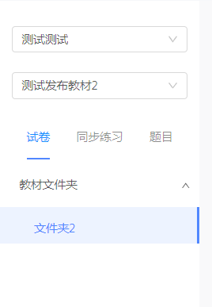

## 表单

### 表单

#### 跨组件表单验证

在子组件中，也需要写一个独立的表单。当触发父组件中的提交事件时，一并检测子组件的表单是否通过验证。

验证规则不能跨组件使用，故父子组件都需导入。


### 表单校验

#### 验证表单示例

```react
<a-form-model
  ref="form"          // 留着校验时获取组件用
  :model="form"       // ①
  :rules="rules"      // ②
>
  <a-form-model-item
    label="券名称"
    prop="couponName" // ③
  >
    <a-input v-model="form.couponName" /> // ④
  </a-form-model-item>
</a-form-model>

data() {
  form: {},
  rules: {
    couponName: [
      { required: true, message: '请输入券名称', trigger: 'blur' },
    ],
  }
},
```

:ghost: 注意③④，需要一致；②对应的变量本身没有命名要求


#### 校验表单项下的非首个元素

`Form.Item` 会对唯一子元素进行劫持，并监听 `blur` 和 `change` 事件，来达到自动校验的目的，所以请确保表单域没有其它元素包裹。如果有多个子元素，将只会监听第一个子元素的变化。

如果要监听的表单域不满足自动监听的条件，可以通过如下方式关联表单域

```react
<a-form-model-item prop="name" ref="name">
  <span>hahha</span>
  <a-input
    v-model="form.name"
    @blur="() => {$refs.name.onFieldBlur()}"      // 用于input等
    @change="() => {$refs.name.onFieldChange()}"  // 用于select等
  />
</a-form-model-item>
```


#### 清除某项验证

> 有时候需要手动清除校验

```react
<a-form-model-item
  ref="allowOrderStartTime"
  label="允许下单时间"
  prop="allowOrderStartTime"
  class="order-time"
>
  <a-time-picker
    format="HH:mm:ss"
    @change="onChangeStartTime"
    :default-value="StartTime"
    :key="form.allowOrderStartTime"
  />
</a-form-model-item>

onChangeStartTime(date, dateString) {
  this.form.allowOrderStartTime = dateString;
  console.log(this.form.allowOrderStartTime);
  this.$refs.form.clearValidate('allowOrderStartTime');  // 对应表单项的prop或数组
},
```


#### 动态添加校验规则

```react
<a-form-model-item :prop="dailyCntLimitOr">
  <a-input v-model="form.dailyCntLimit" />
</a-form-model-item>

computed: {
  dailyCntLimitOr() {
    if (this.form.isGatherGroup === true) {  // 仅当特定情况下，采用该字段的校验规则
      return 'dailyCntLimit';
    }
    return '';
  },
}
```

 :octopus:不要在一个表单项中同时设置 <span style="backGround: pink">required</span> 和 <span style="backGround: pink">prop</span>，会导致奇怪的现象。

 :octopus:这个方法有时会导致对应的输入控件输入失焦异常的现象，最稳妥还是用[下面的方法](#动态更改校验规则)。


#### 动态更改校验规则

> 情景：改变单选框的选项时，某个输入框更改为必填/非必填。

`rule.js`

```react
const rules = {
  productRuleThreshold: [
    { required: true, message: '请输入券折扣', trigger: 'blur' },
  ],
  productRuleThreshold2: [
    { required: true, message: '请输入券折扣', trigger: 'blur' },
  ],
}
    
export default rules;
```

`demo.vue`

```javascript
onChangeType({ target }) {
  console.log(target);
  if (target.value === 'SILL') {
    this.rules.productRuleThreshold = this.rules.productRuleThreshold2;
  } else {
    this.rules.productRuleThreshold = [];
    this.$refs.form.clearValidate('productRuleThreshold');
    this.$set(this.form, 'productRuleThreshold', undefined);
  }
},
```

:whale: <span style="color: #a50">clearValidate</span> UI表单组件的api，用于移除表单项的校验结果。传入待移除的表单项的 prop 属性或者 prop 组成的数组，如不传则移除整个表单的校验结果。


#### 跳转到首个校验失败的元素

> 使用场景是确定表单校验失败后。

```react
// 跳转到首个校验失败的元素
toFirstErr() {
  // 找到适用的dom范围，并在ui组件延迟添加类名后，定位到首个错误类名，解除引用
  setTimeout(() => {
    let wrapEl = this.$refs.form;            // 如果refs取到的是元素
    // let wrapEl = this.$refs.form.$el;     // 如果refs取到的是组件
    let firstErrEl = wrapEl.getElementsByClassName('has-error')[0];
    console.log(firstErrEl);
    firstErrEl.scrollIntoView(true, { behavior: 'smooth' });
    wrapEl = null;
    firstErrEl = null;
  }, 500);
},
```


### 选择器

#### 让选择器显示默认值

> 在饿了么中，绑定值为 `''` 时，即可显示默认值。
>
> 但在 ant 中，需要绑定值为 `undefined`。


#### 可选择&可输入其它内容

给标签添加 `mode="combobox"` 就可以[实现](https://blog.csdn.net/weixin_38673922/article/details/125282197)。


### 时间选择框

#### a-time-picker默认值

> 这里没有使用 v-model 绑定。

```react
<a-time-picker
  format="HH:mm:ss"
  @change="onChangeEndTime"
  :default-value="EndTime"
  :key="form.allowOrderEndTime"
/>
computed: {
  EndTime() {
    if (this.form.allowOrderEndTime) {
      return moment(this.form.allowOrderEndTime, 'HH:mm:ss');
    }
    return undefined;
  },
},
```


### 其它

#### 上传图片校验规则

```react
<a-form-model-item label="banner展示图" ref="img" prop:"img">
  <a-upload @change="changeUrl">上传</a-upload>
</a-form-model-item>

changeUrl(e) {
  this.form.url = e;
  if(this.form.url !== '') {     // 若有了上传值，手动解除校验
    this.$refs.img.clearValidate();
  }
}
```


### bug

#### 输入框值消失

> 一般出现在设置了校验的情况下：由于切换了单选框后，直接赋值所致。

```javascript
onChange() {
  this.$set(this.model, 'cycleDiscountDiscount', undefined);
  // this.model.cycleDiscountDiscount = undefined;
}
```


## 展开

### 树

#### 选择器组合树使用

当改变选择器的项时，执行相应的逻辑，改变另一个选择器或树的数据源即可。



## 表格

### 设置固定列

> 适合表格数据项过多时，需要保留重点项的情况。

1. 需要添加属性 `:scroll="{ x: 1300 }"` ，1300是自己写的宽度
2. 可以在表头配置中通过 `fixed: 'left'`或 `fixed: 'right'` 固定前后的列，固定列一般设置 `width`

3. 其他列仍旧可以设置 `width` 也可以不设置


### fixed—报错缺少key

```elm
 [Warning: Each record in table should have a unique key prop,or set rowKey to an unique primary key.]
```

在 Table 中，`dataSource` 和 `columns` 里的数据值都需要指定 `key` 值。对于 `dataSource` 默认将每列数据的 `key` 属性作为唯一的标识。

如果数据源中没有这个属性，务必使用 `rowKey` 来指定数据列的主键。

```react
/* 比如数据主键是 uid */
<a-table rowKey="uid" />;
/* eslint 要求语法 */
<a-table :row-key="uid" />;

{
  uid: 1,
  name: 'cat'
}
```


### fixed—显示表头不显示数据

想要对该列数据使用插槽，用 `dataIndex` 却能够显示对应文字，后来发现是 `scopedSolts` 配置拼错了。


### fixed—固定列列头与内容不对齐

若列头与内容不对齐或出现列重复，需指定固定列的宽度 `width`。


### 错位问题

> 该插槽对应的数据项为 null，并意图获取其属性时，会导致表格项错位。

```react
<template
  slot="rightsSendRecord"
  slot-scope="text, record"
>
  {{ text.updateTime }}
</template>

<!-- 修正后的写法 -->
<template
  slot="rightsSendRecord"
  slot-scope="text, record"
>
  {{ text?text.updateTime:'' }}
</template>
```


## 模态框

### fixed—模态框关闭自动修改显示属性

> 模态框关闭时不经事件控制自己更改显示属性。要将 `v-model` 改为 `visible`。


## 日期选择器

### fixed—日期选择器设置默认值

> 当取不到默认值时，会报错且出现一堆NaN，这种情况可以提供默认值。

```vue
<a-date-picker 
  :default-value="moment(form.allowOrderStartTime || moment(), 'YYYY-MM-DD HH:mm:ss')" 
  format="YYYY-MM-DD HH:mm:ss" 
/>
```


### 日期范围绑定值

```react
/* 可以通过v-model绑定值 */
<a-range-picker
  v-model="queryTime"
 :show-time="{ format: 'HH:mm:ss' }"      // 增加时间选择功能
  format="YYYY-MM-DD HH:mm:ss"            // 设置日期格式
  :placeholder="['开始时间', '结束时间']"
  @change="onChange"
/>
          
onChange(date, dateString) {
  console.log(date, dateString);
  const startTime = dateString[0];  // 格式同下
  const endTime = dateString[1];    // 2021-12-15 00:00:00
}
有空看看它绑定的是什么东西
```

`示例处理`

```react
import moment from 'moment';

if (this.searchForm.time && this.searchForm.time.length > 1) {
  const [start, end] = this.searchForm.time;
  queryForm.startTime = `${moment(start).format('YYYY-MM-DD')} 00:00:00`;
  queryForm.endTime = `${moment(end).format('YYYY-MM-DD')} 00:00:00`;
}
```


### 开始小于结束

```javascript
<a-date-picker v-model="fisher.startday" style="width: 42%" placeholder="开始时间" :disabled-date="(current) => getDisabledDay(current, fisher.endday)"/>
~
<a-date-picker v-model="fisher.endday" style="width: 42%" placeholder="截至时间" :disabled-date="(current) => getDisabledDay(current, fisher.startday, true)"/>


// 禁用时间
getDisabledDay (current, targetTime, reverse) {
  if (reverse && targetTime) {
    const time = targetTime.format('YYYY-MM-DD')
    const now = current.format('YYYY-MM-DD')
    return time && time > now
  }
  if (!reverse && targetTime) {
    const time = targetTime.format('YYYY-MM-DD')
    const now = current.format('YYYY-MM-DD')
    return time && time < now
  }
  return false
}
```


## 时间选择器


### 常规使用

1. 若使用 `v-model`，绑定值将为 Moment 对象格式。

2. 默认值不能为 `undefined`，否则报如下错。

   ```elm
   Avoid using non-primitive value as key, use string/number value instead.
   ```

3. 为了避免不更新的奇怪现象，需提供 `key` 值。

4. `change事件` 第一个参数为 Moment 对象格式，第二个参数为目标格式，如 `13:00:00`

5. `HH:mm:ss` 表示24小时制， `hh:mm:ss` 表示12小时制

```less
<a-time-picker
  format="HH:mm:ss"
  @change="onChangeStartTime"
  :default-value="moment(form.allowOrderStartTime || moment(), 'HH:mm:ss')"
  :key="form.allowOrderStartTime"
/>

onChangeStartTime(date, dateString) {
  this.form.allowOrderStartTime = dateString;
},
```


## 上传

### 配合接口上传excel

> 这种情况需要传递 form-data 类型参数。
>
> 有说法直接传递 FormData 对象，即默认使用请求头 `'Content-Type': 'multipart/form-data'` 。

`api.js`

```react
/* 批量导入 */
export function importExcel(data) {
  return axios({
    url: 'xxx',
    method: 'post',
    data,
  });
}
```

`middle.js`

```react
/* 可以省略的中间件(步骤) */
import { importExcel } from '@/api/member/admin';

importExcel(data) {
  return importExcel(data).then(() => {
    this.$message.success('导入成功');
  });
},
```

`demo.vue`

```react
<a-upload
  :before-upload="beforeExcelUpload"
  :file-list="noFileList"
>
  <a-button type="primary">
    上传excel导入
  </a-button>
</a-upload>

/* 本质上是拿到了文件，然后做处理调接口，没有继续ant上传组件本身的逻辑 */
async beforeExcelUpload(file) {
  const that = this;
  const suffix = file.name.substr(file.name.lastIndexOf('.'));
  if (suffix === '.xls' || suffix === '.xlsx') {
    const form = new FormData(); // FormData 对象
    form.append('file', file);
    await this.importExcel(form);
    this.$confirm({
      title: '提示',
      content:
            '文件上传成功，系统正在执行导入操作，请耐心等待，如数据较多请1分钟后再刷新页面。',
      onOk() {
        that.page();                // 重新请求列表数据
      },
    });
  } else {
    this.$message.error('请上传 .xls .xlsx 格式的文件');
  }
  return false;                    // 不执行组件本身的上传
},
```

`版本2`

> 按上面的方法，会导致每次在正常请求后多一个奇怪的请求。

```javascript
handleUpload(file) {
  const that = this;
  const suffix = file.name.substr(file.name.lastIndexOf('.'));
  if (suffix === '.xls' || suffix === '.xlsx') {
    const form = new FormData(); // FormData 对象
    form.append('file', file);
    this.importExcel(form).then((r) => {
      console.log(r);
    });
  } else {
    this.$message.error('请上传 .xls .xlsx 格式的文件');
  }
},
beforeExcelUpload(file) {
  this.handleUpload(file);
  return false;
},
```

