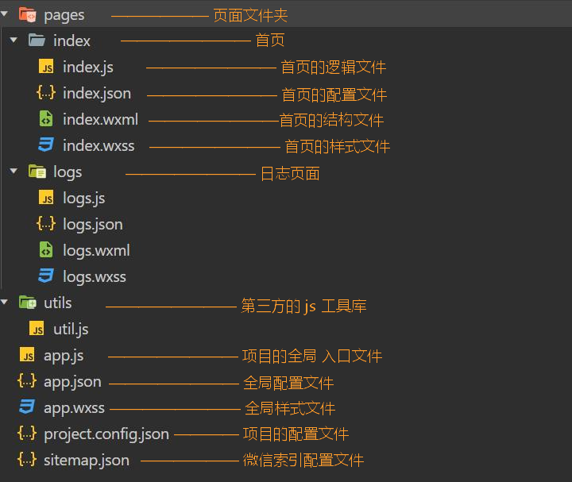

## 起步

1. 申请[账号](https://developers.weixin.qq.com/miniprogram/dev/framework/quickstart/getstart.html#申请帐号) ，需要提供邮箱、管理员用微信扫码。  

2. 在[小程序后台](https://mp.weixin.qq.com/)，（开发管理-开发设置）可以获取 AppID，其相当于小程序的身份证，调用某些接口需要用到它。  

3. 安装[开发工具](https://developers.weixin.qq.com/miniprogram/dev/devtools/download.html)，用于预览效果。编写代码可以用 VS Code。  

4. 对于测试功能，打开开发工具后，创建小程序，**选择一个空目录**，使用测试号，即可实现第一个小程序。 

5. 后期可以打开项目后，在 `详情` 修改 AppId。  

## 目录结构

小程序文件结构  
> 只几个文件只要相应的名字相同，就会自动产生追踪关系，不需导入。  

类型 | 传统web | 微信小程序
:-: | :-: | :-: 
结构 | HTML | WXML 
样式 | CSS | WXSS
逻辑 | Javascript | Javascript
配置 | 无 | JSON



文件 | 说明
:-: | :-: 
project.config.json | 也可以在 `详情` 的 UI 界面进行设置 
sitemap.json | 用于配置小程序及其页面是否允许被微信索引  


### 全局配置

#### app.json  

> 用来对微信小程序进行全局配置，决定页面文件的路径、窗口表现、设置网络超时时间、设置多 tab 等。  
>
> 小程序页面也可以使用同名 `.json` 文件（仅能）对窗口表现进行配置，会覆盖全局的 `window` 中相同的配置项。
>
> 使用开发者工具进行配置时，会有相应字段的提示和补全功能。  

#### pages字段    
> 决定页面文件的路径。  

1. 每个数组元素都对应着一个页面的路径，最后项不需要后缀名。  

2. 使用开发工具，在该选项下新增元素并保存，会自动生成对应的页面文件。  

3. 首个数组元素对应的路径将展示为首页。  

#### window字段  
> 定义小程序所有页面的顶部背景颜色，文字颜色等。  

常用属性 | 说明 | 默认值 | 可选值
:- | :- | :- | :-
navigationBarBackgroundColor | 导航栏背景颜色 | "#fff" | *HexColor*
navigationBarTitleText | 导航栏标题 | "Weixin" | *str*
navigationBarTextStyle | 导航栏标题颜色 | "black" | "white"
backgroundTextStyle | 下拉加载，指示器颜色 | "dark" | "light"
enablePullDownRefresh | 开启当前页面下拉刷新 | false | true
backgroundColor | 下拉加载部分窗口颜色 | "#ffffff" | *HexColor*

#### tabBar字段  
> 指定 tab 栏的表现，以及 tab 切换时显示的对应页面。  
> 
> 将 icon 文件夹建在与全局配置同级处。  

常用属性 | 说明 | 默认值 | 可选值
:- | :- | :- | :-
list | 标签列表，需 2-5 个 | / | *arr*
color | 未激活文字颜色 | / | *HexColor*
selectedColor | 激活文字颜色 | / | *HexColor*
backgroundColor | 标签栏背景色 | / | *HexColor*
position | 标签栏位置 | "bottom" | "top" （此时不显示 icon）

list属性 | 说明 | 默认值 | 可选值
:- | :- | :- | :-
pagePath | 页面路径，必须在 pages 中先定义 | / | *str*
text | tab 上按钮文字 | / | *str*
iconPath | 图片路径。icon 大小限制为 40kb， | / | *str*
selectedIconPath | 激活图片路径。建议尺寸为 81px * 81px | / | *str*


### 页面配置  

> 仅对页面的窗口表现进行配置，不需要添加字段。  


## 开发技巧  

1. 可以在 VSCode，安装插件 `小程序开发助手`，具备配置字段提示、标签提示等功能。  

2. 在逻辑文件（js）中，输入 `page`，选择提示的第二项可以补全架构。  

3. 快速选择多行中间部分（如对象的所有键）：①选中首行选区 ②`Alt` /+ `Shift` + 选中尾行选区尾部

4. 快速多行输入相同内容： ①选择首行输入位 ②`Alt` /+ `Shift` + 选中尾行输入位 ③输入内容

快捷键 | 作用
`Alt` \+ `↑` | 选中行代码上移

小程序 | Vue | 说明  
:-: | :-: | :-
<text\> | <span\> | 行内元素，不换行
<view\> | <div\> | 块级元素，换行
<block\> | <template\> | 不参与渲染，可充当循环结构的容器或条件渲染种包含多元素的**容器**等

### 模版语法  
> 可以往花括号里添加变量、表达式。  

性质 | 小程序 | Vue 
:-: | :-: | :-
文本节点 | {{}} | {{}}
属性值 | {{}} | 使用 v-bind
条件渲染 | {{}} | 绑定变量

### 列表渲染  
> 不用于 Vue，除了数组以外，也可以遍历对象。  
> 
> 可以自定义在循环内部的项的变量名，方便实现嵌套循环。  

```
wx:for="{{arr | obj}}"
```

其它属性 | 遍历数组 | 遍历对象 | 默认值
:- | :- | :- | :-
wx:for-item | 项 | 值 | "item"
wx:for-index | 索引 | 键 | "index"
wx:key | 需唯一 | / | "\*this"

wx:key
> 如果明确知道该列表是静态，或者不必关注其顺序，可以不提供该值，忽略警告。  
> 
> 值以两种形式提供:
> 
> 1. 字符串，代表遍历项的**某个属性**，其值需唯一且不能动态改变。
> 
> 2. `*this`，代表项本身，需要项是唯一的字符串或者数字。
> 
> 3. **对象不能作键**，会被解析为字符串。找不到适用属性时可以用相应的 `index`。

```
// mine.wxml
// 此时 view 标签也进行了多次循环
<view wx:for="{{list}}" wx:for-item="item" wx:for-index="index" wx:key="name">
  {{item.name}} - {{item.age}}
</view>

// mine.js
data: {
  list: [
    { name: 'aaa', age: 12 },
    { name: 'bbb', age: 15 }, 
    { name: 'ccc', age: 16 }
  ]
},
```

### 条件渲染  
> `wx:if` 是惰性的，切换条件时进行**局部渲染**或销毁。  

小程序 | Vue | 说明  
:-: | :-: | :-
wx:if | v-if | 动态绑定
wx:elif | v-else-if | 动态绑定
wx:else | v-else | 不需绑定
hidden | v-show | 动态绑定

### 认识事件  
> 尝试通过表单输入值，改变输出值，另外提供两个按钮，也可以改变该输出值。  

1. 对于单标签，不添加结束的 `/` 会报错。  
2. `data` 选项是对象形式而非函数。  
3. 对于绑定的事件，与 `data` 同级，而不需要加到 `methods` 中。  
4. 要对 `data` 内的数据赋值时，不能直接赋值，要使用 `this.setData`。
5. 获取时，需要通过 `this.data`。    
6. 在小程序中，模版中绑定的事件处理程序不能添加括号，更无法直接传参。  
7. 需要借助自定义属性来传参。  

```
<button bind:tap="handleTap" data-operation="{{1}}">+</button>
<button bind:tap="handleTap" data-operation="{{-1}}">-</button>
<input type="text" bind:input="handleInput" />
<view>{{num}}</view>

data: {
  num: 0
},
handleInput(e) {
  this.setData({
    num: e.detail.value
  })
},
handleTap(e) {
  const operation = e.currentTarget.dataset.operation;
  this.setData({
    num: +this.data.num + operation
  })
}
```

#### 事件类型  

事件分类 | 说明  
:- | :-
冒泡事件 | 组件上的事件被触发后，会向父节点传递
非冒泡事件 | 组件上的事件被触发后，不会向父节点传递

普通事件绑定  
> 在后续版本中，支持在 bind 后添加 `:`。  

形式 | 说明  
:- | :-  
bindtap="handleTap" | 事件名后不能跟括号
bindtap="{{ handlerName }}" | `this.data.handlerName` 必须是一个字符串，指定事件处理函数名

绑定方式 | 说明  
:- | :- 
bind | 会继续冒泡
capture-bind | 会继续捕获
catch | 阻止冒泡
capture-catch | 中断捕获阶段和取消冒泡阶段
mut-bind | 只有一个节点的这种绑定事件会触发，不影响 `bind` 和 `catch`

### WXSS  

#### 尺寸单位
> rpx 可以根据屏幕宽度进行自适应，且规定屏幕宽为固定的 750rpx。
> 
> 如屏幕宽度为375px，则1rpx = 0.5px。
> 
> 如屏幕宽度为750px，则1rpx = 1px。  

栗子
> 如设计稿规定屏幕宽度为 xpx，现在需要去适配宽度为 100px。
>
> 使用 `calc`，需要注意数值与单位不留空格。  

步骤 | 说明 
:-: | :-: 
① | xpx = 750rpx
② | 1px = 750rpx / x
③ | 100px = 750rpx / x * 100
④ | width: calc(750rpx * 100 / x)

#### 导入  
> 使用 `@import` 语句可以导入外联样式表，只支持相对路径，需要用 `;` 表示语句结束。   

```
// xx.wxss
@import "../../styles/common.wsxx";
```

#### 支持的选择器  
> 其中，自定义组件不能使用 `id选择器`、`属性选择器` 和 `标签名选择器`，需改用 `class选择器`。  

选择器 | 样例 | 样例描述
:- | :- | :-
\* | / | 不支持
.class | .intro | 选择所有拥有 class="intro" 的组件
#id | #firstname | 选择拥有 id="firstname" 的组件
element | view | 选择所有 view 组件
element, element | view, checkbox | 选择所有文档的 view 组件和所有的 checkbox 组件
::after | view::after | 在 view 组件后边插入内容
::before | view::before | 在 view 组件前边插入内容

#### 使用less

1. 使用 VSCode。  
2. 安装插件 `easy less`
3. 打开设置图标 —— 设置 —— 右上角的 `json` 图标  
4. 将下面代码粘贴到对象内部的最后。  
5. 此时新建 `less` 并保存后，会自动生成对应的 `wxss`。   

```
"less.compile": {
  "outExt": ".wxss"
}
```


## 常用组件   

组件 | 说明 
:- | :-  
<view\> | 代替原来的 <div\>
<text\> | 代替原来的 <span\>
<image/\> | 默认宽度320px、高度240px，可在样式设置宽高。默认模式与 Web 不同  
<swiper\> | 轮播图容器，其中只可放置 `swiper-item` 组件。默认宽度100vw、高度150px  
<swiper-item\> | 轮播图项，内部嵌套 `<image>`
<navigator\> | 导航标签。块级元素    
<rich-text\> | 富文本标签
<button\> | 按钮
<icon\> | 图标  
<radio\> | 单选框，需搭配 `<radio-group>` 实现触发事件  
<radio-group\> | 项变更时，对应事件中可获得**字符串**
<checkbox\> | 复选框，需搭配 `<checkbox-group>` 实现触发事件  
<checkbox-group\> | 项变更时，对应事件可获得**字符串数组** 
<slot\> | 插槽，当父组件的该组件标签内有子标签时，会将其替代
<input/\> | 原生输入框，双向绑定需[自己实现](https://github.com/SpringLoach/origin-2021/blob/happy-day/weixin/工作流.md#文档知识)
[<scroll-view\>](https://developers.weixin.qq.com/miniprogram/dev/component/scroll-view.html) | 可滚动视图区域，竖向滚动时，需要一个固定高度并具备充足内容  
<[open-data](#open_data)\> | 可以显示用户昵称、头像、城市等
<picker\> | 从底部弹起的滚动选择器，支持单列、多列选择、时间、省市 
<picker-view\> | 嵌入页面的滚动选择器
<slider/\> | 滑块
<switch/\> | 开关选择器 
`<textarea/>` | 多行输入框


#### text 
> 文本标签，为行内元素，只能嵌套 `text`。  

属性 | 说明 | 默认值 | 必填 | 类型
:- | :- | :- | :- | :-
user-select | 文本是否可选，该属性会使文本节点显示为 `inline-block` | false | 否 | *boo*
decode | 是否解码 | false | 否 | *boo*

#### image  
> 支持 JPG、PNG、SVG、WEBP、GIF 等格式，2.3.0 起支持云文件ID。  

```
<image src="{{item.good_src}}" mode="widthFix" />
```

属性 | 说明 | 默认值 | 必填 | 类型
:- | :- | :- | :- | :-
src | 图片资源地址 | / | 否 | *str*
mode | 图片裁剪、缩放的模式 | "scaleToFill" | 否 | *str*
lazy-load | 懒加载，在即将进入上下三屏时才开始加载 | false | 否 | *boo*
binderror | 错误发生时触发 | / | 否 | *cb*
bindload | 载入完毕时触发 | / | 否 | *cb*

模式 | mode值 | 说明 
:- | :- | :- 
缩放 | scaleToFill | 使图片的宽高等于设置的宽高	
缩放 | aspectFit | 保持纵横比缩放图片，使图片的长边完全显示。可以完整显示图片，可能有多余部分。轮播图常用	
缩放 | aspectFill | 保持纵横比缩放图片，只保证图片的短边能完全显示出来。通常另一个方向将会发生截取。	
缩放 | widthFix | 宽度不变，高度自动变化，保持原图宽高比不变。即设置的高无效。**轮播图和很多情况常用**	
缩放 | heightFix | 高度不变，宽度自动变化，保持原图宽高比不变	
裁剪 | top | 不缩放图片，只显示图片的顶部区域	
裁剪 | bottom | 不缩放图片，只显示图片的底部区域	
裁剪 | center | 不缩放图片，只显示图片的中间区域	
裁剪 | left | 不缩放图片，只显示图片的左边区域	
裁剪 | right | 不缩放图片，只显示图片的右边区域	
裁剪 | top left | 不缩放图片，只显示图片的左上边区域	
裁剪 | top right | 不缩放图片，只显示图片的右上边区域	
裁剪 | bottom left | 不缩放图片，只显示图片的左下边区域	
裁剪 | bottom right | 不缩放图片，只显示图片的右下边区域	

#### swiper  
> 使用轮播图时，通常需要重新计算并设置容器 `swiper` 的高度。  
> 
> 可以将 `swiper` 的高度调小，这样指示器会处在图片下方。  

```
<swiper autoplay indicator-dots circular>
  <swiper-item wx:for="{{}}" wx:key="">
    <navigator>
      <image mode="widthFix" src="{{}}" />
    </navigator>
  </swiper-item>
</swiper>

image {
  width: 100%;
}
```

计算容器高度

顺序 | 说明
:- | :- 
① | swiper高 / swiper宽 = 原图高 / 原图宽  
② | swiper高 = swiper宽 * 原图高 / 原图宽  
③ | height: calc(100vw * 图高 / 图宽)  
④ | 如 height: calc(100vw * 352 / 1125)  

属性 | 说明 | 默认值 | 必填 | 类型
:- | :- | :- | :- | :-
autoplay | 自动切换 | false | 否 | *boo*
interval | 自动切换时间间隔 | 5000 | 否 | *num*
circular | 采用衔接滑动 | false | 否 | *boo*
indicator-dots | 显示面板指示点 | false | 否 | *boo*	
indicator-color | 指示点颜色 | rgba(0, 0, 0, .3) | 否 | *color*
indicator-active-color | 当前选中的指示点颜色 | #000000 | 否 | *color*

#### navigator  
> 跳转到标签页时，需要额外设置属性。  

```
<navigator url="/page/index/index"> 回到首页 </navigator>
```

属性 | 说明 | 默认值 | 必填 | 类型
:- | :- | :- | :- | :-
url | 当前小程序内的跳转链接。绝对、相对路径均可 | / | 否 | *str*
target | 跳到自己/其它的小程序 | "self" | 否 | "miniProgram"
open-type | 跳转方式 | navigate | 否 | *str*

open-type
> 这里的 tabBar 页面指全局配置中tabBar字段上存在的路径。  

值 | 说明 
:- | :- 
navigate | 保留当前页面，跳转到应用内的某个页面。但是不能跳到 tabBar 页面。
redirect | 关闭当前页面，跳转到应用内的某个页面。但是不能跳到 tabBar 页面。
switchTab | 跳转到 tabBar 页面，并关闭其他所有非 tabBar 页面
reLaunch | 关闭所有页面，打开到应用内的某个页面
navigateBack | 关闭当前页面，返回上一页面或多级页面。
exit | 退出小程序，target="miniProgram"时生效

#### rich-text  

属性 | 说明 | 默认值 | 必填 | 类型
:- | :- | :- | :- | :-
nodes | 节点列表/标签字符串 | [] | 否 | *arr/str*	
space | 显示连续空格 | / | 否 | *str*	

nodes  
> 并非所有节点和属性都受[信任](https://developers.weixin.qq.com/miniprogram/dev/component/rich-text.html)。  
> 
> 类型为节点列表时，支持标签的嵌套。  

```
// 标签字符串  
<rich-text nodes="<div style='color: red'>"></rich-text>  
  
// 节点列表
<rich-text nodes="{{nodes}}"></rich-text>   
  
nodes: [{
  // 标签名
  name: 'div',
  // 属性
  attrs: {
    class: 'div_class',
    style: 'line-height: 60px; color: red;'
  },
  // 子节点列表
  children: [{
    // 文本节点
    type: 'text',
    // 文本
    text: 'You never know what you're gonna get.'
  }]
}]
```

#### button  

属性 | 说明 | 默认值 | 必填 | 类型
:- | :- | :- | :- | :-
size | 按钮的大小 | "default" | 否 | "mini"
type | 按钮的颜色 | "default" | 否 | "primary"、"warn"
plain | 按钮镂空，背景色透明 | false | 否 | *boo*	
disabled | 是否禁用 | false | 否 | *boo*	
loading | 名称前是否带 loading 图标 | false | 否 | *boo*	
form-type	| 点击触发 form 组件的 submit/reset 事件	| / | 否 | "submit"、"reset"	
open-type	| 微信开放能力 | / | 否 | *str*

open-type  

值 | 说明 | 备注
:- | :- | :- 
contact | 打开客服会话。如果用户在会话中点击消息卡片后返回小程序，可以从 bindcontact 回调中获得具体信息 | 小程序插件中不能使用
share | 转发当前小程序，发送到微信好友 | 不能分享到朋友圈
getPhoneNumber | 获取用户手机号 | 需企业小程序账号的权限。从 `bindgetphonenumber` 回调获取信息，会加密
getUserInfo | 获取用户信息 | 小程序插件中不能使用。从 `bindgetuserinfo` 回调获取信息
launchApp | 在小程序中打开APP | 需要先从APP中跳转到小程序
openSetting | 打开内置的授权页面 | 需要先获取权限，如 `getUserInfo`
feedback | 打开意见反馈页面 | /

打开客服会话  

1. 将 `appid` 由测试号改为自己的 `appid`。  
2. 登录[微信小程序后台](https://mp.weixin.qq.com/)，功能- 客服 - 根据微信号添加客服。  
3. 此时用户点击 `contact`，可打开客服会话并进行对话。  

#### icon 
> 有多个类型可选，可配置大小和颜色。  

```
<icon type="info" size="24" color="skyblue"></icon>
```

属性 | 说明 | 默认值 | 必填 | 类型
:- | :- | :- | :- | :-
type | 类型 | / | √ | success, success_no_circle, info, warn, waiting, cancel, download, search, clear
size | 大小 | 23 | | *num/str*
color | 颜色 | / | | *str*

#### radio  
> 单选框。当某个单选框被选中时，`<radio-group>` 的 change 事件会携带该单选框的 `value`。  

```
<radio-group bind:change="handleChange">
  <radio value="male">男</radio>
  <radio value="female">女</radio>
</radio-group>
<view>选中的性别对应值为：{{info}}</view>
  
data: {
  info: ''
},
handleChange(e) {
  let info = e.detail.value;
  this.setData({
    info
  })
}
```

属性 | 说明 | 默认值 | 必填 | 类型
:- | :- | :- | :- | :-
value | 选中时传给容器组件事件的值 | / |  | *str*
color | 选中状态的颜色 | #09BB07 | | *str*
checked | 是否选中 | false | | *boo*
disabled | 是否禁用 | false | | *boo*

#### radio-group  

属性 | 说明 | 默认值 | 必填 | 类型
:- | :- | :- | :- | :-
bindchange | 容器内选中项发生改变时触发 | / |  | cb

#### checkbox  
> 可配置属性与单选框完全一致。区别在于值变更时，容器获得的数据类型不一样。    

#### open_data  
> 需要更改头像样式时，得添加容器包裹标签，在容器上进行配置。  
> 
> 如果需要直接获取这些信息另外渲染，调用接口 `wx.getUserProfile`。  
> 
> 考虑到版本兼容性，参考[兼容代码](https://github.com/SpringLoach/origin-2021/blob/happy-day/weixin/section2.md#项目发布)。  

```
// 显示用户头像
<open-data type="userAvatarUrl"></open-data>
// 显示用户昵称
<open-data type="userNickName"></open-data>
```

### 自定义组件  
> 自定义组件与页面类似，都是由4个文件组成。       
>  
> 自定义组件的标签名也只能是小写字母、中划线和下划线的组合。不能以"wx-"为前缀。

#### 自定义组件_新建使用  

1. 新增组件  
> 在 `Tabs` 处右键 - 新增Component - Tabs - `回车`    

- components  
  + Tabs 
- app.json  
- ...
  
2. 声明组件  
> 支持在 `app.json` 中声明 usingComponents 字段，视为全局自定义组件，在小程序内的页面或自定义组件中可以直接使用而无需再声明。

```
// 在需要使用该自定义组件的页面的 `json` 中声明
{  
  "usingComponents": {
    "Tabs": "../../components/Tabs/Tabs"
  }
}  
```

3. 使用组件  

```
// 使用该自定义组件的页面的 wxml  
<Tabs></Tabs>  
```

#### 自定义组件_json文件

```
{
  // 表示自身为组件   
  "component": true,
  // 表示引用其它的组件  
  "usingComponents": {}
}  
```

#### 自定义组件_js文件  

```
// 区别于页面的 Page
Component({
  // 用于接收父向子传递的数据
  properties: {},
  //组件的初始数据
  data: {},
  // 组件的方法列表
  methods: {}
}) 
```

----

### 简单实现标签页组件  

关键点 | 说明
:-: | :-  
① | 注意循环项要用括号包围  
② | 每个循环项可以提供 `id` 属性作为身份辨识  
③ | **动态添加类**，要用括号包围、三元表达式、引用项属性  
④ | 不同于 Vue，小程序的 data 为对象结构
⑤ | CSS长度单位尽量使用 `rpx`  
⑥ | `currentColor` 表示与当前元素的 color 值一致

```
/* Tabs.wxml */
<view class="title">
  <view 
    wx:for="{{tabs}}" 
    wx:key="id" 
    data-index="{{index}}" 
    class="title_items {{item.isActive?'active':''}}"
  >
  {{item.name}}
  </view>
</view>
<view class="content">首页内容</view>
  
/* Tabs.js */
data: {
  tabs: [
    {
      name: "首页", 
      id: 0, 
      isActive: true
    },
    {
      name: "原创", 
      id: 1, 
      isActive: false
    },
    {
      name: "分类", 
      id: 2, 
      isActive: false
    },
    {
      name: "关于", 
      id: 3, 
      isActive: false
    }
  ]
}
  
/* Tabs.wxss */
.title {
  display: flex;
  padding: 10rpx;
}
.title_items {
  flex: 1;
  display: flex;
  justify-content: center;
  align-items: center;
}
.active {
  color: skyblue;
  border-bottom: 5rpx solid currentColor;
}
```

#### 标题点击激活  

关键点 | 文档 | 说明
:-: | :- | :- 
① | wxml | 为了能够从事件回调的事参中获取点击项信息，**需要属性传递** `data-index="{{index}}"`
② | js | 不同于页面，自定义组件的方法需放在 `methods` 选项中  
③ | js | 小程序不推荐直接改变 data 中的数据，先拷贝  
④ | js | 遍历数组，通过排他思想赋值
④ | js | 重新赋值
⑤ | js | 重新赋值

```
<view wx:for="{{tabs}}" data-index="{{index}}" bind:tap="handleItemTap">
  {{item.name}}
</view>  
  
methods: {
  handleItemTap(e) {
    let {index} = e.currentTarget.dataset;
    let tabs = JSON.parse(JSON.stringify(this.data.tabs));
    tabs.forEach((item, i) => {index === i?item.isActive=true:item.isActive=false})
    this.setData({
      tabs
    })
  }
}
```

#### 父传子  
> 与 Vue 类似，只是不需要 `:`，以及默认值表示不同。  

```
/* 父的wxml */
<Tabs tabs="{{tabs}}"></Tabs>  
  
/* 子的js */
properties: {
  tabs: {
    type: Array,
    // 默认值  
    value: []
  }  
} 
```

#### 子传父  

关键点 | 文档 | 说明
:-: | :- | :- 
① | 子(js) | 通过 `this.data` 找不到的数据，会在 `properties` 找该变量
② | 子(js) | 由于数据是父提供，[先前的方法](#标题点击激活)改变不了父数据
③ | 子(js) | 此时的 `setData` 会将变量拷贝到 `data` 中  
③ | 子(js) | 所以子**只需要**发送自定义事件，并传递索引即可  
④ | 父(wxml) | 接收事件，执行回调
⑤ | 父(js) | 处理逻辑与先前的方法一致。获取传参的属性改变  

```
/* 子的js */
handleItemTap(e) {
  let {index} = e.currentTarget.dataset;
  this.triggerEvent("itemChange", {index})
}
  
/* 父的wxml */
<Tabs bind:itemChange="handleItemChange"></Tabs>
  
/* 父的js */
handleItemChange(e) {
  console.log(e.detail.index);
}
```

#### 插槽  
> 注意这一步前，需要将 `tabs` 该数据转移到父组件的 `data` 中。    

```
/* 父的wxml */
<slot></slot>  
  
/* 父的wxml */
<Tabs bind:itemChange="handleItemChange">
  <block wx:if="{{tabs[0].isActive}}">首页内容</block>
  <block wx:elif="{{tabs[1].isActive}}">原创内容</block>
  <block wx:elif="{{tabs[2].isActive}}">分类内容</block>
  <block wx:else>关于内容</block>
</Tabs>
```


### 基础2

#### 组件常用配置  

> 后面的一部分为组件声明周期函数。  

配置项 | 类型 | 描述	
:- | :- | :-
properties | obj | 相当于自定义属性
data | obj | 组件的内部数据
observers | obj | 可监听 `properties` 和 `data` 的变化。页面无
methods | obj | 组件的方法。页面无
created | func | 在组件实例刚刚被创建时执行，此时不能调用 `setData`	
attached | func | 在组件实例进入页面节点树时执行	
ready | func | 在组件在视图层布局完成后执行	
moved | func | 在组件实例被移动到节点树另一个位置时执行	
detached | func | 在组件实例被从页面节点树移除时执行	
error | func | 每当组件方法抛出错误时执行	

#### 应用生命周期  
> 不同于 Page 和 Component，根部有自己独特的生命周期，可在 `app.js` 中添加回调。  

生命周期 | 触发时机	| 可添加处理
:- | :- | :-
onLaunch | 应用第一次启动时触发 | 可获取用户的信息，供页面渲染  
onShow | 从后台切换到小程序 | 对应用的数据或页面效果进行重置 
onHide | 从小程序切换到后台 | 暂停或清除定时器
onError | 应用报错时触发 | 可将错误信息异步发送给后台
onPageNotFound | 应用首次启动，且找不到入口页面时触发 | 通过 `wx.navigateTo` 跳转到其它页面  

#### 页面生命周期  

生命周期 | 触发时机	| 可添加处理
:- | :- | :-
onLoad | 监听页面加载 | 发送异步请求数据，用于初始化页面  
onShow | 监听页面显示 | /
onReady | 页面渲染完毕 | /
onHide | 监听页面隐藏，切页面/后台时触发 | /
onUnload | 页面卸载（关闭）时触发 | 通过 `wx.navigateTo` 跳转到其它页面  
onPullDownRefresh | 监听用户下拉 | 刷新页面
onReachBottom | 监听上拉触底 | 加载下一页数据
onShareAppMessage | 用户点击右上角转发 | /
onPageScroll | 监听页面滚动 | /
onResize | 窗口调整，即横/竖屏切换时触发 | /
onTabItemTap | 当前是 tab 页时，点击自身的 tab 时触发 | /

----

## 优购商城项目

### 前期准备

目录名 | 作用  
:-: | :-:  
接口文档 | [跳转](www.showdoc.com.cn/128719739414963)  

步骤 | 文件 | 说明  
:-: | :-: | :-
① | app.json | 将日志路径移除  
② | log文件夹 | 删除  
③ | app.wxss | 清空  
④ | app.js | 清空，输入 `wx-app`，回车，删除全局数据 `globalData`。    
⑤ | index.wxml | 清空  
⑥ | index.wxss | 清空 
⑦ | index.js | 清空，输入 `wx-page`，回车。  
⑧ | index.json | 添加 `"navigationBarTitleText": "优购商城"`，即页面标题  
⑨ | app.json | 添加需要的页面路径，如 `"pages/order/index"`

#### 搭建目录结构  

目录名 | 作用  
:-: | :-:  
styles | 存放公共样式  
components | 存放组件  
lib | 第三方库
utils | 自己的帮助库
request | 接口帮助库  
icons | 图标库  

#### 搭建项目的页面  

页面名称 | 名词  
:-: | :-:  
首页 | index 
分类页面 | category 
商品列表页面 | goods_list 
商品详情页面 | goods_detial 
购物车页面 | cart 
收藏页面 | collect 
订单页面 | order 
搜索页面 | search 
个人中心页面 | user 
意见反馈页面 | feedback 
登录页面 | login 
授权页面 | auth 
结算页面 | pay 

#### 引入阿里图标   

步骤 | 说明  
:-: | :-:  
① | 在[官网](https://www.iconfont.cn/)通过单词或拼音搜索 
② | 将喜欢的图标添加入库 
③ | 点击右上角的购物车图标，将图标添加到项目
④ | 在项目中，选择 `Font class`，查看在线链接
⑤ | 打开链接，将代码复制到 `styles` 文件夹的 `iconfont.wxss` 中 
⑥ | 在 `app.wxss` 添加 `@import "./styles.iconfont.wxss";`
⑦ | 使用时，在标签中添加对应**两个**类名

#### 搭建项目的标签栏  

步骤 | 其它 | 说明  
:-: | :-: | :-:   
① | | 在[官网](https://www.iconfont.cn/)下载适合的图标
② | | 格式为PNG，小程序不支持SVG 
③ | | 图标包括激活和未激活两种
④ | | 在 `app.json` 中，通过 `"tabBar"` 配置  
⑤ | 参考 | "color": "#999",
⑤ | 参考 | "selectedColor": "#ff2d4a",
⑤ | 参考 | "backgroundColor": "#fafafa"

#### 初始化样式  

```
/**app.wxss**/

/* 有需要时，再添加标签名 */
page, view, text, swiper, swiper-item, image, navigator {
  padding: 0;
  margin: 0;
  box-sizing: border-box;
}

/* 全局变量或配置 */
page {
  /* 主题颜色 */
  --themeColor: #eb4450;
  /* 定义统一字体大小， 假设设计稿大小是 375px
  希望字体为 14px，即等于28rpx */
  font-size: 28rpx;
}  

image {
  width: 100%;
}
```

----

### 首页  

#### 首页搜索框  
> 由于多个页面都用到了该组件，选择将它实现为自定义组件。   

步骤 | 说明  
:-: | :-:  
① | 本质就是块元素包围的一个[链接](#navigator)  
② | [新建组件](#新建自定义组件) `SearchInput` 
③ | 可以给组件的根元素添加类名，方便使用选择器   
④ | 使用 less 前，先安装[插件](#使用less) 

#### 获取轮播图数据&[网络请求](https://developers.weixin.qq.com/miniprogram/dev/api/network/request/wx.request.html)  

步骤 | 其它 | 说明 
:-: | :-: | :-  
① |  | 在 VSCode 输入 `wx-request`，有补全功能
② |  | 在微信开发工具勾选不校验合法域名 
③ | 后期 | 后期上项目线时，需域名合法：①https ②将域名添加到后台白名单 
③ | 后期 | 具体位置为开发管理 - 开发设置 - 服务器域名
③ | 后期 | 手机模拟不请求，尝试从最近入口打开、清缓存
④ | 帮助 | 在微信开发工具的 `AppData` 可查看变量值
⑤ | | 使用该请求数据[构建轮播图](#swiper)  

配置项 | 说明 | 默认值 | 类型	
:- | :- | :- | :- 
url | 接口地址 | / | *str* 
data | 请求的参数 | / | *str/obj/ArrayBuffer* 
header | 请求头 | / | *obj*
method | HTTP请求方法 | GET | *str*
dataType | 期望返回的数据格式 | json | *str*
responseType | 响应的数据类型 | text | *str*
success | 成功回调 | / | *cb*
fail | 失败回调 | / | *cb*
complete | 调用后回调，一定执行 | / | *cb*

```
data: {
  swiperList: []  
},
onLoad: function(options) {
  var reqTask = wx.request({
    url: 'https://api-hmugo-web.itheima.net/api/public/v1/home/swiperdata',
    success: (result) => {
      this.setData({
        swiperList: result.data.message
      })
    }
  })
}
```

#### 封装请求   

关键点 | 说明 
:-: | :-  
① | 返回期约，以避免回调地狱  
② | 将请求路径拆分出 `baseURL`  
③ | 由于配置项为键值对，可以解构对象参数获得  

- request  
  + request.js  
  + index.js  
  + ...   

```
/* request.js */
export const request = (resurl, obj) => {
  const baseURL = 'https://api-hmugo-web.itheima.net/api/public';
  return new Promise((res, rej) => {
    var reqTask = wx.request({
      url: baseURL + resurl,
      ...obj,
      success: (result) => {
        res(result)
      },
      fail: (err) => {
        rej(err);
      }
    });     
  })
}

/* index.js */
import {request} from "./request.js"

export const getSwiperList = () => {
  return request('/v1/home/swiperdata')
}

/* index.js */
import {getSwiperList} from "../../request/index.js"  

onLoad: function (options) {
  this.getSwiperList();
},
getSwiperList() {
  getSwiperList().then(result => {
    this.setData({
      swiperList: result.data.message
    })
  })
}
```

#### 分类导航  

关键点 | 说明 
:-: | :-  
① | 使用 `flex` 布局和循环时，留意谁为容器标签
② | 用链接包围图片标签  
③ | 图片标签地址，即属性引用变量时，括号语法
④ | 图片默认为原图宽高，如果不设置 `mode` 宽高不会等比例缩放    

```
<view class="index-cate">
  <navigator wx:for="{{cateList}}" wx:key="name">
    <image mode="widthFix" src="{{item.image_src}}" />
  </navigator>
</view>

.index-cate {
  display: flex;
  navigator {
    flex: 1;
    padding: 20rpx;
    image {
      width: 100%;
    }
  }
}
```

#### 楼层  

关键点 | 说明 
:-: | :-  
① | 由于存在嵌套循环，需要自命名项和索引
② | 通过浮动实现布局效果 
③ | 明显每项均占容器1/3宽度，设置项宽为33%，图片继承
④ | 小项的高度为大项的一半：`386/232=h/33.33vw` 
⑤ | 大项的高适应于宽，小项以设置值为准  
⑥ | 选中最后几个子元素，不能反序 `:nth-last-child(-n+4)`
⑦ | 通过内边距或边框营造距离  
⑧ | 由于想添加组的左右边距，需要对小项高进行微调    

```
<view class="index_floor"> 
  <view class="floor_group" 
  wx:for="{{floorList}}" 
  wx:key="index1"
  wx:for-item="item1"
  wx:for-index="index1"
  >
    <!-- 标题 -->
    <view class="floor_title">
      <image mode="widthFix" src="{{item1.floor_title.image_src}}" />
    </view>
    <!-- 内容 -->
    <view class="floor_list">
      <navigator 
      wx:for="{{item1.product_list}}"
      wx:key="name"
      wx:for-item="item2"
      wx:for-index="index2"
      >
        <image mode="{{index2===0?'widthFix':'scaleToFill'}}" src="{{item2.image_src}}" />
      </navigator> 
    </view>
  </view>
</view>

.index_floor {
  .floor_group {
    padding: 0 10rpx;
    .floor_title {
      margin: 10rpx 0;
      image {
        width: 100%;
      }
    }
    .floor_list {
      &::after {
        content: '';
        display: table;
        clear: both;
      }
      navigator {
      float: left;
      width: 33.33%;
      &:nth-last-child(-n+4) {
        height: calc(32.5vw * 386 / 232 / 2);
        border-left: 10rpx solid #fff;
        // padding-left: 10rpx;
      }
      &:nth-child(2),
      &:nth-child(3) {
        border-bottom: 10rpx solid #fff;
      }
        image {
          width: 100%;
          height: 100%;
        }
      }
    }
  }
}
```

----

### 分类  

#### 接收分类数据  

关键点 | 说明 
:-: | :-  
① | 添加编译模式，可以修改编译名称和启动页面，方便构建
② | 需要从一次响应数据中获得多维度结果，以多变量接收 
③ | 注意与 `data` 同级的变量，可以直接赋值 
④ | 这里先获取第一个模块的商品数据  

```
data: {
  // 请求的左侧菜单数据
  leftMenuList: [],
  // 请求的右侧商品数据
  rightGoodsList: [],
  // 目前激活的菜单项索引  
  currentIndex: 0
},
Cates: [],
onLoad: function (options) {
  this.getCateData();
},
getCateData() {
  getCateData().then(res => {
    this.Cates = res.data.message;
    let leftMenuList = this.Cates.map(item => item.cat_name);
    let rightGoodsList = this.Cates[this.data.currentIndex].children;
    this.setData({
      leftMenuList,
      rightGoodsList
    })
  })
}
```

#### 初构页面&两栏可滚动布局  

关键点 | 步骤 | 说明 
:-: | :- | :-  
① | 初始化 | [添加页面标题](#window字段)
① | 初始化 | 引入并使用自定义组件
② | 滚动布局 | 需要给滚动标签加上固定高度
③ | 计算高度 | 不能用 `%` 设置具体高度   
③ | 计算高度 | 底部标签栏的高度忽略
④ | 两栏布局 | 通过 `flex` 布局，让项按比例占宽
② | 滚动布局 | `flex` 布局的项会占据全部高度（100%）  
⑤ | 关于less | 低版本的 less 需要用 `~calc()` 表示不先计算值
⑤ | 设置激活类 | 位于同一级选择器下 
⑤ | 设置激活类 | 通过 `currentIndex`，动态添加类  

```
<view class="cate_content">
  <scroll-view class="left_menu" scroll-y>
    大量内容     
  </scroll-view>
  <scroll-view class="right_goods" scroll-y>
    大量内容
  </scroll-view>
</view>

.category{
  .cate_content {
    height: calc(100vh - 90rpx);
    display: flex; 
    .left_menu {
      flex: 2;
    }
    .right_goods {
      flex: 5;
    }
  } 
}
```

#### 渲染滚动区域  

关键点 | 步骤 | 说明 
:-: | :- | :-  
① | 侧栏标题居中 | 使用flex布局及两个属性，可快速居中
① | 三列化 | 对其容器使用flex布局，开启换行
② | 三列化 | 将没项宽设为 `33.33%`
③ | 三列化 | 适当调整项中的图片比例   
③ | 三列化 | 水平居中
⑤ | 设置激活类 | 位于同一级选择器下添加类 
⑤ | 设置激活类 | 通过 `currentIndex`，动态添加类  
⑤ | 设置激活类 | 激活时，通过创建属性传索引
⑤ | 设置激活类 | 由于所有数据都请求了，将数据列表替换即可
⑤ | 设置激活类 | 其它情况是传不同参请求不同数据的  

```
<view class="menu_title {{currentIndex===index?'active':''}}"
wx:for="{{leftMenuList}}"
wx:key="*this"
bind:tap="handleTitleTap"
data-index="{{index}}"
>
  {{item}}
</view>   

.cate_content {
  height: calc(100vh - 90rpx);
  display: flex; 
  .left_menu {
    flex: 2;
    .menu_title {
      height: 80rpx;
      display: flex;
      justify-content: center;
      align-items: center;
      font-size: 30rpx;
    }
    .active {
      color: var(--themeColor);
      border-left: 5rpx solid currentColor;
    }
  }
  .right_goods {
    flex: 5;
    .goods_group {
      .goods_title {
        display: flex;
        justify-content: center;
        align-items: center;
        height: 80rpx;
        .delimiter {
          color: #ccc;
          padding: 0 10rpx;
        }
      }
      .goods_list {
        display: flex;
        flex-wrap: wrap;
        navigator {
          width: 33.33%;
          text-align: center;
          image {
            width: 50%;
          }
        }
      }
    }
  }
} 

handleTitleTap(e) {
  let currentIndex = e.currentTarget.dataset.index;
  // 将渲染数据替换
  let rightGoodsList = this.Cates[currentIndex].children;
  this.setData({
    currentIndex,
    rightGoodsList
  })
}
```

#### 使用缓存技术  
> 对于本地无缓存、或是有缓存但过期的情况，去重新请求数据。否则，将使用本地存储。  
> 
> 当用户在短时间内连续访问小程序，进入该页面时能提升用户体验。  

步骤 | 说明 
:-: | :-  
① | 页面加载后，获取本地存储中的该数据
② | 如果该数据未定义，发送请求获取数据
③ | 并在成功请求数据的回调中，将数据存入本地存储
④ | 同时还会存入当前时间，方便后续判断是否过期 
⑤ | 否则，判断如果数据过期，重新请求 
⑥ | 否则，将旧数据赋值给变量  

缓存技术对比 | 小程序 | web 
:-: | :- | :-  
设置缓存 | wx.setStorageSync("key", "value") | localStorage.setItem("key", "value")
获取缓存 | wx.getStorageSync("key") | localStorage.getItem("key")
缓存前类型转化 | 不会做任何转化，直接缓存  | 会将数据转化为字符串再缓存 

```
onLoad: function (options) {
  let Cates = wx.getStorageSync('cates');
  // 如果不存在缓存数据，发起请求
  if(!Cates) {
    this.getCateData();
  } else {
    // 如果缓存数据过期，发起请求
    if(Date.now() - Cates.getTime > 1000*10) {
      this.getCateData();
    } else {
      this.Cates = Cates.data;
      // 进行赋值，以渲染页面
      let leftMenuList = this.Cates.map(item => item.cat_name);
      let rightGoodsList = this.Cates[this.data.currentIndex].children;
      this.setData({
        leftMenuList,
        rightGoodsList
      })
    }
  }   
},
getCateData() {
  getCateData().then(res => {
    this.Cates = res.data.message;
    // 缓存到本地  
    wx.setStorageSync('cates', {getTime: Date.now(), data: this.Cates });
    ...
  })
}
```

检查是否缓存

步骤 | 说明 
:-: | :-  
① | 点击清缓存
② | 打开 Network
③ | 编译，观察对应文件（这里是体积最大的一个）
④ | 过期时间内，编译，观察是否出现对应文件

#### 右侧列表置顶  

步骤 | 说明 
:-: | :-  
① | 该标签有一个 `scroll-top` 属性用于控制相对顶部距离
② | 动态设置该属性值  

```
<scroll-view class="right_goods" scroll-y scroll-top="{{scrollTop}}"></scroll-view>

data: {
  // 控制右侧滚动页面相对顶部的距离  
  scrollTop: 0
},
// 当点击左侧标题时
handleTitleTap(e) {
  ...
  this.setData({
    // 重新设置
    scrollTop: 0
  })
}
```

#### 优化接口  

```
/* request.js */

res(result)
    ||
    \/
res(result.data.message)

/* 使用了网络请求的 js */
result.data.message
    ||
    \/
result
```

----

### 商品分类

#### 携带循环项参数跳转页面  
> 通过 `url` 的方式携带参数。  

步骤 | 说明 
:-: | :-  
① | 可以携带循环项的某些属性作为 `url` 参数的一部分
② | 在链接标签中进行跳转  
③ | 可以在将出现页面的 `onLoad` 中获取该传参  
④ | 编译模式中可以添加启动参数 `cid=5`，方便后续开发

```
/* category 的 wxml */
<navigator
wx:for-item="item2"
...
url="/pages/goods_list/index?cid={{item2.cat_id}}"
>
</navigator>

/* goods_list 的 js */
onLoad: function (options) {
  console.log(options);  // cid=*
}
```

#### 实现tabs组件   

步骤 | 说明 
:-: | :-  
① | 可以借助index[实现](#简单实现标签页组件)激活判断，不一定需要项的id
② | 新建组件，引入配置文件并添加到文档
③ | [父传子](#父传子)，使子获得数据
④ | 子组件组织页面结构、将样式文件修改为 `less`
⑤ | 使用自定义属性 `data-*`，可以在 `tap` 回调 `e.currentTarget.dataset.*` 获取
⑥ | 对于自定义属性，不能在子组件直接修改  
⑦ | 实际上父组件不提供 `isActive` 属性也没关系  
⑧ | 在子组件中使用插槽，当点击不同标题时，父组件向插槽传入（渲染）不同标签
⑨ | 故需在点击事件中发起[自定义事件](#子传父)，并让父组件用变量记录子组件激活了哪个项  

#### 静态样式  

商品文字描述部分上下端接近对齐
```
.anything {
  display: flex;
  flex-direction: column;
  justify-content: space-around;
}
```

多行溢出   
> 该方案适合于使用 `webkit` 内核的浏览器，大部分手机都能实现。  
```
.anything {
  overflow: hidden;
  display: -webkit-box;
  -webkit-box-orient: vertical;
  -webkit-line-clamp: 2;
}
```

#### 动态渲染  

步骤 | 说明 
:-: | :-  
① | 请求数据需要较多参数时，可以创建一个与 `data` 同级的变量配置参数
② | 这样的查询变量方便赋值，可以用 `this` 读写
③ | `onLoad` 时，将[携带参数](#携带循环项参数跳转页面)赋值给某个查询参数
④ | 紧接着发起请求，保存数据并渲染 
⑤ | 后台传入的数据图片路径为空时，进行判断，三元赋值临时图片路径  

#### 触底加载下一页  

步骤 | 说明 
:-: | :-  
① | 通过 `onReachBottom` 钩子进行触底时的逻辑处理
② | 通过总页数和当前页码，判断有无下一页
③ | 有下一页时，请求，将请求数据与原数据合并
④ | 没有下一页时，弹出吐司

```
wx.showToast({ title: '没有下一页' })
```

#### 下拉刷新  
> 在事件中将数据变量重置，并重新发起请求，之后手动结束下拉刷新的窗口。  

步骤 | 说明 
:-: | :-  
① | 通过页面[配置项](#window字段)开启全局下拉刷新  
② | 在页面[下拉刷新](#页面生命周期)  `onPullDownRefresh` 的回调中添加处理逻辑  
③ | 页码重置，数据清空，重新发送请求
④ | 请求成功后，手动关闭下拉刷新的窗口 `wx.stopPullDownRefresh()`
⑤ | 关闭方法在下拉刷新时有效，无效也不会报错  

#### 全局配置请求的加载图标效果  

步骤 | 说明 
:-: | :-  
① | 在请求的根文件中配置，每次发起请求将调用弹窗  
② | 在 `wx.request` 的配置项 `complete` 添加响应后的处理逻辑  
③ | 即关闭窗口
④ | 由于有的页面在创建时会发送多个请求，必须都响应后再关闭窗口
⑤ | 通过闭包实现  

[基本使用](https://developers.weixin.qq.com/miniprogram/dev/api/ui/interaction/wx.showLoading.html)
```
// 弹出窗口
wx.showLoading({
  title: '加载中',
  // 显示透明蒙层，防止触摸穿透
  maske: true
})

// 关闭窗口
wx.hideLoading()
```

实际使用  
```
/* request.js */ 
let ajaxTimes = 0;
export const request = (resurl, obj) => {
  // 记录请求次数，弹出等待窗口
  ajaxTimes++;
  wx.showLoading({
    title: '加载中',
    maske: true
  })
  ...
  return new Promise((res, rej) => {
    var reqTask = wx.request({     
      ...
      // 成功与否都会执行
      complete: () => {
        ajaxTimes--;   
        if(ajaxTimes===0) {
          // 关闭正在等待的图标 
          wx.hideLoading();
        }
      }
    });     
  })
}
```

----

### 商品详情

#### 商品详情_获取数据 

步骤 | 说明 
:-: | :-  
① | 在商品列表页面点击商品时，[携带参数](#携带循环项参数跳转页面)跳转 
② | 在 `onLoad` 中接收该参数，并发送请求
③ | 注意请求参数通常为对象，不要直接赋值给 `data`
④ | 将返回数据保存到本地  

```
onLoad: function (options) {
  let {goods_id} = options;
  // 请求包装方法
  this.getGoodData({data: {goods_id: goods_id}});
},
```
> 也可以将参数保存到本地，在请求包装方法内部加上该参数。  

#### 商品详情_渲染[轮播图](#swiper)  
> 要求图片不占据全部宽度且居中，指示器会于图片下方。  

```
.detial_swiper {
  height: 70vw;
  text-align: center;
  image {  
    width: 60%;
  }
}
```

#### 商品详情_页面渲染  

步骤 | 说明 
:-: | :-  
① | 页面一行有多种内容十，可以以 `_row` 起类名 
② | 水平垂直居中纵向版，用 `flex-direction: column` 实现
③ | 默认情况给块级元素设置 `padding` 的单值，效果**像是**作用于上下左
④ | `p10rpx-0` 回车效果等于 `padding: 10rpx 0`  
⑤ | 由于图文详情格式不确定，接口以[富文本标签](#rich-text)形式返回该数据

#### 商品详情_获取数据优化    

步骤 | 说明 
:-: | :-  
① | 在请求到数据后，只保存需要的部分，可以优化性能  
② | `iphone` 不支持 `.webp` 格式
③ | 正常情况需要沟通后端切换提供的图片类型
④ | 临时处理，可以替换字符串，但需要服务器有相应资源  

```
// 请求回调中
this.setData({
  goodData: {
    pics: result.pics,
    goods_price: result.goods_price,
    goods_name: result.goods_name,
    goods_introduce: result.goods_introduce.replace(/\.webp/g, '.jpg'),
  }
})
```

#### 商品详情_预览图片  
> 在新页面中[全屏预览图片](https://developers.weixin.qq.com/miniprogram/dev/api/media/image/wx.previewImage.html)。预览的过程中用户可以进行保存图片、发送给朋友等操作。  

步骤 | 说明 
:-: | :-  
① | 给轮播图项添加点触回调 
② | 通过属性传入该项的显示图片链接
③ | 在回调中使用 `wx.previewImage` 配置预览图片  

```
<swiper-item
bind:tap="handlePreviewImage"
data-url="{{item.pics_mid}}"
>..</swiper-item>

handlePreviewImage(e) {
  const pics = JSON.parse(JSON.stringify(this.data.goodData.pics))
  const urls = pics.map(item => item.pics_mid);
  const current = e.currentTarget.dataset.url;
  wx.previewImage({
    // 当前预览图片的链接
    current,
    // 需要预览的图片链接列表(数组)
    urls
  });
}
```

#### 商品详情_底部工具栏  

步骤 | 说明 
:-: | :-  
① | 跳转到的页面为标签页时，需额外[配置属性](#navigator)
② | 由于按钮默认样式较多，可以使用障眼法按钮
③ | 由于工具栏占据了固定高度，可以配置page的底边距
④ | 对于不同标签的相同样式，以类实现  

```
.page {
  padding-bottom: 90rpx;
}

// 障眼法按钮  
.tool_item {
  position: relative;
  button {
    width: 100%;
    height: 100%;
    opacity: 0;
    position: absolute;
    left: 0;
    top: 0;
  }
}
```

#### 加入购物车  

步骤 | 说明 
:-: | :-  
① | 由于请求数据后续可能还用得到，将它另外保存了下来
② | 由于接口原因，不能在后台记录购买商品数量
③ | 采用[本地缓存技术](#使用缓存技术)，操作完成后，记得提交缓存 
④ | 主要是给该商品的对象数据添加一个num属性，并记录该商品对象  
⑤ | 最后[弹出提示](https://developers.weixin.qq.com/miniprogram/dev/api/ui/interaction/wx.showToast.html)，开启遮罩有 1.5s 的 “节流效果”  

```
handleAddCart() {
  // 获取缓存
  let cart = wx.getStorageSync('cart') || [];
  let index = cart.findIndex(item => item.goods_id === this.goodInfo.goods_id);
  if (index === -1) { 
    // 在这里进行后续的增强对象，添加属性，如选中状态 
    this.goodInfo.num = 1;
    cart.push(this.goodInfo);
  } else {
    cart[index].num++;
  } 
  // 更新缓存  
  wx.setStorageSync('cart', cart);
  // 弹出消息  
  wx.showToast({
    title: '添加到购物车成功~',
    icon: 'success',
    mask: true
  });  
}
```

----

### 购物车  

#### 购物车_获取地址  

步骤 | 说明 
:-: | :-   
① | 在点触回调中，调用[接口](https://developers.weixin.qq.com/miniprogram/dev/api/location/wx.chooseLocation.html) `wx.chooseAddress` 获取用户的位置信息
② | 使用缓存技术记录，以便其它页面使用

```
handleAddressTap() {
  wx.chooseAddress({
    success: (result) => {
      wx.setStorageSync('address', result);
    }
  });   
}
```

#### 购物车_获取地址和具体地址的切换渲染  

步骤 | 说明 
:-: | :-   
① | 在 `onShow` （切换该页面的次数会很频繁）中，将缓存数据保存到本地
② | 根据缓存数据是否存在，动态渲染按钮/地址
③ | 由于地址需要用到请求数据对象的多个属性，可以在接受该数据时，拼接为新属性  

```
address.fullAddress = address.provinceName + address.cityName + address.countyName + address.detailInfo;
```

#### 购物车_布局及样式  

关键 | 说明 
:-: | :-   
① | 主要使用 `flex` 布局完成样式，可以使用原生[复选框](#checkbox) 

```
// 实现弹性项整体水平垂直居中，项高度由项内容决定
.father {
  display: flex;
  justify-content: center;
  align-items: center; 
  .son1 {}
  .son2 {}
  .son3 {}
}

// 实现所有弹性项高度相同，水平垂直居中
.father {
  display: flex;
  .son1 {
    display: flex;
    justify-content: center;
    align-items: center;
  }
  .son2 {...}
  .son3 {...}
}

/*
实现上下两端对齐效果
space-around 在上下两端留半距
*/
.any {
  display: flex;
  flex-direction: column;
  justify-content: space-between;
}

// 部分弹性项目右对齐
.son1 {...}
.son2 {
  flex: 5;
  text-align: right;
}
.son3 {...}
```

#### 购物车_数据动态渲染  

步骤 | 说明 
:-: | :-   
① | 在 `onShow` 中，将缓存的加购数据保存到本地
② | 给加购商品添加一个额外属性，用于记录选择状态 （在[加购的逻辑](#加入购物车)中添加）
③ | 复选框的 `checked` 属性，可以控制自身的选中状态

#### 购物车_数据处理

步骤 | 类型 | 说明 
:-: | :-: | :-   
初始全选状态 | 初始赋值 | 在获取加购数据后进行初始赋值
初始全选状态 | 防止报错 | 获取缓存可能为空，而后面的逻辑存在一些数组操作，所以赋值时 `|| []`
初始全选状态 | 细节处理 | 注意对空数组调用 `every` 会返回 true
初始总价 | 初始赋值 | 在获取加购数据后进行初始赋值
初始总数 | 初始赋值 | 一次遍历中完成，可以优化性能  
点击商品复选框 | 触发事件 | 在复选组中添加 `change` 事件并传递相应 `id` 
点击商品复选框 | 改变数据 | 通过 `findIndex` 获得具体的项索引，取反选中状态
点击商品复选框 | 改变数据 | 保存到本地和缓存中
点击商品复选框 | 改变数据 | 重新计算全选状态、总价、总数并保存  
改变全选状态 | 逻辑处理 | 直接取反全选状态，并将它赋值给所有商品状态即可   
改变全选状态 | 改变数据 | 保存到本地和缓存中，重新计算全选状态、总价、总数并保存 
编辑商品数量 | 触发事件 | 可以绑定同一个事件，提供不同的参数  
编辑商品数量 | 正常处理 | 更改商品数量后将购物车信息保存到本地和缓存中
编辑商品数量 | 删除商品 | 当减去最后的数量时，调用[对话框](https://developers.weixin.qq.com/miniprogram/dev/api/ui/interaction/wx.showModal.html) `wx.showModal` 确认操作
购物车为空 | 条件渲染 | 当缓存的购物车数据为空数组时渲染，**临时**找网上图片，复制图片地址  
购物车为空 | 条件渲染 | 可以将条件渲染的两部分用 `<block>` 包围  

```
const cart = wx.getStorageSync('cart') || [];
// 判断全选状态  
const isSelectAll = cart.length && cart.every(item => item.isSelect)
// 计算总价
let totalPrice = cart.length?cart.filter(item => item.isSelect).reduce((pre, cur) => pre + cur.goods_price*cur.num, 0):0
// 计算总数  

/*
一次循环中计算出总价和总数，优化性能
*/
let totalPrice = 0;
let totalCount = 0;
cart.forEach(item => {
  if(item.isSelect) {
    totalPrice += item.goods_price*item.num;
    totalCount += item.num;
  }
})
```

#### 购物车_结算判断  

步骤 | 说明 
 :-: | :-   
判断地址 | 如果没有地址，[弹窗](https://developers.weixin.qq.com/miniprogram/dev/api/ui/interaction/wx.showToast.html)，跳出
判断总数 | 如果商品总数为零，弹窗，跳出
进行跳转 | [手动跳转](https://developers.weixin.qq.com/miniprogram/dev/api/route/wx.navigateTo.html)到支付页面  

```
// 判断地址  
// 判断总数
if(!this.data.totalCount) {
  wx.showToast({
    title: '还没有选中商品',
    icon: 'none',
    mask: true
  });
  return    
}
// 跳转页面
wx.navigateTo({
  url: '/pages/order/index'
}); 
```

### 支付页面  

#### 支付页面_布局  
> 将订单页面的样式、布局、逻辑文件拷贝下来，将不需要的部分删除。  

#### 支付页面_支付功能  
> 需要使用企业账号，并添加对应的开发者白名单才能模拟。
>
> 创建订单 \- 准备预支付 \- 发起微信支付 \- 查询订单

用户点击支付

步骤 | 说明 | 解释 
:-: | :-: |:-   
1 | 获取令牌 | 判断缓存中有无 `token`
1.a | 获取令牌 | 若无，跳转到授权页面，进行处理获取 `token`，处理接下来逻辑
1.a.1 | 获取用户信息 | 在授权页面提供 `<button open-type="getUserInfo">`，并在 `bind:getuserinfo` 的回调中获取用户信息
1.a.2 | 获取用户信息 | 在首参 `e.detail` 中获取需要的参数
1.a.3 | 获取小程序登录信息 | 通过 `wx.login` 获取小程序登录成功后的 `code`，作为待用参数 
1.a.4 | 获取令牌 | 发送请求，将获得的 `token` 保存到缓存
1.a.5 | 返回上层 | 通过 `wx.navigateBack({delta: 1})` 返回支付页面
1.b | 获取令牌 | 若有，处理接下来逻辑
2 | 创建订单参数 | 请求头参数：令牌
2 | 创建订单参数 | 请求体参数：订单总价、收货地址、订单数组
2.1 | 获取订单编号 | 发起请求，获取订单编号  
3 | 获取预支付参数 | 以订单编号和令牌作参，发起请求，获取 `pay` 对象   
4 | 发起微信支付 | 调用小程序内部的支付接口 `wx.requestPayment` ，需要 `pay` 中的参数
5 | 查看订单状态 | 虽然上面的接口会返回支付信息，但以后台为准  
5 | 查看订单状态 | 以订单编号和令牌作参，发起请求，获取状态
6 | 反馈情况 | 将整体代码用 `try{} catch(err) {}` 包围
6 | 反馈情况 | 在最后分别添加支付成功/失败弹窗  
7 | 返回页面 | 通过 `wx.navigator` 跳转到订单页面 
> 实际获取用户信息和小程序登录信息可以通过 `wx.getUserInfo` 和 `wx.login` 获取，可以不用跳转页面提供额外按钮。  

发起请求 | 说明 | 类型
:-: | :-: | :-:      
请求体参数 | data | *obj/str*
请求头参数 | header | *obj*

#### 支付页面_删除商品  
> 由于接口的关系，该项目支付成功后，还需要手动删除商品已选中的商品数据。  
> 
> 需在第六步后进行，从缓存中获取并保存到缓存中。  

### 其它_动态请求头
> 根据请求路径中是否包括 `/my/`，动态在请求头携带令牌。  
>
> 需满足前提条件才能这样操作，这样在发起请求时就不需要考虑头是否要带令牌了。  

```
// params 为传入对象
let header = {...params.header};
if(params.url.includes("/my/")) {
  header['Authorization'] = wx.getStorageSync("token");
}

wx.request({
  ...,
  header: header
})
```


  

