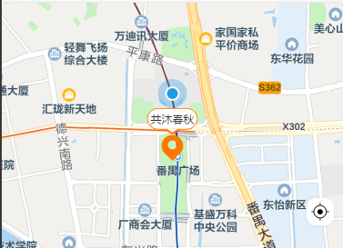

## 通用

### 获取手机号

> 需要获取用户手机号时，流程为在前端获取令牌后，供服务器兑换手机号，再返回给前端。

```html
<button open-type="getPhoneNumber" bindgetphonenumber="getPhoneNumber"></button>
```


```javascript
Page({
  getPhoneNumber (e) {
    console.log(e.detail.code) // 返回的动态令牌，供后端换取用户手机号
  }
})
```


### 允许页面的分享

> [控制](https://developers.weixin.qq.com/miniprogram/dev/api/share/wx.showShareMenu.html)是否显示转发分享菜单在 "...” 菜单中

```javascript
onLoad(options) {
  // 允许分享
  wx.showShareMenu({
    withShareTicket: true,
    // 设置下方的Menus菜单，才能够让发送给朋友与分享到朋友圈两个按钮可以点击
    menus: ['shareAppMessage', 'shareTimeline']
  })
},
```


### 微信订阅消息

> 场景：用户点击立即参团按钮时，弹出该弹框让用户开启订阅。

```javascript
clickBtn() {
  const tmplIds = this.member.tmplIdsSet.group_order_pay_success
  wx.requestSubscribeMessage({
    tmplIds,
    // 接口调用成功，即用户点击了确定/取消后都会执行的逻辑  
    success(res) {},
    // 如果是在企业微信中执行，还需要把逻辑添加到 fail 中
    fail(res) {}
  })
}
```

:hammer_and_wrench: tmplIds 一般由服务器提供，多处需要用到的话，可以在初始加载（onLaunch）时请求，将数据写入到 vuex/缓存中。


### 实现分包

> 小程序会限制包的体积大小，当应用内容过多时，可以进行[分包](https://developers.weixin.qq.com/miniprogram/dev/framework/subpackages/basic.html)处理。

<span style="backGround: #efe0b9">app.json</span>

```javascript
"subpackages": [
  {
    "root": "pages-second",
    "pages": [
      "service/service",
      "service_store/service_store",
      "service_check/service_check"
    ]
  }
],
```

**项目结构**

```elm
- pages
- pages-second
  + service
  + service_store
  + service_check
```

**跳转示例**

```javascript
wx.navigateTo({
  url: `/pages-second/service_store/service_store?id=${item.id}`
})
```


### 生成[二维码](https://github.com/yingye/weapp-qrcode)

>  前提：资源在仓库 dist 文件夹下，拷贝 weapp.qrcode.esm.js 文件到项目中。

<span style="backGround: #efe0b9">Demo.wxml</span>

```html
<canvas style="width: 200px; height: 200px;" canvas-id="myQrcode"></canvas>
```

<span style="backGround: #efe0b9">Demo.js</span>

```javascript
import drawQrcode from '../../utils/weapp.qrcode.esm.js'

Page({
  onShow() {
    drawQrcode({
      width: 200,
      height: 200,
      canvasId: 'myQrcode', // 对应元素 canvas-id 属性
      text: 'hello world',
      // 允许在二维码上绘制图片
      image: {
        imageResource: '../../images/icon.png', // 资源路径
        dx: 70,
        dy: 70,
        dWidth: 60,
        dHeight: 60
      }
    })
  } 
})
```


### 隐藏返回首页按钮

```less
onShow() {
  wx.hideHomeButton()
}
```


### 根据[环境](https://developers.weixin.qq.com/miniprogram/dev/api/open-api/account-info/wx.getAccountInfoSync.html)自动切换域名

> 该方案也适用于 uni-app；
>
> 这个在提审时有问题，提审的版本会认为是develop版导致请求的数据是测试版的。然后有可能被审核拒绝。

```javascript
const accountInfo = wx.getAccountInfoSync();
console.log('得到小程序版本', accountInfo.miniProgram.envVersion)

// 开发
if (accountInfo.miniProgram.envVersion === 'develop') {
  baseUrl = 'http://192.168.0.215:8001/kaps'
// 体验
} else if (accountInfo.miniProgram.envVersion === 'trial') {
  baseUrl = 'https://qlc.tiyan.com/api/member'
} else {
// 正式
  baseUrl = 'https://qlc.zhengshi.com/api/member'
}
```


### 完善自定义导航栏

> 通常用于背景图需要覆盖导航栏位置的情景。

<span style="backGround: #efe0b9">demo.json</span>

```javascript
{
  "usingComponents": {},
  "navigationBarBackgroundColor": "#fff",
  "navigationBarTextStyle": "black",
  "navigationBarTitleText": "示例页面",
  "navigationStyle": "custom"
}
```

<span style="backGround: #efe0b9">demo.js</span>

左上角返回的图标以及方法其实可以优化一下，进行动态判断：根据页面栈的数量来处理。

```javascript
Page({
  // 数据
  data: {
    navBarHeight: 0,
    menuRight: 0,
    menuBottom: 0,
    menuHeight: 0,
    systemHeight: 0
  },
  getSystem() {
    // 获取系统信息
    const systemInfo = wx.getSystemInfoSync();
    // 胶囊按钮位置信息
    const menuButtonInfo = wx.getMenuButtonBoundingClientRect();
    // 导航栏高度 = 状态栏到胶囊的间距（胶囊距上距离-状态栏高度） * 2 + 胶囊高度 + 状态栏高度
    const navBarHeight = (menuButtonInfo.top - systemInfo.statusBarHeight) * 2 +  menuButtonInfo.height + systemInfo.statusBarHeight;
    const menuRight = systemInfo.screenWidth - menuButtonInfo.right;
    const menuBottom = menuButtonInfo.top - systemInfo.statusBarHeight;
    const menuHeight = menuButtonInfo.height;
    const systemHeight = systemInfo.statusBarHeight;
    this.setData({ navBarHeight, menuRight, menuBottom, menuHeight, systemHeight })
    console.log(navBarHeight)
  },
  // 返回方法
  handleBack() {
    wx.reLaunch({
      url: '/page/index/index'
    })
  },
  onLoad(options) {
    // 获取头部导航栏高度
    this.getSystem()
  }
})
```

<span style="backGround: #efe0b9">demo.wxml</span>

在样式处理方面，使用 `border` 来拟造箭头，这样就不用额外引入图标了。

```html
<!-- 头部导航栏 -->
<view class="nav-bar"
  style="height:{{navBarHeight}}px; padding-top: {{systemHeight}}px;">
  <text class="arrow" bindtap="handleBack"></text>
  <view class="nav-bar-content">
    示例页
  </view>
  <text></text>
</view>
```

<span style="backGround: #efe0b9">demo.wxss</span>

```css
/* 头部导航栏 */
.nav-bar {
  position: fixed;
  top: 0;
  left: 0;
  right: 0;
  z-index: 1001;
  display: flex;
  align-items: center;
  justify-content: space-between;
  padding-left: 26rpx;
  padding-right: 26rpx;
}
.nav-bar-content {
  color: #000;
}
.arrow {
  transform: rotate(45deg);
  display: inline-block;
  height: 18rpx;
  width: 18rpx;
  border-color: #000;
  border-style: solid;
  border-width: 0 0 4rpx 4rpx;
}
```


## 地图

### 显示地图

```html
<map id="map" class="mapArea"></map>
```

```css
.mapArea {
  width: 100%;
  min-height: 550rpx;
  flex: 1;
  position: relative;
}
```


### 定位到当前

在地图上添加一个图标，用户点击时可以定位到当前位置。

<span style="backGround: #efe0b9">Demo.wxml</span>

```html
<map
  id="map"
  class="mapArea"
  show-location="{{true}}"
>
  <!-- 定义在map上的元素，定义为右下角的标，用于返回当前定位 -->
  <cover-view class="diy-icon" bindtap="moveTolocation">
    <cover-image class="pos-icon" src="http://xxx.png"></cover-image>
  </cover-view>
</map>
```

:star2: 为了调用定位接口，需要设置 <span style="color: green">show-location</span> 属性，并开启权限

<span style="backGround: #efe0b9">Demo.js</span>

```javascript
// map返回当前位置
moveTolocation() {
  const mapCtx = wx.createMapContext('map') //wxml中map标签的id值
  mapCtx.moveToLocation()
},
```

<span style="backGround: #efe0b9">app.json</span>

```javascript
"permission":{
  "scope.userLocation": {
    "desc": "获取你当前位置信息用于小程序位置接口的效果展示"
  }
}
```


### 初始位置

通过 <span style="color: green">latitude</span> 和 <span style="color: green">longitude</span> 属性配置初始位置。

```html
<map
  id="map"
  class="mapArea"
  show-location="{{true}}"
  latitude="{{position.latitude}}"
  longitude="{{position.longitude}}"
>...</map>
```

在进入页面时获取用户的定位信息

```javascript
data: {
  position: {  // 位置信息
    latitude: 0,
    longitude: 0
  }
},
onLoad: function (options) {
  wx.getLocation({
    type: 'wgs84', // 返回 gps 坐标
    success: (e) => {
      const position = {
        latitude: e.latitude, // 经度
        longitude: e.longitude // 维度
      }
      wx.setStorageSync('position', JSON.stringify(position))
      this.setData({ position });
    }
  })
},
```


### 添加标记（如门店）

<span style="color: slategray">markers</span> 接收一个数组，由 marker 对象组成。

```html
<map
  markers="{{covers}}"
  bindmarkertap="markerClick"
  bindcallouttap="markerClick"
>...</map>
```

点击标记点时触发；点击标记点对应的气泡时触发

```javascript
data: {
  covers: [],
  callout: {  // 气泡的配置
    color: '#333333',
    fontSize: 12,
    bgColor: '#ffffff',
    borderWidth: 1,
    borderColor: '#ff7700',
    borderRadius: 20,
    padding: 3,
    textAlign: 'center',
    display: 'ALWAYS' // 常显
  }
},
dos() {
  this.data.covers.push({
    id: 3,
    latitude: 22.933772,
    longitude: 113.38424,
    title: '测试', // 点击时显示，callout 存在时将被忽略
    width: 30,
    height: 30,
    iconPath: 'http://xx.png', // 显示的图标
    zIndex: 100, // 层级
    callout: {
      ...this.data.callout,
      content: '共沐春鳅'    // 显示到地图上的文本
    }
  })
  this.setData({
    covers: this.data.covers,
  })
},
markerClick({ detail }) {
  console.log(detail.markerId) // 返回标记点对应的Id
},
```

建议为每个 marker 设置上 number 类型 id，保证更新 marker 时有更好的性能


### 展示坐标点集合



```javascript
dos() {
  const mapCtx = wx.createMapContext('map')
  mapCtx.includePoints({
    padding: [100, 20, 300, 20], // 坐标点形成的矩形边缘到地图边缘的距离（上右下左 px 安卓上只能识别数组第一项）
    // 自己的坐标，门店坐标
    points: [
      {
        latitude: 22.933772,
        longitude: 113.38424,
      }, {
        latitude: 22.93772,
        longitude: 113.38424,
      },
    ]
  })
}
```


### 使用地图选点插件

> [使用](https://lbs.qq.com/miniProgram/plugin/pluginGuide/locationPicker)该插件，提供用户的经纬度即可实现选点功能（可以搜索地点），使用需要[申请](https://www.cnblogs.com/1549983239yifeng/p/14750266.html)密钥。


## 锦囊

### 获取用户信息报 invalid code

`报错信息`

```elm
{"errcode":40029, "errmsg":"invalid code", ...}
```

`出错原因`

1. 由于前端小程序与服务器接口用的 AppID（小程序ID）、AppSecret（小程序密钥） 不一样导致。
2. 重复请求，请求两次导致code失效（<span style="color: #f7534f;font-weight:600">code只能使用一次</span>）。


### 监听元素距离顶部距离

<span style="backGround: #efe0b9">Demo.wxml</span>

```react
<view id="demo"></view>
```

<span style="backGround: #efe0b9">demo.js</span>

```javascript
Page({
  // 监听页面滚动的事件
  onPageScroll(e) {
    const query = wx.createSelectorQuery()
    query.select('#demo').boundingClientRect()
    query.selectViewport().scrollOffset()
    query.exec(function(res){
      console.log(res[0].top) // 该元素距离上边界的坐标     
    })
  },
})
```


### 实现sticky布局

```react
<!-- 分类 -->
<view class="i-tabs">
  <i-tabs>...</i-tabs>
</view>

.i-tabs {
  position: sticky;
  top: 0;
}
```

在自定义组件上使用 sticky，会失效；所以给它套上一层


### 伪计算属性

```html
<view wx:if="{{bookSuccess}}">请提前10分钟到店！</view>
<view wx:if="{{!bookSuccess}}">预约已取消</view>
```

> 原生小程序好像没有 computed，也没有 watch


## 使用云函数

1. 在 project.config.json 中配置云函数的目录文件（可以自己新建一个）
2. 在 微信开发者工具 选择环境
3. 在 微信开发者工具 选择同步云函数列表
4. 选择云函数目录下的某个函数文件，点击下载
5. 在页面中使用云函数


```javascript
wx.cloud.init()
wx.cloud.callFunction({
  config:{ env: 'whole-demo' }, // 环境ID
  name: 'getAddress', // 云函数的名字
  data:{a:10,b:20}, // 传参
  success: (res) => {
    console.log(res)
  },
  fail(err) {
    console.log(err)
  }
})
```


## 补充的话

在[仓库](https://github.com/SpringLoach/power)，还提供了许多<span style="color: #3a84aa">前端常见需求</span>及实现的归纳整理，欢迎客官看看~

如果这篇笔记能够帮助到你，请帮忙在 [github](https://github.com/SpringLoach/power) 上点亮 `star`，感谢！
