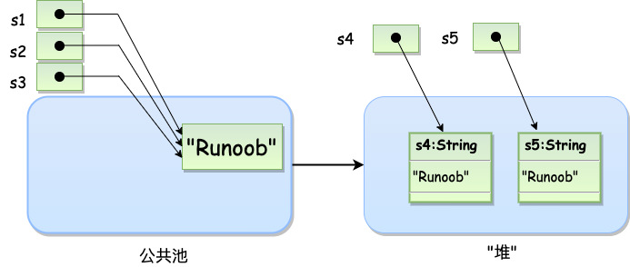

> [学习路线](https://zhuanlan.zhihu.com/p/379041500)和[相关资料](https://javaguide.cn/java/basis/java%E5%9F%BA%E7%A1%80%E7%9F%A5%E8%AF%86%E6%80%BB%E7%BB%93/#)、[菜鸟教程](https://www.runoob.com/java/java-tutorial.html)和[雪峰老师](https://www.liaoxuefeng.com/wiki/1252599548343744)


## 最初栗子

`HelloWorld.java`

```java
public class HelloWorld {
    public static void main(String[] args) {
        System.out.println("Hello World");
    }
}
```

:star2: 文件名需与类名一致。

:flipper: `String args[]` 与 `String[] args` 都可以执行，后者的可读性更好。


**命令**

```visual basic
$ javac HelloWorld.java
$ java HelloWorld
```

输出

```java
Hello World
```

命令说明

| 命令    | 说明                   | 补充                                      |
| ------- | ---------------------- | ----------------------------------------- |
| `javac` | 后跟 java 文件名       | 用于将 java 源文件编译为 class 字节码文件 |
| `java`  | 后跟 java 文件中的类名 | 运行 class 文件，不要跟 `.class`          |


## 基础语法

|   概念   | 说明                               | 类似js中的 |
| :------: | ---------------------------------- | :--------: |
|   对象   | 类的实例，包含状态和行为           |            |
|    类    | 作为模板，描述一类对象的行为和状态 |            |
|   方法   | 方法就是行为                       |            |
| 实例变量 | 决定对象的状态                     |    属性    |


### 基本语法

|     --     |                         说明                         |                           补充                            |
| :--------: | :--------------------------------------------------: | :-------------------------------------------------------: |
| 大小写敏感 |                                                      |                                                           |
|    类名    |                       大写开头                       | 若为多单词类名，每个单词首字母大写，如 `MyFirstJavaClass` |
|   方法名   |                       小写开头                       |          若为多单词方法名，后面的单词首字母大写           |
|  源文件名  | 源文件名必须和类名相同，且大小写敏感，后缀为 `.java` |                    否则会导致编译报错                     |
| 主方法入口 |       `public static void main(String[] args)`       |                             /                             |


### 标识符

类名、变量名以及方法名都被称为标识符。

|       项       | 允许范围                                            |
| :------------: | --------------------------------------------------- |
|  标识符首字符  | 字母（A-Z 或者 a-z）,美元符（$）、下划线（_）       |
| 标识符非首字符 | 字母（A-Z 或者 a-z）,美元符（$）、下划线（_）或数字 |
|    需要注意    | 关键字不能用作标识符，且标识符是大小写敏感的        |
|    需要注意    | 可以用中文，但不要这样做                            |


### 变量

> 待拓展，待移除

- 局部变量
- 类变量（静态变量）
- 成员变量（非静态变量）


### 注释

```java
/* 示例
 * 示例
 * 多行注释
 */

// 单行注释
/* 单行注释 */
```


### 空行

> 空行和注释行会被忽略。


### 继承

利用继承的方法，可以重用已存在类的方法和属性。被继承的类称为超类，派生类称为子类。


### Java源程序与编译型运行区别


## 对象和类

#### 类型变量

一个类可以包含以下类型变量：

- **局部变量**：在方法、构造方法或者语句块中定义的变量被称为局部变量。变量声明和初始化都是在方法中，方法结束后，变量就会自动销毁。
- **成员变量**：成员变量是定义在类中，方法体之外的变量。这种变量在创建对象的时候实例化。成员变量可以被类中方法、构造方法和特定类的语句块访问。
- **类变量**：类变量也声明在类中，方法体之外，但必须声明为 static 类型。


#### 创建对象

```java
public class Puppy{
   /* 显式定义一个构造方法，仅有一个参数 name */
   public Puppy(String name){
   }
   public static void main(String[] args){
      /* 创建 Puppy 对象 */
      Puppy myPuppy = new Puppy( "tommy" );
   }
}
```

:star2: 每个类都有至少一个构造方法。如果没有显式定义，Java 编译器将会为该类提供一个默认构造方法。

:star2: 构造方法的名称必须与类同名。

:star2: 对象是根据类创建的，使用 new 创建对象时，会调用类的构造方法初始化对象。


#### 访问实例变量和方法

```java
public class Puppy{
   int puppyAge;
   public Puppy(String name){
      // 这个构造器仅有一个参数：name
      System.out.println("小狗的名字是 : " + name ); 
   }
 
   public void setAge( int age ){
       puppyAge = age;
   }
 
   public int getAge( ){
       System.out.println("小狗的年龄为 : " + puppyAge ); 
       return puppyAge;
   }
 
   public static void main(String[] args){
      Puppy myPuppy = new Puppy( "tommy" );					// 创建对象    
      myPuppy.setAge( 2 );									// 调用方法
      myPuppy.getAge( );									// 调用方法
      System.out.println("变量值 : " + myPuppy.puppyAge );   // 访问成员变量
   }
}
```

```java
/* 输出结果 */
小狗的名字是 : tommy
小狗的年龄为 : 2
变量值 : 2
```


#### 源文件声明规则

- 一个源文件中只能有一个 public 类，可以有多个非 public 类。
- 源文件的名称应该和 public 类的类名保持一致。
- 如果一个类定义在某个包中，那么 package 语句应该在源文件的首行。
- 如果源文件包含 import 语句，那么应该放在 package 语句和类定义之间。如果没有 package 语句，那么 import 语句应该在源文件中最前面。
- import 语句和 package 语句对源文件中定义的所有类都有效。在同一源文件中，不能给不同的类不同的包声明。


#### Java 包

> 包主要用来对类和接口进行分类。


#### import 语句

> 用来提供一个合理的路径，使得编译器可以找到某个类。

`栗子`

```java
/* 该命令行将会命令编译器载入 java_installation/java/io 路径下的所有类 */
import java.io.*;
```


#### 简单栗子

> 该例中，创建两个 `.java` 文件，在一个文件中载入并实例化另一个文件的类，并调用其方法。

`Employee.java`

```java
import java.io.*;
 
public class Employee{
   String name;
   int age;
   String designation;
   double salary;
   // Employee 类的构造器
   public Employee(String name){
      this.name = name;
   }
   // 设置age的值
   public void empAge(int empAge){
      age =  empAge;
   }
   /* 设置designation的值*/
   public void empDesignation(String empDesig){
      designation = empDesig;
   }
   /* 设置salary的值*/
   public void empSalary(double empSalary){
      salary = empSalary;
   }
   /* 打印信息 */
   public void printEmployee(){
      System.out.println("名字:"+ name );
      System.out.println("年龄:" + age );
      System.out.println("职位:" + designation );
      System.out.println("薪水:" + salary);
   }
}
```

`EmployeeTest.java`

```react
import java.io.*;
public class EmployeeTest{
 
   public static void main(String[] args){
      /* 使用构造器创建两个对象 */
      Employee empOne = new Employee("RUNOOB1");
      Employee empTwo = new Employee("RUNOOB2");
 
      // 调用这两个对象的成员方法
      empOne.empAge(26);
      empOne.empDesignation("高级程序员");
      empOne.empSalary(1000);
      empOne.printEmployee();
 
      empTwo.empAge(21);
      empTwo.empDesignation("菜鸟程序员");
      empTwo.empSalary(500);
      empTwo.printEmployee();
   }
}
```

## 基本数据类型

当创建变量的时候，会在内存中申请空间，用于存储值。

内存管理系统根据变量的类型为变量分配存储空间，分配的空间只能用来储存该类型数据。


Java 的两大数据类型:

- 内置数据类型
- 引用数据类型


### 内置数据类型

> 共有八种基本类型。六种数字类型（四个整数型，两个浮点型），此外还有字符类型和布尔型。

|  数据类型   | 说明                                      |      取值范围       | 默认值  | 补充                                 |
| :---------: | ----------------------------------------- | :-----------------: | :-----: | ------------------------------------ |
|  **byte**   | 8 位、有符号的，以二进制补码表示的整数    |     -128 ~ 127      |    0    | 占用空间为 int 类型的 1/4            |
|  **short**  | 16 位、有符号的，以二进制补码表示的整数   |   -32765 ~ 32767    |    0    | 占用空间为 int 类型的 1/2            |
|   **int**   | 32 位、有符号的，以二进制补码表示的整数   |  -2^31 ~ 2^31 - 1   |    0    | 整型变量默认为 int 类型              |
|  **long**   | 64 位、有符号的，以二进制补码表示的整数   |  -2^63 ~ 2^63 - 1   |   0L    | 最好大写，易于分辨                   |
|  **float**  | 32 位、单精度、符合 IEEE 754 标准的浮点数 |         略          |  0.0f   | 浮点数均不能用来表示精确的值，如货币 |
| **double**  | 64 位、双精度、符合 IEEE 754 标准的浮点数 |         略          |  0.0d   | 浮点数的默认类型为 double 类型       |
| **boolean** | 1 位                                      |    true / false     |  false  |                                      |
|  **char**   | 16 位 Unicode 字符，可以储存任何字符      | `\u0000` ~ `\uffff` | 'u0000' |                                      |

#### 通过包装类中的常量

```java
/* 包装类：java.lang.Byte */
System.out.println(Byte.SIZE);       // 二进制位数
System.out.println(Byte.MIN_VALUE);  // 最小值
System.out.println(Byte.MAX_VALUE);  // 最大值
```

:ghost: ​可以通过 `Byte` 、`Short` 、`Integer` 、`Long` 、`Float` 、`Double` 、`Character` 获取对应的信息，要注意 `Character` 是以数值形式输出的：`0-65535`


### 引用类型

- 引用类型的变量非常类似于C/C++的指针。引用类型指向一个对象，指向对象的变量是引用变量。这些变量在声明时被指定为一个特定的类型，比如 Employee、Puppy 等。变量一旦声明后，类型就不能被改变了。
- 对象、数组都是引用数据类型。
- 所有引用类型的默认值都是null。
- 一个引用变量可以用来引用任何与之兼容的类型。
- 例子：Site site = new Site("Runoob")。


### 常量

常量在程序运行时是不能被修改的。


`声明常量`

```java
/* 使用 final 关键字来修饰常量，声明方式和变量类似： */
final double PI = 3.1415927;
```

:flipper: ​为了更好的识别，常量通常用大写字母表示。


`不同进制`

```java
/* 字面量可以赋给任何内置类型的变量 */
int decimal = 100;
/* 前缀 0 表示 8 进制 */
int octal = 0144;
/* 前缀 0x 表示 16 进制 */
int hexa =  0x64;
```

:ghost: `byte`、`int`、`long`、和 `short` 都可以用十进制、十六进制以及八进制的方式来表示。


`字符串常量`  

```java
/* 字符串型字面量的栗子 */
"Hello World"
"two\nlines"

/* 字符串常量和字符常量都可以包含任何Unicode字符 */
char a = '\u0001';
String a = "\u0001";  
```


`转义字符序列`

| 符号 | 字符含义     |      | 符号     | 字符含义                 |
| :--- | :----------- | ---- | -------- | ------------------------ |
| `\n` | 换行 (0x0a)  |      | `\t`     | 制表符                   |
| `\r` | 回车 (0x0d)  |      | `\"`     | 双引号                   |
| `\f` | 换页符(0x0c) |      | `\'`     | 单引号                   |
| `\b` | 退格 (0x08)  |      | `\\`     | 反斜杠                   |
| `\0` | 空字符 (0x0) |      | `\ddd`   | 八进制字符 (ddd)         |
| `\s` | 空格 (0x20)  |      | `\uxxxx` | 16进制Unicode字符 (xxxx) |


### 自动类型转换

>  整型、实型（常量）、字符型数据可以混合运算。运算中，不同类型的数据先转化为同一类型，然后进行运算。

```
低  -------------转换从低级到高级---------->  高

byte,short,char—> int —> long—> float —> double 
```

`数据类型转换规则`

1. 不能对boolean类型进行类型转换。

2. 不能把对象类型转换成不相关类的对象。

3. 在把容量大的类型转换为容量小的类型时必须使用强制类型转换。

4. 转换过程中可能导致溢出或损失精度，如超出类型的最大值。

5. 浮点数到整数的转换是通过舍弃小数得到，而不是四舍五入。


#### 自动类型转换

必须满足转换前的数据类型的位数要低于转换后的数据类型，例如: short数据类型的位数为16位，就可以自动转换位数为32的int类型，同样float数据类型的位数为32，可以自动转换为64位的double类型。

```java
char c1='a';
int i1 = c1;             // char自动类型转换为int
System.out.println(i1);  // char自动类型转换为int后的值等于 97
char c2 = 'A';
int i2 = c2+1;           // char 类型和 int 类型计算
System.out.println(i2);  // char类型和int计算后的值等于 65+1 = 66
```


#### 强制类型转换

```java
int i1 = 123;
byte b = (byte)i1;    	   // 强制类型转换为byte
System.out.println(b);  // int强制类型转换为byte后的值等于 123
```

:star2: 转换的数据类型必须是兼容的。

:star2: 语法为 `(type)value`，强制将 value转换为 type 类型。


#### 隐含强制类型转换

1\. 整数的默认类型是 int。

2\. 小数默认是 double 类型浮点型，在定义 float 类型时必须在数字后面跟上 F 或者 f。


## 变量类型

`声明变量`

```java
int a, b, c;              // 声明三个int型整数：a、b、c
int d = 3, e = 4, f = 5;  // 声明三个整数并初始化
String s = "runoob";      // 声明字符串 s 并初始化
double pi = 3.14159;      // 声明双精度浮点型变量 pi 并初始化
char x = 'x';             // 声明字符变量 x 并初始化
```

:star2: ​所有的变量在使用前必须声明。声明变量的基本格式为 `数据类型 变量名`。


`变量类型`

| Java语言支持的变量类型 |                  说明                  |
| :--------------------: | :------------------------------------: |
|         类变量         |  独立于方法之外的变量，用 static 修饰  |
|        实例变量        | 独立于方法之外的变量，不用 static 修饰 |
|        局部变量        |            类的方法中的变量            |

`实例`

```java
public class Variable{
    static int allClicks = 0;    // 类变量
    String str = "hello world";  // 实例变量 
    public void method(){ 
        int i = 0;              // 局部变量 
    }
}
```


#### 局部变量

- 局部变量声明在方法、构造方法或者语句块中；
- 局部变量在方法、构造方法、或者语句块被执行的时候创建，当它们执行完成后，变量将会被销毁；
- 局部变量只在声明它的方法、构造方法或者语句块中可见；
- 访问修饰符不能用于局部变量；
- 局部变量是在栈上分配的。
- 局部变量没有默认值，所以局部变量被声明后，必须经过<span style="backGround: pink">初始化</span>，才可以使用。


#### 实例变量

- 实例变量声明在一个类中，但在方法、构造方法和语句块之外；
- 当一个对象被实例化之后，每个实例变量的值就跟着确定；
- 实例变量在对象创建的时候创建，在对象被销毁的时候销毁；
- 实例变量的值应该至少被一个方法、构造方法或者语句块引用，使得外部能够通过这些方式获取实例变量信息；
- 实例变量可以声明在使用前或者使用后；
- 访问修饰符可以修饰实例变量；
- 实例变量对于类中的方法、构造方法或者语句块是可见的。一般情况下应该把实例变量设为私有。通过使用访问修饰符可以使实例变量对子类可见；
- 实例变量具有默认值。数值型变量的默认值是0，布尔型变量的默认值是false，引用类型变量的默认值是null。变量的值可以在声明时指定，也可以在构造方法中指定；
- 实例变量可以直接通过变量名访问。但在静态方法以及其他类中，就应该使用完全限定名：*ObejectReference.VariableName*。

```java
import java.io.*;

public class Employee{
   // 这个实例变量对子类可见
   public String name;
   // 私有变量，仅在该类可见
   private double salary;
   // 在构造器中对name赋值
   public Employee (String empName){
      name = empName;
   }
   // 设定salary的值
   public void setSalary(double empSal){
      salary = empSal;
   }  
   // 打印信息
   public void printEmp(){
      System.out.println("名字 : " + name );
      System.out.println("薪水 : " + salary);
   }
   
   // 程序都是从main方法开始执行
   public static void main(String[] args){
      Employee empOne = new Employee("RUNOOB");
      empOne.setSalary(1000.0);
      empOne.printEmp();
   }
}
```


#### 类变量（静态变量）

- 类变量也称为静态变量，在类中以 static 关键字声明，但必须在方法之外。
- 无论一个类创建了多少个对象，类只拥有类变量的一份拷贝。
- 静态变量除了被声明为常量外很少使用，静态变量是指声明为 public/private，final 和 static 类型的变量。静态变量初始化后不可改变。
- 静态变量储存在静态存储区。经常被声明为常量，很少单独使用 static 声明变量。
- 静态变量在第一次被访问时创建，在程序结束时销毁。
- 与实例变量具有相似的可见性。但为了对类的使用者可见，大多数静态变量声明为 public 类型。
- 默认值和实例变量相似。数值型变量默认值是 0，布尔型默认值是 false，引用类型默认值是 null。变量的值可以在声明的时候指定，也可以在构造方法中指定。此外，静态变量还可以在静态语句块中初始化。
- 静态变量可以通过：*ClassName.VariableName*的方式访问。
- 类变量被声明为 public static final 类型时，类变量名称一般建议使用大写字母。如果静态变量不是 public 和 final 类型，其命名方式与实例变量以及局部变量的命名方式一致。

```java
import java.io.*;
 
public class Employee {
    // salary是静态的私有变量
    private static double salary;
    // DEPARTMENT是一个常量
    public static final String DEPARTMENT = "开发人员";
    public static void main(String[] args){
    salary = 10000;
        System.out.println(DEPARTMENT+"平均工资:"+salary);
    }
}
```

:turtle: ​如果其他类想要访问该变量，可以这样访问：`Employee.DEPARTMENT`。


## 修饰符

修饰符，主要分为以下两类：

- 访问修饰符
- 非访问修饰符

```java
public class ClassName {
   // ...
}
private boolean myFlag;
static final double weeks = 9.5;
protected static final int BOXWIDTH = 42;
public static void main(String[] arguments) {
   // 方法体
}
```

 :ghost: ​修饰符用来定义类、方法或者变量，通常放在语句的最前端。


### 访问修饰符

可以使用访问控制符来保护对类、变量、方法和构造方法的访问。

| 修饰符      | 说明                             | 使用对象             | 注意                 |
| :---------- | :------------------------------- | :------------------- | :------------------- |
| `default`   | 在同一包内可见，不使用任何修饰符 | 类、接口、变量、方法 | 即默认，不使用关键字 |
| `public`    | 对所有类可见                     | 类、接口、变量、方法 |                      |
| `private`   | 在同一类内可见                   | 变量、方法           | 不能修饰类（外部类） |
| `protected` | 对同一包内的类和所有子类可见     | 变量、方法           | 不能修饰类（外部类） |

`访问控制`

| 修饰符      | 当前类             | 同一包内                 | 子孙类(同一包)           | 子孙类(不同包)                                               | 其他包                   |
| :---------- | :----------------- | :----------------------- | :----------------------- | :----------------------------------------------------------- | :----------------------- |
| `public`    | :heavy_check_mark: | :heavy_check_mark:       | :heavy_check_mark:       | :heavy_check_mark:                                           | :heavy_check_mark:       |
| `protected` | :heavy_check_mark: | :heavy_check_mark:       | :heavy_check_mark:       | :heavy_check_mark:/:heavy_multiplication_x:（[说明](https://www.runoob.com/java/java-modifier-types.html#protected-desc)） | :heavy_multiplication_x: |
| `default`   | :heavy_check_mark: | :heavy_check_mark:       | :heavy_check_mark:       | :heavy_multiplication_x:                                     | :heavy_multiplication_x: |
| `private`   | :heavy_check_mark: | :heavy_multiplication_x: | :heavy_multiplication_x: | :heavy_multiplication_x:                                     | :heavy_multiplication_x: |


#### 默认访问修饰符

使用默认访问修饰符声明的变量和方法，对同一个包内的类是可见的。

接口里的变量都隐式声明为 <span style="color: slategray">public static final</span>，而接口里的方法默认情况下访问权限为 <span style="color: slategray">public</span>。

```java
/* 不使用任何修饰符 */
String version = "1.5.1";
boolean processOrder() {
   return true;
}
```


#### 公有访问修饰符-public

被声明为 public 的类、方法、构造方法和接口能够被任何其他类访问。

如果几个相互访问的 public 类分布在不同的包中，则需要导入相应 public 类所在的包。由于类的继承性，类所有的公有方法和变量都能被其子类继承。

```java
/* 公有访问控制 */
public static void main(String[] arguments) {
   // ...
}
```

:turtle: ​程序的 `main()` 方法必须设置成公有的，否则，Java 解释器将不能运行该类。


#### 私有访问修饰符-private

私有访问修饰符是最严格的访问级别，所以被声明为 <span style="color: slategray">private</span> 的方法、变量和构造方法只能被所属类访问，并且类和接口不能声明为 <span style="color: slategray">private</span>。

<span style="color: slategray">private</span> 访问修饰符的使用主要用来隐藏类的实现细节和保护类的数据。

```java
/* 为了使其他类能够操作该变量，定义了两个 public 方法 */
public class Logger {
   private String format;                  // 私有变量，其他类不能直接得到和设置该变量的值
   public String getFormat() { 	           // 返回 format 的值
      return this.format;          
   }
   public void setFormat(String format) {  // 设置 format 的值
      this.format = format;
   }
}
```


#### 受保护的访问修饰符-protected

|  子类与基类  | 说明                                                         |
| :----------: | ------------------------------------------------------------ |
|  在同一包中  | 被声明为 protected 的变量、方法和构造器能被同一个包中的任何其他类访问 |
| 不在同一包中 | 在子类中，子类实例可以访问其从基类继承而来的 protected 方法，而不能访问基类实例的 protected 方法 |

```java
/* 父类使用了 protected 访问修饰符，子类重写了父类的 openSpeaker() 方法 */
class AudioPlayer {
   protected boolean openSpeaker(Speaker sp) {
      // 实现细节
   }
}
class StreamingAudioPlayer extends AudioPlayer {
   protected boolean openSpeaker(Speaker sp) {
      // 实现细节
   }
}
/*
* 如果把该方法声明为 private，那么除了 AudioPlayer 之外的类将不能访问该方法。
* 
* 如果把该方法声明为 public，那么所有的类都能够访问该方法。
* 
* 如果把该方法声明为 protected，该方法对其所在类的子类可见。
*/
```

:flipper: 接口及接口的成员变量和成员方法不能声明为 <span style="color: slategray">protected</span>


#### 访问控制和继承

- 父类中声明为 <span style="color: slategray">public</span> 的方法在子类中也必须为 <span style="color: slategray">public</span>。
- 父类中声明为 <span style="color: slategray">protected</span> 的方法在子类中只能声明为 <span style="color: slategray">protected</span> 或 <span style="color: slategray">public</span>，不能声明为 <span style="color: slategray">private</span> 。
- 父类中声明为 <span style="color: slategray">private</span>  的方法，不能够被继承。


### 非访问修饰符

|            修饰符            | 说明                                                         |
| :--------------------------: | :----------------------------------------------------------- |
|           `static`           | 用来修饰类方法、类变量                                       |
|           `final`            | 用来修饰类、方法和变量。用它修饰的类不能够被继承，修饰的方法不能被继承类重新定义，修饰的变量为常量 |
|          `abstract`          | 用来创建抽象类和抽象方法                                     |
| `synchronized` 和 `volatile` | 主要用于线程的编程                                           |


#### static 修饰符

| 声明类型 |  别名  | 说明                                                         |
| :------: | :----: | :----------------------------------------------------------- |
| 静态变量 | 类变量 | 无论一个类实例化多少对象，它的静态变量只有一份拷贝           |
| 静态方法 | 类方法 | 静态方法不能使用类的非静态变量。静态方法从参数列表得到数据，然后计算这些数据 |

```java
public class InstanceCounter {
   private static int numInstances = 0;
   protected static int getCount() {
      return numInstances;
   }
 
   private static void addInstance() {
      numInstances++;
   }
 
   InstanceCounter() {
      InstanceCounter.addInstance();
   }
 
   public static void main(String[] arguments) {
      System.out.println(InstanceCounter.getCount());  // 0
      for (int i = 0; i < 500; ++i){
         new InstanceCounter();
      }
      System.out.println(InstanceCounter.getCount());  // 500
   }
}
```

对类变量和方法的访问可以直接使用 <span style="color: #a50">classname.variablename</span> 和 <span style="color: #a50">classname.methodname</span> 的方式访问。


#### final 修饰符

`final 变量`

```java
public class Test{
  /* 赋初值 */  
  final int value = 10;
  /* final 修饰符通常和 static 修饰符一起使用来创建类常量 */
  public static final int BOXWIDTH = 6;
  static final String TITLE = "Manager";
}
```

:star2: 用它修饰的变量一旦赋值后，不能被重新赋值

:star2: 被它修饰的实例变量必须显式指定初始值


`final 方法`

```java
public class Test{
    public final void changeName(){ ... }
}
```

:star2: 父类中的 final 方法可以被子类继承，但是不能被子类重写。


`final 类`

```java
public final class Test { ... }
```

:star2: final 类不能被继承


#### abstract 修饰符

`抽象类`

抽象类不能用来实例化对象，但可以用子类继承它。声明抽象类是为了将来对该类进行扩充。

```java
abstract class Caravan{
   private int price;
   public void changeColor()        // 普通方法
   public abstract void goFast();   // 抽象方法  
}
```

:star2: 一个类不能同时被 abstract 和 final 修饰。

:octopus: ​如果一个类包含抽象方法，那么该类一定要声明为抽象类，否则会编译错误。

:star2: 抽象类可以包含抽象方法和非抽象方法，它们都不是必须的。


`抽象方法`

抽象方法是一种没有任何实现的方法，该方法的具体实现由子类提供。

```java
public abstract class SuperClass{
  abstract void m();  // 抽象方法
}
 
class SubClass extends SuperClass{
  void m(){ ... }     // 实现抽象方法
}
```

:star2: 一个方法不能同时被 final 和 static 修饰。

:star2: 任何继承抽象类的子类必须实现父类的所有抽象方法，除非该子类也是抽象类。

:star2: 抽象方法的声明以分号结尾。


#### synchronized 修饰符

synchronized 关键字声明的方法同一时间只能被一个线程访问。可以应用于四种访问修饰符。

```java
public synchronized void showDetails(){
  ...
}
```


#### transient 修饰符

序列化的对象包含被 transient 修饰的实例变量时，java 虚拟机( JVM )跳过该特定的变量。

该修饰符包含在定义变量的语句中，用来预处理类和变量的数据类型。

```java
public transient int limit = 55;   // 不会持久化
public int b;                      // 持久化
```


#### volatile 修饰符

用 <span style="color: slategray">volatile</span> 修饰的成员变量在每次被线程访问时，都会从一个共享的内存中重新读取该成员变量的值。当成员变量发生变化时，线程会将变化值回写到共享的内存。这样在任何时刻，两个不同的线程总是看到某个成员变量的同一个值。

```java
/* 栗子 */
public class MyRunnable implements Runnable {
  private volatile boolean active;
  public void run() {
    active = true;
    while (active) { 
      ...
    }
  }
  public void stop() {
    active = false;  
  }
}
```

> 通常情况下，如果在第一个线程调用 run() 方法（在 Runnable 开启的线程），在第二个线程调用 stop() 方法。 第二个线程将 active 赋值为 false，并不会影响第一个线程循环的运行。但由于代码中使用了 <span style="color: slategray">volatile</span> 修饰 active，所以该循环会停止。


## 运算符

### 算术运算符

| 操作符 | 描述                              | 例子（A: 10、B: 20） |
| :----: | :-------------------------------- | :------------------: |
|   +    | 加法 - 相加运算符两侧的值         |    A + B 等于 30     |
|   -    | 减法 - 左操作数减去右操作数       |    A – B 等于 -10    |
|   *    | 乘法 - 相乘操作符两侧的值         |    A * B 等于 200    |
|   /    | 除法 - 左操作数除以右操作数       |     B / A 等于 2     |
|   ％   | 取余 - 左操作数除以右操作数的余数 |     B % A 等于 0     |
|   ++   | 自增: 操作数的值增加1             |  B++ 或 ++B 等于 21  |
|   --   | 自减: 操作数的值减少1             |  B-- 或 --B 等于 19  |

前缀自增自减法(++a,--a) 先进行自增/减运算，再进行表达式运算

后缀自增自减法(a++,a--) 先进行表达式运算，再进行自增/减运算


### 关系运算符

| 运算符 | 描述                                                         | 例子（A: 10、B: 20） |
| :----: | :----------------------------------------------------------- | :------------------: |
|   ==   | 检查如果两个操作数的值是否相等，如果相等则条件为真。         |    （A == B）为假    |
|   !=   | 检查如果两个操作数的值是否相等，如果值不相等则条件为真。     |   （A != B） 为真    |
|   >    | 检查左操作数的值是否大于右操作数的值，如果是那么条件为真。   |    （A > B）为假     |
|   <    | 检查左操作数的值是否小于右操作数的值，如果是那么条件为真。   |    （A < B）为真     |
|   >=   | 检查左操作数的值是否大于或等于右操作数的值，如果是那么条件为真。 |   （A > = B）为假    |
|   <=   | 检查左操作数的值是否小于或等于右操作数的值，如果是那么条件为真。 |    （A <= B）为真    |


### 位运算符

| 操作符 | 描述                                                         | 例子（A: 60、B: 13） | 结果 |   结果    |
| :----: | :----------------------------------------------------------- | :------------------: | :--: | :-------: |
|   ＆   | 如果相对应位都是1，则结果为1，否则为0                        |         A＆B         |  12  | 0000 1100 |
|   \|   | 如果相对应位都是 0，则结果为 0，否则为 1                     |        A \| B        |  61  | 0011 1101 |
|   ^    | 如果相对应位值相同，则结果为0，否则为1                       |        A ^ B         |  49  | 0011 0001 |
|   〜   | 按位取反运算符翻转操作数的每一位，即0变成1，1变成0。         |         〜A          | -61  | 1100 0011 |
|   <<   | 按位左移运算符。左操作数按位左移右操作数指定的位数。         |        A << 2        | 240  | 1111 0000 |
|   >>   | 按位右移运算符。左操作数按位右移右操作数指定的位数。         |        A >> 2        |  15  |   1111    |
|  >>>   | 按位右移补零操作符。左操作数的值按右操作数指定的位数右移，移动得到的空位以零填充。 |        A>>>2         |  15  | 0000 1111 |

```java
A = 0011 1100  // 2^5 + 2^4+ 2^3+ 2^2
B = 0000 1101  // 2^3 + 2^2+ 2^0
```


### 逻辑运算符

| 操作符 | 描述                                                         | 例子（A: true、B: flase） |
| :----: | :----------------------------------------------------------- | :-----------------------: |
|   &&   | 称为逻辑与运算符。当且仅当两个操作数都为真，条件才为真。     |      （A && B）为假       |
| \| \|  | 称为逻辑或操作符。如果任何两个操作数任何一个为真，条件为真。 |     （A \| \| B）为真     |
|   ！   | 称为逻辑非运算符。用来反转操作数的逻辑状态。如果条件为true，则逻辑非运算符将得到false。 |     ！（A && B）为真      |

#### 短路逻辑运算符

> 逻辑与运算符仅当第一个操作数为真时，才会判断（执行）第二个操作数。


### 赋值运算符

| 操作符  | 描述                                                         | 例子                                     |
| :-----: | :----------------------------------------------------------- | :--------------------------------------- |
|    =    | 简单的赋值运算符，将右操作数的值赋给左侧操作数               | C = A + B将把A + B得到的值赋给C          |
|   + =   | 加和赋值操作符，它把左操作数和右操作数相加赋值给左操作数     | C + = A等价于C = C + A                   |
|   - =   | 减和赋值操作符，它把左操作数和右操作数相减赋值给左操作数     | C - = A等价于C = C - A                   |
|   * =   | 乘和赋值操作符，它把左操作数和右操作数相乘赋值给左操作数     | C * = A等价于C = C * A                   |
|   / =   | 除和赋值操作符，它把左操作数和右操作数相除赋值给左操作数     | C / = A，C 与 A 同类型时等价于 C = C / A |
| （％）= | 取模和赋值操作符，它把左操作数和右操作数取模后赋值给左操作数 | C％= A等价于C = C％A                     |
|  << =   | 左移位赋值运算符                                             | C << = 2等价于C = C << 2                 |
|  >> =   | 右移位赋值运算符                                             | C >> = 2等价于C = C >> 2                 |
|   ＆=   | 按位与赋值运算符                                             | C＆= 2等价于C = C＆2                     |
|   ^ =   | 按位异或赋值操作符                                           | C ^ = 2等价于C = C ^ 2                   |
|  \| =   | 按位或赋值操作符                                             | C \| = 2等价于C = C \| 2                 |


### 条件运算符

也被称为三元运算符，与 JavaScript 中的用法一致。

```java
a = (3 > 4) ? 5 : 11 
```


### instanceof 运算符

用于示例对象，判断该对象是否是一个特定类型（类类型或接口类型）。

```java
String name = "James";
boolean result = name instanceof String;   // true
```

```java
/* 如果被比较的对象兼容于右侧类型,仍然返回true */
class Vehicle {}
 
public class Car extends Vehicle {
   public static void main(String[] args){
      Vehicle a = new Car();
      boolean result =  a instanceof Car;  // true
   }
}
```


### 运算符优先级

> 最高优先级的运算符在的表的最上面。

| 类别     | 操作符                                     | 关联性   |
| :------- | :----------------------------------------- | :------- |
| 后缀     | () [] . (点操作符)                         | 左到右   |
| 一元     | expr++ expr--                              | 从左到右 |
| 一元     | ++expr --expr + - ～ ！                    | 从右到左 |
| 乘性     | * /％                                      | 左到右   |
| 加性     | + -                                        | 左到右   |
| 移位     | >> >>>  <<                                 | 左到右   |
| 关系     | > >= < <=                                  | 左到右   |
| 相等     | == !=                                      | 左到右   |
| 按位与   | ＆                                         | 左到右   |
| 按位异或 | ^                                          | 左到右   |
| 按位或   | \|                                         | 左到右   |
| 逻辑与   | &&                                         | 左到右   |
| 逻辑或   | \| \|                                      | 左到右   |
| 条件     | ？：                                       | 从右到左 |
| 赋值     | = + = - = * = / =％= >> = << =＆= ^ = \| = | 从右到左 |
| 逗号     | ，                                         | 左到右   |


## 循环结构

#### while 循环

```java
while( 布尔表达式 ) {
  // 循环内容
}
```


#### do…while 循环

```java
do {
  // 循环内容
}while(布尔表达式);
```

:turtle: 与 while 循环 不同的是，do…while 循环至少会执行一次。


#### for循环

```java
for(初始化; 布尔表达式; 更新) {
  // 循环内容
}
```


#### 增强 for 循环

```java
for(声明语句 : 表达式)
{
  // 循环内容
}
```

<span style="color: #ed5a65">声明语句</span> 声明新的局部变量，该变量的类型必须和数组元素的类型匹配。其作用域限定在循环语句块，其值为当前循环中数组元素的值

<span style="color: #ed5a65">表达式</span> 要访问的数组名，或者是返回值为数组的方法

```java
/* 栗子 */
public class Test {
  public static void main(String args[]){
    int [] numbers = {10, 20, 30, 40, 50}; 
    for(int x : numbers ) {
      System.out.print( x );
      System.out.print(",");
    }
  }
}
```


#### break 关键字

用在循环语句或者 switch 语句中，用来跳出整个语句块。仅跳出最里层的循环，然后继续执行接下来的语句。


#### continue 关键字

适用于任何循环结构。作用是让程序立刻跳转到下一次循环的迭代。对于 <span style="color: slategray">for循环</span>，使程序立即跳转到更新语句。


## 条件语句

关键词有 `if`、`else if` 和`else if`，可以嵌套使用，与 JavaScript一致。


## switch 语句

```java
switch(expression){
  case value1 :
    ...
    break;       
  case value2 :
    ...
    break;       
  default        // 可选
    ...
}
```

- switch 语句中的变量类型可以是： byte、short、int 或者 char。从 Java SE 7 开始，switch 支持字符串 String 类型了，同时 case 标签必须为字符串常量或字面量。
- case 语句中的值的数据类型必须与变量的数据类型相同，而且只能是常量或者字面常量。
- 当遇到 break 语句时，switch 语句终止。程序跳转到 switch 语句后面的语句执行。case 语句不必须要包含 break 语句。如果没有 break 语句出现，程序会继续执行下一条 case 语句，直到出现 break 语句。
- switch 语句可以包含一个 default 分支，该分支一般放在最后作为 switch 语句的最后一个分支。default 在没有 case 语句的值和变量值相等的时候执行。default 分支不需要 break 语句。

- switch case 执行时，一定会先进行匹配，匹配成功后执行后面的语句，再根据是否有 break，判断是继续输出，还是跳出 switch 语句。


`输出后续`

```java
public class Test {
   public static void main(String args[]){
      int i = 1;
      switch(i){
         case 0:
            System.out.println("0");
         case 1:
            System.out.println("1");
         case 2:
            System.out.println("2");
         default:
            System.out.println("default");
      }
   }
}                       // 1 2 default
```

:star2: ​如果 case 语句块中没有 break 语句时，匹配成功后，从当前 case 开始，后续所有 case 的值都会输出。


`跳出判断`

```java
public class Test {
   public static void main(String args[]){
      int i = 1;
      switch(i){
         case 0:
            System.out.println("0");
         case 1:
            System.out.println("1");
         case 2:
            System.out.println("2");
         case 3:
            System.out.println("3"); break;
         default:
            System.out.println("default");
      }
   }
}                       // 1 2 3
```

:star2: ​如果后续的 case 语句块有 break 语句则会跳出判断


## Number & Math 类

在实际开发过程中，经常会遇到需要使用对象，而不是内置数据类型的情形。为了解决这个问题，Java 语言为每一个内置数据类型提供了对应的包装类。

下方的六个包装类都是抽象类 <span style="color: slategray">Number</span> 的子类。

下图中的 <span style="color: slategray">Byte</span> 为包装类，它对应着 <span style="color: slategray">byte</span> 这个基本数据类型（内置类型）。


这种由编译器特别支持的包装称为装箱，所以当内置数据类型被当作对象使用的时候，编译器会把内置类型装箱为包装类。相似的，编译器也可以把一个对象拆箱为内置类型。<span style="color: slategray">Number</span> 类属于<span style="color: slategray"> java.lang</span> 包。

| 名称 |      编译器的操作      |
| :--: | :--------------------: |
| 装箱 | 把内置类型转化为包装类 |
| 拆箱 | 把包装类转化为内置类型 |


```java
/* 板栗焖鸡 */
public class Test{
 
   public static void main(String[] args){
      Integer x = 5;                        // 当 x 被赋为整型值时，由于 x 是一个对象，编译器要对 x 进行装箱
      x =  x + 10;                          // 为了使 x 能进行加运算，要对 x 进行拆箱
      System.out.println(x);                // 15
   }
}
```


### Math 类

```java
public class Test {  
  public static void main (String []args)  
  {  
    System.out.println(Math.sin(Math.PI/2));    // 90 度的正弦值：1.0
  }  
}
```

:turtle: ​Math 的方法都被定义为 static 形式，通过 Math 类可以在主函数中直接调用。


### Number & Math 类常用方法

| 方法                                                         | 描述                                           |
| :----------------------------------------------------------- | ---------------------------------------------- |
| [xxxValue()](https://www.runoob.com/java/number-xxxvalue.html) | 将 Number 对象转换为xxx数据类型的值并返回      |
| [compareTo()](https://www.runoob.com/java/number-compareto.html) | 将number对象与参数比较                         |
| [equals()](https://www.runoob.com/java/number-equals.html)   | 判断number对象是否与参数相等                   |
| [valueOf()](https://www.runoob.com/java/number-valueof.html) | 返回一个 Number 对象指定的内置数据类型         |
| [toString()](https://www.runoob.com/java/number-tostring.html) | 以字符串形式返回值                             |
| [parseInt()](https://www.runoob.com/java/number-parseInt.html) | 将字符串解析为int类型                          |
| [abs()](https://www.runoob.com/java/number-abs.html)         | 返回参数的绝对值                               |
| [ceil()](https://www.runoob.com/java/number-ceil.html)       | 向下取整，类型为双精度浮点型                   |
| [floor()](https://www.runoob.com/java/number-floor.html)     | 向下取整，类型为双精度浮点型                   |
| [round()](https://www.runoob.com/java/number-round.html)     | 四舍五入，算法为加0.5后向下取整                |
| [rint()](https://www.runoob.com/java/number-rint.html)       | 返回与参数最接近的整数。返回类型为double       |
| [min()](https://www.runoob.com/java/number-min.html)         | 返回两个参数中的最小值                         |
| [max()](https://www.runoob.com/java/number-max.html)         | 返回两个参数中的最大值                         |
| [exp()](https://www.runoob.com/java/number-exp.html)         | 返回自然数底数e的参数次方                      |
| [log()](https://www.runoob.com/java/number-log.html)         | 返回参数的自然数底数的对数值                   |
| [pow()](https://www.runoob.com/java/number-pow.html)         | 返回第一个参数的第二个参数次方                 |
| [sqrt()](https://www.runoob.com/java/number-sqrt.html)       | 求参数的算术平方根                             |
| [sin()](https://www.runoob.com/java/number-sin.html)         | 求指定double类型参数的正弦值                   |
| [cos()](https://www.runoob.com/java/number-cos.html)         | 求指定double类型参数的余弦值                   |
| [tan()](https://www.runoob.com/java/number-tan.html)         | 求指定double类型参数的正切值                   |
| [asin()](https://www.runoob.com/java/number-asin.html)       | 求指定double类型参数的反正弦值                 |
| [acos()](https://www.runoob.com/java/number-acos.html)       | 求指定double类型参数的反余弦值                 |
| [atan()](https://www.runoob.com/java/number-atan.html)       | 求指定double类型参数的反正切值                 |
| [atan2()](https://www.runoob.com/java/number-atan2.html)     | 将笛卡尔坐标转换为极坐标，并返回极坐标的角度值 |
| [toDegrees()](https://www.runoob.com/java/number-todegrees.html) | 将参数转化为角度                               |
| [toRadians()](https://www.runoob.com/java/number-toradians.html) | 将角度转换为弧度                               |
| [random()](https://www.runoob.com/java/number-random.html)   | 返回一个随机数                                 |


## Character 类

该类用于对单个字符进行操作，它会在对象中包装一个基本类型 <span style="color: slategray">char</span> 的值。

`基本类型`

```java
char ch = 'a';
char uniChar = '\u039A'; 						  // Unicode 字符表示形式
char[] charArray ={ 'a', 'b', 'c', 'd', 'e' };    // 字符数组
```

`包装类`

```java
/* 通过构造方法创建 Character 类对象 */
Character ch = new Character('a');

/* 自动转换为 Character 对象 */
Character ch = 'a';			// 原始字符 'a' 装箱到 Character 对象 ch 中
char c = test('x');			// 原始字符 'x' 用 test 方法装箱；然后返回拆箱的值到 'c'
```


### Character 常用方法

| 方法                                                         | 描述                                    |
| :----------------------------------------------------------- | --------------------------------------- |
| [isLetter()](https://www.runoob.com/java/character-isletter.html) | 判断指定字符是否为字母                  |
| [isDigit()](https://www.runoob.com/java/character-isdigit.html) | 判断指定字符是否为字母数字              |
| [isWhitespace()](https://www.runoob.com/java/character-iswhitespace.html) | 判断指定字符是否为空白                  |
| [isUpperCase()](https://www.runoob.com/java/character-isuppercase.html) | 判断指定字符是否为大写字母              |
| [isLowerCase()](https://www.runoob.com/java/character-islowercase.html) | 判断指定字符是否为小写字母              |
| [toUpperCase()](https://www.runoob.com/java/character-touppercase.html) | 转化为字母的大写形式                    |
| [toLowerCase](https://www.runoob.com/java/character-tolowercase.html)() | 转化为字母的小写形式                    |
| [toString](https://www.runoob.com/java/character-tostring.html)() | 返回字符的字符串形式，字符串的长度仅为1 |

:whale: [更多方法](https://www.runoob.com/manual/jdk11api/java.base/java/lang/Character.html#method.summary)


## String 类

### 创建字符串

```java
/* 通过字符串常量创建 */
String s1 = "Runoob";              // String 直接创建
String s2 = "Runoob";              // String 直接创建
String s3 = s1;                    // 相同引用
/* 通过构造函数创建 */
String s4 = new String("Runoob");   // String 对象创建
String s5 = new String("Runoob");   // String 对象创建
```

:star2: ​String 创建的字符串存储在公共池中，而 new 创建的字符串对象在堆上。




String 类有 11 种构造方法，这些方法提供不同的参数来初始化字符串，比如提供一个字符数组参数:

```java
char[] helloArray = { 'r', 'u', 'n', 'o', 'o', 'b'};
String helloString = new String(helloArray);  
System.out.println( helloString );                    // runoob
```

:star2: String 类是不可改变的，所以一旦创建了 String 对象，那它的值就无法改变了


### 字符串长度

```java
String site = "www.runoob.com";
int len = site.length();           // 返回字符串对象包含的字符数
System.out.println( len );         // 14
```

:turtle: 用于获取有关对象的信息的方法称为访问器方法。


### 连接字符串

```java
/* 使用 concat() 方法 */
String string1 = "a";
String string2 = "b";    
string1.concat(string2);     // ab
"c".concat("d");             // cd

/* 使用 + 操作符，更常用 */
"oo" + string1               // ooa
```


### 创建格式化字符串

```java
System.out.printf("浮点型变量的值为 " +
                  "%f, 整型变量的值为 " +
                  " %d, 字符串变量的值为 " +
                  "is %s", floatVar, intVar, stringVar);

/* 创建可复用的格式化字符串，而不仅仅是用于一次打印输出 */
String fs;
fs = String.format("浮点型变量的值为 " +
                   "%f, 整型变量的值为 " +
                   " %d, 字符串变量的值为 " +
                   " %s", floatVar, intVar, stringVar);
```


### String 常用方法

| SN(序号) | 方法描述                                                     |                                                              |
| :------- | :----------------------------------------------------------- | ------------------------------------------------------------ |
| 1        | [char charAt(int index)](https://www.runoob.com/java/java-string-charat.html) | 返回指定索引处的 char 值                                     |
| 2        | [int compareTo(Object o)](https://www.runoob.com/java/java-string-compareto.html) | 把这个字符串和另一个对象比较                                 |
| 3        | [int compareTo(String anotherString)](https://www.runoob.com/java/java-string-compareto.html) | 按字典顺序比较两个字符串                                     |
| 4        | [int compareToIgnoreCase(String str)](https://www.runoob.com/java/java-string-comparetoignorecase.html) | 按字典顺序比较两个字符串，不考虑大小写                       |
| 5        | [String concat(String str)](https://www.runoob.com/java/java-string-concat.html) | 将指定字符串连接到此字符串的结尾                             |
| 6        | [boolean contentEquals(StringBuffer sb)](https://www.runoob.com/java/java-string-contentequals.html) | 当且仅当字符串与指定的StringBuffer有相同顺序的字符时候返回真 |
| 7        | [static String copyValueOf(char[] data)](https://www.runoob.com/java/java-string-copyvalueof.html) | 返回指定数组中表示该字符序列的 String                        |
| 8        | [static String copyValueOf(char[] data, int offset, int count)](https://www.runoob.com/java/java-string-copyvalueof.html) | 返回指定数组中表示该字符序列的 String                        |
| 9        | [boolean endsWith(String suffix)](https://www.runoob.com/java/java-string-endswith.html) | 测试此字符串是否以指定的后缀结束                             |
| 10       | [boolean equals(Object anObject)](https://www.runoob.com/java/java-string-equals.html) | 将此字符串与指定的对象比较                                   |
| 11       | [boolean equalsIgnoreCase(String anotherString)](https://www.runoob.com/java/java-string-equalsignorecase.html) | 将此 String 与另一个 String 比较，不考虑大小写               |
| 12       | [byte[] getBytes()](https://www.runoob.com/java/java-string-getbytes.html) | 使用平台的默认字符集将此 String 编码为 byte 序列，并将结果存储到一个新的 byte 数组中 |
| 13       | [byte[] getBytes(String charsetName)](https://www.runoob.com/java/java-string-getbytes.html) | 使用指定的字符集将此 String 编码为 byte 序列，并将结果存储到一个新的 byte 数组中 |
| 14       | [void getChars(int srcBegin, int srcEnd, char[] dst, int dstBegin)](https://www.runoob.com/java/java-string-getchars.html) | 将字符从此字符串复制到目标字符数组                           |
| 15       | [int hashCode()](https://www.runoob.com/java/java-string-hashcode.html) | 返回此字符串的哈希码                                         |
| 16       | [int indexOf(int ch)](https://www.runoob.com/java/java-string-indexof.html) | 返回指定字符在此字符串中第一次出现处的索引                   |
| 17       | [int indexOf(int ch, int fromIndex)](https://www.runoob.com/java/java-string-indexof.html) | 返回在此字符串中第一次出现指定字符处的索引，从指定的索引开始搜索 |
| 18       | [int indexOf(String str)](https://www.runoob.com/java/java-string-indexof.html) | 返回指定子字符串在此字符串中第一次出现处的索引               |
| 19       | [int indexOf(String str, int fromIndex)](https://www.runoob.com/java/java-string-indexof.html) | 返回指定子字符串在此字符串中第一次出现处的索引，从指定的索引开始 |
| 20       | [String intern()](https://www.runoob.com/java/java-string-intern.html) | 返回字符串对象的规范化表示形式                               |
| 21       | [int lastIndexOf(int ch)](https://www.runoob.com/java/java-string-lastindexof.html) | 返回指定字符在此字符串中最后一次出现处的索引                 |
| 22       | [int lastIndexOf(int ch, int fromIndex)](https://www.runoob.com/java/java-string-lastindexof.html) | 返回指定字符在此字符串中最后一次出现处的索引，从指定的索引处开始进行反向搜索 |
| 23       | [int lastIndexOf(String str)](https://www.runoob.com/java/java-string-lastindexof.html) | 返回指定子字符串在此字符串中最右边出现处的索引               |
| 24       | [int lastIndexOf(String str, int fromIndex)](https://www.runoob.com/java/java-string-lastindexof.html) | 返回指定子字符串在此字符串中最后一次出现处的索引，从指定的索引开始反向搜索 |
| 25       | [int length()](https://www.runoob.com/java/java-string-length.html) | 返回此字符串的长度                                           |
| 26       | [boolean matches(String regex)](https://www.runoob.com/java/java-string-matches.html) | 告知此字符串是否匹配给定的正则表达式                         |
| 27       | [boolean regionMatches(boolean ignoreCase, int toffset, String other, int ooffset, int len)](https://www.runoob.com/java/java-string-regionmatches.html) | 测试两个字符串区域是否相等                                   |
| 28       | [boolean regionMatches(int toffset, String other, int ooffset, int len)](https://www.runoob.com/java/java-string-regionmatches.html) | 测试两个字符串区域是否相等                                   |
| 29       | [String replace(char oldChar, char newChar)](https://www.runoob.com/java/java-string-replace.html) | 返回一个新的字符串，它是通过用 newChar 替换此字符串中出现的所有 oldChar 得到的 |
| 30       | [String replaceAll(String regex, String replacement)](https://www.runoob.com/java/java-string-replaceall.html) | 使用给定的 replacement 替换此字符串所有匹配给定的正则表达式的子字符串 |
| 31       | [String replaceFirst(String regex, String replacement)](https://www.runoob.com/java/java-string-replacefirst.html) | 使用给定的 replacement 替换此字符串匹配给定的正则表达式的第一个子字符串 |
| 32       | [String[] split(String regex)](https://www.runoob.com/java/java-string-split.html) | 根据给定正则表达式的匹配拆分此字符串                         |
| 33       | [String[] split(String regex, int limit)](https://www.runoob.com/java/java-string-split.html) | 根据匹配给定的正则表达式来拆分此字符串                       |
| 34       | [boolean startsWith(String prefix)](https://www.runoob.com/java/java-string-startswith.html) | 测试此字符串是否以指定的前缀开始                             |
| 35       | [boolean startsWith(String prefix, int toffset)](https://www.runoob.com/java/java-string-startswith.html) | 测试此字符串从指定索引开始的子字符串是否以指定前缀开始       |
| 36       | [CharSequence subSequence(int beginIndex, int endIndex)](https://www.runoob.com/java/java-string-subsequence.html) | 返回一个新的字符序列，它是此序列的一个子序列                 |
| 37       | [String substring(int beginIndex)](https://www.runoob.com/java/java-string-substring.html) | 返回一个新的字符串，它是此字符串的一个子字符串               |
| 38       | [String substring(int beginIndex, int endIndex)](https://www.runoob.com/java/java-string-substring.html) | 返回一个新字符串，它是此字符串的一个子字符串                 |
| 39       | [char[] toCharArray()](https://www.runoob.com/java/java-string-tochararray.html) | 将此字符串转换为一个新的字符数组                             |
| 40       | [String toLowerCase()](https://www.runoob.com/java/java-string-tolowercase.html) | 使用默认语言环境的规则将此 String 中的所有字符都转换为小写   |
| 41       | [String toLowerCase(Locale locale)](https://www.runoob.com/java/java-string-tolowercase.html) | 使用给定 Locale 的规则将此 String 中的所有字符都转换为小写   |
| 42       | [String toString()](https://www.runoob.com/java/java-string-tostring.html) | 返回此对象本身（它已经是一个字符串！）                       |
| 43       | [String toUpperCase()](https://www.runoob.com/java/java-string-touppercase.html) | 使用默认语言环境的规则将此 String 中的所有字符都转换为大写   |
| 44       | [String toUpperCase(Locale locale)](https://www.runoob.com/java/java-string-touppercase.html) | 使用给定 Locale 的规则将此 String 中的所有字符都转换为大写   |
| 45       | [String trim()](https://www.runoob.com/java/java-string-trim.html) | 返回字符串的副本，忽略前导空白和尾部空白                     |
| 46       | [static String valueOf(primitive data type x)](https://www.runoob.com/java/java-string-valueof.html) | 返回给定data type类型x参数的字符串表示形式                   |
| 47       | [contains(CharSequence chars)](https://www.runoob.com/java/java-string-contains.html) | 判断是否包含指定的字符系列                                   |
| 48       | [isEmpty()](https://www.runoob.com/java/java-string-isempty.html) | 判断字符串是否为空                                           |


## StringBuffer 

当对字符串进行修改的时候，需要使用 <span style="color: slategray">StringBuffer</span> 和 <span style="color: slategray">StringBuilder</span> 类，这是 String 类所办不到的。

|                         --                          | 区别                                   |       使用场景       |
| :-------------------------------------------------: | :------------------------------------- | :------------------: |
| <span style="color: slategray">StringBuilder</span> | 有速度优势                             |      多数情况下      |
| <span style="color: slategray">StringBuffer</span>  | 它的方法不是线程安全的（不能同步访问） | 应用程序要求线程安全 |


### 栗子

```java
public class RunoobTest{
    public static void main(String args[]){
        StringBuilder sb = new StringBuilder(10);
        sb.append("Runoob..");
        System.out.println(sb);  
        sb.append("!");
        System.out.println(sb); 
        sb.insert(8, "Java");
        System.out.println(sb); 
        sb.delete(5,8);
        System.out.println(sb);  
    }
}
```


### StringBuffer 常用方法

| 主要方法                                | 描述                                                   |
| :-------------------------------------- | ------------------------------------------------------ |
| public StringBuffer append(String s)    | 将指定的字符串追加到此字符序列                         |
| public StringBuffer reverse()           | 将此字符序列用其反转形式取代                           |
| public delete(int start, int end)       | 移除此序列的子字符串中的字符                           |
| public insert(int offset, int i)        | 将 `int` 参数的字符串表示形式插入此序列中              |
| insert(int offset, String str)          | 将 `str` 参数的字符串插入此序列中                      |
| replace(int start, int end, String str) | 使用给定 `String` 中的字符替换此序列的子字符串中的字符 |

| 更多方法                                                     | 描述                                                         |
| :----------------------------------------------------------- | ------------------------------------------------------------ |
| int capacity()                                               | 返回当前容量                                                 |
| char charAt(int index)                                       | 返回此序列中指定索引处的 `char` 值                           |
| void ensureCapacity(int minimumCapacity)                     | 确保容量至少等于指定的最小值                                 |
| void getChars(int srcBegin, int srcEnd, char[] dst, int dstBegin) | 将字符从此序列复制到目标字符数组 `dst`                       |
| int indexOf(String str)                                      | 返回第一次出现的指定子字符串在该字符串中的索引               |
| int indexOf(String str, int fromIndex)                       | 从指定的索引处开始，返回第一次出现的指定子字符串在该字符串中的索引 |
| int lastIndexOf(String str)                                  | 返回最右边出现的指定子字符串在此字符串中的索引               |
| int lastIndexOf(String str, int fromIndex)                   | 返回 String 对象中子字符串最后出现的位置                     |
| int length()                                                 | 返回长度（字符数）                                           |
| void setCharAt(int index, char ch)                           | 将给定索引处的字符设置为 `ch`                                |
| void setLength(int newLength)                                | 设置字符序列的长度                                           |
| CharSequence subSequence(int start, int end)                 | 返回一个新的字符序列，该字符序列是此序列的子序列             |
| String substring(int start)                                  | 返回一个新的 `String`，它包含此字符序列当前所包含的字符子序列 |
| String substring(int start, int end)                         | 返回一个新的 `String`，它包含此序列当前所包含的字符子序列    |
| String toString()                                            | 返回此序列中数据的字符串表示形式                             |

:whale: [StringBuffer 类更多方法](https://www.runoob.com/manual/jdk11api/java.base/java/lang/StringBuffer.html) 和 [StringBuilder 类更多方法](https://www.runoob.com/manual/jdk11api/java.base/java/lang/StringBuilder.html)


## 数组

Java 语言中提供的数组是用来存储固定大小的<span style="backGround: pink">同类型元素</span>。


### 声明数组变量

`语法`

```java
/* 首选的方法 */
dataType[] arrayRefVar;  
 
/* 另外的写法 */
dataType arrayRefVar[];  
```

`实例`

```java
/* 首选方法的实例 */
double[] myList;
```


### 创建数组

```java
/* 创建数组后，要将数组的引用赋值给变量 */
arrayRefVar = new dataType[arraySize];

/* 声明数组变量和创建数组可以用一条语句完成 */
dataType[] arrayRefVar = new dataType[arraySize];

/* 创建数组的其他方法 */
dataType[] arrayRefVar = {value0, value1, ..., valuek};
```

`实例`

```java
// 数组大小
int size = 2;
// 定义数组
double[] myList = new double[size];
myList[0] = 5.6;
myList[1] = 4.5;
```

:flipper: ​数组的元素是通过索引访问的。数组索引从 0 开始


### 处理数组

数组的元素类型和数组的大小都是确定的，所以当处理数组元素时候，通常使用基本循环或者 For-Each 循环。

`基本循环`

```java
public class TestArray {
   public static void main(String[] args) {
      double[] myList = {1.9, 2.9, 3.4, 3.5};
 
      // 打印所有数组元素
      for (int i = 0; i < myList.length; i++) {
         System.out.println(myList[i] + " ");
      }
      // 计算所有元素的总和
      double total = 0;
      for (int i = 0; i < myList.length; i++) {
         total += myList[i];
      }
      System.out.println("Total is " + total);
      // 查找最大元素
      double max = myList[0];
      for (int i = 1; i < myList.length; i++) {
         if (myList[i] > max) max = myList[i];
      }
      System.out.println("Max is " + max);
   }
}
```

`For-Each循环`

```java
/* 语法格式 */
for(type element: array)
{
    System.out.println(element);
}

/* demo，打印所有数组元素 */
double[] myList = {1.9, 2.9, 3.4, 3.5};
 
for (double element: myList) {
    System.out.println(element);
}
```


### 数组作为函数的参数

`定义方法`

```java
public static void printArray(int[] array) {
  for (int i = 0; i < array.length; i++) {
    System.out.print(array[i] + " ");
  }
}
```

`调用方法`

```java
printArray(new int[]{3, 1, 2, 6, 4, 2});
```


### 数组作为函数的返回值

```java
public static int[] reverse(int[] list) {
  int[] result = new int[list.length];
  ...
  return result;
}
```


### 多维数组

多维数组可以看成是数组的数组，比如二维数组就是一个特殊的一维数组，其每一个元素都是一个一维数组。

```java
String[][] str = new String[3][4];
```


#### 二维数组的动态初始化

**A. 直接为每一维分配空间**

`语法`

```java
/* 语法 */
type[][] typeName = new type[typeLength1][typeLength2];
/* 实例 */
int[][] a = new int[2][3];      // 两行三列的数组
```


**B. 从最高维开始，分别为每一维分配空间**

```java
String[][] s = new String[2][];
s[0] = new String[2];            // 为最高维分配引用空间，限制长度
s[1] = new String[3];            // 为最高维分配引用空间，限制长度
s[0][0] = new String("Good");  
s[0][1] = new String("Luck");
s[1][0] = new String("to");
s[1][1] = new String("you");
s[1][2] = new String("!");       // 为其每个数组元素单独分配空间
```


#### 二维数组的引用

```java
/* 语法 */
arrayName[index1][index2]
/* 实例 */
num[1][0];
```

