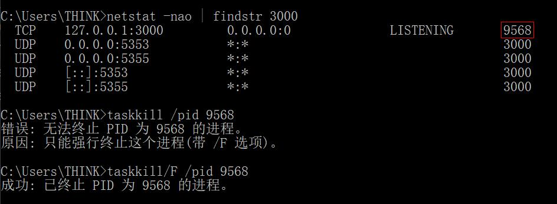

- 简单介绍
  + [Node_js简介](#Node_js简介)
    - [大量的库](#大量的库)
    - [Node_js应用程序的示例](#Node_js应用程序的示例)
    - [Node_js框架和工具](#Node_js框架和工具)
  + [Node_js与浏览器的区别](#Node_js与浏览器的区别)  
  + [报错处理_占用端口号](#报错处理_占用端口号)  
- 入门教程
  + [V8_JavaScript引擎](#V8_JavaScript引擎)
  + [从命令行运行Node_js脚本](#从命令行运行Node_js脚本)
  + [从Node_js程序退出](#从Node_js程序退出)
  + [读取环境变量](#读取环境变量)
  + [使用Node_js的REPL](#使用Node_js的REPL)
  + [从命令行接收参数](#从命令行接收参数)
  + [使用Node_js输出到命令行](#使用Node_js输出到命令行)
    - [使用控制台模块](#使用控制台模块)
    - [计算耗时](#计算耗时)
    - [为输出着色](#为输出着色)
    - [创建进度条](#创建进度条)
  + [从命令行接收输入](#从命令行接收输入)
    - [readline](#readline)
    - [readline-sync](#readline-sync)
  + [使用exports从Node_js文件中导出](#使用exports从Node_js文件中导出)
    - [module_exports](#module_exports)
    - [exports](#exports)
  + [npm包管理器](#npm包管理器)
    - [安装单个软件包](#安装单个软件包)
    - [运行任务](#运行任务)  
  + [使用cnpm](#使用cnpm)   
  + [使用或执行npm安装的软件包](#使用或执行npm安装的软件包)
    - [普通软件包](#普通软件包)
    - [可执行文件](#可执行文件)
  + [package.json指南](#package.json指南)
    - [文件结构](#文件结构)
    - [属性分类](#属性分类)
    - [name](#name)
    - [browserslist](#browserslist)
    - [命令特有的属性](#命令特有的属性)
  + [package-lock.json文件](#package-lock.json文件)
  + [查看npm包安装的版本](#查看npm包安装的版本)
  + [安装npm包的旧版本](#安装npm包的旧版本)
  + [将所有软件包更新到最新版本](#将所有软件包更新到最新版本)
  + [使用npm的语义版本控制](#使用npm的语义版本控制)
  + [卸载npm软件包](#卸载npm软件包)
  + [npm全局或本地的软件包](#npm全局或本地的软件包)
  + [npm依赖与开发依赖](#npm依赖与开发依赖)
  + [包运行器npx](#包运行器npx)
    - [无需安装的命令执行](#无需安装的命令执行)
  + [事件循环](#事件循环)
    - [阻塞事件循环](#阻塞事件循环)
    - [调用堆栈](#调用堆栈)
  + [process_nextTick()](#process_nextTick())
  + [setImmediate()](#setImmediate())
  + [探索JavaScript定时器](#探索JavaScript定时器)
  + [Node中的回调](#Node中的回调)
    - [处理回调中的错误](#处理回调中的错误)
  + [具有Async和Await的现代异步JavaScript](#具有Async和Await的现代异步JavaScript)
    - [代码更容易阅读](#代码更容易阅读)
  + [Node_js事件触发器](#Node_js事件触发器)
    - [事件触发器简单使用](#事件触发器简单使用)
    - [事件触发器传参](#事件触发器传参)
  + [使用Node_js发送HTTP请求](#使用Node_js发送HTTP请求)
    - [执行GET请求](#执行GET请求)
    - [PUT和DELETE](#PUT和DELETE)
  + [使用第三方库发送HTTP请求](#使用第三方库发送HTTP请求)
  + [使用Node_js获取HTTP请求的正文数据](#使用Node_js获取HTTP请求的正文数据)
    - [获取数据_express](#获取数据_express)
    - [获取数据_普通Node_js](#获取数据_普通Node_js)
  + [获取文件描述符](#获取文件描述符)
    - [文件描述符_回调提供](#文件描述符_回调提供)
    - [文件描述符_同步获取](#文件描述符_同步获取)
  + [获取文件属性](#获取文件属性)
    - [文件属性_回调提供](#文件属性_回调提供)
    - [文件属性_回步获取](#文件属性_回步获取)
  + [文件路径](#文件路径)
  + [使用Node_js读取文件](#使用Node_js读取文件)
    - [读取文件_回调提供](#读取文件_回调提供)
    - [读取文件_回步获取](#读取文件_回步获取)
  + [使用Node_js写入文件](#使用Node_js写入文件)
    - [写入文件_异步执行](#写入文件_异步执行)
    - [写入文件_同步执行](#写入文件_同步执行)
    - [写入文件_修改默认行为](#写入文件_修改默认行为)
  + [使用文件夹](#使用文件夹)
    - [检查文件夹是否存在](#检查文件夹是否存在)
    - [创建新的文件夹](#创建新的文件夹)
    - [读取目录的内容](#读取目录的内容)
    - [重命名文件夹_异步](#重命名文件夹_异步)
    - [重命名文件夹_同步](#重命名文件夹_同步)
    - [删除文件夹](#删除文件夹)
      + [删除文件夹_直接使用版](#删除文件夹_直接使用版)
      + [删除文件夹_期约版](#删除文件夹_期约版)
      + [删除文件夹_异步函数版](#删除文件夹_异步函数版)
  + [文件系统模块](#文件系统模块)
  + [操作系统模块](#操作系统模块)
  + [事件模块](#事件模块)
  + [http模块](#http模块)
    - [http模块_属性](#http模块_属性)
    - [http模块_方法](#http模块_方法)
    - [http模块_类](#http模块_类)
      + [http_Agent](#http_Agent)
      + [http_Server](#http_Server)
      + [http_ServerResponse](#http_ServerResponse)
  + [Buffer](#Buffer)
  + [流](#流)
    - [流的优势](#流的优势)
    - [流的示例](#流的示例)
    - [pipe](#pipe)
    - [流驱动的API](#流驱动的API)
    - [不同类型的流](#不同类型的流)
    - [模拟创建流的传递](#模拟创建流的传递)
  + [开发环境与生产环境](#开发环境与生产环境)
    - [临时配置](#临时配置)
  + [Node.js中的错误处理](#Node.js中的错误处理)
    - [创建异常](#创建异常)
    - [错误对象](#错误对象)
    - [处理异常](#处理异常)
    - [捕获未捕获的异常](#捕获未捕获的异常)
    - [Promise的异常](#Promise的异常)
    - [async/await的错误处理](#async/await的错误处理)
  + [在Node_js中打印对象](#在Node_js中打印对象)
    - [打印对象_方法一](#打印对象_方法一)
    - [打印对象_方法二](#打印对象_方法二)
  + [使用TypeScript](#使用TypeScript)
    - [TypeScript_栗子](#TypeScript_栗子)

### Node_js简介    

索引 | 说明  
:-: | :-  
① | 开源与跨平台的 JavaScript 运行时环境
② | 在浏览器外运行 V8 JavaScript 引擎（Google Chrome 的内核）
③ | Node.js 应用程序运行于单个进程中，无需为每个请求创建新的线程  
④ | 其标准库中提供了一组异步的 I/O 原生功能，能防止 JavaScript 代码被阻塞
⑤ | Node.js 中的库通常是使用非阻塞的范式编写  
⑥ | 执行 I/O 操作时，会在响应返回时恢复操作，而不是阻塞线程并浪费 CPU 循环等待
⑦ | 这使 Node.js 可以在一台服务器上处理数千个并发连接，而无需引入管理线程并发的负担  
⑧ | 在高版本中，可以使用新的 ECMAScript 标准，而不用理浏览器  

#### 大量的库  

npm 的结构很简单，其仓库托管了众多可以自由使用的开源库包，有助于 Node.js 生态系统的激增。

#### Node_js应用程序的示例  
> Web服务器  

顺序 | 说明  
:-: | :-  
① | 引入 `http` 模块
② | `http` 的 createServer() 方法会创建新的 HTTP 服务器并返回它
③ | 服务器被设置为监听指定的端口和主机名。当服务器就绪后，回调函数会被调用
④ | 每当接收到新的请求时，request 事件回调会被调用，并提供请求和响应对象
⑤ | 这里设置了响应状态码、响应头
⑥ | 关闭响应，添加内容作为 `end()` 的参数
⑦ | 在命令行 `node 文件名` 启动服务器  

```
const http = require('http')

const hostname = '127.0.0.1'
const port = 3000

const server = http.createServer((req, res) => {
  res.statusCode = 200
  res.setHeader('Content-Type', 'text/plain')
  res.end('你好世界\n')
})

server.listen(port, hostname, () => {
  console.log(`服务器运行在 http://${hostname}:${port}/`)
})
```

#### Node_js框架和工具  

清单 | 描述 
:-: | :-  
Express | 提供了创建 Web 服务器的最简单但功能最强大的方法之一  

#### Node_js常用模块   

模块 | 名称 | 说明 | require | 安装
:-: | :- | :- | :-: | :-:
√ | http | 创建http服务器等 | √ | ×
√ | https | 原生发起请求 | √ | ×
× | axios | 第三方请求库 | √ | √
√ | process | 进程 | × | ×
√ | fs | 文件模块 | √ | ×
√ | path | 计算路径 | √ | ×
× | express | 服务器框架 | √ | √
√ | events | 触发自定义事件 | √ | ×
√ | minimist | 更好处理命令行的键值对参数 | √ | √
√ | readline | 从命令行接收输入 | √ | ×
√ | readline-sync | 从命令行接收输入，支持掩码 | √ | √ 
√ | Inquirer | 从命令行接收输入，功能更强 | √ | √ 
√ | progress | 创建进度条到命令行 | √ | √
√ | cowsay | 玩具，可执行文件 | × | √
× | Buffer | 内存区域 | × | ×

#### Node_js与浏览器的区别  

索引 | 环境 | 说明  
:-: | :- | :-   
① | Node.js | 使用单一语言轻松编程前端和后端
② | Node.js | 没有 document、window 等对象和 Web 平台 API（如Cookie）
② | 浏览器 | 没有模块提供的 API，如文件系统访问功能  
③ | Node.js | 可以控制运行环境，支持新技术
③ | 浏览器 | 发展较慢，用户升级慢，使用旧 JS/ES 版本
④ | 浏览器 | 使用 Babel 将代码转换为与 ES5 兼容的代码
④ | Node.js | 不需要
⑤ | Node.js | 使用 CommonJS 模块系统，即 `require()`
⑤ | 浏览器 | 实现 ES 模块标准，即 `import`

#### 报错处理_占用端口号  

索引 | 环境 | 命令  
:-: | :- | :-   
① | 打开cmd | /
② | 查询哪个程序占用该端口（这里举例3000） | netstat -nao \| findstr 3000
③ | 查看该进程 | tasklist \| findstr `对应PID`
④ | 终止该进程 | taskkill /pid `对应PID`
⑤ | 强杀该进程 | taskkill/F /pid `对应PID`



----

#### V8_JavaScript引擎    

索引 | 说明  
:-: | :-  
① | V8 是为 Google Chrome 提供支持的 JavaScript 引擎的名称。负责处理并执行 JS
② | V8 提供了执行 JavaScript 的运行时环境。 DOM 和其他 Web 平台 API 则由浏览器提供
③ | 使用 C++ 编写，并且不断地被改进
④ | JS 通常被认为是一门解释型的语言，但是现代的 JS 引擎不再只是解释 JS，也会对其进行编译
⑤ | JS 是由 V8 在其内部编译的，使用了**即时（JIT）编译**以加快执行速度

#### 从命令行运行Node_js脚本  

顺序 | 说明  
:-: | :-  
① | 确保[安装](https://nodejs.org/zh-cn/download/)了 node
② | `node 文件路径/文件名.js`

#### 从Node_js程序退出   
> `process` 模块无需引入，自动可用。

索引 | 方式 | 概述 | 说明  
:-: | :-: | :- | :- 
① | 控制台 | / | `ctrl-C`
② | 编程 | 强制终止 | `process.exit()`
② | 编程 | 强制终止 | 异常终止回调、请求、文件访问等
② | 编程 | 强制终止 | 可以传入一个整数，向操作系统发送[退出码](http://nodejs.cn/api/process.html#process_exit_codes)
② | 编程 | 强制终止 | 默认为 0，表示成功
③ | 编程 | 设置退出码 | `process.exitCode = 1`  
③ | 编程 | 设置退出码 | 当进程完成所有处理后，程序会正常地退出，并返回该退出码  
③ | 编程 | 正常终止 | [待学习](http://nodejs.cn/learn/how-to-exit-from-a-nodejs-program)  

#### 读取环境变量  

索引 | 说明  
:-: | :-  
① | 通过 `process.env.NODE_ENV` 可以读写环境变量   
② | 如 "development" 和 "production"
③ | :bug:获取不到默认值？

#### 使用Node_js的REPL  
> REPL 也被称为运行评估打印循环，是一种编程语言环境（主要是控制台窗口），它使用单个表达式作为用户输入，并在执行后将结果返回到控制台。  

索引 | 概述 | 命令行操作    
:-: | :- | :-   
① | 启用该模式 | `node`  
② | 自动补全 | 使用 `tab` 键，自动补全提示内容 
③ | 提示类属性和方法 | `Number.` + `tab`
④ | 提示全局对象 | `global.` + `tab`
⑤ | 打印最后操作结果 | `_`
⑥ | 退出 | `.exit` 或 `ctrl-c` 两次

#### 从命令行接收参数  

参数传递  
```
// 情况一：独立参数
node app.js joe  

// 情况二：键值对形式  
node app.js name=joe
```

获取参数     
> 通过 `process.argv` 这个数组，可以获取所有命令行调用参数。  

数组元素 | 说明  
:-: | :-  
第一个 | `node` 命令的完整路径 
第二个 | 正被执行的文件的完整路径
之后的 | 命令行的调用参数

获取参数二  
> 针对情况二，使用 [minimist](https://www.npmjs.com/package/minimist) 库，能更好的处理参数。  

顺序 | 说明  
:-: | :-  
① | 安装minimist库
② | 这种方法需要在每个参数前加双破折号
③ | 导入，取剩余数组作为参数  

```
npm install minimist -S

node app.js --name=joe

/* app.js */
const args = require('minimist')(process.argv.slice(2))
console.log(args['name']); //joe
```

#### 使用Node_js输出到命令行   

概述 | 说明 | 代码     
:- | :- | :-      
[控制台模块](http://nodejs.cn/api/console.html)的**基础**输出 | 最简单的输出 | `console.log()`
清空控制台显示 | 让当前区域干净 | `console.clear()`
元素计数 | 同时输出该字符串的输出次数，全等则加一 | `console.count()`
计算耗时 | 可以计算并输出[被夹函数](#计算耗时)的执行时间 | `console.time()`、`console.timeEnd()`
stdout | 标准输出 | `console.log()`
stderr | 出现在错误日志 | `console.error`  
[为输出着色](#为输出着色) | 演示输出黄色的底层方法 | `console.log('\x1b[33m%s\x1b[0m', '你好')`
创建进度条 | 需要安装导入 `progress` 库 | [跳转](#创建进度条)  

#### 使用控制台模块  
> 这样会将后面参数改变格式后添加到首参。  
```
console.log('我的%s已经%d岁', '猫', 2)

// 我的猫已经2岁
```

- `%s` 会格式化变量为字符串
- `%d` 会格式化变量为数字
- `%i` 会格式化变量为其整数部分
- `%o` 会格式化变量为对象

#### 计算耗时  

```
const doSomething = () => console.log('测试')
const measureDoingSomething = () => {
  console.time('doSomething()')
  doSomething()
  console.timeEnd('doSomething()')
}
measureDoingSomething()
```

#### 为输出着色  
> **安装**并导入 `Chalk` 库，还能设置其他样式，如粗体、斜体或带下划线。   

```
const chalk = require('chalk')

console.log(chalk.yellow('你好'))
```

#### 创建进度条  
> 创建一个 10 步的进度条，每 100 毫秒完成一步。当进度条结束时，则清除定时器。  

```
const ProgressBar = require('progress')

const bar = new ProgressBar(':bar', { total: 10 })
const timer = setInterval(() => {
  bar.tick()
  if (bar.complete) {
    clearInterval(timer)
  }
}, 100)
```

#### 从命令行接收输入  

名称 | 类型 | 说明 | 安装  
:- | :- | :- | :-
readline | 模块 | 每次一行地从可读流获取输入 | /  
readline | 模块 | 可读流，如 `process.stdin` 流，在 Node.js 程序执行期间该流就是终端输入 | /  
readline-sync | 软件包 | 接口与 `readline` 相似。可将用户输入显示为 `*`，用于密码 | 需要  
Inquirer | 软件包 | 很强大，可以询问多项选择、展示单选按钮、确认等 | [需要](https://github.com/SBoudrias/Inquirer.js)  

#### readline  
> `question()` 方法的首参为问题，用户输入内容并按下回车时，执行回调。  

```
const readline = require('readline').createInterface({
  input: process.stdin,
  output: process.stdout
})

readline.question(`你叫什么名字?`, name => {
  console.log(`你好 ${name}!`)
  readline.close()
})
```

#### readline-sync

```
var readlineSync = require('readline-sync');
 
// 将等待用户输入，再执行后面的代码
var userName = readlineSync.question('May I have your name? ');
console.log('Hi ' + userName + '!');
 
// 用户输入将显示为 *  
var favFood = readlineSync.question('What is your favorite food? ', {
  hideEchoBack: true
});
console.log('Oh, ' + userName + ' loves ' + favFood + '!');
```

#### 使用exports从Node_js文件中导出  
> Node.js 具有内置的模块系统。  
> 
> Node.js 文件可以导入其他 Node.js 文件公开的功能。  
> 
> [module系统](http://nodejs.cn/api/modules.html)有两种导出方式。`module.exports` 公开了它指向的对象，`export` 公开了它指向的对象的属性。  

#### module_exports
> 只导出该对象。  

```
const car = {
  brand: 'Ford'
}

module.exports = car

/* 导入文件 */
const car = require('./car')
```

#### exports

```
const car = {
  brand: 'Ford'
}
exports.car = car

// 或者直接导出
exports.car = {
  brand: 'Ford'
}

/* 导入文件 */
const car = require('./items').car

// 或者通过属性使用  
const items = require('./items')
items.car
```

#### npm包管理器  
> `npm` 是 Node.js 标准的软件包管理器，其一个替代选择是[Yarn](https://classic.yarnpkg.com/en/)。  
> 
> `npm` 可以管理项目依赖的下载，它会从 registry  进行发布/下载包 。  

概述 | 说明 | 命令     
:- | :- | :-      
安装所有依赖 | 根据项目的 `package.json`，（创建） `node_modules` 文件夹并在其中安装项目所需的所有东西 | npm install
安装单个软件包 | 安装特定的软件包 | npm install `<package-name>`
更新所有软件包 | 检查所有软件包是否有满足版本限制的更新版本 | npm update
更新单个软件包 | / | npm update `<package-name>`  
版本控制 | 根据 `package.json` 指定库的显式版本以便整个团队运行相同的版本 | 解决兼容、缺陷  
运行任务 | 在 `package.json` 的 `"script"` 中起长命令的别名 | npm run `<task-name>`

#### 安装单个软件包  
> 可以添加更多的标志。  

标志 | 简写 | 说明 | 解释  
:- | :- | :- | :-   
--save | -S | 安装并添加条目到 `package.json` 文件的 dependencies | 通常是开发的工具（例如测试的库）
--save-dev | -D | 安装并添加条目到 `package.json` 文件的 devDependencies | 仅开发环境需要用到 
-g | | 全局安装 | 通过 `npm root -g` 查看全局目录的位置  
无 | | 本地安装 | 安装在 `./node_modules` 下，并在 `package.json` 的 `dependencies` 属性中添加相应条目

#### 运行任务  

```javascript
/* package.json */
{
  "scripts": {
    "start-dev": "node lib/server-development",
    "start": "node lib/server-production"
  },
}

// 运行 Webpack
{
  "scripts": {
    "watch": "webpack --watch --progress --colors --config webpack.conf.js",
    "dev": "webpack --progress --colors --config webpack.conf.js",
    "prod": "NODE_ENV=production webpack -p --config webpack.conf.js",
  },
}
```

#### 使用cnpm  
> 使用 npm 时，如安装 `vue-cli` 或项目依赖，可能会遇到莫名失败的问题，使用 [cnpm](https://github.com/SpringLoach/Vue/blob/main/learning/section2.md#淘宝npm镜像) 可以解决。  

#### 使用或执行npm安装的软件包  

#### 普通软件包  
> 软件包会安装到本地的 `node_modules` 文件夹中。  

```
/* 命令行 */
npm install **  

/* 导入到需要使用它的文件 */
const _ = require('**')
```

#### 可执行文件  
> 可执行文件会放到 `node_modules/.bin/` 文件夹下。  

```
/* 命令行 */
npm install cowsay

/* 执行该文件的旧方案 */
.\node_modules\.bin\cowsay 

/* 新版本支持 */
npx cowsay hey！
```

#### package.json指南  
> `package.json` 文件是项目的清单。它可以做很多完全互不相关的事情。例如，它是用于工具的配置中心。它也是 npm 和 yarn 存储所有已安装软件包的名称和版本的地方。

#### 文件结构  
> 对于应用程序，`package.json` 文件中的内容没有固定的要求，空的 `{}` 也可以。

```javascript
/* 该示例是从 Vue.js 应用程序示例中提取的 */
{
  "name": "test-project",
  "version": "1.0.0",
  "description": "A Vue.js project",
  "main": "src/main.js",
  "private": true,
  "scripts": {
    "dev": "webpack-dev-server --inline --progress --config build/webpack.dev.conf.js"
  },
  "dependencies": {
    "vue": "^2.5.2"
  },
  "devDependencies": {
    "autoprefixer": "^7.1.2"
  },
  "engines": {
    "node": ">= 6.0.0",
    "npm": ">= 3.0.0"
  },
  "browserslist": ["> 1%", "last 2 versions", "not ie <= 8"]
}
```

属性 | 这些属性可被 npm 或其他工具使用  
:- | :-
version | 指定软件包的当前版本
name | 设置了应用程序/软件包的名称
description | 是应用程序/软件包的简短描述
main | 设置了应用程序的入口点
private | 设置为 true 可以防止应用程序/软件包被意外地发布到 `npm`
scripts | 定义了一组可以运行的 node 脚本
dependencies | 设置了作为依赖安装的 `npm` 软件包的列表
devDependencies | 设置了作为开发依赖安装的 npm 软件包的列表
engines | 设置此软件包/应用程序能在哪个版本的 Node.js 上运行
browserslist | 告知要支持哪些浏览器（及其版本）

#### 属性分类  
> 这里介绍的大多数属性仅可用于[npm](https://www.npmjs.com/)。  

属性 | 说明 | 示例  
:- | :- | :-  
name | 设置软件包的名称 | `"name": "nodejs_cn"`
author | 列出软件包的作者名称、邮箱、地址 | `"author": "NodeJS中文网 <mail@nodejs.cn> (http://nodejs.cn)"` 、
contributors | 列出贡献者 | `"contributors": ["NodeJS中文网 <mail@nodejs.cn> (http://nodejs.cn))"]` 、
bugs | 链接到软件包的问题跟踪器，如 GitHub 的 issues 页面 | `"bugs": "https://github.com/nodejscn/node-api-cn/issues"`
homepage | 设置软件包的主页 | `"homepage": "http://nodejs.cn"`
version | 指定软件包的当前版本 | `"version": "1.0.0"`
license | 指定软件包的许可证 | `"license": "MIT"`
keywords | 有助于浏览相似软件包或浏览[npm](https://www.npmjs.com/)时找到该软件包 | `"keywords": ["machine learning", "ai"]`
description | 对软件包的简短描述，发布到[npm](https://www.npmjs.com/)时让人知道它的功能 | `"description": "NodeJS中文网入门教程"`
repository | 指定此程序包仓库所在的位置 | `"repository": "github:nodejscn/node-api-cn",` 、
main | 设置软件包的入口点 | `"main": "src/main.js"`  
private | 防止应用程序/软件包被意外地发布到 `npm` | "private": true
scripts | 定义一组可以运行的 node 脚本，简写 | 调用：`npm run XX`
dependencies | 设置作为依赖安装的 `npm` 软件包的列表 | `"dependencies": {"vue": "^2.5.2"}`
devDependencies | 设置作为**开发依赖**安装的 `npm` 软件包的列表 | `"dependencies": {"autoprefixer": "^7.1.2"}`
engines | 设置此软件包/程序要运行的 Node.js 或其他命令的版本 | `"engines": {"node": ">= 6.0.0", "npm": ">= 3.0.0"}`
browserslist | 告知要支持哪些浏览器（及其版本） | [跳转](#browserslist)  

#### name  

索引 | 说明  
:- | :- 
① | 名称必须少于 214 个字符，只能包含小写字母、`-` 或 `_`
② | 当软件包在 `npm` 上发布时，它会基于此属性获得自己的 URL

#### browserslist  
> Babel、Autoprefixer 和其他工具会用到它，以将所需的 polyfill 和 fallback 添加到目标浏览器。  

```
"browserslist": [
  "> 1%",
  "last 2 versions",
  "not ie <= 8"
]
```
> 此配置意味着需要支持使用率[超过](https://caniuse.com/) 1％的所有浏览器的最新的 2 个主版本，但不含 IE8 及更低的版本。  

#### 命令特有的属性  

- `package.json` 文件还可以承载命令特有的配置，例如 Babel、ESLint 等。  

- 每个都有特有的属性，例如 `eslintConfig`、`babel` 等。  

#### package-lock.json文件  
> 跟踪被安装的每个软件包的确切版本，以便产品可以以相同的方式被 100％ 复制。  
> 
> 该文件需要被提交到 Git 仓库，以便被其他人获取。  

命令 | 说明  
:- | :- 
npm install | 会使用该文件中的确切版本，初始化项目  
npm update | 该文件中的依赖的版本会被更新  

字段 | 说明  
:- | :-   
require | 该软件包依赖的其它软件包
version | 确切版本  
resolved | 指向软件包位置
integrity | 用于校验软件包的字符串  

#### 查看npm包安装的版本  

命令 | 说明 | 补充
:- | :- | :-     
npm list | 查看所有已安装的 npm 软件包及其依赖包的版本 | 也可以视觉扫描 `package-lock.json`
npm list -g | 适用于全局安装的软件包 | /
npm list --depth=0 | 仅获取顶层的软件包 | 基本上就是告诉 npm 要安装并在 `package.json` 中列出的软件包  
npm list `<package-name>` | 获取特定软件包的版本 | 也适用于安装的软件包的依赖
npm view `<package-name>` version | 查看软件包在 npm 仓库上最新的可用版本 | /

#### 安装npm包的旧版本  

命令 | 说明 
:- | :-   
npm install `<package>`@`<version>` | 安装指定版本  
npm view `<package>` versions | 列出软件包所有的以前的版本

#### 将所有软件包更新到最新版本  

1. 使用 `npm install <packagename>` 安装软件包时，该软件包最新的可用版本会被下载并放入 `node_modules` 文件夹中，并且还会将相应的条目添加到当前文件夹中存在的 `package.json` 和 `package-lock.json` 文件中。  

2. 如果有新的次版本或补丁版本，并且输入了 `npm update`，则已安装的版本会被更新，并且 `package-lock.json` 文件会被新版本填充。`package.json` 则保持不变。

3. 使用 `npm outdated` 可以查看软件包的新版本。  

4. 要想跟新主版本，注意可能引入重大改变。  

顺序 | 步骤 | 命令 
:- | :- | :-
① | 局地安装该软件包  | npm install -g npm-check-updates  
② | 升级 `package.json` 中两种依赖的所有版本 | ncu -u
③ | 运行跟新 | npm update  
④ | 补充：若只下载了项目，还没安装包 | npm install

#### 使用npm的语义版本控制  
> 所有的版本都有 3 个数字：x.y.z。  

数字 | 意义 | 升级说明 
:-: | :- | :-
① | 主版本  | 进行不兼容的 API 更改
② | 次版本 | 以向后兼容的方式添加功能
③ | 补丁版本 | 进行向后兼容的缺陷修复  

更新规则  
> `npm` 设置了一些规则，可用于在 `package.json` 文件中选择要将软件包更新到的版本。  

符号 | 说明 | 栗子  
:- | :- | :-  
^ | 执行不更改最左边非零数字的更新 | ^0.13.0 ✖️→ 0.14.0
~ | 更新到补丁版本 | ^0.13.0 ✖️→ 0.14.0
\> | 接受高于指定版本的任何版本 |
\>= | 略 |
< | 略 | 
<= | 略 | 
= | 接受确切的版本 | 
\- | 接受一定范围的版本 | 2.1.0 \- 2.6.2
\|\| | 组合集合 | < 2.1 \|\| \> 2.6
无 | 仅接受指定的特定版本 | 1.2.1
latest | 使用可用的最新版本 | 

#### 卸载npm软件包   

```
/* 卸载局部安装的软件包时，在项目文件下运行 */
npm uninstall <package-name>
```

标志 | 简写 | 说明 | 补充  
:- | :- | :- | :-   
--save | -S | | 从 `package.json` 移除
--save-dev | -D | 开发依赖项 | 从 `package.json` 移除
--global | -g | 全局卸载 | 可在任意位置运行  

#### npm全局或本地的软件包  
> 软件包的不同版本可能会破坏与其他依赖项的兼容性等，故需要本地安装。  

区别 | 本地软件包 | 全局软件包
:- | :- | :-
安装目录 | 运行安装命令目录下的 `node_modules` | 由系统设置  
用途 | 代码中引入 `require('package-name')` | 提供了命令行命令、不同项目间可复用

查看全局软件包
```
npm list -g --depth 0
```

流行的全局软件包示例  
> npm、vue-cli、webpack、sass

#### npm依赖与开发依赖  

区别 | 依赖 | 开发依赖 
:- | :- | :-
标志 | npm5之前，需手动指定 `-S` | `-D`
归属列表 | dependencies | devDependencies
用途 | | 仅用于开发的程序包，如测试的软件包、webpack 或 Babel

生产环境安装依赖  
> 当文件夹包含 `package.json` 文件时，若直接使用 `npm install` 时，会一并安装开发依赖。  

```
npm install --production
```

#### 包运行器npx  
> `npx` 可以运行使用 Node.js 构建并通过 npm 仓库发布的代码。  

#### 无需安装的命令执行    
> 不需要安装任何东西。  
> 
>可以使用 @version 语法运行同一命令的不同版本。  

```
npx cowsay "你好"

npx @vue/cli create my-vue-app
```

#### 事件循环  

#### 阻塞事件循环

任何花费太长时间才能将控制权返回给事件循环的 JavaScript 代码，都会**阻塞**页面中任何 JavaScript 代码的执行，甚至阻塞 UI 线程，并且用户无法单击浏览、滚动页面等。

#### 调用堆栈

当执行时，它会将找到的所有函数调用添加到调用堆栈中，并按顺序执行每个函数。

报错时，浏览器在调用堆栈中查找函数名称，以告知你是哪个函数发起了当前的调用。  

#### process_nextTick()  
> 微任务，类似于 `Promise.then`。  

```
process.nextTick(() => {
  //做些事情
})
```

#### setImmediate()  
> 宏任务，相当于 `setTimeout(() => {},, 0)`，在事件循环的下一个迭代中运行。  

#### 探索JavaScript定时器  

`setInterval` 所执行的函数花费的时间可能会超过等待时间，可以通过嵌套的 `setTimeout` 避免这个问题。

无论使用哪一种，一般都需要在内部提供基线条件。  

#### Node中的回调  
> 回调是一个简单的函数，会作为值被传给另一个函数，并且仅在事件发生时才被执行。
> 
> 比如交互事件、定时器，XHR请求，都会用到回调。  

#### 处理回调中的错误  
> Node.js 所采用的方式：任何回调函数中的第一个参数为错误对象。   

情况 | 首参
:-: | :-
发生错误 | 包含对该错误的描述
没有错误 | null

```
fs.readFile('/文件.json', (err, data) => {
  if (err !== null) {
    //处理错误
    console.log(err)
    return
  }

  //没有错误，则处理数据。
  console.log(data)
})
```

#### 具有Async和Await的现代异步JavaScript  
> 建立在 promise 之上，使代码看起来像是同步的。  

索引 | 特征
:-: | :-
① | `await` 后通常跟上期约
① | 然后调用的代码就会停止直到期约被落定
② | 异步函数内部 `return` 的值会被包装成期约

#### 代码更容易阅读  

```
const getFirstUserData = () => {
  return fetch('/users.json') // 获取用户列表
    .then(response => response.json()) // 解析 JSON
    .then(users => users[0]) // 选择第一个用户
    .then(user => fetch(`/users/${user.name}`)) // 获取用户数据
    .then(userResponse => userResponse.json()) // 解析 JSON
}

getFirstUserData()
```

```
const getFirstUserData = async () => {
  const response = await fetch('/users.json') // 获取用户列表
  const users = await response.json() // 解析 JSON
  const user = users[0] // 选择第一个用户
  const userResponse = await fetch(`/users/${user.name}`) // 获取用户数据
  const userData = await userResponse.json() // 解析 JSON
  return userData
}

getFirstUserData()
```

#### Node_js事件触发器  
> 通过[events](http://nodejs.cn/api/events.html)模块实现，可以控制事件的触发并添加处理程序。  

对象方法 | 说明  
:- | :-
emit | 触发事件
on | 添加监听器
once | 添加单次监听器
removeListener / off | 从事件中移除事件监听器  
removeAllListeners | 移除事件的所有监听器  

#### 事件触发器简单使用
```
/* 初始化 */
const EventEmitter = require('events')
const eventEmitter = new EventEmitter()

eventEmitter.on('start', () => {
  console.log('3秒后开始')
})

setTimeout(() => {
  eventEmitter.emit('start')
}, 3000)
```

#### 事件触发器传参
```
eventEmitter.on('start', (start, end) => {
  console.log(`从 ${start} 到 ${end}`)
})

eventEmitter.emit('start', 1, 100)
```

#### 使用Node_js发送HTTP请求

#### 执行GET请求  

```
const https = require('https')
const options = {
  hostname: 'nodejs.cn',
  port: 443,
  path: '/todos',
  method: 'GET'
}

const req = https.request(options, res => {
  console.log(`状态码: ${res.statusCode}`)

  res.on('data', d => {
    process.stdout.write(d)
  })
})

req.on('error', error => {
  console.error(error)
})

req.end()
```

#### PUT和DELETE  
> PUT 和 DELETE 请求使用相同的 POST 请求格式，只需更改 `options.method` 的值即可。  

#### 使用第三方库发送HTTP请求  
> 使用 Node.js 执行 HTTP 请求的最简单的方式是使用 Axios 库。  
> 
> 需要安装并导入[axios](https://github.com/axios/axios)库。  

```
const axios = require('axios')

axios
  .post('http://nodejs.cn/todos', {
    todo: '做点事情'
  })
  .then(res => {
    console.log(`状态码: ${res.statusCode}`)
    console.log(res)
  })
  .catch(error => {
    console.error(error)
  })
```

#### 使用Node_js获取HTTP请求的正文数据    
> 怀疑是服务器端不能给自己发请求，测试失败。  

请求正文  
```
const axios = require('axios')

axios.post('http://nodejs.cn/todos', {
  todo: '做点事情'
})
```

#### 获取数据_express
> Express 抽象了很多工作。  

```
const express = require('express')
const app = express()

app.use(
  express.urlencoded({
    extended: true
  })
)

app.use(express.json())

app.post('/todos', (req, res) => {
  console.log(req.body.todo)    // 获取数据
})
```

#### 获取数据_普通Node_js

顺序 | 说明  
:-: | :-
① | 使用 `http.createServer()` 初始HTTP服务器时
① | 服务器会在获得所有 HTTP **请求头**时调用回调
② | 通过监听流的 `data` 事件来获取数据，合并数据块 
③ | 在数据结束时调用一次流的 `end` 事件，获取数据

```
/* 假设期望接收到字符串 */
const server = http.createServer((req, res) => {
  let data = '';
  req.on('data', chunk => {
    data += chunk;
  })
  req.on('end', () => {
    JSON.parse(data).todo // '做点事情'
  })
})
```

#### 获取文件描述符  
> 在与位于文件系统中的文件进行交互之前，需要先获取文件的描述符。  

#### 文件描述符_回调提供  
> 可以通过 `fs` 模块提供的 `open()` 方法打开文件后获得。  

```
const fs = require('fs')

fs.open('/Users/joe/test.txt', 'r', (err, fd) => {
  //fd 是文件描述符。
})
```

第二参 | 打开文件用于 | 将流定位到文件的 | 如果文件不存在则创建文件   
:-: | :-: | :-: | :-:
`r` | 读取 | / | 
`r+` | 读写 | / | 
`w+` | 读写 | 开头 | √
`a` | 写入 | 末尾 | √
`a+` | 读写 | 末尾 | √

#### 文件描述符_同步获取   
> 使用 `fs.openSync` 方法打开文件，其返回值为文件描述符。  

```
const fs = require('fs')

try {
  const fd = fs.openSync('/Users/joe/test.txt', 'r')
} catch (err) {
  console.error(err)
}
```

#### 获取文件属性  

#### 文件属性_回调提供   

```
const fs = require('fs')
fs.stat('/Users/joe/test.txt', (err, stats) => {
  if (err) {
    console.error(err)
    return
  }
  //可以访问 `stats` 中的文件属性
})
```

#### 文件属性_回步获取  

```
const fs = require('fs')
try {
  const stats = fs.statSync('/Users/joe/test.txt')
} catch (err) {
  console.error(err)
}
```

属性信息 | 说明
:- | :-
stats.isFile() | 判断文件是否目录
stats.isDirectory() | 判断文件是否文件
stats.isSymbolicLink() | 判断文件是否符号链接
stats.size | 获取文件的大小（字节）  


#### 文件路径  
> 不会检查路径是否存在。 其只是根据获得的信息来计算路径。

1. 需要引入 `path` 模块  
```
const path = require('path')
```

2. 从路径中获取信息

方法 | 说明
:- | :-
dirname() | 获取文件的父文件夹
basename() | 获取文件名部分
extname() | 获取文件的扩展名
join() | 将两个以上片段连接为路径
resolve() | 获得相对路径的绝对路径计算
normalize() | 包含 `.`、`..`、`//`时，计算实际路径   
isAbsolute() | 判断是否为绝对路径
parse() | 将路径解析为片段
relative() | 返回从首路径参数到二路径参数的相对路径

parse() | 返回对象属性
:- | :-
root | 根路径
dir | 从根路径开始的文件夹路径
base | 文件名 \+ 扩展名
name | 文件名
ext | 文件扩展名

```
const notes = '/users/joe/notes.txt'

path.dirname(notes) // /users/joe
path.basename(notes) // notes.txt
path.extname(notes) // .txt

/* basename的第二个参数如果匹配尾端，会消除尾端 */
path.basename(notes, path.extname(notes)) //notes

path.parse(notes)  // 包含根路径、文件名等信息的对象
```

3. 使用路径  

说明 | 栗子 | 返回值
:- | :- | :-
连接片段 | path.join('/', 'users', 'joe', 'notes.txt') | '/users/joe/notes.txt'
普通计算绝对路径 | path.resolve('any.txt') | 'G:\前端\第三方插件\node\any.txt'
拼接计算绝对路径 | path.resolve('father', 'any.txt') | 'G:\前端\第三方插件\node\father\any.txt'
首参斜杠头，表绝对 | path.resolve('/father', 'any.txt') | 'G:\father\any.txt'
计算实际路径 | path.normalize('/users/joe/..//test.txt') | 'G:\users\test.txt'
判断绝对路径 | path.isAbsolute('/test/something') | true
返回基于相对路径 | path.relative('/Users', '/Users/a.txt') | 'a.txt'

#### 使用Node_js读取文件  
> 以下方法都会在返回数据之前将文件的全部内容读取到内存中。
> 
> 这意味着大文件会对内存的消耗和程序执行的速度产生重大的影响。
> 
> 在这种情况下，更好的选择是使用流来读取文件的内容。

#### 读取文件_回调提供  
> 参数分别为文件路径、编码方式、回调。  

```
const fs = require('fs')

fs.readFile('/Users/joe/test.txt', 'utf8' , (err, data) => {
  if (err) {
    console.error(err)
    return
  }
  console.log(data)
})
```

#### 读取文件_回步获取

```
const fs = require('fs')

try {
  const data = fs.readFileSync('/Users/joe/test.txt', 'utf8')
  console.log(data)
} catch (err) {
  console.error(err)
}
```

#### 使用Node_js写入文件  

方法 | 说明 | 版本
:- | :- | :-:
fs.writeFile() | 将内容写入文件 | 同步
fs.writeFileSync() | 将内容写入文件 | 异步
fs.appendFile() | 将内容追加到文件末尾 | 同步
fs.appendFileSync() | 将内容追加到文件末尾 | 异步

#### 写入文件_异步执行 
```
const fs = require('fs')

const content = '一些内容'

fs.writeFile('/Users/joe/test.txt', content, err => {
  if (err) {
    console.error(err)
    return
  }
  //文件写入成功。
})
```

#### 写入文件_同步执行 
```
const fs = require('fs')

const content = '一些内容'

try {
  const data = fs.writeFileSync('/Users/joe/test.txt', content)
  //文件写入成功。
} catch (err) {
  console.error(err)
}
```

#### 写入文件_修改默认行为  
> 默认情况下，如果文件已经存在，此 API 会替换文件的内容。  
> 
> 添加[flag](http://nodejs.cn/api/fs.html#fs_file_system_flags)配置到第三个参数的位置可以修改默认行为。   

```
fs.writeFile('/Users/joe/test.txt', content, { flag: 'a+' }, err => {})
```

标志 | 打开文件用于 | 将流定位到文件的 | 如果文件不存在则创建文件   
:-: | :-: | :-: | :-:
`r+` | 读写 | / | 
`w+` | 读写 | 开头 | √
`a` | 写入 | 末尾 | √
`a+` | 读写 | 末尾 | √

#### 使用文件夹  

方法 | 说明 | 版本
:- | :- | :-:
fs.access() | 检查文件夹是否存在及具有访问权限 | 异步
fs.mkdir() | 创建新的文件夹 | 异步
fs.mkdirSync() | 创建新的文件夹 | 同步
fs.readdir() | 读取目录的内容 | 异步
fs.readdirSync() | 读取目录的内容 | 同步
fs.rename() | 重命名文件夹 | 异步
fs.renameSync() | 重命名文件夹 | 同步
fs.rmdir() | 删除空文件夹 | 异步
fs.rmdirSync() | 删除空文件夹 | 同步
fs.remove() | `fs-extra` 模块 | 异步

#### 检查文件夹[是否](http://nodejs.cn/api/fs.html#fs_fs_access_path_mode_callback)存在  
> 不应该在读写文件前用该方法检查文件的可访问性，在此之间其它进程可能修改文件。  

```
const fs = require('fs')

const file = 'node_modules';

// 检查当前目录中是否存在该文件。
fs.access(file, fs.constants.F_OK, (err) => {
  console.log(`${file} ${err ? 'does not exist' : 'exists'}`);
});
```

#### 创建新的文件夹  

```
const fs = require('fs')

const folderName = '/Users/joe/test'

try {
  if (!fs.existsSync(folderName)) {
    fs.mkdirSync(folderName)
  }
} catch (err) {
  console.error(err)
}
```

#### 读取目录的内容  
> 将返回全部的文件和子文件夹名字的字符串组成的数组。  

获取相对路径
```
const fs = require('fs')

const folderPath = './apple'

fs.readdirSync(folderPath)
```

获取完整的路径
> 会在路径前加上 `folderPath` 变量。
```
const path = require('path')

fs.readdirSync(folderPath).map(fileName => {
  return path.join(folderPath, fileName)
})
```

过滤结果来排除文件夹  
> 注意 `fs.lstatSync` 需要完整的路径作为参数。  
```
const isFile = fileName => {
  return fs.lstatSync(fileName).isFile()
}

fs.readdirSync(folderPath).map(fileName => {
  return path.join(folderPath, fileName)
})
.filter(isFile)
```

#### 重命名文件夹_异步
> 首参为当前路径，第二参为新的路径。  

```
const fs = require('fs')

fs.rename('/Users/joe', '/Users/roger', err => {
  if (err) {
    console.error(err)
    return
  }
  //完成
})
```

#### 重命名文件夹_同步  

```
const fs = require('fs')

try {
  fs.renameSync('/Users/joe', '/Users/roger')
} catch (err) {
  console.error(err)
}
```

#### 删除文件夹  
> 删除包含内容的文件夹会比较复杂，最好安装使用 `fs-extra` [模块](https://www.npmjs.com/package/fs-extra)，是 fs 模块的直接替代品。  

#### 删除文件夹_直接使用版

```
const fs = require('fs-extra')

const folder = '/Users/joe'

fs.remove(folder, err => {
  console.error(err)
})
```

#### 删除文件夹_期约版  

```
fs.remove(folder)
  .then(() => {
    //完成
  })
  .catch(err => {
    console.error(err)
  })
```

#### 删除文件夹_异步函数版  

```
async function removeFolder(folder) {
  try {
    await fs.remove(folder)
    //完成
  } catch (err) {
    console.error(err)
  }
}

const folder = '/Users/joe'
removeFolder(folder)
```

#### 文件系统模块  
> `fs` [模块](http://nodejs.cn/learn/the-nodejs-fs-module)的方法在默认情况下都是异步的，通过添加尾缀 `Sync` 可以同步工作，脚本的执行会阻塞。  

#### 操作系统模块   
> 该模块提供了许多函数，可用于从底层的操作系统和程序运行所在的计算机上检索信息并与其进行交互。  

属性 | 返回值 | 解释/栗子
:- | :- | :- 
os.EOL | 行定界符序列 | 在 Linux 和 macOS 上为 `\n`，在 Windows 上为 `\r\n`
os.constants.signals | 告知所有与处理过程信号相关的常量 | 
os.constants.errno | 设置用于错误报告的[常量](http://nodejs.cn/api/os.html#os_signal_constants) | 
os.arch() | 标识底层架构的字符串 | `arm`、`x64`、`arm64`
os.cpus() | 系统上可用的 CPU 的信息 | 
os.endianness() | 判断使用大端序还是小端序编译 Node.js | `BE`、`LE`
os.freemem() | 代表系统中可用内存的字节数 |
os.homedir() | 到当前用户的主目录的路径 | 
os.hostname() | 主机名 |
os.loadavg() | 操作系统对平均负载的计算 | 仅在 Linux 和 macOS 上有意义
os.networkInterfaces() | 系统上可用的网络接口的详细信息 |
os.platform() | Node.js 编译的平台 |
os.release() | 标识操作系统版本号的字符串 |
os.tmpdir() | 指定的临时文件夹的路径 |
os.totalmem() | 表示系统中可用的总内存的字节数 |
os.type() | 标识操作系统 | `Linux`、`Darwin`、`Windows_NT`
os.uptime() | 自上次重新启动以来计算机持续运行的秒数 |
os.userInfo() | 包含 username、uid、gid、shell 和 homedir |

#### 事件模块   

实例方法 | 说明  
:- | :- 
on() | 添加监听器
addListener() | 同上
off() | 移除某事件特定的监听器
removeListener() | 同上
once() | 添加监听器，仅调用一次
prependListener() | 添加监听器，且会被首个调用
prependOnceListener() | 添加监听器，且会被首个调用，仅调用一次
removeAllListeners('start') | 移除某事件所有的监听器
emit() | 触发事件，可传参。按照在事件上的注册顺序同步地调用监听器
eventNames() | 返回对象上注册的事件名的字符串数组
getMaxListeners() | 返回添加到对象的监听器的最大数量，默认10
setMaxListeners() | 添加到对象的监听器的最大数量
listenerCount('start') | 返回某事件所注册监听器的计数
listeners('start') | 返回某事件所注册监听器的数组

```
const EventEmitter = require('events')
const eventEmitter = new EventEmitter()

eventEmitter.on('start', () => {
  console.log('开始')
})

console.log(eventEmitter.listenerCount('start'));  // 1
```

#### http模块  
> 该模块提供了一些属性、方法、以及类。  

```
const http = require('http')
```

#### http模块_属性  

属性 | 说明
:- | :- 
http.METHODS | 返回所有支持的HTTP方法
http.STATUS_CODES | 返回所有的HTTP状态代码及其描述
http.globalAgent | `http.Agent` 类的实例对象，为 Agent 对象的全局实例

#### http模块_方法  

方法 | 说明
:- | :- 
http.createServer() | 创建HTTP服务器并返回
http.[request](#使用Node_js发送HTTP请求)() | 发送HTTP请求到服务器
http.get() | 同上，发送方法为GET，并自动地调用 `req.end()`  

#### http模块_类  

类 | 说明  
:- | :- 
http.Agent | Node.js 会创建该类的全局实例，以管理 HTTP 客户端连接的持久性和复用  
http.ClientRequest | 当调用 `http.request()`、`http.get()` 时创建该对象
http.Server | 即服务器实例
http.ServerResponse | 即创建服务器实例提供回调的第二个参数，通常用作 `res`
http.IncomingMessage | 服务器实例监听`request`事件、使用 `http.ClientRequest` 监听`response`事件时作参创建，它可以用来访问响应  

#### http_Agent

它创建的全局实例会确保对服务器的每个请求进行排队并且单个 socket 被复用，还维护一个 socket 池。 

#### http_Server  

实例方法 | 说明  
:- | :- 
close() | 停止服务器不再接受新的连接  
listen() | 启动 HTTP 服务器并监听连接

#### http_ServerResponse  
> 创建服务器实例的回调会添加到 `request` 事件，在该回调内部需要调用 `res.end()` 关闭响应。  
> 
> 当消息完成时则服务器可以将其发送给客户端。 必须在每个响应上调用它。  

方法 | 与HTTP消息头进行交互  
:- | :- 
getHeaderNames() | 获取已设置的 HTTP 消息头名称的列表
getHeaders() | 获取已设置的 HTTP 消息头的副本
setHeader('headername', value) | 设置 HTTP 消息头的值
getHeader('headername') | 获取已设置的 HTTP 消息头
removeHeader('headername') | 删除已设置的 HTTP 消息头
hasHeader('headername') | 如果响应已设置该消息头，则返回 true
headersSent() | 如果消息头已被发送给客户端，则返回 true
> 在处理消息头之后，可以通过调用 `response.writeHead()`（该方法接受 statusCode 作为第一个参数，可选的状态消息和消息头对象）将它们发送给客户端。

#### Buffer  
> 表示在 V8 JavaScript 引擎外部分配的固定大小的内存块（无法调整大小）。
> 
> Buffer 被引入用以帮助开发者处理二进制数据.
> 
> 当流处理器接收数据的速度快于其消化的速度时，如看视频时，红线超过了观看点：即下载数据的速度比查看数据的速度快，且浏览器会对数据进行缓冲。  

> buf 为字节数组实例。  

方法 | 说明 | 补充 
:- | :- | :- 
Buffer.from('hey') | 通过内容初始化 buffer | 
Buffer.alloc(1024) | 通过大小初始化 buffer | 以字节为单位，会用零初始化
Buffer.allocUnsafe(1024) | 通过大小初始化 buffer | 快，但分配的内存片段可能包含可能**敏感的旧数据**  
buf\[N\] | 访问数组元素 | 返回字符的 Unicode 
buf.toString(buf) | 打印全部内容 | 对于 `Buffer.allocUnsafe`，访问的可能不是空buffer
buf.length | 获取实例长度 | 
for (const item of buf) {} | 迭代实例内容 | 
buf.write('new') | 更改实例内容 | 
buf\[1\] = 111  | 更改实例内容 | 
buf.copy(copybuf) | 复制实例 | 默认复制整个实例  
buf.slice() | 截取局部buffer | 源buffer改变时，影响局部buffer，二参可省

**buf.copy()**   

参数 | 说明 
:-: | :-
① | 拷贝buffer，必填
② | 拷贝buffer的 \[
③ | 源buffer的 \[
④ | 源buffer的 )

```
/* buf.copy()  */
const buf = Buffer.from('Hey!')
let bufcopy = Buffer.alloc(2) // 分配 2 个字节。
buf.copy(bufcopy, 0, 0, 2)  
bufcopy.toString() //'He'

/* buf.slice() */
```

**buf.slice()**   

参数 | 说明 
:-: | :-
① | \[
② | )

#### 流  
> 是一种以高效的方式处理读/写文件、网络通信、或任何类型的端到端的信息交换。
> 
> 使用流，无需等到文件从头到尾读入内存，可以逐个片段地读取并处理。  
>
> Node.js 的[stream](http://nodejs.cn/api/stream.html)模块提供了构建所有流 API 的基础。  

#### 流的优势  

优势 | 说明  
:-: | :-
内存效率 | 无需加载大量的数据到内存中即可进行处理
时间效率 | 当获得数据之后即可立即开始处理数据，这样所需的时间更少，而不必等到整个数据有效负载可用才开始

#### 流的示例  
> 从磁盘读取文件，传统方法会读取文件的**全部内容**，并在完成时执行回调，将文件的内容给HTTP客户端。  

```
const http = require('http')
const fs = require('fs')

const server = http.createServer(function(req, res) {
  fs.readFile(__dirname + '/data.txt', (err, data) => {
    res.end(data)
  })
})
server.listen(3000)
```

> 当要发送的数据块已获得时就立即开始将其流式传输到HTTP客户端，而不是等待直到文件被完全读取。  
```
const http = require('http')
const fs = require('fs')

const server = http.createServer((req, res) => {
  const stream = fs.createReadStream(__dirname + '/data.txt')
  stream.pipe(res)
})
server.listen(3000)
```

#### pipe  
> 获取来源流，并将其通过管道传输到目标流。推测会记录传输进度，从而可以将来源流不断拓展。  
> 
> 在上例中，文件流通过管道传输到 HTTP 响应。

```
来源流.pipe(目标流)
```

```
/* 可以链接多个 pipe() 调用 */
src.pipe(dest1).pipe(dest2)

/* 等价于 */
src.pipe(dest1)
dest1.pipe(dest2)
```

#### 流驱动的API  
> 许多 Node.js 核心模块提供了原生的流处理功能。  

方法 | 说明
:- | :-
process.stdin | 返回连接到标准输入的流
process.stdout | 返回连接到标准输出的流
process.stderr | 返回连接到标准错误的流
fs.createReadStream() | 创建文件的**可读流**
fs.createWritStream() | 创建到文件的**可写流**
net.connect() 启动基于流的连接
http.request() | 返回 http.ClientRequest 类的实例，该实例是**可写流**
zlib.createGzip() | 使用 gzip（压缩算法）将数据压缩到流中
zlib.createGunzip() | 解压缩 gzip 流
zlib.createDeflate() | 使用 deflate（压缩算法）将数据压缩到流中
zlib.createInflate() | 解压缩 deflate 流

#### 不同类型的流  

类型 | 名称 | 说明 | 补充
:- | :- | :- | :-
Readable | 可读流 | 可以通过管道读取、但不能通过管道写入的流 | 发送端，接收数据以发送
Writable | 可写流 | 可以通过管道写入、但不能通过管道读取的流 | 接收端
Duplex | 双工流 | 可以通过管道写入和读取的流 | 可读流&可写流
Transform | 转换流 | 类似于双工流 | 但其输出是其输入的转换的转换流  
> 当推送数据到可读流中时，会对其进行缓冲，直到使用者开始读取数据为止。  

#### 模拟创建流的传递  
> 包括创建可读流、可写流、用可读流读取数据、发送数据到可写流、关闭可写流。  

```
const Stream = require('stream')

/* 创建可读流 */
const readableStream = new Stream.Readable({
  read() {}
})

/* 创建可写流 */
const writableStream = new Stream.Writable()

writableStream._write = (chunk, encoding, next) => {
  console.log(chunk.toString())
  next()
}

// 开启将可读流发送到可写流的管道
readableStream.pipe(writableStream)

// 推入可读流
readableStream.push('hi!')
readableStream.push('ho!')

// 发送数据到可写流
writableStream.write('hey!')

// 确保写入完毕后，关闭可写流
setTimeout(() => {
  writableStream.end()
  console.log('END');
}, 50)

// hey!
// hi!
// ho!
// END
```

#### 开发环境与生产环境   
> 可以为每个环境设置不同的处理程序。  

#### 临时配置
> 在cmd环境配置即可。  

操作 | 命令  
:-: | :- 
查看环境变量 | set NODE_ENV
设置环境变量 | set NODE_ENV=development
删除环境变量 | set NODE_ENV=

#### Node.js中的错误处理  

- [创建异常](#创建异常)  
- [错误对象](#错误对象)  
- [处理异常](#处理异常)   
- [捕获未捕获的异常](#捕获未捕获的异常)  
- [Promise的异常](#Promise的异常)  
- [async/await的错误处理](#async/await的错误处理)  

#### 创建异常  
> 在客户端代码中，`value` 可以是任何类型。在 Node.js 中，仅抛出 Error 对象。

```
throw value
```

#### 错误对象  
> 错误对象是 Error 或其子类实例。  

```
throw new Error('错误信息')
```

#### 处理异常  

```
try {
  //代码行
} catch (e) {}
```

#### 捕获未捕获的异常
> 若在程序执行过程中引发了未捕获的异常，则程序会崩溃，下面是解决方案。  

```
process.on('uncaughtException', err => {
  console.error('有一个未捕获的错误', err)
  process.exit(1) //强制性的（根据 Node.js 文档）
})
```

#### Promise的异常  

链接不同的操作，在最后处理错误  
```
myF()
  .then(myF2)
  .then(myF3)
  .catch(err => console.error(err))
```

了解错误发生地
```
const myF = () => {
  //...
  try {
    //...
  } catch (err) {
    //... 在本地处理
    throw new Error(err.message)
  }
  //...
}
```

本地处理错误  
```
doSomething1()
  .then(() => {
    return doSomething2().catch(err => {
      //处理错误
      throw err //打断链条
    })
  })
  .then(() => {
    return doSomething2().catch(err => {
      //处理错误
      throw err //打断链条
    })
  })
  .catch(err => console.error(err))
```

#### async/await的错误处理

```
async function someFunction() {
  try {
    await someOtherFunction()
  } catch (err) {
    console.error(err.message)
  }
}
```

#### 在Node_js中打印对象   
> 在该环境打印对象，嵌套超过两级后，会放弃打印而使用 `[Object]` 作为占位符。  

#### 打印对象_方法一
> 第三个参数表示缩进数量。  

```
console.log(JSON.stringify(obj, null, 2))
```

#### 打印对象_方法二
> 在两级之后的嵌套对象会被展平，不雅光。  

```
require('util').inspect.defaultOptions.depth = null
console.log(obj)
```

#### 使用TypeScript    
> 作为JS的超集，它最值得注意的功能是静态类型定义。  
> 
> 多亏于类型，我们可以声明期望的参数类型，以及在函数中确切返回的参数，或者所创建对象的确切是什么。

1. 安装 TypeScript  
> 速度太慢就用淘宝镜像。  
```
npm install typescript
```

2. 配置环境变量  
> 仅当以前没配置过时，需要配置。

```
// ①
npm config get prefix

// ②  
复制路径  

// ③  
电脑 - 属性 - 高级系统设置 - 环境变量 - 系统变量 - Path - 编辑 - 新建 - 复制 - 保存 - 重启计算机
```

3. 将文件编译为 Javascript
```
tsc example.ts
```

4. 解决：编译后提示重复声明
> 在项目根目录下添加配置文件 `tsconfig.json`，空文件也可。  

#### TypeScript_栗子  

索引 | 说明
:-: | :-
① | `type` 关键字负责声明自定义类型  
② | 函数接受一个类型为 `User` 的参数并返回 `boolean`
③ | 变量后 `:` 紧跟期望类型  

```
type User = {
  name: string;
  age: number;
};

function isAdult(user: User): boolean {
  return user.age >= 18;
}

const justine: User = {
  name: 'Justine',
  age: 23,
};

const isJustineAnAdult: boolean = isAdult(justine);
```
> 实际上，即使没有显式地声明 `isJustineAnAdult` 的类型，其类型也会为 `boolean`；即使未声明变量为 `User` 类型，`justine` 仍是函数的有效参数。

#### 版本限制  
> 对于 win7，最高支持的 node 版本为 v13.14.0。  


