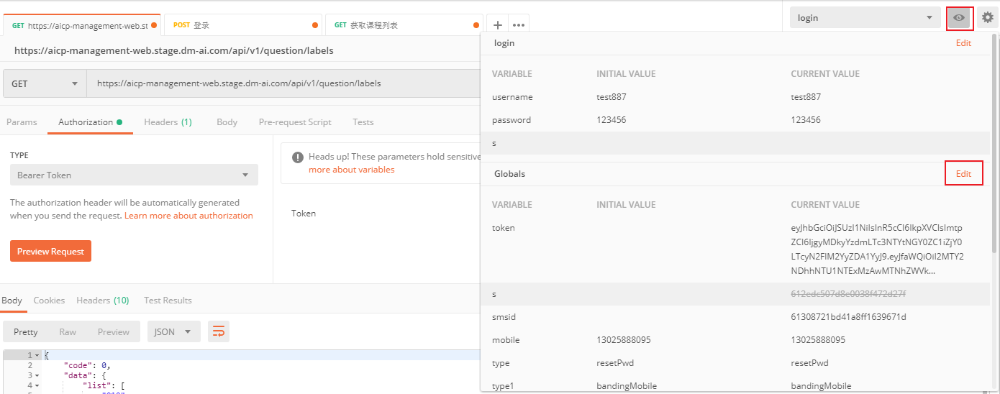
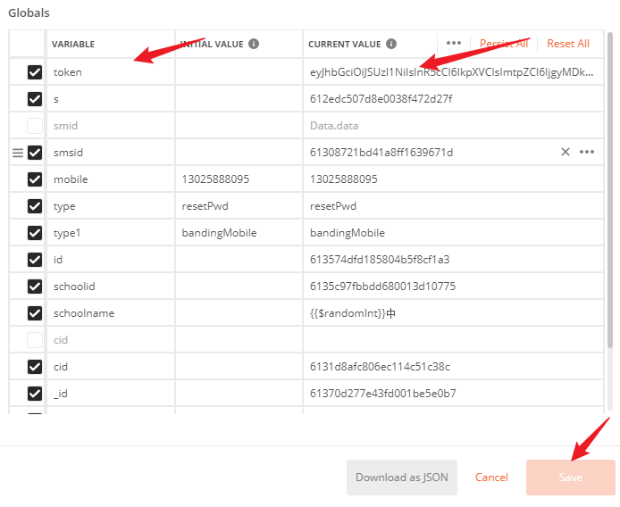
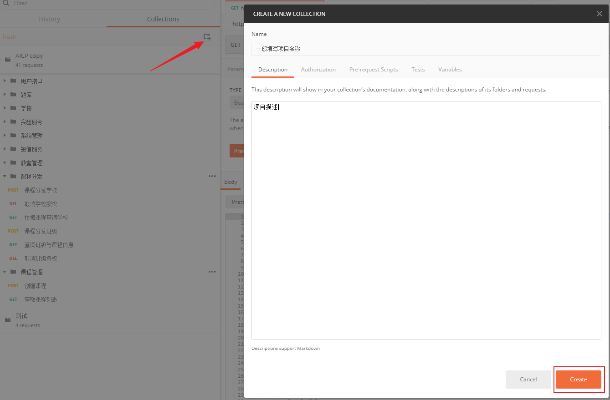
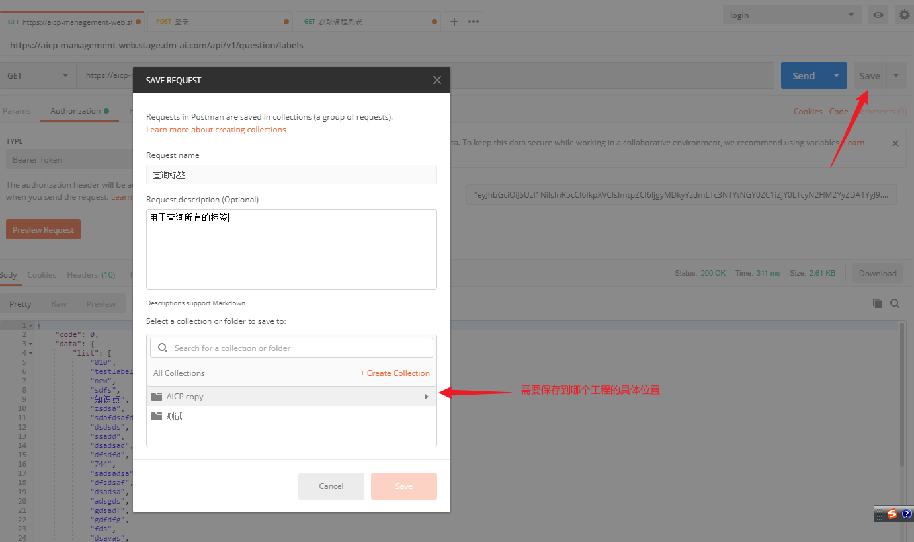

### 特殊

#### starthope接口前缀

> 接口的协议、主机名从 `vue.config.js` 中的 `devServer` 获取（这里是 `devServer.proxy.***.target` ）


### 操作方式

#### 登录

> 获取 `token` 值备用。

| --       | --                                             |
| -------- | ---------------------------------------------- |
| 请求类型 | POST                                           |
| 路径     | http://aicp-user.stage.dm-ai.com/v1/user/login |

| Headers      | --               |
| ------------ | ---------------- |
| Content-Type | application/json |

`Body`  o raw

```
{
    "username":"yyds",
    "password":"123456"
}
```


#### 请求所有标签

| --       | --                                                           |
| -------- | ------------------------------------------------------------ |
| 请求类型 | GET                                                          |
| 路径     | https://aicp-management-web.stage.dm-ai.com/api/v1/question/labels |

| Authorization |                                     |
| ------------- | ----------------------------------- |
| Bearer Token  | 粘贴 Token 值或全局变量 `{{Token}}` |


#### 获取课程列表

| --       | --                                                           |
| -------- | ------------------------------------------------------------ |
| 请求类型 | GET                                                          |
| 路径     | https://aicp-course.stage.dm-ai.com/api/course/published/all |

| Authorization |               |
| ------------- | ------------- |
| Bearer Token  | 粘贴 Token 值 |

| Parmas   |      |
| -------- | ---- |
| pagesize | 1    |
| page     | 1    |

#### 全局变量

> 设置后可以在相关请求中通过双括号语法引入。

| --                | --                           |
| ----------------- | ---------------------------- |
| initial value     | 可以分享给别人使用的变量值   |
| **current value** | 当前自己使用该变量时变量的值 |





#### 环境变量

https://blog.csdn.net/qq_36662437/article/details/105022694

#### 新建工程

> 往往用一个 `Collections` 表示一个工程，方便管理。



#### 保存接口

> 在新建接口并验证后，可以将接口保存到工程中。



#### 新建目录或请求

> 点击左侧工程或文档处的 `···`，可以重命名、新建目录或在当前目录新建请求。

