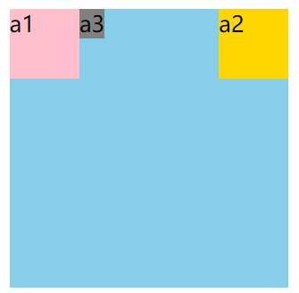

## 需求实现


### 添加外部元素实现两种背景

> 要求出现两种不同的背景色，仅通过一个元素实现不太现实。

```vue
<!-- 修改前 -->
<div class="lab-content-inner" v-if="item.isExpand" v-html="item.showSteps"></div>

<!-- 修改后 -->
<div class="lab-content" v-if="item.isExpand" >
  <div class="lab-content-inner" v-html="item.showSteps"></div>
</div>
```


### 更改行内元素内嵌的块元素  

> 行内元素内部放块级元素是不太合规吧，但实际操作上确实能改变块级元素的样式。

```vue
<span>abc<p>尝试改样式</p></span>

<style lang="less">
span {
  p {
    display: inline;
    border: 1px solid red;
  }
}
</style>
```


### 文字旁的图标定位

> 直接以文字所在 `span` 标签作为相对定位元素，能更容易实现效果。

```vue
<span>
  {{name}}
  <i class="el-icon-female"></i>
</span>	
```

```less
span {
  position: relative;
  i {
    position: absolute;
  }
}	
```


### 组件内部的图标定位

> 图标的位置很适合用组件来子绝父相，但由于组件自身的原因，不能直接将图标放入组件内（tabs）。
>
> 此时可以用给组件添加一个父元素，将图标作为组件的同胞节点进行子绝父相定位。


### 滚动条样式的修改

> 该方案不兼容IE浏览器，且IE的自身方案不能改变滚动条尺寸。

```html
<div class="inner">
  <div class="innerbox">
    <p style="height:200px;">内容A</p>
    <p style="height:400px;">内容B</p>
    <p>内容C</p>
  </div>
</div>
```

```less
.inner{
    width: 265px;
    height: 400px;
}
.innerbox{
    overflow-y: auto;
    height: 100%;
}
/* 滚动条，高宽分别对应横竖滚动条的尺寸 */
.innerbox::-webkit-scrollbar {
    width: 4px;
}
/* 滚动的滑块 */
.innerbox::-webkit-scrollbar-thumb {
    border-radius: 10px;
    -webkit-box-shadow: inset 0 0 5px rgba(0,0,0,0.2);
    background: rgba(0,0,0,0.2);
}
/* 外层轨道 */
.innerbox::-webkit-scrollbar-track {
    -webkit-box-shadow: inset 0 0 5px rgba(0,0,0,0.2);
    border-radius: 0;
    background: rgba(0,0,0,0.1);
}
```


属性 | 说明
:- | :-
::-webkit-scrollbar | 滚动条整体部分，可以设置宽/度
::-webkit-scrollbar-button | 滚动条两端的按钮
::-webkit-scrollbar-track | 外层轨道
::-webkit-scrollbar-track-piece |  内层滚动槽
::-webkit-scrollbar-thumb | 滚动的滑块
::-webkit-scrollbar-corner | 边角
::-webkit-resizer | 定义右下角拖动块的样式


### 纵向滚动且不显示滚动条

> 不兼容IE。

```less
demo {
  height: 100px;
  overflow-y: auto;
  -ms-overflow-style: none;   /* IE 10+ */
  scrollbar-width: none;      /* firefox */
  &::-webkit-scrollbar {      /* Chrome Safari */
    display: none;
  }
}
```


### 粘性布局的替代方案

> 从BOSS直聘修改信息的目录项动态固定布局得到的启发。

1. 一开始采用正常的定位（block），并随页面上移而上移。
2. 监听页面的滚动，只有当到达一定位移时，给目录项添加 `display:fixed;` 和定位属性。


### 三层馅内外固宽中间弹性

> |CBABC|
>
> C和A固定宽度。要求视窗窄时，C和A保留；视窗宽时，出现弹性的B。

需要添加一层元素（B）在中间，因为涉及到3个色区。 直接给元素（B）背景色，并给最外层元素添加最小宽度 `min-width: calc(A + 2 * C) ` 即可。


### 微信小程序二维码

> 没有图片路径时，其周边会有奇怪的灰色边框。

```vue
<span class="weixin">
  <span class="weixin-title">
    <!-- 这里带了一个ui组件的图标 -->  
    <i class="el-icon-mobile-phone"></i>微信小程序
  </span>
  
</span>
```

```less
.weixin {
  position: relative;
    .code {
      display: none;
      position: absolute;
      // 位移属性自己调整
      top: 29.5px;
      left: 0;
      z-index: 1000;
      width: 128px;
      height: 128px;
      padding: 11px;
      box-shadow: 0 0 5px hsla(0,0%,80%,.6);
      background-color: #fff;
  }
  &:hover .code {
	display: block;
  }
}
```

### 模拟fixed

> 一侧固定高度，另一侧固定高度的同时，内容超出高度。
>
> 该方案存在一致命问题，只有当鼠标进入 `class="left"` 的元素时，滚动鼠标才有效果。

```html
<main>
  <div class="left">...</div>
  <div class="right">...</div>
</main>
```

```less
main {
  height: 300px;
  width: 500px;
  border: 1px solid gray;
  div {
    display: inline-block;
  }
  .left {
    width: 200px;
    height: 100%;
    overflow-y: auto;
    vertical-align: bottom;
    /* 隐藏滚动条 */
  } 
  .right {
    width: 100px;
    height: 100%;
  }
}
```

### 悬停切换标签页

> 当鼠标在项之间移动时，在同一区域动态显示不同的内容。 其核心在于使需要动态显示的元素子绝父相到同一个祖先元素上。

```vue
<ul>
  <li class="a-box">
    <span class="text">a</span>
    <div class="a"></div>
  </li>
  <li class="b-box">
    <span class="text">b</span>
    <div class="b"></div>
  </li>
  <li class="c-box">
    <span class="text">c</span>
    <div class="c"></div>
  </li>
</ul>
```

```less
ul {
  width: 30px;
  position: relative;
  .a-box:hover .a,
  .b-box:hover .b,
  .c-box:hover .c {
    display: block;
  }
  .a, .b, .c {
    display: none;
    position: absolute;
    right: 0;
    top: 0;
    transform: translateX(100%);
    width: 80px;
    height: 80px;
  }
  .a {background: skyblue;}
  .b {background: pink;}
  .c {background: gray;}
}
```


### 解决伪元素遮盖

> 需求：通过伪元素来 *营造* 背景色，这个区域需与祖先元素一样宽。

1. 给其祖先元素添加上较高的z-index，解决更外层背景（更外层的祖先元素）覆盖的问题。
2. 祖先元素以下的元素不要添加定位属性。
3. 伪元素设置为绝对定位，left:0 right:0 即宽与祖先元素一致，z-index设置为-1。
4. 祖先元素下级的元素，背景色为透明，配合伪元素显色。


### 伪元素穿透

> `pointer-events:none;` 可以让元素的鼠标事件不触发，同时去除鼠标样式，强行“透过”该元素。

设置 | 元素 | 视觉上 | 悬浮效果 | 点击效果
:-: | :-: | :-: | :-: | :-:
/ | span | 被遮盖 | √ | √
/ | 伪元素 | 能显现 | √ | √
① | span | 能显现 | √ | √
① | 伪元素 | 能显现 | × | ×
② | span | 被遮盖 | √ | √
② | 伪元素 | 能显现 | × | ×
①② | span | 能显现 | √ | √
①② | 伪元素 | 能显现 | × | ×

> 任何组合伪元素都能显示，其显示的优先级依赖于特殊定位的祖先元素。

```less
<span @click="doSome">胡桃不是桃</span>

span {
  cursor: pointer;
}
span::after {
  position: absolute;
  content: '';
  left: 0;
  right: 0;
  height: 100px;
  background-color: pink;
  /* ① */
  z-index: -1;
  /* ② */
  pointer-events:none;
}
```


### 在表格行上添加边框半径

> 只能将 border-radius 应用于 td，[而不是 tr 或 table](https://stackoverflow.com/questions/4094126/how-to-add-border-radius-on-table-row)。

```less
/* 思路 */
table { border-collapse: separate; }
td { border: solid 1px #000; }
tr:first-child td:first-child { border-top-left-radius: 10px; }
tr:first-child td:last-child { border-top-right-radius: 10px; }
tr:last-child td:first-child { border-bottom-left-radius: 10px; }
tr:last-child td:last-child { border-bottom-right-radius: 10px; }
```


### 悬浮提示修改示例

> 感觉上传也可以用，主要是样式（颜色）效果好看

```less
.trigger-btn.edit:hover:before {
  display: inline-block;
  position: absolute;
  top: 0px;
  left: 0px;
  content: '点击修改';
  width: 100%;
  height: 100%;
  color: #fff;
  background-color: rgba(0, 0, 0, .7);
  border-radius: 20px;
  line-height: 35px;
}
```


## 现象解释

### 父元素与子元素的外边距合并  

> 本质是外边距的合并现象，即使容器的外边距为0，也能与子元素的外边距合并，且合并的位置在容器之外，震惊。

```vue
<div class="page-container">
  <div class="top-bg"></div>
  <div class="page-content">
    <div class="title">湖州吴兴浩瀚人才市场</div>
  </div>
</div>
```

```less
.page-container {
  position: relative;
  // margin-top: 140px;  此时给容器设置较小的外边距，也不会改变布局
  .top-bg {
    position: absolute;
    top: 0;
    width: 100%;
    height: calc(50vh);
    border: 1px solid red;
  }
  .page-content {
    .title {
      margin-top: 150px; 
      // padding-top: 150px;  用内边距可以避免合并问题
    }
  }
}
```

#### 阻断方式

索引 | 满足其下任一条件即可 
:-: | :-
 ① | 父元素拥有上边界 
 ② | 父元素拥有上内边距  
 ③ | 在文本流中，于该子元素的前面父元素内还存在其他元素或文本 
 ④ | 如果是爷孙元素，而父元素又存在上边界、上内边距或内容 


### 浮动的行内元素宽高生效

> 本质上变成了行内块，故设置的宽高能生效。



```html
<div>
  <a class="a1">a1</a>
  <a class="a2">a2</a>
  <a class="a3">a3</a>
</div>
```

```less
div {
  width: 200px;
  height: 200px;
  background: skyblue;
  a {
    width: 50px;
    height: 50px;
  }
  .a1 {
    float: left;
    background: pink;
  }
  .a2 {
    float: right;
    background: gold;
  }
  .a3 {
    background: grey;
  }
}
```


### 行高影响布局

> 行高本身会影响垂直方向的布局，且其的继承特性，经常给人带来迷惑。


### 悬浮菜单的闪现消失

> 在将鼠标移动到子元素（菜单）前，其消失。是因为其容器本身在位置上出现了断层导致。

```css
.father:hover .menu {
  display: block;
}
```


### 判断错误—根据选择器找到元素  

> 很容易误将相同样式的元素，归类到同一个父元素之下，实际上不一定。


## 疑惑行为

### 深度选择器的失效

> 以下两种设置方法中，只有一种能影响到内部组件的样式，另一种无效。

```less
.hardwareModal {
  /deep/ .ant-modal-content {}
}

/deep/ .hardwareModal {
  .ant-modal-content {}
}
```


### nth子选择器选择特定的元素

```css
// 可行
&:nth-child(3n+3) {
  margin-right: 0;
}
// 不可行
&:nth-child(3+3n) {
  margin-right: 0;
}
```


### 背景颜色覆盖

> 有时候，在复写样式时，仅当设置前者时样式发挥作用。  

```css
.any {
  background: skyblue;
}

.any {
  background-color: skyblue;
}
```


### 行内块元素的外边距影响同级行内元素

> 需要调整行内块元素的垂直位置，但给它添加上外边距调整时，发现影响了隔壁的行内元素的垂直高度。
>
> 推测是外边距合并到父元素的外边距上去了。  

```css
demo {
  transform: translateY(5.5px);
}
```


