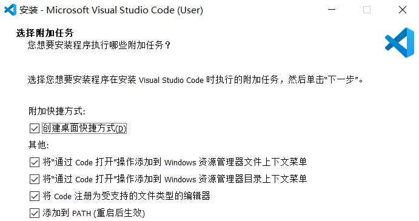
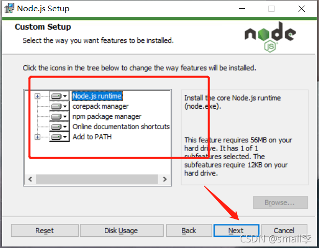
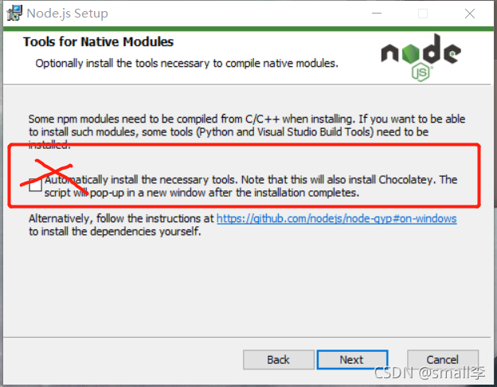
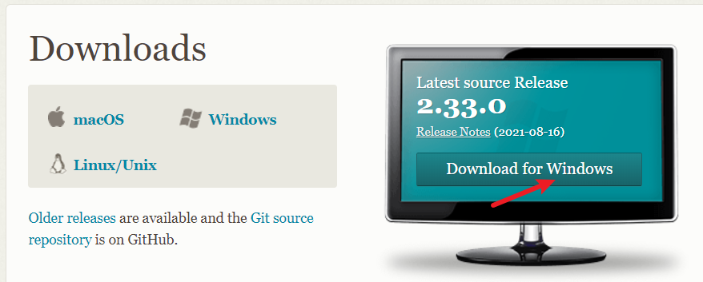
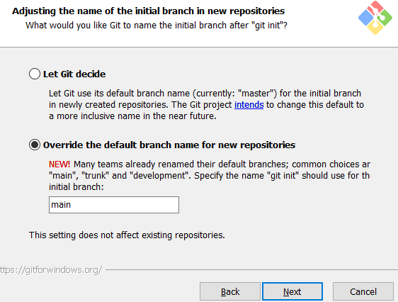

### 项目总览

项目 | 说明
:- | :-
Chrome | 可以轻松将国外网站翻译成中文
VSCode | /
Node | Webpack的依赖环境、默认绑定npm
[Typora](https://www.typora.io/) | /
[Snipaste](https://www.snipaste.com/) | 截图提色工具，需要点击执行文件先压缩 
Git | 代码版本管理库

### Chrome

设置 | 说明
:- | :-
搜索引擎 | 将百度作为默认搜索引擎
下载内容 | 下载前询问保存位置
语言 | 在非所使用语言页面询问翻译

### Vscode 
> 可以进行各种[初始化拓展](https://github.com/SpringLoach/origin-2021/blob/main/小功能/VS-Code.md)和自动保存。



### Node

下载中文网的[稳定版](http://nodejs.cn/download/current/)（LTS），原网站下载速度堪忧。  

> 这里直接 `next` 即可  
> 
  

索引 | 说明
:-: | :-
① | node运行环境
② | 安装包管理工具npm
③ | 在线文件快捷方式
④ | 添加到环境变量

> 安装npm模块的依赖工具，体积较大安装较久，这一步不用勾选



#### 解决报错：不允许操作①

```shell    
npm ERR! Error: EPERM: operation not permitted
```
1. Win + X
2. Windows PowerShell（管理员）
3. 在这里输入即可

#### 解决报错：不允许操作②

> 找到 C:\Users\\账户\\.npmrc文件，删除即可。

#### 更改缓存地址
> 由于全局模块的安装和缓存地址默认配置到C盘，占空间且不便管理，有必要更改。

获取当前全局及缓存地址
```shell
npm config get prefix
npm config get cache
```

修改全局及缓存地址
```shell
npm config set prefix "D:\某些路径\npm_global"
npm config set cache "D:\同个路径\npm_cache"
```

> 由于修改了全局安装及缓存路径，系统将找不到在这之后安装的工具，需要重新配置环境变量。


重配环境变量
> 电脑图标右键-属性-高级系统设置-环境变量

- 系统变量

性质 | 变量 | 值
:-: | :-: | :-: 
新增变量 | NODE_PATH | D:\某些路径\npm_global\node_modules

- 用户变量
> 找到变量下的 C:\Users\用户名\AppData\Roaming\npm，进行替换

性质 | 变量 | 值
:-: | :-: | :-: 
修改变量 | Path | D:\某些路径\npm_global

再次查看版本  
> 提示无法加载文件，因为在此系统上禁止运行脚本。  

1. Win + X
2. 选择 `Windows PowerShell（管理员）`
3. 输入 `set-ExecutionPolicy RemoteSigned`
4. 输入 `y`

#### 安装淘宝NPM镜像

> 使用 `cnpm` 代替 `npm`，在国内的下载速度更快。

1. 安装 cnpm

```elm
npm install -g cnpm --registry=https://registry.npm.taobao.org
```

1. 使用 cnpm 安装模块

```elm
cnpm install [name]
```

------

#### 安装webpack
> 在webpack4后，这两项已经被分开而不是放在同一个包中以实现更好的管理。 

```shell
cnpm install webpack -g
cnpm install webpack-cli -g
webpack -v
```

### Git

索引 | 说明
:-: | :-
① | 前往[官网](https://git-scm.com/downloads)下载
② | 更改安装目录
③ | 更改了初始仓库名
④ | [其他](https://www.cnblogs.com/xueweisuoyong/p/11914045.html)都[使用](https://www.cnblogs.com/qingmuchuanqi48/articles/15088196.html)默认值 





查看版本并[提交](https://github.com/SpringLoach/origin-2021/blob/main/git/Git速查.md#提交操作者信息)操作者信息  
```shell
git --version
```

#### 解决报错：初次推送
> 问题发生在[推送当前分支到远程并关联时](https://github.com/SpringLoach/origin-2021/blob/main/git/Git速查.md#将本地仓库关联并推送到远程库)，推测网络原因导致，多尝试几遍即可，会提示授权。  

```shell
fatal: unable to access '仓库地址': OpenSSL_read: Connection was aborted, errno 10053
```


----


