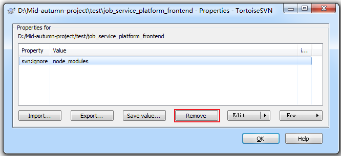

### 初次操作

#### 更改账户信息  

> 项目/桌面 → 右键 TortoiseSVN → 设置 → 已保存数据 → 清除 → 再次svn更新/提交 → 输入账号密码  

### vpn文档使用

#### 导入本地文件(保持远程关联)

1. 在浏览器的svn文档页面，复制 Repository URL

2. 在本地资源管理器中右键 => TortoiseSVN => Checkout...

#### 本地文件的更新/提交

- 更新：在本地资源管理器中右键 => TortoiseSVN => Update

- 提交：在本地资源管理器中右键 => TortoiseSVN => Commit...

### 其它操作

#### 取消忽略的文件

> 打开文件夹，在项目处右键 - TortoiseSvn - Properties

